# Novelty Evaluation: Conformal Inference of Counterfactuals and Individual Treatment Effects

## Run Metadata

**Run context**

| Field | Value |
|-------|-------|
| Timestamp (America/New_York) | 2026-04-01 10:25:35 -0400 America/New_York (UTC: 2026-04-01T14:25:35Z) |
| Branch | copilot/fix-serious-dedup-issue |
| Commit | [`75d8ac4`](https://github.com/yulinl2/Open-Idea-Sourcing/commit/75d8ac45b961ec5826eef2173a1b32d333d30677) |
| CI Run | [Run #23853642391](https://github.com/yulinl2/Open-Idea-Sourcing/actions/runs/23853642391) |

**Configuration**

| Field | Value |
|-------|-------|
| Model | gpt-5.4 |
| Input | https://arxiv.org/abs/2006.06138 |
| Code version | 2.6.1 |

**Performance**

| Field | Value |
|-------|-------|
| Total runtime | 67.0s |
| └─ parsing | 10.4s |
| └─ decomposition | 12.6s |
| └─ similarity | 0.0s |
| └─ domain_references | 10.2s |
| └─ evaluation | 32.9s |

## Pipeline Job Log

```mermaid
gantt
    title Pipeline Run — Conformal Inference of Counterfactuals and Individual Treatment Effects
    dateFormat x
    axisFormat %S.%Ls
    section PaperParser
    Parse paper :done, 0, 10360ms
    section LLM (gpt-5.4)
    Idea decomposition :done, 10360, 12560ms
    section ReferenceStore
    Load user references :done, 10360, 1ms
    section SimilaritySearch
    Similarity search :done, 22920, 1ms
    section LLM (gpt-5.4)
    Domain references :done, 22920, 10150ms
    Duplication check :done, 0, 4152ms
    Combination check :done, 4152, 6152ms
    Equivalence check :done, 10304, 7760ms
    Synthesis :done, 18064, 2680ms
    Reference annotation :done, 20744, 12197ms
```



**PaperParser**

| # | Job | Start (s) | Duration (s) | Input | Output |
|---|-----|----------:|-------------:|-------|--------|
| 1 | Parse paper | 0.00 | 10.36 | 2006.06138.pdf | "Conformal Inference of Counterfactuals and Individual Treatment Effects", 111859 chars |

<details>
<summary>📋 Parse paper — details</summary>

**Title:** Conformal Inference of Counterfactuals and Individual Treatment Effects

**Authors:** Lihua Lei, Emmanuel J. Candès

**Abstract:** Evaluating treatment effect heterogeneity widely informs treatment decision making. At the moment, much emphasis is placed on the estimation of the conditional average treatment effect via flexible machine learning algorithms. While these methods enjoy some theoretical appeal in terms of consistency and convergence rates, they generally perform poorly in terms of uncertainty quantification. This is troubling since assessing risk is crucial for reliable decision-making in sensitive and uncertain …

**Sections (1):**
- From Average Effects To Individual Effects

</details>

**LLM (gpt-5.4)**

| # | Job | Start (s) | Duration (s) | Input | Output |
|---|-----|----------:|-------------:|-------|--------|
| 2 | Idea decomposition | 10.36 | 12.56 | paper content | concept tree |

<details>
<summary>📋 Idea decomposition — details</summary>

**Core concept:** A conformal inference framework for causal inference that constructs prediction intervals for counterfactual outcomes and individual treatment effects with finite-sample average coverage in randomized experiments and approximately doubly robust coverage in observational or imperfect-compliance settings.
**Concept tree:** 52 node(s), depth 6

</details>

**ReferenceStore**

| # | Job | Start (s) | Duration (s) | Input | Output |
|---|-----|----------:|-------------:|-------|--------|
| 3 | Load user references | 10.36 | 0.00 | data/references.json | 1 ref(s) loaded |

**SimilaritySearch**

| # | Job | Start (s) | Duration (s) | Input | Output |
|---|-----|----------:|-------------:|-------|--------|
| 4 | Similarity search | 22.92 | 0.00 | TF-IDF cosine on 1 ref(s) | top-1: 0.31×Conformal Prediction Under Covariat… |

<details>
<summary>📋 Similarity search — details</summary>

**Query (key content excerpt):**
```
Title: Conformal Inference of Counterfactuals and Individual Treatment Effects

Abstract: Evaluating treatment effect heterogeneity widely informs treatment decision making. At the moment, much emphasis is placed on the estimation of the conditional average treatment effect via flexible machine lear…
```

### All loaded references

| Source | Count |
|--------|-------|
| User corpus | 1 |

**All matches (1):**
| Score | Title | Year | Source |
|------:|-------|------|--------|
| 0.312 | Conformal Prediction Under Covariate Shift | 2020 | user |

</details>

**LLM (gpt-5.4)**

| # | Job | Start (s) | Duration (s) | Input | Output |
|---|-----|----------:|-------------:|-------|--------|
| 5 | Domain references | 22.92 | 10.15 | paper content + 1 similar paper(s) | 6 domain reference(s) |
| 6 | Duplication check | 0.00 | 4.15 | paper content + 1 reference paper(s) | verdict=LOW |
| 7 | Combination check | 4.15 | 6.15 | paper content + 1 reference paper(s) | verdict=LOW |
| 8 | Equivalence check | 10.30 | 7.76 | paper content + 1 reference paper(s) | verdict=LOW |
| 9 | Synthesis | 18.06 | 2.68 | 3 dimension results | verdict=NOVEL, confidence=MEDIUM |
| 10 | Reference annotation | 20.74 | 12.20 | paper + 1 similar paper(s) | 1 annotation(s) |

## Idea Decomposition

**Core concept:** A conformal inference framework for causal inference that constructs prediction intervals for counterfactual outcomes and individual treatment effects with finite-sample average coverage in randomized experiments and approximately doubly robust coverage in observational or imperfect-compliance settings.

### Concept Tree

```
├── - Core problem setup
│   ├── - Goal: quantify uncertainty for individual-level causal quantities, not just average effects
│   │   ├── - Target objects are counterfactual potential outcomes under treatment and control
│   │   └── - Derived target is the individual treatment effect (ITE), defined as the difference between the two potential outcomes
│   ├── - Data and causal framework
│   │   ├── - Potential outcomes framework with observed covariates, treatment assignment, and observed outcome
│   │   └── - Settings considered
│   │       ├── - Completely randomized experiments
│   │       ├── - Stratified randomized experiments
│   │       ├── - Randomized experiments with noncompliance under ignorability-type assumptions
│   │       └── - Observational studies under strong ignorability
│   └── - Main inferential challenge
│       ├── - For each individual, one potential outcome is missing, so ITE is never directly observed
│       ├── - Existing ML-based CATE/ITE estimators may be accurate in point estimation but often give unreliable uncertainty quantification
│       └── - Need interval estimates with valid coverage under weak modeling assumptions
├── - Proposed methodology
│   ├── - Use conformal inference to build interval estimates for unobserved counterfactual outcomes
│   │   ├── - Construct prediction sets for each missing potential outcome conditional on covariates and treatment arm information
│   │   └── - Convert paired counterfactual intervals into an interval for the individual treatment effect
│   ├── - Coverage guarantees by design
│   │   ├── - In perfectly randomized experiments, intervals achieve finite-sample average coverage without assumptions on the outcome model
│   │   └── - In observational studies or randomized studies with ignorable compliance, intervals achieve approximate average coverage under a doubly robust condition
│   │       └── - Coverage is controlled if either
│   │           ├── - the propensity score is estimated accurately, or
│   │           └── - the conditional quantiles of potential outcomes are estimated accurately
│   └── - Output characteristics
│       ├── - Valid uncertainty quantification for counterfactuals and ITEs
│       └── - Intervals intended to be reasonably short while maintaining nominal coverage
└── - Key technical elements in implementation
    ├── - Conformalization of causal prediction
    │   ├── - Define conformity/nonconformity scores based on residuals relative to estimated conditional quantiles or outcome models
    │   └── - Use calibration to transform fitted predictive models into valid predictive intervals
    ├── - Counterfactual interval construction
    │   ├── - Fit models separately for treatment and control potential outcome distributions
    │   ├── - For a target unit, infer the missing potential outcome by conformal prediction using the relevant arm-specific model
    │   └── - Combine observed factual outcome with the counterfactual interval, or combine two potential-outcome intervals, to obtain an ITE interval
    ├── - Randomized-experiment validity mechanism
    │   ├── - Exploit exchangeability induced by random assignment (possibly within strata)
    │   └── - This yields finite-sample average coverage regardless of the unknown data-generating process
    ├── - Observational / noncompliance extension
    │   ├── - Reweight or adjust conformal scores using estimated propensity information
    │   ├── - Incorporate conditional quantile estimation for potential outcomes
    │   └── - Establish doubly robust approximate validity: one of two nuisance components being accurate suffices
    ├── - Technical guarantee type
    │   ├── - Average marginal coverage rather than exact conditional coverage
    │   ├── - Finite-sample exactness in randomized settings
    │   └── - Approximate asymptotic control in more general settings with nuisance estimation
    └── - Practical ingredients
        ├── - Flexible machine learning models may be used for nuisance estimation
        ├── - Calibration step corrects raw predictive intervals to restore coverage
        └── - Empirical evaluation compares coverage and interval length against existing methods
```

**Overall verdict:** ✅ **NOVEL** (confidence: MEDIUM)

## Summary

The paper appears novel relative to the provided reference set. While it clearly draws on the general weighted/non-exchangeable conformal prediction ideas in REF-1, its main contributions are specific to causal inference: conformal intervals for counterfactual outcomes and ITEs, treatment-assignment and noncompliance settings, and doubly robust-style coverage arguments in observational regimes. Based on the evidence given, this is best viewed as a substantive problem-specific extension rather than duplication, trivial combination, or a disguised reformulation of prior work.

## Detailed Analysis

### Direct Duplication

<details>
<summary><strong>Risk level:</strong> 🟢 LOW</summary>

The submitted paper does not appear to be a direct duplicate of the only listed reference, REF-1. While both works involve conformal prediction beyond the standard exchangeable setting and both discuss weighting/adjustment ideas under distributional mismatch, their core scientific targets are different. The submitted paper is about causal inference: constructing interval estimates for counterfactual outcomes and individual treatment effects under randomized experiments, noncompliance, and observational studies, with finite-sample average coverage in randomized settings and approximate doubly robust coverage otherwise. By contrast, REF-1 is about conformal prediction under covariate shift, i.e., prediction when train and test covariate distributions differ.

The overlap is therefore at the level of general conformal methodology, not at the level of identical problem formulation, estimands, assumptions, or results. The submitted paper’s central contributions—counterfactual/ITE inference in the potential outcomes framework and doubly robust causal coverage guarantees—are not essentially identical to the covariate-shift conformal framework described in REF-1. Based only on the provided reference list, there is insufficient evidence of direct duplication.

</details>

### Simple Combination

<details>
<summary><strong>Risk level:</strong> 🟢 LOW</summary>

Based only on the provided reference list, the submitted paper is not well characterized as a mere mechanical combination of existing works. The only listed reference, REF-1, contributes a general methodological ingredient: extending conformal prediction beyond strict exchangeability by using weighting ideas under distribution shift. That maps only partially onto the submitted paper’s observational/noncompliance setting, where approximate coverage is pursued despite the lack of simple randomized exchangeability. In that limited sense, the submitted paper appears to reuse the broad idea that conformal calibration can be adapted when the target and calibration distributions differ.

However, the main structure of the submitted paper goes beyond what can be traced to REF-1 alone. The paper’s central object of inference is not ordinary prediction under covariate shift, but counterfactual outcomes and individual treatment effects in the potential-outcomes framework, with distinct guarantees for randomized experiments, stratified designs, and observational settings, plus a doubly robust-style coverage claim. None of those causal targets, design distinctions, or the counterfactual-to-ITE interval construction are identifiable from REF-1 as listed. So while one component plausibly derives from REF-1’s weighted conformal machinery, the overall contribution is not reducible to “REF-1 plus a standard causal wrapper” on the evidence available here. With only this reference set, the combination appears to involve a genuine problem-specific synthesis rather than a trivial aggregation of known parts.

**Cited references:** `REF-1`

</details>

### Methodological Equivalence

<details>
<summary><strong>Risk level:</strong> 🟢 LOW</summary>

The submitted paper is not subtly equivalent to REF-1, though there is a clear methodological overlap at the level of one ingredient.

1. **Shared core tool with REF-1: weighted/non-exchangeable conformal calibration**
   - REF-1 studies conformal prediction when the calibration and test distributions differ because of **covariate shift**, and restores validity using **weighted conformal scores/quantiles**.
   - The submitted paper’s observational and noncompliance extensions appear to use a closely related idea: the target counterfactual distribution for a unit is not directly exchangeable with the observed sample, so coverage is adjusted using **propensity-based weighting** and nuisance estimation.
   - At a high level, this is mathematically analogous to applying conformal prediction under a distribution mismatch, where the mismatch is induced by treatment assignment / missing counterfactuals rather than ordinary train-test shift.

2. **Why this does not amount to equivalence**
   - REF-1’s target is **prediction under covariate shift** for an observed outcome; the submitted paper’s target is **counterfactual potential outcomes and ITEs** under the potential-outcomes framework.
   - The submitted paper adds causal structure absent from REF-1:
     - treatment/control potential outcomes,
     - randomized vs observational regimes,
     - counterfactual missingness,
     - interval construction for **ITEs** by combining potential-outcome uncertainty,
     - a **doubly robust-style coverage statement** involving either propensity or outcome-quantile accuracy.
   - These are not just cosmetic renamings of REF-1’s setup. Even if one component of the observational method can be interpreted as a causalized instance of weighted conformal prediction, the overall method is not a re-derivation of REF-1.

3. **Closest possible equivalence**
   - The strongest claim supportable from the provided references is that the submitted paper’s observational/noncompliance conformal adjustment is a **problem-specific adaptation** of the weighted conformal logic in REF-1.
   - But the randomized-experiment finite-sample average coverage result and the ITE/counterfactual construction are not reducible to REF-1 from the evidence given.

</details>

## Reference Papers

> **Score:** TF-IDF cosine similarity (0–1). Higher = more textual overlap with the submitted paper.

| Ref | Score | Source | Title | Year | Authors |
|-----|-------|--------|-------|------|---------|
| REF-1 | 0.31 | `user` | [Conformal Prediction Under Covariate Shift](https://arxiv.org/abs/1904.06019) | 2020 | Ryan J. Tibshirani, Rina Foygel Barber et al. |

### Derivation Analysis

**Derivation map:**

- **Goal**: quantify uncertainty for individual-level causal quantities, not just average effects: appears novel
- **Target objects are counterfactual potential outcomes under treatment and control**: appears novel
- **Derived target is the individual treatment effect (ITE), defined as the difference between the two potential outcomes**: appears novel
- **Potential outcomes framework with observed covariates, treatment assignment, and observed outcome**: appears novel
- **Settings considered — completely randomized experiments**: appears novel
- **Settings considered — stratified randomized experiments**: appears novel
- **Settings considered — randomized experiments with noncompliance under ignorability-type assumptions**: appears novel
- **Settings considered — observational studies under strong ignorability**: appears novel
- **Main challenge**: one potential outcome is missing for each unit, so ITE is never directly observed: appears novel
- **Critique that ML-based CATE/ITE methods lack reliable uncertainty quantification**: appears novel
- **Need interval estimates with valid coverage under weak modeling assumptions**: REF-1
- **Use conformal inference to build prediction intervals for unobserved counterfactual outcomes**: appears novel
- **Construct prediction sets for each missing potential outcome conditional on covariates and treatment arm information**: appears novel
- **Convert paired counterfactual intervals into an interval for the individual treatment effect**: appears novel
- **Finite-sample average coverage in perfectly randomized experiments**: REF-1 for the conformal coverage template; causal/randomization application appears novel
- **Distribution-free validity without assumptions on the outcome model**: REF-1
- **Observational / imperfect-compliance extension via approximate coverage**: REF-1
- **Doubly robust coverage property**: appears novel
- **Coverage controlled if either propensity score or conditional quantiles are estimated accurately**: appears novel
- **Valid uncertainty quantification for counterfactuals and ITEs**: appears novel
- **Reasonably short intervals while maintaining nominal coverage**: REF-1
- **Conformalization of causal prediction**: REF-1
- **Define conformity/nonconformity scores based on residuals relative to estimated conditional quantiles or outcome models**: REF-1
- **Calibration step transforming fitted predictive models into valid predictive intervals**: REF-1
- **Fit models separately for treatment and control potential outcome distributions**: appears novel
- **Infer the missing potential outcome using the relevant arm-specific model**: appears novel
- **Combine observed factual outcome with counterfactual interval, or combine two potential-outcome intervals, to obtain an ITE interval**: appears novel
- **Validity mechanism exploiting exchangeability induced by random assignment (possibly within strata)**: REF-1 for exchangeability-based conformal logic; randomized causal specialization appears novel
- **Reweight or adjust conformal scores using estimated propensity information**: REF-1
- **Incorporate conditional quantile estimation for potential outcomes**: REF-1
- **Establish doubly robust approximate validity with one accurate nuisance component sufficing**: appears novel
- **Average marginal coverage rather than exact conditional coverage**: REF-1
- **Finite-sample exactness in randomized settings**: REF-1 for exact finite-sample conformal validity; causal setting appears novel
- **Approximate asymptotic control in general settings with nuisance estimation**: REF-1
- **Flexible machine learning models for nuisance estimation**: REF-1
- **Empirical comparison of coverage and interval length against existing methods**: appears novel

**Combination analysis:**

The submitted paper looks primarily like a transplantation of conformal prediction machinery from REF-1 into the causal inference/potential-outcomes setting, with the key imported ingredients being exchangeability-based finite-sample coverage, weighted conformal ideas under distribution shift, and calibration of predictive intervals. What remains after removing those derived conformal components is the paper’s main substantive contribution: a causal reformulation for counterfactual and ITE interval estimation, plus the doubly robust coverage guarantee tied specifically to propensity scores and potential-outcome quantiles.

**Novel elements:**

- Applying conformal prediction specifically to infer counterfactual potential outcomes and individual treatment effects
- Constructing ITE intervals by combining counterfactual/potential-outcome prediction sets
- Finite-sample average coverage guarantees tailored to completely randomized and stratified randomized experiments
- Extension to noncompliance and observational studies under causal assumptions
- The doubly robust coverage result: validity if either the propensity score or the conditional quantiles of potential outcomes are well estimated
- The causal interpretation of weighted/conformal calibration in terms of treatment assignment and missing counterfactuals
- Empirical demonstration that existing causal uncertainty methods have substantial coverage deficits relative to the proposed conformalized approach

## Main Domain References

1. **[Estimating Individual Treatment Effect: Generalization Bounds and Algorithms](https://www.semanticscholar.org/search?q=Estimating+Individual+Treatment+Effect%3A+Generalization+Bounds+and+Algorithms&sort=Relevance)**, 2016
   *Susan Athey, Guido W. Imbens*
   <details>
   <summary>Why this matters</summary>

   A foundational modern paper on estimating heterogeneous and individual treatment effects with machine learning. It helped define the contemporary ITE/CATE estimation agenda that the submitted paper extends by focusing on valid uncertainty quantification rather than point estimation alone.

   </details>

2. **[Generalized Random Forests](https://www.semanticscholar.org/search?q=Generalized+Random+Forests&sort=Relevance)**, 2019
   *Susan Athey, Julie Tibshirani, Stefan Wager*
   <details>
   <summary>Why this matters</summary>

   A seminal method for nonparametric estimation of conditional average treatment effects and other local causal parameters. It is one of the central references for flexible CATE estimation, providing key context for why strong predictive methods exist but do not by themselves solve the interval coverage problem addressed here.

   </details>

3. **[Causal Effects in Nonexperimental Studies: Reevaluating the Evaluation of Training Programs](https://www.semanticscholar.org/search?q=Causal+Effects+in+Nonexperimental+Studies%3A+Reevaluating+the+Evaluation+of+Training+Programs&sort=Relevance)**, 1983
   *Paul R. Rosenbaum, Donald B. Rubin*
   <details>
   <summary>Why this matters</summary>

   Classic paper formalizing the propensity score and strong ignorability framework for observational causal inference. The submitted paper’s assumptions for observational studies and its doubly robust coverage claims are rooted in this potential-outcomes identification framework.

   </details>

4. **[Double/Debiased Machine Learning for Treatment and Structural Parameters](https://www.semanticscholar.org/search?q=Double%2FDebiased+Machine+Learning+for+Treatment+and+Structural+Parameters&sort=Relevance)**, 2018
   *Victor Chernozhukov, Denis Chetverikov, Mert Demirer, Esther Duflo, Christian Hansen, Whitney Newey, James Robins*
   <details>
   <summary>Why this matters</summary>

   Canonical reference for combining machine learning with orthogonalization and doubly robust ideas in causal inference. The submitted paper’s “doubly robust” coverage property is closely related in spirit to this literature, even though the target is predictive interval validity for counterfactuals and ITEs.

   </details>

5. **[Distribution-Free Predictive Inference for Regression](https://www.semanticscholar.org/search?q=Distribution-Free+Predictive+Inference+for+Regression&sort=Relevance)**, 2018
   *Jing Lei, Max G’Sell, Alessandro Rinaldo, Ryan J. Tibshirani, Larry Wasserman*
   <details>
   <summary>Why this matters</summary>

   One of the key modern conformal prediction references establishing finite-sample, distribution-free predictive inference for regression. It provides the methodological backbone for using conformal methods to obtain valid intervals, which the submitted paper adapts to the causal counterfactual setting.

   </details>

6. **[Algorithmic Learning in a Random World](https://www.semanticscholar.org/search?q=Algorithmic+Learning+in+a+Random+World&sort=Relevance)**, 2005
   *Vladimir Vovk, Alexander Gammerman, Glenn Shafer*
   <details>
   <summary>Why this matters</summary>

   The foundational monograph on conformal prediction and exchangeability-based predictive validity. Essential background for understanding the finite-sample coverage guarantees that the submitted paper leverages and extends to treatment effect inference.

   </details>
