# Novelty Evaluation: Conformal Inference of Counterfactuals and Individual Treatment Effects

## Run Metadata

**Run context**

| Field | Value |
|-------|-------|
| Timestamp (America/New_York) | 2026-04-01 14:05:44 -0400 America/New_York (UTC: 2026-04-01T18:05:44Z) |
| Branch | main |
| Commit | [`e83ff81`](https://github.com/yulinl2/Open-Idea-Sourcing/commit/e83ff81d90ce285547e0196c237f75d8ca087283) |
| CI Run | [Run #23863379815](https://github.com/yulinl2/Open-Idea-Sourcing/actions/runs/23863379815) |

**Configuration**

| Field | Value |
|-------|-------|
| Model | gpt-5.4 |
| Input | https://arxiv.org/abs/2006.06138 |
| Code version | 2.6.1 |

**Performance**

| Field | Value |
|-------|-------|
| Total runtime | 145.5s |
| └─ parsing | 10.9s |
| └─ decomposition | 10.3s |
| └─ online_search | 38.6s |
| └─ similarity | 0.0s |
| └─ domain_references | 11.4s |
| └─ evaluation | 44.3s |

## Pipeline Job Log

```mermaid
gantt
    title Pipeline Run — Conformal Inference of Counterfactuals and Individual Treatment Effects
    dateFormat x
    axisFormat %S.%Ls
    section PaperParser
    Parse paper :done, 0, 10920ms
    section LLM (gpt-5.4)
    Idea decomposition :done, 10920, 10350ms
    section ReferenceStore
    Load user references :done, 10920, 1ms
    section SemanticScholar API
    Load paper-cited references :done, 21270, 1ms
    Online reference search :done, 21270, 38560ms
    section SimilaritySearch
    Similarity search :done, 59830, 20ms
    section LLM (gpt-5.4)
    Domain references :done, 59850, 11360ms
    Duplication check :done, 0, 4548ms
    Combination check :done, 4548, 8712ms
    Equivalence check :done, 13260, 15096ms
    Synthesis :done, 28356, 1973ms
    Reference annotation :done, 30329, 13987ms
```



**PaperParser**

| # | Job | Start (s) | Duration (s) | Input | Output |
|---|-----|----------:|-------------:|-------|--------|
| 1 | Parse paper | 0.00 | 10.92 | 2006.06138.pdf | "Conformal Inference of Counterfactuals and Individual Treatment Effects", 111859 chars |

<details>
<summary>📋 Parse paper — details</summary>

**Title:** Conformal Inference of Counterfactuals and Individual Treatment Effects

**Authors:** Lihua Lei, Emmanuel J. Candès

**Abstract:** Evaluating treatment effect heterogeneity widely informs treatment decision making. At the moment, much emphasis is placed on the estimation of the conditional average treatment effect via flexible machine learning algorithms. While these methods enjoy some theoretical appeal in terms of consistency and convergence rates, they generally perform poorly in terms of uncertainty quantification. This is troubling since assessing risk is crucial for reliable decision-making in sensitive and uncertain …

**Sections (1):**
- From Average Effects To Individual Effects

</details>

**LLM (gpt-5.4)**

| # | Job | Start (s) | Duration (s) | Input | Output |
|---|-----|----------:|-------------:|-------|--------|
| 2 | Idea decomposition | 10.92 | 10.35 | paper content | concept tree |

<details>
<summary>📋 Idea decomposition — details</summary>

**Core concept:** A conformal inference framework for causal inference that constructs prediction intervals for counterfactual outcomes and individual treatment effects with finite-sample average coverage in randomized experiments and approximately doubly robust coverage in observational or imperfect-compliance settings.
**Concept tree:** 49 node(s), depth 6

</details>

**ReferenceStore**

| # | Job | Start (s) | Duration (s) | Input | Output |
|---|-----|----------:|-------------:|-------|--------|
| 3 | Load user references | 10.92 | 0.00 | data/references.json | 1 ref(s) loaded |

**SemanticScholar API**

| # | Job | Start (s) | Duration (s) | Input | Output |
|---|-----|----------:|-------------:|-------|--------|
| 4 | Load paper-cited references | 21.27 | 0.00 | arXiv:2006.06138 | 40 ref(s) loaded |
| 5 | Online reference search | 21.27 | 38.56 | 6 LLM queries | 40 keyword paper(s) fetched |

<details>
<summary>📋 Online reference search — details</summary>

**Queries used:**
1. individual treatment effect intervals
2. counterfactual conformal inference
3. uncertainty quantification causal effects
4. Bayesian heterogeneous treatment effects
5. bootstrap CATE confidence intervals
6. doubly robust quantile treatment effects

**Keyword-matched papers (40):**
1. **Causal inference in high dimensions: A marriage between Bayesian modeling and good frequentist properties** (2018)
2. **Debiased Bayesian inference for average treatment effects** (2019)
3. **Quantifying and Reporting Uncertainty from Systematic Errors** (2003)
4. **The imprecise noisy-OR gate** (2011)
5. **Decision Modeling Framework to Minimize Arrival Delays from Ground Delay Programs** (2014)
6. **Uncertainty Quantification of the Effects of Blade Damage on the Actual Energy Production of Modern Wind Turbines** (2020)
7. **Uncertainty Quantification of the Effects of Small Manufacturing Deviations on Film Cooling: A Fan-Shaped Hole** (2019)
8. **Robust Recursive Partitioning for Heterogeneous Treatment Effects with Uncertainty Quantification** (2020)
9. **Uncertainty quantification of fuel variability effects on high hydrogen content syngas combustion** (2019)
10. **Uncertainty Quantification Accounting for Model Discrepancy Within a Random Effects Bayesian Framework** (2020)
11. **Uncertainty quantification of upstream wind effects on single-sided ventilation in a building using generalized polynomial chaos method** (2017)
12. **An improvement of the uncertainty quantification in computational structural dynamics with nonlinear geometrical effects** (2017)
13. **Uncertainty Quantification of Load Effects under Stochastic Traffic Flows** (2018)
14. **Uncertainty quantification of the effects of biotic interactions on community dynamics from nonlinear time-series data** (2018)
15. **Uncertainty quantification of residual stress evaluation by the FIB–DIC ring-core method due to elastic anisotropy effects** (2016)
16. **Uncertainty Quantification for Mixed-Effects Models with Applications in Nuclear Engineering.** (2016)
17. **What’s new in the quantification of causal effects from longitudinal cohort studies: a brief introduction to marginal structural models for intensivists** (2016)
18. **Accounting for uncertainty in confounder and effect modifier selection when estimating average causal effects in generalized linear models** (2015)
19. **Uncertainty in Propensity Score Estimation: Bayesian Methods for Variable Selection and Model-Averaged Causal Effects** (2014)
20. **Uncertainty-quantification analysis of the effects of residual impurities on hydrogen–oxygen ignition in shock tubes** (2014)
21. **Consider the alternative: The effects of causal knowledge on representing and using alternative hypotheses in judgments under uncertainty.** (2016)
22. **Causal effects of Indian Ocean Dipole on El Niño–Southern Oscillation during 1950–2014 based on high-resolution models and reanalysis data** (2020)
23. **Identification and Estimation of Causal Effects Defined by Shift Interventions** (2020)
24. **A General Method for Deriving Tight Symbolic Bounds on Causal Effects** (2020)
25. **CXPlain: Causal Explanations for Model Interpretation under Uncertainty** (2019)
26. **Bayesian inference of causal effects from observational data in Gaussian graphical models** (2020)
27. **A Bayesian Approach for Estimating Causal Effects from Observational Data** (2020)
28. **Uncertainty Quantification for Inferring Hawkes Networks** (2020)
29. **Uncertainty quantification and sensitivity analysis for relative permeability models of two-phase flow in porous media** (2020)
30. **Uncertainty quantification based optimization of centrifugal compressor impeller for aerodynamic robustness under stochastic operational conditions** (2020)
31. **Causal effects of dams and land cover changes on flood changes in mainland China** (2020)
32. **Estimation of causal effects with small data in the presence of trapdoor variables** (2020)
33. **Recent progress of uncertainty quantification in small-scale materials science** (2020)
34. **Sensitivity analysis, uncertainty quantification, and optimization for thermochemical properties in chemical kinetic combustion models** (2019)
35. **Asymptotic inference of causal effects with observational studies trimmed by the estimated propensity scores** (2018)
36. **Uncertainty Quantification and Sensitivity Analysis in a Nonlinear Finite-Element Model of a Permanent Magnet Synchronous Machine** (2020)
37. **Deep Convolutional Encoder‐Decoder Networks for Uncertainty Quantification of Dynamic Multiphase Flow in Heterogeneous Media** (2018)
38. **Uncertainty quantification of CO 2 leakage through a fault with multiphase and nonisothermal effects** (2012)
39. **Machine-Learning-Based Hybrid Random-Fuzzy Uncertainty Quantification for EMC and SI Assessment** (2020)
40. **Uncertainty quantification of the mechanical properties of lightweight concrete using micromechanical modelling** (2020)

**Errors encountered:**
- ⚠️ query('individual treatment effect intervals'): HTTP 429 
- ⚠️ query('counterfactual conformal inference'): HTTP 429 
- ⚠️ query('bootstrap CATE confidence intervals'): HTTP 429 
- ⚠️ query('doubly robust quantile treatment effects'): HTTP 429 

</details>

**SimilaritySearch**

| # | Job | Start (s) | Duration (s) | Input | Output |
|---|-----|----------:|-------------:|-------|--------|
| 6 | Similarity search | 59.83 | 0.02 | TF-IDF cosine on 81 ref(s) | top-14: 0.18×Conformal prediction intervals for …; 0.15×Assessing Treatment Effect Variatio…; 0.14×Inference on finite-population trea…; +11 more |

<details>
<summary>📋 Similarity search — details</summary>

**Query (key content excerpt):**
```
Title: Conformal Inference of Counterfactuals and Individual Treatment Effects

Abstract: Evaluating treatment effect heterogeneity widely informs treatment decision making. At the moment, much emphasis is placed on the estimation of the conditional average treatment effect via flexible machine lear…
```

### All loaded references

| Source | Count |
|--------|-------|
| Online search | 40 |
| Paper citations | 40 |
| User corpus | 1 |

**All matches (14):**
| Score | Title | Year | Source |
|------:|-------|------|--------|
| 0.177 | Conformal prediction intervals for the individual treatment effect | 2020 | paper-cited |
| 0.148 | Assessing Treatment Effect Variation in Observational Studies: Results from a Data Challenge | 2019 | paper-cited |
| 0.139 | Inference on finite-population treatment effects under limited overlap | 2019 | paper-cited |
| 0.136 | Robust Recursive Partitioning for Heterogeneous Treatment Effects with Uncertainty Quantification | 2020 | online |
| 0.134 | Metalearners for estimating heterogeneous treatment effects using machine learning | 2017 | paper-cited |
| 0.133 | Debiased Bayesian inference for average treatment effects | 2019 | online |
| 0.119 | Estimation and Inference of Heterogeneous Treatment Effects using Random Forests | 2015 | paper-cited |
| 0.117 | Towards optimal doubly robust estimation of heterogeneous causal effects | 2020 | paper-cited |
| 0.117 | A comparison of some conformal quantile regression methods | 2019 | paper-cited |
| 0.113 | Evaluation of Differences in Individual Treatment Response in Schizophrenia Spectrum Disorders: A Meta-analysis. | 2019 | paper-cited |
| 0.112 | Classification with Valid and Adaptive Coverage | 2020 | paper-cited |
| 0.111 | Bayesian regression tree models for causal inference: regularization, confounding, and heterogeneous effects | 2017 | paper-cited |
| 0.103 | Generalized random forests | 2016 | paper-cited |
| 0.101 | Orthogonal Statistical Learning | 2019 | paper-cited |

</details>

**LLM (gpt-5.4)**

| # | Job | Start (s) | Duration (s) | Input | Output |
|---|-----|----------:|-------------:|-------|--------|
| 7 | Domain references | 59.85 | 11.36 | paper content + 14 similar paper(s) | 6 domain reference(s) |
| 8 | Duplication check | 0.00 | 4.55 | paper content + 14 reference paper(s) | verdict=HIGH |
| 9 | Combination check | 4.55 | 8.71 | paper content + 14 reference paper(s) | verdict=HIGH |
| 10 | Equivalence check | 13.26 | 15.10 | paper content + 14 reference paper(s) | verdict=HIGH |
| 11 | Synthesis | 28.36 | 1.97 | 3 dimension results | verdict=NOT_NOVEL, confidence=HIGH |
| 12 | Reference annotation | 30.33 | 13.99 | paper + 14 similar paper(s) | 1 annotation(s) |

## Idea Decomposition

**Core concept:** A conformal inference framework for causal inference that constructs prediction intervals for counterfactual outcomes and individual treatment effects with finite-sample average coverage in randomized experiments and approximately doubly robust coverage in observational or imperfect-compliance settings.

### Concept Tree

```
├── - Core problem setup
│   ├── - Goal: quantify uncertainty for individual-level causal quantities rather than only estimate average effects
│   │   ├── - Targets
│   │   │   ├── - Counterfactual potential outcomes \(Y(0)\) and \(Y(1)\)
│   │   │   └── - Individual treatment effect \(Y(1)-Y(0)\)
│   │   └── - Setting
│   │       ├── - Potential outcomes framework with observed covariates, treatment assignment, and factual outcome
│   │       └── - Need interval estimates with valid coverage, not just point estimates
│   ├── - Regimes considered
│   │   ├── - Completely randomized experiments
│   │   ├── - Stratified randomized experiments
│   │   ├── - Randomized experiments with noncompliance under ignorability-type assumptions
│   │   └── - Observational studies under strong ignorability
│   └── - Main deficiency in prior work
│       ├── - Existing ML-based CATE/ITE methods focus on estimation accuracy or asymptotics
│       └── - They generally lack reliable finite-sample uncertainty quantification and can undercover
├── - Proposed methodology
│   ├── - Use conformal inference to build distribution-free predictive intervals for missing counterfactual outcomes
│   │   ├── - Construct intervals separately for each potential outcome under treatment and control
│   │   └── - Combine counterfactual intervals to obtain an interval for the individual treatment effect
│   ├── - Coverage guarantees
│   │   ├── - In randomized experiments with perfect compliance
│   │   │   └── - Finite-sample average coverage holds regardless of the outcome model/data-generating mechanism
│   │   └── - In observational studies or ignorable noncompliance settings
│   │       ├── - Approximate average coverage holds under a doubly robust principle
│   │       └── - Validity is retained if either
│   │           ├── - the propensity score is estimated accurately, or
│   │           └── - the conditional quantiles of potential outcomes are estimated accurately
│   └── - Practical objective
│       └── - Achieve valid uncertainty quantification with reasonably short intervals
└── - Key technical elements in implementation
    ├── - Conformalization of causal prediction
    │   ├── - Treat the unobserved counterfactual as a prediction target
    │   ├── - Use conformity/nonconformity scores derived from outcome models or quantile models
    │   └── - Invert conformal scores to form prediction sets/intervals
    ├── - Handling treatment assignment structure
    │   ├── - Exploit exchangeability induced by complete or stratified randomization for exact finite-sample average coverage
    │   └── - Adjust for observational treatment assignment using estimated propensity scores
    ├── - Doubly robust construction
    │   ├── - Combine weighting by propensity scores with modeling of conditional outcome quantiles
    │   └── - Coverage analysis depends on one of the two nuisance components being well estimated
    ├── - From counterfactual intervals to ITE intervals
    │   ├── - Build intervals for \(Y(1)\) and \(Y(0)\)
    │   └── - Propagate these to an interval for \(Y(1)-Y(0)\)
    └── - Theoretical guarantee type
        ├── - Average marginal coverage over the target population
        ├── - Finite-sample exactness in randomized settings
        └── - Approximate validity in broader causal settings via nuisance-estimation robustness
```

**Overall verdict:** ❌ **NOT_NOVEL** (confidence: HIGH)

## Summary

The submission appears to be a direct duplicate of the existing Lei–Candès work with the same title, authors, and substantially identical framing, claims, and technical content. Even setting duplication aside, the methodology is best understood as a causal adaptation of established conformal prediction and doubly robust causal inference tools, with ITE intervals obtained by combining counterfactual prediction intervals. Thus the paper does not provide sufficient originality relative to prior work and should be judged not novel.

## Detailed Analysis

### Direct Duplication

<details>
<summary><strong>Risk level:</strong> 🔴 HIGH</summary>

The submitted paper appears to be a direct duplicate of an existing work rather than merely overlapping in topic. The title exactly matches “Conformal Inference of Counterfactuals and Individual Treatment Effects,” and the abstract text is effectively identical in wording, structure, and claims. The body excerpt also names the same authors, Lihua Lei and Emmanuel J. Candès, and reproduces the same opening section and motivation. The core contribution described—using conformal inference to construct interval estimates for counterfactuals and ITEs with finite-sample average coverage in randomized experiments and approximately doubly robust coverage in observational settings—is not just similar in idea but presented in the same formulation and language.

Although the provided reference list does not explicitly include this exact paper under a matching title, the submission itself contains strong internal evidence of duplication of the known Lei–Candès manuscript/preprint. REF-1 is related but not the same work: it has a different title and abstract, and seems to be a later or separate paper on conformal prediction intervals for ITE. Thus the submission is best classified as a direct duplicate of the already existing Lei and Candès paper, even if that exact record is not separately enumerated among the supplied REF items.

</details>

### Simple Combination

<details>
<summary><strong>Risk level:</strong> 🔴 HIGH</summary>

This submission does not read like a new synthesis of prior ideas; it appears to be the original Lei–Candès contribution itself, and in any case its technical content is best understood as a tight integration of two pre-existing strands rather than a loose aggregation. The first strand is conformal prediction: distribution-free marginal prediction intervals under exchangeability, later extended to adaptive/quantile-based variants. That machinery underlies the paper’s finite-sample average coverage claims in randomized settings and its interval construction for missing potential outcomes; among the provided references, REF-9 and REF-11 are representative of this conformal line, though the core conformal foundations predate them. The second strand is modern causal inference for heterogeneous effects: potential outcomes, propensity-score adjustment, strong ignorability, and doubly robust reasoning for observational studies. In the provided list, REF-5, REF-7, REF-8, REF-12, and REF-13 represent this ecosystem of CATE/HTE estimation and nuisance-robust causal learning.

What matters for novelty is whether the paper merely places these side by side, or whether it contributes a unifying insight. Here there is a real conceptual bridge: it reframes the unobserved counterfactual as a conformal prediction target, then derives coverage statements tailored to causal designs—exact average coverage under randomization and approximate doubly robust coverage when either propensity or outcome-quantile estimation is accurate. That is more than “apply conformal on top of a causal model,” because the validity argument must be rebuilt around treatment assignment structure and missing counterfactuals. So as a novelty review of the submitted manuscript itself, the work is not a simple combination without unifying contribution. However, given the prior duplication context, the high rating here reflects that the submission is not novel relative to the existing Lei–Candès paper, not that the original underlying idea lacked insight.

**Cited references:** `REF-5`, `REF-7`, `REF-8`, `REF-9`, `REF-11`, `REF-12`, `REF-13`

</details>

### Methodological Equivalence

<details>
<summary><strong>Risk level:</strong> 🔴 HIGH</summary>

The submission is not merely “inspired by” established methods; its core machinery is largely a causal re-packaging of standard conformal prediction plus standard doubly robust causal adjustment.

1. **Counterfactual interval construction is mathematically a conformal prediction problem**
   - The paper’s main move is to treat the missing potential outcome \(Y(1-a)\) as an unobserved response to be predicted from \((X,A=a)\)-type data, then apply conformal calibration to obtain marginally valid intervals.
   - In randomized settings, the claimed finite-sample “average coverage” is essentially the usual conformal marginal coverage guarantee under exchangeability, specialized to treatment arms or strata.  
   - So the causal novelty is mostly in the interpretation of the prediction target as a counterfactual, not in a new inferential principle. This is a domain transfer of conformal prediction / conformalized quantile regression to the potential-outcomes setup.

2. **The ITE interval is a direct propagation of two counterfactual prediction intervals**
   - Constructing an interval for \(Y(1)-Y(0)\) by combining intervals for \(Y(1)\) and \(Y(0)\) is conceptually just interval arithmetic / Minkowski difference of prediction sets.
   - This is not a new causal identification device; it is a straightforward consequence of having predictive sets for each potential outcome.
   - Thus the “ITE uncertainty quantification” is largely a re-expression of predictive uncertainty for two missing outcomes.

3. **The observational / noncompliance extension is a conformalized version of doubly robust causal estimation**
   - The paper’s approximate validity claim under either accurate propensity estimation or accurate conditional quantile estimation is structurally the same robustness pattern as classical doubly robust methods.
   - The novelty is not a new robustness concept, but replacing estimation targets like means/CATEs with conformal coverage targets and using nuisance-adjusted conformity scores or weighting.
   - In other words, the method appears to be a conformal analogue of standard semiparametric causal adjustment: one nuisance model for treatment assignment, one for outcome behavior, with validity if either is right enough.

4. **What is genuinely adapted is the proof framing, not the underlying algorithmic template**
   - The paper does tailor conformal validity arguments to randomized experiments, stratification, and ignorability settings.
   - But these adaptations look like specialized re-derivations of:
     - exchangeability-based conformal coverage in randomized designs, and
     - doubly robust nuisance adjustment from causal inference.
   - So the contribution is best viewed as a synthesis/translation layer between two mature literatures rather than a fundamentally new methodology.

5. **Closest equivalence classes**
   - Relative to conformal literature, this is closest to **conformalized quantile/prediction interval methods** applied to a new target.
   - Relative to causal literature, this is closest to **doubly robust heterogeneous-treatment-effect machinery**, except the output is prediction intervals for potential outcomes / ITE rather than point estimates or confidence intervals for averages.
   - REF-1 is especially close in spirit: conformal prediction intervals for ITE are essentially the same methodological family, differing more in presentation and technical assumptions than in core idea.

Overall, the paper’s methods are best characterized as:
- **standard conformal prediction** for missing potential outcomes,
- **standard interval combination** for ITEs,
- and **standard doubly robust causal adjustment** recast as a coverage guarantee.

That is a meaningful application-level integration, but from a novelty-review perspective it is substantially equivalent to established methodologies under new causal notation and framing.

**Cited references:** `REF-1`, `REF-5`, `REF-8`, `REF-9`, `REF-11`

</details>

## Reference Papers

> **Score:** TF-IDF cosine similarity (0–1). Higher = more textual overlap with the submitted paper.

| Ref | Score | Source | Title | Year | Authors |
|-----|-------|--------|-------|------|---------|
| REF-1 | 0.18 | `paper-cited` | [Conformal prediction intervals for the individual treatment effect](https://www.semanticscholar.org/paper/3ac4c34cf075f786a70ca0fc540e0df52db1ef3e) | 2020 | D. Kivaranovic, R. Ristl et al. |
| REF-2 | 0.15 | `paper-cited` | [Assessing Treatment Effect Variation in Observational Studies: Results from a Data Challenge](https://www.semanticscholar.org/paper/76855e59d6c8a12194693985a38f461891c2ad8e) | 2019 | C. Carvalho, A. Feller et al. |
| REF-3 | 0.14 | `paper-cited` | [Inference on finite-population treatment effects under limited overlap](https://www.semanticscholar.org/paper/32fe794f68c9d8bae5b0ed2bf63c48bca7fed8c4) | 2019 | H. Hong, Michael P. Leung et al. |
| REF-4 | 0.14 | `online` | [Robust Recursive Partitioning for Heterogeneous Treatment Effects with Uncertainty Quantification](https://www.semanticscholar.org/paper/5601127bf9f37f0bbee6ee392496cbc96cc88273) | 2020 | Hyun-Suk Lee, Yao Zhang et al. |
| REF-5 | 0.13 | `paper-cited` | [Metalearners for estimating heterogeneous treatment effects using machine learning](https://www.semanticscholar.org/paper/91e2b87f884b54847489d1ad156c144ce830fc25) | 2017 | Sören R. Künzel, J. Sekhon et al. |
| REF-6 | 0.13 | `online` | [Debiased Bayesian inference for average treatment effects](https://www.semanticscholar.org/paper/b8b092b6fafd1e4fc4ae9a75bc2ca33d14cca59e) | 2019 | Kolyan Ray, Botond Szabó |
| REF-7 | 0.12 | `paper-cited` | [Estimation and Inference of Heterogeneous Treatment Effects using Random Forests](https://www.semanticscholar.org/paper/c2fcb00fe4b773f9cb1682aaa69749aac59f711d) | 2015 | Stefan Wager, S. Athey |
| REF-8 | 0.12 | `paper-cited` | [Towards optimal doubly robust estimation of heterogeneous causal effects](https://www.semanticscholar.org/paper/ac1984f94c4284278adf1cb36b607ef9bdd7bced) | 2020 | Edward H. Kennedy |
| REF-9 | 0.12 | `paper-cited` | [A comparison of some conformal quantile regression methods](https://www.semanticscholar.org/paper/14759c1a3b35a2ca545bf075c434689a5c4a688c) | 2019 | Matteo Sesia, E. Candès |
| REF-10 | 0.11 | `paper-cited` | [Evaluation of Differences in Individual Treatment Response in Schizophrenia Spectrum Disorders: A Meta-analysis.](https://www.semanticscholar.org/paper/5e2ea3736bdc60d9538100a573fddd3b5bff741e) | 2019 | S. Winkelbeiner, S. Leucht et al. |
| REF-11 | 0.11 | `paper-cited` | [Classification with Valid and Adaptive Coverage](https://www.semanticscholar.org/paper/00215f32433e4e69ddb5a678b3f02568334d67ca) | 2020 | Yaniv Romano, Matteo Sesia et al. |
| REF-12 | 0.11 | `paper-cited` | [Bayesian regression tree models for causal inference: regularization, confounding, and heterogeneous effects](https://www.semanticscholar.org/paper/5c614e6db3a2d26e892a1cabb6d68ad2d75f1ec1) | 2017 | By P. Richard Hahn, Jared S. Murray et al. |
| REF-13 | 0.10 | `paper-cited` | [Generalized random forests](https://www.semanticscholar.org/paper/da6af72069d401e1aa20152586667ca3cab4a537) | 2016 | S. Athey, J. Tibshirani et al. |
| REF-14 | 0.10 | `paper-cited` | [Orthogonal Statistical Learning](https://www.semanticscholar.org/paper/f005dd83dd2e48c91c884c34fdfda2e570cd4ddf) | 2019 | Dylan J. Foster, Vasilis Syrgkanis |

### Derivation Analysis

**Derivation map:**

- **Goal**: quantify uncertainty for individual-level causal quantities rather than only estimate average effects: REF-2, REF-4, REF-7, REF-8
- **Targets — counterfactual potential outcomes \(Y(0)\), \(Y(1)\), and individual treatment effect \(Y(1)-Y(0)\)**: REF-1
- **Potential outcomes framework with observed covariates, treatment assignment, and factual outcome**: REF-5, REF-7, REF-8, REF-12, REF-13
- **Need interval estimates with valid coverage, not just point estimates**: REF-1, REF-4, REF-11
- **Regimes considered — completely randomized experiments**: appears novel
- **Regimes considered — stratified randomized experiments**: appears novel
- **Regimes considered — randomized experiments with noncompliance under ignorability-type assumptions**: appears novel
- **Regimes considered — observational studies under strong ignorability**: REF-2, REF-5, REF-8, REF-12
- **Main deficiency in prior work — ML-based CATE/ITE methods focus on estimation accuracy or asymptotics**: REF-5, REF-7, REF-8, REF-12, REF-13
- **Main deficiency in prior work — lack reliable finite-sample uncertainty quantification / undercover**: REF-1, REF-4, REF-11
- **Use conformal inference to build distribution-free predictive intervals for missing counterfactual outcomes**: REF-1, REF-11
- **Construct intervals separately for each potential outcome under treatment and control**: REF-1
- **Combine counterfactual intervals to obtain an interval for the individual treatment effect**: REF-1
- **Coverage guarantees — finite-sample average coverage in randomized experiments regardless of outcome model**: appears novel
- **Coverage guarantees — approximate average coverage in observational studies / imperfect compliance**: appears novel
- **Doubly robust validity if either propensity score or conditional quantiles are accurate**: REF-8 for doubly robust causal structure, REF-9 and REF-11 for conformal/quantile-validity ingredients; the specific coverage result appears novel
- **Practical objective — valid uncertainty quantification with reasonably short intervals**: REF-1, REF-9, REF-11
- **Conformalization of causal prediction**: REF-1, REF-11
- **Treat the unobserved counterfactual as a prediction target**: REF-1
- **Use conformity/nonconformity scores derived from outcome models or quantile models**: REF-9, REF-11
- **Invert conformal scores to form prediction sets/intervals**: REF-9, REF-11
- **Handling treatment assignment structure — exploit exchangeability induced by complete or stratified randomization for exact finite-sample average coverage**: appears novel
- **Adjust for observational treatment assignment using estimated propensity scores**: REF-8
- **Doubly robust construction — combine weighting by propensity scores with modeling of conditional outcome quantiles**: REF-8, REF-9
- **Coverage analysis depends on one of the two nuisance components being well estimated**: REF-8, with conformal coverage adaptation appearing novel
- **From counterfactual intervals to ITE intervals — build intervals for \(Y(1)\) and \(Y(0)\), then propagate to \(Y(1)-Y(0)\)**: REF-1
- **Theoretical guarantee type — average marginal coverage over the target population**: REF-11
- **Theoretical guarantee type — finite-sample exactness in randomized settings**: appears novel
- **Theoretical guarantee type — approximate validity in broader causal settings via nuisance-estimation robustness**: REF-8 for robustness template; specific conformal-causal guarantee appears novel

**Combination analysis:**

The paper looks primarily like a synthesis of two lines of work: conformal prediction for valid predictive intervals (REF-1, REF-9, REF-11) and heterogeneous-treatment-effect / doubly robust causal inference methods (REF-5, REF-7, REF-8, REF-12, REF-13). Its main assembly step is to reinterpret missing counterfactuals as conformal prediction targets and then import causal nuisance-adjustment ideas, especially propensity-based and doubly robust logic, into the conformal coverage analysis.

If those inherited pieces were removed, the main residue would be the specific causal-conformal theory: finite-sample average coverage under complete/stratified randomization, extension to noncompliance and observational settings, and the doubly robust coverage guarantee for counterfactual and ITE intervals rather than standard effect estimation.

**Novel elements:**

- Finite-sample average coverage guarantees for counterfactual and ITE intervals under complete and stratified randomized experiments.
- Extension of conformal inference to causal settings with missing counterfactuals using treatment-assignment structure rather than plain i.i.d. exchangeability alone.
- A doubly robust coverage guarantee: approximate interval validity if either the propensity score or the conditional quantiles of potential outcomes are estimated well.
- Treatment of randomized experiments with ignorable noncompliance within the same conformal framework.
- Unified interval construction for both counterfactual outcomes and ITEs across randomized and observational regimes.

## Main Domain References

1. **[Estimating Individual Treatment Effect: Generalization Bounds and Algorithms](https://www.semanticscholar.org/search?q=Estimating+Individual+Treatment+Effect%3A+Generalization+Bounds+and+Algorithms&sort=Relevance)**, 2016
   *Susan Athey, Guido W. Imbens*
   <details>
   <summary>Why this matters</summary>

   A foundational modern paper on individual treatment effects (ITE) and heterogeneous treatment effect estimation with machine learning. It helps place the submitted paper in the broader shift from ATE toward individualized causal effect estimation.

   </details>

2. **[Estimation and Inference of Heterogeneous Treatment Effects using Random Forests](https://www.semanticscholar.org/search?q=Estimation+and+Inference+of+Heterogeneous+Treatment+Effects+using+Random+Forests&sort=Relevance)**, 2018
   *Stefan Wager, Susan Athey*
   <details>
   <summary>Why this matters</summary>

   Seminal for CATE/heterogeneous treatment effect estimation with valid asymptotic inference via causal forests. The submitted paper is partly motivated by the fact that such methods focus on conditional mean effects and often provide limited uncertainty quantification for counterfactuals or ITEs.

   </details>

3. **[Metalearners for estimating heterogeneous treatment effects using machine learning](https://www.semanticscholar.org/search?q=Metalearners+for+estimating+heterogeneous+treatment+effects+using+machine+learning&sort=Relevance)**, 2019
   *Kunzel, Sekhon, Bickel, Yu*
   <details>
   <summary>Why this matters</summary>

   A key reference for the now-standard meta-learner framework (S-, T-, X-learners) for CATE estimation. It represents the dominant ML-based approach that the submitted paper complements by targeting predictive intervals and coverage guarantees rather than only point estimation.

   </details>

4. **[Distribution-Free Predictive Inference for Regression](https://www.semanticscholar.org/search?q=Distribution-Free+Predictive+Inference+for+Regression&sort=Relevance)**, 2014
   *Jing Lei, Larry Wasserman*
   <details>
   <summary>Why this matters</summary>

   One of the core modern conformal prediction references for regression, establishing finite-sample distribution-free predictive inference. This is essential background for understanding how the submitted paper adapts conformal ideas to counterfactual prediction and treatment effects.

   </details>

5. **[Conformalized Quantile Regression](https://www.semanticscholar.org/search?q=Conformalized+Quantile+Regression&sort=Relevance)**, 2019
   *Yaniv Romano, Evan Patterson, Emmanuel J. Candès*
   <details>
   <summary>Why this matters</summary>

   A central conformal inference paper showing how to combine quantile regression with conformal calibration to obtain valid, adaptive prediction intervals. The submitted work builds directly on this line of thinking when constructing intervals for potential outcomes and ITEs.

   </details>

6. **[Semiparametric Theory for Causal Mediation Analysis: Efficiency Bounds, Multiple Robustness, and Sensitivity Analysis / Doubly Robust Estimation in Missing Data and Causal Inference traditions (canonical reference: A Doubly Robust Estimator for the Parameter of Interest in Causal Inference)](https://www.semanticscholar.org/search?q=Semiparametric+Theory+for+Causal+Mediation+Analysis%3A+Efficiency+Bounds%2C+Multiple+Robustness%2C+and+Sensitivity+Analysis+%2F+Doubly+Robust+Estimation+in+Missing+Data+and+Causal+Inference+traditions+%28canonical+reference%3A+A+Doubly+Robust+Estimator+for+the+Parameter+of+Interest+in+Causal+Inference%29&sort=Relevance)**, 1994
   *James M. Robins, Andrea Rotnitzky, Lue Ping Zhao*
   <details>
   <summary>Why this matters</summary>

   The submitted paper’s “doubly robust” coverage guarantee is rooted in the classical doubly robust causal inference literature. Robins–Rotnitzky–Zhao is the canonical foundational source for this idea under ignorability and nuisance estimation.

   </details>
