# Novelty Evaluation: Conformal Inference of Counterfactuals and Individual Treatment Effects

## Run Metadata

**Run context**

| Field | Value |
|-------|-------|
| Timestamp (America/New_York) | 2026-04-01 16:15:11 -0400 America/New_York (UTC: 2026-04-01T20:15:11Z) |
| Branch | main |
| Commit | [`5c4d07b`](https://github.com/yulinl2/Open-Idea-Sourcing/commit/5c4d07b7e8ea684b36f74ad4304955ba620e8659) |
| CI Run | [Run #23868728413](https://github.com/yulinl2/Open-Idea-Sourcing/actions/runs/23868728413) |

**Configuration**

| Field | Value |
|-------|-------|
| Model | gpt-5.4 |
| Input | https://arxiv.org/abs/2006.06138 |
| Code version | 2.6.1 |

**Performance**

| Field | Value |
|-------|-------|
| Total runtime | 157.3s |
| └─ parsing | 10.1s |
| └─ decomposition | 11.5s |
| └─ online_search | 52.2s |
| └─ similarity | 0.0s |
| └─ domain_references | 10.6s |
| └─ evaluation | 34.8s |

## Pipeline Job Log

```mermaid
gantt
    title Pipeline Run — Conformal Inference of Counterfactuals and Individual Treatment Effects
    dateFormat x
    axisFormat %S.%Ls
    section PaperParser
    Parse paper :done, 0, 10130ms
    section LLM (gpt-5.4)
    Idea decomposition :done, 10130, 11490ms
    section ReferenceStore
    Load user references :done, 10130, 1ms
    section SemanticScholar API
    Load paper-cited references :done, 21620, 1ms
    Online reference search :done, 21620, 52220ms
    section SimilaritySearch
    Similarity search :done, 73840, 20ms
    section LLM (gpt-5.4)
    Domain references :done, 73860, 10550ms
    Duplication check :done, 0, 4127ms
    Combination check :done, 4127, 6390ms
    Equivalence check :done, 10517, 8653ms
    Synthesis :done, 19170, 2125ms
    Reference annotation :done, 21295, 13536ms
```



**PaperParser**

| # | Job | Start (s) | Duration (s) | Input | Output |
|---|-----|----------:|-------------:|-------|--------|
| 1 | Parse paper | 0.00 | 10.13 | 2006.06138.pdf | "Conformal Inference of Counterfactuals and Individual Treatment Effects", 111859 chars |

<details>
<summary>📋 Parse paper — details</summary>

**Title:** Conformal Inference of Counterfactuals and Individual Treatment Effects

**Authors:** Lihua Lei, Emmanuel J. Candès

**Abstract:** Evaluating treatment effect heterogeneity widely informs treatment decision making. At the moment, much emphasis is placed on the estimation of the conditional average treatment effect via flexible machine learning algorithms. While these methods enjoy some theoretical appeal in terms of consistency and convergence rates, they generally perform poorly in terms of uncertainty quantification. This is troubling since assessing risk is crucial for reliable decision-making in sensitive and uncertain …

**Sections (1):**
- From Average Effects To Individual Effects

</details>

**LLM (gpt-5.4)**

| # | Job | Start (s) | Duration (s) | Input | Output |
|---|-----|----------:|-------------:|-------|--------|
| 2 | Idea decomposition | 10.13 | 11.49 | paper content | concept tree |

<details>
<summary>📋 Idea decomposition — details</summary>

**Core concept:** A conformal inference framework for causal inference can construct prediction intervals for counterfactual outcomes and individual treatment effects that achieve finite-sample average coverage in randomized experiments and approximately doubly robust coverage in observational or imperfect-compliance settings when either the propensity model or outcome quantile model is accurate.
**Concept tree:** 54 node(s), depth 6

</details>

**ReferenceStore**

| # | Job | Start (s) | Duration (s) | Input | Output |
|---|-----|----------:|-------------:|-------|--------|
| 3 | Load user references | 10.13 | 0.00 | data/references.json | 1 ref(s) loaded |

**SemanticScholar API**

| # | Job | Start (s) | Duration (s) | Input | Output |
|---|-----|----------:|-------------:|-------|--------|
| 4 | Load paper-cited references | 21.62 | 0.00 | arXiv:2006.06138 | 40 ref(s) loaded |
| 5 | Online reference search | 21.62 | 52.22 | 6 LLM queries | 40 keyword paper(s) fetched |

<details>
<summary>📋 Online reference search — details</summary>

**Queries used:**
1. individual treatment effect intervals
2. counterfactual conformal prediction
3. uncertainty quantification causal inference
4. Bayesian heterogeneous treatment effects
5. bootstrap CATE confidence intervals
6. doubly robust treatment effect inference

**Keyword-matched papers (40):**
1. **Calibrated Counterfactual Conformal Fairness ($C^3F$): Post-hoc, Shift-Aware Coverage Parity via Conformal Prediction and Counterfactual Regularization** (2025)
2. **Individualised Counterfactual Examples Using Conformal Prediction Intervals** (2025)
3. **Counterfactual Explanations for Conformal Prediction Sets** (2025)
4. **Conformal Prediction for Counterfactual Detection in Concept Learning from Synthetic Visual Patterns** (2026)
5. **Counterfactually Fair Conformal Prediction** (2025)
6. **Interpretable machine learning rationalizes carbonic anhydrase inhibition via conformal and counterfactual prediction** (2026)
7. **CONFEX: Uncertainty-Aware Counterfactual Explanations with Conformal Guarantees** (2025)
8. **Synthetic Counterfactual Labels for Efficient Conformal Counterfactual Inference** (2025)
9. **Conformal Counterfactual Inference under Hidden Confounding** (2024)
10. **Designing Decision Support Systems Using Counterfactual Prediction Sets** (2023)
11. **Improving Fairness in Criminal Justice Algorithmic Risk Assessments Using Optimal Transport and Conformal Prediction Sets** (2021)
12. **Distributional conformal prediction** (2019)
13. **Conformal Counterfactual Forecasting with Reduced Uncertainty for Time Series Predictions** (2026)
14. **An Exact and Robust Conformal Inference Method for Counterfactual and Synthetic Controls** (2017)
15. **ST ] 2 8 M ay 2 01 8 1 Model-Robust Counterfactual Prediction Method** (2018)
16. **Model-Robust Counterfactual Prediction Method** (2017)
17. **Conformal causal inference for cluster randomized trials: model-robust inference without asymptotic approximations** (2024)
18. **CONFIDE: CONformal Free Inference for Distribution-Free Estimation in Causal Competing Risks** (2026)
19. **GANCQR: Estimating Prediction Intervals for Individual Treatment Effects with GANs** (2024)
20. **Machine Learning for Stress Testing: Uncertainty Decomposition in Causal Panel Prediction** (2026)
21. **Assured, Explainable, And Auditable AI For High-Stakes Decisions: A Survey Of Trustworthy Machine Learning In Mission-Critical Systems** (2025)
22. **Tree-based Synthetic Control Methods: Consequences of moving the US Embassy** (2019)
23. **Tree-based Control Methods: Consequences of Moving the US Embassy** (2019)
24. **Optimal Transport-based Conformal Prediction** (2025)
25. **Multivariate Conformal Prediction using Optimal Transport** (2025)
26. **CRULP: Reliable RUL Estimation Inspired by Conformal Prediction** (2025)
27. **E-Values Expand the Scope of Conformal Prediction** (2025)
28. **Integrating permutation feature importance with conformal prediction for robust Explainable Artificial Intelligence in predictive process monitoring** (2025)
29. **Uncertainty-Aware Online Extrinsic Calibration: A Conformal Prediction Approach** (2025)
30. **Conformal Prediction under Lévy-Prokhorov Distribution Shifts: Robustness to Local and Global Perturbations** (2025)
31. **Unifying Different Theories of Conformal Prediction** (2025)
32. **Theoretical Foundations of Conformal Prediction** (2024)
33. **Large language model validity via enhanced conformal prediction methods** (2024)
34. **Conformal Prediction for Zero-Shot Models** (2025)
35. **Volume Optimality in Conformal Prediction with Structured Prediction Sets** (2025)
36. **API Is Enough: Conformal Prediction for Large Language Models Without Logit-Access** (2024)
37. **Online conformal prediction with decaying step sizes** (2024)
38. **Conformal Prediction for Natural Language Processing: A Survey** (2024)
39. **Conformal prediction for multi-dimensional time series by ellipsoidal sets** (2024)
40. **Backward Conformal Prediction** (2025)

**Errors encountered:**
- ⚠️ query('individual treatment effect intervals'): HTTP 429 
- ⚠️ query('uncertainty quantification causal infere'): HTTP 429 
- ⚠️ query('doubly robust treatment effect inference'): HTTP 429 

</details>

**SimilaritySearch**

| # | Job | Start (s) | Duration (s) | Input | Output |
|---|-----|----------:|-------------:|-------|--------|
| 6 | Similarity search | 73.84 | 0.02 | TF-IDF cosine on 81 ref(s) | top-12: 0.15×Conformal Counterfactual Inference …; 0.15×Assessing Treatment Effect Variatio…; 0.15×GANCQR: Estimating Prediction Inter…; +9 more |

<details>
<summary>📋 Similarity search — details</summary>

**Query (key content excerpt):**
```
Title: Conformal Inference of Counterfactuals and Individual Treatment Effects

Abstract: Evaluating treatment effect heterogeneity widely informs treatment decision making. At the moment, much emphasis is placed on the estimation of the conditional average treatment effect via flexible machine lear…
```

### All loaded references

| Source | Count |
|--------|-------|
| Online search | 40 |
| Paper citations | 40 |
| User corpus | 1 |

**All matches (12):**
| Score | Title | Year | Source |
|------:|-------|------|--------|
| 0.153 | Conformal Counterfactual Inference under Hidden Confounding | 2024 | online |
| 0.151 | Assessing Treatment Effect Variation in Observational Studies: Results from a Data Challenge | 2019 | paper-cited |
| 0.148 | GANCQR: Estimating Prediction Intervals for Individual Treatment Effects with GANs | 2024 | online |
| 0.145 | Inference on finite-population treatment effects under limited overlap | 2019 | paper-cited |
| 0.139 | Conformal prediction intervals for the individual treatment effect | 2020 | paper-cited |
| 0.132 | CONFIDE: CONformal Free Inference for Distribution-Free Estimation in Causal Competing Risks | 2026 | online |
| 0.132 | Conformal causal inference for cluster randomized trials: model-robust inference without asymptotic approximations | 2024 | online |
| 0.126 | Metalearners for estimating heterogeneous treatment effects using machine learning | 2017 | paper-cited |
| 0.118 | Towards optimal doubly robust estimation of heterogeneous causal effects | 2020 | paper-cited |
| 0.117 | Estimation and Inference of Heterogeneous Treatment Effects using Random Forests | 2015 | paper-cited |
| 0.109 | Bayesian regression tree models for causal inference: regularization, confounding, and heterogeneous effects | 2017 | paper-cited |
| 0.105 | Evaluation of Differences in Individual Treatment Response in Schizophrenia Spectrum Disorders: A Meta-analysis. | 2019 | paper-cited |

</details>

**LLM (gpt-5.4)**

| # | Job | Start (s) | Duration (s) | Input | Output |
|---|-----|----------:|-------------:|-------|--------|
| 7 | Domain references | 73.86 | 10.55 | paper content + 12 similar paper(s) | 6 domain reference(s) |
| 8 | Duplication check | 0.00 | 4.13 | paper content + 12 reference paper(s) | verdict=HIGH |
| 9 | Combination check | 4.13 | 6.39 | paper content + 12 reference paper(s) | verdict=HIGH |
| 10 | Equivalence check | 10.52 | 8.65 | paper content + 12 reference paper(s) | verdict=HIGH |
| 11 | Synthesis | 19.17 | 2.12 | 3 dimension results | verdict=NOT_NOVEL, confidence=HIGH |
| 12 | Reference annotation | 21.30 | 13.54 | paper + 12 similar paper(s) | 1 annotation(s) |

## Idea Decomposition

**Core concept:** A conformal inference framework for causal inference can construct prediction intervals for counterfactual outcomes and individual treatment effects that achieve finite-sample average coverage in randomized experiments and approximately doubly robust coverage in observational or imperfect-compliance settings when either the propensity model or outcome quantile model is accurate.

### Concept Tree

```
├── - Core problem setup
│   ├── - Goal: quantify uncertainty for individual-level causal quantities rather than only estimate average effects
│   │   ├── - Target objects
│   │   │   ├── - Counterfactual potential outcomes for each unit under treatment and control
│   │   │   └── - Individual treatment effect (ITE), defined as the difference between the two potential outcomes
│   │   └── - Setting
│   │       ├── - Potential outcomes framework
│   │       └── - Data may come from
│   │           ├── - Completely randomized experiments
│   │           ├── - Stratified randomized experiments
│   │           ├── - Randomized experiments with noncompliance
│   │           └── - Observational studies under strong ignorability
│   └── - Main challenge
│       ├── - Flexible ML methods for CATE/ITE estimation often lack reliable uncertainty quantification
│       └── - Need interval estimates with valid coverage under weak assumptions and finite samples when possible
├── - Proposed methodology
│   ├── - Use conformal inference to build interval estimates for unobserved counterfactuals
│   │   ├── - Construct prediction sets for each missing potential outcome
│   │   └── - Combine counterfactual intervals to obtain intervals for ITEs
│   ├── - Coverage guarantees depend on study design
│   │   ├── - In randomized experiments with perfect compliance
│   │   │   └── - Intervals have finite-sample average coverage without assumptions on the outcome model
│   │   └── - In experiments with ignorable compliance and in observational studies
│   │       ├── - Intervals have approximate average coverage with a doubly robust property
│   │       └── - Validity holds if either
│   │           ├── - The propensity score is estimated accurately, or
│   │           └── - The conditional quantiles of potential outcomes are estimated accurately
│   └── - Output
│       ├── - Reliable uncertainty intervals for individual counterfactuals and treatment effects
│       └── - Intervals intended to be reasonably short while maintaining coverage
└── - Key technical elements in implementation
    ├── - Conformalization of causal prediction
    │   ├── - Adapt conformal prediction from standard supervised learning to missing-counterfactual settings
    │   └── - Use conformity/nonconformity scores based on estimated conditional quantiles or residual-type measures
    ├── - Handling treatment assignment mechanisms
    │   ├── - Randomized treatment assignment enables exact finite-sample average coverage through exchangeability-style arguments
    │   ├── - Stratification is incorporated by conditioning or calibrating within strata
    │   └── - Noncompliance/observational settings require adjustment for treatment assignment via propensity scores
    ├── - Doubly robust coverage mechanism
    │   ├── - Coverage error is controlled approximately when one nuisance component is well estimated
    │   │   ├── - Propensity score model
    │   │   └── - Outcome conditional quantile model
    │   └── - This extends doubly robust logic from point estimation to interval coverage guarantees
    ├── - Construction of ITE intervals
    │   ├── - First infer intervals for each potential outcome
    │   └── - Then derive an interval for their difference
    ├── - Theoretical guarantee type
    │   ├── - Average marginal coverage, not necessarily conditional coverage for every covariate value
    │   ├── - Finite-sample exactness in randomized perfect-compliance settings
    │   └── - Approximate asymptotic validity in broader causal settings
    └── - Empirical validation
        ├── - Simulations and real data compare coverage and interval length against existing methods
        └── - Main empirical finding: standard methods under-cover, while the conformal approach attains target coverage with moderate interval width
```

**Overall verdict:** ❌ **NOT_NOVEL** (confidence: HIGH)

## Summary

The submission appears to be a direct duplicate of the already existing Lei–Candès paper with the same title, authors, abstract, and core technical content. The novelty concern is therefore not merely overlap or incremental recombination, but effective republication of an existing work. Even setting duplication aside, the methodology is largely an adaptation of established conformal prediction and doubly robust causal inference ideas to counterfactual and ITE interval construction, rather than a fundamentally new contribution.

## Detailed Analysis

### Direct Duplication

<details>
<summary><strong>Risk level:</strong> 🔴 HIGH</summary>

The submitted paper appears to be a direct duplicate of an existing work rather than merely overlapping in topic. The title is identical to the well-known paper “Conformal Inference of Counterfactuals and Individual Treatment Effects,” and the abstract text provided is effectively the same in wording, structure, and claims. The author list shown in the submission—Lihua Lei and Emmanuel J. Candès—also matches that known paper. Beyond the title and abstract, the body excerpt reproduces the same framing, motivation, and introductory language, indicating this is not just reuse of ideas but near-verbatim reproduction of the original work.

Although some listed references are only topically related, the submission is not simply similar to later conformal-causal papers; it is the same paper itself. The core contribution—conformal intervals for counterfactuals and ITEs with finite-sample average coverage in randomized settings and approximate doubly robust coverage in observational settings—is identical in concept, method, and stated results. This strongly supports a direct-duplication finding.

</details>

### Simple Combination

<details>
<summary><strong>Risk level:</strong> 🔴 HIGH</summary>

This submission does not read like a new synthesis of prior ingredients; it appears to be the original Lei–Candès paper itself, or an essentially verbatim reproduction of it. The main components are easy to decompose: (i) the causal inference setup based on potential outcomes, randomized experiments, noncompliance, and observational studies under ignorability comes from standard causal inference; (ii) conformal prediction supplies the distribution-free finite-sample coverage machinery for prediction sets; and (iii) doubly robust logic contributes the “valid if either propensity or outcome model is correct/accurate” structure familiar from semiparametric causal inference. What is distinctive in the original work is not any one ingredient alone, but the way conformal calibration is adapted to missing-counterfactual problems and extended to yield average-coverage guarantees for counterfactual and ITE intervals, including a doubly robust coverage statement in broader causal settings.

So, if judged as a novelty claim by this submission, the issue is not that it is “merely” a loose combination without unifying insight. In its original context, the paper’s unifying contribution is precisely the transfer of conformal inference from ordinary predictive uncertainty to causal counterfactual uncertainty, plus the coverage theory tailored to randomized and observational regimes. However, as submitted here, that contribution is not new because the text, title, authorship, and claims align with the preexisting paper itself. Thus the novelty problem is duplication of an existing integrated contribution, not a weak mashup of unrelated prior methods.

**Cited references:** `REF-5`

</details>

### Methodological Equivalence

<details>
<summary><strong>Risk level:</strong> 🔴 HIGH</summary>

The submission is not merely “inspired by” established methodology; it is effectively the same methodological contribution as an already existing paper with the same title, authors, abstract, and technical framing. Beyond that duplication issue, the core method is also transparently a causal re-expression of two well-established ingredients:

1. **Conformal prediction for predictive intervals, transplanted to missing-counterfactual prediction.**  
   The proposed counterfactual intervals are mathematically a conformal prediction construction applied separately to potential-outcome models, with treatment assignment used to justify exchangeability/weighted calibration. This is not a new inferential primitive; it is a domain adaptation of standard conformal prediction from supervised learning to causal missing-data structure.

2. **Doubly robust causal adjustment, but with coverage replacing point-estimation error.**  
   The “approximately valid if either the propensity score or the conditional quantiles are accurate” claim is conceptually the same doubly robust logic long used in semiparametric causal inference. The novelty is in attaching that logic to conformal coverage guarantees rather than to mean estimation, but the structure is still a re-derivation of standard DR methodology in a prediction-interval setting.

3. **ITE interval construction as a Minkowski/difference combination of two counterfactual prediction sets.**  
   The interval for the individual treatment effect is obtained by combining intervals for \(Y(1)\) and \(Y(0)\). This is algorithmically the standard way to derive uncertainty for a difference of two latent quantities once marginal prediction sets are available; it is not a fundamentally new inferential object.

4. **Randomized-trial guarantee as standard conformal finite-sample validity under design-based exchangeability.**  
   In the perfect-compliance randomized setting, the finite-sample average coverage guarantee is essentially the usual conformal validity argument, with randomization supplying the symmetry/exchangeability needed for calibration. So the guarantee is best viewed as a causal-design specialization of classical conformal validity, not a new mathematical principle.

Given the accumulated context, the strongest novelty concern is not subtle equivalence but direct identity: the submission appears to reproduce the already known Lei–Candès work itself. If one ignores that and asks only whether the method reduces to known ideas, the answer is still yes: it is conformal prediction plus standard causal weighting/DR adjustment, repackaged for counterfactual and ITE uncertainty quantification.

**Cited references:** `REF-5`

</details>

## Reference Papers

> **Score:** TF-IDF cosine similarity (0–1). Higher = more textual overlap with the submitted paper.

| Ref | Score | Source | Title | Year | Authors |
|-----|-------|--------|-------|------|---------|
| REF-1 | 0.15 | `online` | [Conformal Counterfactual Inference under Hidden Confounding](https://www.semanticscholar.org/paper/370e78c79f5cf93eee2173a8c02dbff262e8f873) | 2024 | Zonghao Chen, Ruocheng Guo et al. |
| REF-2 | 0.15 | `paper-cited` | [Assessing Treatment Effect Variation in Observational Studies: Results from a Data Challenge](https://www.semanticscholar.org/paper/76855e59d6c8a12194693985a38f461891c2ad8e) | 2019 | C. Carvalho, A. Feller et al. |
| REF-3 | 0.15 | `online` | [GANCQR: Estimating Prediction Intervals for Individual Treatment Effects with GANs](https://www.semanticscholar.org/paper/c87bb1796c217c95c88d15d31bced18acfca965e) | 2024 | Jiaxing Wang, Hong Wan et al. |
| REF-4 | 0.14 | `paper-cited` | [Inference on finite-population treatment effects under limited overlap](https://www.semanticscholar.org/paper/32fe794f68c9d8bae5b0ed2bf63c48bca7fed8c4) | 2019 | H. Hong, Michael P. Leung et al. |
| REF-5 | 0.14 | `paper-cited` | [Conformal prediction intervals for the individual treatment effect](https://www.semanticscholar.org/paper/3ac4c34cf075f786a70ca0fc540e0df52db1ef3e) | 2020 | D. Kivaranovic, R. Ristl et al. |
| REF-6 | 0.13 | `online` | [CONFIDE: CONformal Free Inference for Distribution-Free Estimation in Causal Competing Risks](https://www.semanticscholar.org/paper/38889cd717ed311d168b7ea3818a6b3ac0a84cf8) | 2026 | Quang-Vinh Dang, Ngoc-Son-An Nguyen et al. |
| REF-7 | 0.13 | `online` | [Conformal causal inference for cluster randomized trials: model-robust inference without asymptotic approximations](https://www.semanticscholar.org/paper/94652678435600aec033badbf2b41af670a900e3) | 2024 | Bingkai Wang, Fan Li et al. |
| REF-8 | 0.13 | `paper-cited` | [Metalearners for estimating heterogeneous treatment effects using machine learning](https://www.semanticscholar.org/paper/91e2b87f884b54847489d1ad156c144ce830fc25) | 2017 | Sören R. Künzel, J. Sekhon et al. |
| REF-9 | 0.12 | `paper-cited` | [Towards optimal doubly robust estimation of heterogeneous causal effects](https://www.semanticscholar.org/paper/ac1984f94c4284278adf1cb36b607ef9bdd7bced) | 2020 | Edward H. Kennedy |
| REF-10 | 0.12 | `paper-cited` | [Estimation and Inference of Heterogeneous Treatment Effects using Random Forests](https://www.semanticscholar.org/paper/c2fcb00fe4b773f9cb1682aaa69749aac59f711d) | 2015 | Stefan Wager, S. Athey |
| REF-11 | 0.11 | `paper-cited` | [Bayesian regression tree models for causal inference: regularization, confounding, and heterogeneous effects](https://www.semanticscholar.org/paper/5c614e6db3a2d26e892a1cabb6d68ad2d75f1ec1) | 2017 | By P. Richard Hahn, Jared S. Murray et al. |
| REF-12 | 0.10 | `paper-cited` | [Evaluation of Differences in Individual Treatment Response in Schizophrenia Spectrum Disorders: A Meta-analysis.](https://www.semanticscholar.org/paper/5e2ea3736bdc60d9538100a573fddd3b5bff741e) | 2019 | S. Winkelbeiner, S. Leucht et al. |

### Derivation Analysis

**Derivation map:**

- **Goal**: quantify uncertainty for individual-level causal quantities rather than only estimate average effects: REF-2, REF-8, REF-10, REF-11
- **Target objects**: appears novel
- **Counterfactual potential outcomes for each unit under treatment and control**: REF-1, REF-3
- **Individual treatment effect (ITE), defined as the difference between the two potential outcomes**: REF-3, REF-5
- **Setting**: appears novel
- **Potential outcomes framework**: REF-2, REF-4, REF-8, REF-9, REF-10, REF-11
- **Data may come from**: appears novel
- **Completely randomized experiments**: REF-4, REF-7
- **Stratified randomized experiments**: REF-4
- **Randomized experiments with noncompliance**: appears novel
- **Observational studies under strong ignorability**: REF-2, REF-8, REF-9, REF-10, REF-11
- **Main challenge**: appears novel
- **Flexible ML methods for CATE/ITE estimation often lack reliable uncertainty quantification**: REF-2, REF-8, REF-10, REF-11
- **Need interval estimates with valid coverage under weak assumptions and finite samples when possible**: REF-5, REF-7
- **Use conformal inference to build interval estimates for unobserved counterfactuals**: REF-1, REF-5
- **Construct prediction sets for each missing potential outcome**: REF-1
- **Combine counterfactual intervals to obtain intervals for ITEs**: REF-1, REF-5
- **Coverage guarantees depend on study design**: appears novel
- **In randomized experiments with perfect compliance**: appears novel
- **Intervals have finite-sample average coverage without assumptions on the outcome model**: REF-7
- **In experiments with ignorable compliance and in observational studies**: appears novel
- **Intervals have approximate average coverage with a doubly robust property**: REF-9
- **Validity holds if either**: appears novel
- **The propensity score is estimated accurately**: REF-9
- **The conditional quantiles of potential outcomes are estimated accurately**: REF-5, REF-9
- **Output**: appears novel
- **Reliable uncertainty intervals for individual counterfactuals and treatment effects**: REF-1, REF-3, REF-5
- **Intervals intended to be reasonably short while maintaining coverage**: REF-3, REF-5
- **Conformalization of causal prediction**: appears novel
- **Adapt conformal prediction from standard supervised learning to missing-counterfactual settings**: REF-1, REF-5
- **Use conformity/nonconformity scores based on estimated conditional quantiles or residual-type measures**: REF-5
- **Handling treatment assignment mechanisms**: appears novel
- **Randomized treatment assignment enables exact finite-sample average coverage through exchangeability-style arguments**: REF-7
- **Stratification is incorporated by conditioning or calibrating within strata**: REF-4, REF-7
- **Noncompliance/observational settings require adjustment for treatment assignment via propensity scores**: REF-9, REF-11
- **Doubly robust coverage mechanism**: appears novel
- **Coverage error is controlled approximately when one nuisance component is well estimated**: appears novel
- **Propensity score model**: REF-9
- **Outcome conditional quantile model**: REF-5, REF-9
- **This extends doubly robust logic from point estimation to interval coverage guarantees**: appears novel
- **Construction of ITE intervals**: appears novel
- **First infer intervals for each potential outcome**: REF-1
- **Then derive an interval for their difference**: REF-5
- **Theoretical guarantee type**: appears novel
- **Average marginal coverage, not necessarily conditional coverage for every covariate value**: REF-5
- **Finite-sample exactness in randomized perfect-compliance settings**: REF-7
- **Approximate asymptotic validity in broader causal settings**: REF-5, REF-9
- **Empirical validation**: appears novel
- **Simulations and real data compare coverage and interval length against existing methods**: REF-2, REF-3, REF-5
- **Main empirical finding**: standard methods under-cover, while the conformal approach attains target coverage with moderate interval width: REF-3, REF-5

**Combination analysis:**

Yes. The paper looks most like a synthesis of three strands: conformal prediction for causal/ITE intervals (REF-5, and laterally REF-1), heterogeneous treatment effect estimation in observational settings with nuisance adjustment and doubly robust logic (REF-9, plus the broader HTE literature REF-8/10/11), and finite-sample randomization-based validity ideas for experiments (REF-4, REF-7). After removing those inherited pieces, the main residue is the specific unification: a conformal framework for counterfactual and ITE intervals that spans randomized and observational settings and introduces a doubly robust coverage guarantee rather than merely doubly robust point estimation.

**Novel elements:**

- A doubly robust coverage theorem for conformal counterfactual/ITE intervals: approximate average coverage if either the propensity score model or the conditional outcome quantile model is correct.
- A single framework covering both exact finite-sample average coverage in perfect-compliance randomized/stratified experiments and approximate doubly robust coverage in observational or ignorable-noncompliance settings.
- Explicit treatment of randomized experiments with ignorable compliance within a conformal counterfactual inference framework.
- The emphasis on conformal inference for counterfactual outcomes first, then propagating that to ITE uncertainty, with guarantees tailored to causal identification regimes rather than standard supervised-learning exchangeability alone.

## Main Domain References

1. **[Estimating Individual Treatment Effect: Generalization Bounds and Algorithms](https://www.semanticscholar.org/search?q=Estimating+Individual+Treatment+Effect%3A+Generalization+Bounds+and+Algorithms&sort=Relevance)**, 2017
   *Uri Shalit, Fredrik D. Johansson, David Sontag*
   <details>
   <summary>Why this matters</summary>

   A foundational modern ML paper for counterfactual prediction and ITE estimation under the potential-outcomes framework. It formalized representation-learning approaches for estimating unobserved potential outcomes, providing key context for why reliable uncertainty quantification for counterfactuals is difficult and important.

   </details>

2. **[Metalearners for Estimating Heterogeneous Treatment Effects Using Machine Learning](https://www.semanticscholar.org/search?q=Metalearners+for+Estimating+Heterogeneous+Treatment+Effects+Using+Machine+Learning&sort=Relevance)**, 2019
   *Susan Athey, Julie Tibshirani, Stefan Wager*
   <details>
   <summary>Why this matters</summary>

   A central reference for the modern heterogeneous treatment effect literature. It systematizes S-, T-, and X-learners for CATE estimation, representing the dominant prediction-oriented paradigm that the submitted paper critiques for weak uncertainty quantification.

   </details>

3. **[Estimation and Inference of Heterogeneous Treatment Effects using Random Forests](https://www.semanticscholar.org/search?q=Estimation+and+Inference+of+Heterogeneous+Treatment+Effects+using+Random+Forests&sort=Relevance)**, 2018
   *Stefan Wager, Susan Athey*
   <details>
   <summary>Why this matters</summary>

   Seminal for nonparametric estimation and asymptotic inference on heterogeneous treatment effects via causal forests. It is one of the most influential works on uncertainty-aware CATE estimation and provides an important benchmark against which conformal counterfactual/ITE intervals should be understood.

   </details>

4. **[Distribution-Free Predictive Inference for Regression](https://www.semanticscholar.org/search?q=Distribution-Free+Predictive+Inference+for+Regression&sort=Relevance)**, 2018
   *Jing Lei, Max G'Sell, Alessandro Rinaldo, Ryan J. Tibshirani, Larry Wasserman*
   <details>
   <summary>Why this matters</summary>

   A core conformal prediction reference establishing finite-sample, distribution-free predictive intervals for regression. The submitted paper’s main technical contribution—coverage-guaranteed intervals for counterfactuals and ITEs—builds directly on this conformal inference tradition.

   </details>

5. **[Conformalized Quantile Regression](https://www.semanticscholar.org/search?q=Conformalized+Quantile+Regression&sort=Relevance)**, 2019
   *Yaniv Romano, Evan Patterson, Emmanuel J. Candès*
   <details>
   <summary>Why this matters</summary>

   A highly relevant precursor combining quantile regression with conformal calibration to obtain valid predictive intervals under heteroskedasticity. This is especially close to the submitted paper’s methodology, since counterfactual interval construction naturally relies on conditional quantile estimation plus conformal correction.

   </details>

6. **[Semiparametric Theory for Causal Mediation Analysis: Efficiency Bounds, Multiple Robustness, and Sensitivity Analysis](https://www.semanticscholar.org/search?q=Semiparametric+Theory+for+Causal+Mediation+Analysis%3A+Efficiency+Bounds%2C+Multiple+Robustness%2C+and+Sensitivity+Analysis&sort=Relevance)**, 2012
   *Eric J. Tchetgen Tchetgen, Ilya Shpitser*
   <details>
   <summary>Why this matters</summary>

   Important for the doubly robust semiparametric perspective underlying the submitted paper’s observational-study results. While focused on mediation, it helped crystallize multiple/doubly robust causal inference ideas that are directly relevant to the paper’s claim that coverage is approximately valid if either the propensity model or outcome quantiles are well estimated.

   </details>
