# Novelty Evaluation: Conformal Inference of Counterfactuals and Individual Treatment Effects

## Run Metadata

**Run context**

| Field | Value |
|-------|-------|
| Timestamp (America/New_York) | 2026-04-01 16:37:48 -0400 America/New_York (UTC: 2026-04-01T20:37:48Z) |
| Branch | main |
| Commit | [`50df98e`](https://github.com/yulinl2/Open-Idea-Sourcing/commit/50df98e95717cb8b20e03c6eb7e8b24c4d4ecca0) |
| CI Run | [Run #23869663718](https://github.com/yulinl2/Open-Idea-Sourcing/actions/runs/23869663718) |

**Configuration**

| Field | Value |
|-------|-------|
| Model | gpt-5.4 |
| Input | https://arxiv.org/abs/2006.06138 |
| Code version | 2.6.1 |

**Performance**

| Field | Value |
|-------|-------|
| Total runtime | 133.3s |
| └─ parsing | 9.4s |
| └─ decomposition | 10.4s |
| └─ online_search | 36.0s |
| └─ similarity | 0.0s |
| └─ domain_references | 10.0s |
| └─ evaluation | 32.6s |

## Pipeline Job Log

```mermaid
gantt
    title Pipeline Run — Conformal Inference of Counterfactuals and Individual Treatment Effects
    dateFormat x
    axisFormat %S.%Ls
    section PaperParser
    Parse paper :done, 0, 9370ms
    section LLM (gpt-5.4)
    Idea decomposition :done, 9370, 10370ms
    section ReferenceStore
    Load user references :done, 9370, 1ms
    section SemanticScholar API
    Load paper-cited references :done, 19740, 1ms
    Online reference search :done, 19740, 35960ms
    section SimilaritySearch
    Similarity search :done, 55700, 20ms
    section LLM (gpt-5.4)
    Domain references :done, 55720, 10040ms
    Duplication check :done, 0, 4374ms
    Combination check :done, 4374, 7962ms
    Equivalence check :done, 12336, 7306ms
    Synthesis :done, 19642, 2028ms
    Reference annotation :done, 21670, 10933ms
```



**PaperParser**

| # | Job | Start (s) | Duration (s) | Input | Output |
|---|-----|----------:|-------------:|-------|--------|
| 1 | Parse paper | 0.00 | 9.37 | 2006.06138.pdf | "Conformal Inference of Counterfactuals and Individual Treatment Effects", 111859 chars |

<details>
<summary>📋 Parse paper — details</summary>

**Title:** Conformal Inference of Counterfactuals and Individual Treatment Effects

**Authors:** Lihua Lei, Emmanuel J. Candès

**Abstract:** Evaluating treatment effect heterogeneity widely informs treatment decision making. At the moment, much emphasis is placed on the estimation of the conditional average treatment effect via flexible machine learning algorithms. While these methods enjoy some theoretical appeal in terms of consistency and convergence rates, they generally perform poorly in terms of uncertainty quantification. This is troubling since assessing risk is crucial for reliable decision-making in sensitive and uncertain …

**Sections (1):**
- From Average Effects To Individual Effects

</details>

**LLM (gpt-5.4)**

| # | Job | Start (s) | Duration (s) | Input | Output |
|---|-----|----------:|-------------:|-------|--------|
| 2 | Idea decomposition | 9.37 | 10.37 | paper content | concept tree |

<details>
<summary>📋 Idea decomposition — details</summary>

**Core concept:** A conformal inference framework for causal inference that constructs prediction intervals for counterfactual outcomes and individual treatment effects with finite-sample average coverage in randomized experiments and approximately doubly robust coverage in observational or imperfect-compliance settings.
**Concept tree:** 54 node(s), depth 6

</details>

**ReferenceStore**

| # | Job | Start (s) | Duration (s) | Input | Output |
|---|-----|----------:|-------------:|-------|--------|
| 3 | Load user references | 9.37 | 0.00 | data/references.json | 1 ref(s) loaded |

**SemanticScholar API**

| # | Job | Start (s) | Duration (s) | Input | Output |
|---|-----|----------:|-------------:|-------|--------|
| 4 | Load paper-cited references | 19.74 | 0.00 | arXiv:2006.06138 | 40 ref(s) loaded |
| 5 | Online reference search | 19.74 | 35.96 | 6 LLM queries | 40 keyword paper(s) fetched |

<details>
<summary>📋 Online reference search — details</summary>

**Queries used:**
1. individual treatment effect uncertainty
2. counterfactual prediction intervals
3. conformal causal inference
4. Bayesian heterogeneous treatment effects
5. bootstrap ITE intervals
6. quantile treatment effect heterogeneity

**Keyword-matched papers (40):**
1. **Batch Mode Active Learning for Individual Treatment Effect Estimation** (2020)
2. **Reliable Estimation of Individual Treatment Effect with Causal Information Bottleneck** (2019)
3. **Exercise treatment effect modifiers in persistent low back pain: an individual participant data meta-analysis of 3514 participants from 27 randomised controlled trials** (2019)
4. **Conformal inference of counterfactuals and individual treatment effects** (2020)
5. **Chronic D2/3 agonist ropinirole treatment increases preference for uncertainty in rats regardless of baseline choice patterns** (2017)
6. **Evaluating Sensitivity to Classification Uncertainty in Subgroup Effect Analyses** (2020)
7. **An individualized strategy to estimate the effect of deformable registration uncertainty on accumulated dose in the upper abdomen** (2018)
8. **Effect of Caregiver’s Role Improvement Program on the Uncertainty, Stress, and Role Performance of Caregivers with Hospitalized Children** (2017)
9. **The effect of a geriatric evaluation on treatment decisions for older patients with colorectal cancer** (2017)
10. **Management of Hyperglycemia in Type 2 Diabetes, 2015: A Patient-Centered Approach: Update to a Position Statement of the American Diabetes Association and the European Association for the Study of Diabetes** (2014)
11. **A mathematical model for CTL effect on a latently infected cell inclusive HIV dynamics and treatment** (2017)
12. **Risk communication in a patient decision aid for radiotherapy in breast cancer: How to deal with uncertainty?** (2020)
13. **Pain anxiety differentially mediates the association of pain intensity with function depending on level of intolerance of uncertainty.** (2018)
14. **Phenotype- and patient-specific modelling in asthma: bronchial thermoplasty and uncertainty quantification.** (2020)
15. **Effectiveness of prenatal treatment for congenital toxoplasmosis: a meta-analysis of individual patients' data.** (2007)
16. **The persistence of the effects of acupuncture after a course of treatment: a meta-analysis of patients with chronic pain** (2017)
17. **Lamotrigine for treatment of bipolar depression: independent meta-analysis and meta-regression of individual patient data from five randomised trials** (2009)
18. **Disease-free survival as a surrogate for overall survival in neoadjuvant trials of gastroesophageal adenocarcinoma: Pooled analysis of individual patient data from randomised controlled trials.** (2019)
19. **The role and contribution of treatment and imaging modalities in global cervical cancer management: survival estimates from a simulation-based analysis.** (2020)
20. **Individual Differences in Quality-of-Life Treatment Response** (2002)
21. **Individual contributions, provision point mechanisms and project cost information effects on contingent values: Findings from a field validity test.** (2018)
22. **The “Uncertainty Principle” as an Entry Criterion in Stroke Clinical Trials: Bias Towards Null Findings (P2.382)** (2016)
23. **Reductions in transdiagnostic factors as the potential mechanisms of change in treatment outcomes in the Unified Protocol: a randomized clinical trial** (2019)
24. **Uncertainty analysis of single‐concentration exposure data for risk assessment—introducing the species effect distribution approach** (2006)
25. **A meta-analysis of the effect of Bacille Calmette Guérin vaccination on tuberculin skin test measurements** (2002)
26. **Decision support for hospital bed management using adaptable individual length of stay estimations and shared resources** (2013)
27. **Is there a dose-effect relationship for the treatment of symptomatic vertebral hemangioma?** (2003)
28. **Going beyond mean effect size: Presenting prediction intervals for on-farm network trial analyses** (2020)
29. **Risk Preferences and Environmental Uncertainty: Implications for Crop Diversification Decisions in Ethiopia** (2012)
30. **Trust: Decision under Uncertainty** (2016)
31. **The effect of Monte Carlo statistical uncertainties on the evaluation of dose distributions in radiation treatment planning.** (2004)
32. **Network meta‐analysis of individual and aggregate level data** (2012)
33. **Methodology for the development of bridge‐specific fragility curves** (2017)
34. **Uncertainties in target volume delineation in radiotherapy – are they relevant and what can we do about them?** (2016)
35. **The effect of cost-sharing design characteristics on use of health care recommended by the treating physician; a discrete choice experiment** (2018)
36. **Elective high-frequency oscillatory ventilation in preterm infants with respiratory distress syndrome: an individual patient data meta-analysis** (2009)
37. **Statistical assessment of treatment response in a cancer patient based on pre‐therapy and post‐therapy FDG‐PET scans** (2017)
38. **Heterogeneity and statistical significance in meta-analysis: an empirical study of 125 meta-analyses.** (2000)
39. **A model-based test for treatment effects with probabilistic classifications.** (2018)
40. **Efficacy and tolerability of venlafaxine compared with selective serotonin reuptake inhibitors and other antidepressants: a meta-analysis.** (2002)

**Errors encountered:**
- ⚠️ query('counterfactual prediction intervals'): HTTP 429 
- ⚠️ query('bootstrap ITE intervals'): HTTP 429 
- ⚠️ query('quantile treatment effect heterogeneity'): HTTP 429 

</details>

**SimilaritySearch**

| # | Job | Start (s) | Duration (s) | Input | Output |
|---|-----|----------:|-------------:|-------|--------|
| 6 | Similarity search | 55.70 | 0.02 | TF-IDF cosine on 82 ref(s) | top-4: 0.88×Conformal inference of counterfactu…; 0.11×Conformal prediction intervals for …; 0.10×Inference on finite-population trea…; +1 more |

<details>
<summary>📋 Similarity search — details</summary>

**Query (key content excerpt):**
```
Title: Conformal Inference of Counterfactuals and Individual Treatment Effects

Abstract: Evaluating treatment effect heterogeneity widely informs treatment decision making. At the moment, much emphasis is placed on the estimation of the conditional average treatment effect via flexible machine lear…
```

### All loaded references

| Source | Count |
|--------|-------|
| Domain refs | 1 |
| Online search | 40 |
| Paper citations | 40 |
| User corpus | 1 |

**All matches (4):**
| Score | Title | Year | Source |
|------:|-------|------|--------|
| 0.876 | Conformal inference of counterfactuals and individual treatment effects | 2020 | online |
| 0.112 | Conformal prediction intervals for the individual treatment effect | 2020 | paper-cited |
| 0.102 | Inference on finite-population treatment effects under limited overlap | 2019 | paper-cited |
| 0.100 | Assessing Treatment Effect Variation in Observational Studies: Results from a Data Challenge | 2019 | paper-cited |

</details>

**LLM (gpt-5.4)**

| # | Job | Start (s) | Duration (s) | Input | Output |
|---|-----|----------:|-------------:|-------|--------|
| 7 | Domain references | 55.72 | 10.04 | paper content + 4 similar paper(s) | 6 domain reference(s) |
| 8 | Duplication check | 0.00 | 4.37 | paper content + 4 reference paper(s) | verdict=HIGH |
| 9 | Combination check | 4.37 | 7.96 | paper content + 4 reference paper(s) | verdict=HIGH |
| 10 | Equivalence check | 12.34 | 7.31 | paper content + 4 reference paper(s) | verdict=HIGH |
| 11 | Synthesis | 19.64 | 2.03 | 3 dimension results | verdict=NOT_NOVEL, confidence=HIGH |
| 12 | Reference annotation | 21.67 | 10.93 | paper + 4 similar paper(s) | 1 annotation(s) |

## Idea Decomposition

**Core concept:** A conformal inference framework for causal inference that constructs prediction intervals for counterfactual outcomes and individual treatment effects with finite-sample average coverage in randomized experiments and approximately doubly robust coverage in observational or imperfect-compliance settings.

### Concept Tree

```
├── - Core problem setup
│   ├── - Goal: quantify uncertainty for individual-level causal quantities rather than only estimate average effects
│   │   ├── - Target quantities
│   │   │   ├── - Counterfactual potential outcomes for each unit under treatment and control
│   │   │   └── - Individual treatment effect (ITE) as the difference between the two potential outcomes
│   │   ├── - Setting
│   │   │   └── - Potential outcomes framework with observed covariates, treatment assignment, and one observed outcome per unit
│   │   └── - Problem with prior work
│   │       ├── - Existing ML-based CATE/ITE estimators focus on point estimation
│   │       └── - Their uncertainty intervals often have poor empirical coverage, especially for heterogeneous effects
│   └── - Data regimes considered
│       ├── - Completely randomized experiments with perfect compliance
│       ├── - Stratified randomized experiments with perfect compliance
│       ├── - Randomized experiments with ignorable noncompliance
│       └── - Observational studies under strong ignorability
├── - Proposed methodology
│   ├── - Use conformal inference to build interval estimates for unobserved counterfactuals
│   │   ├── - Construct separate predictive intervals for each potential outcome
│   │   └── - Combine these counterfactual intervals to obtain an interval for the ITE
│   ├── - Coverage guarantees tailored to causal settings
│   │   ├── - In randomized experiments with perfect compliance
│   │   │   └── - Finite-sample average coverage holds distribution-free, regardless of the outcome model
│   │   └── - In observational studies or ignorable-compliance settings
│   │       ├── - Coverage is approximately controlled through a doubly robust mechanism
│   │       └── - Validity holds if either
│   │           ├── - the propensity score is estimated accurately, or
│   │           └── - the conditional quantiles of potential outcomes are estimated accurately
│   └── - Output
│       └── - Reliable uncertainty intervals with near-nominal coverage and practical length
└── - Key technical elements in implementation
    ├── - Conformalization of causal prediction
    │   ├── - Define conformity/nonconformity scores based on residuals from estimated conditional outcome quantiles or predictive models
    │   └── - Use treatment-assignment information to calibrate interval thresholds
    ├── - Counterfactual interval construction
    │   ├── - For each treatment arm, estimate conditional quantiles of the potential outcome given covariates
    │   └── - Calibrate these estimates via conformal methods to obtain valid prediction intervals for missing potential outcomes
    ├── - ITE interval construction
    │   ├── - Derive an interval for the treatment effect by combining the two counterfactual intervals
    │   └── - Coverage target is average marginal coverage over units rather than exact conditional coverage
    ├── - Randomized-experiment validity mechanism
    │   ├── - Exploit known randomization/stratification to recover exchangeability needed for conformal calibration
    │   └── - This yields exact finite-sample average coverage without assumptions on the data-generating distribution
    ├── - Observational-study validity mechanism
    │   ├── - Reweight or otherwise adjust calibration using estimated propensity scores
    │   ├── - Incorporate outcome quantile models for potential outcomes
    │   └── - Establish doubly robust approximate validity: one of the two nuisance components being correct is sufficient
    ├── - Assumptions and scope
    │   ├── - SUTVA/potential outcomes setup
    │   ├── - Perfect compliance for the strongest finite-sample guarantee
    │   └── - Ignorable compliance or strong ignorability for the doubly robust observational extension
    └── - Empirical support
        ├── - Simulations and real-data studies compare coverage and interval length
        └── - Main empirical finding: existing methods under-cover, while the proposed conformal intervals achieve target coverage with reasonably short widths
```

**Overall verdict:** ❌ **NOT_NOVEL** (confidence: HIGH)

## Summary

The submission appears to be a direct duplicate of prior work, specifically REF-1, rather than a new contribution. The title, abstract, authorship, problem formulation, methodological construction, and theoretical claims all align essentially exactly with the existing paper. As a result, this is not merely an incremental extension or recombination of known ideas, but a republication of an already published contribution.

## Detailed Analysis

### Direct Duplication

<details>
<summary><strong>Risk level:</strong> 🔴 HIGH</summary>

The submitted paper is a direct duplicate of REF-1. The title is identical, the abstract matches essentially verbatim, and the body text shown begins with the same wording, structure, authors, and content as the known 2020 work “Conformal inference of counterfactuals and individual treatment effects” by Lihua Lei and Emmanuel Candès. The core contribution described in the idea decomposition—conformal intervals for counterfactuals and ITEs, finite-sample average coverage in randomized experiments, and approximately doubly robust coverage in observational settings—is the same contribution as REF-1, not merely a similar theme.

This is not a case of overlapping topic or incremental extension. The submission reproduces the same problem framing, methodological claims, theoretical guarantees, and empirical positioning as the referenced prior work. Given the exact title match, near-exact abstract match, and matching manuscript text, the evidence strongly supports classification as a direct duplicate.

**Cited references:** `REF-1`

</details>

### Simple Combination

<details>
<summary><strong>Risk level:</strong> 🔴 HIGH</summary>

The submission does not present a new synthesis so much as it reproduces an already existing paper. Its main ingredients are readily identifiable: (i) the potential-outcomes / ITE uncertainty-quantification problem from the causal inference literature, (ii) conformal prediction for distribution-free predictive intervals, and (iii) a doubly robust-style extension for observational or noncompliance settings using propensity and outcome-quantile estimation. In principle, combining these ingredients could constitute a meaningful contribution if the paper introduced a new unifying theorem, a novel calibration mechanism, or a substantially different causal target. But here the title, abstract, authorship, and technical claims align directly with the prior paper listed as REF-1, indicating that the “combination” is not newly proposed in this submission at all.

Tracing components to origin: the causal targets and assumptions (counterfactuals, ITEs, randomized vs observational regimes, strong ignorability, compliance distinctions) come from standard causal inference; conformal interval construction comes from the conformal prediction literature; and the “approximately doubly robust coverage” idea is the specific methodological bridge already articulated in REF-1. REF-2 is related in topic—conformal prediction intervals for ITE—but appears as a neighboring line rather than the source of this exact formulation. Thus the issue is not merely that the paper is a simple mash-up of known tools; rather, the exact unifying contribution claimed here already exists in the prior literature, specifically REF-1. So there is no new insight attributable to this submission beyond that prior work.

**Cited references:** `REF-1`, `REF-2`

</details>

### Methodological Equivalence

<details>
<summary><strong>Risk level:</strong> 🔴 HIGH</summary>

The submission is not merely subtly equivalent to an established methodology; it appears to be the same methodology as an existing paper.

The strongest evidence is direct identity with REF-1:
- same title,
- same authors,
- essentially identical abstract,
- matching problem setup, guarantees, and framing.

At the methodological level, the paper’s contribution is exactly the already-established construction in REF-1:
1. apply conformal prediction to potential outcomes / counterfactual prediction,
2. form intervals for missing potential outcomes under treatment and control,
3. combine those to obtain intervals for individual treatment effects,
4. prove finite-sample average coverage in randomized experiments via randomization/exchangeability,
5. extend to observational or noncompliance settings using nuisance estimation with an approximate doubly robust validity claim.

So the paper is not just “in the style of” prior conformal causal inference; it is a re-presentation of that same conformalized counterfactual/ITE framework.

There is also a broader equivalence to well-known ingredients:
- The randomized-experiment result is a causal adaptation of standard conformal prediction validity under exchangeability.
- The observational extension is a causal re-expression of doubly robust semiparametric logic, but with coverage rather than mean estimation as the target.
- The ITE interval is obtained by combining two counterfactual prediction sets, which is conceptually a Minkowski-difference style construction rather than a fundamentally new inferential object.

However, these broader observations are secondary. The key novelty issue is that the exact integrated method already exists in REF-1. REF-2 is related in topic, but the submission aligns much more closely with REF-1 than with a distinct alternative derivation.

**Cited references:** `REF-1`, `REF-2`

</details>

## Reference Papers

> **Score:** TF-IDF cosine similarity (0–1). Higher = more textual overlap with the submitted paper.

| Ref | Score | Source | Title | Year | Authors |
|-----|-------|--------|-------|------|---------|
| REF-1 | 0.88 | `online` | [Conformal inference of counterfactuals and individual treatment effects](https://www.semanticscholar.org/paper/5e9c41f38a997747fc8b14deefc81a47f73419d3) | 2020 | Lihua Lei, E. Candès |
| REF-2 | 0.11 | `paper-cited` | [Conformal prediction intervals for the individual treatment effect](https://www.semanticscholar.org/paper/3ac4c34cf075f786a70ca0fc540e0df52db1ef3e) | 2020 | D. Kivaranovic, R. Ristl et al. |
| REF-3 | 0.10 | `paper-cited` | [Inference on finite-population treatment effects under limited overlap](https://www.semanticscholar.org/paper/32fe794f68c9d8bae5b0ed2bf63c48bca7fed8c4) | 2019 | H. Hong, Michael P. Leung et al. |
| REF-4 | 0.10 | `paper-cited` | [Assessing Treatment Effect Variation in Observational Studies: Results from a Data Challenge](https://www.semanticscholar.org/paper/76855e59d6c8a12194693985a38f461891c2ad8e) | 2019 | C. Carvalho, A. Feller et al. |

### Derivation Analysis

**Derivation map:**

- **Goal**: quantify uncertainty for individual-level causal quantities rather than only estimate average effects: REF-1, REF-4
- **Target quantities**: appears novel
- **Counterfactual potential outcomes for each unit under treatment and control**: REF-1
- **Individual treatment effect (ITE) as the difference between the two potential outcomes**: REF-1, REF-2
- **Setting**: appears novel
- **Potential outcomes framework with observed covariates, treatment assignment, and one observed outcome per unit**: REF-1, REF-2, REF-4
- **Problem with prior work**: appears novel
- **Existing ML-based CATE/ITE estimators focus on point estimation**: REF-1, REF-4
- **Their uncertainty intervals often have poor empirical coverage, especially for heterogeneous effects**: REF-1, REF-4
- **Data regimes considered**: appears novel
- **Completely randomized experiments with perfect compliance**: REF-1
- **Stratified randomized experiments with perfect compliance**: REF-1
- **Randomized experiments with ignorable noncompliance**: REF-1
- **Observational studies under strong ignorability**: REF-1, REF-4
- **Use conformal inference to build interval estimates for unobserved counterfactuals**: REF-1, REF-2
- **Construct separate predictive intervals for each potential outcome**: REF-1
- **Combine these counterfactual intervals to obtain an interval for the ITE**: REF-1, REF-2
- **Coverage guarantees tailored to causal settings**: appears novel
- **In randomized experiments with perfect compliance**: appears novel
- **Finite-sample average coverage holds distribution-free, regardless of the outcome model**: REF-1
- **In observational studies or ignorable-compliance settings**: appears novel
- **Coverage is approximately controlled through a doubly robust mechanism**: REF-1
- **Validity holds if either**: appears novel
- **the propensity score is estimated accurately**: REF-1
- **the conditional quantiles of potential outcomes are estimated accurately**: REF-1
- **Output**: appears novel
- **Reliable uncertainty intervals with near-nominal coverage and practical length**: REF-1, REF-2
- **Conformalization of causal prediction**: appears novel
- **Define conformity/nonconformity scores based on residuals from estimated conditional outcome quantiles or predictive models**: REF-1, REF-2
- **Use treatment-assignment information to calibrate interval thresholds**: REF-1
- **Counterfactual interval construction**: appears novel
- **For each treatment arm, estimate conditional quantiles of the potential outcome given covariates**: REF-1
- **Calibrate these estimates via conformal methods to obtain valid prediction intervals for missing potential outcomes**: REF-1, REF-2
- **ITE interval construction**: appears novel
- **Derive an interval for the treatment effect by combining the two counterfactual intervals**: REF-1, REF-2
- **Coverage target is average marginal coverage over units rather than exact conditional coverage**: REF-1
- **Randomized-experiment validity mechanism**: appears novel
- **Exploit known randomization/stratification to recover exchangeability needed for conformal calibration**: REF-1
- **This yields exact finite-sample average coverage without assumptions on the data-generating distribution**: REF-1
- **Observational-study validity mechanism**: appears novel
- **Reweight or otherwise adjust calibration using estimated propensity scores**: REF-1
- **Incorporate outcome quantile models for potential outcomes**: REF-1, REF-2
- **Establish doubly robust approximate validity**: one of the two nuisance components being correct is sufficient: REF-1
- **Assumptions and scope**: appears novel
- **SUTVA/potential outcomes setup**: REF-1, REF-2
- **Perfect compliance for the strongest finite-sample guarantee**: REF-1
- **Ignorable compliance or strong ignorability for the doubly robust observational extension**: REF-1
- **Empirical support**: appears novel
- **Simulations and real-data studies compare coverage and interval length**: REF-1, REF-2
- **Main empirical finding**: existing methods under-cover, while the proposed conformal intervals achieve target coverage with reasonably short widths: REF-1, REF-2

**Combination analysis:**

The submitted paper is overwhelmingly identical in contribution to REF-1; nearly every major conceptual, methodological, and theoretical component maps directly to that reference. REF-2 overlaps only on the narrower idea of using conformal prediction to form ITE intervals, while REF-4 provides background motivation about treatment-effect heterogeneity and evaluation challenges rather than the core method. After removing parts derivable from REF-1, essentially nothing substantive remains beyond at most a very general framing shared with the broader causal heterogeneity literature.

**Novel elements:**

- None apparent relative to the provided reference pool.
- The submitted paper appears to be the same work as REF-1, not merely inspired by it.

## Main Domain References

1. **[Estimating Causal Effects of Treatments in Randomized and Nonrandomized Studies](https://www.semanticscholar.org/search?q=Estimating+Causal+Effects+of+Treatments+in+Randomized+and+Nonrandomized+Studies&sort=Relevance)**, 1974
   *Donald B. Rubin*
   <details>
   <summary>Why this matters</summary>

   Foundational paper for the potential outcomes framework underlying counterfactuals, individual treatment effects, and assumptions such as ignorability that this conformal-inference paper builds on.

   </details>

2. **[Causal Diagrams for Empirical Research](https://www.semanticscholar.org/search?q=Causal+Diagrams+for+Empirical+Research&sort=Relevance)**, 1995
   *Judea Pearl*
   <details>
   <summary>Why this matters</summary>

   Seminal source for modern causal inference from graphical and structural perspectives; provides core identification ideas for observational studies and complements Rubin’s framework in motivating assumptions needed for counterfactual inference.

   </details>

3. **[Semiparametric Theory for Causal Effects: Inference for Variance-Weighted Average Treatment Effects](https://www.semanticscholar.org/search?q=Semiparametric+Theory+for+Causal+Effects%3A+Inference+for+Variance-Weighted+Average+Treatment+Effects&sort=Relevance)**, 1995
   *James M. Robins, Andrea Rotnitzky*
   <details>
   <summary>Why this matters</summary>

   Classic source for doubly robust and semiparametric causal inference ideas. The submitted paper’s “doubly robust” coverage property is closely connected to this line of work on combining propensity and outcome models.

   </details>

4. **[Double/Debiased Machine Learning for Treatment and Structural Parameters](https://www.semanticscholar.org/search?q=Double%2FDebiased+Machine+Learning+for+Treatment+and+Structural+Parameters&sort=Relevance)**, 2018
   *Victor Chernozhukov, Denis Chetverikov, Mert Demirer, Esther Duflo, Christian Hansen, Whitney Newey, James Robins*
   <details>
   <summary>Why this matters</summary>

   Landmark paper connecting modern machine learning with causal effect estimation and valid inference under nuisance estimation. Important context because the submitted work responds to a key limitation of ML-based CATE/ITE methods: poor uncertainty quantification.

   </details>

5. **[Distribution-Free Predictive Inference for Regression](https://www.semanticscholar.org/search?q=Distribution-Free+Predictive+Inference+for+Regression&sort=Relevance)**, 2018
   *Jing Lei, Max G’Sell, Alessandro Rinaldo, Ryan J. Tibshirani, Larry Wasserman*
   <details>
   <summary>Why this matters</summary>

   One of the central modern references for conformal prediction in regression, establishing finite-sample, distribution-free predictive intervals. This is the direct methodological backbone for extending conformal ideas to counterfactual and ITE interval estimation.

   </details>

6. **[Conformalized Quantile Regression](https://www.semanticscholar.org/search?q=Conformalized+Quantile+Regression&sort=Relevance)**, 2019
   *Yaniv Romano, Evan Patterson, Emmanuel J. Candès*
   <details>
   <summary>Why this matters</summary>

   Highly relevant precursor showing how conformal methods can be combined with quantile regression to obtain valid, adaptive prediction intervals. The submitted paper’s counterfactual interval construction and robustness arguments are closely related to this conformal-quantile framework.

   </details>
