# Novelty Evaluation: Conformal Inference of Counterfactuals and Individual Treatment Effects

## Run Metadata

**Run context**

| Field | Value |
|-------|-------|
| Timestamp (America/New_York) | 2026-04-01 20:57:04 -0400 America/New_York (UTC: 2026-04-02T00:57:04Z) |
| Branch | main |
| Commit | [`e8f7d45`](https://github.com/yulinl2/Open-Idea-Sourcing/commit/e8f7d45ad2a02eacc95749c66f00d86931eeb876) |
| CI Run | [Run #23878347952](https://github.com/yulinl2/Open-Idea-Sourcing/actions/runs/23878347952) |

**Configuration**

| Field | Value |
|-------|-------|
| Model | gpt-5.4 |
| Input | https://arxiv.org/abs/2006.06138 |
| Code version | 2.6.1 |

**Performance**

| Field | Value |
|-------|-------|
| Total runtime | 161.7s |
| └─ parsing | 12.0s |
| └─ decomposition | 15.9s |
| └─ online_search | 53.9s |
| └─ similarity | 0.0s |
| └─ domain_references | 9.4s |
| └─ evaluation | 43.0s |

## Pipeline Job Log

```mermaid
gantt
    title Pipeline Run — Conformal Inference of Counterfactuals and Individual Treatment Effects
    dateFormat x
    axisFormat %S.%Ls
    section PaperParser
    Parse paper :done, 0, 11990ms
    section LLM (gpt-5.4)
    Idea decomposition :done, 11990, 15920ms
    section ReferenceStore
    Load user references :done, 11990, 1ms
    section SemanticScholar API
    Load paper-cited references :done, 27910, 1ms
    Online reference search :done, 27910, 53880ms
    section SimilaritySearch
    Similarity search :done, 81790, 20ms
    section LLM (gpt-5.4)
    Domain references :done, 81810, 9450ms
    Duplication check :done, 0, 4091ms
    Combination check :done, 4091, 6824ms
    Equivalence check :done, 10916, 13129ms
    Synthesis :done, 24044, 3141ms
    Reference annotation :done, 27185, 15818ms
```



**PaperParser**

| # | Job | Start (s) | Duration (s) | Input | Output |
|---|-----|----------:|-------------:|-------|--------|
| 1 | Parse paper | 0.00 | 11.99 | 2006.06138.pdf | "Conformal Inference of Counterfactuals and Individual Treatment Effects", 111859 chars |

<details>
<summary>📋 Parse paper — details</summary>

**Title:** Conformal Inference of Counterfactuals and Individual Treatment Effects

**Authors:** Lihua Lei, Emmanuel J. Cande`s

**Abstract:** Evaluating treatment effect heterogeneity widely informs treatment decision making. At the moment, much emphasis is placed on the estimation of the conditional average treatment effect via flexible machine learning algorithms. While these methods enjoy some theoretical appeal in terms of consistency and convergence rates, they generally perform poorly in terms of uncertainty quantification. This is troubling since assessing risk is crucial for reliable decision-making in sensitive and uncertain …

**Sections (1):**
- From Average Effects To Individual Effects

</details>

**LLM (gpt-5.4)**

| # | Job | Start (s) | Duration (s) | Input | Output |
|---|-----|----------:|-------------:|-------|--------|
| 2 | Idea decomposition | 11.99 | 15.92 | paper content | concept tree |

<details>
<summary>📋 Idea decomposition — details</summary>

**Core concept:** A conformal inference framework for causal inference that constructs finite-sample valid prediction intervals for counterfactual outcomes and individual treatment effects, with exact average coverage in randomized experiments and approximately doubly robust coverage in observational settings when either the propensity model or outcome quantiles are well estimated.
**Concept tree:** 54 node(s), depth 6

</details>

**ReferenceStore**

| # | Job | Start (s) | Duration (s) | Input | Output |
|---|-----|----------:|-------------:|-------|--------|
| 3 | Load user references | 11.99 | 0.00 | data/references.json | 1 ref(s) loaded |

**SemanticScholar API**

| # | Job | Start (s) | Duration (s) | Input | Output |
|---|-----|----------:|-------------:|-------|--------|
| 4 | Load paper-cited references | 27.91 | 0.00 | arXiv:2006.06138 | 40 ref(s) loaded |
| 5 | Online reference search | 27.91 | 53.88 | 6 LLM queries | 40 keyword paper(s) fetched |

<details>
<summary>📋 Online reference search — details</summary>

**Queries used:**
1. individual treatment effect intervals
2. counterfactual prediction intervals
3. conformal causal inference
4. Bayesian heterogeneous treatment effects
5. doubly robust treatment intervals
6. potential outcome quantile regression

**Keyword-matched papers (40):**
1. **Doubly robust pointwise confidence intervals for a monotonic continuous treatment effect curve** (2025)
2. **Doubly robust pointwise confidence intervals for a monotonic continuous treatment effect curve** (2026)
3. **Doubly-Robust Inference for Conditional Average Treatment Effects with High-Dimensional Controls** (2023)
4. **Doubly robust estimation and inference for a log-concave counterfactual density** (2024)
5. **Automatic Doubly Robust Forests** (2024)
6. **Doubly-Robust Inference in R using drtmle** (2023)
7. **PrivATE: Differentially Private Confidence Intervals for Average Treatment Effects** (2025)
8. **Doubly robust confidence sequences for sequential causal inference** (2021)
9. **Doubly robust semiparametric inference using regularized calibrated estimation with high-dimensional data** (2020)
10. **Causal inference accounting for unobserved confounding after outcome regression and doubly robust estimation** (2017)
11. **DRMMWS: Stata module to perform doubly-robust marginal mean weighting through stratification** (2017)
12. **Quantile Aware Causal Framework for Uncertainty Calibrated and Risk Robust Crop Yield Forecasting Under Climate Variability** (2025)
13. **A note on the variance of doubly-robust G-estimators** (2009)
14. **Doubly-Valid/Doubly-Sharp Sensitivity Analysis for Causal Inference with Unmeasured Confounding** (2021)
15. **Non-Operative versus Neurosurgical Treatment of Brain Abscess: An Emulated Trial Nested within a Nationwide, Population-Based Cohort.** (2025)
16. **Robust Inference on Average Treatment Effects with Possibly More Covariates than Observations** (2013)
17. **Treatment Effect Moderation with Small Subgroups: An Incremental Subgroup Analysis Approach.** (2026)
18. **Efficient estimation of subgroup treatment effects using multi-source data** (2024)
19. **Sharp Bounds for Continuous‐Valued Treatment Effects with Unobserved Confounders** (2024)
20. **Conformal Meta-learners for Predictive Inference of Individual Treatment Effects** (2023)
21. **Indirect treatment comparison of brexucabtagene autoleucel (ZUMA-2) versus standard of care (SCHOLAR-2) in relapsed/refractory mantle cell lymphoma** (2023)
22. **Model-assisted inference for treatment effects using regularized calibrated estimation with high-dimensional data** (2018)
23. **On the estimation of average treatment effects with right‐censored time to event outcome and competing risks** (2019)
24. **RieszBoost: Gradient Boosting for Riesz Regression** (2025)
25. **Enhanced Marginal Sensitivity Model and Bounds** (2025)
26. **AI-Augmented Real-World Evidence in Stata: Targeted Learning for Treatment Effects** (2023)
27. **Double Debiased Machine Learning for Mediation Analysis with Continuous Treatments** (2025)
28. **Model-assisted sensitivity analysis for treatment effects under unmeasured confounding via regularized calibrated estimation.** (2022)
29. **Model-Assisted Inference for Covariate-Specific Treatment Effects with High-dimensional Data** (2021)
30. **High-Dimensional Model-Assisted Inference for Local Average Treatment Effects With Instrumental Variables** (2020)
31. **Group Average Treatment Effects for Observational Studies** (2019)
32. **Off-Policy Evaluation via Adaptive Weighting with Data from Contextual Bandits** (2021)
33. **Association of education attainment, smoking status, and alcohol use disorder with dementia risk in older adults: a longitudinal observational study** (2024)
34. **Sample empirical likelihood methods for causal inference** (2024)
35. **Estimation and inference on high-dimensional individualized treatment rule in observational data using split-and-pooled de-correlated score** (2020)
36. **Post-Contextual-Bandit Inference** (2021)
37. **Inferring the Long-Term Causal Effects of Long-Term Treatments from Short-Term Experiments** (2023)
38. **Relative Effectiveness of the Cell-derived Inactivated Quadrivalent Influenza Vaccine Versus Egg-derived Inactivated Quadrivalent Influenza Vaccines in Preventing Influenza-related Medical Encounters During the 2018–2019 Influenza Season in the United States** (2021)
39. **Personalized Two-sided Dose Interval** (2023)
40. **Targeted maximum likelihood estimation for marginal time-dependent treatment effects under density misspecification.** (2013)

**Errors encountered:**
- ⚠️ query('individual treatment effect intervals'): HTTP 429 
- ⚠️ query('counterfactual prediction intervals'): HTTP 429 
- ⚠️ query('conformal causal inference'): HTTP 429 
- ⚠️ query('Bayesian heterogeneous treatment effects'): HTTP 429 

</details>

**SimilaritySearch**

| # | Job | Start (s) | Duration (s) | Input | Output |
|---|-----|----------:|-------------:|-------|--------|
| 6 | Similarity search | 81.79 | 0.02 | TF-IDF cosine on 83 ref(s) | top-10: 0.16×Conformal prediction intervals for …; 0.15×Automatic Doubly Robust Forests; 0.14×Conformal Meta-learners for Predict…; +7 more |

<details>
<summary>📋 Similarity search — details</summary>

**Query (key content excerpt):**
```
Title: Conformal Inference of Counterfactuals and Individual Treatment Effects

Abstract: Evaluating treatment effect heterogeneity widely informs treatment decision making. At the moment, much emphasis is placed on the estimation of the conditional average treatment effect via flexible machine lear…
```

### All loaded references

| Source | Count |
|--------|-------|
| Domain refs | 2 |
| Online search | 40 |
| Paper citations | 40 |
| User corpus | 1 |

**All matches (10):**
| Score | Title | Year | Source |
|------:|-------|------|--------|
| 0.159 | Conformal prediction intervals for the individual treatment effect | 2020 | paper-cited |
| 0.149 | Automatic Doubly Robust Forests | 2024 | online |
| 0.143 | Conformal Meta-learners for Predictive Inference of Individual Treatment Effects | 2023 | online |
| 0.136 | PrivATE: Differentially Private Confidence Intervals for Average Treatment Effects | 2025 | online |
| 0.119 | Group Average Treatment Effects for Observational Studies | 2019 | online |
| 0.118 | Assessing Treatment Effect Variation in Observational Studies: Results from a Data Challenge | 2019 | paper-cited |
| 0.109 | A comparison of some conformal quantile regression methods | 2019 | paper-cited |
| 0.108 | Inference on finite-population treatment effects under limited overlap | 2019 | paper-cited |
| 0.106 | Metalearners for estimating heterogeneous treatment effects using machine learning | 2017 | paper-cited |
| 0.100 | Evaluation of Differences in Individual Treatment Response in Schizophrenia Spectrum Disorders: A Meta-analysis. | 2019 | paper-cited |

</details>

**LLM (gpt-5.4)**

| # | Job | Start (s) | Duration (s) | Input | Output |
|---|-----|----------:|-------------:|-------|--------|
| 7 | Domain references | 81.81 | 9.45 | paper content + 10 similar paper(s) | 6 domain reference(s) |
| 8 | Duplication check | 0.00 | 4.09 | paper content + 10 reference paper(s) | verdict=HIGH |
| 9 | Combination check | 4.09 | 6.82 | paper content + 10 reference paper(s) | verdict=HIGH |
| 10 | Equivalence check | 10.92 | 13.13 | paper content + 10 reference paper(s) | verdict=HIGH |
| 11 | Synthesis | 24.04 | 3.14 | 3 dimension results | verdict=NOT_NOVEL, confidence=HIGH |
| 12 | Reference annotation | 27.18 | 15.82 | paper + 10 similar paper(s) | 1 annotation(s) |

## Idea Decomposition

**Core concept:** A conformal inference framework for causal inference that constructs finite-sample valid prediction intervals for counterfactual outcomes and individual treatment effects, with exact average coverage in randomized experiments and approximately doubly robust coverage in observational settings when either the propensity model or outcome quantiles are well estimated.

### Concept Tree

```
├── - Core problem setup
│   ├── - Goal: quantify uncertainty for individual-level causal quantities rather than only average effects
│   │   ├── - Target objects
│   │   │   ├── - Counterfactual outcomes \(Y(0)\) and \(Y(1)\)
│   │   │   └── - Individual treatment effect \(Y(1)-Y(0)\)
│   │   ├── - Setting
│   │   │   ├── - Potential outcomes framework
│   │   │   └── - Observed data include covariates, treatment assignment, and observed outcome
│   │   └── - Challenge
│   │       ├── - Only one potential outcome is observed per unit
│   │       ├── - Existing ML-based CATE/ITE methods often estimate means well but give unreliable uncertainty intervals
│   │       └── - Need distribution-free or robust coverage guarantees for intervals on unobserved counterfactuals and ITEs
│   └── - Regimes considered
│       ├── - Completely randomized experiments
│       ├── - Stratified randomized experiments
│       ├── - Randomized experiments with ignorable compliance
│       └── - Observational studies under strong ignorability
├── - Proposed methodology
│   ├── - Use conformal inference to build prediction intervals for missing potential outcomes
│   │   ├── - Construct conformity scores from estimated conditional outcome distributions/quantiles
│   │   ├── - Calibrate these scores using treatment-assignment structure
│   │   └── - Output interval estimates for each counterfactual outcome
│   ├── - Derive ITE intervals by combining the two counterfactual intervals
│   │   └── - Infer a set/interval for \(Y(1)-Y(0)\) from intervals for \(Y(1)\) and \(Y(0)\)
│   └── - Guarantee type
│       ├── - In randomized experiments with perfect compliance
│       │   └── - Finite-sample average coverage regardless of the data-generating distribution
│       └── - In observational or imperfect-compliance settings
│           ├── - Approximately valid average coverage with a doubly robust property
│           └── - Coverage holds if either
│               ├── - the propensity score is accurately estimated, or
│               └── - the conditional quantiles of potential outcomes are accurately estimated
└── - Key technical elements in implementation
    ├── - Conformalization for causal missing-data structure
    │   ├── - Treat the unobserved potential outcome as the prediction target
    │   └── - Use treatment-specific calibration to account for assignment mechanism
    ├── - Outcome modeling component
    │   ├── - Estimate conditional quantiles or predictive distributions for \(Y(0)\) and \(Y(1)\)
    │   └── - Flexible machine learning models can be plugged in
    ├── - Propensity weighting / assignment modeling component
    │   ├── - Use known randomization probabilities in experiments
    │   └── - Estimate propensity scores in observational studies or noncompliance settings
    ├── - Coverage notion
    │   ├── - Average marginal coverage over the target population, not necessarily conditional-on-covariates coverage
    │   ├── - Finite-sample exactness in randomized designs
    │   └── - Approximate asymptotic control in broader causal settings
    ├── - Doubly robust mechanism
    │   └── - Calibration error is controlled when one of two nuisance components is correct/good enough
    │       ├── - Assignment model
    │       └── - Outcome quantile model
    └── - Practical output
        ├── - Intervals for each missing counterfactual
        └── - Intervals for individual treatment effects with empirically shorter length than naive conservative alternatives while maintaining target coverage
```

**Overall verdict:** ❌ **NOT_NOVEL** (confidence: HIGH)

## Summary

The submission appears to be a direct duplicate of the existing Lei–Candès paper with the same title, authors, and essentially identical abstract, framing, methods, and guarantees. Its core technical content—conformal intervals for counterfactuals and ITEs with finite-sample average coverage under randomization and doubly robust approximate coverage in observational settings—matches the prior work wholesale rather than extending it. While the original paper was a meaningful contribution, this submission does not present a distinct new contribution relative to that already-published work.

## Detailed Analysis

### Direct Duplication

<details>
<summary><strong>Risk level:</strong> 🔴 HIGH</summary>

The submitted paper appears to be a direct duplicate of an existing work by Lihua Lei and Emmanuel Candès with the exact same title, “Conformal Inference of Counterfactuals and Individual Treatment Effects.” The abstract in the submission matches the included paper text essentially verbatim, including the same problem framing, methodological contribution, and guarantee structure: conformal intervals for counterfactuals and ITEs, exact finite-sample average coverage in randomized experiments, and approximate doubly robust coverage in observational settings when either the propensity score or conditional quantiles are well estimated. The author names, affiliations, and opening section text further confirm that this is not merely overlapping prior art but the same paper.

Although the nearest listed references by similarity score are later or different works on conformal ITE inference, the submission itself contains the full text of the Lei–Candès paper and reproduces its core ideas, methods, and results without meaningful distinction. This satisfies the definition of direct duplication.

</details>

### Simple Combination

<details>
<summary><strong>Risk level:</strong> 🔴 HIGH</summary>

The submission is not best understood as a new synthesis of prior ingredients; it is the already-existing Lei–Candès work itself. At the level of ideas, its main components are all recognizable: (i) the causal inference setup based on potential outcomes, counterfactual prediction, and treatment-effect heterogeneity comes from the standard Rubin/Neyman causal framework and the heterogeneous-treatment-effect literature; (ii) the uncertainty-quantification machinery comes from conformal prediction, especially split/conformalized predictive intervals for marginal finite-sample coverage; and (iii) the robustness claim in observational settings is built from the standard doubly robust paradigm combining propensity-score modeling with outcome modeling. Those ingredients are indeed distinct traditions, but here they are not merely juxtaposed in an ad hoc way: the paper’s actual contribution, in its original form, is to adapt conformal calibration to the missing-counterfactual structure and to prove average-coverage guarantees for counterfactual and ITE intervals, including a doubly robust approximate-coverage result outside pure randomized settings.

So if the question is whether this is “just a simple combination” of existing works without a unifying contribution, the answer would normally be no for the original paper: the unifying insight is precisely that conformal prediction can be re-engineered for causal counterfactual inference, with coverage statements tailored to treatment assignment mechanisms and nuisance estimation. However, as a submitted manuscript, it does not present a new contribution beyond that prior work; it reproduces that contribution essentially wholesale. Thus the novelty problem is not weak synthesis but lack of originality relative to the preexisting paper.

**Cited references:** `REF-1`, `REF-3`, `REF-7`, `REF-9`

</details>

### Methodological Equivalence

<details>
<summary><strong>Risk level:</strong> 🔴 HIGH</summary>

The submission is not merely “inspired by” established methodology; it is mathematically and conceptually the same line of work as the already existing conformal-causal inference framework for counterfactual and ITE intervals. The novelty issue is therefore stronger than subtle equivalence: the paper appears to reproduce an existing method essentially directly.

That said, even at the level of method decomposition, the proposed approach is largely a re-expression of well-established ingredients:

1. **Counterfactual interval construction is conformal prediction applied to missing potential outcomes.**  
   The core mechanism is standard conformal calibration: fit treatment-specific predictive/quantile models, compute conformity scores, and invert them to obtain marginally valid prediction intervals. The only causal twist is that the target is an unobserved potential outcome rather than an ordinary future response. This is not a new inferential principle; it is conformal prediction transplanted into the Rubin potential-outcomes setup.

2. **The “finite-sample average coverage” in randomized experiments is the causal analogue of ordinary marginal conformal validity under exchangeability.**  
   In randomized or stratified randomized experiments, treatment assignment restores the symmetry/exchangeability structure needed for conformal calibration. So the claimed guarantee is essentially the standard conformal marginal coverage guarantee, reformulated as average coverage for counterfactuals. This is a domain translation, not a fundamentally new coverage concept.

3. **The observational-study extension is a conformalized doubly robust construction.**  
   The approximate guarantee “if either the propensity score or the conditional quantiles are estimated accurately” is structurally the same as classical doubly robust estimation logic from semiparametric causal inference, except the target is coverage error rather than mean estimation error. In other words, the paper imports the standard augmentation/propensity dual protection idea into conformal calibration. This is a recognizable re-derivation of doubly robust methodology in predictive-inference form.

4. **ITE intervals are obtained by combining two counterfactual prediction sets, which is a standard reduction.**  
   Constructing an interval for \(Y(1)-Y(0)\) from intervals for \(Y(1)\) and \(Y(0)\) is not a new inferential object in itself; it is the usual Minkowski-difference style propagation of uncertainty from two predictive sets. The causal novelty is in the application target, not in the interval algebra.

5. **Relative to later literature, the paper is the same foundational conformal ITE/counterfactual framework rather than a distinct method.**  
   The closest cited conformal-ITE references are downstream variants/meta-learners built on the same basic idea: use conformal prediction to obtain valid predictive uncertainty for individual treatment effects or counterfactuals. The submission aligns with that exact methodological family rather than introducing a genuinely orthogonal approach.

So the strongest conclusion is: this is not just subtly equivalent to established methodology; it is effectively the established methodology itself, with the main technical content reducible to:
- conformal prediction / conformalized quantile regression for predictive intervals,
- standard causal identification under randomization or ignorability,
- doubly robust nuisance protection from causal inference.

**Cited references:** `REF-1`, `REF-3`, `REF-7`

</details>

## Reference Papers

> **Score:** TF-IDF cosine similarity (0–1). Higher = more textual overlap with the submitted paper.

| Ref | Score | Source | Title | Year | Authors |
|-----|-------|--------|-------|------|---------|
| REF-1 | 0.16 | `paper-cited` | [Conformal prediction intervals for the individual treatment effect](https://www.semanticscholar.org/paper/3ac4c34cf075f786a70ca0fc540e0df52db1ef3e) | 2020 | D. Kivaranovic, R. Ristl et al. |
| REF-2 | 0.15 | `online` | [Automatic Doubly Robust Forests](https://www.semanticscholar.org/paper/66ab6be2f8d03fee4a3cdb7ae02d9639df731df0) | 2024 | Zhao Chen, J. Duan et al. |
| REF-3 | 0.14 | `online` | [Conformal Meta-learners for Predictive Inference of Individual Treatment Effects](https://www.semanticscholar.org/paper/98f8818bf1bdbfa59863550c691f3edcd42abb0e) | 2023 | Ahmed M. Alaa, Zaid Ahmad et al. |
| REF-4 | 0.14 | `online` | [PrivATE: Differentially Private Confidence Intervals for Average Treatment Effects](https://www.semanticscholar.org/paper/48b495b365f0abfccbe2756c5a594ba5100a3642) | 2025 | Maresa Schröder, Justin Hartenstein et al. |
| REF-5 | 0.12 | `online` | [Group Average Treatment Effects for Observational Studies](https://www.semanticscholar.org/paper/2795df7b3ff8b5fe0860783c91b5299f158bccf7) | 2019 | D. Jacob |
| REF-6 | 0.12 | `paper-cited` | [Assessing Treatment Effect Variation in Observational Studies: Results from a Data Challenge](https://www.semanticscholar.org/paper/76855e59d6c8a12194693985a38f461891c2ad8e) | 2019 | C. Carvalho, A. Feller et al. |
| REF-7 | 0.11 | `paper-cited` | [A comparison of some conformal quantile regression methods](https://www.semanticscholar.org/paper/14759c1a3b35a2ca545bf075c434689a5c4a688c) | 2019 | Matteo Sesia, E. Candès |
| REF-8 | 0.11 | `paper-cited` | [Inference on finite-population treatment effects under limited overlap](https://www.semanticscholar.org/paper/32fe794f68c9d8bae5b0ed2bf63c48bca7fed8c4) | 2019 | H. Hong, Michael P. Leung et al. |
| REF-9 | 0.11 | `paper-cited` | [Metalearners for estimating heterogeneous treatment effects using machine learning](https://www.semanticscholar.org/paper/91e2b87f884b54847489d1ad156c144ce830fc25) | 2017 | Sören R. Künzel, J. Sekhon et al. |
| REF-10 | 0.10 | `paper-cited` | [Evaluation of Differences in Individual Treatment Response in Schizophrenia Spectrum Disorders: A Meta-analysis.](https://www.semanticscholar.org/paper/5e2ea3736bdc60d9538100a573fddd3b5bff741e) | 2019 | S. Winkelbeiner, S. Leucht et al. |

### Derivation Analysis

**Derivation map:**

- **Goal**: quantify uncertainty for individual-level causal quantities rather than only average effects: REF-1, REF-3, REF-6
- **Target objects**: appears novel
- **Counterfactual outcomes \(Y(0)\) and \(Y(1)\)**: appears novel
- **Individual treatment effect \(Y(1)-Y(0)\)**: REF-1, REF-3
- **Setting**: appears novel
- **Potential outcomes framework**: REF-1, REF-3, REF-5, REF-9
- **Observed data include covariates, treatment assignment, and observed outcome**: REF-1, REF-3, REF-5, REF-9
- **Challenge**: appears novel
- **Only one potential outcome is observed per unit**: REF-1, REF-3, REF-9
- **Existing ML-based CATE/ITE methods often estimate means well but give unreliable uncertainty intervals**: REF-3, REF-6, REF-9
- **Need distribution-free or robust coverage guarantees for intervals on unobserved counterfactuals and ITEs**: REF-1, REF-3, REF-7
- **Regimes considered**: appears novel
- **Completely randomized experiments**: REF-1
- **Stratified randomized experiments**: appears novel
- **Randomized experiments with ignorable compliance**: appears novel
- **Observational studies under strong ignorability**: REF-1, REF-3, REF-5
- **Use conformal inference to build prediction intervals for missing potential outcomes**: REF-1, REF-7
- **Construct conformity scores from estimated conditional outcome distributions/quantiles**: REF-7, REF-1
- **Calibrate these scores using treatment-assignment structure**: REF-1
- **Output interval estimates for each counterfactual outcome**: appears novel
- **Derive ITE intervals by combining the two counterfactual intervals**: REF-1, REF-3
- **Infer a set/interval for \(Y(1)-Y(0)\) from intervals for \(Y(1)\) and \(Y(0)\)**: REF-1
- **Guarantee type**: appears novel
- **In randomized experiments with perfect compliance, finite-sample average coverage regardless of the data-generating distribution**: REF-1, REF-7
- **In observational or imperfect-compliance settings, approximately valid average coverage**: REF-1, REF-3
- **Doubly robust property**: coverage holds if either the propensity score is accurately estimated, or the conditional quantiles of potential outcomes are accurately estimated: appears novel relative to listed references, with conceptual affinity to REF-2
- **Conformalization for causal missing-data structure**: appears novel
- **Treat the unobserved potential outcome as the prediction target**: REF-1
- **Use treatment-specific calibration to account for assignment mechanism**: REF-1
- **Outcome modeling component**: appears novel
- **Estimate conditional quantiles or predictive distributions for \(Y(0)\) and \(Y(1)\)**: REF-1, REF-7
- **Flexible machine learning models can be plugged in**: REF-3, REF-9
- **Propensity weighting / assignment modeling component**: appears novel
- **Use known randomization probabilities in experiments**: REF-1
- **Estimate propensity scores in observational studies or noncompliance settings**: REF-1, REF-5
- **Coverage notion**: appears novel
- **Average marginal coverage over the target population, not necessarily conditional-on-covariates coverage**: REF-1, REF-7
- **Finite-sample exactness in randomized designs**: REF-1, REF-7
- **Approximate asymptotic control in broader causal settings**: REF-1, REF-3
- **Doubly robust mechanism**: appears novel
- **Calibration error is controlled when one of two nuisance components is correct/good enough**: appears novel
- **Assignment model**: REF-2
- **Outcome quantile model**: REF-7
- **Combined doubly robust conformal coverage statement**: appears novel
- **Practical output**: appears novel
- **Intervals for each missing counterfactual**: appears novel
- **Intervals for individual treatment effects with empirically shorter length than naive conservative alternatives while maintaining target coverage**: REF-1, REF-3

**Combination analysis:**

The submitted paper looks primarily like a synthesis of conformal predictive inference for treatment effects and quantile-based conformal calibration, drawing most directly from REF-1 and REF-7, with the broader causal-ML motivation and ITE/CATE framing coming from REF-3 and REF-9. Its observational-study extension also echoes the nuisance-model logic of doubly robust causal inference seen abstractly in REF-2 and REF-5.

If those inherited pieces are removed, the main residue is the specific causal reformulation around counterfactual-outcome intervals themselves, plus the doubly robust coverage theorem for conformal counterfactual/ITE inference under observational studies and noncompliance.

**Novel elements:**

- Explicit construction of conformal intervals for the unobserved counterfactual outcomes \(Y(0)\) and \(Y(1)\), not just for ITE directly.
- Extension from simple randomized/observational treatment-effect prediction to stratified randomized experiments and randomized experiments with ignorable compliance.
- The specific doubly robust coverage guarantee for conformal counterfactual and ITE intervals: approximate validity if either the propensity score model or the conditional outcome quantile model is accurate.
- A unified framework spanning perfect-compliance randomized trials, noncompliance settings, and observational studies under strong ignorability.
- The emphasis on average coverage for counterfactual prediction intervals as a causal uncertainty-quantification target distinct from standard CATE estimation.

## Main Domain References

1. **[Estimating Causal Effects of Treatments in Randomized and Nonrandomized Studies](https://www.semanticscholar.org/search?q=Estimating+Causal+Effects+of+Treatments+in+Randomized+and+Nonrandomized+Studies&sort=Relevance)**, 1974
   *Donald B. Rubin*
   <details>
   <summary>Why this matters</summary>

   Foundational paper for the potential outcomes framework underlying counterfactuals, individual treatment effects, and assumptions such as ignorability; essential background for any work doing inference on counterfactual outcomes.

   </details>

2. **[Causal Diagrams for Empirical Research](https://www.semanticscholar.org/search?q=Causal+Diagrams+for+Empirical+Research&sort=Relevance)**, 1995
   *Judea Pearl*
   <details>
   <summary>Why this matters</summary>

   Seminal formulation of causal identification using graphical models and ignorability/back-door ideas; provides the broader causal inference context for observational identification of counterfactuals used by this paper.

   </details>

3. **[Semiparametric Theory for Causal Effects: Inference for Variance, Partially Observed Outcomes, and Sensitivity Parameters](https://www.semanticscholar.org/search?q=Semiparametric+Theory+for+Causal+Effects%3A+Inference+for+Variance%2C+Partially+Observed+Outcomes%2C+and+Sensitivity+Parameters&sort=Relevance)**, 1995
   *James M. Robins, Andrea Rotnitzky*
   <details>
   <summary>Why this matters</summary>

   Classic source for doubly robust and semiparametric causal inference ideas; directly relevant because the submitted paper’s observational-study guarantees are framed through a doubly robust property involving propensity scores and outcome models.

   </details>

4. **[Estimation and Inference of Heterogeneous Treatment Effects using Random Forests](https://www.semanticscholar.org/search?q=Estimation+and+Inference+of+Heterogeneous+Treatment+Effects+using+Random+Forests&sort=Relevance)**, 2018
   *Stefan Wager, Susan Athey*
   <details>
   <summary>Why this matters</summary>

   One of the most influential modern papers on CATE/heterogeneous treatment effect estimation with machine learning and asymptotic inference; represents the dominant line of work that the submitted paper contrasts with by targeting uncertainty quantification for counterfactuals and ITEs rather than only CATE point estimation.

   </details>

5. **[Metalearners for Estimating Heterogeneous Treatment Effects using Machine Learning](https://www.semanticscholar.org/search?q=Metalearners+for+Estimating+Heterogeneous+Treatment+Effects+using+Machine+Learning&sort=Relevance)**, 2019
   *Kunzel, Sekhon, Bickel, Yu*
   <details>
   <summary>Why this matters</summary>

   Canonical reference for practical ML-based CATE estimation via S-, T-, and X-learners; important for understanding the prevailing estimation-focused literature whose uncertainty quantification limitations motivate the conformal approach.

   </details>

6. **[Conformalized Quantile Regression](https://www.semanticscholar.org/search?q=Conformalized+Quantile+Regression&sort=Relevance)**, 2019
   *Yaniv Romano, Evan Patterson, Emmanuel J. Candès*
   <details>
   <summary>Why this matters</summary>

   Core modern reference for conformal prediction with finite-sample marginal coverage and adaptive interval lengths; methodologically central to the submitted paper’s use of conformal inference to build valid prediction intervals for counterfactuals and ITEs.

   </details>
