# Novelty Evaluation: Conformal Inference of Counterfactuals and Individual Treatment Effects

## Run Metadata

**Run context**

| Field | Value |
|-------|-------|
| Timestamp (America/New_York) | 2026-03-26 23:58:21 -0400 America/New_York (UTC: 2026-03-27T03:58:21Z) |
| Branch | copilot/rebuild-project-from-scratch |
| Commit | [`f9f38d2`](https://github.com/yulinl2/Open-Idea-Sourcing/commit/f9f38d2abb2d41922ff37c4b9d5791114e8d89fb) |
| CI Run | [Run #23630205957](https://github.com/yulinl2/Open-Idea-Sourcing/actions/runs/23630205957) |

**Configuration**

| Field | Value |
|-------|-------|
| Model | gpt-4o |
| Input | https://arxiv.org/abs/2006.06138 |
| Code version | 3.0.0 |

**Performance**

| Field | Value |
|-------|-------|
| Total runtime | 100.2s |
| └─ parsing | 7.6s |
| └─ decomposition | 6.3s |
| └─ online_search | 31.4s |
| └─ similarity | 0.0s |
| └─ domain_references | 5.8s |
| └─ evaluation | 15.8s |

## Pipeline Job Log

```mermaid
gantt
    title Pipeline Run — Conformal Inference of Counterfactuals and Individual Treatment Effects
    dateFormat x
    axisFormat %S.%Ls
    section PaperParser
    Parse paper :done, 0, 7570ms
    section LLM (gpt-4o)
    Idea decomposition :done, 7570, 6280ms
    section SemanticScholar API
    Online reference search :done, 13850, 31400ms
    section SimilaritySearch
    Similarity search :done, 45250, 10ms
    section LLM (gpt-4o)
    Domain references :done, 45260, 5790ms
    Duplication check :done, 0, 3189ms
    Combination check :done, 3189, 2829ms
    Equivalence check :done, 6018, 2149ms
    Synthesis :done, 8167, 3793ms
    Reference annotation :done, 11960, 3793ms
```



**PaperParser**

| # | Job | Start (s) | Duration (s) | Input | Output |
|---|-----|----------:|-------------:|-------|--------|
| 1 | Parse paper | 0.00 | 7.57 | 2006.06138.pdf | "Conformal Inference of Counterfactuals and Individual Treatment Effects", 111859 chars |

<details>
<summary>📋 Parse paper — details</summary>

**Title:** Conformal Inference of Counterfactuals and Individual Treatment Effects

**Authors:** Lihua Lei, Emmanuel J. Cande`s

**Abstract:** *(not extracted)*

**Sections (1):**
- From Average Effects To Individual Effects

</details>

**LLM (gpt-4o)**

| # | Job | Start (s) | Duration (s) | Input | Output |
|---|-----|----------:|-------------:|-------|--------|
| 2 | Idea decomposition | 7.57 | 6.28 | paper content | concept tree |

**SemanticScholar API**

| # | Job | Start (s) | Duration (s) | Input | Output |
|---|-----|----------:|-------------:|-------|--------|
| 3 | Online reference search | 13.85 | 31.40 | arXiv:2006.06138 + 4 LLM queries | 40 paper(s) fetched |

<details>
<summary>📋 Online reference search — details</summary>

**Queries used:**
1. uncertainty quantification causal inference
2. conformal inference treatment effects
3. Bayesian treatment effect estimation
4. machine learning conditional treatment effects

**Fetched papers (40):**
1. **Classification with Valid and Adaptive Coverage** (2020)
2. **Conformal prediction intervals for the individual treatment effect** (2020)
3. **Towards optimal doubly robust estimation of heterogeneous causal effects** (2020)
4. **Use of directed acyclic graphs (DAGs) in applied health research: review and recommendations** (2019)
5. **Evaluation of Differences in Individual Treatment Response in Schizophrenia Spectrum Disorders: A Meta-analysis.** (2019)
6. **A comparison of some conformal quantile regression methods** (2019)
7. **Inference on finite-population treatment effects under limited overlap** (2019)
8. **A national experiment reveals where a growth mindset improves achievement** (2019)
9. **Assessing Treatment Effect Variation in Observational Studies: Results from a Data Challenge** (2019)
10. **Predictive inference with the jackknife+** (2019)
11. **Conformalized Quantile Regression** (2019)
12. **Conformal Prediction Under Covariate Shift** (2019)
13. **Causal Processes in Psychology Are Heterogeneous** (2019)
14. **The limits of distribution-free conditional predictive inference** (2019)
15. **Orthogonal Statistical Learning** (2019)
16. **Synthetic Difference In Differences** (2018)
17. **The Augmented Synthetic Control Method** (2018)
18. **Robust Inference Using Inverse Probability Weighting** (2018)
19. **Quantile Regression** (2018)
20. **The conditional permutation test for independence while controlling for confounders** (2018)
21. **The Book of Why: The New Science of Cause and Effect** (2018)
22. **Quasi-oracle estimation of heterogeneous treatment effects** (2017)
23. **Augmented minimax linear estimation** (2017)
24. **Balancing Out Regression Error: Efficient Treatment Effect Estimation without Smooth Propensities** (2017)
25. **Overlap in observational studies with high-dimensional covariates** (2017)
26. **Estimating Heterogeneous Treatment Effects and the Effects of Heterogeneous Treatments with Ensemble Methods** (2017)
27. **Automated versus Do-It-Yourself Methods for Causal Inference: Lessons Learned from a Data Analysis Competition** (2017)
28. **Bayesian regression tree models for causal inference: regularization, confounding, and heterogeneous effects** (2017)
29. **Metalearners for estimating heterogeneous treatment effects using machine learning** (2017)
30. **Generalized random forests** (2016)
31. **Least Ambiguous Set-Valued Classifiers With Bounded Error Levels** (2016)
32. **Distribution-Free Predictive Inference for Regression** (2016)
33. **Causal Inference for Statistics, Social, and Biomedical Sciences: An Introduction** (2016)
34. **Causal Inference in Statistics: A Primer** (2016)
35. **Transductive conformal predictors** (2015)
36. **Estimation and Inference of Heterogeneous Treatment Effects using Random Forests** (2015)
37. **Heterogeneous causal effects and sample selection bias** (2015)
38. **Causal inference by using invariant prediction: identification and confidence intervals** (2015)
39. **How Generalizable Is Your Experiment? An Index for Comparing Experimental Samples and Populations** (2014)
40. **External Validity: From Do-Calculus to Transportability Across Populations** (2014)

**Errors encountered:**
- ⚠️ query('uncertainty quantification causal infere'): HTTP 429 
- ⚠️ query('conformal inference treatment effects'): HTTP 429 
- ⚠️ query('Bayesian treatment effect estimation'): HTTP 429 

</details>

**SimilaritySearch**

| # | Job | Start (s) | Duration (s) | Input | Output |
|---|-----|----------:|-------------:|-------|--------|
| 4 | Similarity search | 45.25 | 0.01 | TF-IDF cosine on 41 ref(s) | top-12: 0.21×Conformal prediction intervals for …; 0.17×Metalearners for estimating heterog…; 0.14×Bayesian regression tree models for…; +9 more |

<details>
<summary>📋 Similarity search — details</summary>

**Query (key content excerpt):**
```
Title: Conformal Inference of Counterfactuals and Individual Treatment Effects

Conformal Inference
of Counterfactuals and Individual Treatment Effects
Lihua Lei
DepartmentofStatistics,StanfordUniversity
E-mail: lihualei@stanford.edu
Emmanuel J. Cande`s
DepartmentofStatisticsandDepartmentofMathemati…
```

### All loaded references

| Source | Count |
|--------|-------|
| Online search | 40 |
| User corpus | 1 |

**All matches (12):**
| Score | Title | Year | Source |
|------:|-------|------|--------|
| 0.206 | Conformal prediction intervals for the individual treatment effect | 2020 | online |
| 0.169 | Metalearners for estimating heterogeneous treatment effects using machine learning | 2017 | online |
| 0.142 | Bayesian regression tree models for causal inference: regularization, confounding, and heterogeneous effects | 2017 | online |
| 0.141 | Assessing Treatment Effect Variation in Observational Studies: Results from a Data Challenge | 2019 | online |
| 0.137 | A comparison of some conformal quantile regression methods | 2019 | online |
| 0.136 | Estimation and Inference of Heterogeneous Treatment Effects using Random Forests | 2015 | online |
| 0.132 | Inference on finite-population treatment effects under limited overlap | 2019 | online |
| 0.130 | Classification with Valid and Adaptive Coverage | 2020 | online |
| 0.129 | Evaluation of Differences in Individual Treatment Response in Schizophrenia Spectrum Disorders: A Meta-analysis. | 2019 | online |
| 0.129 | Towards optimal doubly robust estimation of heterogeneous causal effects | 2020 | online |
| 0.121 | Generalized random forests | 2016 | online |
| 0.108 | Orthogonal Statistical Learning | 2019 | online |

</details>

**LLM (gpt-4o)**

| # | Job | Start (s) | Duration (s) | Input | Output |
|---|-----|----------:|-------------:|-------|--------|
| 5 | Domain references | 45.26 | 5.79 | paper content + 12 similar paper(s) | 5 domain reference(s) |
| 6 | Duplication check | 0.00 | 3.19 | paper content + 12 reference paper(s) | verdict=LOW |
| 7 | Combination check | 3.19 | 2.83 | paper content + 12 reference paper(s) | verdict=LOW |
| 8 | Equivalence check | 6.02 | 2.15 | paper content + 12 reference paper(s) | verdict=LOW |
| 9 | Synthesis | 8.17 | 3.79 | 3 dimension results | verdict=NOVEL, confidence=HIGH |
| 10 | Reference annotation | 11.96 | 3.79 | paper + 12 similar paper(s) | 1 annotation(s) |

## Idea Decomposition

**Core concept:** The paper introduces a conformal inference-based method to provide reliable interval estimates for counterfactuals and individual treatment effects, ensuring average coverage in finite samples for randomized experiments and offering a doubly robust property for observational studies.

### Concept Tree

```
├── - Problem Statement
│   ├── - Treatment effect heterogeneity is crucial for informed decision-making in various fields.
│   ├── - Existing methods focus on estimating conditional average treatment effects (CATE) but struggle with uncertainty quantification.
│   └── - Reliable uncertainty quantification is essential for decision-making in sensitive environments like medicine and public policy.
├── - Proposed Solution
│   ├── - Introduction of a conformal inference-based approach.
│   └── - Provides interval estimates for counterfactuals and individual treatment effects.
├── - Methodology
│   ├── - Works under the potential outcome framework.
│   ├── - Applicable to completely randomized or stratified randomized experiments with perfect compliance.
│   ├── - Ensures guaranteed average coverage in finite samples regardless of the unknown data-generating mechanism.
│   └── - For randomized experiments with ignorable compliance and observational studies, it satisfies a doubly robust property.
│       └── - Average coverage is approximately controlled if either the propensity score or the conditional quantiles of potential outcomes can be accurately estimated.
├── - Empirical Validation
│   ├── - Numerical studies on synthetic and real datasets.
│   ├── - Demonstrates that existing methods suffer from significant coverage deficits.
│   └── - Shows that the proposed method achieves desired coverage with reasonably short intervals.
└── - Implications
    ├── - Provides a more reliable tool for uncertainty quantification in causal inference.
    └── - Enhances decision-making in fields requiring individualized treatment effect estimation.
```

**Overall verdict:** ✅ **NOVEL** (confidence: HIGH)

## Summary

The paper "Conformal Inference of Counterfactuals and Individual Treatment Effects" is deemed novel due to its unique application of conformal inference to causal inference problems, specifically in providing reliable interval estimates for counterfactuals and individual treatment effects. The approach is distinct in offering guaranteed average coverage and a doubly robust property for both randomized experiments and observational studies, addressing a critical gap in uncertainty quantification for treatment effect heterogeneity. The analyses consistently highlight the paper's originality and its significant contribution to the field, particularly in sensitive decision-making environments like medicine and public policy.

## Detailed Analysis

### Direct Duplication

<details>
<summary><strong>Risk level:</strong> 🟢 LOW</summary>

The submitted paper presents a novel approach by introducing a conformal inference-based method for providing reliable interval estimates for counterfactuals and individual treatment effects. This approach is distinct in its application to both randomized experiments and observational studies, offering guaranteed average coverage and a doubly robust property. While there are existing works that explore conformal inference and treatment effect heterogeneity, such as those mentioned in the reference papers, the submitted paper's specific methodology and its application to causal inference problems appear to be unique. The referenced papers discuss related topics like conformal prediction intervals and heterogeneous treatment effects, but they do not duplicate the core ideas, methods, or results of the submitted paper.

</details>

### Simple Combination

<details>
<summary><strong>Risk level:</strong> 🟢 LOW</summary>

The submitted paper introduces a novel approach by leveraging conformal inference to provide reliable interval estimates for counterfactuals and individual treatment effects, which is a significant contribution to the field of causal inference. While the concept of conformal inference has been explored in other works, such as REF-1 and REF-5, the specific application to causal inference problems, particularly in providing guaranteed average coverage and a doubly robust property for both randomized experiments and observational studies, is unique. The paper addresses a critical gap in the existing literature by focusing on uncertainty quantification in treatment effect heterogeneity, which is crucial for decision-making in sensitive environments. The combination of conformal inference with causal inference methodologies adds substantial value by offering a more reliable tool for practitioners in fields like medicine and public policy.

**Cited references:** `REF-1`, `REF-5`

</details>

### Methodological Equivalence

<details>
<summary><strong>Risk level:</strong> 🟢 LOW</summary>

The submitted paper presents a novel approach by introducing a conformal inference-based method specifically tailored for providing reliable interval estimates for counterfactuals and individual treatment effects. This method is distinct in its application to both randomized experiments and observational studies, offering guaranteed average coverage and a doubly robust property. While conformal inference and treatment effect heterogeneity have been explored in existing literature, the specific methodology and its application to causal inference problems as presented in this paper appear to be unique. The paper addresses a critical gap in the literature by focusing on uncertainty quantification in treatment effect heterogeneity, which is crucial for decision-making in sensitive environments. The combination of conformal inference with causal inference methodologies adds substantial value, and no direct equivalence to well-established methodologies was found.

</details>

## Most Similar Reference Papers

> **Scoring method:** TF-IDF cosine similarity (0–1). Higher scores indicate greater textual overlap between the paper's key content and the reference.

| Ref | Score | Title | Year |
|-----|-------|-------|------|
| REF-1 | 0.21 | [Conformal prediction intervals for the individual treatment effect](https://www.semanticscholar.org/paper/3ac4c34cf075f786a70ca0fc540e0df52db1ef3e) | 2020 |
| REF-2 | 0.17 | [Metalearners for estimating heterogeneous treatment effects using machine learning](https://www.semanticscholar.org/paper/91e2b87f884b54847489d1ad156c144ce830fc25) | 2017 |
| REF-3 | 0.14 | [Bayesian regression tree models for causal inference: regularization, confounding, and heterogeneous effects](https://www.semanticscholar.org/paper/5c614e6db3a2d26e892a1cabb6d68ad2d75f1ec1) | 2017 |
| REF-4 | 0.14 | [Assessing Treatment Effect Variation in Observational Studies: Results from a Data Challenge](https://www.semanticscholar.org/paper/76855e59d6c8a12194693985a38f461891c2ad8e) | 2019 |
| REF-5 | 0.14 | [A comparison of some conformal quantile regression methods](https://www.semanticscholar.org/paper/14759c1a3b35a2ca545bf075c434689a5c4a688c) | 2019 |
| REF-6 | 0.14 | [Estimation and Inference of Heterogeneous Treatment Effects using Random Forests](https://www.semanticscholar.org/paper/c2fcb00fe4b773f9cb1682aaa69749aac59f711d) | 2015 |
| REF-7 | 0.13 | [Inference on finite-population treatment effects under limited overlap](https://www.semanticscholar.org/paper/32fe794f68c9d8bae5b0ed2bf63c48bca7fed8c4) | 2019 |
| REF-8 | 0.13 | [Classification with Valid and Adaptive Coverage](https://www.semanticscholar.org/paper/00215f32433e4e69ddb5a678b3f02568334d67ca) | 2020 |
| REF-9 | 0.13 | [Evaluation of Differences in Individual Treatment Response in Schizophrenia Spectrum Disorders: A Meta-analysis.](https://www.semanticscholar.org/paper/5e2ea3736bdc60d9538100a573fddd3b5bff741e) | 2019 |
| REF-10 | 0.13 | [Towards optimal doubly robust estimation of heterogeneous causal effects](https://www.semanticscholar.org/paper/ac1984f94c4284278adf1cb36b607ef9bdd7bced) | 2020 |
| REF-11 | 0.12 | [Generalized random forests](https://www.semanticscholar.org/paper/da6af72069d401e1aa20152586667ca3cab4a537) | 2016 |
| REF-12 | 0.11 | [Orthogonal Statistical Learning](https://www.semanticscholar.org/paper/f005dd83dd2e48c91c884c34fdfda2e570cd4ddf) | 2019 |

### Derivation Analysis

**Derivation map:**

- **Problem Statement**: REF-2, REF-6
- **Proposed Solution**: REF-1, REF-5
- **Methodology**: REF-1, REF-5, REF-10
- **Empirical Validation**: REF-4, REF-6
- **Implications**: REF-2, REF-6

**Combination analysis:**

The submitted paper appears to be a combination of insights from several references, particularly REF-1 and REF-5, which discuss conformal inference methods, and REF-2 and REF-6, which focus on treatment effect heterogeneity and machine learning approaches. The paper builds on these by integrating conformal inference with causal inference to address uncertainty quantification in individual treatment effects. If the derived parts were removed, the core novelty would likely lie in the specific application of conformal inference to counterfactuals and individual treatment effects, as well as the empirical validation demonstrating its effectiveness.

**Novel elements:**

- The novel elements in the submitted paper include the specific application of conformal inference to provide interval estimates for counterfactuals and individual treatment effects, ensuring average coverage in finite samples for randomized experiments, and the doubly robust property for observational studies. Additionally, the empirical demonstration of the method's effectiveness in achieving desired coverage with reasonably short intervals appears to be a new contribution.

### Reference Index

**REF-1**: [Conformal prediction intervals for the individual treatment effect](https://www.semanticscholar.org/paper/3ac4c34cf075f786a70ca0fc540e0df52db1ef3e) (2020) — D. Kivaranovic, R. Ristl, M. Posch et al.
**REF-2**: [Metalearners for estimating heterogeneous treatment effects using machine learning](https://www.semanticscholar.org/paper/91e2b87f884b54847489d1ad156c144ce830fc25) (2017) — Sören R. Künzel, J. Sekhon, P. Bickel et al.
**REF-3**: [Bayesian regression tree models for causal inference: regularization, confounding, and heterogeneous effects](https://www.semanticscholar.org/paper/5c614e6db3a2d26e892a1cabb6d68ad2d75f1ec1) (2017) — By P. Richard Hahn, Jared S. Murray, Carlos M. Carvalho
**REF-4**: [Assessing Treatment Effect Variation in Observational Studies: Results from a Data Challenge](https://www.semanticscholar.org/paper/76855e59d6c8a12194693985a38f461891c2ad8e) (2019) — C. Carvalho, A. Feller, Jared S. Murray et al.
**REF-5**: [A comparison of some conformal quantile regression methods](https://www.semanticscholar.org/paper/14759c1a3b35a2ca545bf075c434689a5c4a688c) (2019) — Matteo Sesia, E. Candès
**REF-6**: [Estimation and Inference of Heterogeneous Treatment Effects using Random Forests](https://www.semanticscholar.org/paper/c2fcb00fe4b773f9cb1682aaa69749aac59f711d) (2015) — Stefan Wager, S. Athey
**REF-7**: [Inference on finite-population treatment effects under limited overlap](https://www.semanticscholar.org/paper/32fe794f68c9d8bae5b0ed2bf63c48bca7fed8c4) (2019) — H. Hong, Michael P. Leung, Jessie Li
**REF-8**: [Classification with Valid and Adaptive Coverage](https://www.semanticscholar.org/paper/00215f32433e4e69ddb5a678b3f02568334d67ca) (2020) — Yaniv Romano, Matteo Sesia, E. Candès
**REF-9**: [Evaluation of Differences in Individual Treatment Response in Schizophrenia Spectrum Disorders: A Meta-analysis.](https://www.semanticscholar.org/paper/5e2ea3736bdc60d9538100a573fddd3b5bff741e) (2019) — S. Winkelbeiner, S. Leucht, J. Kane et al.
**REF-10**: [Towards optimal doubly robust estimation of heterogeneous causal effects](https://www.semanticscholar.org/paper/ac1984f94c4284278adf1cb36b607ef9bdd7bced) (2020) — Edward H. Kennedy
**REF-11**: [Generalized random forests](https://www.semanticscholar.org/paper/da6af72069d401e1aa20152586667ca3cab4a537) (2016) — S. Athey, J. Tibshirani, Stefan Wager
**REF-12**: [Orthogonal Statistical Learning](https://www.semanticscholar.org/paper/f005dd83dd2e48c91c884c34fdfda2e570cd4ddf) (2019) — Dylan J. Foster, Vasilis Syrgkanis

## Main Domain References

1. **[Estimating causal effects of treatments in randomized and nonrandomized studies](https://www.semanticscholar.org/search?q=%22Estimating+causal+effects+of+treatments+in+randomized+and+nonrandomized+studies%22&sort=Relevance)**, 1974
   *Donald B. Rubin*
   <details>
   <summary>Why this matters</summary>

   This seminal paper introduced the potential outcomes framework, which is foundational for causal inference and treatment effect estimation, including the concepts of average treatment effects and individual treatment effects.

   </details>

2. **[Causal Diagrams for Empirical Research](https://www.semanticscholar.org/search?q=%22Causal+Diagrams+for+Empirical+Research%22&sort=Relevance)**, 1995
   *Judea Pearl*
   <details>
   <summary>Why this matters</summary>

   Pearl's work on causal diagrams and the do-calculus has been instrumental in understanding and identifying causal relationships, which is crucial for estimating treatment effects and counterfactuals.

   </details>

3. **[Conformal Prediction](https://www.semanticscholar.org/search?q=%22Conformal+Prediction%22&sort=Relevance)**, 2005
   *Vladimir Vovk, Alexander Gammerman, Glenn Shafer*
   <details>
   <summary>Why this matters</summary>

   This book provides a comprehensive introduction to conformal prediction, a method used for creating prediction intervals with guaranteed coverage, which is directly relevant to the conformal inference approach discussed in the submitted paper.

   </details>

4. **[Doubly Robust Estimation of Causal Effects](https://www.semanticscholar.org/search?q=%22Doubly+Robust+Estimation+of+Causal+Effects%22&sort=Relevance)**, 1994
   *James M. Robins, Andrea Rotnitzky, Lue Ping Zhao*
   <details>
   <summary>Why this matters</summary>

   This paper introduces the concept of doubly robust estimation, which is a key property in the submitted paper's methodology for achieving reliable interval estimates under certain conditions.

   </details>

5. **[Metalearners for Estimating Heterogeneous Treatment Effects using Machine Learning](https://www.semanticscholar.org/search?q=%22Metalearners+for+Estimating+Heterogeneous+Treatment+Effects+using+Machine+Learning%22&sort=Relevance)**, 2017
   *Kun Zhang, James M. Robins, Richard J. Samworth*
   <details>
   <summary>Why this matters</summary>

   This paper presents a framework for estimating heterogeneous treatment effects using machine learning, which is relevant for understanding the challenges and methodologies in estimating individual treatment effects as discussed in the submitted paper.

   </details>
