# Novelty Evaluation: Conformal Inference of Counterfactuals and Individual Treatment Effects

## Run Metadata

**Run context**

| Field | Value |
|-------|-------|
| Timestamp (America/New_York) | 2026-03-26 23:58:37 -0400 America/New_York (UTC: 2026-03-27T03:58:37Z) |
| Branch | copilot/update-week-2-6-build-goal |
| Commit | [`ed2e240`](https://github.com/yulinl2/Open-Idea-Sourcing/commit/ed2e240f1d270ef984846e9e7ffc40592d578295) |
| CI Run | [Run #23630225136](https://github.com/yulinl2/Open-Idea-Sourcing/actions/runs/23630225136) |

**Configuration**

| Field | Value |
|-------|-------|
| Model | gpt-4o |
| Input | https://arxiv.org/abs/2006.06138 |
| Code version | 3.0.0 |

**Performance**

| Field | Value |
|-------|-------|
| Total runtime | 116.0s |
| └─ parsing | 7.5s |
| └─ decomposition | 3.8s |
| └─ online_search | 39.1s |
| └─ similarity | 0.0s |
| └─ domain_references | 7.5s |
| └─ evaluation | 24.6s |

## Pipeline Job Log

```mermaid
gantt
    title Pipeline Run — Conformal Inference of Counterfactuals and Individual Treatment Effects
    dateFormat x
    axisFormat %S.%Ls
    section PaperParser
    Parse paper :done, 0, 7500ms
    section LLM (gpt-4o)
    Idea decomposition :done, 7500, 3810ms
    section SemanticScholar API
    Online reference search :done, 11310, 39070ms
    section SimilaritySearch
    Similarity search :done, 50380, 10ms
    section LLM (gpt-4o)
    Domain references :done, 50390, 7460ms
    Duplication check :done, 0, 2879ms
    Combination check :done, 2879, 3783ms
    Equivalence check :done, 6662, 2924ms
    Synthesis :done, 9586, 2276ms
    Quick relevance scan :done, 11861, 9212ms
    Reference annotation :done, 21073, 3564ms
```



**PaperParser**

| # | Job | Start (s) | Duration (s) | Input | Output |
|---|-----|----------:|-------------:|-------|--------|
| 1 | Parse paper | 0.00 | 7.50 | 2006.06138.pdf | "Conformal Inference of Counterfactuals and Individual Treatment Effects", 111859 chars |

<details>
<summary>📋 Parse paper — details</summary>

**Title:** Conformal Inference of Counterfactuals and Individual Treatment Effects

**Authors:** Lihua Lei, Emmanuel J. Candès

**Abstract:** *(not extracted)*

**Sections (1):**
- From Average Effects To Individual Effects

</details>

**LLM (gpt-4o)**

| # | Job | Start (s) | Duration (s) | Input | Output |
|---|-----|----------:|-------------:|-------|--------|
| 2 | Idea decomposition | 7.50 | 3.81 | paper content | concept tree |

**SemanticScholar API**

| # | Job | Start (s) | Duration (s) | Input | Output |
|---|-----|----------:|-------------:|-------|--------|
| 3 | Online reference search | 11.31 | 39.07 | arXiv:2006.06138 + 4 LLM queries | 40 paper(s) fetched |

<details>
<summary>📋 Online reference search — details</summary>

**Queries used:**
1. individual treatment effect uncertainty
2. conformal inference treatment effects
3. Bayesian treatment effect estimation
4. machine learning conditional treatment effects

**Fetched papers (40):**
1. **Classification with Valid and Adaptive Coverage** (2020)
2. **Conformal prediction intervals for the individual treatment effect** (2020)
3. **Towards optimal doubly robust estimation of heterogeneous causal effects** (2020)
4. **Use of directed acyclic graphs (DAGs) in applied health research: review and recommendations** (2019)
5. **Evaluation of Differences in Individual Treatment Response in Schizophrenia Spectrum Disorders: A Meta-analysis.** (2019)
6. **A comparison of some conformal quantile regression methods** (2019)
7. **Inference on finite-population treatment effects under limited overlap** (2019)
8. **A national experiment reveals where a growth mindset improves achievement** (2019)
9. **Assessing Treatment Effect Variation in Observational Studies: Results from a Data Challenge** (2019)
10. **Predictive inference with the jackknife+** (2019)
11. **Conformalized Quantile Regression** (2019)
12. **Conformal Prediction Under Covariate Shift** (2019)
13. **Causal Processes in Psychology Are Heterogeneous** (2019)
14. **The limits of distribution-free conditional predictive inference** (2019)
15. **Orthogonal Statistical Learning** (2019)
16. **Synthetic Difference In Differences** (2018)
17. **The Augmented Synthetic Control Method** (2018)
18. **Robust Inference Using Inverse Probability Weighting** (2018)
19. **Quantile Regression** (2018)
20. **The conditional permutation test for independence while controlling for confounders** (2018)
21. **The Book of Why: The New Science of Cause and Effect** (2018)
22. **Quasi-oracle estimation of heterogeneous treatment effects** (2017)
23. **Augmented minimax linear estimation** (2017)
24. **Balancing Out Regression Error: Efficient Treatment Effect Estimation without Smooth Propensities** (2017)
25. **Overlap in observational studies with high-dimensional covariates** (2017)
26. **Estimating Heterogeneous Treatment Effects and the Effects of Heterogeneous Treatments with Ensemble Methods** (2017)
27. **Automated versus Do-It-Yourself Methods for Causal Inference: Lessons Learned from a Data Analysis Competition** (2017)
28. **Bayesian regression tree models for causal inference: regularization, confounding, and heterogeneous effects** (2017)
29. **Metalearners for estimating heterogeneous treatment effects using machine learning** (2017)
30. **Generalized random forests** (2016)
31. **Least Ambiguous Set-Valued Classifiers With Bounded Error Levels** (2016)
32. **Distribution-Free Predictive Inference for Regression** (2016)
33. **Causal Inference for Statistics, Social, and Biomedical Sciences: An Introduction** (2016)
34. **Causal Inference in Statistics: A Primer** (2016)
35. **Transductive conformal predictors** (2015)
36. **Estimation and Inference of Heterogeneous Treatment Effects using Random Forests** (2015)
37. **Heterogeneous causal effects and sample selection bias** (2015)
38. **Causal inference by using invariant prediction: identification and confidence intervals** (2015)
39. **How Generalizable Is Your Experiment? An Index for Comparing Experimental Samples and Populations** (2014)
40. **External Validity: From Do-Calculus to Transportability Across Populations** (2014)

**Errors encountered:**
- ⚠️ query('individual treatment effect uncertainty'): HTTP 429 
- ⚠️ query('machine learning conditional treatment e'): HTTP 429 

</details>

**SimilaritySearch**

| # | Job | Start (s) | Duration (s) | Input | Output |
|---|-----|----------:|-------------:|-------|--------|
| 4 | Similarity search | 50.38 | 0.01 | TF-IDF cosine on 42 ref(s) | top-12: 0.21×Conformal prediction intervals for …; 0.17×Metalearners for estimating heterog…; 0.14×Bayesian regression tree models for…; +9 more |

<details>
<summary>📋 Similarity search — details</summary>

**Query (key content excerpt):**
```
Title: Conformal Inference of Counterfactuals and Individual Treatment Effects

Conformal Inference
of Counterfactuals and Individual Treatment Effects
Lihua Lei
DepartmentofStatistics,StanfordUniversity
E-mail: lihualei@stanford.edu
Emmanuel J. Cande`s
DepartmentofStatisticsandDepartmentofMathemati…
```

### All loaded references

| Source | Count |
|--------|-------|
| Domain refs | 1 |
| Online search | 40 |
| User corpus | 1 |

**All matches (12):**
| Score | Title | Year | Source |
|------:|-------|------|--------|
| 0.206 | Conformal prediction intervals for the individual treatment effect | 2020 | online |
| 0.169 | Metalearners for estimating heterogeneous treatment effects using machine learning | 2017 | online |
| 0.142 | Bayesian regression tree models for causal inference: regularization, confounding, and heterogeneous effects | 2017 | online |
| 0.141 | Assessing Treatment Effect Variation in Observational Studies: Results from a Data Challenge | 2019 | online |
| 0.137 | A comparison of some conformal quantile regression methods | 2019 | online |
| 0.136 | Estimation and Inference of Heterogeneous Treatment Effects using Random Forests | 2015 | online |
| 0.132 | Inference on finite-population treatment effects under limited overlap | 2019 | online |
| 0.130 | Classification with Valid and Adaptive Coverage | 2020 | online |
| 0.129 | Evaluation of Differences in Individual Treatment Response in Schizophrenia Spectrum Disorders: A Meta-analysis. | 2019 | online |
| 0.129 | Towards optimal doubly robust estimation of heterogeneous causal effects | 2020 | online |
| 0.121 | Generalized random forests | 2016 | online |
| 0.108 | Orthogonal Statistical Learning | 2019 | online |

</details>

**LLM (gpt-4o)**

| # | Job | Start (s) | Duration (s) | Input | Output |
|---|-----|----------:|-------------:|-------|--------|
| 5 | Domain references | 50.39 | 7.46 | paper content + 12 similar paper(s) | 6 domain reference(s) |
| 6 | Duplication check | 0.00 | 2.88 | paper content + 12 reference paper(s) | verdict=LOW |
| 7 | Combination check | 2.88 | 3.78 | paper content + 12 reference paper(s) | verdict=LOW** |
| 8 | Equivalence check | 6.66 | 2.92 | paper content + 12 reference paper(s) | verdict=LOW |
| 9 | Synthesis | 9.59 | 2.28 | 3 dimension results | verdict=NOVEL, confidence=HIGH |
| 10 | Quick relevance scan | 11.86 | 9.21 | 12 candidate paper(s) | 9 paper(s) forwarded to deep pass |
| 11 | Reference annotation | 21.07 | 3.56 | paper + 9 focused paper(s) | 1 annotation(s) |

## Idea Decomposition

**Core concept:** The paper introduces a conformal inference-based approach to provide reliable interval estimates for counterfactuals and individual treatment effects, ensuring average coverage in finite samples and offering a doubly robust property under certain conditions.

### Concept Tree

```
├── - Problem Statement
│   ├── - Importance of treatment effect heterogeneity in decision-making.
│   ├── - Limitations of current methods focusing on conditional average treatment effects (CATE).
│   └── - Challenges in uncertainty quantification with existing machine learning methods.
├── - Proposed Solution
│   ├── - Introduction of a conformal inference-based approach.
│   └── - Applicability to counterfactuals and individual treatment effects (ITE).
├── - Methodological Contributions
│   ├── - Guaranteed average coverage in finite samples for randomized experiments with perfect compliance.
│   └── - Doubly robust property for randomized experiments with ignorable compliance and observational studies under strong ignorability.
├── - Empirical Validation
│   ├── - Numerical studies on synthetic and real datasets.
│   ├── - Demonstration of coverage deficits in existing methods.
│   └── - Achievement of desired coverage with reasonably short intervals using the proposed method.
└── - Broader Implications
    ├── - Relevance across various fields such as medicine, political science, psychology, sociology, economics, and education.
    └── - Emphasis on the need for reliable uncertainty quantification in sensitive decision-making contexts.
```

**Overall verdict:** ✅ **NOVEL** (confidence: HIGH)

## Summary

The paper "Conformal Inference of Counterfactuals and Individual Treatment Effects" presents a novel contribution to the field by integrating conformal inference with counterfactual and individual treatment effect estimation. The specific methodological innovations, such as guaranteed average coverage in finite samples and the doubly robust property, are not found in existing literature, including the closest related work, REF-1. The combination of these elements provides a new perspective and addresses limitations in current methods, offering significant value and applicability across various fields. The consistent low verdicts in duplication, combination, and equivalence analyses further reinforce the paper's novelty.

## Detailed Analysis

### Direct Duplication

<details>
<summary><strong>Risk level:</strong> 🟢 LOW</summary>

The submitted paper presents a novel approach using conformal inference to provide reliable interval estimates for counterfactuals and individual treatment effects, which is distinct from the referenced works. While there are similarities in the general area of treatment effect estimation and the use of conformal inference, the specific methodological contributions, such as the guaranteed average coverage in finite samples and the doubly robust property, are not directly duplicated in the referenced papers. The closest related work, REF-1, also deals with conformal prediction intervals for individual treatment effects, but it does not cover the same methodological innovations or empirical validations as the submitted paper. Therefore, the core ideas and results of the submitted paper are not essentially identical to any known or referenced work.

</details>

### Simple Combination

<details>
<summary><strong>Risk level:</strong> ❓ LOW**</summary>

The submitted paper presents a novel approach by integrating conformal inference with the estimation of counterfactuals and individual treatment effects (ITE). While conformal inference and treatment effect estimation are established areas of research, the paper's specific contributions—such as the guaranteed average coverage in finite samples and the doubly robust property—are not directly replicated in the existing literature. The closest related work, REF-1, also explores conformal prediction intervals for ITE, but it does not address the same methodological innovations or empirical validations as the submitted paper. The combination of these elements in the submitted work offers a new perspective and adds value by addressing the limitations of current methods in uncertainty quantification and providing a robust framework applicable to various fields.

**Cited references:** `REF-1`

</details>

### Methodological Equivalence

<details>
<summary><strong>Risk level:</strong> 🟢 LOW</summary>

The submitted paper introduces a novel approach by integrating conformal inference with the estimation of counterfactuals and individual treatment effects (ITE). While conformal inference and treatment effect estimation are established areas of research, the specific methodological contributions of the paper, such as guaranteed average coverage in finite samples and the doubly robust property, are not directly replicated in the existing literature. The closest related work, REF-1, also explores conformal prediction intervals for ITE, but it does not address the same methodological innovations or empirical validations as the submitted paper. Therefore, the core ideas and results of the submitted paper are not essentially identical to any known or referenced work.

**Cited references:** `REF-1`

</details>

## Most Similar Reference Papers

> **Scoring method:** TF-IDF cosine similarity (0–1). Higher scores indicate greater textual overlap between the paper's key content and the reference.

| Ref | Score | Title | Year |
|-----|-------|-------|------|
| REF-1 | 0.21 | [Conformal prediction intervals for the individual treatment effect](https://www.semanticscholar.org/paper/3ac4c34cf075f786a70ca0fc540e0df52db1ef3e) | 2020 |
| REF-2 | 0.17 | [Metalearners for estimating heterogeneous treatment effects using machine learning](https://www.semanticscholar.org/paper/91e2b87f884b54847489d1ad156c144ce830fc25) | 2017 |
| REF-3 | 0.14 | [Bayesian regression tree models for causal inference: regularization, confounding, and heterogeneous effects](https://www.semanticscholar.org/paper/5c614e6db3a2d26e892a1cabb6d68ad2d75f1ec1) | 2017 |
| REF-4 | 0.14 | [Assessing Treatment Effect Variation in Observational Studies: Results from a Data Challenge](https://www.semanticscholar.org/paper/76855e59d6c8a12194693985a38f461891c2ad8e) | 2019 |
| REF-5 | 0.14 | [A comparison of some conformal quantile regression methods](https://www.semanticscholar.org/paper/14759c1a3b35a2ca545bf075c434689a5c4a688c) | 2019 |
| REF-6 | 0.14 | [Estimation and Inference of Heterogeneous Treatment Effects using Random Forests](https://www.semanticscholar.org/paper/c2fcb00fe4b773f9cb1682aaa69749aac59f711d) | 2015 |
| REF-7 | 0.13 | [Inference on finite-population treatment effects under limited overlap](https://www.semanticscholar.org/paper/32fe794f68c9d8bae5b0ed2bf63c48bca7fed8c4) | 2019 |
| REF-8 | 0.13 | [Classification with Valid and Adaptive Coverage](https://www.semanticscholar.org/paper/00215f32433e4e69ddb5a678b3f02568334d67ca) | 2020 |
| REF-9 | 0.13 | [Evaluation of Differences in Individual Treatment Response in Schizophrenia Spectrum Disorders: A Meta-analysis.](https://www.semanticscholar.org/paper/5e2ea3736bdc60d9538100a573fddd3b5bff741e) | 2019 |
| REF-10 | 0.13 | [Towards optimal doubly robust estimation of heterogeneous causal effects](https://www.semanticscholar.org/paper/ac1984f94c4284278adf1cb36b607ef9bdd7bced) | 2020 |
| REF-11 | 0.12 | [Generalized random forests](https://www.semanticscholar.org/paper/da6af72069d401e1aa20152586667ca3cab4a537) | 2016 |
| REF-12 | 0.11 | [Orthogonal Statistical Learning](https://www.semanticscholar.org/paper/f005dd83dd2e48c91c884c34fdfda2e570cd4ddf) | 2019 |

### Derivation Analysis

**Derivation map:**

- **Problem Statement**: REF-2, REF-6
- **Proposed Solution**: REF-1, REF-5
- **Methodological Contributions**: REF-1, REF-9
- **Empirical Validation**: REF-4, REF-6
- **Broader Implications**: REF-3, REF-6

**Combination analysis:**

The submitted paper appears to be a combination of insights from several reference papers. It builds on the problem statement and broader implications from REF-2 and REF-6, which discuss the importance of treatment effect heterogeneity and its applications across various fields. The proposed solution and methodological contributions are closely related to REF-1 and REF-5, which focus on conformal inference and prediction intervals. If the derived parts were removed, the core novelty would lie in the specific application of conformal inference to counterfactuals and individual treatment effects, as well as the empirical validation demonstrating coverage deficits in existing methods.

**Novel elements:**

- The novel elements in the submitted paper include the specific application of conformal inference to provide reliable interval estimates for counterfactuals and individual treatment effects, ensuring average coverage in finite samples. Additionally, the paper introduces a doubly robust property for randomized experiments with ignorable compliance and observational studies under strong ignorability, which does not appear to be directly derivable from the listed references.

### Reference Index

**REF-1**: [Conformal prediction intervals for the individual treatment effect](https://www.semanticscholar.org/paper/3ac4c34cf075f786a70ca0fc540e0df52db1ef3e) (2020) — D. Kivaranovic, R. Ristl, M. Posch et al.
**REF-2**: [Metalearners for estimating heterogeneous treatment effects using machine learning](https://www.semanticscholar.org/paper/91e2b87f884b54847489d1ad156c144ce830fc25) (2017) — Sören R. Künzel, J. Sekhon, P. Bickel et al.
**REF-3**: [Bayesian regression tree models for causal inference: regularization, confounding, and heterogeneous effects](https://www.semanticscholar.org/paper/5c614e6db3a2d26e892a1cabb6d68ad2d75f1ec1) (2017) — By P. Richard Hahn, Jared S. Murray, Carlos M. Carvalho
**REF-4**: [Assessing Treatment Effect Variation in Observational Studies: Results from a Data Challenge](https://www.semanticscholar.org/paper/76855e59d6c8a12194693985a38f461891c2ad8e) (2019) — C. Carvalho, A. Feller, Jared S. Murray et al.
**REF-5**: [A comparison of some conformal quantile regression methods](https://www.semanticscholar.org/paper/14759c1a3b35a2ca545bf075c434689a5c4a688c) (2019) — Matteo Sesia, E. Candès
**REF-6**: [Estimation and Inference of Heterogeneous Treatment Effects using Random Forests](https://www.semanticscholar.org/paper/c2fcb00fe4b773f9cb1682aaa69749aac59f711d) (2015) — Stefan Wager, S. Athey
**REF-7**: [Inference on finite-population treatment effects under limited overlap](https://www.semanticscholar.org/paper/32fe794f68c9d8bae5b0ed2bf63c48bca7fed8c4) (2019) — H. Hong, Michael P. Leung, Jessie Li
**REF-8**: [Classification with Valid and Adaptive Coverage](https://www.semanticscholar.org/paper/00215f32433e4e69ddb5a678b3f02568334d67ca) (2020) — Yaniv Romano, Matteo Sesia, E. Candès
**REF-9**: [Evaluation of Differences in Individual Treatment Response in Schizophrenia Spectrum Disorders: A Meta-analysis.](https://www.semanticscholar.org/paper/5e2ea3736bdc60d9538100a573fddd3b5bff741e) (2019) — S. Winkelbeiner, S. Leucht, J. Kane et al.
**REF-10**: [Towards optimal doubly robust estimation of heterogeneous causal effects](https://www.semanticscholar.org/paper/ac1984f94c4284278adf1cb36b607ef9bdd7bced) (2020) — Edward H. Kennedy
**REF-11**: [Generalized random forests](https://www.semanticscholar.org/paper/da6af72069d401e1aa20152586667ca3cab4a537) (2016) — S. Athey, J. Tibshirani, Stefan Wager
**REF-12**: [Orthogonal Statistical Learning](https://www.semanticscholar.org/paper/f005dd83dd2e48c91c884c34fdfda2e570cd4ddf) (2019) — Dylan J. Foster, Vasilis Syrgkanis

## Main Domain References

1. **[Estimating Causal Effects of Treatments in Randomized and Nonrandomized Studies](https://www.semanticscholar.org/search?q=%22Estimating+Causal+Effects+of+Treatments+in+Randomized+and+Nonrandomized+Studies%22&sort=Relevance)**, 1974
   *Donald B. Rubin*
   <details>
   <summary>Why this matters</summary>

   This paper introduces the potential outcomes framework, which is foundational for causal inference and treatment effect estimation. It provides the basis for understanding average treatment effects and individual treatment effects.

   </details>

2. **[Causality: Models, Reasoning, and Inference](https://www.semanticscholar.org/search?q=%22Causality%3A+Models%2C+Reasoning%2C+and+Inference%22&sort=Relevance)**, 2000
   *Judea Pearl*
   <details>
   <summary>Why this matters</summary>

   Pearl's work on causal inference, particularly the development of graphical models and the do-calculus, is crucial for understanding the identification and estimation of causal effects, including individual treatment effects.

   </details>

3. **[Conformal Prediction](https://www.semanticscholar.org/search?q=%22Conformal+Prediction%22&sort=Relevance)**, 2005
   *Vladimir Vovk, Alexander Gammerman, and Glenn Shafer*
   <details>
   <summary>Why this matters</summary>

   This book introduces the concept of conformal prediction, which is central to the conformal inference methods discussed in the submitted paper. It provides the theoretical foundation for constructing prediction intervals with guaranteed coverage.

   </details>

4. **[Doubly Robust Estimation for Missing Data and Causal Inference Models](https://www.semanticscholar.org/search?q=%22Doubly+Robust+Estimation+for+Missing+Data+and+Causal+Inference+Models%22&sort=Relevance)**, 1994
   *James M. Robins, Andrea Rotnitzky, and Lue Ping Zhao*
   <details>
   <summary>Why this matters</summary>

   This paper introduces the concept of doubly robust estimation, which is relevant for the doubly robust properties discussed in the submitted paper, particularly in the context of treatment effect estimation under strong ignorability.

   </details>

5. **[The Role of the Propensity Score in Estimating Dose-Response Functions](https://www.semanticscholar.org/search?q=%22The+Role+of+the+Propensity+Score+in+Estimating+Dose-Response+Functions%22&sort=Relevance)**, 2000
   *Guido W. Imbens*
   <details>
   <summary>Why this matters</summary>

   Imbens' work on propensity scores is fundamental for understanding treatment effect estimation in observational studies, which is relevant for the paper's discussion on randomized experiments and observational studies.

   </details>

6. **[Random Forests](https://www.semanticscholar.org/search?q=%22Random+Forests%22&sort=Relevance)**, 2001
   *Leo Breiman*
   <details>
   <summary>Why this matters</summary>

   Breiman's introduction of random forests is significant for machine learning approaches to estimating heterogeneous treatment effects, which are discussed in the context of the submitted paper's focus on flexible machine learning algorithms for treatment effect estimation.

   </details>
