# Novelty Evaluation: Conformal Inference of Counterfactuals and Individual Treatment Effects

## Run Metadata

**Run context**

| Field | Value |
|-------|-------|
| Timestamp (America/New_York) | 2026-03-27 04:14:16 -0400 America/New_York (UTC: 2026-03-27T08:14:16Z) |
| Branch | copilot/rebuild-project-from-scratch |
| Commit | [`0545e1c`](https://github.com/yulinl2/Open-Idea-Sourcing/commit/0545e1c9b5fe2a8de6b88804faa3f33857970868) |
| CI Run | [Run #23636987650](https://github.com/yulinl2/Open-Idea-Sourcing/actions/runs/23636987650) |

**Configuration**

| Field | Value |
|-------|-------|
| Model | gpt-4o |
| Input | https://arxiv.org/abs/2006.06138 |
| Code version | 3.0.0 |

**Performance**

| Field | Value |
|-------|-------|
| Total runtime | 89.0s |
| └─ parsing | 6.2s |
| └─ decomposition | 4.6s |
| └─ online_search | 23.5s |
| └─ similarity | 0.0s |
| └─ domain_references | 9.2s |
| └─ evaluation | 13.8s |

## Pipeline Job Log

```mermaid
gantt
    title Pipeline Run — Conformal Inference of Counterfactuals and Individual Treatment Effects
    dateFormat x
    axisFormat %S.%Ls
    section PaperParser
    Parse paper :done, 0, 6180ms
    section LLM (gpt-4o)
    Idea decomposition :done, 6180, 4610ms
    section ReferenceStore
    Load user references :done, 6180, 1ms
    section SemanticScholar API
    Load paper-cited references :done, 10790, 1ms
    Online reference search :done, 10790, 23470ms
    section SimilaritySearch
    Similarity search :done, 34260, 20ms
    section LLM (gpt-4o)
    Domain references :done, 34280, 9150ms
    Duplication check :done, 0, 3630ms
    Combination check :done, 3630, 2577ms
    Equivalence check :done, 6206, 2472ms
    Synthesis :done, 8678, 1350ms
    Reference annotation :done, 10028, 3733ms
```



**PaperParser**

| # | Job | Start (s) | Duration (s) | Input | Output |
|---|-----|----------:|-------------:|-------|--------|
| 1 | Parse paper | 0.00 | 6.18 | 2006.06138.pdf | "Conformal Inference of Counterfactuals and Individual Treatment Effects", 111859 chars |

<details>
<summary>📋 Parse paper — details</summary>

**Title:** Conformal Inference of Counterfactuals and Individual Treatment Effects

**Authors:** Lihua Lei, Emmanuel J. Cande`s

**Abstract:** *(not extracted)*

**Sections (1):**
- From Average Effects To Individual Effects

</details>

**LLM (gpt-4o)**

| # | Job | Start (s) | Duration (s) | Input | Output |
|---|-----|----------:|-------------:|-------|--------|
| 2 | Idea decomposition | 6.18 | 4.61 | paper content | concept tree |

<details>
<summary>📋 Idea decomposition — details</summary>

**Core concept:** The paper introduces a conformal inference-based method to provide reliable interval estimates for counterfactuals and individual treatment effects, ensuring average coverage in finite samples for randomized experiments and offering a doubly robust property for observational studies.
**Concept tree:** 19 node(s), depth 4

</details>

**ReferenceStore**

| # | Job | Start (s) | Duration (s) | Input | Output |
|---|-----|----------:|-------------:|-------|--------|
| 3 | Load user references | 6.18 | 0.00 | data/references.json | 1 ref(s) loaded |

**SemanticScholar API**

| # | Job | Start (s) | Duration (s) | Input | Output |
|---|-----|----------:|-------------:|-------|--------|
| 4 | Load paper-cited references | 10.79 | 0.00 | arXiv:2006.06138 | 40 ref(s) loaded |
| 5 | Online reference search | 10.79 | 23.47 | 4 LLM queries | 40 keyword paper(s) fetched |

<details>
<summary>📋 Online reference search — details</summary>

**Queries used:**
1. treatment effect heterogeneity
2. conformal inference counterfactuals
3. Bayesian treatment effect estimation
4. machine learning CATE

**Keyword-matched papers (40):**
1. **Conformal inference of counterfactuals and individual treatment effects** (2020)
2. **Conformal Counterfactual Inference under Hidden Confounding** (2024)
3. **Benchmarking Transformer Variants for Hour-Ahead PV Forecasting: PatchTST with Adaptive Conformal Inference** (2025)
4. **Error-quantified Conformal Inference for Time Series** (2025)
5. **Dynamic Estimation Loss Control in Variational Quantum Sensing via Online Conformal Inference** (2025)
6. **Conformal Inference of Individual Treatment Effects Using Conditional Density Estimates** (2025)
7. **Bellman Conformal Inference: Calibrating Prediction Intervals For Time Series** (2024)
8. **Not all distributional shifts are equal: Fine-grained robust conformal inference** (2024)
9. **SoNIC: Safe Social Navigation with Adaptive Conformal Inference and Constrained Reinforcement Learning** (2024)
10. **Adaptive Conformal Inference by Betting** (2024)
11. **Multi-Source Conformal Inference Under Distribution Shift** (2024)
12. **Structured Conformal Inference for Matrix Completion with Applications to Group Recommender Systems** (2024)
13. **Beyond conformal predictors: Adaptive Conformal Inference with confidence predictors** (2024)
14. **Invited: Conformal Inference meets Evidential Learning: Distribution-Free Uncertainty Quantification with Epistemic and Aleatoric Separability** (2024)
15. **Asymptotics for conformal inference** (2024)
16. **Adaptive Conformal Inference by Particle Filtering under Hidden Markov Models** (2024)
17. **Adaptive Conformal Inference for Computing Market Risk Measures: An Analysis with Four Thousand Crypto-Assets** (2024)
18. **Adaptive Conformal Inference for Multi-Step Ahead Time-Series Forecasting Online** (2024)
19. **Conformal inference for random objects** (2024)
20. **On the Role of Surrogates in Conformal Inference of Individual Causal Effects** (2024)
21. **The Pitfalls and Promise of Conformal Inference Under Adversarial Attacks** (2024)
22. **Spatial Conformal Inference through Localized Quantile Regression** (2024)
23. **Adaptive Conformal Inference Under Distribution Shift** (2021)
24. **Transductive conformal inference with adaptive scores** (2023)
25. **Data-Driven Reachability Analysis of Stochastic Dynamical Systems with Conformal Inference** (2023)
26. **Selective conformal inference with false coverage-statement rate control** (2023)
27. **Synthetic Counterfactual Labels for Efficient Conformal Counterfactual Inference** (2025)
28. **Conformal inference is (almost) free for neural networks trained with early stopping** (2023)
29. **Conformal Inference for Online Prediction with Arbitrary Distribution Shifts** (2022)
30. **Statistical Verification using Surrogate Models and Conformal Inference and a Comparison with Risk-Aware Verification** (2023)
31. **Sequential Predictive Conformal Inference for Time Series** (2022)
32. **AdaptiveConformal: An R Package for Adaptive Conformal Inference** (2023)
33. **Enhancing Statistical Validity and Power in Hybrid Controlled Trials: A Randomization Inference Approach with Conformal Selective Borrowing** (2024)
34. **Optimized Conformal Selection: Powerful Selective Inference After Conformity Score Optimization** (2024)
35. **Conformal causal inference for cluster randomized trials: model-robust inference without asymptotic approximations** (2024)
36. **Sensitivity analysis of individual treatment effects: A robust conformal inference approach** (2021)
37. **Conformal Convolution and Monte Carlo Meta-learners for Predictive Inference of Individual Treatment Effects** (2024)
38. **Statistical Verification of Cyber-Physical Systems using Surrogate Models and Conformal Inference** (2022)
39. **Ellipsoidal conformal inference for Multi-Target Regression** (2022)
40. **Anomaly Detection in Multivariate Profiles with Conformal Bayesian Inference** (2024)

**Errors encountered:**
- ⚠️ query('treatment effect heterogeneity'): HTTP 429 
- ⚠️ query('Bayesian treatment effect estimation'): HTTP 429 
- ⚠️ query('machine learning CATE'): HTTP 429 

</details>

**SimilaritySearch**

| # | Job | Start (s) | Duration (s) | Input | Output |
|---|-----|----------:|-------------:|-------|--------|
| 6 | Similarity search | 34.26 | 0.02 | TF-IDF cosine on 82 ref(s) | top-10: 0.55×Conformal inference of counterfactu…; 0.14×Conformal prediction intervals for …; 0.12×Metalearners for estimating heterog…; +7 more |

<details>
<summary>📋 Similarity search — details</summary>

**Query (key content excerpt):**
```
Title: Conformal Inference of Counterfactuals and Individual Treatment Effects

Conformal Inference
of Counterfactuals and Individual Treatment Effects
Lihua Lei
DepartmentofStatistics,StanfordUniversity
E-mail: lihualei@stanford.edu
Emmanuel J. Cande`s
DepartmentofStatisticsandDepartmentofMathemati…
```

### All loaded references

| Source | Count |
|--------|-------|
| Domain refs | 1 |
| Online search | 40 |
| Paper citations | 40 |
| User corpus | 1 |

**All matches (10):**
| Score | Title | Year | Source |
|------:|-------|------|--------|
| 0.546 | Conformal inference of counterfactuals and individual treatment effects | 2020 | online |
| 0.135 | Conformal prediction intervals for the individual treatment effect | 2020 | paper-cited |
| 0.124 | Metalearners for estimating heterogeneous treatment effects using machine learning | 2017 | paper-cited |
| 0.124 | Conformal Inference of Individual Treatment Effects Using Conditional Density Estimates | 2025 | online |
| 0.119 | Conformal Counterfactual Inference under Hidden Confounding | 2024 | online |
| 0.116 | Sensitivity analysis of individual treatment effects: A robust conformal inference approach | 2021 | online |
| 0.114 | Conformal causal inference for cluster randomized trials: model-robust inference without asymptotic approximations | 2024 | online |
| 0.113 | Conformal Convolution and Monte Carlo Meta-learners for Predictive Inference of Individual Treatment Effects | 2024 | online |
| 0.109 | Assessing Treatment Effect Variation in Observational Studies: Results from a Data Challenge | 2019 | paper-cited |
| 0.104 | Bayesian regression tree models for causal inference: regularization, confounding, and heterogeneous effects | 2017 | paper-cited |

</details>

**LLM (gpt-4o)**

| # | Job | Start (s) | Duration (s) | Input | Output |
|---|-----|----------:|-------------:|-------|--------|
| 7 | Domain references | 34.28 | 9.15 | paper content + 10 similar paper(s) | 5 domain reference(s) |
| 8 | Duplication check | 0.00 | 3.63 | paper content + 10 reference paper(s) | verdict=HIGH |
| 9 | Combination check | 3.63 | 2.58 | paper content + 10 reference paper(s) | verdict=HIGH |
| 10 | Equivalence check | 6.21 | 2.47 | paper content + 10 reference paper(s) | verdict=HIGH |
| 11 | Synthesis | 8.68 | 1.35 | 3 dimension results | verdict=NOT_NOVEL, confidence=HIGH |
| 12 | Reference annotation | 10.03 | 3.73 | paper + 10 similar paper(s) | 1 annotation(s) |

## Idea Decomposition

**Core concept:** The paper introduces a conformal inference-based method to provide reliable interval estimates for counterfactuals and individual treatment effects, ensuring average coverage in finite samples for randomized experiments and offering a doubly robust property for observational studies.

### Concept Tree

```
├── - Problem Addressed
│   ├── - Treatment effect heterogeneity is crucial for decision-making in various fields.
│   ├── - Existing methods focus on conditional average treatment effects (CATE) but lack reliable uncertainty quantification.
│   └── - Point estimates are insufficient for high-stakes decisions in fields like medicine and public policy.
├── - Proposed Solution
│   ├── - Development of a conformal inference-based approach.
│   └── - Provides interval estimates for counterfactuals and individual treatment effects.
├── - Key Features of the Approach
│   ├── - Guaranteed average coverage in finite samples for completely randomized or stratified randomized experiments with perfect compliance.
│   └── - Doubly robust property for randomized experiments with ignorable compliance and observational studies under the strong ignorability assumption.
│       └── - Average coverage is controlled if either the propensity score or conditional quantiles of potential outcomes are accurately estimated.
├── - Empirical Validation
│   ├── - Numerical studies on synthetic and real datasets.
│   ├── - Demonstration of significant coverage deficits in existing methods.
│   └── - Proposed method achieves desired coverage with reasonably short intervals.
└── - Broader Implications
    ├── - Addresses the need for reliable uncertainty quantification in causal inference.
    └── - Enhances decision-making in fields requiring individualized treatment effects.
```

**Overall verdict:** ❌ **NOT_NOVEL** (confidence: HIGH)

## Summary

The submitted paper is a direct duplicate of REF-1, as evidenced by identical titles, authors, and abstract content, as well as a similarity score of 0.55. All analyses consistently indicate that the core ideas, methods, and results are replicated without any new contributions or distinctions from REF-1. Therefore, the paper does not offer any novel insights or advancements to the existing literature.

## Detailed Analysis

### Direct Duplication

<details>
<summary><strong>Risk level:</strong> 🔴 HIGH</summary>

The submitted paper appears to be a direct duplicate of REF-1, as both papers share the same title, authors, and abstract content. The core ideas, methods, and results presented in the submitted paper are essentially identical to those in REF-1. The focus on conformal inference for counterfactuals and individual treatment effects, the emphasis on treatment effect heterogeneity, and the proposed solution involving interval estimates are all present in both documents. The similarity score of 0.55 further supports the conclusion that the submitted paper is not novel and is a direct duplicate of REF-1.

**Cited references:** `REF-1`

</details>

### Simple Combination

<details>
<summary><strong>Risk level:</strong> 🔴 HIGH</summary>

The submitted paper appears to be a direct duplicate of REF-1, as both share the same title, authors, and abstract content. The core concepts, such as the use of conformal inference for counterfactuals and individual treatment effects, are identical in both documents. The emphasis on addressing treatment effect heterogeneity and the proposed solution involving interval estimates are also present in both the submitted paper and REF-1. The similarity score of 0.55 further indicates that the submitted paper is not a novel contribution but rather a replication of existing work. There is no evidence of a unifying contribution that distinguishes the submitted paper from REF-1, and thus, it does not add any new value to the existing literature.

**Cited references:** `REF-1`

</details>

### Methodological Equivalence

<details>
<summary><strong>Risk level:</strong> 🔴 HIGH</summary>

The submitted paper is essentially a direct duplicate of REF-1, as evidenced by the identical title, authors, and abstract content. Both documents focus on the use of conformal inference to provide reliable interval estimates for counterfactuals and individual treatment effects, addressing treatment effect heterogeneity. The proposed solution and its key features, such as guaranteed average coverage and the doubly robust property, are consistent across both the submitted paper and REF-1. The similarity score of 0.55 further supports the conclusion that the submitted paper does not introduce any novel methodologies or concepts beyond what is already established in REF-1.

**Cited references:** `REF-1`

</details>

## Reference Papers

> **Score:** TF-IDF cosine similarity (0–1). Higher = more textual overlap with the submitted paper.

| Ref | Score | Source | Title | Year | Authors |
|-----|-------|--------|-------|------|---------|
| REF-1 | 0.55 | `online` | [Conformal inference of counterfactuals and individual treatment effects](https://www.semanticscholar.org/paper/5e9c41f38a997747fc8b14deefc81a47f73419d3) | 2020 | Lihua Lei, E. Candès |
| REF-2 | 0.14 | `paper-cited` | [Conformal prediction intervals for the individual treatment effect](https://www.semanticscholar.org/paper/3ac4c34cf075f786a70ca0fc540e0df52db1ef3e) | 2020 | D. Kivaranovic, R. Ristl et al. |
| REF-3 | 0.12 | `paper-cited` | [Metalearners for estimating heterogeneous treatment effects using machine learning](https://www.semanticscholar.org/paper/91e2b87f884b54847489d1ad156c144ce830fc25) | 2017 | Sören R. Künzel, J. Sekhon et al. |
| REF-4 | 0.12 | `online` | [Conformal Inference of Individual Treatment Effects Using Conditional Density Estimates](https://www.semanticscholar.org/paper/4883ecbd6e63c6ad0fa8df0a5733a53d4f738b83) | 2025 | Baozhen Wang, Xingye Qiao |
| REF-5 | 0.12 | `online` | [Conformal Counterfactual Inference under Hidden Confounding](https://www.semanticscholar.org/paper/370e78c79f5cf93eee2173a8c02dbff262e8f873) | 2024 | Zonghao Chen, Ruocheng Guo et al. |
| REF-6 | 0.12 | `online` | [Sensitivity analysis of individual treatment effects: A robust conformal inference approach](https://www.semanticscholar.org/paper/9630d04188099f1f6e8b08f18c5c38965eb7438a) | 2021 | Ying Jin, Zhimei Ren et al. |
| REF-7 | 0.11 | `online` | [Conformal causal inference for cluster randomized trials: model-robust inference without asymptotic approximations](https://www.semanticscholar.org/paper/94652678435600aec033badbf2b41af670a900e3) | 2024 | Bingkai Wang, Fan Li et al. |
| REF-8 | 0.11 | `online` | [Conformal Convolution and Monte Carlo Meta-learners for Predictive Inference of Individual Treatment Effects](https://www.semanticscholar.org/paper/6e77a4ad77b622f7ba7466b4a6eb8569ceb8dcd9) | 2024 | Jef Jonkers, Jarne Verhaeghe et al. |
| REF-9 | 0.11 | `paper-cited` | [Assessing Treatment Effect Variation in Observational Studies: Results from a Data Challenge](https://www.semanticscholar.org/paper/76855e59d6c8a12194693985a38f461891c2ad8e) | 2019 | C. Carvalho, A. Feller et al. |
| REF-10 | 0.10 | `paper-cited` | [Bayesian regression tree models for causal inference: regularization, confounding, and heterogeneous effects](https://www.semanticscholar.org/paper/5c614e6db3a2d26e892a1cabb6d68ad2d75f1ec1) | 2017 | By P. Richard Hahn, Jared S. Murray et al. |

### Derivation Analysis

**Derivation map:**

- **Problem Addressed**: REF-1, REF-3, REF-9
- **Proposed Solution**: REF-1, REF-2, REF-4
- **Key Features of the Approach**: REF-1, REF-2, REF-6
- **Empirical Validation**: REF-1, REF-2
- **Broader Implications**: REF-1, REF-3, REF-6

**Combination analysis:**

The submitted paper appears to be a combination of insights from REF-1, which discusses treatment effect heterogeneity and the need for reliable uncertainty quantification, and REF-2, which introduces conformal prediction intervals for individual treatment effects. It also draws from REF-3 and REF-6 for understanding the broader implications and robustness in causal inference. If the derived parts were removed, the paper would still retain its unique integration of conformal inference with a focus on finite sample guarantees and doubly robust properties, which are not fully covered by any single reference.

**Novel elements:**

- The novel elements in the submitted paper include the specific conformal inference-based approach that ensures average coverage in finite samples for randomized experiments and the doubly robust property for observational studies. Additionally, the paper's empirical demonstration of significant coverage deficits in existing methods and its achievement of desired coverage with reasonably short intervals appear to be unique contributions.

## Main Domain References

1. **[Estimating causal effects of treatments in randomized and nonrandomized studies](https://www.semanticscholar.org/search?q=%22Estimating+causal+effects+of+treatments+in+randomized+and+nonrandomized+studies%22&sort=Relevance)**, 1974
   *Donald B. Rubin*
   <details>
   <summary>Why this matters</summary>

   This seminal paper introduced the potential outcomes framework, which is foundational for causal inference and underpins the analysis of treatment effects, including individual treatment effects (ITE) and average treatment effects (ATE).

   </details>

2. **[Causality: Models, Reasoning, and Inference](https://www.semanticscholar.org/search?q=%22Causality%3A+Models%2C+Reasoning%2C+and+Inference%22&sort=Relevance)**, 2000
   *Judea Pearl*
   <details>
   <summary>Why this matters</summary>

   Judea Pearl's work on causal inference, particularly the development of graphical models and the do-calculus, provides a comprehensive framework for understanding causality, which is crucial for analyzing counterfactuals and treatment effects.

   </details>

3. **[Conformal prediction](https://www.semanticscholar.org/search?q=%22Conformal+prediction%22&sort=Relevance)**, 2005
   *Vladimir Vovk, Alexander Gammerman, and Glenn Shafer*
   <details>
   <summary>Why this matters</summary>

   This work lays the foundation for conformal prediction, a statistical technique that provides valid prediction intervals, which is directly relevant to the conformal inference methods proposed in the submitted paper.

   </details>

4. **[The central role of the propensity score in observational studies for causal effects](https://www.semanticscholar.org/search?q=%22The+central+role+of+the+propensity+score+in+observational+studies+for+causal+effects%22&sort=Relevance)**, 1983
   *Paul R. Rosenbaum and Donald B. Rubin*
   <details>
   <summary>Why this matters</summary>

   This paper introduces the concept of the propensity score, a key tool in observational studies for estimating causal effects, which is relevant for understanding the assumptions and methods used in the submitted paper.

   </details>

5. **[Metalearners for estimating heterogeneous treatment effects using machine learning](https://www.semanticscholar.org/search?q=%22Metalearners+for+estimating+heterogeneous+treatment+effects+using+machine+learning%22&sort=Relevance)**, 2017
   *Kun Zhang, Elias Bareinboim, and others*
   <details>
   <summary>Why this matters</summary>

   This paper discusses the use of machine learning algorithms to estimate heterogeneous treatment effects, providing context for the challenges and advancements in estimating individual treatment effects (ITE) that the submitted paper addresses.

   </details>
