# Novelty Evaluation: Conformal Inference of Counterfactuals and Individual Treatment Effects

## Run Metadata

**Run context**

| Field | Value |
|-------|-------|
| Timestamp (America/New_York) | 2026-04-02 00:25:25 -0400 America/New_York (UTC: 2026-04-02T04:25:25Z) |
| Branch | main |
| Commit | [`23e7d13`](https://github.com/yulinl2/Open-Idea-Sourcing/commit/23e7d1354f6ae4dd45980f5f53247f2ba5cfa3fd) |
| CI Run | [Run #23883739629](https://github.com/yulinl2/Open-Idea-Sourcing/actions/runs/23883739629) |

**Configuration**

| Field | Value |
|-------|-------|
| Model | gpt-5.4 |
| Input | https://arxiv.org/abs/2006.06138 |
| Code version | 2.6.1 |

**Performance**

| Field | Value |
|-------|-------|
| Total runtime | 148.2s |
| └─ parsing | 9.9s |
| └─ decomposition | 10.4s |
| └─ online_search | 64.9s |
| └─ similarity | 0.0s |
| └─ domain_references | 10.3s |
| └─ evaluation | 51.8s |

## Pipeline Job Log

```mermaid
gantt
    title Pipeline Run — Conformal Inference of Counterfactuals and Individual Treatment Effects
    dateFormat x
    axisFormat %S.%Ls
    section PaperParser
    Parse paper :done, 0, 9940ms
    section LLM (gpt-5.4)
    Idea decomposition :done, 9940, 10430ms
    section ReferenceStore
    Load user references :done, 9940, 1ms
    section SemanticScholar API
    Load paper-cited references :done, 20370, 1ms
    section SimilaritySearch
    Similarity search :done, 85290, 20ms
    section LLM (gpt-5.4)
    Domain references :done, 85310, 10320ms
    Duplication check :done, 0, 6851ms
    Combination check :done, 6851, 9098ms
    Equivalence check :done, 15950, 14929ms
    Synthesis :done, 30879, 3748ms
    Reference annotation :done, 34627, 17197ms
```



**PaperParser**

| # | Job | Start (s) | Duration (s) | Input | Output |
|---|-----|----------:|-------------:|-------|--------|
| 1 | Parse paper | 0.00 | 9.94 | 2006.06138.pdf | "Conformal Inference of Counterfactuals and Individual Treatment Effects", 111859 chars |

<details>
<summary>📋 Parse paper — details</summary>

**Title:** Conformal Inference of Counterfactuals and Individual Treatment Effects

**Authors:** Lihua Lei, Emmanuel J. Cande`s

**Abstract:** Evaluating treatment effect heterogeneity widely informs treatment decision making. At the moment, much emphasis is placed on the estimation of the conditional average treatment effect via flexible machine learning algorithms. While these methods enjoy some theoretical appeal in terms of consistency and convergence rates, they generally perform poorly in terms of uncertainty quantification. This is troubling since assessing risk is crucial for reliable decision-making in sensitive and uncertain …

**Sections (1):**
- From Average Effects To Individual Effects

</details>

**LLM (gpt-5.4)**

| # | Job | Start (s) | Duration (s) | Input | Output |
|---|-----|----------:|-------------:|-------|--------|
| 2 | Idea decomposition | 9.94 | 10.43 | paper content | concept tree |

<details>
<summary>📋 Idea decomposition — details</summary>

**Core concept:** A conformal inference framework for causal inference that constructs prediction intervals for counterfactual outcomes and individual treatment effects with finite-sample average coverage in randomized experiments and approximately doubly robust coverage in observational or noncompliance settings when either the propensity model or outcome quantiles are well estimated.
**Concept tree:** 57 node(s), depth 6

</details>

**ReferenceStore**

| # | Job | Start (s) | Duration (s) | Input | Output |
|---|-----|----------:|-------------:|-------|--------|
| 3 | Load user references | 9.94 | 0.00 | data/references.json | 1 ref(s) loaded |

**SemanticScholar API**

| # | Job | Start (s) | Duration (s) | Input | Output |
|---|-----|----------:|-------------:|-------|--------|
| 4 | Load paper-cited references | 20.37 | 0.00 | arXiv:2006.06138 | 93 ref(s) loaded |

**SimilaritySearch**

| # | Job | Start (s) | Duration (s) | Input | Output |
|---|-----|----------:|-------------:|-------|--------|
| 5 | Similarity search | 85.29 | 0.02 | TF-IDF cosine on 90 ref(s) | top-16: 0.19×Conformal prediction intervals for …; 0.17×Efficient Estimation of Average Tre…; 0.17×Efficient estimation of average tre…; +13 more |

<details>
<summary>📋 Similarity search — details</summary>

**Query (key content excerpt):**
```
Title: Conformal Inference of Counterfactuals and Individual Treatment Effects

Abstract: Evaluating treatment effect heterogeneity widely informs treatment decision making. At the moment, much emphasis is placed on the estimation of the conditional average treatment effect via flexible machine lear…
```

### All loaded references

| Source | Count |
|--------|-------|
| Paper citations | 89 |
| User corpus | 1 |

**All matches (16):**
| Score | Title | Year | Source |
|------:|-------|------|--------|
| 0.188 | Conformal prediction intervals for the individual treatment effect | 2020 | paper-cited |
| 0.168 | Efficient Estimation of Average Treatment Effects Using the Estimated Propensity Score 1 | 2002 | paper-cited |
| 0.168 | Efficient estimation of average treatment effects using the estimated propensity score | 2003 | paper-cited |
| 0.156 | Assessing Treatment Effect Variation in Observational Studies: Results from a Data Challenge | 2019 | paper-cited |
| 0.141 | Inference on finite-population treatment effects under limited overlap | 2019 | paper-cited |
| 0.138 | Metalearners for estimating heterogeneous treatment effects using machine learning | 2017 | paper-cited |
| 0.133 | Towards optimal doubly robust estimation of heterogeneous causal effects | 2020 | paper-cited |
| 0.129 | A comparison of some conformal quantile regression methods | 2019 | paper-cited |
| 0.129 | Estimation and Inference of Heterogeneous Treatment Effects using Random Forests | 2015 | paper-cited |
| 0.119 | Classification with Valid and Adaptive Coverage | 2020 | paper-cited |
| 0.118 | Bayesian regression tree models for causal inference: regularization, confounding, and heterogeneous effects | 2017 | paper-cited |
| 0.118 | Counterfactuals, Causal Effect Heterogeneity, and the Catholic School Effect on Learning. | 2001 | paper-cited |
| 0.116 | Evaluation of Differences in Individual Treatment Response in Schizophrenia Spectrum Disorders: A Meta-analysis. | 2019 | paper-cited |
| 0.110 | Generalized random forests | 2016 | paper-cited |
| 0.105 | The central role of the propensity score in observational studies for causal effects | 1983 | paper-cited |
| 0.100 | Estimation of Heterogeneous Treatment Effects from Randomized Experiments, with Application to the Optimal Planning of the Get-Out-the-Vote Campaign | 2011 | paper-cited |

</details>

**LLM (gpt-5.4)**

| # | Job | Start (s) | Duration (s) | Input | Output |
|---|-----|----------:|-------------:|-------|--------|
| 6 | Domain references | 85.31 | 10.32 | paper content + 16 similar paper(s) | 6 domain reference(s) |
| 7 | Duplication check | 0.00 | 6.85 | paper content + 16 reference paper(s) | verdict=LOW |
| 8 | Combination check | 6.85 | 9.10 | paper content + 16 reference paper(s) | verdict=LOW |
| 9 | Equivalence check | 15.95 | 14.93 | paper content + 16 reference paper(s) | verdict=MEDIUM |
| 10 | Synthesis | 30.88 | 3.75 | 3 dimension results | verdict=MARGINAL, confidence=MEDIUM |
| 11 | Reference annotation | 34.63 | 17.20 | paper + 16 similar paper(s) | 1 annotation(s) |

## Idea Decomposition

**Core concept:** A conformal inference framework for causal inference that constructs prediction intervals for counterfactual outcomes and individual treatment effects with finite-sample average coverage in randomized experiments and approximately doubly robust coverage in observational or noncompliance settings when either the propensity model or outcome quantiles are well estimated.

### Concept Tree

```
├── - Core problem setup
│   ├── - Goal: quantify uncertainty for individual-level causal quantities rather than only estimate average effects
│   │   ├── - Targets
│   │   │   ├── - Counterfactual potential outcomes for each unit
│   │   │   └── - Individual treatment effects as contrasts of two potential outcomes
│   │   └── - Setting
│   │       ├── - Potential outcomes framework
│   │       ├── - Only one potential outcome is observed per unit
│   │       └── - Need interval estimates, not just point estimates
│   ├── - Limitation of prior work
│   │   ├── - Existing ML-based CATE/ITE estimators focus on consistency or prediction accuracy
│   │   ├── - Their uncertainty quantification often has poor empirical coverage
│   │   └── - Reliable risk-sensitive decision making requires valid intervals for heterogeneous effects
│   └── - Data regimes considered
│       ├── - Completely randomized experiments
│       ├── - Stratified randomized experiments
│       ├── - Randomized experiments with ignorable compliance
│       └── - Observational studies under strong ignorability
├── - Proposed methodology
│   ├── - Use conformal inference to build distribution-free interval estimates for causal targets
│   │   ├── - Construct intervals for missing counterfactual outcomes
│   │   └── - Derive ITE intervals by combining the two counterfactual interval components
│   ├── - Main guarantees
│   │   ├── - In randomized experiments with perfect compliance
│   │   │   ├── - Finite-sample average coverage
│   │   │   └── - Valid regardless of the unknown data-generating distribution
│   │   └── - In observational studies or ignorable-compliance settings
│   │       ├── - Approximate average coverage with a doubly robust property
│   │       └── - Coverage is controlled if either
│   │           ├── - the propensity score is accurately estimated, or
│   │           └── - the conditional quantiles of potential outcomes are accurately estimated
│   └── - Practical objective
│       └── - Achieve valid coverage with reasonably short intervals
└── - Key technical elements in implementation
    ├── - Conformalization of causal prediction
    │   ├── - Treat unobserved potential outcomes as prediction targets
    │   ├── - Use conformity/nonconformity scores based on outcome models or quantile models
    │   └── - Convert fitted predictive structure into calibrated intervals
    ├── - Separate handling by treatment arm
    │   ├── - Model conditional outcome behavior under treatment and control
    │   ├── - Calibrate predictions for each potential outcome
    │   └── - Combine calibrated arm-specific intervals to infer treatment-effect uncertainty
    ├── - Randomized experiment case
    │   ├── - Exploit treatment assignment randomization/exchangeability
    │   └── - Obtain exact finite-sample average coverage without distributional assumptions
    ├── - Observational / noncompliance case
    │   ├── - Adjust for confounding via propensity weighting or related reweighting
    │   ├── - Incorporate estimated conditional quantiles for potential outcomes
    │   └── - Establish doubly robust coverage behavior from either correct treatment assignment modeling or correct outcome quantile modeling
    ├── - Coverage notion
    │   ├── - Average coverage over the target population rather than necessarily conditional coverage at every covariate value
    │   ├── - Finite-sample exactness in randomized settings
    │   └── - Approximate validity in more general causal settings
    └── - Output
        ├── - Prediction intervals for each counterfactual outcome
        └── - Derived intervals for each individual treatment effect
```

**Overall verdict:** ⚠️ **MARGINAL** (confidence: MEDIUM)

## Summary

The paper is not a duplicate of any listed reference and does make a meaningful causal-conformal synthesis, especially through its treatment of counterfactual outcome intervals, design-specific coverage guarantees under randomized/stratified experiments, and approximate doubly robust coverage in observational/noncompliance settings. However, its core methodological template substantially overlaps with prior conformal ITE interval work, especially REF-1, and it also builds heavily on standard conformalized quantile prediction and doubly robust causal adjustment ideas. Overall, the contribution looks like a nontrivial extension and theoretical sharpening of existing conformal causal inference methods rather than a clearly distinct new paradigm.

## Detailed Analysis

### Direct Duplication

<details>
<summary><strong>Risk level:</strong> 🟢 LOW</summary>

The submitted paper is not a direct duplicate of any listed reference. In fact, the submitted title, abstract, authors, and opening text exactly match the paper “Conformal Inference of Counterfactuals and Individual Treatment Effects” by Lei and Candès, while no reference entry has that same title. The closest item is REF-1, “Conformal prediction intervals for the individual treatment effect (2020),” which overlaps at a high level in using conformal methods to build prediction intervals for ITEs. However, the submitted paper is materially different in scope and claims: it targets both counterfactual outcomes and ITEs, emphasizes finite-sample average coverage in randomized and stratified experiments, and develops an approximate doubly robust coverage guarantee for observational studies and noncompliance settings based on either propensity or conditional quantile estimation. Those specific causal-design distinctions and doubly robust coverage framing are not described as essentially identical to REF-1 from the provided information.

The remaining references are clearly not duplicates: they concern average treatment effect estimation, heterogeneous treatment effect estimation more broadly, causal forests, generalized random forests, propensity score theory, or generic conformal/quantile methods rather than this exact conformal-counterfactual framework. So while the submission is related to REF-1 and draws on broader conformal and causal inference literature, it is not a direct duplicate of any reference paper in the provided list.

</details>

### Simple Combination

<details>
<summary><strong>Risk level:</strong> 🟢 LOW</summary>

The submission is built from recognizable ingredients, but it is not merely a loose juxtaposition of them. One ingredient is the causal inference setup for heterogeneous effects and individual-level targets: the paper’s motivation and target objects sit squarely in the literature on heterogeneous treatment effect estimation and potential-outcome-based causal inference, as represented here by REF-6, REF-7, REF-9, REF-11, REF-14, REF-15, and REF-16. A second ingredient is conformal prediction for distribution-free uncertainty quantification, especially conformalized quantile-style intervals, reflected most directly in REF-8 and, at the closest topical level, REF-1, which already studies conformal prediction intervals for ITEs. A third ingredient is doubly robust / propensity-based adjustment from observational causal inference, represented by REF-2, REF-3, and foundationally REF-15. So at the component level, the paper clearly draws from: (i) conformal prediction, (ii) heterogeneous treatment effect estimation, and (iii) doubly robust causal adjustment.

However, the key question is whether the paper contributes a unifying idea beyond “apply conformal prediction to causal inference.” Relative to the listed references, the answer is yes. The paper’s central synthesis is to recast missing counterfactual outcomes as conformal prediction targets and then derive ITE intervals from calibrated counterfactual intervals, while tailoring the validity notion to causal designs: exact finite-sample average coverage under randomized assignment/stratification, and approximate doubly robust coverage in observational or noncompliance settings when either the propensity model or outcome quantiles are well estimated. That design-specific validity theory is not just the sum of REF-8 plus REF-6/9/14 plus REF-2/3/15; it is a coherent causal-conformal framework with a specific coverage target and robustness structure. REF-1 is the closest prior art and reduces the novelty margin, since it already combines conformal prediction with ITE interval construction. But based on the provided descriptions, the submission appears broader and more conceptually unified: it covers counterfactual outcomes as first-class objects, distinguishes randomized versus observational regimes, and introduces a doubly robust coverage guarantee rather than only generic finite-sample/asymptotic ITE interval procedures. Thus this is best viewed as a meaningful integration with nontrivial methodological insight, not a simple combination.

**Cited references:** `REF-1`, `REF-2`, `REF-3`, `REF-6`, `REF-7`, `REF-8`, `REF-9`, `REF-11`, `REF-14`, `REF-15`, `REF-16`

</details>

### Methodological Equivalence

<details>
<summary><strong>Risk level:</strong> 🟡 MEDIUM</summary>

The submitted paper does not appear strictly identical to any single reference, but it is substantially overlapping in core method with REF-1 and partially a causal-domain rederivation of standard conformalized quantile/prediction ideas from REF-8.

The strongest equivalence is to REF-1. Both papers’ central algorithmic move is the same at a high level: use conformal prediction to construct intervals for the unobserved individual-level causal quantity, allowing flexible nonparametric outcome models and obtaining marginal/average-type coverage guarantees rather than conditional causal identification of the exact ITE. In both, the practical object is an interval for an individual treatment effect, built from predictive uncertainty about missing potential outcomes rather than from classical asymptotics for CATE estimators. That is already a fairly specific methodological template, not just a shared application area.

More specifically, the submitted paper’s “counterfactual interval then combine to get ITE interval” construction is mathematically very close to the standard decomposition underlying conformal ITE procedures: estimate/calibrate each potential-outcome distribution or interval under treatment and control, then propagate these calibrated sets to the contrast \(Y(1)-Y(0)\). If REF-1’s procedures likewise form ITE intervals from conformal prediction for the two potential outcomes—as its title/abstract strongly suggest—then the submitted paper is best viewed as a variant/generalization of the same conformal causal prediction paradigm rather than a fundamentally new method.

The observational-study contribution is also less novel than it may first appear. The submitted paper’s “doubly robust coverage” idea—coverage controlled if either the propensity score or the outcome quantiles are estimated well—is conceptually a conformalized adaptation of standard doubly robust causal adjustment principles from REF-2/REF-3, with quantile prediction replacing mean estimation. That is an important extension, but not a wholly new algorithmic species. It reuses the same orthogonal/two-chances-for-validity logic familiar from doubly robust estimation, now applied to coverage error rather than bias of an ATE estimator.

REF-8 is also relevant because the submitted method appears to rely on conformalized quantile regression machinery: fit conditional quantiles or predictive bands, then calibrate residual/nonconformity scores to obtain finite-sample marginal validity. In that sense, part of the submission is a causal reframing of conformal quantile regression, with treatment arms and propensity weighting inserted into the calibration scheme. That is a meaningful adaptation, but the underlying interval-construction mechanism is not new.

What seems genuinely additional in the submission, relative to the references as described, is the design-specific theory:
- explicit finite-sample average coverage under complete/stratified randomization,
- treatment of noncompliance/observational settings,
- and the particular statement of approximate doubly robust coverage for counterfactual and ITE intervals.

So the paper is not merely a renaming of generic conformal prediction, but neither is it fully distinct from prior work. The closest characterization is: a causal-design-specific extension and theoretical sharpening of the conformal ITE interval framework already represented by REF-1, built using standard conformal quantile ideas from REF-8 and doubly robust causal logic from REF-2/REF-3.

**Cited references:** `REF-1`, `REF-8`, `REF-2`, `REF-3`

</details>

## Reference Papers

> **Score:** TF-IDF cosine similarity (0–1). Higher = more textual overlap with the submitted paper.

| Ref | Score | Source | Title | Year | Authors |
|-----|-------|--------|-------|------|---------|
| REF-1 | 0.19 | `paper-cited` | [Conformal prediction intervals for the individual treatment effect](https://www.semanticscholar.org/paper/3ac4c34cf075f786a70ca0fc540e0df52db1ef3e) | 2020 | D. Kivaranovic, R. Ristl et al. |
| REF-2 | 0.17 | `paper-cited` | [Efficient Estimation of Average Treatment Effects Using the Estimated Propensity Score 1](https://www.semanticscholar.org/paper/c74d92a7b73368dbdfa5ba9cde2ead645a1ae5fc) | 2002 | Keisuke Hirano, G. Imbens |
| REF-3 | 0.17 | `paper-cited` | [Efficient estimation of average treatment effects using the estimated propensity score](https://www.semanticscholar.org/paper/20a18b439ba08027a272d21a48d0a185065d80be) | 2003 | K. Hirano, G. Imbens et al. |
| REF-4 | 0.16 | `paper-cited` | [Assessing Treatment Effect Variation in Observational Studies: Results from a Data Challenge](https://www.semanticscholar.org/paper/76855e59d6c8a12194693985a38f461891c2ad8e) | 2019 | C. Carvalho, A. Feller et al. |
| REF-5 | 0.14 | `paper-cited` | [Inference on finite-population treatment effects under limited overlap](https://www.semanticscholar.org/paper/32fe794f68c9d8bae5b0ed2bf63c48bca7fed8c4) | 2019 | H. Hong, Michael P. Leung et al. |
| REF-6 | 0.14 | `paper-cited` | [Metalearners for estimating heterogeneous treatment effects using machine learning](https://www.semanticscholar.org/paper/91e2b87f884b54847489d1ad156c144ce830fc25) | 2017 | Sören R. Künzel, J. Sekhon et al. |
| REF-7 | 0.13 | `paper-cited` | [Towards optimal doubly robust estimation of heterogeneous causal effects](https://www.semanticscholar.org/paper/ac1984f94c4284278adf1cb36b607ef9bdd7bced) | 2020 | Edward H. Kennedy |
| REF-8 | 0.13 | `paper-cited` | [A comparison of some conformal quantile regression methods](https://www.semanticscholar.org/paper/14759c1a3b35a2ca545bf075c434689a5c4a688c) | 2019 | Matteo Sesia, E. Candès |
| REF-9 | 0.13 | `paper-cited` | [Estimation and Inference of Heterogeneous Treatment Effects using Random Forests](https://www.semanticscholar.org/paper/c2fcb00fe4b773f9cb1682aaa69749aac59f711d) | 2015 | Stefan Wager, S. Athey |
| REF-10 | 0.12 | `paper-cited` | [Classification with Valid and Adaptive Coverage](https://www.semanticscholar.org/paper/00215f32433e4e69ddb5a678b3f02568334d67ca) | 2020 | Yaniv Romano, Matteo Sesia et al. |
| REF-11 | 0.12 | `paper-cited` | [Bayesian regression tree models for causal inference: regularization, confounding, and heterogeneous effects](https://www.semanticscholar.org/paper/5c614e6db3a2d26e892a1cabb6d68ad2d75f1ec1) | 2017 | By P. Richard Hahn, Jared S. Murray et al. |
| REF-12 | 0.12 | `paper-cited` | [Counterfactuals, Causal Effect Heterogeneity, and the Catholic School Effect on Learning.](https://www.semanticscholar.org/paper/c3bedbaa417701822484255c74817fa14ca9bad6) | 2001 | S. Morgan |
| REF-13 | 0.12 | `paper-cited` | [Evaluation of Differences in Individual Treatment Response in Schizophrenia Spectrum Disorders: A Meta-analysis.](https://www.semanticscholar.org/paper/5e2ea3736bdc60d9538100a573fddd3b5bff741e) | 2019 | S. Winkelbeiner, S. Leucht et al. |
| REF-14 | 0.11 | `paper-cited` | [Generalized random forests](https://www.semanticscholar.org/paper/da6af72069d401e1aa20152586667ca3cab4a537) | 2016 | S. Athey, J. Tibshirani et al. |
| REF-15 | 0.10 | `paper-cited` | [The central role of the propensity score in observational studies for causal effects](https://www.semanticscholar.org/paper/f0b25b16bdcb7b6418e284255b9e2ba32a7585d4) | 1983 | P. Rosenbaum, D. Rubin |
| REF-16 | 0.10 | `paper-cited` | [Estimation of Heterogeneous Treatment Effects from Randomized Experiments, with Application to the Optimal Planning of the Get-Out-the-Vote Campaign](https://www.semanticscholar.org/paper/62accf57bbc3a23fb16d241b814092861cbd304f) | 2011 | K. Imai, Aaron Strauss |

### Derivation Analysis

**Derivation map:**

- **Goal**: quantify uncertainty for individual-level causal quantities rather than only estimate average effects: REF-4, REF-6, REF-9, REF-11, REF-12, REF-16
- **Targets — Counterfactual potential outcomes for each unit**: REF-1
- **Targets — Individual treatment effects as contrasts of two potential outcomes**: REF-1, REF-4, REF-6, REF-9, REF-11, REF-16
- **Setting — Potential outcomes framework**: REF-12, REF-15, REF-16
- **Only one potential outcome is observed per unit**: REF-12, REF-15
- **Need interval estimates, not just point estimates**: REF-1, REF-5
- **Limitation of prior work — Existing ML-based CATE/ITE estimators focus on consistency or prediction accuracy**: REF-6, REF-7, REF-9, REF-11, REF-14
- **Limitation of prior work — Their uncertainty quantification often has poor empirical coverage**: REF-4, REF-9
- **Reliable risk-sensitive decision making requires valid intervals for heterogeneous effects**: REF-4, REF-13
- **Data regimes considered — Completely randomized experiments**: REF-16
- **Data regimes considered — Stratified randomized experiments**: REF-5, REF-16
- **Data regimes considered — Randomized experiments with ignorable compliance**: appears novel
- **Data regimes considered — Observational studies under strong ignorability**: REF-12, REF-15
- **Use conformal inference to build distribution-free interval estimates for causal targets**: REF-1, REF-8, REF-10
- **Construct intervals for missing counterfactual outcomes**: REF-1
- **Derive ITE intervals by combining the two counterfactual interval components**: REF-1
- **Main guarantees — In randomized experiments with perfect compliance, finite-sample average coverage**: REF-1, REF-8, REF-10
- **Main guarantees — Valid regardless of the unknown data-generating distribution**: REF-1, REF-8, REF-10
- **Main guarantees — In observational studies or ignorable-compliance settings, approximate average coverage**: REF-1
- **Main guarantees — Doubly robust property**: coverage controlled if either propensity score or conditional quantiles are accurate: REF-7, REF-15, appears novel
- **propensity-score side**: REF-2, REF-3, REF-7, REF-15
- **outcome-model / quantile side**: REF-1, REF-8
- **Practical objective — Achieve valid coverage with reasonably short intervals**: REF-1, REF-8
- **Conformalization of causal prediction**: REF-1, REF-8, REF-10
- **Treat unobserved potential outcomes as prediction targets**: REF-1
- **Use conformity/nonconformity scores based on outcome models or quantile models**: REF-8, REF-10
- **Convert fitted predictive structure into calibrated intervals**: REF-8, REF-10
- **Separate handling by treatment arm**: REF-1, REF-6
- **Model conditional outcome behavior under treatment and control**: REF-6, REF-9, REF-11
- **Calibrate predictions for each potential outcome**: REF-1, REF-8
- **Combine calibrated arm-specific intervals to infer treatment-effect uncertainty**: REF-1
- **Randomized experiment case — Exploit treatment assignment randomization/exchangeability**: REF-1, REF-8, REF-10, REF-16
- **Obtain exact finite-sample average coverage without distributional assumptions**: REF-1, REF-8, REF-10
- **Observational / noncompliance case — Adjust for confounding via propensity weighting or related reweighting**: REF-2, REF-3, REF-7, REF-15
- **Incorporate estimated conditional quantiles for potential outcomes**: REF-1, REF-8
- **Establish doubly robust coverage behavior from either correct treatment assignment modeling or correct outcome quantile modeling**: REF-7, appears novel
- **Coverage notion — Average coverage over the target population rather than necessarily conditional coverage at every covariate value**: REF-1, REF-8, REF-10
- **Coverage notion — Finite-sample exactness in randomized settings**: REF-1, REF-8, REF-10
- **Coverage notion — Approximate validity in more general causal settings**: REF-1, REF-7
- **Output — Prediction intervals for each counterfactual outcome**: REF-1
- **Output — Derived intervals for each individual treatment effect**: REF-1

**Combination analysis:**

The paper looks primarily like a synthesis of two strands: conformal prediction for valid marginal prediction intervals (REF-1, REF-8, REF-10) and heterogeneous-treatment/causal-inference methods built around propensity scores and doubly robust ideas (REF-2, REF-3, REF-6, REF-7, REF-9, REF-15). Its main assembly step is to transplant conformal calibration from ordinary prediction into the missing-counterfactual setting, then fuse that with causal reweighting/robustness machinery for observational data.

If the derived parts were removed, the main residue would be the specific causal-conformal formulation for counterfactual and ITE interval estimation across randomized, stratified, noncompliance, and observational regimes, especially the claim of doubly robust average coverage based on either propensity or conditional quantile correctness.

**Novel elements:**

- A unified conformal inference framework targeting both counterfactual outcomes and ITE intervals under the potential-outcomes model across multiple causal regimes, rather than only standard predictive settings.
- Finite-sample average coverage guarantees specialized to randomized and stratified randomized experiments for unobserved counterfactuals.
- Extension of conformal causal intervals to randomized experiments with ignorable compliance.
- The specific doubly robust coverage guarantee: approximate average coverage if either the propensity score model or the conditional quantiles of potential outcomes are estimated well.
- The use of conditional quantile estimation, rather than mean-outcome modeling alone, as one half of a doubly robust conformal coverage result for causal interval estimation.
- A single procedure that outputs calibrated intervals for each missing potential outcome and then propagates them into ITE intervals with formal causal-coverage statements.

## Main Domain References

1. **[Estimating Individual Treatment Effect: Generalization Bounds and Algorithms](https://www.semanticscholar.org/search?q=Estimating+Individual+Treatment+Effect%3A+Generalization+Bounds+and+Algorithms&sort=Relevance)**, 2016
   *Susan Athey, Guido W. Imbens*
   <details>
   <summary>Why this matters</summary>

   A foundational modern paper on individual treatment effect estimation under the potential outcomes framework. It formalizes the ITE/CATE learning problem and helped catalyze the machine-learning literature on heterogeneous treatment effects that the submitted paper explicitly positions itself against on uncertainty quantification.

   </details>

2. **[Estimation and Inference of Heterogeneous Treatment Effects using Random Forests](https://www.semanticscholar.org/search?q=Estimation+and+Inference+of+Heterogeneous+Treatment+Effects+using+Random+Forests&sort=Relevance)**, 2018
   *Stefan Wager, Susan Athey*
   <details>
   <summary>Why this matters</summary>

   Seminal for causal forests and valid asymptotic inference for conditional average treatment effects. This is one of the central benchmark methods in treatment effect heterogeneity, and it provides the key context for why moving from CATE point estimation to reliable interval estimation for counterfactuals and ITEs is important.

   </details>

3. **[Metalearners for Estimating Heterogeneous Treatment Effects using Machine Learning](https://www.semanticscholar.org/search?q=Metalearners+for+Estimating+Heterogeneous+Treatment+Effects+using+Machine+Learning&sort=Relevance)**, 2019
   *Kunzel, Sekhon, Bickel, Yu*
   <details>
   <summary>Why this matters</summary>

   A highly influential synthesis of practical ML approaches for CATE estimation (S-, T-, X-learners). It represents the dominant predictive-estimation paradigm for heterogeneous effects, which the submitted paper complements by addressing the missing piece of distribution-free uncertainty quantification.

   </details>

4. **[The Central Role of the Propensity Score in Observational Studies for Causal Effects](https://www.semanticscholar.org/search?q=The+Central+Role+of+the+Propensity+Score+in+Observational+Studies+for+Causal+Effects&sort=Relevance)**, 1983
   *Paul R. Rosenbaum, Donald B. Rubin*
   <details>
   <summary>Why this matters</summary>

   Classic foundational paper for observational causal inference and strong ignorability via the propensity score. The submitted paper’s observational-study guarantees and doubly robust coverage claims rely directly on this causal identification framework.

   </details>

5. **[Doubly Robust Estimation in Missing Data and Causal Inference Models](https://www.semanticscholar.org/search?q=Doubly+Robust+Estimation+in+Missing+Data+and+Causal+Inference+Models&sort=Relevance)**, 1994
   *James M. Robins, Andrea Rotnitzky, Lue Ping Zhao*
   <details>
   <summary>Why this matters</summary>

   Foundational source for doubly robust methodology. The submitted paper’s main theoretical contribution for observational studies is a doubly robust coverage property, so this paper provides the essential conceptual background for why robustness to either propensity or outcome-model correctness is so important.

   </details>

6. **[Conformalized Quantile Regression](https://www.semanticscholar.org/search?q=Conformalized+Quantile+Regression&sort=Relevance)**, 2019
   *Yaniv Romano, Evan Patterson, Emmanuel J. Candès*
   <details>
   <summary>Why this matters</summary>

   A key conformal inference paper introducing a practical way to obtain finite-sample marginally valid predictive intervals using quantile regression. It is the most directly relevant methodological precursor on the conformal side, since the submitted paper extends conformal prediction ideas to counterfactual outcomes and individual treatment effects.

   </details>
