# Novelty Evaluation: Conformal Inference of Counterfactuals and Individual Treatment Effects

## Run Metadata

**Run context**

| Field | Value |
|-------|-------|
| Timestamp (America/New_York) | 2026-04-02 03:06:25 -0400 America/New_York (UTC: 2026-04-02T07:06:25Z) |
| Branch | main |
| Commit | [`7b1396b`](https://github.com/yulinl2/Open-Idea-Sourcing/commit/7b1396b8d8af11b944b8432ab23a2725618efc29) |
| CI Run | [Run #23888485174](https://github.com/yulinl2/Open-Idea-Sourcing/actions/runs/23888485174) |

**Configuration**

| Field | Value |
|-------|-------|
| Model | gpt-5.4 |
| Input | https://arxiv.org/abs/2006.06138 |
| Code version | 2.6.1 |

**Performance**

| Field | Value |
|-------|-------|
| Total runtime | 1399.5s |
| └─ parsing | 9.8s |
| └─ decomposition | 14.0s |
| └─ online_search | 367.6s |
| └─ similarity | 0.0s |
| └─ domain_references | 10.1s |
| └─ evaluation | 33.2s |

## Pipeline Job Log

```mermaid
gantt
    title Pipeline Run — Conformal Inference of Counterfactuals and Individual Treatment Effects
    dateFormat x
    axisFormat %S.%Ls
    section PaperParser
    Parse paper :done, 0, 9780ms
    section LLM (gpt-5.4)
    Idea decomposition :done, 9780, 14010ms
    section ReferenceStore
    Load user references :done, 9780, 1ms
    section SemanticScholar API
    Load paper-cited references :done, 23790, 1ms
    Online reference search :done, 23790, 367640ms
    section SimilaritySearch
    Similarity search :done, 391430, 30ms
    section LLM (gpt-5.4)
    Domain references :done, 391460, 10140ms
    Duplication check :done, 0, 3967ms
    Combination check :done, 3967, 6790ms
    Equivalence check :done, 10757, 8543ms
    Synthesis :done, 19300, 3265ms
    Reference annotation :done, 22564, 10662ms
```



**PaperParser**

| # | Job | Start (s) | Duration (s) | Input | Output |
|---|-----|----------:|-------------:|-------|--------|
| 1 | Parse paper | 0.00 | 9.78 | 2006.06138.pdf | "Conformal Inference of Counterfactuals and Individual Treatment Effects", 111859 chars |

<details>
<summary>📋 Parse paper — details</summary>

**Title:** Conformal Inference of Counterfactuals and Individual Treatment Effects

**Authors:** Lihua Lei, Emmanuel J. Candès

**Abstract:** Evaluating treatment effect heterogeneity widely informs treatment decision making. At the moment, much emphasis is placed on the estimation of the conditional average treatment effect via flexible machine learning algorithms. While these methods enjoy some theoretical appeal in terms of consistency and convergence rates, they generally perform poorly in terms of uncertainty quantification. This is troubling since assessing risk is crucial for reliable decision-making in sensitive and uncertain …

**Sections (1):**
- From Average Effects To Individual Effects

</details>

**LLM (gpt-5.4)**

| # | Job | Start (s) | Duration (s) | Input | Output |
|---|-----|----------:|-------------:|-------|--------|
| 2 | Idea decomposition | 9.78 | 14.01 | paper content | concept tree |

<details>
<summary>📋 Idea decomposition — details</summary>

**Core concept:** A conformal inference framework for causal inference that constructs prediction intervals for counterfactual outcomes and individual treatment effects with finite-sample average coverage in randomized experiments and approximately doubly robust coverage in observational or noncompliance settings.
**Concept tree:** 57 node(s), depth 6

</details>

**ReferenceStore**

| # | Job | Start (s) | Duration (s) | Input | Output |
|---|-----|----------:|-------------:|-------|--------|
| 3 | Load user references | 9.78 | 0.00 | data/references.json | 1 ref(s) loaded |

**SemanticScholar API**

| # | Job | Start (s) | Duration (s) | Input | Output |
|---|-----|----------:|-------------:|-------|--------|
| 4 | Load paper-cited references | 23.79 | 0.00 | arXiv:2006.06138 | 93 ref(s) loaded |
| 5 | Online reference search | 23.79 | 367.64 | 6 LLM queries | 50 keyword paper(s) fetched |

<details>
<summary>📋 Online reference search — details</summary>

**Queries used:**
1. individual treatment effect uncertainty
2. counterfactual prediction intervals
3. conformal causal inference
4. Bayesian heterogeneous treatment effects
5. bootstrap CATE intervals
6. causal forest treatment intervals

**Keyword-matched papers (50):**
1. **Batch Mode Active Learning for Individual Treatment Effect Estimation** (2020)
2. **Reliable Estimation of Individual Treatment Effect with Causal Information Bottleneck** (2019)
3. **Exercise treatment effect modifiers in persistent low back pain: an individual participant data meta-analysis of 3514 participants from 27 randomised controlled trials** (2019)
4. **Conformal inference of counterfactuals and individual treatment effects** (2020)
5. **Chronic D2/3 agonist ropinirole treatment increases preference for uncertainty in rats regardless of baseline choice patterns** (2017)
6. **Evaluating Sensitivity to Classification Uncertainty in Subgroup Effect Analyses** (2020)
7. **An individualized strategy to estimate the effect of deformable registration uncertainty on accumulated dose in the upper abdomen** (2018)
8. **Effect of Caregiver’s Role Improvement Program on the Uncertainty, Stress, and Role Performance of Caregivers with Hospitalized Children** (2017)
9. **The effect of a geriatric evaluation on treatment decisions for older patients with colorectal cancer** (2017)
10. **Management of Hyperglycemia in Type 2 Diabetes, 2015: A Patient-Centered Approach: Update to a Position Statement of the American Diabetes Association and the European Association for the Study of Diabetes** (2014)
11. **A mathematical model for CTL effect on a latently infected cell inclusive HIV dynamics and treatment** (2017)
12. **Risk communication in a patient decision aid for radiotherapy in breast cancer: How to deal with uncertainty?** (2020)
13. **Pain anxiety differentially mediates the association of pain intensity with function depending on level of intolerance of uncertainty.** (2018)
14. **Phenotype- and patient-specific modelling in asthma: bronchial thermoplasty and uncertainty quantification.** (2020)
15. **Effectiveness of prenatal treatment for congenital toxoplasmosis: a meta-analysis of individual patients' data.** (2007)
16. **The persistence of the effects of acupuncture after a course of treatment: a meta-analysis of patients with chronic pain** (2017)
17. **Lamotrigine for treatment of bipolar depression: independent meta-analysis and meta-regression of individual patient data from five randomised trials** (2009)
18. **Disease-free survival as a surrogate for overall survival in neoadjuvant trials of gastroesophageal adenocarcinoma: Pooled analysis of individual patient data from randomised controlled trials.** (2019)
19. **The role and contribution of treatment and imaging modalities in global cervical cancer management: survival estimates from a simulation-based analysis.** (2020)
20. **Individual Differences in Quality-of-Life Treatment Response** (2002)
21. **Individual contributions, provision point mechanisms and project cost information effects on contingent values: Findings from a field validity test.** (2018)
22. **The “Uncertainty Principle” as an Entry Criterion in Stroke Clinical Trials: Bias Towards Null Findings (P2.382)** (2016)
23. **Reductions in transdiagnostic factors as the potential mechanisms of change in treatment outcomes in the Unified Protocol: a randomized clinical trial** (2019)
24. **Uncertainty analysis of single‐concentration exposure data for risk assessment—introducing the species effect distribution approach** (2006)
25. **A meta-analysis of the effect of Bacille Calmette Guérin vaccination on tuberculin skin test measurements** (2002)
26. **Estimating heterogeneous treatment effects with right-censored data via causal survival forests** (2020)
27. **Estimation and Inference of Heterogeneous Treatment Effects using Random Forests** (2015)
28. **Addressing missing data in randomized clinical trials: A causal inference perspective** (2019)
29. **Using Machine Learning to Target Treatment: The Case of Household Energy Use** (2019)
30. **Local Linear Forests** (2018)
31. **An Application of Causal Forest in Corporate Finance: How Does Financing Affect Investment?** (2020)
32. **Causal estimands and confidence intervals associated with Wilcoxon‐Mann‐Whitney tests in randomized experiments** (2018)
33. **Estimating heterogeneous treatment effects with right-censored data via causal survival forests** (2020)
34. **Orthogonal Random Forest for Causal Inference** (2018)
35. **Using Causal Forests to Predict Treatment Heterogeneity: An Application to Summer Jobs** (2017)
36. **Estimating Treatment Effects with Causal Forests: An Application** (2019)
37. **Exact confidence intervals for the average causal effect on a binary outcome.** (2016)
38. **Comments on “ Causal inference using invariant prediction : identification and confidence intervals ” by Peters , Bühlmann and Meinshausen** (2016)
39. **Emerald Ash Borer (Coleoptera: Buprestidae) Densities Over a 6-yr Period on Untreated Trees and Trees Treated With Systemic Insecticides at 1-, 2-, and 3-yr Intervals in a Central Michigan Forest** (2018)
40. **Quantile regression to estimate the survivor average causal effect (SACE) of periodontal treatment effects on birthweight and gestational age.** (2020)
41. **Frequency of streamflow measurements required to determine forest treatment effects** (1964)
42. **Exact confidence intervals for the average causal effect on a binary outcome** (2015)
43. **The German Minimum Wage and Wage Growth: Heterogeneous Treatment Effects Using Causal Forests** (2020)
44. **Quantifying Heterogeneous Causal Treatment Effects in World Bank Development Finance Projects** (2017)
45. **Recursive partitioning for heterogeneous causal effects** (2015)
46. **Causal inference with interfering units for cluster and population level treatment allocation programs** (2019)
47. **Robust confidence intervals for causal effects with possibly invalid instruments** (2015)
48. **Targeted Smooth Bayesian Causal Forests: An analysis of heterogeneous treatment effects for simultaneous vs. interval medical abortion regimens over gestation** (2019)
49. **Double machine learning for treatment and causal parameters** (2016)
50. **Double/Debiased Machine Learning for Treatment and Causal Parameters** (2016)

**Errors encountered:**
- ⚠️ query('conformal causal inference'): HTTP 429 
- ⚠️ query('bootstrap CATE intervals'): HTTP 429 
- ⚠️ query('Bayesian heterogeneous treatment effects'): HTTP 429 
- ⚠️ query('counterfactual prediction intervals'): HTTP 429 

</details>

**SimilaritySearch**

| # | Job | Start (s) | Duration (s) | Input | Output |
|---|-----|----------:|-------------:|-------|--------|
| 6 | Similarity search | 391.43 | 0.03 | TF-IDF cosine on 137 ref(s) | top-4: 0.87×Conformal inference of counterfactu…; 0.11×Conformal prediction intervals for …; 0.10×Efficient estimation of average tre…; +1 more |

<details>
<summary>📋 Similarity search — details</summary>

**Query (key content excerpt):**
```
Title: Conformal Inference of Counterfactuals and Individual Treatment Effects

Abstract: Evaluating treatment effect heterogeneity widely informs treatment decision making. At the moment, much emphasis is placed on the estimation of the conditional average treatment effect via flexible machine lear…
```

### All loaded references

| Source | Count |
|--------|-------|
| Online search | 47 |
| Paper citations | 89 |
| User corpus | 1 |

**All matches (4):**
| Score | Title | Year | Source |
|------:|-------|------|--------|
| 0.869 | Conformal inference of counterfactuals and individual treatment effects | 2020 | online |
| 0.107 | Conformal prediction intervals for the individual treatment effect | 2020 | paper-cited |
| 0.105 | Efficient estimation of average treatment effects using the estimated propensity score | 2003 | paper-cited |
| 0.105 | Efficient Estimation of Average Treatment Effects Using the Estimated Propensity Score 1 | 2002 | paper-cited |

</details>

**LLM (gpt-5.4)**

| # | Job | Start (s) | Duration (s) | Input | Output |
|---|-----|----------:|-------------:|-------|--------|
| 7 | Domain references | 391.46 | 10.14 | paper content + 4 similar paper(s) | 6 domain reference(s) |
| 8 | Duplication check | 0.00 | 3.97 | paper content + 4 reference paper(s) | verdict=HIGH |
| 9 | Combination check | 3.97 | 6.79 | paper content + 4 reference paper(s) | verdict=HIGH |
| 10 | Equivalence check | 10.76 | 8.54 | paper content + 4 reference paper(s) | verdict=HIGH |
| 11 | Synthesis | 19.30 | 3.27 | 3 dimension results | verdict=NOT_NOVEL, confidence=HIGH |
| 12 | Reference annotation | 22.56 | 10.66 | paper + 4 similar paper(s) | 1 annotation(s) |

## Idea Decomposition

**Core concept:** A conformal inference framework for causal inference that constructs prediction intervals for counterfactual outcomes and individual treatment effects with finite-sample average coverage in randomized experiments and approximately doubly robust coverage in observational or noncompliance settings.

### Concept Tree

```
├── - Core problem setup
│   ├── - Goal
│   │   ├── - Quantify uncertainty for individual-level causal quantities, not just average effects
│   │   └── - Target interval estimation for
│   │       ├── - Counterfactual potential outcomes
│   │       └── - Individual treatment effects (ITE), formed from pairs of potential outcomes
│   ├── - Data and causal framework
│   │   ├── - Potential outcomes setup with treatment, covariates, and observed outcome
│   │   └── - Settings considered
│   │       ├── - Completely randomized experiments
│   │       ├── - Stratified randomized experiments
│   │       ├── - Randomized experiments with ignorable compliance
│   │       └── - Observational studies under strong ignorability
│   └── - Main challenge
│       ├── - Only one potential outcome is observed per unit
│       ├── - Existing ML-based CATE/ITE methods often lack valid uncertainty quantification
│       └── - Need distribution-free or robust coverage guarantees under weak modeling assumptions
├── - Proposed methodology
│   ├── - Use conformal inference to build intervals for missing counterfactual outcomes
│   │   ├── - Calibrate residual/nonconformity scores using observed treated/control data
│   │   └── - Convert counterfactual intervals into intervals for individual treatment effects
│   ├── - Guarantee type
│   │   ├── - In randomized experiments with perfect compliance
│   │   │   └── - Finite-sample average coverage regardless of the outcome model or data-generating mechanism
│   │   └── - In observational studies or ignorable compliance settings
│   │       ├── - Approximate average coverage with a doubly robust property
│   │       └── - Coverage is controlled if either
│   │           ├── - The propensity score is estimated accurately, or
│   │           └── - The conditional quantiles of potential outcomes are estimated accurately
│   └── - Output characteristics
│       ├── - Reliable uncertainty intervals
│       └── - Reasonably short intervals in practice
└── - Key technical elements in implementation
    ├── - Counterfactual conformalization
    │   ├── - Fit predictive/quantile models separately for potential outcomes under each treatment arm
    │   ├── - Define conformity scores for observed outcomes relative to fitted conditional quantiles or prediction bands
    │   └── - Use treatment-assignment structure to calibrate scores for unobserved counterfactuals
    ├── - ITE interval construction
    │   ├── - Combine lower/upper bounds for the two potential outcomes
    │   └── - Derive an interval for the treatment effect from the pair of counterfactual intervals
    ├── - Randomized-experiment validity mechanism
    │   ├── - Exploit exchangeability induced by random assignment
    │   └── - Obtain finite-sample average coverage without requiring correct outcome-model specification
    ├── - Observational-study validity mechanism
    │   ├── - Reweight or adjust calibration using estimated propensity scores
    │   ├── - Incorporate outcome quantile estimation for each treatment arm
    │   └── - Establish doubly robust approximate coverage:
    │       ├── - valid if propensity model is right, even with imperfect outcome quantiles
    │       └── - valid if outcome quantiles are right, even with imperfect propensity model
    ├── - Scope of guarantee
    │   ├── - Average coverage over the target population rather than exact conditional coverage for every covariate value
    │   ├── - Finite-sample exactness in randomized settings
    │   └── - Asymptotic/approximate control in more general causal settings
    └── - Empirical positioning
        ├── - Demonstrates that standard existing interval methods can undercover
        └── - Shows conformal causal intervals better match nominal coverage while remaining informative
```

**Overall verdict:** ❌ **NOT_NOVEL** (confidence: HIGH)

## Summary

The submission appears to be a direct duplicate of REF-1 rather than a new contribution. The title, abstract, methodological core, and guarantee structure all align essentially exactly, including conformal intervals for counterfactuals and ITEs, finite-sample average coverage in randomized experiments, and approximate doubly robust coverage in observational/noncompliance settings. This is therefore not a marginal extension or a new combination of prior ideas, but effectively the same paper.

## Detailed Analysis

### Direct Duplication

<details>
<summary><strong>Risk level:</strong> 🔴 HIGH</summary>

The submitted paper is a direct duplicate of REF-1. The title is identical, the abstract matches essentially verbatim, and the detailed content shown—including the framing around uncertainty quantification for treatment heterogeneity, conformal intervals for counterfactuals and ITEs, finite-sample average coverage in completely/stratified randomized experiments, and approximate doubly robust coverage in observational or noncompliance settings—aligns exactly with REF-1. The author list shown in the submission excerpt (Lihua Lei and Emmanuel J. Candès) also matches the known paper.

There is no meaningful distinction in core ideas, methods, or results between the submission and REF-1; this is not merely overlap in topic or a derivative extension. Rather, it appears to be the same paper. REF-2 is related in topic but not identical in framing or guarantees, and REF-3/REF-4 are unrelated foundational causal inference papers rather than duplicates.

**Cited references:** `REF-1`

</details>

### Simple Combination

<details>
<summary><strong>Risk level:</strong> 🔴 HIGH</summary>

The submission does not present a new synthesis of known ingredients; it matches REF-1 at the level of title, abstract, problem framing, methodological claims, and guarantee structure. The main components all trace directly to REF-1: using conformal inference for causal quantities; constructing intervals for counterfactual potential outcomes and then propagating them to ITE intervals; finite-sample average coverage in completely randomized and stratified experiments via randomization/exchangeability; and approximate doubly robust coverage in observational or noncompliance settings through the combination of propensity-based adjustment and outcome-quantile estimation. Even the empirical positioning—existing methods undercover, whereas the proposed conformal approach attains nominal coverage with moderate width—is the same contribution profile as REF-1.

Relative to the remaining references, there is no independent recombination that could support a novelty claim. REF-2 is thematically related in offering conformal-style prediction intervals for ITEs, but the submission’s specific package of counterfactual conformalization plus randomized-experiment finite-sample average coverage plus doubly robust observational guarantees is already contained in REF-1 rather than arising as a fresh merger of REF-2 with REF-3/REF-4. REF-3 and REF-4 contribute only the general doubly robust / propensity-score efficiency background for treatment-effect estimation, not the conformal causal interval construction itself. So this is not merely a weakly unified combination of prior works; it is effectively the same work as REF-1.

**Cited references:** `REF-1`, `REF-2`, `REF-3`, `REF-4`

</details>

### Methodological Equivalence

<details>
<summary><strong>Risk level:</strong> 🔴 HIGH</summary>

The submission is not merely inspired by prior work; it is substantively the same method as REF-1.

Key equivalences to REF-1:
1. Same problem target:
   - Interval estimation for unobserved counterfactual outcomes and for individual treatment effects under the potential outcomes framework.
   - Emphasis on uncertainty quantification beyond CATE point estimation.

2. Same methodological core:
   - Use of conformal inference to construct prediction/uncertainty intervals for counterfactuals.
   - Derivation of ITE intervals by combining the two potential-outcome intervals.
   - Reliance on treatment-assignment-induced exchangeability in randomized settings.

3. Same guarantee structure:
   - Finite-sample average coverage in completely randomized and stratified randomized experiments with perfect compliance.
   - Approximate doubly robust coverage in observational / ignorable-compliance settings, where validity holds if either the propensity score model or the conditional outcome quantiles are well estimated.

4. Same scope and framing of validity:
   - Average coverage rather than exact conditional coverage.
   - Distribution-free finite-sample validity in randomized experiments.
   - Approximate robustness in more general causal settings.

5. Same empirical positioning:
   - Existing ML-based causal interval methods are said to undercover.
   - Proposed conformal intervals achieve nominal coverage with moderate width.

The overlap is stronger than a conceptual resemblance: the title matches REF-1 exactly, the abstract is effectively verbatim, and the detailed decomposition of the method and guarantees aligns point-for-point. This indicates direct identity, not a re-derivation with altered notation or a domain-specific adaptation.

REF-2 is related in topic, but it is not needed to explain the submission: the submission’s full package of claims is already contained in REF-1. REF-3 and REF-4 are background on propensity-score-based causal estimation and do not account for the conformal counterfactual/ITE interval construction.

**Cited references:** `REF-1`

</details>

## Reference Papers

> **Score:** TF-IDF cosine similarity (0–1). Higher = more textual overlap with the submitted paper.

| Ref | Score | Source | Title | Year | Authors |
|-----|-------|--------|-------|------|---------|
| REF-1 | 0.87 | `online` | [Conformal inference of counterfactuals and individual treatment effects](https://www.semanticscholar.org/paper/5e9c41f38a997747fc8b14deefc81a47f73419d3) | 2020 | Lihua Lei, E. Candès |
| REF-2 | 0.11 | `paper-cited` | [Conformal prediction intervals for the individual treatment effect](https://www.semanticscholar.org/paper/3ac4c34cf075f786a70ca0fc540e0df52db1ef3e) | 2020 | D. Kivaranovic, R. Ristl et al. |
| REF-3 | 0.10 | `paper-cited` | [Efficient estimation of average treatment effects using the estimated propensity score](https://www.semanticscholar.org/paper/20a18b439ba08027a272d21a48d0a185065d80be) | 2003 | K. Hirano, G. Imbens et al. |
| REF-4 | 0.10 | `paper-cited` | [Efficient Estimation of Average Treatment Effects Using the Estimated Propensity Score 1](https://www.semanticscholar.org/paper/c74d92a7b73368dbdfa5ba9cde2ead645a1ae5fc) | 2002 | Keisuke Hirano, G. Imbens |

### Derivation Analysis

**Derivation map:**

- **Goal of quantifying uncertainty for individual-level causal quantities rather than only average effects**: REF-1, REF-2
- **Interval estimation for counterfactual potential outcomes**: REF-1
- **Interval estimation for individual treatment effects via potential outcomes**: REF-1, REF-2
- **Potential outcomes setup with treatment, covariates, and observed outcome**: REF-1, REF-2
- **Settings of completely randomized and stratified randomized experiments**: REF-1
- **Settings of randomized experiments with ignorable compliance and observational studies under strong ignorability**: REF-1
- **Framing the main challenge as missing counterfactuals plus poor uncertainty quantification from ML-based CATE/ITE methods**: REF-1, REF-2
- **Need for distribution-free or robust coverage guarantees under weak modeling assumptions**: REF-1, REF-2
- **Use of conformal inference to build intervals for missing counterfactual outcomes**: REF-1
- **Calibration of residual/nonconformity scores using observed treated/control data**: REF-1, REF-2
- **Conversion of counterfactual intervals into ITE intervals**: REF-1, REF-2
- **Finite-sample average coverage in randomized experiments regardless of outcome model**: REF-1
- **Approximate average coverage in observational/noncompliance settings**: REF-1
- **Doubly robust coverage property based on either accurate propensity score or accurate conditional quantiles**: REF-1, with background connection to REF-3 and REF-4 for the doubly robust / propensity-based efficiency tradition
- **Emphasis on reasonably short intervals in practice**: REF-1, REF-2
- **Fitting predictive/quantile models separately for treatment arms**: REF-1, REF-2
- **Defining conformity scores relative to fitted conditional quantiles or prediction bands**: REF-1, REF-2
- **Using treatment assignment structure to calibrate scores for unobserved counterfactuals**: REF-1
- **Constructing ITE intervals by combining bounds for the two potential outcomes**: REF-1, REF-2
- **Exploiting exchangeability from random assignment for finite-sample validity**: REF-1
- **Reweighting/adjusting calibration using estimated propensity scores in observational settings**: REF-1, with conceptual ancestry from REF-3, REF-4
- **Incorporating outcome quantile estimation for each treatment arm in observational validity arguments**: REF-1
- **Establishing the specific doubly robust approximate coverage statement**: REF-1, loosely informed by REF-3 and REF-4
- **Targeting average coverage rather than conditional coverage**: REF-1, REF-2
- **Finite-sample exactness in randomized settings and asymptotic/approximate control in broader causal settings**: REF-1
- **Empirical claim that standard interval methods undercover while conformal causal intervals attain nominal coverage**: REF-1, REF-2

**Combination analysis:**

The submitted paper is overwhelmingly identical in contribution to REF-1; nearly every major component of the concept tree is directly present there. A smaller portion of the framing around ITE prediction intervals and conformal-style uncertainty also overlaps with REF-2, while the observational-study doubly robust angle draws only broad background support from REF-3 and REF-4. After removing those derived parts, essentially nothing substantive remains as a distinct contribution.

**Novel elements:**

- No clear novel elements relative to the provided reference pool, because the submitted paper appears to match REF-1 directly.
- At most, the only weakly distinct aspect is the synthesis of conformal counterfactual prediction with doubly robust causal adjustment language, but that synthesis already appears in REF-1.

## Main Domain References

1. **[Estimating Causal Effects of Treatments in Randomized and Nonrandomized Studies](https://www.semanticscholar.org/search?q=Estimating+Causal+Effects+of+Treatments+in+Randomized+and+Nonrandomized+Studies&sort=Relevance)**, 1974
   *Donald B. Rubin*
   <details>
   <summary>Why this matters</summary>

   Foundational paper for the potential outcomes framework underlying counterfactuals, individual treatment effects, ignorability, and causal inference from randomized and observational studies.

   </details>

2. **[Causal Diagrams for Empirical Research](https://www.semanticscholar.org/search?q=Causal+Diagrams+for+Empirical+Research&sort=Relevance)**, 1995
   *Judea Pearl*
   <details>
   <summary>Why this matters</summary>

   Seminal formulation of modern causal inference using graphical models; provides core identification ideas complementary to Rubin’s framework and central for understanding assumptions behind observational counterfactual inference.

   </details>

3. **[Conditional Average Treatment Effects under Exogeneity: A Nonparametric Analysis of Efficiency, Bias and Convergence Rates](https://www.semanticscholar.org/search?q=Conditional+Average+Treatment+Effects+under+Exogeneity%3A+A+Nonparametric+Analysis+of+Efficiency%2C+Bias+and+Convergence+Rates&sort=Relevance)**, 2018
   *Victor Chernozhukov, Mert Demirer, Esther Duflo, Iván Fernández-Val*
   <details>
   <summary>Why this matters</summary>

   Representative seminal modern work on CATE estimation with machine learning; the submitted paper positions itself against this literature by emphasizing uncertainty quantification beyond point estimation.

   </details>

4. **[Double/Debiased Machine Learning for Treatment and Structural Parameters](https://www.semanticscholar.org/search?q=Double%2FDebiased+Machine+Learning+for+Treatment+and+Structural+Parameters&sort=Relevance)**, 2018
   *Victor Chernozhukov, Denis Chetverikov, Mert Demirer, Esther Duflo, Christian Hansen, Whitney Newey, James Robins*
   <details>
   <summary>Why this matters</summary>

   Core reference for orthogonalization and doubly robust-style estimation with machine learning in causal inference; directly relevant to the submitted paper’s doubly robust coverage claims in observational settings.

   </details>

5. **[Distribution-Free Predictive Inference for Regression](https://www.semanticscholar.org/search?q=Distribution-Free+Predictive+Inference+for+Regression&sort=Relevance)**, 2018
   *Jing Lei, Max G’Sell, Alessandro Rinaldo, Ryan J. Tibshirani, Larry Wasserman*
   <details>
   <summary>Why this matters</summary>

   One of the key modern conformal prediction references establishing finite-sample, distribution-free predictive intervals for regression, which is the methodological backbone for extending conformal inference to counterfactual outcomes.

   </details>

6. **[Conformalized Quantile Regression](https://www.semanticscholar.org/search?q=Conformalized+Quantile+Regression&sort=Relevance)**, 2019
   *Yaniv Romano, Evan Patterson, Emmanuel J. Candès*
   <details>
   <summary>Why this matters</summary>

   Important precursor combining quantile regression with conformal calibration to obtain valid predictive intervals under heteroskedasticity; especially relevant because the submitted paper relies on conditional quantile estimation for counterfactual interval construction.

   </details>
