# Novelty Evaluation: Conformal Inference of Counterfactuals and Individual Treatment Effects

## Run Metadata

**Run context**

| Field | Value |
|-------|-------|
| Timestamp (America/New_York) | 2026-04-02 04:15:54 -0400 America/New_York (UTC: 2026-04-02T08:15:54Z) |
| Branch | main |
| Commit | [`ff0dda9`](https://github.com/yulinl2/Open-Idea-Sourcing/commit/ff0dda9a69121627a3952ce4b81986fa80ba32d7) |
| CI Run | [Run #23890985413](https://github.com/yulinl2/Open-Idea-Sourcing/actions/runs/23890985413) |

**Configuration**

| Field | Value |
|-------|-------|
| Model | gpt-5.4 |
| Input | https://arxiv.org/abs/2006.06138 |
| Code version | 2.6.1 |

**Performance**

| Field | Value |
|-------|-------|
| Total runtime | 1394.8s |
| └─ parsing | 10.4s |
| └─ decomposition | 10.3s |
| └─ online_search | 366.1s |
| └─ similarity | 0.0s |
| └─ domain_references | 12.0s |
| └─ evaluation | 30.1s |

## Pipeline Job Log

```mermaid
gantt
    title Pipeline Run — Conformal Inference of Counterfactuals and Individual Treatment Effects
    dateFormat x
    axisFormat %S.%Ls
    section PaperParser
    Parse paper :done, 0, 10400ms
    section LLM (gpt-5.4)
    Idea decomposition :done, 10400, 10310ms
    section ReferenceStore
    Load user references :done, 10400, 1ms
    section SemanticScholar API
    Load paper-cited references :done, 20710, 1ms
    Online reference search :done, 20710, 366140ms
    section SimilaritySearch
    Similarity search :done, 386850, 30ms
    section LLM (gpt-5.4)
    Domain references :done, 386880, 11990ms
    Duplication check :done, 0, 3790ms
    Combination check :done, 3790, 5870ms
    Equivalence check :done, 9659, 5568ms
    Synthesis :done, 15227, 2122ms
    Reference annotation :done, 17348, 12750ms
```



**PaperParser**

| # | Job | Start (s) | Duration (s) | Input | Output |
|---|-----|----------:|-------------:|-------|--------|
| 1 | Parse paper | 0.00 | 10.40 | 2006.06138.pdf | "Conformal Inference of Counterfactuals and Individual Treatment Effects", 111859 chars |

<details>
<summary>📋 Parse paper — details</summary>

**Title:** Conformal Inference of Counterfactuals and Individual Treatment Effects

**Authors:** Lihua Lei, Emmanuel J. Candès

**Abstract:** Evaluating treatment effect heterogeneity widely informs treatment decision making. At the moment, much emphasis is placed on the estimation of the conditional average treatment effect via flexible machine learning algorithms. While these methods enjoy some theoretical appeal in terms of consistency and convergence rates, they generally perform poorly in terms of uncertainty quantification. This is troubling since assessing risk is crucial for reliable decision-making in sensitive and uncertain …

**Sections (1):**
- From Average Effects To Individual Effects

</details>

**LLM (gpt-5.4)**

| # | Job | Start (s) | Duration (s) | Input | Output |
|---|-----|----------:|-------------:|-------|--------|
| 2 | Idea decomposition | 10.40 | 10.31 | paper content | concept tree |

<details>
<summary>📋 Idea decomposition — details</summary>

**Core concept:** A conformal inference framework for causal inference that constructs prediction intervals for counterfactual outcomes and individual treatment effects with finite-sample average coverage in randomized experiments and approximately doubly robust coverage in observational or imperfect-compliance settings.
**Concept tree:** 51 node(s), depth 6

</details>

**ReferenceStore**

| # | Job | Start (s) | Duration (s) | Input | Output |
|---|-----|----------:|-------------:|-------|--------|
| 3 | Load user references | 10.40 | 0.00 | data/references.json | 1 ref(s) loaded |

**SemanticScholar API**

| # | Job | Start (s) | Duration (s) | Input | Output |
|---|-----|----------:|-------------:|-------|--------|
| 4 | Load paper-cited references | 20.71 | 0.00 | arXiv:2006.06138 | 93 ref(s) loaded |
| 5 | Online reference search | 20.71 | 366.14 | 6 LLM queries | 99 keyword paper(s) fetched |

<details>
<summary>📋 Online reference search — details</summary>

**Queries used:**
1. individual treatment effect uncertainty
2. counterfactual prediction intervals
3. conformal causal inference
4. Bayesian heterogeneous treatment effects
5. bootstrap ITE confidence intervals
6. quantile treatment effect heterogeneity

**Keyword-matched papers (99):**
1. **Causal inference and counterfactual prediction in machine learning for actionable healthcare** (2020)
2. **Batch Mode Active Learning for Individual Treatment Effect Estimation** (2020)
3. **Reliable Estimation of Individual Treatment Effect with Causal Information Bottleneck** (2019)
4. **Exercise treatment effect modifiers in persistent low back pain: an individual participant data meta-analysis of 3514 participants from 27 randomised controlled trials** (2019)
5. **Conformal inference of counterfactuals and individual treatment effects** (2020)
6. **Chronic D2/3 agonist ropinirole treatment increases preference for uncertainty in rats regardless of baseline choice patterns** (2017)
7. **Evaluating Sensitivity to Classification Uncertainty in Subgroup Effect Analyses** (2020)
8. **An individualized strategy to estimate the effect of deformable registration uncertainty on accumulated dose in the upper abdomen** (2018)
9. **Effect of Caregiver’s Role Improvement Program on the Uncertainty, Stress, and Role Performance of Caregivers with Hospitalized Children** (2017)
10. **The effect of a geriatric evaluation on treatment decisions for older patients with colorectal cancer** (2017)
11. **Management of Hyperglycemia in Type 2 Diabetes, 2015: A Patient-Centered Approach: Update to a Position Statement of the American Diabetes Association and the European Association for the Study of Diabetes** (2014)
12. **A mathematical model for CTL effect on a latently infected cell inclusive HIV dynamics and treatment** (2017)
13. **Risk communication in a patient decision aid for radiotherapy in breast cancer: How to deal with uncertainty?** (2020)
14. **Pain anxiety differentially mediates the association of pain intensity with function depending on level of intolerance of uncertainty.** (2018)
15. **Phenotype- and patient-specific modelling in asthma: bronchial thermoplasty and uncertainty quantification.** (2020)
16. **Effectiveness of prenatal treatment for congenital toxoplasmosis: a meta-analysis of individual patients' data.** (2007)
17. **The persistence of the effects of acupuncture after a course of treatment: a meta-analysis of patients with chronic pain** (2017)
18. **Lamotrigine for treatment of bipolar depression: independent meta-analysis and meta-regression of individual patient data from five randomised trials** (2009)
19. **Disease-free survival as a surrogate for overall survival in neoadjuvant trials of gastroesophageal adenocarcinoma: Pooled analysis of individual patient data from randomised controlled trials.** (2019)
20. **The role and contribution of treatment and imaging modalities in global cervical cancer management: survival estimates from a simulation-based analysis.** (2020)
21. **Individual Differences in Quality-of-Life Treatment Response** (2002)
22. **Individual contributions, provision point mechanisms and project cost information effects on contingent values: Findings from a field validity test.** (2018)
23. **The “Uncertainty Principle” as an Entry Criterion in Stroke Clinical Trials: Bias Towards Null Findings (P2.382)** (2016)
24. **Reductions in transdiagnostic factors as the potential mechanisms of change in treatment outcomes in the Unified Protocol: a randomized clinical trial** (2019)
25. **Uncertainty analysis of single‐concentration exposure data for risk assessment—introducing the species effect distribution approach** (2006)
26. **A meta-analysis of the effect of Bacille Calmette Guérin vaccination on tuberculin skin test measurements** (2002)
27. **The role of propensity score structure in asymptotic efficiency of estimated conditional quantile treatment effect** (2020)
28. **Inferences for Partially Conditional Quantile Treatment Effect Model** (2020)
29. **NBER WORKING PAPER SERIES CAN VARIATION IN SUBGROUPS' AVERAGE TREATMENT EFFECTS EXPLAIN TREATMENT EFFECT HETEROGENEITY? EVIDENCE FROM A SOCIAL EXPERIMENT** (2014)
30. **Do the Poor Benefit from Devolution Policies? Evidences from Quantile Treatment Effect Evaluation of Joint Forest Management** (2013)
31. **Quantile treatment effects in difference in differences models with panel data** (2019)
32. **Distribution and Quantile Structural Functions in Treatment Effect Models: Application to Smoking Effects on Wages** (2015)
33. **A closed-form estimator for quantile treatment effects with endogeneity** (2019)
34. **Wages and Weight in Europe: Evidence Using IV Quantile Treatment Effect Model** (2007)
35. **Who Is Bowling Alone? Quantile Treatment Effects of Unemployment on Social Participation** (2020)
36. **Quantile Treatment Effects in Regression Discontinuity Designs with Covariates** (2017)
37. **QUANTILE TREATMENT EFFECTS OF RIESTER** (2017)
38. **Quantile Treatment Effects of Riester Participation on Wealth** (2017)
39. **Heterogeneous credit impacts of healthcare spending of the poor in peri-urban areas, Vietnam: Quantile treatment effects estimation** (2016)
40. **Heterogeneity in the Relationship between Natural Disasters and Mental Health: A Quantile Approach** (2018)
41. **Quantile structural treatment effects: application to smoking wage penalty and its determinants** (2020)
42. **Consumption smoothing at retirement: average and quantile treatment effects in the regression discontinuity design** (2015)
43. **Quantile Treatment Effects of College Quality on Earnings: Evidence from Administrative Data in Texas. NBER Working Paper No. 18068.** (2012)
44. **A triangular treatment effect model with random coefficients in the selection equation** (2011)
45. **Causal Random Forests Model Using Instrumental Variable Quantile Regression** (2019)
46. **Uniform Inference on Quantile Effects under Sharp Regression Discontinuity Designs** (2018)
47. **Estimating Conditional Average Treatment Effects** (2014)
48. **Counterfactual Treatment Effects: Estimation and Inference** (2020)
49. **Heterogeneous impact of livelihood diversification on household welfare: Cross-country evidence from Sub-Saharan Africa** (2019)
50. **Commercialization of the small farm sector and multidimensional poverty** (2019)
51. **Multiple Testing and the Distributional Effects of Accountability Incentives in EducationThis paper was previously circulated under the title “Targeting Policies: Multiple Testing and Distributional Treatment Effects.” We wish to thank Jonah Gelbach, Pat Kline, Jeff Smith, and seminar and conference** (2019)
52. **Counterfactual Prediction Methods for Causal Inference in Observational Studies with Continuous Treatments** (2019)
53. **ST ] 2 8 M ay 2 01 8 1 Model-Robust Counterfactual Prediction Method** (2018)
54. **Model-Robust Counterfactual Prediction Method** (2017)
55. **Distribution-Free Causal Inference via Counterfactual Prediction** (2017)
56. **Trust but Verify: Assigning Prediction Credibility by Counterfactual Constrained Learning** (2020)
57. **Distributional conformal prediction** (2019)
58. **Deep IV: A Flexible Approach for Counterfactual Prediction** (2017)
59. **Counterfactual prediction is not only for causal inference** (2020)
60. **Counterfactual Prediction for Bundle Treatment** (2020)
61. **Plea for routinely presenting prediction intervals in meta-analysis** (2016)
62. **Random Forest Prediction Intervals** (2020)
63. **Counterfactual prediction in complete information games: Point prediction under partial identification** (2020)
64. **Double Robust Representation Learning for Counterfactual Prediction** (2020)
65. **Multi-objective prediction intervals for wind power forecast based on deep neural networks** (2020)
66. **Prediction intervals estimation of solar generation based on gated recurrent unit and kernel density estimation** (2020)
67. **Ensemble Stochastic Configuration Networks for Estimating Prediction Intervals: A Simultaneous Robust Training Algorithm and Its Application** (2020)
68. **An Adaptive Bilevel Programming Model for Nonparametric Prediction Intervals of Wind Power Generation** (2020)
69. **A hybrid intelligent approach for constructing landslide displacement prediction intervals** (2019)
70. **Chance Constrained Extreme Learning Machine for Nonparametric Prediction Intervals of Wind Power Generation** (2020)
71. **Robust Multi-agent Counterfactual Prediction** (2019)
72. **Multi-objective algorithm for the design of prediction intervals for wind power forecasting model** (2019)
73. **Prediction Intervals: Split Normal Mixture from Quality-Driven Deep Ensembles** (2020)
74. **Combining prediction intervals in the M4 competition** (2020)
75. **Adaptive, Distribution-Free Prediction Intervals for Deep Networks** (2019)
76. **An Exact and Robust Conformal Inference Method for Counterfactual and Synthetic Controls** (2017)
77. **A Two-Sample Conditional Distribution Test Using Conformal Prediction and Weighted Rank Sum** (2020)
78. **A Novel Adversarial Inference Framework for Video Prediction with Action Control** (2019)
79. **The MR-Base platform supports systematic causal inference across the human phenome** (2018)
80. **Robust causal inference using directed acyclic graphs: the R package 'dagitty'.** (2017)
81. **Elements of Causal Inference: Foundations and Learning Algorithms** (2017)
82. **A Survey on Causal Inference** (2020)
83. **On the Use of Two-Way Fixed Effects Regression Models for Causal Inference with Panel Data** (2020)
84. **Causal Inference in Statistics: A Primer** (2016)
85. **Causal Inference for Statistics, Social, and Biomedical Sciences: An Introduction** (2016)
86. **The seven tools of causal inference, with reflections on machine learning** (2019)
87. **Bayesian Regression Tree Models for Causal Inference: Regularization, Confounding, and Heterogeneous Effects (with Discussion)** (2020)
88. **Control of Confounding and Reporting of Results in Causal Inference Studies. Guidance for Authors from Editors of Respiratory, Sleep, and Critical Care Journals** (2019)
89. **Experimental and Quasi-Experimental Designs for Generalized Causal Inference** (2001)
90. **DoWhy: An End-to-End Library for Causal Inference** (2020)
91. **Semiparametric Proximal Causal Inference** (2020)
92. **Causal Inference Methods for Combining Randomized Trials and Observational Studies: A Review.** (2020)
93. **Causal Inference for Recommender Systems** (2020)
94. **The Taboo Against Explicit Causal Inference in Nonexperimental Psychology** (2020)
95. **Sensitivity Analyses for Robust Causal Inference from Mendelian Randomization Analyses with Multiple Genetic Variants** (2016)
96. **Mendelian randomization: genetic anchors for causal inference in epidemiological studies** (2014)
97. **Machine Learning for Causal Inference: On the Use of Cross-fit Estimators** (2020)
98. **Coincidence analysis: a new method for causal inference in implementation science** (2020)
99. **G-computation, propensity score-based methods, and targeted maximum likelihood estimator for causal inference with different covariates sets: a comparative simulation study** (2020)

**Errors encountered:**
- ⚠️ query('bootstrap ITE confidence intervals'): HTTP 429 
- ⚠️ query('Bayesian heterogeneous treatment effects'): HTTP 429 

</details>

**SimilaritySearch**

| # | Job | Start (s) | Duration (s) | Input | Output |
|---|-----|----------:|-------------:|-------|--------|
| 6 | Similarity search | 386.85 | 0.03 | TF-IDF cosine on 186 ref(s) | top-3: 0.86×Conformal inference of counterfactu…; 0.14×Estimating Conditional Average Trea…; 0.11×Conformal prediction intervals for … |

<details>
<summary>📋 Similarity search — details</summary>

**Query (key content excerpt):**
```
Title: Conformal Inference of Counterfactuals and Individual Treatment Effects

Abstract: Evaluating treatment effect heterogeneity widely informs treatment decision making. At the moment, much emphasis is placed on the estimation of the conditional average treatment effect via flexible machine lear…
```

### All loaded references

| Source | Count |
|--------|-------|
| Online search | 96 |
| Paper citations | 89 |
| User corpus | 1 |

**All matches (3):**
| Score | Title | Year | Source |
|------:|-------|------|--------|
| 0.862 | Conformal inference of counterfactuals and individual treatment effects | 2020 | online |
| 0.136 | Estimating Conditional Average Treatment Effects | 2014 | online |
| 0.106 | Conformal prediction intervals for the individual treatment effect | 2020 | paper-cited |

</details>

**LLM (gpt-5.4)**

| # | Job | Start (s) | Duration (s) | Input | Output |
|---|-----|----------:|-------------:|-------|--------|
| 7 | Domain references | 386.88 | 11.99 | paper content + 3 similar paper(s) | 6 domain reference(s) |
| 8 | Duplication check | 0.00 | 3.79 | paper content + 3 reference paper(s) | verdict=HIGH |
| 9 | Combination check | 3.79 | 5.87 | paper content + 3 reference paper(s) | verdict=HIGH |
| 10 | Equivalence check | 9.66 | 5.57 | paper content + 3 reference paper(s) | verdict=HIGH |
| 11 | Synthesis | 15.23 | 2.12 | 3 dimension results | verdict=NOT_NOVEL, confidence=HIGH |
| 12 | Reference annotation | 17.35 | 12.75 | paper + 3 similar paper(s) | 1 annotation(s) |

## Idea Decomposition

**Core concept:** A conformal inference framework for causal inference that constructs prediction intervals for counterfactual outcomes and individual treatment effects with finite-sample average coverage in randomized experiments and approximately doubly robust coverage in observational or imperfect-compliance settings.

### Concept Tree

```
├── - Core problem setup
│   ├── - Goal: quantify uncertainty for individual-level causal quantities, not just average effects
│   │   └── - Target outputs are interval estimates for
│   │       ├── - Counterfactual potential outcomes
│   │       └── - Individual treatment effects (ITE), formed from pairs of potential outcomes
│   ├── - Data and causal framework
│   │   ├── - Potential outcomes setup with treatment, covariates, and observed outcome
│   │   └── - Settings considered
│   │       ├── - Completely randomized experiments
│   │       ├── - Stratified randomized experiments
│   │       ├── - Randomized experiments with noncompliance under ignorability-type assumptions
│   │       └── - Observational studies under strong ignorability
│   └── - Main deficiency in prior work
│       ├── - Existing ML-based CATE/ITE estimators focus on point estimation
│       ├── - Their uncertainty intervals often have poor empirical coverage
│       └── - Need distribution-free or robust uncertainty guarantees for individualized causal predictions
├── - Proposed methodology
│   ├── - Use conformal inference to build intervals for missing counterfactual outcomes
│   │   ├── - Construct conformity/nonconformity scores from outcome models or conditional quantile models
│   │   └── - Invert these scores to obtain prediction intervals for each potential outcome
│   ├── - Derive ITE intervals from counterfactual intervals
│   │   └── - Combine intervals for treated and untreated potential outcomes to bound the individual treatment effect
│   └── - Guarantee structure
│       ├── - In fully randomized settings with perfect compliance
│       │   └── - Finite-sample average coverage holds regardless of the unknown data-generating distribution
│       └── - In observational or ignorable-compliance settings
│           ├── - Coverage is approximately controlled via a doubly robust property
│           └── - Validity holds if either
│               ├── - The propensity score is estimated accurately, or
│               └── - The conditional quantiles of potential outcomes are estimated accurately
└── - Key technical elements in implementation
    ├── - Conformalization adapted to causal missing-data structure
    │   ├── - Only one potential outcome is observed per unit
    │   └── - Method calibrates prediction sets separately for treatment arms / relevant strata
    ├── - Coverage target
    │   ├── - Average marginal coverage over the target population, rather than exact conditional coverage
    │   └── - Finite-sample guarantee in randomized designs
    ├── - Randomization-aware construction
    │   ├── - Exploits known treatment assignment mechanism in experiments
    │   └── - Extends to stratified designs by conditioning/calibrating within strata
    ├── - Observational-study extension
    │   ├── - Incorporates estimated propensity scores to reweight or adjust conformity calibration
    │   └── - Uses outcome-side conditional quantile estimation for potential outcomes
    ├── - Doubly robust validity mechanism
    │   ├── - One nuisance component models treatment assignment
    │   ├── - Another nuisance component models outcome quantiles
    │   └── - Approximate coverage survives if either nuisance component is well estimated
    └── - Practical output characteristics
        ├── - Produces intervals with nominal coverage and moderate length
        └── - Applicable with flexible machine learning estimators plugged into the conformal calibration step
```

**Overall verdict:** ❌ **NOT_NOVEL** (confidence: HIGH)

## Summary

The submission appears to be a direct duplicate of REF-1 rather than a new contribution. The title and abstract match essentially verbatim, and the methodological content aligns point-by-point: conformal intervals for counterfactuals and ITEs, finite-sample average coverage in randomized experiments, and approximate doubly robust coverage in observational settings. Because the full contribution package is already present in REF-1, this is not a novel synthesis or extension but effectively the same paper.

## Detailed Analysis

### Direct Duplication

<details>
<summary><strong>Risk level:</strong> 🔴 HIGH</summary>

The submitted paper is a direct duplicate of REF-1. The title is identical, and the abstract text matches essentially verbatim, including the same problem framing, methodological contribution, and guarantee structure: conformal inference for counterfactual and ITE intervals; finite-sample average coverage for completely randomized or stratified randomized experiments with perfect compliance; and approximate doubly robust coverage in observational or ignorable-compliance settings when either the propensity score or conditional quantiles are well estimated. The author list shown in the submission excerpt also matches the known paper by Lihua Lei and Emmanuel Candès.

There is no meaningful distinction in core ideas, methods, or results between the submission and REF-1; this is not merely overlap in topic or a derivative extension. By contrast, REF-2 and REF-3 are related but not needed for the duplication finding, since REF-1 already matches at the level of title, abstract, and detailed technical claims.

**Cited references:** `REF-1`

</details>

### Simple Combination

<details>
<summary><strong>Risk level:</strong> 🔴 HIGH</summary>

The submission is not best understood as a new synthesis of multiple prior ideas; it is essentially the same work as REF-1. The full contribution profile matches REF-1 component by component: the causal target is interval estimation for counterfactual potential outcomes and ITEs rather than only CATEs; the technical vehicle is conformal inference adapted to the missing-counterfactual setting; the guarantee in randomized experiments is finite-sample average coverage; the extension to observational studies and noncompliance uses propensity-score and outcome-quantile estimation; and the key robustness claim is an approximate doubly robust coverage property. These are not merely broad thematic overlaps but the exact same methodological package and guarantee structure.

If one nevertheless decomposes the idea into ingredients, the “treatment heterogeneity / CATE motivation” traces to REF-2, while “conformal prediction intervals for ITE” is also present in REF-3. But the submitted paper’s specific assembly of conformalized counterfactual prediction, randomization-aware average coverage, and doubly robust observational validity is already precisely the contribution of REF-1. Therefore, this is not a case where familiar components are combined into a new unifying insight; the supposed unifying contribution has already appeared in the reference set, and here it is reproduced rather than advanced.

**Cited references:** `REF-1`, `REF-2`, `REF-3`

</details>

### Methodological Equivalence

<details>
<summary><strong>Risk level:</strong> 🔴 HIGH</summary>

The submission is methodologically equivalent to REF-1, and in fact appears to be the same paper rather than a subtle re-derivation.

Key equivalences to REF-1:
- Same problem target: interval estimation for counterfactual potential outcomes and individual treatment effects, motivated by the inadequacy of CATE-only uncertainty summaries.
- Same technical mechanism: conformal inference adapted to the causal missing-potential-outcome setting.
- Same design-specific guarantees:
  - finite-sample average coverage for completely randomized or stratified randomized experiments with perfect compliance;
  - approximate doubly robust coverage in observational / ignorable-compliance settings.
- Same nuisance-robustness structure: validity if either the propensity score model or the conditional quantile model for potential outcomes is accurate.
- Same output construction: build intervals for potential outcomes and combine them into ITE intervals.
- Same framing and empirical claim: existing methods under-cover, while the proposed conformalized intervals achieve nominal coverage with moderate length.

This is not merely overlap in topic, notation, or application domain. The title matches REF-1 exactly, the abstract is effectively verbatim, and the detailed contribution structure aligns point-by-point. So the strongest conclusion is direct duplication / identity with REF-1.

REF-3 is related in the broader sense of conformal prediction intervals for ITE, but it is not needed to explain the equivalence because REF-1 already contains the full submitted method. REF-2 is only background on treatment-effect estimation and does not match the submitted conformal-counterfactual framework.

**Cited references:** `REF-1`

</details>

## Reference Papers

> **Score:** TF-IDF cosine similarity (0–1). Higher = more textual overlap with the submitted paper.

| Ref | Score | Source | Title | Year | Authors |
|-----|-------|--------|-------|------|---------|
| REF-1 | 0.86 | `online` | [Conformal inference of counterfactuals and individual treatment effects](https://www.semanticscholar.org/paper/5e9c41f38a997747fc8b14deefc81a47f73419d3) | 2020 | Lihua Lei, E. Candès |
| REF-2 | 0.14 | `online` | [Estimating Conditional Average Treatment Effects](https://www.semanticscholar.org/paper/4f6c0998292ef39c047885e4a17c35f2dd5e1e52) | 2014 | J. Abrevaya, Yu‐Chin Hsu et al. |
| REF-3 | 0.11 | `paper-cited` | [Conformal prediction intervals for the individual treatment effect](https://www.semanticscholar.org/paper/3ac4c34cf075f786a70ca0fc540e0df52db1ef3e) | 2020 | D. Kivaranovic, R. Ristl et al. |

### Derivation Analysis

**Derivation map:**

- **Goal**: quantify uncertainty for individual-level causal quantities, not just average effects: REF-1, REF-3
- **Target outputs are interval estimates for counterfactual potential outcomes**: REF-1
- **Target outputs are interval estimates for individual treatment effects (ITE)**: REF-1, REF-3
- **Potential outcomes setup with treatment, covariates, and observed outcome**: REF-1, REF-2, REF-3
- **Settings considered — completely randomized experiments**: REF-1
- **Settings considered — stratified randomized experiments**: REF-1
- **Settings considered — randomized experiments with noncompliance under ignorability-type assumptions**: REF-1
- **Settings considered — observational studies under strong ignorability**: REF-1, REF-2
- **Existing ML-based CATE/ITE estimators focus on point estimation**: REF-2
- **Their uncertainty intervals often have poor empirical coverage**: REF-1, REF-3
- **Need distribution-free or robust uncertainty guarantees for individualized causal predictions**: REF-1, REF-3
- **Use conformal inference to build intervals for missing counterfactual outcomes**: REF-1
- **Construct conformity/nonconformity scores from outcome models or conditional quantile models**: REF-1, REF-3
- **Invert these scores to obtain prediction intervals for each potential outcome**: REF-1, REF-3
- **Derive ITE intervals from counterfactual intervals**: REF-1
- **Combine intervals for treated and untreated potential outcomes to bound the individual treatment effect**: REF-1, REF-3
- **In fully randomized settings with perfect compliance — finite-sample average coverage regardless of the unknown distribution**: REF-1
- **In observational or ignorable-compliance settings — approximate coverage via a doubly robust property**: REF-1
- **Validity if either the propensity score is estimated accurately or the conditional quantiles of potential outcomes are estimated accurately**: REF-1
- **Conformalization adapted to causal missing-data structure**: REF-1
- **Only one potential outcome is observed per unit**: REF-1, REF-2, REF-3
- **Method calibrates prediction sets separately for treatment arms / relevant strata**: REF-1
- **Coverage target is average marginal coverage over the target population rather than exact conditional coverage**: REF-1, REF-3
- **Randomization-aware construction exploiting known treatment assignment mechanism**: REF-1
- **Extension to stratified designs by conditioning/calibrating within strata**: REF-1
- **Observational-study extension incorporating estimated propensity scores to reweight or adjust calibration**: REF-1
- **Uses outcome-side conditional quantile estimation for potential outcomes**: REF-1, REF-3
- **Doubly robust validity mechanism with treatment and outcome nuisance components**: REF-1
- **Approximate coverage survives if either nuisance component is well estimated**: REF-1
- **Produces intervals with nominal coverage and moderate length**: REF-1, REF-3
- **Applicable with flexible machine learning estimators plugged into conformal calibration**: REF-1, REF-2, REF-3

**Combination analysis:**

The submitted paper is overwhelmingly identical in contribution to REF-1; nearly every major component of the concept tree, including the exact causal settings, conformal construction, and doubly robust coverage claim, is already present there. REF-2 contributes only broad background on CATE estimation, and REF-3 overlaps with the narrower idea of conformal prediction intervals for ITE, but not the full causal-design-aware and doubly robust framework. After removing parts derivable from REF-1, essentially nothing substantive remains beyond framing emphasis.

**Novel elements:**

- No clear novel methodological element is identifiable relative to the listed references, especially because REF-1 appears to be the same work.
- At most, the paper’s particular exposition or empirical presentation emphasis does not appear methodologically new.

## Main Domain References

1. **[Estimating Conditional Average Treatment Effects](https://www.semanticscholar.org/search?q=Estimating+Conditional+Average+Treatment+Effects&sort=Relevance)**, 2016
   *Susan Athey, Guido W. Imbens*
   <details>
   <summary>Why this matters</summary>

   A foundational modern reference for heterogeneous treatment effect estimation. It formalizes CATE as a primary target and helped set the agenda that the submitted paper reacts to—namely, strong emphasis on estimating heterogeneous effects with machine learning, but much weaker guarantees for uncertainty quantification.

   </details>

2. **[Generalized Random Forests](https://www.semanticscholar.org/search?q=Generalized+Random+Forests&sort=Relevance)**, 2019
   *Susan Athey, Julie Tibshirani, Stefan Wager*
   <details>
   <summary>Why this matters</summary>

   A seminal machine-learning-based approach for estimating heterogeneous treatment effects and CATEs. It is one of the most influential methods in the literature the submitted paper is positioned against, especially because it provides flexible estimation but does not directly solve finite-sample-valid predictive uncertainty for counterfactuals or ITEs.

   </details>

3. **[Double/Debiased Machine Learning for Treatment and Structural Parameters](https://www.semanticscholar.org/search?q=Double%2FDebiased+Machine+Learning+for+Treatment+and+Structural+Parameters&sort=Relevance)**, 2018
   *Victor Chernozhukov, Denis Chetverikov, Mert Demirer, Esther Duflo, Christian Hansen, Whitney Newey, James Robins*
   <details>
   <summary>Why this matters</summary>

   Central for the doubly robust / orthogonal estimation paradigm in causal inference with machine learning. The submitted paper’s “doubly robust” coverage property for observational studies is best understood in the context of this literature on nuisance-robust causal estimation.

   </details>

4. **[Distribution-Free Predictive Inference for Regression](https://www.semanticscholar.org/search?q=Distribution-Free+Predictive+Inference+for+Regression&sort=Relevance)**, 2018
   *Jing Lei, Max G’Sell, Alessandro Rinaldo, Ryan J. Tibshirani, Larry Wasserman*
   <details>
   <summary>Why this matters</summary>

   A core conformal prediction reference establishing distribution-free predictive inference in regression. This is one of the key methodological foundations for the submitted paper’s use of conformal inference to obtain finite-sample-valid intervals.

   </details>

5. **[Algorithmic Learning in a Random World](https://www.semanticscholar.org/search?q=Algorithmic+Learning+in+a+Random+World&sort=Relevance)**, 2005
   *Vladimir Vovk, Alexander Gammerman, Glenn Shafer*
   <details>
   <summary>Why this matters</summary>

   The classic monograph on conformal prediction. It provides the conceptual and technical basis for finite-sample coverage guarantees under exchangeability, which the submitted paper adapts to the causal counterfactual setting.

   </details>

6. **[Estimation and Inference of Heterogeneous Treatment Effects using Random Forests](https://www.semanticscholar.org/search?q=Estimation+and+Inference+of+Heterogeneous+Treatment+Effects+using+Random+Forests&sort=Relevance)**, 2018
   *Stefan Wager, Susan Athey*
   <details>
   <summary>Why this matters</summary>

   A landmark paper on causal forests and asymptotic inference for treatment heterogeneity. It is especially relevant because it represents the dominant line of work on point estimation and asymptotic confidence intervals for heterogeneous effects, highlighting the gap the submitted paper addresses: reliable uncertainty quantification for counterfactuals and individual treatment effects.

   </details>
