# Novelty Evaluation: Conformal Inference of Counterfactuals and Individual Treatment Effects

## Run Metadata

**Run context**

| Field | Value |
|-------|-------|
| Timestamp (America/New_York) | 2026-04-02 04:18:57 -0400 America/New_York (UTC: 2026-04-02T08:18:57Z) |
| Branch | main |
| Commit | [`ff0dda9`](https://github.com/yulinl2/Open-Idea-Sourcing/commit/ff0dda9a69121627a3952ce4b81986fa80ba32d7) |
| CI Run | [Run #23891098203](https://github.com/yulinl2/Open-Idea-Sourcing/actions/runs/23891098203) |

**Configuration**

| Field | Value |
|-------|-------|
| Model | gpt-5.4 |
| Input | https://arxiv.org/abs/2006.06138 |
| Code version | 2.6.1 |

**Performance**

| Field | Value |
|-------|-------|
| Total runtime | 1281.2s |
| └─ parsing | 9.9s |
| └─ decomposition | 10.9s |
| └─ online_search | 668.5s |
| └─ similarity | 0.0s |
| └─ domain_references | 13.6s |
| └─ evaluation | 32.4s |

## Pipeline Job Log

```mermaid
gantt
    title Pipeline Run — Conformal Inference of Counterfactuals and Individual Treatment Effects
    dateFormat x
    axisFormat %S.%Ls
    section PaperParser
    Parse paper :done, 0, 9900ms
    section LLM (gpt-5.4)
    Idea decomposition :done, 9900, 10940ms
    section ReferenceStore
    Load user references :done, 9900, 1ms
    section SemanticScholar API
    Load paper-cited references :done, 20840, 1ms
    Online reference search :done, 20840, 668490ms
    section SimilaritySearch
    Similarity search :done, 689330, 20ms
    section LLM (gpt-5.4)
    Domain references :done, 689350, 13620ms
    Duplication check :done, 0, 4159ms
    Combination check :done, 4159, 5852ms
    Equivalence check :done, 10011, 9401ms
    Synthesis :done, 19412, 2232ms
    Reference annotation :done, 21644, 10758ms
```



**PaperParser**

| # | Job | Start (s) | Duration (s) | Input | Output |
|---|-----|----------:|-------------:|-------|--------|
| 1 | Parse paper | 0.00 | 9.90 | 2006.06138.pdf | "Conformal Inference of Counterfactuals and Individual Treatment Effects", 111859 chars |

<details>
<summary>📋 Parse paper — details</summary>

**Title:** Conformal Inference of Counterfactuals and Individual Treatment Effects

**Authors:** Lihua Lei, Emmanuel J. Candès

**Abstract:** Evaluating treatment effect heterogeneity widely informs treatment decision making. At the moment, much emphasis is placed on the estimation of the conditional average treatment effect via flexible machine learning algorithms. While these methods enjoy some theoretical appeal in terms of consistency and convergence rates, they generally perform poorly in terms of uncertainty quantification. This is troubling since assessing risk is crucial for reliable decision-making in sensitive and uncertain …

**Sections (1):**
- From Average Effects To Individual Effects

</details>

**LLM (gpt-5.4)**

| # | Job | Start (s) | Duration (s) | Input | Output |
|---|-----|----------:|-------------:|-------|--------|
| 2 | Idea decomposition | 9.90 | 10.94 | paper content | concept tree |

<details>
<summary>📋 Idea decomposition — details</summary>

**Core concept:** A conformal inference framework for causal inference that constructs prediction intervals for counterfactual outcomes and individual treatment effects with finite-sample average coverage in randomized experiments and approximately doubly robust coverage in observational or noncompliance settings.
**Concept tree:** 47 node(s), depth 5

</details>

**ReferenceStore**

| # | Job | Start (s) | Duration (s) | Input | Output |
|---|-----|----------:|-------------:|-------|--------|
| 3 | Load user references | 9.90 | 0.00 | data/references.json | 1 ref(s) loaded |

**SemanticScholar API**

| # | Job | Start (s) | Duration (s) | Input | Output |
|---|-----|----------:|-------------:|-------|--------|
| 4 | Load paper-cited references | 20.84 | 0.00 | arXiv:2006.06138 | 93 ref(s) loaded |
| 5 | Online reference search | 20.84 | 668.49 | 6 LLM queries | 25 keyword paper(s) fetched |

<details>
<summary>📋 Online reference search — details</summary>

**Queries used:**
1. individual treatment effect uncertainty
2. counterfactual prediction intervals
3. conformal causal inference
4. Bayesian heterogeneous treatment effects
5. bootstrap CATE intervals
6. quantile treatment effect inference

**Keyword-matched papers (25):**
1. **Batch Mode Active Learning for Individual Treatment Effect Estimation** (2020)
2. **Reliable Estimation of Individual Treatment Effect with Causal Information Bottleneck** (2019)
3. **Exercise treatment effect modifiers in persistent low back pain: an individual participant data meta-analysis of 3514 participants from 27 randomised controlled trials** (2019)
4. **Conformal inference of counterfactuals and individual treatment effects** (2020)
5. **Chronic D2/3 agonist ropinirole treatment increases preference for uncertainty in rats regardless of baseline choice patterns** (2017)
6. **Evaluating Sensitivity to Classification Uncertainty in Subgroup Effect Analyses** (2020)
7. **An individualized strategy to estimate the effect of deformable registration uncertainty on accumulated dose in the upper abdomen** (2018)
8. **Effect of Caregiver’s Role Improvement Program on the Uncertainty, Stress, and Role Performance of Caregivers with Hospitalized Children** (2017)
9. **The effect of a geriatric evaluation on treatment decisions for older patients with colorectal cancer** (2017)
10. **Management of Hyperglycemia in Type 2 Diabetes, 2015: A Patient-Centered Approach: Update to a Position Statement of the American Diabetes Association and the European Association for the Study of Diabetes** (2014)
11. **A mathematical model for CTL effect on a latently infected cell inclusive HIV dynamics and treatment** (2017)
12. **Risk communication in a patient decision aid for radiotherapy in breast cancer: How to deal with uncertainty?** (2020)
13. **Pain anxiety differentially mediates the association of pain intensity with function depending on level of intolerance of uncertainty.** (2018)
14. **Phenotype- and patient-specific modelling in asthma: bronchial thermoplasty and uncertainty quantification.** (2020)
15. **Effectiveness of prenatal treatment for congenital toxoplasmosis: a meta-analysis of individual patients' data.** (2007)
16. **The persistence of the effects of acupuncture after a course of treatment: a meta-analysis of patients with chronic pain** (2017)
17. **Lamotrigine for treatment of bipolar depression: independent meta-analysis and meta-regression of individual patient data from five randomised trials** (2009)
18. **Disease-free survival as a surrogate for overall survival in neoadjuvant trials of gastroesophageal adenocarcinoma: Pooled analysis of individual patient data from randomised controlled trials.** (2019)
19. **The role and contribution of treatment and imaging modalities in global cervical cancer management: survival estimates from a simulation-based analysis.** (2020)
20. **Individual Differences in Quality-of-Life Treatment Response** (2002)
21. **Individual contributions, provision point mechanisms and project cost information effects on contingent values: Findings from a field validity test.** (2018)
22. **The “Uncertainty Principle” as an Entry Criterion in Stroke Clinical Trials: Bias Towards Null Findings (P2.382)** (2016)
23. **Reductions in transdiagnostic factors as the potential mechanisms of change in treatment outcomes in the Unified Protocol: a randomized clinical trial** (2019)
24. **Uncertainty analysis of single‐concentration exposure data for risk assessment—introducing the species effect distribution approach** (2006)
25. **A meta-analysis of the effect of Bacille Calmette Guérin vaccination on tuberculin skin test measurements** (2002)

**Errors encountered:**
- ⚠️ query('Bayesian heterogeneous treatment effects'): HTTP 429 
- ⚠️ query('conformal causal inference'): HTTP 429 
- ⚠️ query('bootstrap CATE intervals'): HTTP 429 
- ⚠️ query('counterfactual prediction intervals'): HTTP 429 
- ⚠️ query('quantile treatment effect inference'): HTTP 429 

</details>

**SimilaritySearch**

| # | Job | Start (s) | Duration (s) | Input | Output |
|---|-----|----------:|-------------:|-------|--------|
| 6 | Similarity search | 689.33 | 0.02 | TF-IDF cosine on 118 ref(s) | top-5: 0.87×Conformal inference of counterfactu…; 0.12×Conformal prediction intervals for …; 0.11×Efficient Estimation of Average Tre…; +2 more |

<details>
<summary>📋 Similarity search — details</summary>

**Query (key content excerpt):**
```
Title: Conformal Inference of Counterfactuals and Individual Treatment Effects

Abstract: Evaluating treatment effect heterogeneity widely informs treatment decision making. At the moment, much emphasis is placed on the estimation of the conditional average treatment effect via flexible machine lear…
```

### All loaded references

| Source | Count |
|--------|-------|
| Domain refs | 3 |
| Online search | 25 |
| Paper citations | 89 |
| User corpus | 1 |

**All matches (5):**
| Score | Title | Year | Source |
|------:|-------|------|--------|
| 0.871 | Conformal inference of counterfactuals and individual treatment effects | 2020 | online |
| 0.116 | Conformal prediction intervals for the individual treatment effect | 2020 | paper-cited |
| 0.113 | Efficient Estimation of Average Treatment Effects Using the Estimated Propensity Score 1 | 2002 | paper-cited |
| 0.113 | Efficient estimation of average treatment effects using the estimated propensity score | 2003 | paper-cited |
| 0.102 | Assessing Treatment Effect Variation in Observational Studies: Results from a Data Challenge | 2019 | paper-cited |

</details>

**LLM (gpt-5.4)**

| # | Job | Start (s) | Duration (s) | Input | Output |
|---|-----|----------:|-------------:|-------|--------|
| 7 | Domain references | 689.35 | 13.62 | paper content + 5 similar paper(s) | 6 domain reference(s) |
| 8 | Duplication check | 0.00 | 4.16 | paper content + 5 reference paper(s) | verdict=HIGH |
| 9 | Combination check | 4.16 | 5.85 | paper content + 5 reference paper(s) | verdict=HIGH |
| 10 | Equivalence check | 10.01 | 9.40 | paper content + 5 reference paper(s) | verdict=HIGH |
| 11 | Synthesis | 19.41 | 2.23 | 3 dimension results | verdict=NOT_NOVEL, confidence=HIGH |
| 12 | Reference annotation | 21.64 | 10.76 | paper + 5 similar paper(s) | 1 annotation(s) |

## Idea Decomposition

**Core concept:** A conformal inference framework for causal inference that constructs prediction intervals for counterfactual outcomes and individual treatment effects with finite-sample average coverage in randomized experiments and approximately doubly robust coverage in observational or noncompliance settings.

### Concept Tree

```
├── - Core problem setup
│   ├── - Goal: quantify uncertainty for individual-level causal quantities rather than only estimate average effects
│   │   ├── - Targets
│   │   │   ├── - Counterfactual outcomes under each treatment level
│   │   │   └── - Individual treatment effects as contrasts of counterfactuals
│   │   └── - Setting
│   │       ├── - Potential outcomes framework
│   │       └── - One counterfactual per unit is unobserved, making uncertainty quantification difficult
│   └── - Limitation of prior work
│       ├── - Existing ML-based causal methods focus mainly on CATE point estimation
│       ├── - Their interval estimates often have poor empirical coverage
│       └── - Need distribution-free or robust uncertainty guarantees for individualized causal predictions
├── - Proposed methodology
│   ├── - Use conformal inference to build interval estimates for missing potential outcomes
│   │   ├── - Construct prediction sets for each counterfactual outcome
│   │   └── - Derive ITE intervals by combining the two counterfactual intervals
│   └── - Coverage guarantees by design depend on treatment assignment regime
│       ├── - Randomized experiments with perfect compliance
│       │   └── - Finite-sample average coverage guaranteed without assumptions on outcome model
│       ├── - Stratified or completely randomized designs
│       │   └── - Validity extends under the randomization structure
│       └── - Randomized experiments with ignorable compliance and observational studies under strong ignorability
│           ├── - Approximate average coverage achieved through a doubly robust mechanism
│           └── - Valid if either propensity scores are well estimated or conditional outcome quantiles are well estimated
└── - Key technical elements in implementation
    ├── - Conformalization of causal prediction
    │   ├── - Define nonconformity scores for potential outcome prediction errors
    │   └── - Calibrate scores using observed data to obtain valid predictive intervals
    ├── - Treatment-specific modeling
    │   ├── - Estimate conditional quantiles of outcomes separately by treatment arm
    │   └── - Use these quantile models as baselines inside conformal calibration
    ├── - Adjustment for treatment assignment mechanism
    │   ├── - Incorporate propensity scores to handle observational treatment assignment or noncompliance
    │   └── - Reweight or otherwise correct calibration to account for covariate-dependent treatment probabilities
    ├── - Doubly robust coverage principle
    │   ├── - Coverage control does not require both nuisance components to be correct
    │   └── - Succeeds approximately if either
    │       ├── - propensity model is accurate, or
    │       └── - conditional quantile models for potential outcomes are accurate
    ├── - Output construction
    │   ├── - Counterfactual interval for each potential outcome
    │   └── - ITE interval obtained from the pair of counterfactual intervals via interval arithmetic
    └── - Theoretical guarantee type
        ├── - Average coverage rather than conditional-on-covariates coverage
        ├── - Finite-sample exactness in randomized settings
        └── - Approximate validity in broader causal settings under nuisance estimation accuracy
```

**Overall verdict:** ❌ **NOT_NOVEL** (confidence: HIGH)

## Summary

The submission appears to be a direct duplicate of REF-1 rather than a new contribution. The title, abstract, authors, framing, methodological construction, and claimed theoretical guarantees all match REF-1 essentially exactly, including the conformal counterfactual intervals, ITE interval derivation, finite-sample average coverage under randomized designs, and approximate doubly robust coverage in observational settings. There is no meaningful evidence of new synthesis or methodological distinction beyond the prior work.

## Detailed Analysis

### Direct Duplication

<details>
<summary><strong>Risk level:</strong> 🔴 HIGH</summary>

The submitted paper is a direct duplicate of REF-1. The title is identical, and the abstract matches essentially verbatim in wording, structure, claims, and technical content. The detailed body text shown also aligns with the same paper, including the authors (Lihua Lei and Emmanuel J. Candès), the motivation around treatment effect heterogeneity, the conformal inference framework for counterfactual and ITE intervals, the finite-sample average coverage guarantee for randomized experiments, and the approximately doubly robust coverage guarantee for observational studies and noncompliance settings.

No other reference is needed to establish duplication. While REF-2 is topically related, it is a different paper with a different title and different framing. By contrast, the overlap with REF-1 is exact at the level of core ideas, methods, results, and even text, so this is clearly a direct duplicate rather than merely a closely related work.

**Cited references:** `REF-1`

</details>

### Simple Combination

<details>
<summary><strong>Risk level:</strong> 🔴 HIGH</summary>

The submission is not best characterized as a new synthesis of multiple prior ideas; it is essentially the same work as REF-1. The central ingredients all coincide with that paper: applying conformal inference to causal prediction, constructing intervals for missing counterfactual outcomes, deriving individual treatment effect intervals from those counterfactual intervals, proving finite-sample average coverage under complete or stratified randomization, and extending to observational/noncompliance settings via an approximate doubly robust coverage argument involving propensity scores and conditional outcome quantiles. These are not separable borrowed modules assembled into a new package here; they are the defining contributions of REF-1 itself, reproduced at the level of title, abstract, framing, and technical claims.

If one nevertheless decomposes the paper into components, the only nearby additional reference is REF-2, which also studies conformal prediction intervals for ITEs. But the submitted paper’s specific formulation—counterfactual interval construction first, ITE intervals second, plus randomized-experiment finite-sample average coverage and observational doubly robust coverage—is already contained in REF-1, not introduced by combining REF-2 with propensity-score literature such as REF-3/REF-4. Those latter references concern efficient ATE estimation with estimated propensity scores, not conformalized counterfactual/ITE uncertainty quantification. So there is no identifiable new unifying insight arising from a combination of prior works; the submission is simply a republication of REF-1’s contribution.

**Cited references:** `REF-1`

</details>

### Methodological Equivalence

<details>
<summary><strong>Risk level:</strong> 🔴 HIGH</summary>

The submission is methodologically equivalent to REF-1, and the equivalence is not merely thematic but essentially exact.

Key points of equivalence to REF-1:
1. Same methodological object:
   - Both target uncertainty quantification for counterfactual outcomes and individual treatment effects under the potential outcomes framework, rather than only point estimation of CATE/ATE.

2. Same core construction:
   - Both use conformal inference to build prediction intervals for unobserved potential outcomes.
   - Both then obtain ITE intervals by combining the treatment-specific counterfactual intervals.

3. Same validity regime:
   - In randomized experiments with perfect compliance, both claim finite-sample average coverage without distributional assumptions.
   - In stratified/randomized settings, both extend validity under the assignment design.
   - In observational or noncompliance settings, both introduce an approximate doubly robust coverage guarantee.

4. Same nuisance structure in the observational extension:
   - Both rely on the same two nuisance components:
     - propensity score estimation, and
     - conditional quantile estimation for potential outcomes.
   - Both state the same “either/or” robustness principle: coverage is approximately valid if either the propensity model or the conditional quantile model is accurate.

5. Same conceptual framing:
   - The paper’s novelty claim is exactly the one in REF-1: conformalizing causal counterfactual prediction to obtain reliable intervals for individualized causal quantities.
   - The distinction between average coverage and conditional coverage, and the emphasis on empirical undercoverage of existing ML-based causal intervals, also matches REF-1.

6. Same textual identity:
   - The title is identical to REF-1.
   - The abstract and body excerpt align essentially verbatim in wording, ordering of claims, and technical content.
   - The listed authors also match REF-1.

Relative to REF-2:
- REF-2 is related in topic, since it also studies conformal prediction intervals for ITEs.
- However, the submitted paper is not just “close” to REF-2; it is directly the same work as REF-1.
- The specific architecture of counterfactual conformal intervals plus finite-sample randomized-design coverage and approximate doubly robust observational coverage is already fully present in REF-1.

Relative to REF-3 and REF-4:
- These concern propensity-score-based efficiency for ATE estimation, not conformal uncertainty quantification for counterfactuals/ITEs.
- They do not explain the submission’s method except as generic background on propensity modeling, so they are not equivalent references.

Overall, this is best classified as a direct duplicate/republication of REF-1 rather than a subtle re-derivation or recombination.

**Cited references:** `REF-1`

</details>

## Reference Papers

> **Score:** TF-IDF cosine similarity (0–1). Higher = more textual overlap with the submitted paper.

| Ref | Score | Source | Title | Year | Authors |
|-----|-------|--------|-------|------|---------|
| REF-1 | 0.87 | `online` | [Conformal inference of counterfactuals and individual treatment effects](https://www.semanticscholar.org/paper/5e9c41f38a997747fc8b14deefc81a47f73419d3) | 2020 | Lihua Lei, E. Candès |
| REF-2 | 0.12 | `paper-cited` | [Conformal prediction intervals for the individual treatment effect](https://www.semanticscholar.org/paper/3ac4c34cf075f786a70ca0fc540e0df52db1ef3e) | 2020 | D. Kivaranovic, R. Ristl et al. |
| REF-3 | 0.11 | `paper-cited` | [Efficient Estimation of Average Treatment Effects Using the Estimated Propensity Score 1](https://www.semanticscholar.org/paper/c74d92a7b73368dbdfa5ba9cde2ead645a1ae5fc) | 2002 | Keisuke Hirano, G. Imbens |
| REF-4 | 0.11 | `paper-cited` | [Efficient estimation of average treatment effects using the estimated propensity score](https://www.semanticscholar.org/paper/20a18b439ba08027a272d21a48d0a185065d80be) | 2003 | K. Hirano, G. Imbens et al. |
| REF-5 | 0.10 | `paper-cited` | [Assessing Treatment Effect Variation in Observational Studies: Results from a Data Challenge](https://www.semanticscholar.org/paper/76855e59d6c8a12194693985a38f461891c2ad8e) | 2019 | C. Carvalho, A. Feller et al. |

### Derivation Analysis

**Derivation map:**

- **Goal**: quantify uncertainty for individual-level causal quantities rather than only estimate average effects: REF-1, REF-5
- **Targets**: appears novel
- **Counterfactual outcomes under each treatment level**: REF-1
- **Individual treatment effects as contrasts of counterfactuals**: REF-1, REF-2
- **Setting**: appears novel
- **Potential outcomes framework**: REF-1, REF-2, REF-3, REF-4
- **One counterfactual per unit is unobserved, making uncertainty quantification difficult**: REF-1, REF-2
- **Limitation of prior work**: appears novel
- **Existing ML-based causal methods focus mainly on CATE point estimation**: REF-1, REF-5
- **Their interval estimates often have poor empirical coverage**: REF-1, REF-2
- **Need distribution-free or robust uncertainty guarantees for individualized causal predictions**: REF-1, REF-2
- **Use conformal inference to build interval estimates for missing potential outcomes**: REF-1
- **Construct prediction sets for each counterfactual outcome**: REF-1
- **Derive ITE intervals by combining the two counterfactual intervals**: REF-1, REF-2
- **Coverage guarantees by treatment assignment regime**: appears novel
- **Randomized experiments with perfect compliance**: REF-1
- **Finite-sample average coverage guaranteed without assumptions on outcome model**: REF-1
- **Stratified or completely randomized designs**: REF-1
- **Validity extends under the randomization structure**: REF-1
- **Randomized experiments with ignorable compliance and observational studies under strong ignorability**: REF-1
- **Approximate average coverage through a doubly robust mechanism**: REF-1, REF-3, REF-4
- **Valid if either propensity scores are well estimated or conditional outcome quantiles are well estimated**: REF-1, with doubly robust logic conceptually related to REF-3, REF-4
- **Conformalization of causal prediction**: appears novel
- **Define nonconformity scores for potential outcome prediction errors**: REF-1, REF-2
- **Calibrate scores using observed data to obtain valid predictive intervals**: REF-1, REF-2
- **Treatment-specific modeling**: appears novel
- **Estimate conditional quantiles of outcomes separately by treatment arm**: REF-1, REF-2
- **Use these quantile models as baselines inside conformal calibration**: REF-1, REF-2
- **Adjustment for treatment assignment mechanism**: appears novel
- **Incorporate propensity scores to handle observational treatment assignment or noncompliance**: REF-1, REF-3, REF-4
- **Reweight or otherwise correct calibration to account for covariate-dependent treatment probabilities**: REF-1
- **Doubly robust coverage principle**: appears novel
- **Coverage control does not require both nuisance components to be correct**: REF-1, conceptually supported by REF-3, REF-4
- **Succeeds approximately if either propensity model is accurate or conditional quantile models are accurate**: REF-1
- **Output construction**: appears novel
- **Counterfactual interval for each potential outcome**: REF-1
- **ITE interval obtained from the pair of counterfactual intervals via interval arithmetic**: REF-1, REF-2
- **Theoretical guarantee type**: appears novel
- **Average coverage rather than conditional-on-covariates coverage**: REF-1, REF-2
- **Finite-sample exactness in randomized settings**: REF-1, REF-2
- **Approximate validity in broader causal settings under nuisance estimation accuracy**: REF-1

**Combination analysis:**

The submitted paper is overwhelmingly identical in contribution to REF-1; nearly every major component in the concept tree is directly present there. At a higher-level lineage view, its main assembly is conformal prediction for ITE/counterfactual intervals (REF-1/REF-2) combined with doubly robust propensity-based causal adjustment ideas (REF-3/REF-4), but REF-1 already appears to have performed that synthesis. After removing those derived parts, essentially nothing substantive remains as a distinct contribution.

**Novel elements:**

- None apparent from the provided reference pool.
- If treated strictly against the listed references, no clearly new methodological, theoretical, or problem-formulation element stands out beyond what is already in REF-1.

## Main Domain References

1. **[Estimation of Causal Effects of Treatments in Randomized and Nonrandomized Studies](https://www.semanticscholar.org/search?q=Estimation+of+Causal+Effects+of+Treatments+in+Randomized+and+Nonrandomized+Studies&sort=Relevance)**, 1974
   *Donald B. Rubin*
   <details>
   <summary>Why this matters</summary>

   Foundational paper for the potential outcomes framework underlying counterfactuals, treatment effects, and assumptions such as ignorability. Essential for understanding the paper’s target objects: counterfactual outcomes and individual treatment effects.

   </details>

2. **[Causal Diagrams for Empirical Research](https://www.semanticscholar.org/search?q=Causal+Diagrams+for+Empirical+Research&sort=Relevance)**, 1995
   *Judea Pearl*
   <details>
   <summary>Why this matters</summary>

   Seminal modern causal inference reference formalizing identification via graphical/structural approaches. Important background for observational studies, strong ignorability-type assumptions, and the broader causal context in which counterfactual prediction intervals are constructed.

   </details>

3. **[Regression Shrinkage and Selection via the Lasso: A Retrospective](https://www.semanticscholar.org/search?q=Regression+Shrinkage+and+Selection+via+the+Lasso%3A+A+Retrospective&sort=Relevance)**, 2011
   *Robert J. Tibshirani*
   <details>
   <summary>Why this matters</summary>

   Not directly causal, but representative of the machine-learning turn that motivated flexible nuisance estimation in treatment effect problems. Useful context for why modern causal inference increasingly relies on high-dimensional prediction tools whose uncertainty quantification is often weak.

   </details>

4. **[Estimation and Inference of Heterogeneous Treatment Effects using Random Forests](https://www.semanticscholar.org/search?q=Estimation+and+Inference+of+Heterogeneous+Treatment+Effects+using+Random+Forests&sort=Relevance)**, 2019
   *Susan Athey, Julie Tibshirani, Stefan Wager*
   <details>
   <summary>Why this matters</summary>

   One of the key modern papers on estimating conditional average treatment effects with flexible ML. It captures the dominant pre-existing focus on CATE estimation, against which the submitted paper positions itself by emphasizing uncertainty quantification for counterfactuals and ITEs.

   </details>

5. **[Double/Debiased Machine Learning for Treatment and Structural Parameters](https://www.semanticscholar.org/search?q=Double%2FDebiased+Machine+Learning+for+Treatment+and+Structural+Parameters&sort=Relevance)**, 2018
   *Victor Chernozhukov, Denis Chetverikov, Mert Demirer, Esther Duflo, Christian Hansen, Whitney Newey, James Robins*
   <details>
   <summary>Why this matters</summary>

   Core reference for doubly robust / orthogonal estimation with machine learning in causal inference. Highly relevant because the submitted paper’s observational-study guarantees are explicitly doubly robust, depending on either propensity score or outcome-quantile estimation.

   </details>

6. **[Distribution-Free Predictive Inference for Regression](https://www.semanticscholar.org/search?q=Distribution-Free+Predictive+Inference+for+Regression&sort=Relevance)**, 2018
   *Jing Lei, Max G’Sell, Alessandro Rinaldo, Ryan J. Tibshirani, Larry Wasserman*
   <details>
   <summary>Why this matters</summary>

   Seminal conformal prediction reference for finite-sample, distribution-free predictive intervals in regression. This is the direct methodological backbone for extending conformal inference to counterfactual outcomes and individual treatment effects.

   </details>
