# Novelty Evaluation: Conformal Inference of Counterfactuals and Individual Treatment Effects

## Run Metadata

**Run context**

| Field | Value |
|-------|-------|
| Timestamp (America/New_York) | 2026-04-02 04:19:44 -0400 America/New_York (UTC: 2026-04-02T08:19:44Z) |
| Branch | main |
| Commit | [`ff0dda9`](https://github.com/yulinl2/Open-Idea-Sourcing/commit/ff0dda9a69121627a3952ce4b81986fa80ba32d7) |
| CI Run | [Run #23891129372](https://github.com/yulinl2/Open-Idea-Sourcing/actions/runs/23891129372) |

**Configuration**

| Field | Value |
|-------|-------|
| Model | gpt-5.4 |
| Input | https://arxiv.org/abs/2006.06138 |
| Code version | 2.6.1 |

**Performance**

| Field | Value |
|-------|-------|
| Total runtime | 980.3s |
| └─ parsing | 9.2s |
| └─ decomposition | 10.5s |
| └─ online_search | 186.9s |
| └─ similarity | 0.0s |
| └─ domain_references | 13.2s |
| └─ evaluation | 35.8s |

## Pipeline Job Log

```mermaid
gantt
    title Pipeline Run — Conformal Inference of Counterfactuals and Individual Treatment Effects
    dateFormat x
    axisFormat %S.%Ls
    section PaperParser
    Parse paper :done, 0, 9230ms
    section LLM (gpt-5.4)
    Idea decomposition :done, 9230, 10530ms
    section ReferenceStore
    Load user references :done, 9230, 1ms
    section SemanticScholar API
    Load paper-cited references :done, 19760, 1ms
    Online reference search :done, 19760, 186870ms
    section SimilaritySearch
    Similarity search :done, 206630, 30ms
    section LLM (gpt-5.4)
    Domain references :done, 206660, 13170ms
    Duplication check :done, 0, 4016ms
    Combination check :done, 4016, 7526ms
    Equivalence check :done, 11542, 9666ms
    Synthesis :done, 21209, 2816ms
    Reference annotation :done, 24024, 11758ms
```



**PaperParser**

| # | Job | Start (s) | Duration (s) | Input | Output |
|---|-----|----------:|-------------:|-------|--------|
| 1 | Parse paper | 0.00 | 9.23 | 2006.06138.pdf | "Conformal Inference of Counterfactuals and Individual Treatment Effects", 111859 chars |

<details>
<summary>📋 Parse paper — details</summary>

**Title:** Conformal Inference of Counterfactuals and Individual Treatment Effects

**Authors:** Lihua Lei, Emmanuel J. Candès

**Abstract:** Evaluating treatment effect heterogeneity widely informs treatment decision making. At the moment, much emphasis is placed on the estimation of the conditional average treatment effect via flexible machine learning algorithms. While these methods enjoy some theoretical appeal in terms of consistency and convergence rates, they generally perform poorly in terms of uncertainty quantification. This is troubling since assessing risk is crucial for reliable decision-making in sensitive and uncertain …

**Sections (1):**
- From Average Effects To Individual Effects

</details>

**LLM (gpt-5.4)**

| # | Job | Start (s) | Duration (s) | Input | Output |
|---|-----|----------:|-------------:|-------|--------|
| 2 | Idea decomposition | 9.23 | 10.53 | paper content | concept tree |

<details>
<summary>📋 Idea decomposition — details</summary>

**Core concept:** A conformal-inference framework for causal inference that constructs prediction intervals for counterfactual outcomes and individual treatment effects with finite-sample average coverage in randomized experiments and approximately doubly robust coverage in observational or imperfect-compliance settings.
**Concept tree:** 54 node(s), depth 6

</details>

**ReferenceStore**

| # | Job | Start (s) | Duration (s) | Input | Output |
|---|-----|----------:|-------------:|-------|--------|
| 3 | Load user references | 9.23 | 0.00 | data/references.json | 1 ref(s) loaded |

**SemanticScholar API**

| # | Job | Start (s) | Duration (s) | Input | Output |
|---|-----|----------:|-------------:|-------|--------|
| 4 | Load paper-cited references | 19.76 | 0.00 | arXiv:2006.06138 | 93 ref(s) loaded |
| 5 | Online reference search | 19.76 | 186.87 | 6 LLM queries | 100 keyword paper(s) fetched |

<details>
<summary>📋 Online reference search — details</summary>

**Queries used:**
1. individual treatment effect intervals
2. counterfactual conformal inference
3. uncertainty quantification causal effects
4. Bayesian heterogeneous treatment effects
5. bootstrap CATE confidence intervals
6. causal quantile treatment effects

**Keyword-matched papers (100):**
1. **Bootstrap Methods for Standard Errors, Confidence Intervals, and Other Measures of Statistical Accuracy** (1986)
2. **Better Bootstrap Confidence Intervals** (1987)
3. **The Automatic Construction of Bootstrap Confidence Intervals** (2020)
4. **Parametric Bootstrap for Differentially Private Confidence Intervals** (2020)
5. **Confidence intervals of prediction accuracy measures for multivariable prediction models based on the bootstrap‐based optimism correction methods** (2020)
6. **Bivariate odd Weibull-G family of distributions: properties, Bayesian and non-Bayesian estimation with bootstrap confidence intervals and application** (2020)
7. **Bootstrap Confidence Intervals for Multilevel Standardized Effect Size** (2020)
8. **Improved bootstrap confidence intervals for the process capability index Cpk** (2020)
9. **Bootstrap confidence intervals of generalized process capability index Cpyk using different methods of estimation** (2019)
10. **Bootstrap confidence intervals of process capability index Spmk using different methods of estimation** (2019)
11. **Statistical Inference with PLSc Using Bootstrap Confidence Intervals** (2018)
12. **Bootstrap confidence intervals for the coefficient of quartile variation** (2019)
13. **Bootstrap confidence intervals of CpTk for two parameter logistic exponential distribution with applications** (2019)
14. **Comparison of Two Generalized Process Capability Indices by using Bootstrap Confidence Intervals** (2020)
15. **Computation of Exact Bootstrap Confidence Intervals: Complexity and Deterministic Algorithms** (2020)
16. **Parametric Bootstrap Confidence Intervals for the Multivariate Fay–Herriot Model** (2020)
17. **Skewness-adjusted bootstrap confidence intervals and confidence bands for impulse response functions** (2020)
18. **Fast Bootstrap Confidence Intervals for Continuous Threshold Linear Regression** (2019)
19. **Temporal Exponential Random Graph Models with btergm: Estimation and Bootstrap Confidence Intervals** (2018)
20. **Bootstrap confidence intervals** (1996)
21. **Bootstrap confidence intervals of generalized process capability index Cpyk for Lindley and power Lindley distributions** (2018)
22. **Comparison between two generalized process capability indices for Burr XII distribution using bootstrap confidence intervals** (2019)
23. **Application of Non-Parametric Bootstrap Confidence Intervals for Evaluation of the Expected Value of the Droplet Stain Diameter Following the Spraying Process** (2019)
24. **Bootstrap pointwise confidence intervals for covariate-adjusted survivor functions in the Cox model** (2019)
25. **Bootstrap Confidence Intervals of the Modified Process Capability Index for Weibull distribution** (2017)
26. **Conformal prediction intervals for the individual treatment effect** (2020)
27. **Subgroup identification in clinical trials via the predicted individual treatment effect** (2018)
28. **Conformal inference of counterfactuals and individual treatment effects** (2020)
29. **Weighted Gaussian Process for Estimating Treatment Effect** (2016)
30. **One‐stage individual participant data meta‐analysis models for continuous and binary outcomes: Comparison of treatment coding options and estimation methods** (2020)
31. **Relative indices of treatment effect may be constant across different definitions of response in schizophrenia trials.** (2011)
32. **Assessing Treatment Effect Heterogeneity in Clinical Trials with Blocked Binary Outcomes** (2005)
33. **Interpretation of random effects meta-analyses** (2011)
34. **Causal estimands and confidence intervals associated with Wilcoxon‐Mann‐Whitney tests in randomized experiments** (2018)
35. **Early Magnesium Treatment After Aneurysmal Subarachnoid Hemorrhage: Individual Patient Data Meta-Analysis** (2015)
36. **Effect of creatine supplementation during the last week of gestation on birth intervals, stillbirth, and preweaning mortality in pigs.** (2013)
37. **Individual participant data meta‐analysis of continuous outcomes: A comparison of approaches for specifying and estimating one‐stage models** (2018)
38. **Evaluation of the effect of paliperidone extended release and quetiapine on corrected QT intervals: a randomized, double-blind, placebo-controlled study** (2011)
39. **Effect of heat stress on rumen temperature of three breeds of cattle** (2018)
40. **Hartung–Knapp method is not always conservative compared with fixed‐effect meta‐analysis** (2016)
41. **Treatment of Hypothalamic Obesity with Dextroamphetamine: A Case Series** (2019)
42. **Effect of dopexamine infusion on mortality following major surgery: Individual patient data meta-regression analysis of published clinical trials** (2008)
43. **Distributional conformal prediction** (2019)
44. **The Effectiveness of Cognitive Behavioural Treatment for Non-Specific Low Back Pain: A Systematic Review and Meta-Analysis** (2015)
45. **Combined effect of GSTM1, GSTT1, and COMT genotypes in individual** (2004)
46. **Rank-based multiple test procedures and simultaneous confidence intervals** (2012)
47. **Is clinical effect of autologous conditioned serum in spontaneously occurring equine articular lameness related to ACS cytokine profile?** (2020)
48. **Effects of cardiac contractility modulation by non-excitatory electrical stimulation on exercise capacity and quality of life: an individual patient's data meta-analysis of randomized controlled trials.** (2014)
49. **Cognitive behavioural therapy for the treatment of depression in people with multiple sclerosis: a systematic review and meta-analysis** (2014)
50. **Antidepressant‐induced sexual dysfunction** (2020)
51. **Causal inference in high dimensions: A marriage between Bayesian modeling and good frequentist properties** (2018)
52. **Debiased Bayesian inference for average treatment effects** (2019)
53. **Quantifying and Reporting Uncertainty from Systematic Errors** (2003)
54. **The imprecise noisy-OR gate** (2011)
55. **Decision Modeling Framework to Minimize Arrival Delays from Ground Delay Programs** (2014)
56. **Uncertainty Quantification of the Effects of Blade Damage on the Actual Energy Production of Modern Wind Turbines** (2020)
57. **Uncertainty Quantification of the Effects of Small Manufacturing Deviations on Film Cooling: A Fan-Shaped Hole** (2019)
58. **Robust Recursive Partitioning for Heterogeneous Treatment Effects with Uncertainty Quantification** (2020)
59. **Uncertainty quantification of fuel variability effects on high hydrogen content syngas combustion** (2019)
60. **Uncertainty Quantification Accounting for Model Discrepancy Within a Random Effects Bayesian Framework** (2020)
61. **Uncertainty quantification of upstream wind effects on single-sided ventilation in a building using generalized polynomial chaos method** (2017)
62. **An improvement of the uncertainty quantification in computational structural dynamics with nonlinear geometrical effects** (2017)
63. **Uncertainty Quantification of Load Effects under Stochastic Traffic Flows** (2018)
64. **Uncertainty quantification of the effects of biotic interactions on community dynamics from nonlinear time-series data** (2018)
65. **Uncertainty quantification of residual stress evaluation by the FIB–DIC ring-core method due to elastic anisotropy effects** (2016)
66. **Uncertainty Quantification for Mixed-Effects Models with Applications in Nuclear Engineering.** (2016)
67. **What’s new in the quantification of causal effects from longitudinal cohort studies: a brief introduction to marginal structural models for intensivists** (2016)
68. **Accounting for uncertainty in confounder and effect modifier selection when estimating average causal effects in generalized linear models** (2015)
69. **Uncertainty in Propensity Score Estimation: Bayesian Methods for Variable Selection and Model-Averaged Causal Effects** (2014)
70. **Uncertainty-quantification analysis of the effects of residual impurities on hydrogen–oxygen ignition in shock tubes** (2014)
71. **Consider the alternative: The effects of causal knowledge on representing and using alternative hypotheses in judgments under uncertainty.** (2016)
72. **Causal effects of Indian Ocean Dipole on El Niño–Southern Oscillation during 1950–2014 based on high-resolution models and reanalysis data** (2020)
73. **Identification and Estimation of Causal Effects Defined by Shift Interventions** (2020)
74. **A General Method for Deriving Tight Symbolic Bounds on Causal Effects** (2020)
75. **CXPlain: Causal Explanations for Model Interpretation under Uncertainty** (2019)
76. **Metalearners for estimating heterogeneous treatment effects using machine learning** (2017)
77. **Targeted Smooth Bayesian Causal Forests: An analysis of heterogeneous treatment effects for simultaneous vs. interval medical abortion regimens over gestation** (2019)
78. **Beanz: An R package for Bayesian analysis of heterogeneous treatment effects with a graphical user interface** (2018)
79. **Identification and Bayesian inference for heterogeneous treatment effects under non-ignorable assignment condition.** (2018)
80. **A SEMIPARAMETRIC MODELING APPROACH USING BAYESIAN ADDITIVE REGRESSION TREES WITH AN APPLICATION TO EVALUATE HETEROGENEOUS TREATMENT EFFECTS.** (2018)
81. **PairedFB: a full hierarchical Bayesian model for paired RNA‐seq data with heterogeneous treatment effects** (2018)
82. **Bayesian analysis of heterogeneous treatment effects for patient-centered outcomes research** (2016)
83. **Modeling Heterogeneous Treatment Effects in Survey Experiments with Bayesian Additive Regression Trees** (2012)
84. **Comparing methods for estimation of heterogeneous treatment effects using observational data from health care databases** (2018)
85. **Heterogeneous treatment effects of a text messaging smoking cessation intervention among university students** (2020)
86. **Hybridizing Machine Learning Methods and Finite Mixture Models for Estimating Heterogeneous Treatment Effects in Latent Classes** (2019)
87. **Modeling heterogeneous treatment effects in large-scale experiments using Bayesian Additive Regression Trees** (2010)
88. **Gaussian Process Mixtures for Estimating Heterogeneous Treatment Effects** (2018)
89. **Estimating heterogeneous treatment effects for latent subgroups in observational studies** (2018)
90. **Uncovering Heterogeneous Treatment Effects ∗** (2016)
91. **Hierarchical Bayesian bootstrap for heterogeneous treatment effect estimation** (2020)
92. **Individualized treatment effects with censored data via fully nonparametric Bayesian accelerated failure time models.** (2017)
93. **COMBINING RANDOM FORESTS AND BAYESIAN GLM FOR ESTIMATION OF HETEROGENEOUS TREATMENT EFFECTS** (2012)
94. **Bayesian treatment effects due to a subsidized health program: the case of preventive health care utilization in Medellín (Colombia)** (2019)
95. **Combining randomized trial data to estimate heterogeneous treatment effects** (2015)
96. **Heterogeneous Treatment Effects in Digital Experimentation** (2014)
97. **Bayesian regression tree models for causal inference: regularization, confounding, and heterogeneous effects** (2017)
98. **Estimating heterogeneous effects of continuous exposures using Bayesian tree ensembles: revisiting the impact of abortion rates on crime** (2020)
99. **Discussion of “Bayesian Regression Tree Models for Causal Inference: Regularization, Confounding, and Heterogeneous Effects”** (2020)
100. **A tutorial on individual participant data meta-analysis using Bayesian multilevel modeling to estimate alcohol intervention effects across heterogeneous studies.** (2019)

**Errors encountered:**
- ⚠️ query('counterfactual conformal inference'): HTTP 429 
- ⚠️ query('causal quantile treatment effects'): HTTP 429 

</details>

**SimilaritySearch**

| # | Job | Start (s) | Duration (s) | Input | Output |
|---|-----|----------:|-------------:|-------|--------|
| 6 | Similarity search | 206.63 | 0.03 | TF-IDF cosine on 186 ref(s) | top-2: 0.86×Conformal inference of counterfactu…; 0.11×Conformal prediction intervals for … |

<details>
<summary>📋 Similarity search — details</summary>

**Query (key content excerpt):**
```
Title: Conformal Inference of Counterfactuals and Individual Treatment Effects

Abstract: Evaluating treatment effect heterogeneity widely informs treatment decision making. At the moment, much emphasis is placed on the estimation of the conditional average treatment effect via flexible machine lear…
```

### All loaded references

| Source | Count |
|--------|-------|
| Domain refs | 1 |
| Online search | 95 |
| Paper citations | 89 |
| User corpus | 1 |

**All matches (2):**
| Score | Title | Year | Source |
|------:|-------|------|--------|
| 0.857 | Conformal inference of counterfactuals and individual treatment effects | 2020 | online |
| 0.106 | Conformal prediction intervals for the individual treatment effect | 2020 | paper-cited |

</details>

**LLM (gpt-5.4)**

| # | Job | Start (s) | Duration (s) | Input | Output |
|---|-----|----------:|-------------:|-------|--------|
| 7 | Domain references | 206.66 | 13.17 | paper content + 2 similar paper(s) | 6 domain reference(s) |
| 8 | Duplication check | 0.00 | 4.02 | paper content + 2 reference paper(s) | verdict=HIGH |
| 9 | Combination check | 4.02 | 7.53 | paper content + 2 reference paper(s) | verdict=HIGH |
| 10 | Equivalence check | 11.54 | 9.67 | paper content + 2 reference paper(s) | verdict=HIGH |
| 11 | Synthesis | 21.21 | 2.82 | 3 dimension results | verdict=NOT_NOVEL, confidence=HIGH |
| 12 | Reference annotation | 24.02 | 11.76 | paper + 2 similar paper(s) | 1 annotation(s) |

## Idea Decomposition

**Core concept:** A conformal-inference framework for causal inference that constructs prediction intervals for counterfactual outcomes and individual treatment effects with finite-sample average coverage in randomized experiments and approximately doubly robust coverage in observational or imperfect-compliance settings.

### Concept Tree

```
├── - Core problem setup
│   ├── - Goal: quantify uncertainty for individual-level causal quantities, not just average effects
│   │   ├── - Target objects
│   │   │   ├── - Counterfactual outcomes under each treatment level
│   │   │   └── - Individual treatment effect (ITE) as the difference between two potential outcomes
│   │   ├── - Setting
│   │   │   ├── - Potential outcomes framework
│   │   │   └── - Observed data include covariates, treatment assignment, and observed outcome
│   │   └── - Challenge
│   │       ├── - Only one potential outcome is observed per unit
│   │       └── - Existing ML-based CATE/ITE estimators often lack valid uncertainty quantification and can have poor interval coverage
│   └── - Regimes considered
│       ├── - Completely randomized experiments
│       ├── - Stratified randomized experiments
│       ├── - Randomized experiments with noncompliance under ignorability-type assumptions
│       └── - Observational studies under strong ignorability
├── - Proposed methodology
│   ├── - Use conformal inference to build interval estimates for unobserved causal quantities
│   │   ├── - Construct intervals for each missing counterfactual outcome
│   │   └── - Combine counterfactual intervals to obtain an interval for the ITE
│   ├── - Main guarantees
│   │   ├── - In randomized experiments with perfect compliance
│   │   │   └── - Finite-sample, distribution-free average coverage for counterfactual and ITE intervals
│   │   └── - In observational studies or ignorable-compliance settings
│   │       ├── - Approximate average coverage with a doubly robust property
│   │       └── - Coverage is controlled if either
│   │           ├── - the propensity score is estimated accurately, or
│   │           └── - the conditional quantiles of potential outcomes are estimated accurately
│   └── - Practical aim
│       └── - Achieve valid uncertainty quantification with reasonably short intervals
└── - Key technical elements in implementation
    ├── - Conformalization of causal prediction
    │   ├── - Define conformity/nonconformity scores for potential outcomes conditional on covariates and treatment
    │   └── - Use calibration to convert outcome models into valid predictive intervals
    ├── - Counterfactual interval construction
    │   ├── - Fit conditional quantile models for potential outcomes under each treatment arm
    │   └── - Adjust/calibrate these models using conformal methods to account for finite-sample uncertainty
    ├── - ITE interval construction
    │   └── - Derive an interval for the treatment effect from the pair of conformalized counterfactual intervals
    ├── - Design-specific weighting/adjustment
    │   ├── - In randomized trials
    │   │   └── - Exploit known assignment mechanism to obtain exact finite-sample average coverage
    │   └── - In observational studies
    │       ├── - Incorporate estimated propensity scores to reweight or debias calibration
    │       └── - This yields the doubly robust coverage behavior
    ├── - Theoretical coverage notion
    │   ├── - Average coverage over the population/design rather than conditional coverage for every covariate value
    │   ├── - Finite-sample exactness in randomized settings
    │   └── - Approximate validity under nuisance-estimation accuracy conditions in observational settings
    └── - Empirical validation
        ├── - Compare against existing interval methods
        ├── - Show existing methods can undercover substantially
        └── - Show proposed conformal intervals attain target coverage with moderate length
```

**Overall verdict:** ❌ **NOT_NOVEL** (confidence: HIGH)

## Summary

The submission appears to be a direct duplicate of REF-1 rather than a new contribution. The title, abstract, technical framing, methodological construction, theoretical guarantees, and empirical claims all align essentially exactly with REF-1, including the conformal intervals for counterfactuals and ITEs, finite-sample average coverage in randomized experiments, and approximate doubly robust validity in observational settings. This is therefore not a marginal extension or a new combination of known ideas, but effectively the same paper.

## Detailed Analysis

### Direct Duplication

<details>
<summary><strong>Risk level:</strong> 🔴 HIGH</summary>

The submitted paper is a direct duplicate of REF-1. The title is identical, and the abstract matches essentially verbatim in wording, structure, claims, and scope. Beyond the abstract, the included body text also matches the same paper, including the authors (Lihua Lei and Emmanuel J. Candès), framing around uncertainty quantification for treatment heterogeneity, conformal intervals for counterfactuals and ITEs, finite-sample average coverage in randomized experiments, and approximate doubly robust coverage in observational or noncompliance settings.

This is not merely overlap in topic or a close extension: the core ideas, methodological contributions, theoretical guarantees, and presentation are the same as REF-1. REF-2 is related in topic but appears distinct in title, framing, and described methodology; the direct duplication is clearly with REF-1.

**Cited references:** `REF-1`

</details>

### Simple Combination

<details>
<summary><strong>Risk level:</strong> 🔴 HIGH</summary>

The submission does not present a new synthesis of prior ideas; it is effectively the same work as REF-1. The full contribution profile in the submission matches REF-1 component-by-component: the problem framing around uncertainty quantification for heterogeneous treatment effects; the target estimands of counterfactual outcomes and individual treatment effects under the potential-outcomes framework; the use of conformal inference to build intervals for missing counterfactuals and then ITEs; the finite-sample average coverage guarantee for completely randomized or stratified experiments with perfect compliance; and the approximately doubly robust coverage claim for observational studies or randomized studies with ignorable compliance, where validity holds if either the propensity score or conditional outcome quantiles are well estimated. Even the empirical claim that standard methods substantially undercover while the proposed conformal intervals achieve nominal coverage with moderate length is part of the same contribution package already present in REF-1.

If one were to decompose the paper into ingredients, the only identifiable components from the provided reference set are: (i) conformal prediction intervals for causal/ITE quantities, represented directly by REF-1 and also broadly related to REF-2; and (ii) prediction intervals for ITE specifically, as in REF-2. But the submission’s particular unifying structure—counterfactual conformal intervals plus ITE intervals, randomized-experiment finite-sample average coverage, and doubly robust observational validity—is not a new recombination beyond REF-1; it is simply REF-1 itself. Thus this is not a case where familiar tools are combined without insight; rather, there is no distinct contribution to evaluate because the submitted paper duplicates an existing reference almost verbatim.

**Cited references:** `REF-1`, `REF-2`

</details>

### Methodological Equivalence

<details>
<summary><strong>Risk level:</strong> 🔴 HIGH</summary>

The submission is not merely inspired by prior work; it is effectively the same method as REF-1.

Key equivalences to REF-1:
1. Problem formulation:
   - Both target uncertainty quantification for counterfactual outcomes and individual treatment effects under the potential outcomes framework.
   - Both emphasize that existing CATE/ITE estimators may be accurate pointwise yet fail to provide reliable interval coverage.

2. Core methodological construction:
   - Both use conformal inference to construct intervals for missing counterfactual outcomes.
   - Both then derive ITE intervals by combining the two counterfactual intervals.
   - The coverage notion is the same: average coverage rather than fully conditional coverage.

3. Regime-specific guarantees:
   - In randomized experiments with perfect compliance, both claim finite-sample, distribution-free average coverage.
   - In observational settings or randomized studies with ignorable compliance, both claim an approximate doubly robust coverage property: validity holds if either the propensity score model or the conditional quantile model for potential outcomes is estimated well.

4. Scope and framing:
   - The submission matches REF-1 in the exact causal settings considered: completely randomized or stratified experiments, noncompliance under ignorability-type assumptions, and observational studies under strong ignorability.
   - The empirical claim is also the same: standard methods undercover, while the conformalized procedure attains target coverage with moderate interval length.

5. Textual and presentational identity:
   - The title is identical to REF-1.
   - The abstract is essentially verbatim.
   - The included body text aligns in wording, structure, and contribution claims.

Relative to REF-2:
- REF-2 is topically related because it also studies prediction intervals for ITEs.
- However, the submission’s specific package of ideas—counterfactual conformal intervals, ITE intervals derived from them, finite-sample average coverage in randomized experiments, and doubly robust approximate validity in observational settings—matches REF-1 directly, not merely REF-2 in a generalized sense.

So the strongest novelty assessment is direct equivalence/duplication with REF-1, rather than a subtle re-derivation or recombination.

**Cited references:** `REF-1`

</details>

## Reference Papers

> **Score:** TF-IDF cosine similarity (0–1). Higher = more textual overlap with the submitted paper.

| Ref | Score | Source | Title | Year | Authors |
|-----|-------|--------|-------|------|---------|
| REF-1 | 0.86 | `online` | [Conformal inference of counterfactuals and individual treatment effects](https://www.semanticscholar.org/paper/5e9c41f38a997747fc8b14deefc81a47f73419d3) | 2020 | Lihua Lei, E. Candès |
| REF-2 | 0.11 | `paper-cited` | [Conformal prediction intervals for the individual treatment effect](https://www.semanticscholar.org/paper/3ac4c34cf075f786a70ca0fc540e0df52db1ef3e) | 2020 | D. Kivaranovic, R. Ristl et al. |

### Derivation Analysis

**Derivation map:**

- **Goal**: quantify uncertainty for individual-level causal quantities, not just average effects: REF-1, REF-2
- **Target objects**: appears novel
- **Counterfactual outcomes under each treatment level**: REF-1
- **Individual treatment effect (ITE) as the difference between two potential outcomes**: REF-1, REF-2
- **Setting**: appears novel
- **Potential outcomes framework**: REF-1, REF-2
- **Observed data include covariates, treatment assignment, and observed outcome**: REF-1, REF-2
- **Challenge**: appears novel
- **Only one potential outcome is observed per unit**: REF-1, REF-2
- **Existing ML-based CATE/ITE estimators often lack valid uncertainty quantification and can have poor interval coverage**: REF-1, REF-2
- **Regimes considered**: appears novel
- **Completely randomized experiments**: REF-1
- **Stratified randomized experiments**: REF-1
- **Randomized experiments with noncompliance under ignorability-type assumptions**: REF-1
- **Observational studies under strong ignorability**: REF-1
- **Use conformal inference to build interval estimates for unobserved causal quantities**: REF-1, REF-2
- **Construct intervals for each missing counterfactual outcome**: REF-1
- **Combine counterfactual intervals to obtain an interval for the ITE**: REF-1, REF-2
- **Main guarantees**: appears novel
- **Finite-sample, distribution-free average coverage for counterfactual and ITE intervals in randomized experiments**: REF-1
- **Approximate average coverage with a doubly robust property in observational / ignorable-compliance settings**: REF-1
- **Coverage controlled if either the propensity score or conditional quantiles are estimated accurately**: REF-1
- **Practical aim**: appears novel
- **Achieve valid uncertainty quantification with reasonably short intervals**: REF-1, REF-2
- **Key technical elements**: appears novel
- **Conformalization of causal prediction**: REF-1, REF-2
- **Define conformity/nonconformity scores for potential outcomes conditional on covariates and treatment**: REF-1, REF-2
- **Use calibration to convert outcome models into valid predictive intervals**: REF-1, REF-2
- **Fit conditional quantile models for potential outcomes under each treatment arm**: REF-1
- **Adjust/calibrate these models using conformal methods to account for finite-sample uncertainty**: REF-1, REF-2
- **Derive an interval for the treatment effect from the pair of conformalized counterfactual intervals**: REF-1, REF-2
- **In randomized trials, exploit known assignment mechanism to obtain exact finite-sample average coverage**: REF-1
- **In observational studies, incorporate estimated propensity scores to reweight or debias calibration**: REF-1
- **This yields the doubly robust coverage behavior**: REF-1
- **Theoretical coverage notion**: appears novel
- **Average coverage over the population/design rather than conditional coverage for every covariate value**: REF-1
- **Finite-sample exactness in randomized settings**: REF-1
- **Approximate validity under nuisance-estimation accuracy conditions in observational settings**: REF-1
- **Empirical validation**: appears novel
- **Compare against existing interval methods**: REF-1, REF-2
- **Show existing methods can undercover substantially**: REF-1
- **Show proposed conformal intervals attain target coverage with moderate length**: REF-1, REF-2

**Combination analysis:**

The submitted paper is essentially identical in contribution to REF-1; nearly every substantive component of the concept tree, including the randomized-experiment guarantees, observational-study extension, and doubly robust coverage claim, is directly derived from REF-1. REF-2 overlaps only on the more generic idea of conformal prediction intervals for ITE, but the submitted paper’s specific assembly—counterfactual interval construction plus design-based/randomization and doubly robust observational guarantees—comes from REF-1, leaving little to no residual contribution after removing REF-1-derived material.

**Novel elements:**

- None apparent from the provided reference pool.
- In particular, the paper’s distinctive elements—counterfactual conformal intervals, finite-sample average coverage in randomized/stratified experiments, and doubly robust approximate coverage in observational settings—are already present in REF-1.

## Main Domain References

1. **[Estimating Individual Treatment Effect: Generalization Bounds and Algorithms](https://www.semanticscholar.org/search?q=Estimating+Individual+Treatment+Effect%3A+Generalization+Bounds+and+Algorithms&sort=Relevance)**, 2016
   *Susan Athey, Guido W. Imbens*
   <details>
   <summary>Why this matters</summary>

   A foundational modern paper on individualized treatment effect estimation with machine learning. It helped formalize the predictive-learning view of ITE/CATE estimation and is central background for understanding why uncertainty quantification for heterogeneous effects became important.

   </details>

2. **[Generalized Random Forests](https://www.semanticscholar.org/search?q=Generalized+Random+Forests&sort=Relevance)**, 2019
   *Susan Athey, Julie Tibshirani, Stefan Wager*
   <details>
   <summary>Why this matters</summary>

   One of the most influential methods for nonparametric estimation of heterogeneous treatment effects and CATEs. The submitted paper positions itself against this broader literature by addressing a key gap: valid uncertainty quantification for counterfactuals and ITEs rather than only point estimation.

   </details>

3. **[Double/Debiased Machine Learning for Treatment and Structural Parameters](https://www.semanticscholar.org/search?q=Double%2FDebiased+Machine+Learning+for+Treatment+and+Structural+Parameters&sort=Relevance)**, 2018
   *Victor Chernozhukov, Denis Chetverikov, Mert Demirer, Esther Duflo, Christian Hansen, Whitney Newey, James Robins*
   <details>
   <summary>Why this matters</summary>

   Seminal for doubly robust / orthogonal inference with machine learning in causal problems. The submitted paper’s “doubly robust” coverage property for conformal intervals is best understood in the context of this literature on robustness to nuisance estimation error.

   </details>

4. **[Distribution-Free Predictive Inference for Regression](https://www.semanticscholar.org/search?q=Distribution-Free+Predictive+Inference+for+Regression&sort=Relevance)**, 2014
   *Jing Lei, Larry Wasserman*
   <details>
   <summary>Why this matters</summary>

   A core conformal prediction reference establishing distribution-free predictive inference in regression. This is foundational for the submitted paper’s use of conformal methods to obtain finite-sample coverage guarantees for counterfactual outcomes.

   </details>

5. **[Algorithmic Learning in a Random World](https://www.semanticscholar.org/search?q=Algorithmic+Learning+in+a+Random+World&sort=Relevance)**, 2005
   *Vladimir Vovk, Alexander Gammerman, Glenn Shafer*
   <details>
   <summary>Why this matters</summary>

   The classic monograph on conformal prediction. It provides the conceptual and mathematical basis for exchangeability-based, finite-sample valid prediction sets, which the submitted paper adapts to causal inference settings.

   </details>

6. **[Causal Effects in Nonexperimental Studies: Reevaluating the Evaluation of Training Programs](https://www.semanticscholar.org/search?q=Causal+Effects+in+Nonexperimental+Studies%3A+Reevaluating+the+Evaluation+of+Training+Programs&sort=Relevance)**, 1983
   *Paul R. Rosenbaum, Donald B. Rubin*
   <details>
   <summary>Why this matters</summary>

   A foundational paper for the potential outcomes framework and the strong ignorability assumption in observational causal inference. The submitted paper explicitly relies on this identification framework when extending conformal inference from randomized experiments to observational studies.

   </details>
