# Novelty Evaluation: Conformal Inference of Counterfactuals and Individual Treatment Effects

## Run Metadata

**Run context**

| Field | Value |
|-------|-------|
| Timestamp (America/New_York) | 2026-04-02 04:27:48 -0400 America/New_York (UTC: 2026-04-02T08:27:48Z) |
| Branch | main |
| Commit | [`ff0dda9`](https://github.com/yulinl2/Open-Idea-Sourcing/commit/ff0dda9a69121627a3952ce4b81986fa80ba32d7) |
| CI Run | [Run #23891434557](https://github.com/yulinl2/Open-Idea-Sourcing/actions/runs/23891434557) |

**Configuration**

| Field | Value |
|-------|-------|
| Model | gpt-5.4 |
| Input | https://arxiv.org/abs/2006.06138 |
| Code version | 2.6.1 |

**Performance**

| Field | Value |
|-------|-------|
| Total runtime | 1419.6s |
| └─ parsing | 11.2s |
| └─ decomposition | 10.8s |
| └─ online_search | 547.5s |
| └─ similarity | 0.0s |
| └─ domain_references | 13.7s |
| └─ evaluation | 50.6s |

## Pipeline Job Log

```mermaid
gantt
    title Pipeline Run — Conformal Inference of Counterfactuals and Individual Treatment Effects
    dateFormat x
    axisFormat %S.%Ls
    section PaperParser
    Parse paper :done, 0, 11230ms
    section LLM (gpt-5.4)
    Idea decomposition :done, 11230, 10780ms
    section ReferenceStore
    Load user references :done, 11230, 1ms
    section SemanticScholar API
    Load paper-cited references :done, 22010, 1ms
    Online reference search :done, 22010, 547470ms
    section SimilaritySearch
    Similarity search :done, 569480, 20ms
    section LLM (gpt-5.4)
    Domain references :done, 569500, 13680ms
    Duplication check :done, 0, 5139ms
    Combination check :done, 5139, 8455ms
    Equivalence check :done, 13594, 14937ms
    Synthesis :done, 28531, 2600ms
    Reference annotation :done, 31132, 19458ms
```



**PaperParser**

| # | Job | Start (s) | Duration (s) | Input | Output |
|---|-----|----------:|-------------:|-------|--------|
| 1 | Parse paper | 0.00 | 11.23 | 2006.06138.pdf | "Conformal Inference of Counterfactuals and Individual Treatment Effects", 111859 chars |

<details>
<summary>📋 Parse paper — details</summary>

**Title:** Conformal Inference of Counterfactuals and Individual Treatment Effects

**Authors:** Lihua Lei, Emmanuel J. Candès

**Abstract:** Evaluating treatment effect heterogeneity widely informs treatment decision making. At the moment, much emphasis is placed on the estimation of the conditional average treatment effect via flexible machine learning algorithms. While these methods enjoy some theoretical appeal in terms of consistency and convergence rates, they generally perform poorly in terms of uncertainty quantification. This is troubling since assessing risk is crucial for reliable decision-making in sensitive and uncertain …

**Sections (1):**
- From Average Effects To Individual Effects

</details>

**LLM (gpt-5.4)**

| # | Job | Start (s) | Duration (s) | Input | Output |
|---|-----|----------:|-------------:|-------|--------|
| 2 | Idea decomposition | 11.23 | 10.78 | paper content | concept tree |

<details>
<summary>📋 Idea decomposition — details</summary>

**Core concept:** A conformal inference framework for causal inference that constructs prediction intervals for counterfactual outcomes and individual treatment effects with finite-sample average coverage in randomized experiments and approximately doubly robust coverage in observational or noncompliance settings.
**Concept tree:** 55 node(s), depth 6

</details>

**ReferenceStore**

| # | Job | Start (s) | Duration (s) | Input | Output |
|---|-----|----------:|-------------:|-------|--------|
| 3 | Load user references | 11.23 | 0.00 | data/references.json | 1 ref(s) loaded |

**SemanticScholar API**

| # | Job | Start (s) | Duration (s) | Input | Output |
|---|-----|----------:|-------------:|-------|--------|
| 4 | Load paper-cited references | 22.01 | 0.00 | arXiv:2006.06138 | 93 ref(s) loaded |
| 5 | Online reference search | 22.01 | 547.47 | 6 LLM queries | 25 keyword paper(s) fetched |

<details>
<summary>📋 Online reference search — details</summary>

**Queries used:**
1. individual treatment effect intervals
2. counterfactual uncertainty quantification
3. conformal causal inference
4. Bayesian treatment effect heterogeneity
5. bootstrap ITE confidence intervals
6. quantile treatment effect estimation

**Keyword-matched papers (25):**
1. **On the treatment effect heterogeneity of antidepressants in major depression: A Bayesian meta-analysis and simulation study** (2020)
2. **Identifying treatment effect heterogeneity in dose‐finding trials using Bayesian hierarchical models** (2018)
3. **A Bayesian basket trial design accounting for uncertainties of homogeneity and heterogeneity of treatment effect among subpopulations** (2020)
4. **Bayesian and heterogeneity of treatment effect analyses of the HOT‐ICU trial—A secondary analysis protocol** (2020)
5. **PCV88 THE APPLICATION OF BAYESIAN HETEROGENEITY TREATMENT EFFECT ANALYSIS FOR ASSESSING VARIATION AND RELIABILITY OF CONGESTIVE HEART FAILURE OUTCOMES IN A LINKED EMR-CLAIMS DATASET** (2020)
6. **Treatment effect heterogeneity for univariate subgroups in clinical trials: Shrinkage, standardization, or else** (2016)
7. **Interval estimation of the overall treatment effect in random‐effects meta‐analyses: Recommendations from a simulation study comparing frequentist, Bayesian, and bootstrap methods** (2020)
8. **Incorporating Bayesian methods into the propensity score matching framework: A no-treatment effect safety analysis.** (2020)
9. **Heterogeneity of treatment effect of prophylactic pantoprazole in adult ICU patients: a post hoc analysis of the SUP-ICU trial** (2020)
10. **Baseline and treatment effect heterogeneity for survival times between centers using a random effects accelerated failure time model with flexible error distribution** (2007)
11. **1 Developing Software for Using Bayesian Regression to Evaluate Heterogeneity of Treatment Effects in Data from Randomized Controlled Trials** (2018)
12. **Estimating heterogeneous survival treatment effect in observational data using machine learning** (2020)
13. **Bayesian inference in a correlated random coefficients model: Modeling causal effect heterogeneity with an application to heterogeneous returns to schooling** (2011)
14. **Estimating Heterogeneous Survival Treatment Effect via Machine/Deep Learning Methods in Observational Studies** (2020)
15. **BLAST: Bayesian latent subgroup design for basket trials accounting for patient heterogeneity** (2018)
16. **Bayesian meta-analysis: The role of the between-sample heterogeneity** (2018)
17. **Heterogeneity of treatment effects in trials on psychotherapy of depression** (2020)
18. **Bayesian analysis of heterogeneous treatment effects for patient-centered outcomes research** (2016)
19. **A Bayesian approach to jointly estimate centre and treatment by centre heterogeneity in a proportional hazards model** (2005)
20. **Bayesian regression tree models for causal inference: regularization, confounding, and heterogeneous effects** (2017)
21. **Using the Bayesian credible subgroups method to identify populations benefiting from treatment: An application to the Look AHEAD trial** (2019)
22. **Bayesian regression model for recurrent event data with event-varying covariate effects and event effect** (2018)
23. **PairedFB: a full hierarchical Bayesian model for paired RNA‐seq data with heterogeneous treatment effects** (2018)
24. **Local recurrence of esophageal squamous cell carcinoma after treatment: Comparison of frequentist and Bayesian network meta-analysis** (2018)
25. **Response to: ‘Heterogeneity, consistency and model fit should be assessed in Bayesian network meta-analysis’ by Wei et al** (2015)

**Errors encountered:**
- ⚠️ query('individual treatment effect intervals'): HTTP 429 
- ⚠️ query('bootstrap ITE confidence intervals'): HTTP 429 
- ⚠️ query('conformal causal inference'): HTTP 429 
- ⚠️ query('counterfactual uncertainty quantificatio'): HTTP 429 
- ⚠️ query('quantile treatment effect estimation'): HTTP 429 

</details>

**SimilaritySearch**

| # | Job | Start (s) | Duration (s) | Input | Output |
|---|-----|----------:|-------------:|-------|--------|
| 6 | Similarity search | 569.48 | 0.02 | TF-IDF cosine on 116 ref(s) | top-13: 0.17×Conformal prediction intervals for …; 0.15×Efficient estimation of average tre…; 0.15×Efficient Estimation of Average Tre…; +10 more |

<details>
<summary>📋 Similarity search — details</summary>

**Query (key content excerpt):**
```
Title: Conformal Inference of Counterfactuals and Individual Treatment Effects

Abstract: Evaluating treatment effect heterogeneity widely informs treatment decision making. At the moment, much emphasis is placed on the estimation of the conditional average treatment effect via flexible machine lear…
```

### All loaded references

| Source | Count |
|--------|-------|
| Domain refs | 2 |
| Online search | 24 |
| Paper citations | 89 |
| User corpus | 1 |

**All matches (13):**
| Score | Title | Year | Source |
|------:|-------|------|--------|
| 0.165 | Conformal prediction intervals for the individual treatment effect | 2020 | paper-cited |
| 0.153 | Efficient estimation of average treatment effects using the estimated propensity score | 2003 | paper-cited |
| 0.153 | Efficient Estimation of Average Treatment Effects Using the Estimated Propensity Score 1 | 2002 | paper-cited |
| 0.146 | Estimating heterogeneous survival treatment effect in observational data using machine learning | 2020 | online |
| 0.139 | Assessing Treatment Effect Variation in Observational Studies: Results from a Data Challenge | 2019 | paper-cited |
| 0.132 | Inference on finite-population treatment effects under limited overlap | 2019 | paper-cited |
| 0.125 | Metalearners for estimating heterogeneous treatment effects using machine learning | 2017 | paper-cited |
| 0.124 | Towards optimal doubly robust estimation of heterogeneous causal effects | 2020 | paper-cited |
| 0.124 | A comparison of some conformal quantile regression methods | 2019 | paper-cited |
| 0.113 | Classification with Valid and Adaptive Coverage | 2020 | paper-cited |
| 0.111 | Response to: ‘Heterogeneity, consistency and model fit should be assessed in Bayesian network meta-analysis’ by Wei et al | 2015 | online |
| 0.109 | Estimation and Inference of Heterogeneous Treatment Effects using Random Forests | 2015 | paper-cited |
| 0.107 | Heterogeneity of treatment effects in trials on psychotherapy of depression | 2020 | online |

</details>

**LLM (gpt-5.4)**

| # | Job | Start (s) | Duration (s) | Input | Output |
|---|-----|----------:|-------------:|-------|--------|
| 7 | Domain references | 569.50 | 13.68 | paper content + 13 similar paper(s) | 6 domain reference(s) |
| 8 | Duplication check | 0.00 | 5.14 | paper content + 13 reference paper(s) | verdict=HIGH |
| 9 | Combination check | 5.14 | 8.46 | paper content + 13 reference paper(s) | verdict=MEDIUM |
| 10 | Equivalence check | 13.59 | 14.94 | paper content + 13 reference paper(s) | verdict=MEDIUM |
| 11 | Synthesis | 28.53 | 2.60 | 3 dimension results | verdict=NOT_NOVEL, confidence=HIGH |
| 12 | Reference annotation | 31.13 | 19.46 | paper + 13 similar paper(s) | 1 annotation(s) |

## Idea Decomposition

**Core concept:** A conformal inference framework for causal inference that constructs prediction intervals for counterfactual outcomes and individual treatment effects with finite-sample average coverage in randomized experiments and approximately doubly robust coverage in observational or noncompliance settings.

### Concept Tree

```
├── - Core problem setup
│   ├── - Goal: quantify uncertainty for individual-level causal quantities rather than only estimate average effects
│   │   ├── - Target objects
│   │   │   ├── - Counterfactual outcomes under each treatment level
│   │   │   └── - Individual treatment effects as differences between potential outcomes
│   │   ├── - Setting
│   │   │   ├── - Potential outcomes framework
│   │   │   └── - Only one factual outcome observed per unit; counterfactual is missing
│   │   └── - Regimes considered
│   │       ├── - Completely randomized experiments
│   │       ├── - Stratified randomized experiments
│   │       ├── - Randomized experiments with ignorable compliance
│   │       └── - Observational studies under strong ignorability
│   └── - Main deficiency in prior work
│       ├── - Existing ML-based CATE/ITE estimators focus on point estimation
│       ├── - Their uncertainty intervals often have poor empirical coverage
│       └── - Need distribution-free or robust interval guarantees for individualized decisions
├── - Proposed methodology
│   ├── - Use conformal inference to build interval estimates for unobserved causal quantities
│   │   ├── - Construct prediction intervals for each potential outcome
│   │   └── - Combine potential-outcome intervals to obtain intervals for individual treatment effects
│   ├── - Guarantee structure
│   │   ├── - In randomized experiments with perfect compliance
│   │   │   ├── - Finite-sample average coverage
│   │   │   └── - Distribution-free with respect to the unknown outcome model
│   │   └── - In observational studies or ignorable-compliance settings
│   │       ├── - Approximate average coverage with a doubly robust property
│   │       └── - Coverage is controlled if either
│   │           ├── - the propensity score is estimated accurately, or
│   │           └── - the conditional quantiles of potential outcomes are estimated accurately
│   └── - Output characteristics
│       ├── - Reliable uncertainty quantification
│       └── - Intervals remain reasonably short in practice
└── - Key technical elements in implementation
    ├── - Conformalization of causal prediction
    │   ├── - Define conformity/nonconformity scores for potential-outcome prediction errors
    │   └── - Use calibration to convert fitted predictive models into valid intervals
    ├── - Treatment-specific modeling
    │   ├── - Estimate conditional distributions or quantiles of outcomes under each treatment arm
    │   └── - Produce separate conformal intervals for each potential outcome
    ├── - ITE interval construction
    │   ├── - Derive interval for treatment effect from the pair of counterfactual intervals
    │   └── - Preserve average coverage guarantees for the causal target
    ├── - Randomized-design validity mechanism
    │   ├── - Exploit random assignment or stratified randomization to justify finite-sample average coverage
    │   └── - No reliance on correct parametric specification of the outcome model
    ├── - Observational / noncompliance validity mechanism
    │   ├── - Incorporate estimated propensity scores and/or outcome quantiles
    │   └── - Establish doubly robust approximate coverage
    │       ├── - valid if propensity model is right, even with imperfect outcome quantiles
    │       └── - valid if outcome quantiles are right, even with imperfect propensity model
    └── - Practical scope
        ├── - Compatible with flexible machine learning estimators as base learners
        └── - Empirically evaluated against existing methods showing reduced coverage deficit
```

**Overall verdict:** ❌ **NOT_NOVEL** (confidence: HIGH)

## Summary

The paper appears to have severe novelty issues: the duplication analysis indicates it is effectively a direct duplicate of an existing paper with the same title, abstract, and contribution structure. Even setting that aside, the core methodological contribution is substantially anticipated by prior work on conformal prediction for ITEs, with the remaining additions largely amounting to extensions of known doubly robust and heterogeneous-treatment machinery to this setting. Overall, the submission does not present a sufficiently distinct new contribution beyond existing work.

## Detailed Analysis

### Direct Duplication

<details>
<summary><strong>Risk level:</strong> 🔴 HIGH</summary>

The submitted paper appears to be a direct duplicate of the work described in its own included text: the title is identical (“Conformal Inference of Counterfactuals and Individual Treatment Effects”), the abstract matches essentially verbatim, and the detailed contribution summary aligns exactly with the same methodological claims: conformal inference for counterfactual and ITE intervals, finite-sample average coverage in randomized/stratified experiments, and approximate doubly robust coverage in observational or ignorable-compliance settings. These are not merely overlapping themes but the same core problem, method, guarantee structure, and empirical positioning.

Among the provided references, REF-1 is the closest related conformal-ITE paper, but it is not an exact match based on the title and abstract shown: REF-1 focuses on prediction intervals for the individual treatment effect in a nonparametric regression setting, whereas the submitted paper specifically emphasizes counterfactual intervals as well, randomized and stratified experiments, compliance settings, and a doubly robust coverage property for observational studies. Therefore, the submission is best judged as a duplicate of an existing paper represented in the submission text itself, but not a direct duplicate of any listed reference paper.

</details>

### Simple Combination

<details>
<summary><strong>Risk level:</strong> 🟡 MEDIUM</summary>

The submission is not best characterized as a mere loose stacking of unrelated known ingredients, but a substantial fraction of its machinery is clearly assembled from existing lines of work in the reference set. The first component is the causal target itself—individualized treatment heterogeneity, including ITE/CATE-style reasoning in the potential-outcomes framework—which is already central in REF-7, REF-8, and REF-12. The second component is the use of conformal prediction to obtain distribution-free predictive intervals, which is represented in the reference set by REF-9 and REF-10, and even more directly by REF-1, which already applies conformal prediction specifically to ITE intervals. The third component is the doubly robust / propensity-based causal correction idea for observational settings, which traces to REF-2, REF-3, and in heterogeneous-effect form REF-8. So at the level of ingredients, the paper combines: (i) heterogeneous causal effect estimation, (ii) conformal interval construction, and (iii) doubly robust causal adjustment.

What prevents this from being a clear HIGH “simple combination” case is that the paper’s claimed contribution is not just “apply conformal to causal inference” in the abstract. Its unifying idea is to formulate conformal inference for missing counterfactual outcomes and then extend the validity story across several causal regimes: randomized experiments, stratified randomization, noncompliance, and observational studies, with a specific average-coverage and approximate doubly robust coverage theory. REF-1 is the strongest prior art against novelty because it already targets conformal prediction intervals for ITE, so the incremental novelty is narrower than the paper may suggest. Still, within the provided reference set, the submitted work appears to add a more integrated causal-validity framework centered on counterfactual interval inference rather than only a generic conformalized ITE predictor. Thus the paper looks like an extension and synthesis of existing ideas with some genuine methodological integration, rather than a purely mechanical combination without insight.

**Cited references:** `REF-1`, `REF-2`, `REF-3`, `REF-7`, `REF-8`, `REF-9`, `REF-10`, `REF-12`

</details>

### Methodological Equivalence

<details>
<summary><strong>Risk level:</strong> 🟡 MEDIUM</summary>

The submitted paper is not cleanly identical to any single reference in the list, but its main methodological core is substantially anticipated by prior work, especially REF-1, with the remaining “new” aspects looking largely like a causal-inference-specific reparameterization and extension of known conformal and doubly robust ideas.

1. **Core conformal-ITE construction is very close to REF-1.**  
   The submission’s central move is:  
   - build predictive intervals for unobserved potential outcomes using conformal methods, and  
   - combine these into intervals for the individual treatment effect (ITE).  

   This is conceptually and algorithmically very close to REF-1, which already proposes conformal prediction intervals for the ITE with finite-sample or asymptotic coverage in nonparametric settings. Even if the submitted paper emphasizes “counterfactual intervals first, then ITE intervals,” that is largely a reframing of the same missing-potential-outcomes prediction problem. Mathematically, an ITE interval derived from treatment-specific predictive sets is just another conformalized uncertainty set for the contrast \(Y(1)-Y(0)\). So the paper’s main engine appears to be a re-derivation of conformal prediction for causal contrasts rather than a fundamentally new inferential principle.

2. **The observational-study validity claim is structurally a conformalized doubly robust argument, not a new paradigm.**  
   The paper’s observational/noncompliance contribution is an “approximately doubly robust” coverage guarantee: coverage is controlled if either the propensity score or the conditional outcome quantiles are estimated well. This is strongly reminiscent of standard doubly robust causal logic from REF-2/REF-3, transplanted from point estimation of average effects into coverage analysis for individualized predictive intervals. The target changes—from ATE estimation to interval coverage for counterfactuals/ITE—but the robustness structure is the same: one nuisance model can fail if the other is correct. That is an important adaptation, but not a conceptually independent method family.

3. **The heterogeneous-treatment framing is also built on established meta-learner / causal-ML foundations.**  
   The submission positions itself against CATE/ITE estimation methods and plugs conformal inference on top of treatment-specific predictive modeling. This is compatible with the heterogeneous-effect estimation framework already represented in REF-7, REF-8, and REF-12. In that sense, the paper’s workflow—estimate treatment-arm conditional behavior, then infer individualized effects—is not novel in structure; the novelty is mainly in attaching conformal calibration and coverage claims.

4. **What seems genuinely incremental rather than fully equivalent.**  
   Relative to REF-1, the submission appears broader in scope:
   - explicit treatment of randomized and stratified experiments,
   - discussion of noncompliance,
   - explicit counterfactual-outcome intervals in addition to ITE intervals,
   - a doubly robust approximate coverage theorem for observational settings.

   These are meaningful extensions. But they do not appear to change the underlying method class. The paper is best read as an extension/specialization of conformal ITE prediction (REF-1), augmented with standard doubly robust causal machinery (REF-2, REF-3) and embedded in the heterogeneous-treatment literature (REF-7, REF-8, REF-12).

So the strongest novelty concern is **subtle equivalence in the main inferential mechanism**: the submission’s “conformal inference of counterfactuals and ITEs” is, at its core, very close to **conformal prediction intervals for ITE** already present in REF-1, with observational robustness obtained by importing familiar doubly robust nuisance-orthogonality logic from REF-2/REF-3.

**Cited references:** `REF-1`, `REF-2`, `REF-3`, `REF-7`, `REF-8`, `REF-12`

</details>

## Reference Papers

> **Score:** TF-IDF cosine similarity (0–1). Higher = more textual overlap with the submitted paper.

| Ref | Score | Source | Title | Year | Authors |
|-----|-------|--------|-------|------|---------|
| REF-1 | 0.17 | `paper-cited` | [Conformal prediction intervals for the individual treatment effect](https://www.semanticscholar.org/paper/3ac4c34cf075f786a70ca0fc540e0df52db1ef3e) | 2020 | D. Kivaranovic, R. Ristl et al. |
| REF-2 | 0.15 | `paper-cited` | [Efficient estimation of average treatment effects using the estimated propensity score](https://www.semanticscholar.org/paper/20a18b439ba08027a272d21a48d0a185065d80be) | 2003 | K. Hirano, G. Imbens et al. |
| REF-3 | 0.15 | `paper-cited` | [Efficient Estimation of Average Treatment Effects Using the Estimated Propensity Score 1](https://www.semanticscholar.org/paper/c74d92a7b73368dbdfa5ba9cde2ead645a1ae5fc) | 2002 | Keisuke Hirano, G. Imbens |
| REF-4 | 0.15 | `online` | [Estimating heterogeneous survival treatment effect in observational data using machine learning](https://www.semanticscholar.org/paper/90fb4eaca33bbe0708ec876de52f0482855196f8) | 2020 | Liangyuan Hu, Jiayi Ji et al. |
| REF-5 | 0.14 | `paper-cited` | [Assessing Treatment Effect Variation in Observational Studies: Results from a Data Challenge](https://www.semanticscholar.org/paper/76855e59d6c8a12194693985a38f461891c2ad8e) | 2019 | C. Carvalho, A. Feller et al. |
| REF-6 | 0.13 | `paper-cited` | [Inference on finite-population treatment effects under limited overlap](https://www.semanticscholar.org/paper/32fe794f68c9d8bae5b0ed2bf63c48bca7fed8c4) | 2019 | H. Hong, Michael P. Leung et al. |
| REF-7 | 0.13 | `paper-cited` | [Metalearners for estimating heterogeneous treatment effects using machine learning](https://www.semanticscholar.org/paper/91e2b87f884b54847489d1ad156c144ce830fc25) | 2017 | Sören R. Künzel, J. Sekhon et al. |
| REF-8 | 0.12 | `paper-cited` | [Towards optimal doubly robust estimation of heterogeneous causal effects](https://www.semanticscholar.org/paper/ac1984f94c4284278adf1cb36b607ef9bdd7bced) | 2020 | Edward H. Kennedy |
| REF-9 | 0.12 | `paper-cited` | [A comparison of some conformal quantile regression methods](https://www.semanticscholar.org/paper/14759c1a3b35a2ca545bf075c434689a5c4a688c) | 2019 | Matteo Sesia, E. Candès |
| REF-10 | 0.11 | `paper-cited` | [Classification with Valid and Adaptive Coverage](https://www.semanticscholar.org/paper/00215f32433e4e69ddb5a678b3f02568334d67ca) | 2020 | Yaniv Romano, Matteo Sesia et al. |
| REF-11 | 0.11 | `online` | [Response to: ‘Heterogeneity, consistency and model fit should be assessed in Bayesian network meta-analysis’ by Wei et al](https://www.semanticscholar.org/paper/85460cdf0b4a01fe6b16cd8b2b64f66b1853efd7) | 2015 | M. Ward, A. Dasgupta et al. |
| REF-12 | 0.11 | `paper-cited` | [Estimation and Inference of Heterogeneous Treatment Effects using Random Forests](https://www.semanticscholar.org/paper/c2fcb00fe4b773f9cb1682aaa69749aac59f711d) | 2015 | Stefan Wager, S. Athey |
| REF-13 | 0.11 | `online` | [Heterogeneity of treatment effects in trials on psychotherapy of depression](https://www.semanticscholar.org/paper/c3a9f296e4028e1b6c3bc240bd2dabd93ba1cc1d) | 2020 | T. Kaiser, C. Volkmann et al. |

### Derivation Analysis

**Derivation map:**

- **Goal**: quantify uncertainty for individual-level causal quantities rather than only estimate average effects: REF-5, REF-7, REF-12
- **Target objects**: appears novel
- **Counterfactual outcomes under each treatment level**: REF-1
- **Individual treatment effects as differences between potential outcomes**: REF-1
- **Setting**: appears novel
- **Potential outcomes framework**: REF-5, REF-7, REF-12
- **Only one factual outcome observed per unit; counterfactual is missing**: REF-1, REF-5
- **Regimes considered**: appears novel
- **Completely randomized experiments**: REF-1
- **Stratified randomized experiments**: appears novel
- **Randomized experiments with ignorable compliance**: appears novel
- **Observational studies under strong ignorability**: REF-4, REF-5, REF-7, REF-8, REF-12
- **Main deficiency in prior work**: appears novel
- **Existing ML-based CATE/ITE estimators focus on point estimation**: REF-7, REF-8, REF-12
- **Their uncertainty intervals often have poor empirical coverage**: REF-5, REF-12
- **Need distribution-free or robust interval guarantees for individualized decisions**: REF-1, REF-5
- **Use conformal inference to build interval estimates for unobserved causal quantities**: REF-1, REF-9, REF-10
- **Construct prediction intervals for each potential outcome**: REF-1
- **Combine potential-outcome intervals to obtain intervals for individual treatment effects**: REF-1
- **Guarantee structure**: appears novel
- **In randomized experiments with perfect compliance**: appears novel
- **Finite-sample average coverage**: REF-1, REF-9, REF-10
- **Distribution-free with respect to the unknown outcome model**: REF-9, REF-10
- **In observational studies or ignorable-compliance settings**: appears novel
- **Approximate average coverage with a doubly robust property**: REF-8, REF-2, REF-3
- **Coverage is controlled if either**: appears novel
- **the propensity score is estimated accurately**: REF-2, REF-3, REF-8
- **the conditional quantiles of potential outcomes are estimated accurately**: REF-9
- **Output characteristics**: appears novel
- **Reliable uncertainty quantification**: REF-1, REF-9, REF-10
- **Intervals remain reasonably short in practice**: REF-1, REF-9
- **Conformalization of causal prediction**: appears novel
- **Define conformity/nonconformity scores for potential-outcome prediction errors**: REF-1, REF-9, REF-10
- **Use calibration to convert fitted predictive models into valid intervals**: REF-9, REF-10
- **Treatment-specific modeling**: appears novel
- **Estimate conditional distributions or quantiles of outcomes under each treatment arm**: REF-1, REF-4, REF-9
- **Produce separate conformal intervals for each potential outcome**: REF-1
- **ITE interval construction**: appears novel
- **Derive interval for treatment effect from the pair of counterfactual intervals**: REF-1
- **Preserve average coverage guarantees for the causal target**: REF-1
- **Randomized-design validity mechanism**: appears novel
- **Exploit random assignment or stratified randomization to justify finite-sample average coverage**: REF-1 for random assignment; stratified randomization appears novel
- **No reliance on correct parametric specification of the outcome model**: REF-1, REF-9, REF-10
- **Observational / noncompliance validity mechanism**: appears novel
- **Incorporate estimated propensity scores and/or outcome quantiles**: REF-2, REF-3, REF-8, REF-9
- **Establish doubly robust approximate coverage**: appears novel
- **valid if propensity model is right, even with imperfect outcome quantiles**: REF-2, REF-3, REF-8
- **valid if outcome quantiles are right, even with imperfect propensity model**: REF-8, REF-9
- **Practical scope**: appears novel
- **Compatible with flexible machine learning estimators as base learners**: REF-7, REF-8, REF-9, REF-10, REF-12
- **Empirically evaluated against existing methods showing reduced coverage deficit**: REF-1, REF-5

**Combination analysis:**

The submitted paper looks primarily like a synthesis of three strands: conformal prediction for valid predictive intervals (REF-9, REF-10), causal/heterogeneous treatment effect estimation under the potential-outcomes framework (REF-5, REF-7, REF-8, REF-12), and doubly robust propensity-based causal inference ideas (REF-2, REF-3, REF-8). The closest single precursor is REF-1, but the submitted paper appears to extend that conformal-ITE direction to a broader causal-design menu and to a doubly robust coverage theory for observational and noncompliance settings. After removing those inherited ingredients, the main residue is the specific causal-conformal formulation that targets counterfactual and ITE interval coverage under stratified randomization, ignorable compliance, and observational strong ignorability with an approximate doubly robust coverage guarantee.

**Novel elements:**

- Extension from basic conformal ITE intervals to a unified framework covering:
- stratified randomized experiments
- randomized experiments with ignorable compliance
- observational studies under strong ignorability
- The specific claim of doubly robust approximate coverage for conformal counterfactual/ITE intervals, where validity holds if either the propensity score or the conditional outcome quantiles are well estimated
- Framing conformal inference around counterfactual outcome intervals first, then propagating them to ITE intervals with causal validity guarantees across multiple treatment-assignment regimes
- The emphasis on finite-sample average coverage for causal counterfactual quantities in randomized designs, rather than standard predictive marginal coverage alone
- The empirical demonstration that common uncertainty procedures for heterogeneous treatment effects can have substantial coverage deficits even in simple settings, contrasted with conformalized causal intervals that retain short length and target coverage

## Main Domain References

1. **[Estimating Individual Treatment Effect: Generalization Bounds and Algorithms](https://www.semanticscholar.org/search?q=Estimating+Individual+Treatment+Effect%3A+Generalization+Bounds+and+Algorithms&sort=Relevance)**, 2016
   *Susan Athey, Guido W. Imbens*
   <details>
   <summary>Why this matters</summary>

   A foundational modern paper on individualized treatment effect estimation with machine learning. It helped formalize the ITE/CATE prediction problem and is central background for understanding why uncertainty quantification for heterogeneous effects is difficult.

   </details>

2. **[Estimation and Inference of Heterogeneous Treatment Effects using Random Forests](https://www.semanticscholar.org/search?q=Estimation+and+Inference+of+Heterogeneous+Treatment+Effects+using+Random+Forests&sort=Relevance)**, 2018
   *Stefan Wager, Susan Athey*
   <details>
   <summary>Why this matters</summary>

   Seminal for nonparametric estimation and inference on heterogeneous treatment effects via causal forests. It is one of the most influential references on ML-based CATE inference, providing the immediate methodological backdrop that the submitted paper critiques for inadequate uncertainty quantification at the individual level.

   </details>

3. **[Metalearners for Estimating Heterogeneous Treatment Effects using Machine Learning](https://www.semanticscholar.org/search?q=Metalearners+for+Estimating+Heterogeneous+Treatment+Effects+using+Machine+Learning&sort=Relevance)**, 2019
   *Kunzel, Sekhon, Bickel, Yu*
   <details>
   <summary>Why this matters</summary>

   A key reference that unified practical ML approaches for CATE estimation through S-, T-, and X-learners. It represents the dominant estimation-focused literature from which the submitted paper departs by targeting valid predictive intervals for counterfactuals and ITEs rather than point estimation alone.

   </details>

4. **[Random Forests of Interaction Trees for Estimating Individualized Treatment Effects in Randomized Trials](https://www.semanticscholar.org/search?q=Random+Forests+of+Interaction+Trees+for+Estimating+Individualized+Treatment+Effects+in+Randomized+Trials&sort=Relevance)**, 2019
   *Susan Athey, Julie Tibshirani, Stefan Wager*
   <details>
   <summary>Why this matters</summary>

   Important for the randomized-experiment setting emphasized in the submitted paper. It develops individualized treatment effect estimation under randomization and is part of the core literature on treatment heterogeneity that motivates the need for finite-sample valid uncertainty statements.

   </details>

5. **[Algorithmic Learning in a Random World](https://www.semanticscholar.org/search?q=Algorithmic+Learning+in+a+Random+World&sort=Relevance)**, 2005
   *Vladimir Vovk, Alex Gammerman, Glenn Shafer*
   <details>
   <summary>Why this matters</summary>

   The classic foundational monograph on conformal prediction. The submitted paper’s main technical contribution is built on conformal inference, so this is essential background for the finite-sample marginal coverage guarantees it seeks to extend to counterfactual and treatment-effect settings.

   </details>

6. **[Conformalized Quantile Regression](https://www.semanticscholar.org/search?q=Conformalized+Quantile+Regression&sort=Relevance)**, 2019
   *Yaniv Romano, Evan Patterson, Emmanuel J. Candès*
   <details>
   <summary>Why this matters</summary>

   A landmark paper combining quantile regression with conformal prediction to obtain distribution-free predictive intervals with finite-sample coverage. It is especially closely related because the submitted paper relies on conditional quantile estimation and conformal calibration to construct valid intervals for potential outcomes and ITEs.

   </details>
