# Novelty Evaluation: Conformal Inference of Counterfactuals and Individual Treatment Effects

## Run Metadata

**Run context**

| Field | Value |
|-------|-------|
| Timestamp (America/New_York) | 2026-04-02 04:39:22 -0400 America/New_York (UTC: 2026-04-02T08:39:22Z) |
| Branch | main |
| Commit | [`ff0dda9`](https://github.com/yulinl2/Open-Idea-Sourcing/commit/ff0dda9a69121627a3952ce4b81986fa80ba32d7) |
| CI Run | [Run #23891885441](https://github.com/yulinl2/Open-Idea-Sourcing/actions/runs/23891885441) |

**Configuration**

| Field | Value |
|-------|-------|
| Model | gpt-5.4 |
| Input | https://arxiv.org/abs/2006.06138 |
| Code version | 2.6.1 |

**Performance**

| Field | Value |
|-------|-------|
| Total runtime | 1298.0s |
| └─ parsing | 9.2s |
| └─ decomposition | 14.1s |
| └─ online_search | 307.1s |
| └─ similarity | 0.0s |
| └─ domain_references | 10.5s |
| └─ evaluation | 51.0s |

## Pipeline Job Log

```mermaid
gantt
    title Pipeline Run — Conformal Inference of Counterfactuals and Individual Treatment Effects
    dateFormat x
    axisFormat %S.%Ls
    section PaperParser
    Parse paper :done, 0, 9230ms
    section LLM (gpt-5.4)
    Idea decomposition :done, 9230, 14060ms
    section ReferenceStore
    Load user references :done, 9230, 1ms
    section SemanticScholar API
    Load paper-cited references :done, 23290, 1ms
    Online reference search :done, 23290, 307070ms
    section SimilaritySearch
    Similarity search :done, 330360, 20ms
    section LLM (gpt-5.4)
    Domain references :done, 330380, 10540ms
    Duplication check :done, 0, 5031ms
    Combination check :done, 5031, 9593ms
    Equivalence check :done, 14623, 15927ms
    Synthesis :done, 30550, 2566ms
    Reference annotation :done, 33116, 17838ms
```



**PaperParser**

| # | Job | Start (s) | Duration (s) | Input | Output |
|---|-----|----------:|-------------:|-------|--------|
| 1 | Parse paper | 0.00 | 9.23 | 2006.06138.pdf | "Conformal Inference of Counterfactuals and Individual Treatment Effects", 111859 chars |

<details>
<summary>📋 Parse paper — details</summary>

**Title:** Conformal Inference of Counterfactuals and Individual Treatment Effects

**Authors:** Lihua Lei, Emmanuel J. Cande`s

**Abstract:** Evaluating treatment effect heterogeneity widely informs treatment decision making. At the moment, much emphasis is placed on the estimation of the conditional average treatment effect via flexible machine learning algorithms. While these methods enjoy some theoretical appeal in terms of consistency and convergence rates, they generally perform poorly in terms of uncertainty quantification. This is troubling since assessing risk is crucial for reliable decision-making in sensitive and uncertain …

**Sections (1):**
- From Average Effects To Individual Effects

</details>

**LLM (gpt-5.4)**

| # | Job | Start (s) | Duration (s) | Input | Output |
|---|-----|----------:|-------------:|-------|--------|
| 2 | Idea decomposition | 9.23 | 14.06 | paper content | concept tree |

<details>
<summary>📋 Idea decomposition — details</summary>

**Core concept:** A conformal inference framework for causal inference that constructs prediction intervals for counterfactual outcomes and individual treatment effects with finite-sample average coverage in randomized experiments and approximately doubly robust coverage in observational or noncompliance settings.
**Concept tree:** 64 node(s), depth 6

</details>

**ReferenceStore**

| # | Job | Start (s) | Duration (s) | Input | Output |
|---|-----|----------:|-------------:|-------|--------|
| 3 | Load user references | 9.23 | 0.00 | data/references.json | 1 ref(s) loaded |

**SemanticScholar API**

| # | Job | Start (s) | Duration (s) | Input | Output |
|---|-----|----------:|-------------:|-------|--------|
| 4 | Load paper-cited references | 23.29 | 0.00 | arXiv:2006.06138 | 93 ref(s) loaded |
| 5 | Online reference search | 23.29 | 307.07 | 6 LLM queries | 25 keyword paper(s) fetched |

<details>
<summary>📋 Online reference search — details</summary>

**Queries used:**
1. individual treatment effect uncertainty
2. counterfactual prediction intervals
3. conformal causal inference
4. Bayesian heterogeneous treatment effects
5. bootstrap CATE confidence intervals
6. doubly robust treatment effect intervals

**Keyword-matched papers (25):**
1. **Metalearners for estimating heterogeneous treatment effects using machine learning** (2017)
2. **Targeted Smooth Bayesian Causal Forests: An analysis of heterogeneous treatment effects for simultaneous vs. interval medical abortion regimens over gestation** (2019)
3. **Beanz: An R package for Bayesian analysis of heterogeneous treatment effects with a graphical user interface** (2018)
4. **Identification and Bayesian inference for heterogeneous treatment effects under non-ignorable assignment condition.** (2018)
5. **A SEMIPARAMETRIC MODELING APPROACH USING BAYESIAN ADDITIVE REGRESSION TREES WITH AN APPLICATION TO EVALUATE HETEROGENEOUS TREATMENT EFFECTS.** (2018)
6. **PairedFB: a full hierarchical Bayesian model for paired RNA‐seq data with heterogeneous treatment effects** (2018)
7. **Bayesian analysis of heterogeneous treatment effects for patient-centered outcomes research** (2016)
8. **Modeling Heterogeneous Treatment Effects in Survey Experiments with Bayesian Additive Regression Trees** (2012)
9. **Comparing methods for estimation of heterogeneous treatment effects using observational data from health care databases** (2018)
10. **Heterogeneous treatment effects of a text messaging smoking cessation intervention among university students** (2020)
11. **Hybridizing Machine Learning Methods and Finite Mixture Models for Estimating Heterogeneous Treatment Effects in Latent Classes** (2019)
12. **Modeling heterogeneous treatment effects in large-scale experiments using Bayesian Additive Regression Trees** (2010)
13. **Gaussian Process Mixtures for Estimating Heterogeneous Treatment Effects** (2018)
14. **Estimating heterogeneous treatment effects for latent subgroups in observational studies** (2018)
15. **Uncovering Heterogeneous Treatment Effects ∗** (2016)
16. **Hierarchical Bayesian bootstrap for heterogeneous treatment effect estimation** (2020)
17. **Individualized treatment effects with censored data via fully nonparametric Bayesian accelerated failure time models.** (2017)
18. **COMBINING RANDOM FORESTS AND BAYESIAN GLM FOR ESTIMATION OF HETEROGENEOUS TREATMENT EFFECTS** (2012)
19. **Bayesian treatment effects due to a subsidized health program: the case of preventive health care utilization in Medellín (Colombia)** (2019)
20. **Combining randomized trial data to estimate heterogeneous treatment effects** (2015)
21. **Heterogeneous Treatment Effects in Digital Experimentation** (2014)
22. **Bayesian regression tree models for causal inference: regularization, confounding, and heterogeneous effects** (2017)
23. **Estimating heterogeneous effects of continuous exposures using Bayesian tree ensembles: revisiting the impact of abortion rates on crime** (2020)
24. **Discussion of “Bayesian Regression Tree Models for Causal Inference: Regularization, Confounding, and Heterogeneous Effects”** (2020)
25. **A tutorial on individual participant data meta-analysis using Bayesian multilevel modeling to estimate alcohol intervention effects across heterogeneous studies.** (2019)

**Errors encountered:**
- ⚠️ query('individual treatment effect uncertainty'): HTTP 429 
- ⚠️ query('bootstrap CATE confidence intervals'): HTTP 429 
- ⚠️ query('conformal causal inference'): HTTP 429 
- ⚠️ query('counterfactual prediction intervals'): HTTP 429 
- ⚠️ query('doubly robust treatment effect intervals'): HTTP 429 

</details>

**SimilaritySearch**

| # | Job | Start (s) | Duration (s) | Input | Output |
|---|-----|----------:|-------------:|-------|--------|
| 6 | Similarity search | 330.36 | 0.02 | TF-IDF cosine on 113 ref(s) | top-12: 0.16×Conformal prediction intervals for …; 0.15×Gaussian Process Mixtures for Estim…; 0.14×Efficient estimation of average tre…; +9 more |

<details>
<summary>📋 Similarity search — details</summary>

**Query (key content excerpt):**
```
Title: Conformal Inference of Counterfactuals and Individual Treatment Effects

Abstract: Evaluating treatment effect heterogeneity widely informs treatment decision making. At the moment, much emphasis is placed on the estimation of the conditional average treatment effect via flexible machine lear…
```

### All loaded references

| Source | Count |
|--------|-------|
| Domain refs | 2 |
| Online search | 21 |
| Paper citations | 89 |
| User corpus | 1 |

**All matches (12):**
| Score | Title | Year | Source |
|------:|-------|------|--------|
| 0.163 | Conformal prediction intervals for the individual treatment effect | 2020 | paper-cited |
| 0.151 | Gaussian Process Mixtures for Estimating Heterogeneous Treatment Effects | 2018 | online |
| 0.139 | Efficient estimation of average treatment effects using the estimated propensity score | 2003 | paper-cited |
| 0.139 | Efficient Estimation of Average Treatment Effects Using the Estimated Propensity Score 1 | 2002 | paper-cited |
| 0.129 | Assessing Treatment Effect Variation in Observational Studies: Results from a Data Challenge | 2019 | paper-cited |
| 0.123 | Inference on finite-population treatment effects under limited overlap | 2019 | paper-cited |
| 0.119 | A comparison of some conformal quantile regression methods | 2019 | paper-cited |
| 0.117 | Metalearners for estimating heterogeneous treatment effects using machine learning | 2017 | paper-cited |
| 0.115 | Towards optimal doubly robust estimation of heterogeneous causal effects | 2020 | paper-cited |
| 0.114 | Comparing methods for estimation of heterogeneous treatment effects using observational data from health care databases | 2018 | online |
| 0.108 | Classification with Valid and Adaptive Coverage | 2020 | paper-cited |
| 0.106 | Estimation and Inference of Heterogeneous Treatment Effects using Random Forests | 2015 | paper-cited |

</details>

**LLM (gpt-5.4)**

| # | Job | Start (s) | Duration (s) | Input | Output |
|---|-----|----------:|-------------:|-------|--------|
| 7 | Domain references | 330.38 | 10.54 | paper content + 12 similar paper(s) | 6 domain reference(s) |
| 8 | Duplication check | 0.00 | 5.03 | paper content + 12 reference paper(s) | verdict=HIGH |
| 9 | Combination check | 5.03 | 9.59 | paper content + 12 reference paper(s) | verdict=LOW |
| 10 | Equivalence check | 14.62 | 15.93 | paper content + 12 reference paper(s) | verdict=MEDIUM |
| 11 | Synthesis | 30.55 | 2.57 | 3 dimension results | verdict=NOT_NOVEL, confidence=HIGH |
| 12 | Reference annotation | 33.12 | 17.84 | paper + 12 similar paper(s) | 1 annotation(s) |

## Idea Decomposition

**Core concept:** A conformal inference framework for causal inference that constructs prediction intervals for counterfactual outcomes and individual treatment effects with finite-sample average coverage in randomized experiments and approximately doubly robust coverage in observational or noncompliance settings.

### Concept Tree

```
├── - Core problem setup
│   ├── - Goal: quantify uncertainty for individual-level causal quantities rather than only estimate average effects
│   │   ├── - Targets
│   │   │   ├── - Counterfactual potential outcomes for each unit
│   │   │   └── - Individual treatment effect (ITE), defined as the difference between two potential outcomes
│   │   ├── - Setting
│   │   │   ├── - Potential outcomes framework
│   │   │   └── - Data consist of covariates, treatment assignment, and one observed outcome per unit
│   │   └── - Challenge
│   │       ├── - Counterfactuals are never jointly observed, making valid uncertainty quantification difficult
│   │       └── - Existing ML-based CATE/ITE estimators may be accurate point predictors but often give miscalibrated uncertainty intervals
│   └── - Regimes considered
│       ├── - Completely randomized experiments
│       ├── - Stratified randomized experiments
│       ├── - Randomized experiments with noncompliance under ignorability-type assumptions
│       └── - Observational studies under strong ignorability
├── - Proposed methodology
│   ├── - Use conformal inference to build distribution-free interval estimates for missing potential outcomes
│   │   ├── - Construct intervals for each counterfactual outcome conditional on observed data
│   │   └── - Derive ITE intervals by combining the two counterfactual intervals
│   ├── - Main guarantees
│   │   ├── - In randomized experiments with perfect compliance
│   │   │   ├── - Finite-sample average coverage guarantee
│   │   │   └── - Valid regardless of the unknown outcome distribution or model misspecification
│   │   └── - In observational studies or ignorable-compliance settings
│   │       ├── - Approximately valid average coverage under a doubly robust condition
│   │       └── - Coverage is controlled if either
│   │           ├── - the propensity score is estimated accurately, or
│   │           └── - the conditional quantiles of potential outcomes are estimated accurately
│   └── - Intended advantage
│       ├── - Reliable uncertainty quantification with reasonably short intervals
│       └── - Robustness to flexible machine learning nuisance estimation
└── - Key technical elements in implementation
    ├── - Conformalization of causal prediction
    │   ├── - Treat missing potential outcomes as prediction targets
    │   ├── - Use conformity or residual scores based on fitted outcome quantiles/predictors
    │   └── - Calibrate interval widths using held-out or split data to obtain coverage
    ├── - Separate handling by treatment arm
    │   ├── - Fit models for treated and control potential outcome distributions or quantiles
    │   └── - Use treatment assignment mechanism in calibration/inference
    ├── - Counterfactual interval construction
    │   └── - For a unit with covariates X and observed treatment W
    │       ├── - Infer interval for unobserved Y(1-W)
    │       └── - Optionally also infer interval for observed-arm potential outcome for symmetry/composition
    ├── - ITE interval construction
    │   ├── - Combine lower and upper bounds from the two potential-outcome intervals
    │   └── - Produce an interval for Y(1) - Y(0)
    ├── - Randomized-experiment validity mechanism
    │   ├── - Exchangeability induced by random assignment enables finite-sample conformal coverage
    │   └── - Stratification can be incorporated by calibrating within strata or respecting blocked randomization
    ├── - Observational-study validity mechanism
    │   ├── - Reweight or otherwise adjust for nonrandom treatment using estimated propensity scores
    │   ├── - Use conditional quantile models for potential outcomes
    │   └── - Establish doubly robust average coverage: one of two nuisance components being correct/accurate suffices
    ├── - Nuisance estimation components
    │   ├── - Propensity score model
    │   ├── - Conditional quantile models for treated and control outcomes
    │   └── - Flexible machine learning estimators can be plugged in before conformal calibration
    ├── - Coverage notion
    │   └── - Average marginal coverage over the target population, not necessarily exact conditional coverage for every covariate value
    └── - Empirical validation component
        ├── - Compare against existing interval methods on synthetic and real data
        └── - Show baseline methods under-cover, while conformal causal intervals attain target coverage with moderate length
```

**Overall verdict:** ❌ **NOT_NOVEL** (confidence: HIGH)

## Summary

The submission appears to be a direct duplicate of an existing paper with the exact same title and essentially identical abstract and technical content, which by itself is sufficient to rule out novelty. Relative to the provided references, the core idea also substantially overlaps with prior work on conformal prediction intervals for ITEs, with the main additional elements being the counterfactual framing and doubly robust coverage analysis in observational settings. While those extensions may have some incremental value, the duplication evidence dominates, so the paper should be judged not novel.

## Detailed Analysis

### Direct Duplication

<details>
<summary><strong>Risk level:</strong> 🔴 HIGH</summary>

The submitted paper appears to be a direct duplicate of the paper whose title and abstract are reproduced inside the submission itself: “Conformal Inference of Counterfactuals and Individual Treatment Effects” by Lihua Lei and Emmanuel J. Candès. The title is identical, and the abstract matches essentially verbatim. The detailed content shown also aligns exactly in problem setup, methodology, and guarantees: conformal intervals for counterfactual outcomes and ITEs; finite-sample average coverage for completely randomized or stratified experiments with perfect compliance; and approximate doubly robust average coverage in observational or ignorable-compliance settings when either the propensity score or conditional quantiles are well estimated.

Among the provided reference papers, the closest is REF-1, which also concerns conformal prediction intervals for the individual treatment effect. However, based on the information given, REF-1 is not obviously the same paper: its title is different, its abstract is framed more narrowly around ITE prediction intervals in a nonparametric regression setting, and it does not explicitly mention the same counterfactual-interval construction, randomized-experiment finite-sample average coverage, stratified randomization, noncompliance, or doubly robust observational-study guarantee. So the submission is clearly a duplicate of an existing paper, but not demonstrably a direct duplicate of any listed reference paper.

</details>

### Simple Combination

<details>
<summary><strong>Risk level:</strong> 🟢 LOW</summary>

The submission is not well characterized as a mere mechanical combination of existing ingredients from the provided reference set. Its main components are: (i) conformal prediction for uncertainty quantification, especially interval construction with marginal/finite-sample validity; (ii) causal inference for heterogeneous treatment effects and counterfactual prediction; and (iii) doubly robust adjustment using propensity and outcome models in observational settings. From the references, component (i) is most clearly related to conformal quantile-style prediction methods in REF-7 and more broadly conformal coverage ideas in REF-11. Component (ii) is related to the heterogeneous treatment effect literature in REF-8, REF-9, and REF-12, which focus primarily on estimation of CATE/HTE rather than valid prediction intervals for counterfactuals or ITEs. Component (iii) connects to doubly robust / propensity-based causal estimation ideas in REF-3, REF-4, and REF-9. REF-1 is the closest prior art because it already studies conformal prediction intervals for ITEs, so any novelty claim must be judged relative to that paper in particular.

Even so, within the supplied reference universe, the submission appears to contribute a unifying causal-conformal framework rather than just juxtaposing known modules. The distinctive synthesis is not simply “apply conformal prediction after estimating treatment effects,” but to formulate conformal inference directly for counterfactual outcomes and then derive ITE intervals, while separating guarantees by regime: exact finite-sample average coverage under randomized assignment/stratification, and approximate doubly robust average coverage in observational or noncompliance settings when either propensity or conditional quantiles are well estimated. That regime-specific validity story is not obviously present in REF-7/REF-11 (general conformal prediction) nor in REF-8/REF-9/REF-12 (HTE estimation), and REF-3/REF-4 concern average treatment effects rather than interval-valid counterfactual prediction. Thus, although the paper clearly draws heavily on existing conformal and causal ideas, the combination has a coherent unifying contribution rather than reading as a simple bundle of prior techniques. The main caveat is that REF-1 already overlaps substantially on “conformal prediction intervals for ITE,” so the strongest novelty is the broader counterfactual framing and the doubly robust observational/randomized validity analysis, not the basic idea of conformalizing ITE intervals itself.

**Cited references:** `REF-1`, `REF-3`, `REF-4`, `REF-7`, `REF-8`, `REF-9`, `REF-11`, `REF-12`

</details>

### Methodological Equivalence

<details>
<summary><strong>Risk level:</strong> 🟡 MEDIUM</summary>

The submission is not plainly equivalent to most of the reference set, but it does appear to be substantially overlapping in core method with REF-1, with additional causal-validity analysis layered on top.

1. Closest equivalence: conformal intervals for ITEs  
   The central algorithmic idea in the submission is to use conformal prediction to obtain interval-valued uncertainty quantification for individual causal quantities, especially the individual treatment effect. That is also the explicit object of REF-1. At a high level, both papers:
   - target interval prediction for ITE rather than only point estimation of CATE,
   - rely on conformal calibration to obtain distribution-robust coverage guarantees,
   - work in flexible nonparametric settings without strong Gaussian/homoskedastic assumptions.

   So the submission’s main methodological core—“construct conformal prediction intervals for individual treatment effects”—is not novel relative to REF-1. Even if the submission is framed through potential outcomes and counterfactual prediction, mathematically this is largely a re-expression of the same inferential target: an interval for \(Y(1)-Y(0)\) built from conformalized predictive machinery.

2. Counterfactual-interval framing is likely a reformulation, not a fundamentally different method  
   The submission emphasizes first constructing intervals for the two potential outcomes and then combining them into an ITE interval. This is conceptually natural in the potential-outcomes language, but it is not obviously a distinct algorithmic breakthrough from REF-1’s conformal ITE interval construction. In effect, “conformal inference for counterfactuals” and “conformal prediction intervals for ITE” are very close formulations of the same missing-data prediction problem. The difference is mostly decomposition:
   - submission: infer \(Y(0)\), infer \(Y(1)\), then derive interval for \(Y(1)-Y(0)\);
   - REF-1: directly construct ITE prediction intervals in a nonparametric regression framework.

   Unless the exact calibration mechanism is materially different, this looks more like a causal re-derivation / reframing than a distinct method class.

3. Relation to general conformal quantile methods  
   Parts of the submission’s implementation appear to instantiate standard conformalized quantile-regression logic, especially if it uses fitted conditional quantiles and held-out calibration to obtain marginal coverage. That places it close in mechanism to REF-7, though REF-7 is not causal. So to the extent the submission uses quantile-based conformity scores and split-conformal calibration, that component is not novel in itself; the novelty would only come from adapting it to causal missing-potential-outcome structure.

4. Doubly robust observational guarantee is the main non-equivalent addition  
   The strongest aspect that does not look directly subsumed by REF-1 is the observational/noncompliance theory: approximate average coverage if either the propensity score or the conditional outcome quantiles are estimated well. That is structurally analogous to doubly robust causal estimation ideas in REF-3/REF-4/REF-9, but those references are about treatment-effect estimation, not conformal coverage for counterfactual prediction intervals. So this part seems like a genuine extension rather than a direct equivalence.

5. Overall novelty assessment  
   Therefore, the submission is not a wholesale duplicate of the listed references, but its principal methodological contribution is substantially anticipated by REF-1 at the level of core idea and likely algorithmic structure. The paper’s strongest remaining novelty lies in:
   - the explicit counterfactual-potential-outcome formulation,
   - finite-sample average coverage statements tailored to randomized/stratified experiments,
   - and especially the doubly robust approximate coverage analysis for observational settings.

   In short: the basic conformal-ITE method is substantially equivalent to REF-1; the broader causal-theoretic packaging and doubly robust extension are the main additions.

**Cited references:** `REF-1`, `REF-7`, `REF-3`, `REF-4`, `REF-9`

</details>

## Reference Papers

> **Score:** TF-IDF cosine similarity (0–1). Higher = more textual overlap with the submitted paper.

| Ref | Score | Source | Title | Year | Authors |
|-----|-------|--------|-------|------|---------|
| REF-1 | 0.16 | `paper-cited` | [Conformal prediction intervals for the individual treatment effect](https://www.semanticscholar.org/paper/3ac4c34cf075f786a70ca0fc540e0df52db1ef3e) | 2020 | D. Kivaranovic, R. Ristl et al. |
| REF-2 | 0.15 | `online` | [Gaussian Process Mixtures for Estimating Heterogeneous Treatment Effects](https://www.semanticscholar.org/paper/7f5d26d1a0f63f246ae0ce7c2f352adf6a5e55e3) | 2018 | Abbas Zaidi, Sayan Mukherjee |
| REF-3 | 0.14 | `paper-cited` | [Efficient estimation of average treatment effects using the estimated propensity score](https://www.semanticscholar.org/paper/20a18b439ba08027a272d21a48d0a185065d80be) | 2003 | K. Hirano, G. Imbens et al. |
| REF-4 | 0.14 | `paper-cited` | [Efficient Estimation of Average Treatment Effects Using the Estimated Propensity Score 1](https://www.semanticscholar.org/paper/c74d92a7b73368dbdfa5ba9cde2ead645a1ae5fc) | 2002 | Keisuke Hirano, G. Imbens |
| REF-5 | 0.13 | `paper-cited` | [Assessing Treatment Effect Variation in Observational Studies: Results from a Data Challenge](https://www.semanticscholar.org/paper/76855e59d6c8a12194693985a38f461891c2ad8e) | 2019 | C. Carvalho, A. Feller et al. |
| REF-6 | 0.12 | `paper-cited` | [Inference on finite-population treatment effects under limited overlap](https://www.semanticscholar.org/paper/32fe794f68c9d8bae5b0ed2bf63c48bca7fed8c4) | 2019 | H. Hong, Michael P. Leung et al. |
| REF-7 | 0.12 | `paper-cited` | [A comparison of some conformal quantile regression methods](https://www.semanticscholar.org/paper/14759c1a3b35a2ca545bf075c434689a5c4a688c) | 2019 | Matteo Sesia, E. Candès |
| REF-8 | 0.12 | `paper-cited` | [Metalearners for estimating heterogeneous treatment effects using machine learning](https://www.semanticscholar.org/paper/91e2b87f884b54847489d1ad156c144ce830fc25) | 2017 | Sören R. Künzel, J. Sekhon et al. |
| REF-9 | 0.12 | `paper-cited` | [Towards optimal doubly robust estimation of heterogeneous causal effects](https://www.semanticscholar.org/paper/ac1984f94c4284278adf1cb36b607ef9bdd7bced) | 2020 | Edward H. Kennedy |
| REF-10 | 0.11 | `online` | [Comparing methods for estimation of heterogeneous treatment effects using observational data from health care databases](https://www.semanticscholar.org/paper/2514da768c69b6e3a135b9c011e33a944db8c8f1) | 2018 | Th Wendling, Kenneth Jung et al. |
| REF-11 | 0.11 | `paper-cited` | [Classification with Valid and Adaptive Coverage](https://www.semanticscholar.org/paper/00215f32433e4e69ddb5a678b3f02568334d67ca) | 2020 | Yaniv Romano, Matteo Sesia et al. |
| REF-12 | 0.11 | `paper-cited` | [Estimation and Inference of Heterogeneous Treatment Effects using Random Forests](https://www.semanticscholar.org/paper/c2fcb00fe4b773f9cb1682aaa69749aac59f711d) | 2015 | Stefan Wager, S. Athey |

### Derivation Analysis

**Derivation map:**

- **Goal**: quantify uncertainty for individual-level causal quantities rather than only estimate average effects: REF-5, REF-8, REF-9, REF-12
- **Targets — counterfactual potential outcomes for each unit**: REF-1
- **Targets — individual treatment effect (ITE), defined as the difference between two potential outcomes**: REF-1, REF-8, REF-9, REF-12
- **Setting — potential outcomes framework**: REF-3, REF-4, REF-5, REF-8, REF-9, REF-12
- **Challenge — counterfactuals are never jointly observed, making valid uncertainty quantification difficult**: REF-1, REF-5
- **Challenge — existing ML-based CATE/ITE estimators may be accurate point predictors but often give miscalibrated uncertainty intervals**: REF-2, REF-5, REF-10, REF-12
- **Regimes considered — completely randomized experiments**: REF-1
- **Regimes considered — stratified randomized experiments**: appears novel
- **Regimes considered — randomized experiments with noncompliance under ignorability-type assumptions**: appears novel
- **Regimes considered — observational studies under strong ignorability**: REF-1, REF-3, REF-4, REF-8, REF-9, REF-12
- **Use conformal inference to build distribution-free interval estimates for missing potential outcomes**: REF-1, REF-7, REF-11
- **Construct intervals for each counterfactual outcome conditional on observed data**: REF-1
- **Derive ITE intervals by combining the two counterfactual intervals**: REF-1
- **Main guarantees — finite-sample average coverage in randomized experiments**: REF-1, REF-7, REF-11
- **Main guarantees — valid regardless of the unknown outcome distribution or model misspecification**: REF-7, REF-11
- **Main guarantees — approximately valid average coverage in observational studies or ignorable-compliance settings**: REF-1
- **Main guarantees — doubly robust coverage if either propensity score or conditional quantiles are accurate**: REF-3, REF-4, REF-9
- **Intended advantage — reliable uncertainty quantification with reasonably short intervals**: REF-1, REF-7
- **Intended advantage — robustness to flexible machine learning nuisance estimation**: REF-7, REF-8, REF-9, REF-11, REF-12
- **Conformalization of causal prediction**: REF-1, REF-7, REF-11
- **Treat missing potential outcomes as prediction targets**: REF-1
- **Use conformity or residual scores based on fitted outcome quantiles/predictors**: REF-7
- **Calibrate interval widths using held-out or split data to obtain coverage**: REF-7, REF-11
- **Separate handling by treatment arm**: REF-1, REF-8, REF-12
- **Fit models for treated and control potential outcome distributions or quantiles**: REF-1, REF-8, REF-9, REF-12
- **Use treatment assignment mechanism in calibration/inference**: REF-1, REF-3, REF-4, REF-9
- **Counterfactual interval construction for the unobserved potential outcome given covariates and observed treatment**: REF-1
- **Optionally infer interval for observed-arm potential outcome for symmetry/composition**: REF-1
- **ITE interval construction by combining lower and upper bounds from the two potential-outcome intervals**: REF-1
- **Produce an interval for Y(1) - Y(0)**: REF-1
- **Randomized-experiment validity mechanism — exchangeability induced by random assignment enables finite-sample conformal coverage**: REF-7, REF-11, with causal specialization closest to REF-1
- **Stratification incorporated by calibrating within strata or respecting blocked randomization**: appears novel
- **Observational-study validity mechanism — reweight or otherwise adjust for nonrandom treatment using estimated propensity scores**: REF-3, REF-4, REF-9
- **Use conditional quantile models for potential outcomes**: REF-1, REF-7
- **Establish doubly robust average coverage**: appears novel
- **One of two nuisance components being correct/accurate suffices**: REF-3, REF-4, REF-9
- **Nuisance estimation components — propensity score model**: REF-3, REF-4, REF-9
- **Nuisance estimation components — conditional quantile models for treated and control outcomes**: REF-1, REF-7
- **Flexible machine learning estimators can be plugged in before conformal calibration**: REF-7, REF-8, REF-11, REF-12
- **Coverage notion — average marginal coverage over the target population, not exact conditional coverage for every covariate value**: REF-7, REF-11, REF-1
- **Empirical validation — compare against existing interval methods on synthetic and real data**: REF-1, REF-5, REF-10
- **Empirical claim that baseline methods under-cover while conformal causal intervals attain target coverage with moderate length**: REF-1, REF-7

**Combination analysis:**

The paper looks primarily like a synthesis of three strands: conformal prediction for valid finite-sample uncertainty sets (REF-7, REF-11), causal/heterogeneous treatment effect estimation under the potential-outcomes framework (REF-8, REF-9, REF-12), and doubly robust propensity-based adjustment from semiparametric causal inference (REF-3, REF-4). REF-1 is the closest single precursor because it already targets conformal intervals for ITE, so much of the submitted paper can be viewed as extending that template to a broader causal design space and sharpening the validity theory. After removing those inherited pieces, the main residue is the specific causal-conformal formulation for counterfactual intervals across randomized/stratified/noncompliance/observational regimes and especially the doubly robust average-coverage guarantee.

**Novel elements:**

- Extension from generic ITE conformal intervals to a unified framework covering both counterfactual outcome intervals and ITE intervals.
- Finite-sample average coverage guarantees tailored to completely randomized and stratified randomized experiments.
- Treatment of randomized experiments with noncompliance under ignorability-type assumptions within the conformal framework.
- The specific doubly robust coverage result: average coverage is approximately valid if either the propensity score model or the conditional quantile model for potential outcomes is accurate.
- Integration of conformal calibration with causal nuisance estimation in a way that targets coverage of missing potential outcomes, not just prediction of observed outcomes.
- The emphasis on average coverage for counterfactual quantities under causal identification assumptions, rather than standard predictive marginal coverage under exchangeability alone.

## Main Domain References

1. **[Estimating Individual Treatment Effect: Generalization Bounds and Algorithms](https://www.semanticscholar.org/search?q=Estimating+Individual+Treatment+Effect%3A+Generalization+Bounds+and+Algorithms&sort=Relevance)**, 2017
   *Uri Shalit, Fredrik D. Johansson, David Sontag*
   <details>
   <summary>Why this matters</summary>

   A foundational modern paper on individual treatment effect estimation with machine learning under the potential outcomes framework. It helped define the contemporary ITE/CATE estimation agenda that the submitted paper extends from point estimation to valid uncertainty quantification.

   </details>

2. **[Metalearners for Estimating Heterogeneous Treatment Effects using Machine Learning](https://www.semanticscholar.org/search?q=Metalearners+for+Estimating+Heterogeneous+Treatment+Effects+using+Machine+Learning&sort=Relevance)**, 2019
   *Kunzel, Sekhon, Bickel, Yu*
   <details>
   <summary>Why this matters</summary>

   Seminal for the practical ML toolkit for heterogeneous treatment effect estimation (S-, T-, X-learners). The submitted paper directly addresses a major gap left by this literature: reliable interval estimation rather than only point estimation of CATE/ITE.

   </details>

3. **[Estimation and Inference of Heterogeneous Treatment Effects using Random Forests](https://www.semanticscholar.org/search?q=Estimation+and+Inference+of+Heterogeneous+Treatment+Effects+using+Random+Forests&sort=Relevance)**, 2019
   *Susan Athey, Julie Tibshirani, Stefan Wager*
   <details>
   <summary>Why this matters</summary>

   A key reference for causal forests and asymptotic inference for heterogeneous treatment effects. It is one of the most influential approaches to CATE estimation and uncertainty quantification, providing the immediate methodological backdrop against which conformal counterfactual/ITE intervals are motivated.

   </details>

4. **[Algorithmic Learning in a Random World](https://www.semanticscholar.org/search?q=Algorithmic+Learning+in+a+Random+World&sort=Relevance)**, 2005
   *Vladimir Vovk, Alexander Gammerman, Glenn Shafer*
   <details>
   <summary>Why this matters</summary>

   The classic foundational monograph on conformal prediction. The submitted paper’s core contribution is to adapt conformal inference to causal counterfactual and ITE settings, so this is the essential source for the finite-sample marginal coverage guarantees that underlie the method.

   </details>

5. **[Conformalized Quantile Regression](https://www.semanticscholar.org/search?q=Conformalized+Quantile+Regression&sort=Relevance)**, 2019
   *Yaniv Romano, Evan Patterson, Emmanuel J. Candès*
   <details>
   <summary>Why this matters</summary>

   A central precursor for combining conformal prediction with conditional quantile estimation to obtain distribution-free predictive intervals that are adaptive in length. The submitted paper builds closely on this conformal-quantile machinery for counterfactual outcome intervals and then propagates them to ITE intervals.

   </details>

6. **[Semiparametric Theory and Missing Data](https://www.semanticscholar.org/search?q=Semiparametric+Theory+and+Missing+Data&sort=Relevance)**, 2006
   *Anastasios A. Tsiatis*
   <details>
   <summary>Why this matters</summary>

   A standard foundational reference for propensity scores, inverse probability weighting, augmentation, and doubly robust estimation under ignorability/missing-data formulations. The submitted paper’s doubly robust average coverage guarantee for observational studies is best understood in the context of this semiparametric causal inference tradition.

   </details>
