# Novelty Evaluation: Conformal Inference of Counterfactuals and Individual Treatment Effects

## Run Metadata

**Run context**

| Field | Value |
|-------|-------|
| Timestamp (America/New_York) | 2026-04-02 04:57:34 -0400 America/New_York (UTC: 2026-04-02T08:57:34Z) |
| Branch | main |
| Commit | [`ff0dda9`](https://github.com/yulinl2/Open-Idea-Sourcing/commit/ff0dda9a69121627a3952ce4b81986fa80ba32d7) |
| CI Run | [Run #23892577511](https://github.com/yulinl2/Open-Idea-Sourcing/actions/runs/23892577511) |

**Configuration**

| Field | Value |
|-------|-------|
| Model | gpt-5.4 |
| Input | https://arxiv.org/abs/2006.06138 |
| Code version | 2.6.1 |

**Performance**

| Field | Value |
|-------|-------|
| Total runtime | 1279.0s |
| └─ parsing | 9.5s |
| └─ decomposition | 10.9s |
| └─ online_search | 305.6s |
| └─ similarity | 0.0s |
| └─ domain_references | 11.3s |
| └─ evaluation | 36.5s |

## Pipeline Job Log

```mermaid
gantt
    title Pipeline Run — Conformal Inference of Counterfactuals and Individual Treatment Effects
    dateFormat x
    axisFormat %S.%Ls
    section PaperParser
    Parse paper :done, 0, 9480ms
    section LLM (gpt-5.4)
    Idea decomposition :done, 9480, 10890ms
    section ReferenceStore
    Load user references :done, 9480, 1ms
    section SemanticScholar API
    Load paper-cited references :done, 20370, 1ms
    Online reference search :done, 20370, 305590ms
    section SimilaritySearch
    Similarity search :done, 325960, 30ms
    section LLM (gpt-5.4)
    Domain references :done, 325990, 11290ms
    Duplication check :done, 0, 5309ms
    Combination check :done, 5309, 6605ms
    Equivalence check :done, 11914, 10856ms
    Synthesis :done, 22770, 2111ms
    Reference annotation :done, 24880, 11612ms
```



**PaperParser**

| # | Job | Start (s) | Duration (s) | Input | Output |
|---|-----|----------:|-------------:|-------|--------|
| 1 | Parse paper | 0.00 | 9.48 | 2006.06138.pdf | "Conformal Inference of Counterfactuals and Individual Treatment Effects", 111859 chars |

<details>
<summary>📋 Parse paper — details</summary>

**Title:** Conformal Inference of Counterfactuals and Individual Treatment Effects

**Authors:** Lihua Lei, Emmanuel J. Candès

**Abstract:** Evaluating treatment effect heterogeneity widely informs treatment decision making. At the moment, much emphasis is placed on the estimation of the conditional average treatment effect via flexible machine learning algorithms. While these methods enjoy some theoretical appeal in terms of consistency and convergence rates, they generally perform poorly in terms of uncertainty quantification. This is troubling since assessing risk is crucial for reliable decision-making in sensitive and uncertain …

**Sections (1):**
- From Average Effects To Individual Effects

</details>

**LLM (gpt-5.4)**

| # | Job | Start (s) | Duration (s) | Input | Output |
|---|-----|----------:|-------------:|-------|--------|
| 2 | Idea decomposition | 9.48 | 10.89 | paper content | concept tree |

<details>
<summary>📋 Idea decomposition — details</summary>

**Core concept:** A conformal inference framework for causal inference that constructs prediction intervals for counterfactual outcomes and individual treatment effects with finite-sample average coverage in randomized experiments and approximately doubly robust coverage in observational or imperfect-compliance settings.
**Concept tree:** 48 node(s), depth 6

</details>

**ReferenceStore**

| # | Job | Start (s) | Duration (s) | Input | Output |
|---|-----|----------:|-------------:|-------|--------|
| 3 | Load user references | 9.48 | 0.00 | data/references.json | 1 ref(s) loaded |

**SemanticScholar API**

| # | Job | Start (s) | Duration (s) | Input | Output |
|---|-----|----------:|-------------:|-------|--------|
| 4 | Load paper-cited references | 20.37 | 0.00 | arXiv:2006.06138 | 93 ref(s) loaded |
| 5 | Online reference search | 20.37 | 305.59 | 6 LLM queries | 73 keyword paper(s) fetched |

<details>
<summary>📋 Online reference search — details</summary>

**Queries used:**
1. individual treatment effect intervals
2. counterfactual conformal inference
3. uncertainty quantification causal effects
4. Bayesian heterogeneous treatment effects
5. bootstrap CATE inference
6. quantile treatment effect intervals

**Keyword-matched papers (73):**
1. **Conformal prediction intervals for the individual treatment effect** (2020)
2. **Distributional conformal prediction** (2019)
3. **Subgroup identification in clinical trials via the predicted individual treatment effect** (2018)
4. **Conformal inference of counterfactuals and individual treatment effects** (2020)
5. **Weighted Gaussian Process for Estimating Treatment Effect** (2016)
6. **One‐stage individual participant data meta‐analysis models for continuous and binary outcomes: Comparison of treatment coding options and estimation methods** (2020)
7. **Relative indices of treatment effect may be constant across different definitions of response in schizophrenia trials.** (2011)
8. **Assessing Treatment Effect Heterogeneity in Clinical Trials with Blocked Binary Outcomes** (2005)
9. **Interpretation of random effects meta-analyses** (2011)
10. **Causal estimands and confidence intervals associated with Wilcoxon‐Mann‐Whitney tests in randomized experiments** (2018)
11. **Early Magnesium Treatment After Aneurysmal Subarachnoid Hemorrhage: Individual Patient Data Meta-Analysis** (2015)
12. **Effect of creatine supplementation during the last week of gestation on birth intervals, stillbirth, and preweaning mortality in pigs.** (2013)
13. **Individual participant data meta‐analysis of continuous outcomes: A comparison of approaches for specifying and estimating one‐stage models** (2018)
14. **Evaluation of the effect of paliperidone extended release and quetiapine on corrected QT intervals: a randomized, double-blind, placebo-controlled study** (2011)
15. **Effect of heat stress on rumen temperature of three breeds of cattle** (2018)
16. **Hartung–Knapp method is not always conservative compared with fixed‐effect meta‐analysis** (2016)
17. **Treatment of Hypothalamic Obesity with Dextroamphetamine: A Case Series** (2019)
18. **Effect of dopexamine infusion on mortality following major surgery: Individual patient data meta-regression analysis of published clinical trials** (2008)
19. **The Effectiveness of Cognitive Behavioural Treatment for Non-Specific Low Back Pain: A Systematic Review and Meta-Analysis** (2015)
20. **Combined effect of GSTM1, GSTT1, and COMT genotypes in individual** (2004)
21. **Rank-based multiple test procedures and simultaneous confidence intervals** (2012)
22. **Is clinical effect of autologous conditioned serum in spontaneously occurring equine articular lameness related to ACS cytokine profile?** (2020)
23. **Effects of cardiac contractility modulation by non-excitatory electrical stimulation on exercise capacity and quality of life: an individual patient's data meta-analysis of randomized controlled trials.** (2014)
24. **Cognitive behavioural therapy for the treatment of depression in people with multiple sclerosis: a systematic review and meta-analysis** (2014)
25. **Antidepressant‐induced sexual dysfunction** (2020)
26. **Causal inference in high dimensions: A marriage between Bayesian modeling and good frequentist properties** (2018)
27. **Debiased Bayesian inference for average treatment effects** (2019)
28. **Quantifying and Reporting Uncertainty from Systematic Errors** (2003)
29. **The imprecise noisy-OR gate** (2011)
30. **Decision Modeling Framework to Minimize Arrival Delays from Ground Delay Programs** (2014)
31. **Uncertainty Quantification of the Effects of Blade Damage on the Actual Energy Production of Modern Wind Turbines** (2020)
32. **Uncertainty Quantification of the Effects of Small Manufacturing Deviations on Film Cooling: A Fan-Shaped Hole** (2019)
33. **Robust Recursive Partitioning for Heterogeneous Treatment Effects with Uncertainty Quantification** (2020)
34. **Uncertainty quantification of fuel variability effects on high hydrogen content syngas combustion** (2019)
35. **Uncertainty Quantification Accounting for Model Discrepancy Within a Random Effects Bayesian Framework** (2020)
36. **Uncertainty quantification of upstream wind effects on single-sided ventilation in a building using generalized polynomial chaos method** (2017)
37. **An improvement of the uncertainty quantification in computational structural dynamics with nonlinear geometrical effects** (2017)
38. **Uncertainty Quantification of Load Effects under Stochastic Traffic Flows** (2018)
39. **Uncertainty quantification of the effects of biotic interactions on community dynamics from nonlinear time-series data** (2018)
40. **Uncertainty quantification of residual stress evaluation by the FIB–DIC ring-core method due to elastic anisotropy effects** (2016)
41. **Uncertainty Quantification for Mixed-Effects Models with Applications in Nuclear Engineering.** (2016)
42. **What’s new in the quantification of causal effects from longitudinal cohort studies: a brief introduction to marginal structural models for intensivists** (2016)
43. **Accounting for uncertainty in confounder and effect modifier selection when estimating average causal effects in generalized linear models** (2015)
44. **Uncertainty in Propensity Score Estimation: Bayesian Methods for Variable Selection and Model-Averaged Causal Effects** (2014)
45. **Uncertainty-quantification analysis of the effects of residual impurities on hydrogen–oxygen ignition in shock tubes** (2014)
46. **Consider the alternative: The effects of causal knowledge on representing and using alternative hypotheses in judgments under uncertainty.** (2016)
47. **Causal effects of Indian Ocean Dipole on El Niño–Southern Oscillation during 1950–2014 based on high-resolution models and reanalysis data** (2020)
48. **Identification and Estimation of Causal Effects Defined by Shift Interventions** (2020)
49. **A General Method for Deriving Tight Symbolic Bounds on Causal Effects** (2020)
50. **CXPlain: Causal Explanations for Model Interpretation under Uncertainty** (2019)
51. **Quantile regression to estimate the survivor average causal effect (SACE) of periodontal treatment effects on birthweight and gestational age.** (2020)
52. **Likelihood inference on semiparametric models: Average derivative and treatment effect** (2018)
53. **Robust Data-Driven Inference in the Regression-Discontinuity Design** (2014)
54. **rdrobust: An R Package for Robust Nonparametric Inference in Regression-Discontinuity Designs** (2015)
55. **A re-evaluation of the ‘quantile approximation method’ for random effects meta-analysis** (2008)
56. **IDEAL Quantile Inference via Interpolated Duals of Exact Analytic L-statistics** (2013)
57. **Using quantile averages in matched observational studies** (1999)
58. **Evaluation of Performance of Adaptive Designs Based on Treatment Effect Intervals** (2018)
59. **Quantile treatment effect estimation with dimension reduction** (2020)
60. **The role of propensity score structure in asymptotic efficiency of estimated conditional quantile treatment effect** (2020)
61. **Inferences for Partially Conditional Quantile Treatment Effect Model** (2020)
62. **Multi-valued Double Robust quantile treatment effect** (2018)
63. **Quantile treatment effect and double robust estimators: An appraisal on the Italian labor market** (2017)
64. **Weak convergence of local quantile treatment effect processes** (2018)
65. **Estimation and inference for distribution and quantile functions in endogenous treatment effect models** (2020)
66. **Panel Data Quantile Regression for Treatment Effect Models** (2020)
67. **Generalized Quantile Treatment Effect** (2015)
68. **Inflation targeting on unemployment rates: a quantile treatment effect approach** (2014)
69. **Do the Poor Benefit from Devolution Policies? Evidences from Quantile Treatment Effect Evaluation of Joint Forest Management** (2013)
70. **Estimation and Inference for Distribution Functions and Quantile Functions in Endogenous Treatment Effect Models∗** (2015)
71. **Unconditional and Conditional Quantile Treatment Effect: Identification Strategies and Interpretations** (2012)
72. **Quantile treatment effects in difference in differences models with panel data** (2019)
73. **Estimation and inference for distribution functions and quantile functions in treatment effect models** (2014)

**Errors encountered:**
- ⚠️ query('counterfactual conformal inference'): HTTP 429 
- ⚠️ query('Bayesian heterogeneous treatment effects'): HTTP 429 
- ⚠️ query('bootstrap CATE inference'): HTTP 429 

</details>

**SimilaritySearch**

| # | Job | Start (s) | Duration (s) | Input | Output |
|---|-----|----------:|-------------:|-------|--------|
| 6 | Similarity search | 325.96 | 0.03 | TF-IDF cosine on 161 ref(s) | top-4: 0.87×Conformal inference of counterfactu…; 0.11×Conformal prediction intervals for …; 0.10×Efficient estimation of average tre…; +1 more |

<details>
<summary>📋 Similarity search — details</summary>

**Query (key content excerpt):**
```
Title: Conformal Inference of Counterfactuals and Individual Treatment Effects

Abstract: Evaluating treatment effect heterogeneity widely informs treatment decision making. At the moment, much emphasis is placed on the estimation of the conditional average treatment effect via flexible machine lear…
```

### All loaded references

| Source | Count |
|--------|-------|
| Online search | 71 |
| Paper citations | 89 |
| User corpus | 1 |

**All matches (4):**
| Score | Title | Year | Source |
|------:|-------|------|--------|
| 0.868 | Conformal inference of counterfactuals and individual treatment effects | 2020 | online |
| 0.106 | Conformal prediction intervals for the individual treatment effect | 2020 | paper-cited |
| 0.103 | Efficient estimation of average treatment effects using the estimated propensity score | 2003 | paper-cited |
| 0.103 | Efficient Estimation of Average Treatment Effects Using the Estimated Propensity Score 1 | 2002 | paper-cited |

</details>

**LLM (gpt-5.4)**

| # | Job | Start (s) | Duration (s) | Input | Output |
|---|-----|----------:|-------------:|-------|--------|
| 7 | Domain references | 325.99 | 11.29 | paper content + 4 similar paper(s) | 6 domain reference(s) |
| 8 | Duplication check | 0.00 | 5.31 | paper content + 4 reference paper(s) | verdict=HIGH |
| 9 | Combination check | 5.31 | 6.61 | paper content + 4 reference paper(s) | verdict=HIGH |
| 10 | Equivalence check | 11.91 | 10.86 | paper content + 4 reference paper(s) | verdict=HIGH |
| 11 | Synthesis | 22.77 | 2.11 | 3 dimension results | verdict=NOT_NOVEL, confidence=HIGH |
| 12 | Reference annotation | 24.88 | 11.61 | paper + 4 similar paper(s) | 1 annotation(s) |

## Idea Decomposition

**Core concept:** A conformal inference framework for causal inference that constructs prediction intervals for counterfactual outcomes and individual treatment effects with finite-sample average coverage in randomized experiments and approximately doubly robust coverage in observational or imperfect-compliance settings.

### Concept Tree

```
├── - Core problem setup
│   ├── - Goal: quantify uncertainty for individual-level causal quantities rather than only estimate average effects
│   │   ├── - Target objects
│   │   │   ├── - Counterfactual outcomes under each treatment arm
│   │   │   └── - Individual treatment effects as contrasts of counterfactuals
│   │   ├── - Setting
│   │   │   ├── - Potential outcomes framework
│   │   │   └── - Observed data include covariates, treatment assignment, and factual outcome
│   │   └── - Regimes considered
│   │       ├── - Completely randomized experiments
│   │       ├── - Stratified randomized experiments
│   │       ├── - Randomized experiments with ignorable compliance
│   │       └── - Observational studies under strong ignorability
│   └── - Main challenge
│       ├── - Only one potential outcome is observed per unit
│       ├── - Existing ML-based CATE/ITE methods often lack valid uncertainty quantification
│       └── - Need distribution-free or robust interval guarantees under weak modeling assumptions
├── - Proposed methodology
│   ├── - Use conformal inference to build interval estimates for missing counterfactuals
│   │   ├── - Construct treatment-arm-specific predictive intervals for potential outcomes conditional on covariates
│   │   └── - Convert counterfactual intervals into intervals for individual treatment effects by combining the two potential-outcome intervals
│   └── - Coverage guarantees by design
│       ├── - In randomized experiments with perfect compliance
│       │   └── - Finite-sample average coverage holds without assumptions on the outcome model
│       └── - In observational studies or settings with ignorable compliance
│           ├── - Coverage is approximately controlled through a doubly robust mechanism
│           └── - Validity holds if either
│               ├── - the propensity score is estimated accurately, or
│               └── - the conditional quantiles of potential outcomes are estimated accurately
└── - Key technical elements in implementation
    ├── - Conformalization of causal prediction
    │   ├── - Define nonconformity scores based on residuals or quantile prediction errors for each treatment arm
    │   └── - Calibrate interval widths using held-out or cross-fitted conformity scores
    ├── - Handling treatment assignment bias
    │   ├── - Reweight or adjust conformal calibration using estimated propensity scores
    │   └── - Separate treatment assignment mechanism from outcome prediction mechanism
    ├── - Doubly robust coverage logic
    │   ├── - One nuisance component models treatment assignment
    │   ├── - Another nuisance component models conditional outcome quantiles
    │   └── - Approximate average coverage follows when at least one nuisance component is sufficiently accurate
    ├── - Output construction
    │   ├── - Counterfactual interval for each unobserved potential outcome
    │   └── - ITE interval obtained from the pair of potential-outcome intervals
    └── - Guarantee type
        ├── - Average marginal coverage over the target population
        ├── - Finite-sample exactness in randomized settings
        └── - Approximate asymptotic validity in more general causal settings
```

**Overall verdict:** ❌ **NOT_NOVEL** (confidence: HIGH)

## Summary

The submission appears to be a direct duplicate of REF-1 rather than a new contribution. The title, abstract, problem formulation, conformal construction for counterfactual and ITE intervals, and the finite-sample/approximately doubly robust coverage guarantees all match REF-1 essentially exactly. There is no meaningful methodological distinction, nor evidence of a novel recombination of prior ideas beyond what is already present in REF-1.

## Detailed Analysis

### Direct Duplication

<details>
<summary><strong>Risk level:</strong> 🔴 HIGH</summary>

The submitted paper is a direct duplicate of REF-1. The title is identical, and the abstract matches essentially verbatim in wording, structure, and claims: conformal inference for counterfactuals and individual treatment effects; finite-sample average coverage for completely randomized or stratified randomized experiments with perfect compliance; and approximate doubly robust coverage in observational studies or randomized experiments with ignorable compliance when either the propensity score or conditional quantiles are well estimated. The author list shown in the submission excerpt (Lihua Lei and Emmanuel J. Candès) also aligns with the known paper.

Beyond the abstract, the detailed problem framing and methodological decomposition are the same as REF-1: potential outcomes setup, interval estimation for counterfactuals and ITEs via conformal methods, and the same guarantee structure across randomized and observational settings. There is no meaningful distinction in core ideas, methods, or results. By contrast, REF-2 is related but not identical, and REF-3/REF-4 are unrelated background works on propensity-score-based ATE estimation.

**Cited references:** `REF-1`

</details>

### Simple Combination

<details>
<summary><strong>Risk level:</strong> 🔴 HIGH</summary>

The submission does not present a new combination of prior ideas; it is effectively the same work as REF-1 rather than a recombination built from the rest of the reference set. Its main components all align directly with REF-1: the causal target objects are counterfactual outcomes and individual treatment effects under the potential-outcomes framework; the method is conformal inference applied to treatment-arm-specific outcome prediction and then combined into ITE intervals; the guarantees are finite-sample average coverage for completely randomized/stratified experiments with perfect compliance, plus approximate doubly robust coverage in observational or ignorable-compliance settings when either the propensity score or conditional outcome quantiles are well estimated. Even the framing motivation—existing CATE/ITE estimators lacking reliable uncertainty quantification—and the empirical claim of improved coverage are the same. This is not a case where known ingredients are assembled into a slightly different package; it is essentially the identical contribution.

If one nevertheless decomposes the paper into ingredients, the only clearly separable background component in the provided references is the use of propensity-score-based doubly robust logic, which is broadly connected to REF-3/REF-4. But those references concern efficient ATE estimation using estimated propensity scores, not conformal prediction for counterfactuals or ITEs. REF-2 is also related in topic—prediction intervals for ITEs—but the submitted paper’s exact methodological and guarantee structure matches REF-1, not a novel synthesis of REF-2 with REF-3/REF-4. Therefore there is no independent unifying insight to evaluate beyond what already appears in REF-1; the submission is best characterized as duplication, not a meaningful new combination.

**Cited references:** `REF-1`, `REF-2`, `REF-3`, `REF-4`

</details>

### Methodological Equivalence

<details>
<summary><strong>Risk level:</strong> 🔴 HIGH</summary>

The submission is methodologically equivalent to REF-1, not merely inspired by it.

Key equivalences:
1. **Same problem formulation**
   - Both target **interval estimation for counterfactual outcomes and individual treatment effects** under the **potential outcomes framework**.
   - Both emphasize moving beyond CATE point estimation toward **uncertainty quantification for individual-level causal quantities**.

2. **Same core algorithmic idea**
   - The submission’s method is exactly the same conformalization strategy as REF-1:
     - build treatment-arm-specific predictive/conformal intervals for potential outcomes,
     - use these to infer the missing counterfactual,
     - combine the two potential-outcome intervals into an interval for the ITE.
   - This is not just a similar application of conformal prediction; it is the same causal-conformal construction.

3. **Same guarantee structure**
   - In **completely randomized or stratified randomized experiments with perfect compliance**, both claim **finite-sample average coverage** without distributional assumptions.
   - In **observational studies / ignorable compliance settings**, both claim an **approximately doubly robust coverage property**, where validity holds if either:
     - the **propensity score** is well estimated, or
     - the **conditional quantiles / outcome model** are well estimated.
   - This exact “coverage is approximately controlled if either nuisance component is accurate” formulation is a distinctive match to REF-1.

4. **Same technical decomposition**
   - The submission uses the same ingredients as REF-1:
     - conformal scores based on outcome prediction/quantile residuals,
     - treatment-assignment adjustment via propensity weighting or equivalent calibration logic,
     - conversion from counterfactual intervals to ITE intervals,
     - average marginal coverage as the main guarantee notion.

5. **Same framing and empirical claim pattern**
   - The motivation that existing ML-based CATE/ITE methods have poor uncertainty quantification, and the empirical claim that competing methods exhibit undercoverage while the proposed method attains nominal coverage with reasonable length, align directly with REF-1.

About other references:
- **REF-2** is related in topic, but the submission is not just subtly equivalent to REF-2; it matches REF-1 much more directly and comprehensively.
- **REF-3** and **REF-4** provide background on propensity-score/doubly robust estimation for ATEs, but they do not account for the conformal counterfactual/ITE interval construction. Their role is at most partial background, not the main equivalence.

So the strongest novelty assessment is that the submission is effectively the same method as REF-1, with no meaningful mathematical or algorithmic distinction.

**Cited references:** `REF-1`

</details>

## Reference Papers

> **Score:** TF-IDF cosine similarity (0–1). Higher = more textual overlap with the submitted paper.

| Ref | Score | Source | Title | Year | Authors |
|-----|-------|--------|-------|------|---------|
| REF-1 | 0.87 | `online` | [Conformal inference of counterfactuals and individual treatment effects](https://www.semanticscholar.org/paper/5e9c41f38a997747fc8b14deefc81a47f73419d3) | 2020 | Lihua Lei, E. Candès |
| REF-2 | 0.11 | `paper-cited` | [Conformal prediction intervals for the individual treatment effect](https://www.semanticscholar.org/paper/3ac4c34cf075f786a70ca0fc540e0df52db1ef3e) | 2020 | D. Kivaranovic, R. Ristl et al. |
| REF-3 | 0.10 | `paper-cited` | [Efficient estimation of average treatment effects using the estimated propensity score](https://www.semanticscholar.org/paper/20a18b439ba08027a272d21a48d0a185065d80be) | 2003 | K. Hirano, G. Imbens et al. |
| REF-4 | 0.10 | `paper-cited` | [Efficient Estimation of Average Treatment Effects Using the Estimated Propensity Score 1](https://www.semanticscholar.org/paper/c74d92a7b73368dbdfa5ba9cde2ead645a1ae5fc) | 2002 | Keisuke Hirano, G. Imbens |

### Derivation Analysis

**Derivation map:**

- **Goal**: quantify uncertainty for individual-level causal quantities rather than only estimate average effects: REF-1, REF-2
- **Target objects**: appears novel
- **Counterfactual outcomes under each treatment arm**: REF-1
- **Individual treatment effects as contrasts of counterfactuals**: REF-1, REF-2
- **Setting**: appears novel
- **Potential outcomes framework**: REF-1, REF-2
- **Observed data include covariates, treatment assignment, and factual outcome**: REF-1, REF-2
- **Regimes considered**: appears novel
- **Completely randomized experiments**: REF-1
- **Stratified randomized experiments**: REF-1
- **Randomized experiments with ignorable compliance**: REF-1
- **Observational studies under strong ignorability**: REF-1
- **Main challenge**: appears novel
- **Only one potential outcome is observed per unit**: REF-1, REF-2
- **Existing ML-based CATE/ITE methods often lack valid uncertainty quantification**: REF-1, REF-2
- **Need distribution-free or robust interval guarantees under weak modeling assumptions**: REF-1, REF-2
- **Use conformal inference to build interval estimates for missing counterfactuals**: REF-1, REF-2
- **Construct treatment-arm-specific predictive intervals for potential outcomes conditional on covariates**: REF-1, REF-2
- **Convert counterfactual intervals into intervals for individual treatment effects by combining the two potential-outcome intervals**: REF-1, REF-2
- **Coverage guarantees by design**: appears novel
- **In randomized experiments with perfect compliance**: finite-sample average coverage without assumptions on the outcome model: REF-1
- **In observational studies or settings with ignorable compliance**: approximately controlled coverage: REF-1
- **Doubly robust validity if either propensity score or conditional quantiles are estimated accurately**: REF-1, REF-3, REF-4
- **Conformalization of causal prediction**: appears novel
- **Define nonconformity scores based on residuals or quantile prediction errors for each treatment arm**: REF-1, REF-2
- **Calibrate interval widths using held-out or cross-fitted conformity scores**: REF-1, REF-2
- **Handling treatment assignment bias**: appears novel
- **Reweight or adjust conformal calibration using estimated propensity scores**: REF-1
- **Separate treatment assignment mechanism from outcome prediction mechanism**: REF-1, REF-3, REF-4
- **Doubly robust coverage logic**: appears novel
- **One nuisance component models treatment assignment**: REF-1, REF-3, REF-4
- **Another nuisance component models conditional outcome quantiles**: REF-1
- **Approximate average coverage follows when at least one nuisance component is sufficiently accurate**: REF-1, with conceptual support from REF-3, REF-4
- **Output construction**: appears novel
- **Counterfactual interval for each unobserved potential outcome**: REF-1
- **ITE interval obtained from the pair of potential-outcome intervals**: REF-1, REF-2
- **Guarantee type**: appears novel
- **Average marginal coverage over the target population**: REF-1, REF-2
- **Finite-sample exactness in randomized settings**: REF-1, REF-2
- **Approximate asymptotic validity in more general causal settings**: REF-1
- **Empirical claim that existing methods have substantial coverage deficits while proposed intervals retain reasonable length**: REF-1
- **Overall paper-level contribution as stated**: REF-1

**Combination analysis:**

The submitted paper is overwhelmingly identical in contribution to REF-1; nearly every major component of the concept tree is directly present there. At most, one can view it as combining conformal ITE interval construction ideas also seen in REF-2 with doubly robust / propensity-based causal adjustment ideas associated with REF-3 and REF-4, but that synthesis is already embodied in REF-1. After removing those derived parts, essentially nothing substantive remains.

**Novel elements:**

- None apparent from the provided reference pool.
- In particular, the central combination of conformal prediction for counterfactuals/ITE, finite-sample average coverage in randomized settings, and approximately doubly robust coverage in observational settings is already present in REF-1.

## Main Domain References

1. **[Estimating Causal Effects of Treatments in Randomized and Nonrandomized Studies](https://www.semanticscholar.org/search?q=Estimating+Causal+Effects+of+Treatments+in+Randomized+and+Nonrandomized+Studies&sort=Relevance)**, 1974
   *Donald B. Rubin*
   <details>
   <summary>Why this matters</summary>

   Foundational paper for the potential outcomes framework underlying counterfactuals, individual treatment effects, and assumptions such as ignorability; essential background for any work doing inference on counterfactual outcomes.

   </details>

2. **[Causal diagrams for empirical research](https://www.semanticscholar.org/search?q=Causal+diagrams+for+empirical+research&sort=Relevance)**, 1995
   *Judea Pearl*
   <details>
   <summary>Why this matters</summary>

   Seminal formulation of modern causal inference via graphical models and identification assumptions; provides core context for observational studies, strong ignorability-type conditions, and the broader causal framework in which counterfactual prediction is posed.

   </details>

3. **[Regression Shrinkage and Selection via the Lasso](https://www.semanticscholar.org/search?q=Regression+Shrinkage+and+Selection+via+the+Lasso&sort=Relevance)**, 1996
   *Robert Tibshirani*
   <details>
   <summary>Why this matters</summary>

   Not a causal paper per se, but highly influential for the machine-learning-based nuisance estimation paradigm later used in heterogeneous treatment effect estimation and conformalized predictive procedures; many modern CATE/ITE methods build on regularized prediction tools of this kind.

   </details>

4. **[Estimation of Conditional Average Treatment Effects](https://www.semanticscholar.org/search?q=Estimation+of+Conditional+Average+Treatment+Effects&sort=Relevance)**, 2016
   *Susan Athey and Guido W. Imbens*
   <details>
   <summary>Why this matters</summary>

   Landmark paper in modern treatment effect heterogeneity estimation, formalizing and popularizing flexible estimation of CATE with machine learning; the submitted paper positions itself partly as addressing the uncertainty-quantification gap left by this literature.

   </details>

5. **[Double/debiased machine learning for treatment and structural parameters](https://www.semanticscholar.org/search?q=Double%2Fdebiased+machine+learning+for+treatment+and+structural+parameters&sort=Relevance)**, 2018
   *Victor Chernozhukov, Denis Chetverikov, Mert Demirer, Esther Duflo, Christian Hansen, Whitney Newey, James Robins*
   <details>
   <summary>Why this matters</summary>

   Central reference for doubly robust and orthogonal estimation with machine-learned nuisance functions; directly relevant because the submitted paper’s observational-study guarantees are framed through a doubly robust property involving propensity scores and outcome models.

   </details>

6. **[Distribution-Free Predictive Inference for Regression](https://www.semanticscholar.org/search?q=Distribution-Free+Predictive+Inference+for+Regression&sort=Relevance)**, 2019
   *Rina Foygel Barber, Emmanuel J. Candès, Aaditya Ramdas, Ryan J. Tibshirani*
   <details>
   <summary>Why this matters</summary>

   Core modern conformal prediction reference establishing finite-sample, distribution-free predictive interval guarantees in regression; this is the immediate methodological foundation for extending conformal inference to counterfactuals and individual treatment effects.

   </details>
