# Novelty Evaluation: Conformal Inference of Counterfactuals and Individual Treatment Effects

## Run Metadata

**Run context**

| Field | Value |
|-------|-------|
| Timestamp (America/New_York) | 2026-04-02 05:00:29 -0400 America/New_York (UTC: 2026-04-02T09:00:29Z) |
| Branch | main |
| Commit | [`ff0dda9`](https://github.com/yulinl2/Open-Idea-Sourcing/commit/ff0dda9a69121627a3952ce4b81986fa80ba32d7) |
| CI Run | [Run #23892690461](https://github.com/yulinl2/Open-Idea-Sourcing/actions/runs/23892690461) |

**Configuration**

| Field | Value |
|-------|-------|
| Model | gpt-5.4 |
| Input | https://arxiv.org/abs/2006.06138 |
| Code version | 2.6.1 |

**Performance**

| Field | Value |
|-------|-------|
| Total runtime | 1176.1s |
| └─ parsing | 9.1s |
| └─ decomposition | 12.1s |
| └─ online_search | 306.6s |
| └─ similarity | 0.0s |
| └─ domain_references | 11.0s |
| └─ evaluation | 51.7s |

## Pipeline Job Log

```mermaid
gantt
    title Pipeline Run — Conformal Inference of Counterfactuals and Individual Treatment Effects
    dateFormat x
    axisFormat %S.%Ls
    section PaperParser
    Parse paper :done, 0, 9110ms
    section LLM (gpt-5.4)
    Idea decomposition :done, 9110, 12110ms
    section ReferenceStore
    Load user references :done, 9110, 1ms
    section SemanticScholar API
    Load paper-cited references :done, 21220, 1ms
    Online reference search :done, 21220, 306630ms
    section SimilaritySearch
    Similarity search :done, 327850, 30ms
    section LLM (gpt-5.4)
    Domain references :done, 327880, 10990ms
    Duplication check :done, 0, 7095ms
    Combination check :done, 7095, 9572ms
    Equivalence check :done, 16667, 15977ms
    Synthesis :done, 32643, 4303ms
    Reference annotation :done, 36947, 14793ms
```



**PaperParser**

| # | Job | Start (s) | Duration (s) | Input | Output |
|---|-----|----------:|-------------:|-------|--------|
| 1 | Parse paper | 0.00 | 9.11 | 2006.06138.pdf | "Conformal Inference of Counterfactuals and Individual Treatment Effects", 111859 chars |

<details>
<summary>📋 Parse paper — details</summary>

**Title:** Conformal Inference of Counterfactuals and Individual Treatment Effects

**Authors:** Lihua Lei, Emmanuel J. Cande`s

**Abstract:** Evaluating treatment effect heterogeneity widely informs treatment decision making. At the moment, much emphasis is placed on the estimation of the conditional average treatment effect via flexible machine learning algorithms. While these methods enjoy some theoretical appeal in terms of consistency and convergence rates, they generally perform poorly in terms of uncertainty quantification. This is troubling since assessing risk is crucial for reliable decision-making in sensitive and uncertain …

**Sections (1):**
- From Average Effects To Individual Effects

</details>

**LLM (gpt-5.4)**

| # | Job | Start (s) | Duration (s) | Input | Output |
|---|-----|----------:|-------------:|-------|--------|
| 2 | Idea decomposition | 9.11 | 12.11 | paper content | concept tree |

<details>
<summary>📋 Idea decomposition — details</summary>

**Core concept:** A conformal inference framework for causal inference that constructs prediction intervals for counterfactual outcomes and individual treatment effects with finite-sample average coverage in randomized experiments and approximately doubly robust coverage in observational or imperfect-compliance settings.
**Concept tree:** 50 node(s), depth 6

</details>

**ReferenceStore**

| # | Job | Start (s) | Duration (s) | Input | Output |
|---|-----|----------:|-------------:|-------|--------|
| 3 | Load user references | 9.11 | 0.00 | data/references.json | 1 ref(s) loaded |

**SemanticScholar API**

| # | Job | Start (s) | Duration (s) | Input | Output |
|---|-----|----------:|-------------:|-------|--------|
| 4 | Load paper-cited references | 21.22 | 0.00 | arXiv:2006.06138 | 93 ref(s) loaded |
| 5 | Online reference search | 21.22 | 306.63 | 6 LLM queries | 75 keyword paper(s) fetched |

<details>
<summary>📋 Online reference search — details</summary>

**Queries used:**
1. individual treatment effect intervals
2. counterfactual conformal inference
3. uncertainty quantification causal effects
4. causal forest confidence intervals
5. Bayesian heterogeneous treatment effects
6. quantile treatment effect prediction

**Keyword-matched papers (75):**
1. **Metalearners for estimating heterogeneous treatment effects using machine learning** (2017)
2. **Targeted Smooth Bayesian Causal Forests: An analysis of heterogeneous treatment effects for simultaneous vs. interval medical abortion regimens over gestation** (2019)
3. **Beanz: An R package for Bayesian analysis of heterogeneous treatment effects with a graphical user interface** (2018)
4. **Identification and Bayesian inference for heterogeneous treatment effects under non-ignorable assignment condition.** (2018)
5. **A SEMIPARAMETRIC MODELING APPROACH USING BAYESIAN ADDITIVE REGRESSION TREES WITH AN APPLICATION TO EVALUATE HETEROGENEOUS TREATMENT EFFECTS.** (2018)
6. **PairedFB: a full hierarchical Bayesian model for paired RNA‐seq data with heterogeneous treatment effects** (2018)
7. **Bayesian analysis of heterogeneous treatment effects for patient-centered outcomes research** (2016)
8. **Modeling Heterogeneous Treatment Effects in Survey Experiments with Bayesian Additive Regression Trees** (2012)
9. **Comparing methods for estimation of heterogeneous treatment effects using observational data from health care databases** (2018)
10. **Heterogeneous treatment effects of a text messaging smoking cessation intervention among university students** (2020)
11. **Hybridizing Machine Learning Methods and Finite Mixture Models for Estimating Heterogeneous Treatment Effects in Latent Classes** (2019)
12. **Modeling heterogeneous treatment effects in large-scale experiments using Bayesian Additive Regression Trees** (2010)
13. **Gaussian Process Mixtures for Estimating Heterogeneous Treatment Effects** (2018)
14. **Estimating heterogeneous treatment effects for latent subgroups in observational studies** (2018)
15. **Uncovering Heterogeneous Treatment Effects ∗** (2016)
16. **Hierarchical Bayesian bootstrap for heterogeneous treatment effect estimation** (2020)
17. **Individualized treatment effects with censored data via fully nonparametric Bayesian accelerated failure time models.** (2017)
18. **COMBINING RANDOM FORESTS AND BAYESIAN GLM FOR ESTIMATION OF HETEROGENEOUS TREATMENT EFFECTS** (2012)
19. **Bayesian treatment effects due to a subsidized health program: the case of preventive health care utilization in Medellín (Colombia)** (2019)
20. **Combining randomized trial data to estimate heterogeneous treatment effects** (2015)
21. **Heterogeneous Treatment Effects in Digital Experimentation** (2014)
22. **Bayesian regression tree models for causal inference: regularization, confounding, and heterogeneous effects** (2017)
23. **Estimating heterogeneous effects of continuous exposures using Bayesian tree ensembles: revisiting the impact of abortion rates on crime** (2020)
24. **Discussion of “Bayesian Regression Tree Models for Causal Inference: Regularization, Confounding, and Heterogeneous Effects”** (2020)
25. **A tutorial on individual participant data meta-analysis using Bayesian multilevel modeling to estimate alcohol intervention effects across heterogeneous studies.** (2019)
26. **Causal inference in high dimensions: A marriage between Bayesian modeling and good frequentist properties** (2018)
27. **Debiased Bayesian inference for average treatment effects** (2019)
28. **Quantifying and Reporting Uncertainty from Systematic Errors** (2003)
29. **The imprecise noisy-OR gate** (2011)
30. **Decision Modeling Framework to Minimize Arrival Delays from Ground Delay Programs** (2014)
31. **Uncertainty Quantification of the Effects of Blade Damage on the Actual Energy Production of Modern Wind Turbines** (2020)
32. **Uncertainty Quantification of the Effects of Small Manufacturing Deviations on Film Cooling: A Fan-Shaped Hole** (2019)
33. **Robust Recursive Partitioning for Heterogeneous Treatment Effects with Uncertainty Quantification** (2020)
34. **Uncertainty quantification of fuel variability effects on high hydrogen content syngas combustion** (2019)
35. **Uncertainty Quantification Accounting for Model Discrepancy Within a Random Effects Bayesian Framework** (2020)
36. **Uncertainty quantification of upstream wind effects on single-sided ventilation in a building using generalized polynomial chaos method** (2017)
37. **An improvement of the uncertainty quantification in computational structural dynamics with nonlinear geometrical effects** (2017)
38. **Uncertainty Quantification of Load Effects under Stochastic Traffic Flows** (2018)
39. **Uncertainty quantification of the effects of biotic interactions on community dynamics from nonlinear time-series data** (2018)
40. **Uncertainty quantification of residual stress evaluation by the FIB–DIC ring-core method due to elastic anisotropy effects** (2016)
41. **Uncertainty Quantification for Mixed-Effects Models with Applications in Nuclear Engineering.** (2016)
42. **What’s new in the quantification of causal effects from longitudinal cohort studies: a brief introduction to marginal structural models for intensivists** (2016)
43. **Accounting for uncertainty in confounder and effect modifier selection when estimating average causal effects in generalized linear models** (2015)
44. **Uncertainty in Propensity Score Estimation: Bayesian Methods for Variable Selection and Model-Averaged Causal Effects** (2014)
45. **Uncertainty-quantification analysis of the effects of residual impurities on hydrogen–oxygen ignition in shock tubes** (2014)
46. **Consider the alternative: The effects of causal knowledge on representing and using alternative hypotheses in judgments under uncertainty.** (2016)
47. **Causal effects of Indian Ocean Dipole on El Niño–Southern Oscillation during 1950–2014 based on high-resolution models and reanalysis data** (2020)
48. **Identification and Estimation of Causal Effects Defined by Shift Interventions** (2020)
49. **A General Method for Deriving Tight Symbolic Bounds on Causal Effects** (2020)
50. **CXPlain: Causal Explanations for Model Interpretation under Uncertainty** (2019)
51. **Estimation and Inference of Heterogeneous Treatment Effects using Random Forests** (2015)
52. **Estimating heterogeneous treatment effects with right-censored data via causal survival forests** (2020)
53. **Local Linear Forests** (2018)
54. **Using Machine Learning to Target Treatment: The Case of Household Energy Use** (2019)
55. **Causal inference by using invariant prediction: identification and confidence intervals** (2015)
56. **Causal estimands and confidence intervals associated with Wilcoxon‐Mann‐Whitney tests in randomized experiments** (2018)
57. **On assumption-free tests and confidence intervals for causal effects estimated by machine learning** (2019)
58. **Standard errors and confidence intervals for variable importance in random forest regression, classification, and survival** (2018)
59. **Confidence intervals for causal effects with invalid instruments by using two‐stage hard thresholding with voting** (2016)
60. **Exact confidence intervals for the average causal effect on a binary outcome.** (2016)
61. **Discussion of "Causal inference using invariant prediction: identification and confidence intervals" by Peters, Bühlmann and Meinshausen** (2016)
62. **Comments on “ Causal inference using invariant prediction : identification and confidence intervals ” by Peters , Bühlmann and Meinshausen** (2016)
63. **Exact confidence intervals for the average causal effect on a binary outcome** (2015)
64. **Robust confidence intervals for causal effects with possibly invalid instruments** (2015)
65. **A Review of Conveying Confident Conclusions: P Values, Confidence Intervals, and Forest Plots** (2015)
66. **Confidence intervals for causal parameters.** (1988)
67. **Should We or Should We Not Include Confidence Intervals in COVID-19 Death Forecasting? Evidence from a Survey Experiment** (2020)
68. **Use of confidence intervals to demonstrate performance against forest management standards** (2007)
69. **Discussion of “On Nearly Assumption-Free Tests of Nominal Confidence Interval Coverage for Causal Parameters Estimated by Machine Learning”** (2020)
70. **Calculation of narrower confidence intervals for tree mortality rates when we know nothing but the location of the death/survival events** (2019)
71. **Normal and Bootstrap Confidence Intervals in Bitterlich Sampling** (2019)
72. **Confidence Intervals from Single Observations in Forest Research** (1991)
73. **Confidence Intervals for Random Forests in Python** (2017)
74. **Understanding the New Statistics: Effect Sizes, Confidence Intervals, and Meta-Analysis** (2011)
75. **On Nearly Assumption-Free Tests of Nominal Confidence Interval Coverage for Causal Parameters Estimated by Machine Learning** (2019)

**Errors encountered:**
- ⚠️ query('individual treatment effect intervals'): HTTP 429 
- ⚠️ query('counterfactual conformal inference'): HTTP 429 
- ⚠️ query('quantile treatment effect prediction'): HTTP 429 

</details>

**SimilaritySearch**

| # | Job | Start (s) | Duration (s) | Input | Output |
|---|-----|----------:|-------------:|-------|--------|
| 6 | Similarity search | 327.85 | 0.03 | TF-IDF cosine on 158 ref(s) | top-14: 0.16×Conformal prediction intervals for …; 0.14×Gaussian Process Mixtures for Estim…; 0.13×Efficient estimation of average tre…; +11 more |

<details>
<summary>📋 Similarity search — details</summary>

**Query (key content excerpt):**
```
Title: Conformal Inference of Counterfactuals and Individual Treatment Effects

Abstract: Evaluating treatment effect heterogeneity widely informs treatment decision making. At the moment, much emphasis is placed on the estimation of the conditional average treatment effect via flexible machine lear…
```

### All loaded references

| Source | Count |
|--------|-------|
| Domain refs | 1 |
| Online search | 67 |
| Paper citations | 89 |
| User corpus | 1 |

**All matches (14):**
| Score | Title | Year | Source |
|------:|-------|------|--------|
| 0.155 | Conformal prediction intervals for the individual treatment effect | 2020 | paper-cited |
| 0.138 | Gaussian Process Mixtures for Estimating Heterogeneous Treatment Effects | 2018 | online |
| 0.133 | Efficient estimation of average treatment effects using the estimated propensity score | 2003 | paper-cited |
| 0.133 | Efficient Estimation of Average Treatment Effects Using the Estimated Propensity Score 1 | 2002 | paper-cited |
| 0.127 | Assessing Treatment Effect Variation in Observational Studies: Results from a Data Challenge | 2019 | paper-cited |
| 0.122 | Robust Recursive Partitioning for Heterogeneous Treatment Effects with Uncertainty Quantification | 2020 | online |
| 0.121 | Inference on finite-population treatment effects under limited overlap | 2019 | paper-cited |
| 0.120 | Debiased Bayesian inference for average treatment effects | 2019 | online |
| 0.115 | Metalearners for estimating heterogeneous treatment effects using machine learning | 2017 | paper-cited |
| 0.115 | Comparing methods for estimation of heterogeneous treatment effects using observational data from health care databases | 2018 | online |
| 0.115 | A comparison of some conformal quantile regression methods | 2019 | paper-cited |
| 0.106 | Towards optimal doubly robust estimation of heterogeneous causal effects | 2020 | paper-cited |
| 0.105 | Classification with Valid and Adaptive Coverage | 2020 | paper-cited |
| 0.102 | Estimation and Inference of Heterogeneous Treatment Effects using Random Forests | 2015 | paper-cited |

</details>

**LLM (gpt-5.4)**

| # | Job | Start (s) | Duration (s) | Input | Output |
|---|-----|----------:|-------------:|-------|--------|
| 7 | Domain references | 327.88 | 10.99 | paper content + 14 similar paper(s) | 6 domain reference(s) |
| 8 | Duplication check | 0.00 | 7.09 | paper content + 14 reference paper(s) | verdict=LOW |
| 9 | Combination check | 7.09 | 9.57 | paper content + 14 reference paper(s) | verdict=MEDIUM |
| 10 | Equivalence check | 16.67 | 15.98 | paper content + 14 reference paper(s) | verdict=MEDIUM |
| 11 | Synthesis | 32.64 | 4.30 | 3 dimension results | verdict=MARGINAL, confidence=MEDIUM |
| 12 | Reference annotation | 36.95 | 14.79 | paper + 14 similar paper(s) | 1 annotation(s) |

## Idea Decomposition

**Core concept:** A conformal inference framework for causal inference that constructs prediction intervals for counterfactual outcomes and individual treatment effects with finite-sample average coverage in randomized experiments and approximately doubly robust coverage in observational or imperfect-compliance settings.

### Concept Tree

```
├── - Core problem setup
│   ├── - Goal
│   │   ├── - Quantify uncertainty for individual-level causal quantities, not just average effects
│   │   └── - Target interval estimates for
│   │       ├── - Counterfactual potential outcomes
│   │       └── - Individual treatment effects (ITE), formed from paired counterfactual intervals
│   ├── - Data and causal framework
│   │   ├── - Potential outcomes framework with covariates, treatment assignment, and observed outcome
│   │   └── - Settings considered
│   │       ├── - Completely randomized experiments
│   │       ├── - Stratified randomized experiments
│   │       ├── - Randomized experiments with ignorable compliance
│   │       └── - Observational studies under strong ignorability
│   └── - Main challenge
│       ├── - Only one potential outcome is observed per unit
│       └── - Existing ML-based CATE/ITE methods often lack reliable uncertainty quantification and undercover
├── - Proposed methodology
│   ├── - Use conformal inference to build distribution-free predictive intervals for missing counterfactual outcomes
│   ├── - Convert counterfactual outcome intervals into interval estimates for individual treatment effects
│   ├── - Coverage guarantees by design
│   │   ├── - In randomized experiments with perfect compliance
│   │   │   └── - Finite-sample average coverage holds without assumptions on the outcome model
│   │   └── - In ignorable-compliance and observational settings
│   │       ├── - Average coverage is approximately controlled under a doubly robust condition
│   │       └── - Validity holds if either
│   │           ├── - The propensity score is estimated accurately, or
│   │           └── - The conditional quantiles of potential outcomes are estimated accurately
│   └── - Practical objective
│       └── - Achieve valid coverage with reasonably short intervals
└── - Key technical elements in implementation
    ├── - Conformalization target
    │   ├── - Construct nonconformity scores for potential outcome prediction errors
    │   └── - Calibrate interval widths using held-out or cross-fitted residual information
    ├── - Counterfactual interval construction
    │   ├── - Fit treatment-specific conditional outcome/quantile models
    │   ├── - For each unit, infer the unobserved potential outcome via conformal calibration
    │   └── - Produce intervals for both treated and untreated potential outcomes
    ├── - ITE interval construction
    │   └── - Combine the two potential-outcome intervals through interval arithmetic to obtain an ITE interval
    ├── - Weighting and robustness machinery
    │   ├── - Use treatment assignment probabilities / propensity scores to correct for missing counterfactuals
    │   ├── - Incorporate outcome quantile estimation so calibration can rely on either nuisance component being correct
    │   └── - This yields the doubly robust approximate coverage property
    ├── - Experimental-design-specific guarantees
    │   ├── - Exchangeability induced by complete or stratified randomization underpins exact finite-sample average coverage
    │   └── - Extensions handle compliance and observational assignment through ignorability-based reweighting/modeling
    └── - Evaluation focus
        ├── - Compare empirical coverage and interval length against existing uncertainty-quantification methods
        └── - Show existing methods can have substantial coverage deficits while the proposed method attains target coverage
```

**Overall verdict:** ⚠️ **MARGINAL** (confidence: MEDIUM)

## Summary

The paper is not a duplicate and does offer some meaningful added value, but its core methodological ingredients are largely assembled from existing ideas. In particular, conformal intervals for ITE/counterfactual quantities are already close to prior work, and the observational extension appears to be a conformal adaptation of standard doubly robust causal machinery rather than a fundamentally new principle. Its main novelty lies in unifying these components across several causal designs and providing design-specific coverage guarantees, which makes it a useful synthesis but only a moderate step beyond the existing literature.

## Detailed Analysis

### Direct Duplication

<details>
<summary><strong>Risk level:</strong> 🟢 LOW</summary>

The submitted paper is not a direct duplicate of any listed reference paper. Its title, abstract, authors, and detailed contribution center on conformal inference for counterfactual outcomes and individual treatment effects, with finite-sample average coverage in randomized experiments and a doubly robust approximate coverage guarantee in observational settings. Among the references, REF-1 is the closest in topic because it also concerns conformal prediction intervals for individual treatment effects. However, based on the provided abstract, REF-1 appears narrower and framed as nonparametric regression procedures for ITE intervals with finite-sample or asymptotic guarantees, whereas the submitted paper explicitly develops a broader causal-inference framework over multiple designs (complete/stratified randomization, compliance, observational studies) and emphasizes counterfactual interval construction plus doubly robust coverage properties. That is substantial overlap in theme, but not enough evidence of essential identity.

The remaining references are clearly not duplicates: they concern Gaussian processes, average treatment effect estimation, treatment effect variation benchmarks, recursive partitioning, overlap issues, Bayesian ATE inference, metalearners, method comparisons, conformal quantile regression generally, doubly robust heterogeneous effect estimation, classification coverage, and causal forests. None match the submitted paper’s specific combination of conformal counterfactual inference, ITE interval construction, and design-specific coverage guarantees. Therefore, this submission should not be judged a direct duplicate of any reference listed.

</details>

### Simple Combination

<details>
<summary><strong>Risk level:</strong> 🟡 MEDIUM</summary>

The submission is built from recognizable existing ingredients, but it is not just a trivial side-by-side merger of them. One ingredient is the use of conformal prediction to obtain marginally valid predictive intervals; within the provided references, this is most directly tied to the conformal quantile-regression literature in REF-11, and more broadly to conformal coverage methodology in REF-13. A second ingredient is the causal target itself—heterogeneous treatment effects / ITEs / counterfactual prediction—which is standard in the treatment-effect estimation literature represented by REF-9, REF-12, and REF-14. A third ingredient is the use of propensity-based or doubly robust causal machinery in observational settings, which is rooted in the semiparametric causal inference tradition represented here by REF-3, REF-4, and also the doubly robust heterogeneous-effect perspective in REF-12. Finally, REF-1 is especially important: it already proposes conformal prediction intervals for the individual treatment effect, with finite-sample or asymptotic coverage guarantees. That means the headline idea “use conformal methods to build ITE intervals” is not new within this reference set.

The main question is whether this paper contributes a unifying insight beyond that overlap. Relative to the references, its strongest claim to novelty is not conformal ITE intervals per se, but a broader causal-design framework: it treats randomized experiments, stratified randomization, imperfect compliance, and observational studies under one conformalized counterfactual-inference lens, and it adds an approximate doubly robust coverage statement rather than only a pure prediction-interval construction. That is a meaningful synthesis because it connects conformal validity with causal identification regimes and nuisance-robustness ideas. Still, the paper’s architecture is largely compositional: conformal calibration from REF-11/REF-13, causal heterogeneity targets from REF-9/REF-12/REF-14, and doubly robust/propensity correction from REF-3/REF-4/REF-12, with REF-1 already covering the closest core application. So this is not a wholly new conceptual direction; it is better viewed as a careful and useful integration with some added causal-design generalization and robustness insight. Hence the novelty concern is real but not fatal.

**Cited references:** `REF-1`, `REF-3`, `REF-4`, `REF-9`, `REF-11`, `REF-12`, `REF-13`, `REF-14`

</details>

### Methodological Equivalence

<details>
<summary><strong>Risk level:</strong> 🟡 MEDIUM</summary>

The submission does not look equivalent to any single reference paper in full, but a substantial part of its methodological core is very close to existing ideas in the reference set, especially once one strips away the causal framing.

1. **Core “conformal ITE interval” idea is already present in REF-1.**  
   The submitted paper’s main operational pipeline is:
   - build prediction intervals for the two potential outcomes,
   - use conformal calibration to obtain coverage guarantees,
   - combine the two outcome intervals into an interval for the individual treatment effect.

   That is conceptually and algorithmically very close to REF-1, whose title and abstract already indicate conformal prediction intervals for the ITE itself, with finite-sample or asymptotic coverage in flexible nonparametric settings. Even if the submitted paper emphasizes “counterfactual intervals first, then ITE intervals,” this is not a fundamentally different mathematical object: both are conformalized uncertainty sets for missing potential outcomes / their difference. The submission’s framing via the potential-outcome model and randomized/observational designs is more causal-statistical in presentation, but the central inferential move is substantially the same.

2. **The conformal machinery appears to be a causal re-derivation of standard conformalized quantile/prediction interval methods from REF-11 and REF-13.**  
   The submission’s nonconformity-score calibration, held-out or split-style validity, and marginal/average coverage guarantees are standard conformal ingredients. In randomized experiments, the claimed finite-sample average coverage is driven by exchangeability induced by treatment assignment; this is structurally the same validity mechanism used in ordinary conformal prediction under exchangeability. So the “new” guarantee is largely a transplantation of standard conformal validity into the missing-counterfactual setting. That is useful, but not deeply novel at the algorithmic level.

3. **The observational-study extension is essentially a conformalization of doubly robust causal nuisance correction already represented in REF-3/REF-4/REF-12.**  
   The submission’s most distinctive claim is approximate doubly robust coverage: validity if either the propensity score or the conditional outcome quantiles are well estimated. This is not equivalent to the classical doubly robust estimation target in those references, because here the target is coverage of intervals rather than point estimation of ATE/CATE. Still, the structure is plainly inherited:
   - one nuisance component for treatment assignment,
   - one nuisance component for outcome modeling,
   - robustness if either side is correct.

   So while the exact theorem is different, the method is best understood as a conformal/predictive analogue of doubly robust causal estimation rather than a wholly new principle.

4. **What seems genuinely additional is the unification across causal designs, not the underlying algorithmic idea.**  
   The paper appears to extend the conformal-ITE concept to:
   - complete and stratified randomization,
   - imperfect compliance under ignorability,
   - observational studies under strong ignorability,
   with design-specific coverage statements. That broader causal-design treatment is not obviously contained in REF-1 from the abstract alone. So the submission is not merely a rename of REF-1. But the main novelty lies in extending and repackaging known conformal and doubly robust components into a causal-inference framework, rather than introducing a fundamentally distinct method.

Bottom line: the paper is **not a direct duplicate**, but its main method is **subtly equivalent in core mechanics** to prior conformal ITE interval construction (REF-1), with the observational extension looking like a conformalized version of standard doubly robust causal adjustment (REF-3/REF-4/REF-12), and the calibration machinery itself inherited from generic conformal interval methods (REF-11/REF-13).

**Cited references:** `REF-1`, `REF-3`, `REF-4`, `REF-11`, `REF-12`, `REF-13`

</details>

## Reference Papers

> **Score:** TF-IDF cosine similarity (0–1). Higher = more textual overlap with the submitted paper.

| Ref | Score | Source | Title | Year | Authors |
|-----|-------|--------|-------|------|---------|
| REF-1 | 0.16 | `paper-cited` | [Conformal prediction intervals for the individual treatment effect](https://www.semanticscholar.org/paper/3ac4c34cf075f786a70ca0fc540e0df52db1ef3e) | 2020 | D. Kivaranovic, R. Ristl et al. |
| REF-2 | 0.14 | `online` | [Gaussian Process Mixtures for Estimating Heterogeneous Treatment Effects](https://www.semanticscholar.org/paper/7f5d26d1a0f63f246ae0ce7c2f352adf6a5e55e3) | 2018 | Abbas Zaidi, Sayan Mukherjee |
| REF-3 | 0.13 | `paper-cited` | [Efficient estimation of average treatment effects using the estimated propensity score](https://www.semanticscholar.org/paper/20a18b439ba08027a272d21a48d0a185065d80be) | 2003 | K. Hirano, G. Imbens et al. |
| REF-4 | 0.13 | `paper-cited` | [Efficient Estimation of Average Treatment Effects Using the Estimated Propensity Score 1](https://www.semanticscholar.org/paper/c74d92a7b73368dbdfa5ba9cde2ead645a1ae5fc) | 2002 | Keisuke Hirano, G. Imbens |
| REF-5 | 0.13 | `paper-cited` | [Assessing Treatment Effect Variation in Observational Studies: Results from a Data Challenge](https://www.semanticscholar.org/paper/76855e59d6c8a12194693985a38f461891c2ad8e) | 2019 | C. Carvalho, A. Feller et al. |
| REF-6 | 0.12 | `online` | [Robust Recursive Partitioning for Heterogeneous Treatment Effects with Uncertainty Quantification](https://www.semanticscholar.org/paper/5601127bf9f37f0bbee6ee392496cbc96cc88273) | 2020 | Hyun-Suk Lee, Yao Zhang et al. |
| REF-7 | 0.12 | `paper-cited` | [Inference on finite-population treatment effects under limited overlap](https://www.semanticscholar.org/paper/32fe794f68c9d8bae5b0ed2bf63c48bca7fed8c4) | 2019 | H. Hong, Michael P. Leung et al. |
| REF-8 | 0.12 | `online` | [Debiased Bayesian inference for average treatment effects](https://www.semanticscholar.org/paper/b8b092b6fafd1e4fc4ae9a75bc2ca33d14cca59e) | 2019 | Kolyan Ray, Botond Szabó |
| REF-9 | 0.12 | `paper-cited` | [Metalearners for estimating heterogeneous treatment effects using machine learning](https://www.semanticscholar.org/paper/91e2b87f884b54847489d1ad156c144ce830fc25) | 2017 | Sören R. Künzel, J. Sekhon et al. |
| REF-10 | 0.11 | `online` | [Comparing methods for estimation of heterogeneous treatment effects using observational data from health care databases](https://www.semanticscholar.org/paper/2514da768c69b6e3a135b9c011e33a944db8c8f1) | 2018 | Th Wendling, Kenneth Jung et al. |
| REF-11 | 0.11 | `paper-cited` | [A comparison of some conformal quantile regression methods](https://www.semanticscholar.org/paper/14759c1a3b35a2ca545bf075c434689a5c4a688c) | 2019 | Matteo Sesia, E. Candès |
| REF-12 | 0.11 | `paper-cited` | [Towards optimal doubly robust estimation of heterogeneous causal effects](https://www.semanticscholar.org/paper/ac1984f94c4284278adf1cb36b607ef9bdd7bced) | 2020 | Edward H. Kennedy |
| REF-13 | 0.11 | `paper-cited` | [Classification with Valid and Adaptive Coverage](https://www.semanticscholar.org/paper/00215f32433e4e69ddb5a678b3f02568334d67ca) | 2020 | Yaniv Romano, Matteo Sesia et al. |
| REF-14 | 0.10 | `paper-cited` | [Estimation and Inference of Heterogeneous Treatment Effects using Random Forests](https://www.semanticscholar.org/paper/c2fcb00fe4b773f9cb1682aaa69749aac59f711d) | 2015 | Stefan Wager, S. Athey |

### Derivation Analysis

**Derivation map:**

- **Quantify uncertainty for individual-level causal quantities, not just average effects**: REF-5, REF-6, REF-10, REF-14
- **Counterfactual potential outcomes**: appears novel
- **Individual treatment effects (ITE), formed from paired counterfactual intervals**: REF-1
- **Potential outcomes framework with covariates, treatment assignment, and observed outcome**: REF-9, REF-12, REF-14
- **Completely randomized experiments**: REF-1
- **Stratified randomized experiments**: appears novel
- **Randomized experiments with ignorable compliance**: appears novel
- **Observational studies under strong ignorability**: REF-1, REF-9, REF-10, REF-12, REF-14
- **Only one potential outcome is observed per unit**: REF-9, REF-12, REF-14
- **Existing ML-based CATE/ITE methods often lack reliable uncertainty quantification and undercover**: REF-2, REF-5, REF-6, REF-10
- **Use conformal inference to build distribution-free predictive intervals for missing counterfactual outcomes**: REF-1, REF-11, REF-13
- **Convert counterfactual outcome intervals into interval estimates for individual treatment effects**: REF-1
- **Finite-sample average coverage holds without assumptions on the outcome model**: REF-1, REF-11, REF-13
- **Average coverage is approximately controlled under a doubly robust condition**: REF-12, REF-3, REF-4
- **The propensity score is estimated accurately**: REF-3, REF-4, REF-12
- **The conditional quantiles of potential outcomes are estimated accurately**: REF-11
- **Achieve valid coverage with reasonably short intervals**: REF-11
- **Construct nonconformity scores for potential outcome prediction errors**: REF-11, REF-13, REF-1
- **Calibrate interval widths using held-out or cross-fitted residual information**: REF-11, REF-13
- **Fit treatment-specific conditional outcome/quantile models**: REF-1, REF-9, REF-12, REF-14
- **For each unit, infer the unobserved potential outcome via conformal calibration**: REF-1
- **Produce intervals for both treated and untreated potential outcomes**: REF-1
- **Combine the two potential-outcome intervals through interval arithmetic to obtain an ITE interval**: REF-1
- **Use treatment assignment probabilities / propensity scores to correct for missing counterfactuals**: REF-3, REF-4, REF-12
- **Incorporate outcome quantile estimation so calibration can rely on either nuisance component being correct**: REF-11, REF-12
- **This yields the doubly robust approximate coverage property**: appears novel
- **Exchangeability induced by complete or stratified randomization underpins exact finite-sample average coverage**: REF-11, REF-13, with stratified extension appearing novel
- **Extensions handle compliance and observational assignment through ignorability-based reweighting/modeling**: REF-3, REF-4, REF-12
- **Compare empirical coverage and interval length against existing uncertainty-quantification methods**: REF-1, REF-2, REF-6, REF-11
- **Show existing methods can have substantial coverage deficits while the proposed method attains target coverage**: REF-1, REF-5

**Combination analysis:**

The paper looks primarily like a synthesis of two lines of work: conformal prediction for valid predictive intervals under exchangeability (REF-11, REF-13), and causal inference for heterogeneous effects with propensity-based or doubly robust correction (REF-3, REF-4, REF-9, REF-12, REF-14). REF-1 is the closest single precursor because it already targets conformal intervals for ITE, but the submitted paper appears to extend that template to a broader causal-design menu and to a doubly robust coverage framework for observational/imperfect-compliance settings. After removing those inherited ingredients, the main residue is the specific causal-conformal construction for counterfactuals with average-coverage guarantees across randomized, stratified, compliance-imperfect, and observational regimes.

**Novel elements:**

- A unified conformal framework centered on counterfactual outcome intervals first, then deriving ITE intervals from them.
- Finite-sample average coverage guarantees tailored to stratified randomized experiments.
- Extension from perfect-compliance randomized settings to randomized experiments with ignorable compliance.
- Approximate doubly robust coverage for conformal counterfactual/ITE intervals in observational studies.
- The specific “coverage is valid if either propensity score or conditional outcome quantiles are well estimated” guarantee for interval coverage, rather than for point estimation.
- Integration of conformal calibration with doubly robust causal nuisance structure to target uncertainty quantification, not just estimation efficiency.

## Main Domain References

1. **[Estimating Individual Treatment Effect: Generalization Bounds and Algorithms](https://www.semanticscholar.org/search?q=Estimating+Individual+Treatment+Effect%3A+Generalization+Bounds+and+Algorithms&sort=Relevance)**, 2016
   *Susan Athey, Guido W. Imbens*
   <details>
   <summary>Why this matters</summary>

   A foundational modern paper on individual treatment effects under the potential outcomes framework. It formalizes ITE/CATE estimation with machine learning and helps situate why moving from average effects to individualized effects is important.

   </details>

2. **[Metalearners for Estimating Heterogeneous Treatment Effects Using Machine Learning](https://www.semanticscholar.org/search?q=Metalearners+for+Estimating+Heterogeneous+Treatment+Effects+Using+Machine+Learning&sort=Relevance)**, 2019
   *Kunzel, Sekhon, Bickel, Yu*
   <details>
   <summary>Why this matters</summary>

   A key reference for the dominant ML-based approach to heterogeneous treatment effect estimation. It introduces the S-, T-, and X-learners, which are central baselines for CATE/ITE estimation and highlight the gap between strong point estimation and weak uncertainty quantification that the submitted paper addresses.

   </details>

3. **[Estimation and Inference of Heterogeneous Treatment Effects using Random Forests](https://www.semanticscholar.org/search?q=Estimation+and+Inference+of+Heterogeneous+Treatment+Effects+using+Random+Forests&sort=Relevance)**, 2018
   *Stefan Wager, Susan Athey*
   <details>
   <summary>Why this matters</summary>

   Seminal for causal forests and asymptotic inference for heterogeneous treatment effects. This is one of the most influential works on nonparametric CATE estimation with uncertainty quantification, providing the immediate causal-ML context against which conformal counterfactual/ITE intervals should be understood.

   </details>

4. **[Distribution-Free Predictive Inference for Regression](https://www.semanticscholar.org/search?q=Distribution-Free+Predictive+Inference+for+Regression&sort=Relevance)**, 2014
   *Jing Lei, Larry Wasserman*
   <details>
   <summary>Why this matters</summary>

   A core conformal prediction reference for regression. The submitted paper extends the conformal paradigm from ordinary predictive inference to counterfactuals and treatment effects, so this paper is essential background on finite-sample, distribution-free coverage.

   </details>

5. **[Conformalized Quantile Regression](https://www.semanticscholar.org/search?q=Conformalized+Quantile+Regression&sort=Relevance)**, 2019
   *Yaniv Romano, Evan Patterson, Emmanuel J. Candès*
   <details>
   <summary>Why this matters</summary>

   A highly relevant precursor combining conformal inference with quantile regression to obtain valid predictive intervals. The submitted paper’s methodology for interval estimation of potential outcomes and ITEs is closely connected to this conformal-quantile framework.

   </details>

6. **[Semiparametric Theory for Causal Effects: Efficiency, Double Robustness, and Targeted Learning](https://www.semanticscholar.org/search?q=Semiparametric+Theory+for+Causal+Effects%3A+Efficiency%2C+Double+Robustness%2C+and+Targeted+Learning&sort=Relevance)**, 2011
   *Mark J. van der Laan, Sherri Rose*
   <details>
   <summary>Why this matters</summary>

   A standard reference for doubly robust causal inference under strong ignorability. The submitted paper’s “approximately controlled if either the propensity score or conditional quantiles are estimated accurately” guarantee is best understood in the broader tradition of doubly robust causal estimation and inference.

   </details>
