# Novelty Evaluation: Conformal Inference of Counterfactuals and Individual Treatment Effects

## Run Metadata

**Run context**

| Field | Value |
|-------|-------|
| Timestamp (America/New_York) | 2026-04-02 05:00:38 -0400 America/New_York (UTC: 2026-04-02T09:00:38Z) |
| Branch | main |
| Commit | [`ff0dda9`](https://github.com/yulinl2/Open-Idea-Sourcing/commit/ff0dda9a69121627a3952ce4b81986fa80ba32d7) |
| CI Run | [Run #23892694898](https://github.com/yulinl2/Open-Idea-Sourcing/actions/runs/23892694898) |

**Configuration**

| Field | Value |
|-------|-------|
| Model | gpt-5.4 |
| Input | https://arxiv.org/abs/2006.06138 |
| Code version | 2.6.1 |

**Performance**

| Field | Value |
|-------|-------|
| Total runtime | 1785.8s |
| └─ parsing | 9.5s |
| └─ decomposition | 13.3s |
| └─ online_search | 908.7s |
| └─ similarity | 0.0s |
| └─ domain_references | 13.4s |
| └─ evaluation | 55.4s |

## Pipeline Job Log

```mermaid
gantt
    title Pipeline Run — Conformal Inference of Counterfactuals and Individual Treatment Effects
    dateFormat x
    axisFormat %S.%Ls
    section PaperParser
    Parse paper :done, 0, 9530ms
    section LLM (gpt-5.4)
    Idea decomposition :done, 9530, 13330ms
    section ReferenceStore
    Load user references :done, 9530, 1ms
    section SemanticScholar API
    Load paper-cited references :done, 22860, 1ms
    Online reference search :done, 22860, 908700ms
    section SimilaritySearch
    Similarity search :done, 931560, 20ms
    section LLM (gpt-5.4)
    Domain references :done, 931580, 13410ms
    Duplication check :done, 0, 5825ms
    Combination check :done, 5825, 9701ms
    Equivalence check :done, 15526, 15885ms
    Synthesis :done, 31410, 3736ms
    Reference annotation :done, 35146, 20238ms
```



**PaperParser**

| # | Job | Start (s) | Duration (s) | Input | Output |
|---|-----|----------:|-------------:|-------|--------|
| 1 | Parse paper | 0.00 | 9.53 | 2006.06138.pdf | "Conformal Inference of Counterfactuals and Individual Treatment Effects", 111859 chars |

<details>
<summary>📋 Parse paper — details</summary>

**Title:** Conformal Inference of Counterfactuals and Individual Treatment Effects

**Authors:** Lihua Lei, Emmanuel J. Candès

**Abstract:** Evaluating treatment effect heterogeneity widely informs treatment decision making. At the moment, much emphasis is placed on the estimation of the conditional average treatment effect via flexible machine learning algorithms. While these methods enjoy some theoretical appeal in terms of consistency and convergence rates, they generally perform poorly in terms of uncertainty quantification. This is troubling since assessing risk is crucial for reliable decision-making in sensitive and uncertain …

**Sections (1):**
- From Average Effects To Individual Effects

</details>

**LLM (gpt-5.4)**

| # | Job | Start (s) | Duration (s) | Input | Output |
|---|-----|----------:|-------------:|-------|--------|
| 2 | Idea decomposition | 9.53 | 13.33 | paper content | concept tree |

<details>
<summary>📋 Idea decomposition — details</summary>

**Core concept:** A conformal-inference framework for causal inference that constructs prediction intervals for counterfactual outcomes and individual treatment effects with finite-sample average coverage in randomized experiments and approximately doubly robust coverage in observational or imperfect-compliance settings.
**Concept tree:** 56 node(s), depth 6

</details>

**ReferenceStore**

| # | Job | Start (s) | Duration (s) | Input | Output |
|---|-----|----------:|-------------:|-------|--------|
| 3 | Load user references | 9.53 | 0.00 | data/references.json | 1 ref(s) loaded |

**SemanticScholar API**

| # | Job | Start (s) | Duration (s) | Input | Output |
|---|-----|----------:|-------------:|-------|--------|
| 4 | Load paper-cited references | 22.86 | 0.00 | arXiv:2006.06138 | 93 ref(s) loaded |
| 5 | Online reference search | 22.86 | 908.70 | 6 LLM queries | 0 keyword paper(s) fetched |

<details>
<summary>📋 Online reference search — details</summary>

**Queries used:**
1. individual treatment effect intervals
2. counterfactual uncertainty quantification
3. conformal causal inference
4. Bayesian heterogeneous treatment effects
5. bootstrap CATE confidence intervals
6. doubly robust treatment effect inference

**Keyword-matched papers (0):**
*(none fetched)*

**Errors encountered:**
- ⚠️ query('Bayesian heterogeneous treatment effects'): HTTP 429 
- ⚠️ query('counterfactual uncertainty quantificatio'): HTTP 429 
- ⚠️ query('bootstrap CATE confidence intervals'): HTTP 429 
- ⚠️ query('conformal causal inference'): HTTP 429 
- ⚠️ query('individual treatment effect intervals'): HTTP 429 
- ⚠️ query('doubly robust treatment effect inference'): HTTP 429 
- ⚠️ query('Evaluating treatment effect heterogeneit'): HTTP 429 

</details>

**SimilaritySearch**

| # | Job | Start (s) | Duration (s) | Input | Output |
|---|-----|----------:|-------------:|-------|--------|
| 6 | Similarity search | 931.56 | 0.02 | TF-IDF cosine on 90 ref(s) | top-16: 0.19×Conformal prediction intervals for …; 0.17×Efficient Estimation of Average Tre…; 0.17×Efficient estimation of average tre…; +13 more |

<details>
<summary>📋 Similarity search — details</summary>

**Query (key content excerpt):**
```
Title: Conformal Inference of Counterfactuals and Individual Treatment Effects

Abstract: Evaluating treatment effect heterogeneity widely informs treatment decision making. At the moment, much emphasis is placed on the estimation of the conditional average treatment effect via flexible machine lear…
```

### All loaded references

| Source | Count |
|--------|-------|
| Paper citations | 89 |
| User corpus | 1 |

**All matches (16):**
| Score | Title | Year | Source |
|------:|-------|------|--------|
| 0.188 | Conformal prediction intervals for the individual treatment effect | 2020 | paper-cited |
| 0.168 | Efficient Estimation of Average Treatment Effects Using the Estimated Propensity Score 1 | 2002 | paper-cited |
| 0.168 | Efficient estimation of average treatment effects using the estimated propensity score | 2003 | paper-cited |
| 0.156 | Assessing Treatment Effect Variation in Observational Studies: Results from a Data Challenge | 2019 | paper-cited |
| 0.141 | Inference on finite-population treatment effects under limited overlap | 2019 | paper-cited |
| 0.138 | Metalearners for estimating heterogeneous treatment effects using machine learning | 2017 | paper-cited |
| 0.133 | Towards optimal doubly robust estimation of heterogeneous causal effects | 2020 | paper-cited |
| 0.129 | A comparison of some conformal quantile regression methods | 2019 | paper-cited |
| 0.129 | Estimation and Inference of Heterogeneous Treatment Effects using Random Forests | 2015 | paper-cited |
| 0.119 | Classification with Valid and Adaptive Coverage | 2020 | paper-cited |
| 0.118 | Bayesian regression tree models for causal inference: regularization, confounding, and heterogeneous effects | 2017 | paper-cited |
| 0.118 | Counterfactuals, Causal Effect Heterogeneity, and the Catholic School Effect on Learning. | 2001 | paper-cited |
| 0.116 | Evaluation of Differences in Individual Treatment Response in Schizophrenia Spectrum Disorders: A Meta-analysis. | 2019 | paper-cited |
| 0.110 | Generalized random forests | 2016 | paper-cited |
| 0.105 | The central role of the propensity score in observational studies for causal effects | 1983 | paper-cited |
| 0.100 | Estimation of Heterogeneous Treatment Effects from Randomized Experiments, with Application to the Optimal Planning of the Get-Out-the-Vote Campaign | 2011 | paper-cited |

</details>

**LLM (gpt-5.4)**

| # | Job | Start (s) | Duration (s) | Input | Output |
|---|-----|----------:|-------------:|-------|--------|
| 7 | Domain references | 931.58 | 13.41 | paper content + 16 similar paper(s) | 6 domain reference(s) |
| 8 | Duplication check | 0.00 | 5.83 | paper content + 16 reference paper(s) | verdict=LOW |
| 9 | Combination check | 5.83 | 9.70 | paper content + 16 reference paper(s) | verdict=LOW |
| 10 | Equivalence check | 15.53 | 15.88 | paper content + 16 reference paper(s) | verdict=MEDIUM |
| 11 | Synthesis | 31.41 | 3.74 | 3 dimension results | verdict=MARGINAL, confidence=MEDIUM |
| 12 | Reference annotation | 35.15 | 20.24 | paper + 16 similar paper(s) | 1 annotation(s) |

## Idea Decomposition

**Core concept:** A conformal-inference framework for causal inference that constructs prediction intervals for counterfactual outcomes and individual treatment effects with finite-sample average coverage in randomized experiments and approximately doubly robust coverage in observational or imperfect-compliance settings.

### Concept Tree

```
├── - Core problem setup
│   ├── - Goal
│   │   ├── - Quantify uncertainty for individual-level causal quantities, not just average effects
│   │   └── - Target interval estimates for
│   │       ├── - Counterfactual potential outcomes
│   │       └── - Individual treatment effects (ITE), formed from paired counterfactual intervals
│   ├── - Data and causal framework
│   │   ├── - Potential outcomes framework with covariates, treatment assignment, and observed outcome
│   │   └── - Settings considered
│   │       ├── - Completely randomized experiments
│   │       ├── - Stratified randomized experiments
│   │       ├── - Randomized experiments with noncompliance under ignorability-type assumptions
│   │       └── - Observational studies under strong ignorability
│   └── - Main challenge
│       ├── - Only one potential outcome is observed per unit
│       ├── - Standard ML-based CATE/ITE methods often estimate means well but give unreliable uncertainty quantification
│       └── - Need distribution-free or robust interval guarantees under weak modeling assumptions
├── - Proposed methodology
│   ├── - Use conformal inference to build predictive intervals for missing counterfactual outcomes
│   │   ├── - Construct conformity/nonconformity scores based on outcome models or conditional quantile models
│   │   └── - Calibrate these scores using treatment-assignment structure
│   ├── - Derive ITE intervals from counterfactual intervals
│   │   └── - Combine lower/upper bounds for treated and control potential outcomes to obtain interval-valued treatment effects
│   └── - Guarantee structure
│       ├── - In fully randomized settings with perfect compliance
│       │   └── - Finite-sample average coverage regardless of the outcome distribution
│       └── - In observational or ignorable-compliance settings
│           ├── - Approximate average coverage with a doubly robust property
│           └── - Coverage is controlled if either
│               ├── - The propensity score is estimated accurately, or
│               └── - The conditional quantiles of potential outcomes are estimated accurately
└── - Key technical elements in implementation
    ├── - Counterfactual conformalization
    │   ├── - Adapt conformal prediction to missing-potential-outcome inference rather than standard supervised prediction
    │   └── - Use treatment-specific calibration to infer unobserved potential outcomes
    ├── - Coverage target
    │   ├── - Average marginal coverage over the population or design, rather than conditional coverage for each covariate value
    │   └── - Finite-sample validity in randomized designs
    ├── - Randomization-based weighting/calibration
    │   ├── - Exploit known assignment probabilities in experiments
    │   └── - Extend to estimated propensity scores in observational studies
    ├── - Doubly robust construction
    │   ├── - Combine
    │   │   ├── - Propensity weighting / inverse-probability style correction
    │   │   └── - Outcome-side conditional quantile estimation
    │   └── - Validity degrades gracefully and remains approximately correct if one nuisance component is well estimated
    ├── - Nuisance estimation components
    │   ├── - Propensity score model for treatment/compliance mechanism
    │   └── - Conditional quantile models for each potential outcome distribution
    ├── - Interval formation for ITE
    │   ├── - Build separate intervals for Y(1) and Y(0)
    │   └── - Map them into an interval for Y(1) - Y(0) via endpoint arithmetic
    └── - Applicability and output
        ├── - Works with flexible machine-learning estimators inside the conformal calibration layer
        └── - Produces practically short intervals while correcting the undercoverage of existing methods
```

**Overall verdict:** ⚠️ **MARGINAL** (confidence: MEDIUM)

## Summary

The paper is not a duplicate of the cited references and appears to make a real contribution in how it formulates conformal inference for counterfactual outcomes, especially through its causal coverage analysis in randomized and observational settings. However, its core methodological idea for constructing ITE intervals seems substantially overlapping with prior conformal ITE work, particularly REF-1, making the novelty more incremental than clearly fundamental. The strongest point in favor of novelty is the approximate doubly robust coverage perspective, which appears to go beyond the closest prior art, but overall the submission looks like an extension/reframing of an existing line rather than a fully distinct new direction.

## Detailed Analysis

### Direct Duplication

<details>
<summary><strong>Risk level:</strong> 🟢 LOW</summary>

The submitted paper is not a direct duplicate of any listed reference paper. Its title, abstract, and detailed summary match a specific work on conformal inference for counterfactuals and individual treatment effects, but among the provided references, none appears to be the same paper. The closest item is REF-1, which also concerns conformal prediction intervals for individual treatment effects, but the overlap is only at the broad topic level: both use conformal ideas for ITE uncertainty quantification. The submitted paper is more specifically centered on counterfactual outcome intervals and ITE intervals under the potential outcomes framework, with finite-sample average coverage in randomized experiments and an approximate doubly robust coverage property in observational or noncompliance settings. That combination of claims and framing is not evidently identical to REF-1 from the information given.

The remaining references are clearly not duplicates: they concern average treatment effects, heterogeneous treatment effect estimation, causal forests, propensity scores, generalized random forests, or general conformal methods rather than this exact conformal-counterfactual framework. Therefore, while REF-1 is thematically related and may be scientifically adjacent, the submitted paper cannot be judged a direct duplicate of any reference in the supplied list.

</details>

### Simple Combination

<details>
<summary><strong>Risk level:</strong> 🟢 LOW</summary>

The submitted paper is built from recognizable ingredients, but it is not merely a loose stacking of existing parts from the provided reference set. The causal side of the paper clearly sits on established treatment-effect machinery: potential outcomes and propensity-based ignorability trace to REF-15, while the broader heterogeneous-treatment-effect motivation and flexible nuisance estimation connect to REF-6, REF-7, REF-9, REF-11, REF-14, and REF-16. The conformal side draws on the general idea of distribution-free marginal prediction intervals and conformalized quantile-style calibration, most closely reflected here by REF-8 and, more distantly, REF-10. The nearest prior paper is REF-1, which already proposes conformal prediction intervals for ITEs, so that reference captures the most obvious precursor to “conformal + ITE interval estimation.”

However, the submitted paper’s contribution is more unified than a simple combination. Its central move is to recast missing counterfactual inference itself as a conformal prediction problem, then derive interval guarantees tailored to causal designs: finite-sample average coverage under complete/stratified randomization and an approximate doubly robust coverage property in observational or imperfect-compliance settings. That doubly robust coverage formulation is the key integrative idea: it is not just “use conformal prediction” plus “use propensity scores,” but a causal-validity statement whose failure can be buffered by either treatment-model accuracy or outcome-quantile accuracy. Within the supplied references, no paper appears to already provide this exact bridge between conformal calibration, counterfactual prediction, and doubly robust causal coverage guarantees. So while the paper is clearly assembled from known conformal and causal-inference components, the assembly is conceptually coherent and yields a distinct methodological insight rather than an obvious collage.

**Cited references:** `REF-1`, `REF-6`, `REF-7`, `REF-8`, `REF-9`, `REF-10`, `REF-11`, `REF-14`, `REF-15`, `REF-16`

</details>

### Methodological Equivalence

<details>
<summary><strong>Risk level:</strong> 🟡 MEDIUM</summary>

The submitted paper does not look directly identical to any single reference, but there is a meaningful risk of methodological equivalence to REF-1 at the level of the core algorithmic idea.

1. Closest potential equivalence: conformalized ITE interval construction  
   The submitted paper’s main operational recipe is:
   - build prediction intervals for the two potential outcomes \(Y(1)\) and \(Y(0)\),
   - use conformal calibration to obtain marginal/average-valid uncertainty statements,
   - combine the two counterfactual intervals into an interval for the individual treatment effect \(Y(1)-Y(0)\).

   That is very close in mathematical spirit to REF-1 (“Conformal prediction intervals for the individual treatment effect”), which already proposes conformal prediction interval procedures for ITEs with finite-sample or asymptotic coverage in nonparametric settings. Even if the submitted paper is framed as “counterfactual inference” rather than “ITE prediction intervals,” the underlying object is the same missing-potential-outcome prediction problem. If REF-1’s procedures also derive ITE intervals by conformalizing treatment-arm-specific regressions or pseudo-outcomes, then the submitted paper may be a re-derivation under causal language rather than a fundamentally new method.

2. Likely renaming/reframing rather than a new mathematical object  
   The submitted paper emphasizes:
   - “counterfactual intervals” first,
   - then endpoint arithmetic to obtain ITE intervals,
   - finite-sample average coverage under randomized assignment.

   But this may be only a reframing of conformal prediction for treatment-specific response surfaces. In randomized experiments, treatment assignment induces the exchangeability structure needed for conformal calibration within arms; this is not conceptually far from standard split/full conformal logic applied separately to treated and control samples. So the finite-sample average coverage claim may be an adaptation of standard conformal validity to the causal missing-data setup, rather than a distinct inferential principle.

3. Where the submitted paper appears more distinct  
   The strongest nontrivial addition, relative to the listed references, is the “approximately doubly robust coverage” claim for observational studies / ignorable compliance settings:
   - coverage approximately holds if either the propensity score is well estimated or the conditional quantiles of potential outcomes are well estimated.

   None of the listed references besides REF-1 are close on the conformal-ITE side, and the doubly robust angle is not obviously present in REF-1 from the title/abstract alone. REF-2, REF-3, REF-7, and REF-15 provide the causal nuisance-estimation background for propensity-based or doubly robust reasoning, but they are about estimation of average or heterogeneous effects, not conformal interval calibration. So this part looks more like a genuine extension than an equivalence.

4. Bottom-line novelty assessment  
   - For the randomized-experiment / ITE-interval core, the submitted paper may be subtly equivalent to REF-1 up to decomposition into counterfactual intervals plus subtraction.
   - For the observational / noncompliance doubly robust coverage theory, the submission appears more differentiated and not obviously anticipated by the listed references.

So the best overall judgment is not “duplicate,” but “partially equivalent in core method to REF-1, with additional causal-validity theory layered on top.”

**Cited references:** `REF-1`

</details>

## Reference Papers

> **Score:** TF-IDF cosine similarity (0–1). Higher = more textual overlap with the submitted paper.

| Ref | Score | Source | Title | Year | Authors |
|-----|-------|--------|-------|------|---------|
| REF-1 | 0.19 | `paper-cited` | [Conformal prediction intervals for the individual treatment effect](https://www.semanticscholar.org/paper/3ac4c34cf075f786a70ca0fc540e0df52db1ef3e) | 2020 | D. Kivaranovic, R. Ristl et al. |
| REF-2 | 0.17 | `paper-cited` | [Efficient Estimation of Average Treatment Effects Using the Estimated Propensity Score 1](https://www.semanticscholar.org/paper/c74d92a7b73368dbdfa5ba9cde2ead645a1ae5fc) | 2002 | Keisuke Hirano, G. Imbens |
| REF-3 | 0.17 | `paper-cited` | [Efficient estimation of average treatment effects using the estimated propensity score](https://www.semanticscholar.org/paper/20a18b439ba08027a272d21a48d0a185065d80be) | 2003 | K. Hirano, G. Imbens et al. |
| REF-4 | 0.16 | `paper-cited` | [Assessing Treatment Effect Variation in Observational Studies: Results from a Data Challenge](https://www.semanticscholar.org/paper/76855e59d6c8a12194693985a38f461891c2ad8e) | 2019 | C. Carvalho, A. Feller et al. |
| REF-5 | 0.14 | `paper-cited` | [Inference on finite-population treatment effects under limited overlap](https://www.semanticscholar.org/paper/32fe794f68c9d8bae5b0ed2bf63c48bca7fed8c4) | 2019 | H. Hong, Michael P. Leung et al. |
| REF-6 | 0.14 | `paper-cited` | [Metalearners for estimating heterogeneous treatment effects using machine learning](https://www.semanticscholar.org/paper/91e2b87f884b54847489d1ad156c144ce830fc25) | 2017 | Sören R. Künzel, J. Sekhon et al. |
| REF-7 | 0.13 | `paper-cited` | [Towards optimal doubly robust estimation of heterogeneous causal effects](https://www.semanticscholar.org/paper/ac1984f94c4284278adf1cb36b607ef9bdd7bced) | 2020 | Edward H. Kennedy |
| REF-8 | 0.13 | `paper-cited` | [A comparison of some conformal quantile regression methods](https://www.semanticscholar.org/paper/14759c1a3b35a2ca545bf075c434689a5c4a688c) | 2019 | Matteo Sesia, E. Candès |
| REF-9 | 0.13 | `paper-cited` | [Estimation and Inference of Heterogeneous Treatment Effects using Random Forests](https://www.semanticscholar.org/paper/c2fcb00fe4b773f9cb1682aaa69749aac59f711d) | 2015 | Stefan Wager, S. Athey |
| REF-10 | 0.12 | `paper-cited` | [Classification with Valid and Adaptive Coverage](https://www.semanticscholar.org/paper/00215f32433e4e69ddb5a678b3f02568334d67ca) | 2020 | Yaniv Romano, Matteo Sesia et al. |
| REF-11 | 0.12 | `paper-cited` | [Bayesian regression tree models for causal inference: regularization, confounding, and heterogeneous effects](https://www.semanticscholar.org/paper/5c614e6db3a2d26e892a1cabb6d68ad2d75f1ec1) | 2017 | By P. Richard Hahn, Jared S. Murray et al. |
| REF-12 | 0.12 | `paper-cited` | [Counterfactuals, Causal Effect Heterogeneity, and the Catholic School Effect on Learning.](https://www.semanticscholar.org/paper/c3bedbaa417701822484255c74817fa14ca9bad6) | 2001 | S. Morgan |
| REF-13 | 0.12 | `paper-cited` | [Evaluation of Differences in Individual Treatment Response in Schizophrenia Spectrum Disorders: A Meta-analysis.](https://www.semanticscholar.org/paper/5e2ea3736bdc60d9538100a573fddd3b5bff741e) | 2019 | S. Winkelbeiner, S. Leucht et al. |
| REF-14 | 0.11 | `paper-cited` | [Generalized random forests](https://www.semanticscholar.org/paper/da6af72069d401e1aa20152586667ca3cab4a537) | 2016 | S. Athey, J. Tibshirani et al. |
| REF-15 | 0.10 | `paper-cited` | [The central role of the propensity score in observational studies for causal effects](https://www.semanticscholar.org/paper/f0b25b16bdcb7b6418e284255b9e2ba32a7585d4) | 1983 | P. Rosenbaum, D. Rubin |
| REF-16 | 0.10 | `paper-cited` | [Estimation of Heterogeneous Treatment Effects from Randomized Experiments, with Application to the Optimal Planning of the Get-Out-the-Vote Campaign](https://www.semanticscholar.org/paper/62accf57bbc3a23fb16d241b814092861cbd304f) | 2011 | K. Imai, Aaron Strauss |

### Derivation Analysis

**Derivation map:**

- **Goal**: quantify uncertainty for individual-level causal quantities, not just average effects: REF-4, REF-6, REF-7, REF-9, REF-11, REF-12, REF-16
- **Target interval estimates for counterfactual potential outcomes**: REF-1
- **Target interval estimates for individual treatment effects (ITE), formed from paired counterfactual intervals**: REF-1
- **Potential outcomes framework with covariates, treatment assignment, and observed outcome**: REF-12, REF-15
- **Completely randomized experiments**: REF-16
- **Stratified randomized experiments**: REF-16
- **Randomized experiments with noncompliance under ignorability-type assumptions**: REF-12, REF-16
- **Observational studies under strong ignorability**: REF-15, REF-12
- **Only one potential outcome is observed per unit**: REF-12, REF-15
- **Standard ML-based CATE/ITE methods estimate means but give weak uncertainty quantification**: REF-4, REF-6, REF-9, REF-11, REF-14
- **Need distribution-free or robust interval guarantees under weak modeling assumptions**: REF-1, REF-8, REF-10
- **Use conformal inference to build predictive intervals for missing counterfactual outcomes**: REF-1
- **Construct conformity/nonconformity scores based on outcome models or conditional quantile models**: REF-8, REF-10
- **Calibrate these scores using treatment-assignment structure**: REF-1
- **Derive ITE intervals from counterfactual intervals**: REF-1
- **In fully randomized settings with perfect compliance, finite-sample average coverage regardless of outcome distribution**: REF-1
- **In observational or ignorable-compliance settings, approximate average coverage**: REF-1
- **Doubly robust property for coverage**: if either propensity score or conditional quantiles are accurate: REF-7, REF-2, REF-3
- **Coverage target is average marginal coverage rather than conditional coverage**: REF-1, REF-8, REF-10
- **Exploit known assignment probabilities in experiments**: REF-16, REF-1
- **Extend to estimated propensity scores in observational studies**: REF-2, REF-3, REF-15
- **Combine propensity weighting / inverse-probability correction with outcome-side conditional quantile estimation**: REF-7, REF-2, REF-3, REF-8
- **Propensity score model for treatment/compliance mechanism**: REF-15, REF-2, REF-3
- **Conditional quantile models for each potential outcome distribution**: REF-8
- **Build separate intervals for Y(1) and Y(0)**: REF-1
- **Map them into an interval for Y(1) - Y(0) via endpoint arithmetic**: REF-1
- **Works with flexible machine-learning estimators inside the conformal calibration layer**: REF-6, REF-8, REF-9, REF-10, REF-11, REF-14
- **Produces practically short intervals while correcting undercoverage of existing methods**: REF-1, REF-8
- **Counterfactual conformalization adapted specifically to missing-potential-outcome inference rather than standard supervised prediction**: REF-1
- **Finite-sample average coverage in randomized designs for counterfactuals/ITE**: REF-1
- **Doubly robust conformal coverage guarantee in observational studies / ignorable-compliance settings**: appears novel

**Combination analysis:**

The paper looks primarily like a synthesis of two lines of work: conformal prediction for treatment-effect intervals and counterfactual prediction from REF-1, combined with classical causal-inference machinery for ignorability/propensity weighting from REF-15, REF-2, REF-3 and doubly robust heterogeneous-effect ideas from REF-7. A secondary ingredient is conformalized quantile regression and marginal-validity methodology from REF-8 and REF-10.

If those inherited pieces are removed, the main residue is the specific causal-conformal fusion that upgrades counterfactual/ITE conformal intervals from randomized settings to observational and noncompliance settings with an approximate doubly robust coverage guarantee, plus the exact way the paper formulates coverage for unobserved potential outcomes.

**Novel elements:**

- The doubly robust coverage theorem for conformal intervals: average coverage remains approximately valid if either the propensity score model or the conditional quantile model is correct/accurate.
- Extension of conformal counterfactual/ITE inference from perfect randomized experiments to observational studies under strong ignorability and to randomized experiments with ignorable noncompliance.
- A unified framework covering randomized, stratified-randomized, noncompliance, and observational regimes within one conformal inference pipeline.
- Framing uncertainty quantification for individual treatment effects as conformal inference on both missing potential outcomes, then transporting validity through causal identification assumptions.
- The particular finite-sample average-coverage target for counterfactual intervals under treatment assignment mechanisms, distinct from standard exchangeable supervised-prediction conformal guarantees.

## Main Domain References

1. **[Randomized Experiments for Planning and Evaluation: A Practical Guide](https://www.semanticscholar.org/search?q=Randomized+Experiments+for+Planning+and+Evaluation%3A+A+Practical+Guide&sort=Relevance)**, 1974
   *Donald B. Rubin*
   <details>
   <summary>Why this matters</summary>

   Foundational potential-outcomes framework for causal inference. This paper is one of the core starting points for reasoning about counterfactuals, treatment effects, and the distinction between observed and unobserved potential outcomes that underlies the submitted paper’s target of counterfactual and ITE interval estimation.

   </details>

2. **[The Central Role of the Propensity Score in Observational Studies for Causal Effects](https://www.semanticscholar.org/search?q=The+Central+Role+of+the+Propensity+Score+in+Observational+Studies+for+Causal+Effects&sort=Relevance)**, 1983
   *Paul R. Rosenbaum, Donald B. Rubin*
   <details>
   <summary>Why this matters</summary>

   Seminal paper introducing the propensity score and formalizing strong ignorability in observational studies. Essential for understanding the submitted paper’s observational-study setting and its reliance on propensity-score estimation for approximate coverage and doubly robust behavior.

   </details>

3. **[Causal Diagrams for Empirical Research](https://www.semanticscholar.org/search?q=Causal+Diagrams+for+Empirical+Research&sort=Relevance)**, 1995
   *Judea Pearl*
   <details>
   <summary>Why this matters</summary>

   Classic reference on modern causal inference and identification from assumptions. While the submitted paper is framed in the Rubin potential-outcomes tradition, Pearl’s work is foundational context for assumptions such as ignorability, treatment assignment mechanisms, and counterfactual reasoning.

   </details>

4. **[Regression Models for Causal Effects in Nonexperimental Studies: A Role for the Propensity Score](https://www.semanticscholar.org/search?q=Regression+Models+for+Causal+Effects+in+Nonexperimental+Studies%3A+A+Role+for+the+Propensity+Score&sort=Relevance)**, 1994/1995
   *James M. Robins, Andrea Rotnitzky, Lue Ping Zhao*
   <details>
   <summary>Why this matters</summary>

   Foundational source for doubly robust ideas. The submitted paper’s main theoretical contribution in observational settings is a doubly robust coverage property, so readers need the original semiparametric/doubly robust literature to understand why combining outcome and propensity models is powerful.

   </details>

5. **[Distribution-Free Predictive Inference for Regression](https://www.semanticscholar.org/search?q=Distribution-Free+Predictive+Inference+for+Regression&sort=Relevance)**, 2005 (building on late-1990s conformal prediction work)
   *Vladimir Vovk, Alexander Gammerman, Craig Saunders*
   <details>
   <summary>Why this matters</summary>

   Foundational conformal prediction reference. The submitted paper’s core methodological innovation is to adapt conformal inference to counterfactual prediction and ITEs, so this is the key background for finite-sample marginal coverage under exchangeability.

   </details>

6. **[Estimation and Inference of Heterogeneous Treatment Effects using Random Forests](https://www.semanticscholar.org/search?q=Estimation+and+Inference+of+Heterogeneous+Treatment+Effects+using+Random+Forests&sort=Relevance)**, 2016
   *Susan Athey, Guido W. Imbens*
   <details>
   <summary>Why this matters</summary>

   Seminal modern paper on machine-learning estimation of heterogeneous treatment effects/CATE. It represents the dominant pre-existing focus on point estimation of heterogeneity, against which the submitted paper positions itself by emphasizing valid uncertainty quantification for counterfactuals and individual treatment effects rather than only CATE estimation.

   </details>
