# Novelty Evaluation: Conformal Inference of Counterfactuals and Individual Treatment Effects

## Run Metadata

**Run context**

| Field | Value |
|-------|-------|
| Timestamp (America/New_York) | 2026-04-02 05:16:47 -0400 America/New_York (UTC: 2026-04-02T09:16:47Z) |
| Branch | main |
| Commit | [`cbe7783`](https://github.com/yulinl2/Open-Idea-Sourcing/commit/cbe7783533eed13e822a80fc805a56d59cac59a1) |
| CI Run | [Run #23893299160](https://github.com/yulinl2/Open-Idea-Sourcing/actions/runs/23893299160) |

**Configuration**

| Field | Value |
|-------|-------|
| Model | gpt-5.4 |
| Input | https://arxiv.org/abs/2006.06138 |
| Code version | 2.6.1 |

**Performance**

| Field | Value |
|-------|-------|
| Total runtime | 1000.5s |
| └─ parsing | 9.8s |
| └─ decomposition | 12.4s |
| └─ online_search | 187.9s |
| └─ similarity | 0.0s |
| └─ domain_references | 12.1s |
| └─ evaluation | 50.0s |

## Pipeline Job Log

```mermaid
gantt
    title Pipeline Run — Conformal Inference of Counterfactuals and Individual Treatment Effects
    dateFormat x
    axisFormat %S.%Ls
    section PaperParser
    Parse paper :done, 0, 9760ms
    section LLM (gpt-5.4)
    Idea decomposition :done, 9760, 12400ms
    section ReferenceStore
    Load user references :done, 9760, 1ms
    section SemanticScholar API
    Load paper-cited references :done, 22160, 1ms
    Online reference search :done, 22160, 187910ms
    section SimilaritySearch
    Similarity search :done, 210070, 30ms
    section LLM (gpt-5.4)
    Domain references :done, 210100, 12070ms
    Duplication check :done, 0, 6282ms
    Combination check :done, 6282, 9625ms
    Equivalence check :done, 15906, 16526ms
    Synthesis :done, 32433, 3385ms
    Reference annotation :done, 35818, 14189ms
```



**PaperParser**

| # | Job | Start (s) | Duration (s) | Input | Output |
|---|-----|----------:|-------------:|-------|--------|
| 1 | Parse paper | 0.00 | 9.76 | 2006.06138.pdf | "Conformal Inference of Counterfactuals and Individual Treatment Effects", 111859 chars |

<details>
<summary>📋 Parse paper — details</summary>

**Title:** Conformal Inference of Counterfactuals and Individual Treatment Effects

**Authors:** Lihua Lei, Emmanuel J. Candès

**Abstract:** Evaluating treatment effect heterogeneity widely informs treatment decision making. At the moment, much emphasis is placed on the estimation of the conditional average treatment effect via flexible machine learning algorithms. While these methods enjoy some theoretical appeal in terms of consistency and convergence rates, they generally perform poorly in terms of uncertainty quantification. This is troubling since assessing risk is crucial for reliable decision-making in sensitive and uncertain …

**Sections (1):**
- From Average Effects To Individual Effects

</details>

**LLM (gpt-5.4)**

| # | Job | Start (s) | Duration (s) | Input | Output |
|---|-----|----------:|-------------:|-------|--------|
| 2 | Idea decomposition | 9.76 | 12.40 | paper content | concept tree |

<details>
<summary>📋 Idea decomposition — details</summary>

**Core concept:** A conformal inference framework for causal inference that constructs prediction intervals for counterfactual outcomes and individual treatment effects with finite-sample average coverage in randomized experiments and approximately doubly robust coverage in observational or imperfect-compliance settings.
**Concept tree:** 42 node(s), depth 5

</details>

**ReferenceStore**

| # | Job | Start (s) | Duration (s) | Input | Output |
|---|-----|----------:|-------------:|-------|--------|
| 3 | Load user references | 9.76 | 0.00 | data/references.json | 1 ref(s) loaded |

**SemanticScholar API**

| # | Job | Start (s) | Duration (s) | Input | Output |
|---|-----|----------:|-------------:|-------|--------|
| 4 | Load paper-cited references | 22.16 | 0.00 | arXiv:2006.06138 | 93 ref(s) loaded |
| 5 | Online reference search | 22.16 | 187.91 | 6 LLM queries | 75 keyword paper(s) fetched |

<details>
<summary>📋 Online reference search — details</summary>

**Queries used:**
1. individual treatment effect intervals
2. counterfactual conformal prediction
3. uncertainty quantification causal inference
4. Bayesian heterogeneous treatment effects
5. bootstrap ITE confidence intervals
6. quantile treatment effect inference

**Keyword-matched papers (75):**
1. **Distributional conformal prediction** (2019)
2. **An Exact and Robust Conformal Inference Method for Counterfactual and Synthetic Controls** (2017)
3. **ST ] 2 8 M ay 2 01 8 1 Model-Robust Counterfactual Prediction Method** (2018)
4. **Model-Robust Counterfactual Prediction Method** (2017)
5. **Tree-based Synthetic Control Methods: Consequences of moving the US Embassy** (2019)
6. **Tree-based Control Methods: Consequences of Moving the US Embassy** (2019)
7. **Conformal Prediction Under Covariate Shift** (2019)
8. **Uncertainty Sets for Image Classifiers using Conformal Prediction** (2020)
9. **Conformal prediction interval for dynamic time-series** (2020)
10. **Conformal Prediction: a Unified Review of Theory and New Challenges** (2020)
11. **Predicting with confidence: Using conformal prediction in drug discovery.** (2020)
12. **Nested conformal prediction and quantile out-of-bag ensemble methods** (2019)
13. **Conformal Prediction for Time Series** (2020)
14. **Large scale comparison of QSAR and conformal prediction methods and their applications in drug discovery** (2019)
15. **Exchangeability, Conformal Prediction, and Rank Tests** (2020)
16. **An electronic nose-based assistive diagnostic prototype for lung cancer detection with conformal prediction** (2020)
17. **Conformal prediction interval estimation and applications to day-ahead and intraday power markets** (2019)
18. **Deep Learning With Conformal Prediction for Hierarchical Analysis of Large-Scale Whole-Slide Tissue Images** (2020)
19. **Validity, consonant plausibility measures, and conformal prediction** (2020)
20. **A Two-Sample Conditional Distribution Test Using Conformal Prediction and Weighted Rank Sum** (2020)
21. **Application of conformal prediction interval estimations to market makers' net positions** (2020)
22. **A Distribution-Free Test of Covariate Shift Using Conformal Prediction** (2020)
23. **Skin Doctor CP: Conformal Prediction of the Skin Sensitization Potential of Small Organic Molecules** (2020)
24. **Inductive conformal prediction for silent speech recognition** (2020)
25. **An Analysis of Proteochemometric and Conformal Prediction Machine Learning Protein-Ligand Binding Affinity Models** (2020)
26. **Metalearners for estimating heterogeneous treatment effects using machine learning** (2017)
27. **Targeted Smooth Bayesian Causal Forests: An analysis of heterogeneous treatment effects for simultaneous vs. interval medical abortion regimens over gestation** (2019)
28. **Beanz: An R package for Bayesian analysis of heterogeneous treatment effects with a graphical user interface** (2018)
29. **Identification and Bayesian inference for heterogeneous treatment effects under non-ignorable assignment condition.** (2018)
30. **A SEMIPARAMETRIC MODELING APPROACH USING BAYESIAN ADDITIVE REGRESSION TREES WITH AN APPLICATION TO EVALUATE HETEROGENEOUS TREATMENT EFFECTS.** (2018)
31. **PairedFB: a full hierarchical Bayesian model for paired RNA‐seq data with heterogeneous treatment effects** (2018)
32. **Bayesian analysis of heterogeneous treatment effects for patient-centered outcomes research** (2016)
33. **Modeling Heterogeneous Treatment Effects in Survey Experiments with Bayesian Additive Regression Trees** (2012)
34. **Comparing methods for estimation of heterogeneous treatment effects using observational data from health care databases** (2018)
35. **Heterogeneous treatment effects of a text messaging smoking cessation intervention among university students** (2020)
36. **Hybridizing Machine Learning Methods and Finite Mixture Models for Estimating Heterogeneous Treatment Effects in Latent Classes** (2019)
37. **Modeling heterogeneous treatment effects in large-scale experiments using Bayesian Additive Regression Trees** (2010)
38. **Gaussian Process Mixtures for Estimating Heterogeneous Treatment Effects** (2018)
39. **Estimating heterogeneous treatment effects for latent subgroups in observational studies** (2018)
40. **Uncovering Heterogeneous Treatment Effects ∗** (2016)
41. **Hierarchical Bayesian bootstrap for heterogeneous treatment effect estimation** (2020)
42. **Individualized treatment effects with censored data via fully nonparametric Bayesian accelerated failure time models.** (2017)
43. **COMBINING RANDOM FORESTS AND BAYESIAN GLM FOR ESTIMATION OF HETEROGENEOUS TREATMENT EFFECTS** (2012)
44. **Bayesian treatment effects due to a subsidized health program: the case of preventive health care utilization in Medellín (Colombia)** (2019)
45. **Combining randomized trial data to estimate heterogeneous treatment effects** (2015)
46. **Heterogeneous Treatment Effects in Digital Experimentation** (2014)
47. **Bayesian regression tree models for causal inference: regularization, confounding, and heterogeneous effects** (2017)
48. **Estimating heterogeneous effects of continuous exposures using Bayesian tree ensembles: revisiting the impact of abortion rates on crime** (2020)
49. **Discussion of “Bayesian Regression Tree Models for Causal Inference: Regularization, Confounding, and Heterogeneous Effects”** (2020)
50. **A tutorial on individual participant data meta-analysis using Bayesian multilevel modeling to estimate alcohol intervention effects across heterogeneous studies.** (2019)
51. **Simultaneous adjustment of bias and coverage probabilities for confidence intervals** (2012)
52. **Quantifying Precision of Mark-Recapture Estimates Using the Bootstrap and Related Methods** (1991)
53. **Confidence Interval Estimation for Inequality Indices of the Gini Family** (2000)
54. **Selection of Models of Lagged Identification Rates and Lagged Association Rates Using AIC and QAIC** (2007)
55. **Bootstrap Methods for Standard Errors, Confidence Intervals, and Other Measures of Statistical Accuracy** (1986)
56. **Better Bootstrap Confidence Intervals** (1987)
57. **The Automatic Construction of Bootstrap Confidence Intervals** (2020)
58. **Parametric Bootstrap for Differentially Private Confidence Intervals** (2020)
59. **Confidence intervals of prediction accuracy measures for multivariable prediction models based on the bootstrap‐based optimism correction methods** (2020)
60. **Bivariate odd Weibull-G family of distributions: properties, Bayesian and non-Bayesian estimation with bootstrap confidence intervals and application** (2020)
61. **Bootstrap Confidence Intervals for Multilevel Standardized Effect Size** (2020)
62. **Improved bootstrap confidence intervals for the process capability index Cpk** (2020)
63. **Bootstrap confidence intervals of process capability index Spmk using different methods of estimation** (2019)
64. **Bootstrap confidence intervals of generalized process capability index Cpyk using different methods of estimation** (2019)
65. **Statistical Inference with PLSc Using Bootstrap Confidence Intervals** (2018)
66. **Bootstrap confidence intervals for the coefficient of quartile variation** (2019)
67. **Bootstrap confidence intervals of CpTk for two parameter logistic exponential distribution with applications** (2019)
68. **Comparison of Two Generalized Process Capability Indices by using Bootstrap Confidence Intervals** (2020)
69. **Computation of Exact Bootstrap Confidence Intervals: Complexity and Deterministic Algorithms** (2020)
70. **Skewness-adjusted bootstrap confidence intervals and confidence bands for impulse response functions** (2020)
71. **Parametric Bootstrap Confidence Intervals for the Multivariate Fay–Herriot Model** (2020)
72. **Fast Bootstrap Confidence Intervals for Continuous Threshold Linear Regression** (2019)
73. **Temporal Exponential Random Graph Models with btergm: Estimation and Bootstrap Confidence Intervals** (2018)
74. **Bootstrap confidence intervals** (1996)
75. **Bootstrap confidence intervals of generalized process capability index Cpyk for Lindley and power Lindley distributions** (2018)

**Errors encountered:**
- ⚠️ query('individual treatment effect intervals'): HTTP 429 
- ⚠️ query('uncertainty quantification causal infere'): HTTP 429 
- ⚠️ query('quantile treatment effect inference'): HTTP 429 

</details>

**SimilaritySearch**

| # | Job | Start (s) | Duration (s) | Input | Output |
|---|-----|----------:|-------------:|-------|--------|
| 6 | Similarity search | 210.07 | 0.03 | TF-IDF cosine on 160 ref(s) | top-12: 0.15×Conformal prediction intervals for …; 0.15×Gaussian Process Mixtures for Estim…; 0.14×Efficient estimation of average tre…; +9 more |

<details>
<summary>📋 Similarity search — details</summary>

**Query (key content excerpt):**
```
Title: Conformal Inference of Counterfactuals and Individual Treatment Effects

Abstract: Evaluating treatment effect heterogeneity widely informs treatment decision making. At the moment, much emphasis is placed on the estimation of the conditional average treatment effect via flexible machine lear…
```

### All loaded references

| Source | Count |
|--------|-------|
| Domain refs | 1 |
| Online search | 69 |
| Paper citations | 89 |
| User corpus | 1 |

**All matches (12):**
| Score | Title | Year | Source |
|------:|-------|------|--------|
| 0.148 | Conformal prediction intervals for the individual treatment effect | 2020 | paper-cited |
| 0.146 | Gaussian Process Mixtures for Estimating Heterogeneous Treatment Effects | 2018 | online |
| 0.144 | Efficient estimation of average treatment effects using the estimated propensity score | 2003 | paper-cited |
| 0.144 | Efficient Estimation of Average Treatment Effects Using the Estimated Propensity Score 1 | 2002 | paper-cited |
| 0.130 | Assessing Treatment Effect Variation in Observational Studies: Results from a Data Challenge | 2019 | paper-cited |
| 0.125 | Inference on finite-population treatment effects under limited overlap | 2019 | paper-cited |
| 0.117 | Metalearners for estimating heterogeneous treatment effects using machine learning | 2017 | paper-cited |
| 0.113 | Comparing methods for estimation of heterogeneous treatment effects using observational data from health care databases | 2018 | online |
| 0.111 | Towards optimal doubly robust estimation of heterogeneous causal effects | 2020 | paper-cited |
| 0.108 | A comparison of some conformal quantile regression methods | 2019 | paper-cited |
| 0.104 | Estimation and Inference of Heterogeneous Treatment Effects using Random Forests | 2015 | paper-cited |
| 0.102 | Counterfactuals, Causal Effect Heterogeneity, and the Catholic School Effect on Learning. | 2001 | paper-cited |

</details>

**LLM (gpt-5.4)**

| # | Job | Start (s) | Duration (s) | Input | Output |
|---|-----|----------:|-------------:|-------|--------|
| 7 | Domain references | 210.10 | 12.07 | paper content + 12 similar paper(s) | 6 domain reference(s) |
| 8 | Duplication check | 0.00 | 6.28 | paper content + 12 reference paper(s) | verdict=LOW |
| 9 | Combination check | 6.28 | 9.62 | paper content + 12 reference paper(s) | verdict=MEDIUM |
| 10 | Equivalence check | 15.91 | 16.53 | paper content + 12 reference paper(s) | verdict=MEDIUM |
| 11 | Synthesis | 32.43 | 3.38 | 3 dimension results | verdict=MARGINAL, confidence=MEDIUM |
| 12 | Reference annotation | 35.82 | 14.19 | paper + 12 similar paper(s) | 1 annotation(s) |

## Idea Decomposition

**Core concept:** A conformal inference framework for causal inference that constructs prediction intervals for counterfactual outcomes and individual treatment effects with finite-sample average coverage in randomized experiments and approximately doubly robust coverage in observational or imperfect-compliance settings.

### Concept Tree

```
├── - Core problem setup
│   ├── - Goal: quantify uncertainty for individual-level causal quantities rather than only estimate average effects
│   │   ├── - Targets are counterfactual potential outcomes
│   │   └── - Targets also include individual treatment effects (ITE), formed from differences between potential outcomes
│   ├── - Data and causal setting
│   │   ├── - Potential outcome framework
│   │   └── - Settings considered
│   │       ├── - Completely randomized experiments
│   │       ├── - Stratified randomized experiments
│   │       ├── - Randomized experiments with noncompliance under ignorability-type assumptions
│   │       └── - Observational studies under strong ignorability
│   └── - Main inferential challenge
│       ├── - For each unit, one potential outcome is unobserved, so ITE is never directly observed
│       └── - Existing ML-based CATE/ITE methods often provide poor uncertainty quantification and undercover
├── - Proposed methodology
│   ├── - Use conformal inference to build interval estimates for unobserved counterfactual outcomes
│   │   └── - Construct prediction sets for each missing potential outcome conditional on covariates and treatment assignment structure
│   ├── - Derive ITE intervals by combining the two counterfactual/potential-outcome intervals
│   │   └── - Interval for treatment effect obtained from the pair of potential-outcome prediction intervals
│   └── - Coverage guarantees by design
│       ├── - In randomized experiments with perfect compliance
│       │   ├── - Finite-sample average coverage guaranteed
│       │   └── - Distribution-free with respect to the unknown outcome model
│       └── - In observational studies or randomized studies with ignorable compliance
│           ├── - Approximate average coverage under a doubly robust condition
│           └── - Valid if either propensity score estimation is accurate or conditional outcome quantile estimation is accurate
└── - Key technical elements in implementation
    ├── - Conformal prediction machinery adapted to causal inference
    │   ├── - Nonconformity scores based on outcome regression / conditional quantile models
    │   └── - Calibration step converts fitted models into valid predictive intervals
    ├── - Separate handling of treatment arms / potential outcomes
    │   ├── - Fit models for treated and control potential outcomes
    │   └── - Use observed outcomes from each arm to calibrate counterfactual prediction intervals
    ├── - Randomization-based validity mechanism
    │   └── - Exchangeability induced by complete or stratified random assignment supports finite-sample average coverage
    ├── - Extension beyond perfect randomization
    │   ├── - Incorporate estimated propensity scores to reweight or adjust conformity/calibration
    │   └── - Combine with outcome quantile estimation to obtain doubly robust coverage behavior
    └── - Target of guarantee
        ├── - Average marginal coverage over units, not exact conditional coverage for every covariate value
        └── - Intervals are designed to remain reasonably short while meeting nominal coverage empirically
```

**Overall verdict:** ⚠️ **MARGINAL** (confidence: MEDIUM)

## Summary

The paper is not a duplicate of prior work, but its core methodological engine substantially overlaps with existing conformal prediction approaches for ITE uncertainty quantification, especially the closest prior work on conformal ITE intervals. Its main contribution is best viewed as a meaningful causal-inference extension and unification—covering counterfactual outcome intervals, randomized and observational settings, and an approximate doubly robust coverage perspective—rather than a fundamentally new methodological breakthrough. Overall, the novelty is incremental but still potentially valuable if the theoretical guarantees and empirical evaluation are strong.

## Detailed Analysis

### Direct Duplication

<details>
<summary><strong>Risk level:</strong> 🟢 LOW</summary>

The submitted paper is not a direct duplicate of any listed reference. Its central contribution is a conformal inference framework for counterfactual outcomes and individual treatment effects with finite-sample average coverage in randomized experiments and an approximate doubly robust coverage guarantee in observational or noncompliance settings. Among the references, REF-1 is the closest in topic because it also studies conformal prediction intervals for individual treatment effects. However, based on the provided abstract, REF-1 appears focused on nonparametric regression procedures for ITE prediction intervals with finite-sample or asymptotic coverage, whereas the submitted paper is broader and more specifically causal-inference-oriented: it targets counterfactuals as well as ITEs, distinguishes randomized versus observational settings, and emphasizes average coverage under randomization plus a doubly robust validity property tied to propensity scores or conditional quantiles.

The remaining references are clearly not duplicates. They concern heterogeneous treatment effect estimation, Gaussian process models, propensity-score efficiency, causal forests, or general conformal quantile regression, but do not match the submitted paper’s specific combination of conformal counterfactual inference, finite-sample randomization-based coverage, and doubly robust approximate coverage for observational studies. Thus, while REF-1 is thematically related, the submitted work is not essentially identical in core ideas, methods, and results to any reference listed.

</details>

### Simple Combination

<details>
<summary><strong>Risk level:</strong> 🟡 MEDIUM</summary>

The paper is built from several recognizable ingredients in the reference set. First, the target problem—heterogeneous treatment effects and individual-level causal quantities—comes from the HTE/CATE literature such as metalearners and causal forests (REF-7, REF-11), along with broader work on treatment effect variation in observational settings (REF-5, REF-8, REF-12). Second, the uncertainty-quantification tool is conformal prediction, especially conformalized quantile-style prediction intervals under exchangeability (REF-10). Third, the observational-study extension relies on doubly robust causal adjustment logic, i.e., combining propensity-score modeling with outcome modeling so that validity is retained if one nuisance component is correct; that ingredient is clearly rooted in doubly robust / propensity-based causal inference ideas (REF-3, REF-4, REF-9). Finally, the closest direct precursor is REF-1, which already proposes conformal prediction intervals for the individual treatment effect itself. That means the headline combination “conformal prediction + ITE intervals” is not new within this reference universe.

What remains to assess is whether the submitted paper contributes a unifying insight beyond stitching these pieces together. There is some real integration here: the paper appears to formulate conformal inference directly in the potential-outcomes framework, covers both counterfactual outcome intervals and derived ITE intervals, distinguishes randomized from observational/noncompliance settings, and ties the validity argument to randomization-based average coverage plus an approximate doubly robust coverage property. That is more than a trivial juxtaposition of unrelated methods. However, the novelty is limited by how naturally the pieces fit together: conformal methods supply marginal coverage under exchangeability (REF-10), causal inference supplies treatment-effect targets (REF-7, REF-11, REF-12), and doubly robust adjustment supplies robustness in observational settings (REF-3, REF-4, REF-9). Since REF-1 already occupies the key intersection of conformal prediction and ITE intervals, the submitted paper’s contribution is best viewed as a meaningful extension/refinement of an emerging line rather than a sharply new conceptual breakthrough. So it is not merely a simple combination, but neither is the unifying contribution especially deep relative to the listed prior art.

**Cited references:** `REF-1`, `REF-3`, `REF-4`, `REF-7`, `REF-9`, `REF-10`, `REF-11`, `REF-12`

</details>

### Methodological Equivalence

<details>
<summary><strong>Risk level:</strong> 🟡 MEDIUM</summary>

The submitted paper does not appear strictly equivalent to any single reference, but there is a substantial methodological overlap with prior work, especially at the level of the core construction.

1. **Near-equivalence to conformal ITE interval construction**
   - The closest match is **REF-1**. Both works center on using **conformal prediction to construct interval estimates for individual treatment effects** rather than only point estimates of CATE/ITE.
   - At a mathematical level, the submitted paper’s main recipe—build predictive sets for missing potential outcomes and then combine them into an interval for the treatment effect—is very close to the same underlying idea as “conformal prediction intervals for the individual treatment effect.”
   - Even if the submitted paper is framed through the potential-outcomes language and emphasizes counterfactual prediction first, this is largely a reparameterization: an ITE interval can be obtained from conformalized prediction regions for the two potential outcomes, and conversely an ITE conformal interval procedure can often be interpreted as operating through latent counterfactual prediction. So the conceptual core is not clearly new relative to REF-1.

2. **Use of standard conformalized quantile/prediction machinery**
   - The submitted paper’s conformal layer appears to rely on standard conformal prediction / conformalized quantile regression logic: fit outcome or quantile models, compute conformity scores, calibrate to obtain marginal coverage.
   - That mechanism is not novel relative to **REF-10**, which already represents the conformalized quantile-regression template. The submitted paper adapts that template to causal targets, but the calibration logic itself is not new.
   - Thus, insofar as the paper presents conformal calibration for counterfactual outcomes, this is best seen as an application-specific deployment of known conformal machinery rather than a distinct inferential principle.

3. **Observational-study extension is a causal re-derivation of doubly robust logic**
   - The “approximately doubly robust coverage” claim in observational settings is also not conceptually isolated from prior art. It mirrors the standard doubly robust structure from causal inference: validity if either the propensity model or the outcome model is correct/accurate.
   - That robustness pattern is directly aligned with **REF-3/REF-4** and also with heterogeneous-effect doubly robust methodology in **REF-9**.
   - The novelty here is therefore not the doubly robust idea itself, but its transplantation into a conformal coverage statement. That is an extension, but not a fundamentally different algorithmic object.

4. **What is genuinely different**
   - The submitted paper does seem to contribute a more explicit treatment of:
     - **counterfactual outcome intervals** as first-class objects,
     - **finite-sample average coverage under complete/stratified randomization**, and
     - a unified discussion spanning randomized experiments, noncompliance, and observational studies.
   - These are meaningful refinements and may go beyond the exact scope of REF-1 as described.
   - However, they do not amount to a hidden new method class; rather, they look like a causal-specialized synthesis of:
     - conformal interval construction (**REF-1, REF-10**),
     - treatment-effect inference targets (**REF-7, REF-11**), and
     - doubly robust nuisance adjustment (**REF-3, REF-4, REF-9**).

Overall, the paper is **not a duplicate**, but its main methodological engine is **subtly equivalent in core form to prior conformal ITE interval methods**, with the observational extension following familiar doubly robust causal logic. The strongest equivalence is to **REF-1**; the rest are supporting antecedents rather than direct matches.

**Cited references:** `REF-1`, `REF-3`, `REF-4`, `REF-9`, `REF-10`

</details>

## Reference Papers

> **Score:** TF-IDF cosine similarity (0–1). Higher = more textual overlap with the submitted paper.

| Ref | Score | Source | Title | Year | Authors |
|-----|-------|--------|-------|------|---------|
| REF-1 | 0.15 | `paper-cited` | [Conformal prediction intervals for the individual treatment effect](https://www.semanticscholar.org/paper/3ac4c34cf075f786a70ca0fc540e0df52db1ef3e) | 2020 | D. Kivaranovic, R. Ristl et al. |
| REF-2 | 0.15 | `online` | [Gaussian Process Mixtures for Estimating Heterogeneous Treatment Effects](https://www.semanticscholar.org/paper/7f5d26d1a0f63f246ae0ce7c2f352adf6a5e55e3) | 2018 | Abbas Zaidi, Sayan Mukherjee |
| REF-3 | 0.14 | `paper-cited` | [Efficient estimation of average treatment effects using the estimated propensity score](https://www.semanticscholar.org/paper/20a18b439ba08027a272d21a48d0a185065d80be) | 2003 | K. Hirano, G. Imbens et al. |
| REF-4 | 0.14 | `paper-cited` | [Efficient Estimation of Average Treatment Effects Using the Estimated Propensity Score 1](https://www.semanticscholar.org/paper/c74d92a7b73368dbdfa5ba9cde2ead645a1ae5fc) | 2002 | Keisuke Hirano, G. Imbens |
| REF-5 | 0.13 | `paper-cited` | [Assessing Treatment Effect Variation in Observational Studies: Results from a Data Challenge](https://www.semanticscholar.org/paper/76855e59d6c8a12194693985a38f461891c2ad8e) | 2019 | C. Carvalho, A. Feller et al. |
| REF-6 | 0.12 | `paper-cited` | [Inference on finite-population treatment effects under limited overlap](https://www.semanticscholar.org/paper/32fe794f68c9d8bae5b0ed2bf63c48bca7fed8c4) | 2019 | H. Hong, Michael P. Leung et al. |
| REF-7 | 0.12 | `paper-cited` | [Metalearners for estimating heterogeneous treatment effects using machine learning](https://www.semanticscholar.org/paper/91e2b87f884b54847489d1ad156c144ce830fc25) | 2017 | Sören R. Künzel, J. Sekhon et al. |
| REF-8 | 0.11 | `online` | [Comparing methods for estimation of heterogeneous treatment effects using observational data from health care databases](https://www.semanticscholar.org/paper/2514da768c69b6e3a135b9c011e33a944db8c8f1) | 2018 | Th Wendling, Kenneth Jung et al. |
| REF-9 | 0.11 | `paper-cited` | [Towards optimal doubly robust estimation of heterogeneous causal effects](https://www.semanticscholar.org/paper/ac1984f94c4284278adf1cb36b607ef9bdd7bced) | 2020 | Edward H. Kennedy |
| REF-10 | 0.11 | `paper-cited` | [A comparison of some conformal quantile regression methods](https://www.semanticscholar.org/paper/14759c1a3b35a2ca545bf075c434689a5c4a688c) | 2019 | Matteo Sesia, E. Candès |
| REF-11 | 0.10 | `paper-cited` | [Estimation and Inference of Heterogeneous Treatment Effects using Random Forests](https://www.semanticscholar.org/paper/c2fcb00fe4b773f9cb1682aaa69749aac59f711d) | 2015 | Stefan Wager, S. Athey |
| REF-12 | 0.10 | `paper-cited` | [Counterfactuals, Causal Effect Heterogeneity, and the Catholic School Effect on Learning.](https://www.semanticscholar.org/paper/c3bedbaa417701822484255c74817fa14ca9bad6) | 2001 | S. Morgan |

### Derivation Analysis

**Derivation map:**

- **Goal**: quantify uncertainty for individual-level causal quantities rather than only estimate average effects: REF-5, REF-7, REF-11, REF-12
- **Targets are counterfactual potential outcomes**: REF-12
- **Targets also include individual treatment effects (ITE), formed from differences between potential outcomes**: REF-1, REF-2, REF-12
- **Potential outcome framework**: REF-12
- **Settings considered — completely randomized experiments**: REF-12
- **Settings considered — stratified randomized experiments**: REF-6, REF-12
- **Settings considered — randomized experiments with noncompliance under ignorability-type assumptions**: appears novel
- **Settings considered — observational studies under strong ignorability**: REF-5, REF-8, REF-12
- **Main inferential challenge — one potential outcome is unobserved for each unit**: REF-12
- **Existing ML-based CATE/ITE methods often provide poor uncertainty quantification and undercover**: REF-2, REF-5, REF-8, REF-11
- **Use conformal inference to build interval estimates for unobserved counterfactual outcomes**: REF-1, REF-10
- **Construct prediction sets for each missing potential outcome conditional on covariates and treatment assignment structure**: REF-1
- **Derive ITE intervals by combining the two counterfactual/potential-outcome intervals**: REF-1
- **Interval for treatment effect obtained from the pair of potential-outcome prediction intervals**: REF-1
- **In randomized experiments with perfect compliance — finite-sample average coverage guaranteed**: REF-1, REF-10
- **In randomized experiments with perfect compliance — distribution-free with respect to the unknown outcome model**: REF-1, REF-10
- **In observational studies or randomized studies with ignorable compliance — approximate average coverage under a doubly robust condition**: REF-9, REF-3, REF-4
- **Valid if either propensity score estimation is accurate or conditional outcome quantile estimation is accurate**: REF-9, REF-10
- **Average marginal coverage over units, not exact conditional coverage for every covariate value**: REF-10
- **Conformal prediction machinery adapted to causal inference**: REF-1, REF-10
- **Nonconformity scores based on outcome regression / conditional quantile models**: REF-10
- **Calibration step converts fitted models into valid predictive intervals**: REF-10
- **Separate handling of treatment arms / potential outcomes**: REF-1, REF-7, REF-11
- **Fit models for treated and control potential outcomes**: REF-7, REF-11
- **Use observed outcomes from each arm to calibrate counterfactual prediction intervals**: REF-1
- **Randomization-based validity mechanism — exchangeability induced by complete or stratified random assignment supports finite-sample average coverage**: REF-10, REF-6
- **Extension beyond perfect randomization — incorporate estimated propensity scores to reweight or adjust conformity/calibration**: REF-3, REF-4, REF-9
- **Combine with outcome quantile estimation to obtain doubly robust coverage behavior**: appears novel
- **Intervals are designed to remain reasonably short while meeting nominal coverage empirically**: REF-1, REF-10

**Combination analysis:**

The paper looks primarily like a synthesis of two lines of work: conformal prediction for predictive intervals and quantile-based calibration (REF-10, and especially REF-1 for ITE-specific interval construction) plus causal inference machinery for heterogeneous effects and propensity-based/doubly robust adjustment (REF-3, REF-4, REF-7, REF-9, REF-11, REF-12). Its main assembly is to transplant conformal prediction into the potential-outcomes setting and then augment it with propensity-based robustness ideas for observational data.

If the derived parts were removed, the main residue would be the specific causal-validity theory: finite-sample average coverage for counterfactual/ITE intervals under randomized assignment structures, and especially the approximate doubly robust coverage guarantee for conformalized counterfactual intervals in observational or noncompliance settings.

**Novel elements:**

- A unified conformal inference framework targeting both counterfactual potential outcomes and ITEs within the potential-outcome causal model.
- Finite-sample average coverage guarantees for counterfactual and ITE intervals specifically under completely randomized and stratified randomized experiments with perfect compliance.
- Extension of conformal counterfactual inference to randomized experiments with ignorable noncompliance.
- Approximate doubly robust coverage guarantee for interval estimation, where coverage is controlled if either the propensity score model or the conditional outcome quantile model is accurate.
- The specific fusion of conformal calibration with doubly robust causal identification logic for uncertainty quantification, rather than only for point estimation.
- Emphasis on average coverage for inherently unobservable counterfactual quantities, distinguishing the target from standard predictive conformal validity.

## Main Domain References

1. **[Estimating Individual Treatment Effect: Generalization Bounds and Algorithms](https://www.semanticscholar.org/search?q=Estimating+Individual+Treatment+Effect%3A+Generalization+Bounds+and+Algorithms&sort=Relevance)**, 2016
   *Susan Athey, Guido W. Imbens*
   <details>
   <summary>Why this matters</summary>

   A foundational modern paper on individual treatment effects under the potential outcomes framework. It formalizes ITE estimation as a prediction problem and helped catalyze the machine-learning literature on heterogeneous treatment effects that the submitted paper seeks to augment with valid uncertainty quantification.

   </details>

2. **[Estimation and Inference of Heterogeneous Treatment Effects using Random Forests](https://www.semanticscholar.org/search?q=Estimation+and+Inference+of+Heterogeneous+Treatment+Effects+using+Random+Forests&sort=Relevance)**, 2018
   *Stefan Wager, Susan Athey*
   <details>
   <summary>Why this matters</summary>

   Seminal for nonparametric estimation and inference of conditional average treatment effects via causal forests. It is one of the most influential references for ML-based treatment heterogeneity, and the submitted paper explicitly positions itself against the weak coverage properties of such asymptotic uncertainty methods for individualized effects.

   </details>

3. **[Metalearners for Estimating Heterogeneous Treatment Effects using Machine Learning](https://www.semanticscholar.org/search?q=Metalearners+for+Estimating+Heterogeneous+Treatment+Effects+using+Machine+Learning&sort=Relevance)**, 2019
   *Kunzel, Sekhon, Bickel, Yu*
   <details>
   <summary>Why this matters</summary>

   A key organizing reference for practical CATE/ITE estimation with flexible learners (S-, T-, X-learners). It represents the dominant estimation-focused paradigm that the submitted work builds on but extends toward finite-sample predictive interval guarantees for counterfactuals and ITEs.

   </details>

4. **[Random Forests of Interaction Trees for Estimating Individualized Treatment Effects in Randomized Trials](https://www.semanticscholar.org/search?q=Random+Forests+of+Interaction+Trees+for+Estimating+Individualized+Treatment+Effects+in+Randomized+Trials&sort=Relevance)**, 2019
   *Susan Athey, Julie Tibshirani, Stefan Wager*
   <details>
   <summary>Why this matters</summary>

   Important for individualized treatment effect estimation in randomized experiments and for connecting treatment heterogeneity to personalized decision-making. It is closely related because the submitted paper also targets randomized and stratified experiments, but with conformal coverage guarantees rather than only point estimation.

   </details>

5. **[Distribution-Free Predictive Inference for Regression](https://www.semanticscholar.org/search?q=Distribution-Free+Predictive+Inference+for+Regression&sort=Relevance)**, 2014
   *Jing Lei, Larry Wasserman*
   <details>
   <summary>Why this matters</summary>

   A core conformal prediction reference establishing finite-sample, distribution-free predictive inference in regression. This is one of the main methodological foundations for the submitted paper’s conformal intervals for counterfactual outcomes and treatment effects.

   </details>

6. **[Conformalized Quantile Regression](https://www.semanticscholar.org/search?q=Conformalized+Quantile+Regression&sort=Relevance)**, 2019
   *Yaniv Romano, Evan Patterson, Emmanuel J. Candès*
   <details>
   <summary>Why this matters</summary>

   A central precursor combining quantile regression with conformal prediction to obtain valid predictive intervals under minimal assumptions. The submitted paper’s doubly robust conformal approach for counterfactuals and ITEs is best understood as extending this conformal inference machinery into causal inference settings with treatment assignment and propensity scores.

   </details>
