# Novelty Evaluation: Conformal Inference of Counterfactuals and Individual Treatment Effects

## Run Metadata

**Run context**

| Field | Value |
|-------|-------|
| Timestamp (America/New_York) | 2026-04-02 06:00:18 -0400 America/New_York (UTC: 2026-04-02T10:00:18Z) |
| Branch | main |
| Commit | [`cbe7783`](https://github.com/yulinl2/Open-Idea-Sourcing/commit/cbe7783533eed13e822a80fc805a56d59cac59a1) |
| CI Run | [Run #23894973153](https://github.com/yulinl2/Open-Idea-Sourcing/actions/runs/23894973153) |

**Configuration**

| Field | Value |
|-------|-------|
| Model | gpt-5.4 |
| Input | https://arxiv.org/abs/2006.06138 |
| Code version | 2.6.1 |

**Performance**

| Field | Value |
|-------|-------|
| Total runtime | 871.7s |
| └─ parsing | 9.3s |
| └─ decomposition | 12.7s |
| └─ online_search | 247.0s |
| └─ similarity | 0.0s |
| └─ domain_references | 9.3s |
| └─ evaluation | 49.4s |

## Pipeline Job Log

```mermaid
gantt
    title Pipeline Run — Conformal Inference of Counterfactuals and Individual Treatment Effects
    dateFormat x
    axisFormat %S.%Ls
    section PaperParser
    Parse paper :done, 0, 9320ms
    section LLM (gpt-5.4)
    Idea decomposition :done, 9320, 12670ms
    section ReferenceStore
    Load user references :done, 9320, 1ms
    section SemanticScholar API
    Load paper-cited references :done, 21990, 1ms
    Online reference search :done, 21990, 247030ms
    section SimilaritySearch
    Similarity search :done, 269020, 20ms
    section LLM (gpt-5.4)
    Domain references :done, 269040, 9270ms
    Duplication check :done, 0, 6969ms
    Combination check :done, 6969, 8264ms
    Equivalence check :done, 15233, 11877ms
    Synthesis :done, 27110, 2684ms
    Reference annotation :done, 29794, 19585ms
```



**PaperParser**

| # | Job | Start (s) | Duration (s) | Input | Output |
|---|-----|----------:|-------------:|-------|--------|
| 1 | Parse paper | 0.00 | 9.32 | 2006.06138.pdf | "Conformal Inference of Counterfactuals and Individual Treatment Effects", 111859 chars |

<details>
<summary>📋 Parse paper — details</summary>

**Title:** Conformal Inference of Counterfactuals and Individual Treatment Effects

**Authors:** Lihua Lei, Emmanuel J. Candès

**Abstract:** Evaluating treatment effect heterogeneity widely informs treatment decision making. At the moment, much emphasis is placed on the estimation of the conditional average treatment effect via flexible machine learning algorithms. While these methods enjoy some theoretical appeal in terms of consistency and convergence rates, they generally perform poorly in terms of uncertainty quantification. This is troubling since assessing risk is crucial for reliable decision-making in sensitive and uncertain …

**Sections (1):**
- From Average Effects To Individual Effects

</details>

**LLM (gpt-5.4)**

| # | Job | Start (s) | Duration (s) | Input | Output |
|---|-----|----------:|-------------:|-------|--------|
| 2 | Idea decomposition | 9.32 | 12.67 | paper content | concept tree |

<details>
<summary>📋 Idea decomposition — details</summary>

**Core concept:** A conformal inference framework for causal inference that constructs finite-sample valid prediction intervals for counterfactual outcomes and individual treatment effects, with exact average coverage in randomized experiments and approximately doubly robust coverage in observational or imperfect-compliance settings.
**Concept tree:** 52 node(s), depth 6

</details>

**ReferenceStore**

| # | Job | Start (s) | Duration (s) | Input | Output |
|---|-----|----------:|-------------:|-------|--------|
| 3 | Load user references | 9.32 | 0.00 | data/references.json | 1 ref(s) loaded |

**SemanticScholar API**

| # | Job | Start (s) | Duration (s) | Input | Output |
|---|-----|----------:|-------------:|-------|--------|
| 4 | Load paper-cited references | 21.99 | 0.00 | arXiv:2006.06138 | 93 ref(s) loaded |
| 5 | Online reference search | 21.99 | 247.03 | 6 LLM queries | 25 keyword paper(s) fetched |

<details>
<summary>📋 Online reference search — details</summary>

**Queries used:**
1. individual treatment effect intervals
2. counterfactual conformal inference
3. uncertainty quantification causal inference
4. Bayesian heterogeneous treatment effects
5. bootstrap CATE confidence intervals
6. quantile treatment effect estimation

**Keyword-matched papers (25):**
1. **Metalearners for estimating heterogeneous treatment effects using machine learning** (2017)
2. **Targeted Smooth Bayesian Causal Forests: An analysis of heterogeneous treatment effects for simultaneous vs. interval medical abortion regimens over gestation** (2019)
3. **Beanz: An R package for Bayesian analysis of heterogeneous treatment effects with a graphical user interface** (2018)
4. **Identification and Bayesian inference for heterogeneous treatment effects under non-ignorable assignment condition.** (2018)
5. **A SEMIPARAMETRIC MODELING APPROACH USING BAYESIAN ADDITIVE REGRESSION TREES WITH AN APPLICATION TO EVALUATE HETEROGENEOUS TREATMENT EFFECTS.** (2018)
6. **PairedFB: a full hierarchical Bayesian model for paired RNA‐seq data with heterogeneous treatment effects** (2018)
7. **Bayesian analysis of heterogeneous treatment effects for patient-centered outcomes research** (2016)
8. **Modeling Heterogeneous Treatment Effects in Survey Experiments with Bayesian Additive Regression Trees** (2012)
9. **Comparing methods for estimation of heterogeneous treatment effects using observational data from health care databases** (2018)
10. **Heterogeneous treatment effects of a text messaging smoking cessation intervention among university students** (2020)
11. **Hybridizing Machine Learning Methods and Finite Mixture Models for Estimating Heterogeneous Treatment Effects in Latent Classes** (2019)
12. **Modeling heterogeneous treatment effects in large-scale experiments using Bayesian Additive Regression Trees** (2010)
13. **Gaussian Process Mixtures for Estimating Heterogeneous Treatment Effects** (2018)
14. **Estimating heterogeneous treatment effects for latent subgroups in observational studies** (2018)
15. **Uncovering Heterogeneous Treatment Effects ∗** (2016)
16. **Hierarchical Bayesian bootstrap for heterogeneous treatment effect estimation** (2020)
17. **Individualized treatment effects with censored data via fully nonparametric Bayesian accelerated failure time models.** (2017)
18. **COMBINING RANDOM FORESTS AND BAYESIAN GLM FOR ESTIMATION OF HETEROGENEOUS TREATMENT EFFECTS** (2012)
19. **Bayesian treatment effects due to a subsidized health program: the case of preventive health care utilization in Medellín (Colombia)** (2019)
20. **Combining randomized trial data to estimate heterogeneous treatment effects** (2015)
21. **Heterogeneous Treatment Effects in Digital Experimentation** (2014)
22. **Bayesian regression tree models for causal inference: regularization, confounding, and heterogeneous effects** (2017)
23. **Estimating heterogeneous effects of continuous exposures using Bayesian tree ensembles: revisiting the impact of abortion rates on crime** (2020)
24. **Discussion of “Bayesian Regression Tree Models for Causal Inference: Regularization, Confounding, and Heterogeneous Effects”** (2020)
25. **A tutorial on individual participant data meta-analysis using Bayesian multilevel modeling to estimate alcohol intervention effects across heterogeneous studies.** (2019)

**Errors encountered:**
- ⚠️ query('counterfactual conformal inference'): HTTP 429 
- ⚠️ query('individual treatment effect intervals'): HTTP 429 
- ⚠️ query('bootstrap CATE confidence intervals'): HTTP 429 
- ⚠️ query('uncertainty quantification causal infere'): HTTP 429 
- ⚠️ query('quantile treatment effect estimation'): HTTP 429 

</details>

**SimilaritySearch**

| # | Job | Start (s) | Duration (s) | Input | Output |
|---|-----|----------:|-------------:|-------|--------|
| 6 | Similarity search | 269.02 | 0.02 | TF-IDF cosine on 113 ref(s) | top-12: 0.16×Conformal prediction intervals for …; 0.15×Gaussian Process Mixtures for Estim…; 0.14×Efficient estimation of average tre…; +9 more |

<details>
<summary>📋 Similarity search — details</summary>

**Query (key content excerpt):**
```
Title: Conformal Inference of Counterfactuals and Individual Treatment Effects

Abstract: Evaluating treatment effect heterogeneity widely informs treatment decision making. At the moment, much emphasis is placed on the estimation of the conditional average treatment effect via flexible machine lear…
```

### All loaded references

| Source | Count |
|--------|-------|
| Domain refs | 2 |
| Online search | 21 |
| Paper citations | 89 |
| User corpus | 1 |

**All matches (12):**
| Score | Title | Year | Source |
|------:|-------|------|--------|
| 0.163 | Conformal prediction intervals for the individual treatment effect | 2020 | paper-cited |
| 0.151 | Gaussian Process Mixtures for Estimating Heterogeneous Treatment Effects | 2018 | online |
| 0.139 | Efficient estimation of average treatment effects using the estimated propensity score | 2003 | paper-cited |
| 0.139 | Efficient Estimation of Average Treatment Effects Using the Estimated Propensity Score 1 | 2002 | paper-cited |
| 0.129 | Assessing Treatment Effect Variation in Observational Studies: Results from a Data Challenge | 2019 | paper-cited |
| 0.123 | Inference on finite-population treatment effects under limited overlap | 2019 | paper-cited |
| 0.119 | A comparison of some conformal quantile regression methods | 2019 | paper-cited |
| 0.117 | Metalearners for estimating heterogeneous treatment effects using machine learning | 2017 | paper-cited |
| 0.115 | Towards optimal doubly robust estimation of heterogeneous causal effects | 2020 | paper-cited |
| 0.114 | Comparing methods for estimation of heterogeneous treatment effects using observational data from health care databases | 2018 | online |
| 0.108 | Classification with Valid and Adaptive Coverage | 2020 | paper-cited |
| 0.106 | Estimation and Inference of Heterogeneous Treatment Effects using Random Forests | 2015 | paper-cited |

</details>

**LLM (gpt-5.4)**

| # | Job | Start (s) | Duration (s) | Input | Output |
|---|-----|----------:|-------------:|-------|--------|
| 7 | Domain references | 269.04 | 9.27 | paper content + 12 similar paper(s) | 6 domain reference(s) |
| 8 | Duplication check | 0.00 | 6.97 | paper content + 12 reference paper(s) | verdict=LOW |
| 9 | Combination check | 6.97 | 8.26 | paper content + 12 reference paper(s) | verdict=LOW |
| 10 | Equivalence check | 15.23 | 11.88 | paper content + 12 reference paper(s) | verdict=MEDIUM |
| 11 | Synthesis | 27.11 | 2.68 | 3 dimension results | verdict=MARGINAL, confidence=MEDIUM |
| 12 | Reference annotation | 29.79 | 19.59 | paper + 12 similar paper(s) | 1 annotation(s) |

## Idea Decomposition

**Core concept:** A conformal inference framework for causal inference that constructs finite-sample valid prediction intervals for counterfactual outcomes and individual treatment effects, with exact average coverage in randomized experiments and approximately doubly robust coverage in observational or imperfect-compliance settings.

### Concept Tree

```
├── - Core problem setup
│   ├── - Goal: quantify uncertainty for individual-level causal quantities rather than only estimate average effects
│   │   ├── - Targets include
│   │   │   ├── - Counterfactual potential outcomes \(Y(0)\) and \(Y(1)\)
│   │   │   └── - Individual treatment effect \(Y(1)-Y(0)\)
│   │   └── - Desired output
│   │       └── - Prediction/uncertainty intervals with valid coverage
│   ├── - Statistical setting
│   │   ├── - Potential outcomes framework
│   │   ├── - Data consist of covariates, treatment assignment, and observed outcome
│   │   └── - Regimes considered
│   │       ├── - Completely randomized experiments
│   │       ├── - Stratified randomized experiments
│   │       ├── - Randomized experiments with noncompliance under ignorability-type assumptions
│   │       └── - Observational studies under strong ignorability
│   └── - Main challenge
│       ├── - Existing ML-based CATE/ITE methods may estimate effects well on average but provide unreliable uncertainty quantification
│       └── - Need distribution-free or weakly model-dependent interval guarantees for unobserved counterfactuals
├── - Proposed methodology
│   ├── - Use conformal inference to build intervals for missing potential outcomes
│   │   ├── - Construct conformity scores based on estimated conditional outcome distributions/quantiles
│   │   └── - Invert these scores to obtain intervals for each counterfactual outcome
│   ├── - Derive ITE intervals from counterfactual intervals
│   │   └── - Combine intervals for \(Y(1)\) and \(Y(0)\) to obtain an interval for \(Y(1)-Y(0)\)
│   └── - Guarantee structure
│       ├── - In randomized experiments with perfect compliance
│       │   └── - Finite-sample average coverage holds regardless of the data-generating distribution
│       └── - In observational studies or ignorable-compliance settings
│           ├── - Approximate average coverage holds under a doubly robust condition
│           └── - Validity is retained if either
│               ├── - The propensity score is estimated accurately, or
│               └── - The conditional quantiles of potential outcomes are estimated accurately
└── - Key technical elements in implementation
    ├── - Conformalization adapted to causal missing-data structure
    │   ├── - Treat the unobserved potential outcome as the prediction target
    │   └── - Use treatment-group-specific or weighted conformity calibration
    ├── - Coverage notion
    │   ├── - Average/marginal coverage over the target population rather than conditional coverage for every covariate value
    │   └── - Finite-sample exactness in randomized designs
    ├── - Doubly robust causal adjustment
    │   ├── - Incorporate propensity weighting to correct for treatment assignment bias
    │   ├── - Incorporate outcome quantile models for potential outcomes
    │   └── - Coverage error depends on estimation quality of nuisance components
    ├── - Applicable nuisance estimation
    │   ├── - Flexible machine learning can be used for
    │   │   ├── - Propensity score estimation
    │   │   └── - Conditional quantile estimation
    │   └── - Conformal layer converts these estimates into calibrated intervals
    └── - Experimental validation
        ├── - Synthetic and real-data studies compare coverage and interval length
        └── - Empirical finding: standard alternatives under-cover, while the proposed method attains target coverage with reasonably short intervals
```

**Overall verdict:** ⚠️ **MARGINAL** (confidence: MEDIUM)

## Summary

The paper does not appear to be a duplicate, and it offers a meaningful synthesis of conformal prediction with causal inference for counterfactual and ITE interval estimation. However, its core methodological idea substantially overlaps with prior work, especially REF-1, which already appears to study conformal prediction intervals for individual treatment effects. The main novelty therefore seems to lie less in the basic conformal-ITE construction itself and more in the broader causal framing, treatment of counterfactual outcome intervals, and the doubly robust/experimental-design validity analyses.

## Detailed Analysis

### Direct Duplication

<details>
<summary><strong>Risk level:</strong> 🟢 LOW</summary>

The submitted paper is not a direct duplicate of any listed reference except that it is clearly the same work as the title/author block reproduced inside the submission itself; however, among the provided reference papers, none matches it as a direct duplicate. The closest reference is REF-1, which also studies conformal prediction intervals for individual treatment effects. But based on the available abstract, REF-1 appears narrower and differently framed: it focuses on prediction intervals for ITE in a nonparametric regression setting with finite-sample or asymptotic guarantees, whereas the submitted paper emphasizes a broader causal-inference framework covering counterfactual outcomes and ITEs, randomized and stratified experiments, noncompliance, observational studies, and especially a doubly robust approximate coverage result tied to either propensity-score or conditional-quantile estimation.

The remaining references are clearly not duplicates. They concern Gaussian-process models, propensity-score efficiency, treatment-effect benchmarking, conformal quantile regression in general prediction settings, metalearners, doubly robust heterogeneous effect estimation, and causal forests. These overlap only at the level of general topic area, not in the specific combination of conformal counterfactual inference, finite-sample average coverage in randomized designs, and doubly robust coverage guarantees in observational settings that defines the submitted paper.

</details>

### Simple Combination

<details>
<summary><strong>Risk level:</strong> 🟢 LOW</summary>

The submitted paper does combine recognizable ingredients from prior lines of work, but not in a way that looks like a trivial paste-up. The main components are: (i) conformal prediction for distribution-free marginal coverage, most closely connected here to general conformal/quantile-conformal methodology in REF-7 and related conformal prediction ideas; (ii) heterogeneous treatment effect / ITE estimation as the causal target, represented in REF-8, REF-9, and REF-12; and (iii) propensity-based or doubly robust causal adjustment, reflected in REF-3, REF-4, and REF-9. There is also a nearby paper, REF-1, that already studies conformal prediction intervals for ITEs, so that reference is the strongest evidence against novelty. However, based on the provided information, REF-1 appears to focus on ITE interval construction in a nonparametric regression setting, whereas the submitted paper is organized around a broader causal-inference framework: intervals for both counterfactual outcomes and ITEs, finite-sample average coverage under randomized/stratified experiments, and approximate doubly robust coverage in observational or noncompliance settings.

That broader synthesis is the key point. The paper is not merely “conformal prediction + causal inference” in the abstract; it adapts conformal calibration to the missing-counterfactual structure and ties validity to causal design assumptions, then extends this with a doubly robust-style guarantee where either propensity estimation or outcome-quantile estimation suffices. None of the listed references appears to already supply that full package. REF-7 gives the conformal calibration machinery but not causal counterfactual validity; REF-8/REF-12/REF-9 address heterogeneous effects but not conformal finite-sample interval validity for counterfactuals; REF-3/REF-4 contribute propensity-score efficiency ideas but not conformalized uncertainty for individual causal quantities. So while the paper is clearly built from existing ingredients, the combination has a unifying methodological contribution rather than being a simple aggregation.

**Cited references:** `REF-1`, `REF-3`, `REF-4`, `REF-7`, `REF-8`, `REF-9`, `REF-12`

</details>

### Methodological Equivalence

<details>
<summary><strong>Risk level:</strong> 🟡 MEDIUM</summary>

The submitted paper does not look equivalent to most of the reference list, but it is substantially overlapping in core methodological content with REF-1.

The strongest equivalence is at the level of the main algorithmic idea:

1. **Conformalization for ITE uncertainty**
   - The submission’s central move is to use conformal prediction to obtain intervals for unobserved counterfactual outcomes and then combine them into intervals for the individual treatment effect \(Y(1)-Y(0)\).
   - REF-1 is also explicitly about **conformal prediction intervals for the individual treatment effect**, with finite-sample or asymptotic coverage guarantees in a nonparametric setting.
   - Even if the submitted paper is framed through the potential-outcomes language and emphasizes counterfactual intervals as an intermediate object, mathematically this is very close to the same construction: estimate nuisance regressions/quantiles for treatment arms, define conformity or residual scores, calibrate them conformally, and invert to get ITE intervals.

2. **Same target and same uncertainty notion**
   - Both works target **individual-level causal quantities**, not just CATE/ATE.
   - Both use **prediction-style coverage** rather than classical asymptotic confidence intervals for average effects.
   - This is not just topical overlap; it suggests the same inferential object and same calibration principle.

3. **Potential reparameterization rather than a distinct method**
   - The submission presents intervals for each potential outcome and then derives ITE intervals. That can be viewed as a decomposition of the same ITE conformal prediction problem addressed directly in REF-1.
   - If REF-1 constructs ITE intervals from arm-specific predictive distributions or residuals, then the submitted paper’s “counterfactual-first” presentation is largely a reparameterization of the same underlying method.

That said, I do **not** see equivalence to the broader causal references:
- REF-3/REF-4 are about efficient ATE estimation using estimated propensity scores, not conformal prediction for individual counterfactuals.
- REF-8, REF-9, REF-12 concern heterogeneous treatment effect estimation, but not the same conformal interval construction.
- REF-7 is generic conformal quantile regression methodology; it is an ingredient, not an equivalent causal method.

The main possible distinction from REF-1 is the submission’s emphasis on:
- **counterfactual outcome intervals** as primary objects,
- **finite-sample average coverage in randomized/stratified experiments**, and
- an **approximately doubly robust coverage statement** for observational studies or noncompliance.

Those features may be genuine extensions if REF-1 does not contain them. But based on the information provided, they look more like **extensions/specializations of the same conformal ITE framework** than a fundamentally different method. So the paper is not a direct duplicate, but there is a meaningful risk that its core method is subtly equivalent to REF-1, with the novelty residing mainly in broader causal-design analysis and doubly robust validity claims.

**Cited references:** `REF-1`

</details>

## Reference Papers

> **Score:** TF-IDF cosine similarity (0–1). Higher = more textual overlap with the submitted paper.

| Ref | Score | Source | Title | Year | Authors |
|-----|-------|--------|-------|------|---------|
| REF-1 | 0.16 | `paper-cited` | [Conformal prediction intervals for the individual treatment effect](https://www.semanticscholar.org/paper/3ac4c34cf075f786a70ca0fc540e0df52db1ef3e) | 2020 | D. Kivaranovic, R. Ristl et al. |
| REF-2 | 0.15 | `online` | [Gaussian Process Mixtures for Estimating Heterogeneous Treatment Effects](https://www.semanticscholar.org/paper/7f5d26d1a0f63f246ae0ce7c2f352adf6a5e55e3) | 2018 | Abbas Zaidi, Sayan Mukherjee |
| REF-3 | 0.14 | `paper-cited` | [Efficient estimation of average treatment effects using the estimated propensity score](https://www.semanticscholar.org/paper/20a18b439ba08027a272d21a48d0a185065d80be) | 2003 | K. Hirano, G. Imbens et al. |
| REF-4 | 0.14 | `paper-cited` | [Efficient Estimation of Average Treatment Effects Using the Estimated Propensity Score 1](https://www.semanticscholar.org/paper/c74d92a7b73368dbdfa5ba9cde2ead645a1ae5fc) | 2002 | Keisuke Hirano, G. Imbens |
| REF-5 | 0.13 | `paper-cited` | [Assessing Treatment Effect Variation in Observational Studies: Results from a Data Challenge](https://www.semanticscholar.org/paper/76855e59d6c8a12194693985a38f461891c2ad8e) | 2019 | C. Carvalho, A. Feller et al. |
| REF-6 | 0.12 | `paper-cited` | [Inference on finite-population treatment effects under limited overlap](https://www.semanticscholar.org/paper/32fe794f68c9d8bae5b0ed2bf63c48bca7fed8c4) | 2019 | H. Hong, Michael P. Leung et al. |
| REF-7 | 0.12 | `paper-cited` | [A comparison of some conformal quantile regression methods](https://www.semanticscholar.org/paper/14759c1a3b35a2ca545bf075c434689a5c4a688c) | 2019 | Matteo Sesia, E. Candès |
| REF-8 | 0.12 | `paper-cited` | [Metalearners for estimating heterogeneous treatment effects using machine learning](https://www.semanticscholar.org/paper/91e2b87f884b54847489d1ad156c144ce830fc25) | 2017 | Sören R. Künzel, J. Sekhon et al. |
| REF-9 | 0.12 | `paper-cited` | [Towards optimal doubly robust estimation of heterogeneous causal effects](https://www.semanticscholar.org/paper/ac1984f94c4284278adf1cb36b607ef9bdd7bced) | 2020 | Edward H. Kennedy |
| REF-10 | 0.11 | `online` | [Comparing methods for estimation of heterogeneous treatment effects using observational data from health care databases](https://www.semanticscholar.org/paper/2514da768c69b6e3a135b9c011e33a944db8c8f1) | 2018 | Th Wendling, Kenneth Jung et al. |
| REF-11 | 0.11 | `paper-cited` | [Classification with Valid and Adaptive Coverage](https://www.semanticscholar.org/paper/00215f32433e4e69ddb5a678b3f02568334d67ca) | 2020 | Yaniv Romano, Matteo Sesia et al. |
| REF-12 | 0.11 | `paper-cited` | [Estimation and Inference of Heterogeneous Treatment Effects using Random Forests](https://www.semanticscholar.org/paper/c2fcb00fe4b773f9cb1682aaa69749aac59f711d) | 2015 | Stefan Wager, S. Athey |

### Derivation Analysis

**Derivation map:**

- **Goal**: quantify uncertainty for individual-level causal quantities rather than only estimate average effects: REF-5, REF-8, REF-9, REF-12
- **Targets include counterfactual potential outcomes \(Y(0)\) and \(Y(1)\)**: appears novel
- **Targets include individual treatment effect \(Y(1)-Y(0)\)**: REF-1, REF-2, REF-5
- **Desired output = prediction/uncertainty intervals with valid coverage**: REF-1, REF-7, REF-11
- **Potential outcomes framework**: REF-5, REF-8, REF-9, REF-12
- **Data consist of covariates, treatment assignment, and observed outcome**: REF-5, REF-8, REF-9, REF-12
- **Regimes considered**: observational studies under strong ignorability: REF-5, REF-8, REF-9, REF-10, REF-12
- **Main challenge**: ML-based CATE/ITE methods have weak uncertainty quantification: REF-2, REF-5, REF-10, REF-12
- **Need distribution-free or weakly model-dependent interval guarantees for unobserved counterfactuals**: REF-1, REF-7, REF-11
- **Use conformal inference to build intervals for missing potential outcomes**: appears novel
- **Construct conformity scores based on estimated conditional outcome distributions/quantiles**: REF-7
- **Invert these scores to obtain intervals for each counterfactual outcome**: REF-7, REF-11
- **Derive ITE intervals from counterfactual intervals**: REF-1
- **Combine intervals for \(Y(1)\) and \(Y(0)\) to obtain an interval for \(Y(1)-Y(0)\)**: REF-1
- **Finite-sample average coverage in randomized experiments regardless of DGP**: REF-7, REF-11 for conformal finite-sample marginal coverage; causal/randomized adaptation appears novel
- **Approximate average coverage in observational studies or ignorable-compliance settings**: REF-1 for asymptotic/approximate ITE interval guarantees; causal observational adaptation appears partly novel
- **Doubly robust validity if either propensity score or conditional quantiles are accurate**: REF-3, REF-4, REF-9
- **Coverage error depends on estimation quality of nuisance components**: REF-9, REF-1
- **Conformalization adapted to causal missing-data structure**: appears novel
- **Treat the unobserved potential outcome as the prediction target**: appears novel
- **Use treatment-group-specific or weighted conformity calibration**: REF-7, with causal weighting adaptation appearing novel
- **Coverage notion = average/marginal rather than conditional coverage**: REF-7, REF-11
- **Finite-sample exactness in randomized designs**: conformal basis from REF-7, REF-11; randomized causal formulation appears novel
- **Doubly robust causal adjustment via propensity weighting**: REF-3, REF-4, REF-9
- **Incorporate outcome quantile models for potential outcomes**: REF-7, REF-1
- **Flexible ML for propensity score estimation**: REF-8, REF-9, REF-12
- **Flexible ML for conditional quantile estimation**: REF-7
- **Conformal layer converts these estimates into calibrated intervals**: REF-7, REF-11
- **Synthetic and real-data evaluation of coverage and interval length**: REF-1, REF-2, REF-5, REF-10
- **Empirical claim that standard alternatives undercover while proposed method attains target coverage**: REF-1, REF-5

**Combination analysis:**

The paper looks like a synthesis of two main strands: conformal prediction for valid marginal uncertainty sets/prediction intervals (REF-7, REF-11, and closest directly REF-1) and heterogeneous-treatment-effect / doubly robust causal inference methods (REF-3, REF-4, REF-8, REF-9, REF-12, plus benchmarking concerns in REF-5 and REF-10). Its main assembly is to transplant conformal calibration into the causal missing-counterfactual setting and then fuse that with doubly robust nuisance adjustment. After removing those inherited ingredients, the main residue is the specific causal conformal construction for counterfactual outcomes, the finite-sample average-coverage guarantee under randomized designs, and the doubly robust coverage formulation for observational/noncompliance settings.

**Novel elements:**

- Conformal inference targeted directly at unobserved counterfactual potential outcomes, not just observed-response prediction or ITE intervals in a generic regression setup.
- A unified framework covering randomized experiments, stratified experiments, observational studies, and randomized studies with ignorable noncompliance.
- Finite-sample average coverage guarantees for counterfactual and ITE intervals under randomized assignment/perfect compliance.
- Doubly robust coverage guarantee: interval coverage remains approximately valid if either the propensity score model or the conditional quantile model for potential outcomes is accurate.
- Adapting conformal calibration to the causal missing-data structure where one potential outcome is never observed for each unit.
- Explicit interval construction for both counterfactuals and ITEs, with the former serving as the primitive object.

## Main Domain References

1. **[Estimating Causal Effects of Treatments in Randomized and Nonrandomized Studies](https://www.semanticscholar.org/search?q=Estimating+Causal+Effects+of+Treatments+in+Randomized+and+Nonrandomized+Studies&sort=Relevance)**, 1974
   *Donald B. Rubin*
   <details>
   <summary>Why this matters</summary>

   Foundational statement of the potential outcomes framework underlying counterfactuals, individual treatment effects, and the distinction between observed and missing potential outcomes used throughout the submitted paper.

   </details>

2. **[Causal Effects in Experiments with Imperfect Compliance](https://www.semanticscholar.org/search?q=Causal+Effects+in+Experiments+with+Imperfect+Compliance&sort=Relevance)**, 1997
   *Guido W. Imbens and Donald B. Rubin*
   <details>
   <summary>Why this matters</summary>

   Classic treatment of causal inference under noncompliance and instrumental-variable style assumptions; directly relevant because the submitted paper studies randomized experiments with ignorable compliance and counterfactual coverage guarantees.

   </details>

3. **[Identification and Estimation of Local Average Treatment Effects](https://www.semanticscholar.org/search?q=Identification+and+Estimation+of+Local+Average+Treatment+Effects&sort=Relevance)**, 1994
   *Guido W. Imbens and Joshua D. Angrist*
   <details>
   <summary>Why this matters</summary>

   Seminal paper on causal effects with imperfect compliance and heterogeneous treatment response; important background for understanding treatment effect heterogeneity beyond average effects and the role of compliance assumptions.

   </details>

4. **[Metalearners for Estimating Heterogeneous Treatment Effects using Machine Learning](https://www.semanticscholar.org/search?q=Metalearners+for+Estimating+Heterogeneous+Treatment+Effects+using+Machine+Learning&sort=Relevance)**, 2019
   *Kunzel, Sekhon, Bickel, and Yu*
   <details>
   <summary>Why this matters</summary>

   Influential modern reference on CATE estimation with flexible machine learning. The submitted paper is positioned partly as a response to the fact that strong point estimators for heterogeneous effects often lack reliable uncertainty quantification.

   </details>

5. **[Estimation and Inference of Heterogeneous Treatment Effects using Random Forests](https://www.semanticscholar.org/search?q=Estimation+and+Inference+of+Heterogeneous+Treatment+Effects+using+Random+Forests&sort=Relevance)**, 2019
   *Susan Athey, Julie Tibshirani, and Stefan Wager*
   <details>
   <summary>Why this matters</summary>

   Seminal work on causal forests for heterogeneous treatment effect estimation and inference. It is one of the central ML-based approaches for CATE/ITE context against which conformal counterfactual interval methods should be understood.

   </details>

6. **[Distribution-Free Predictive Inference for Regression](https://www.semanticscholar.org/search?q=Distribution-Free+Predictive+Inference+for+Regression&sort=Relevance)**, 2014
   *Jing Lei and Larry Wasserman*
   <details>
   <summary>Why this matters</summary>

   Core modern conformal prediction reference establishing finite-sample, distribution-free predictive inference in regression. This is the key methodological ancestor for the submitted paper’s conformal interval construction and coverage guarantees.

   </details>
