# Novelty Evaluation: Conformal Inference of Counterfactuals and Individual Treatment Effects

## Run Metadata

**Run context**

| Field | Value |
|-------|-------|
| Timestamp (America/New_York) | 2026-04-01 23:04:56 -0400 America/New_York (UTC: 2026-04-02T03:04:56Z) |
| Branch | main |
| Commit | [`fe425d3`](https://github.com/yulinl2/Open-Idea-Sourcing/commit/fe425d3d2ec50b0f634346b39514ee9f85c1f970) |
| CI Run | [Run #23881688493](https://github.com/yulinl2/Open-Idea-Sourcing/actions/runs/23881688493) |

**Configuration**

| Field | Value |
|-------|-------|
| Model | gpt-5.4 |
| Input | https://arxiv.org/abs/2006.06138 |
| Code version | 2.6.1 |

**Performance**

| Field | Value |
|-------|-------|
| Total runtime | 162.5s |
| └─ parsing | 9.9s |
| └─ decomposition | 10.7s |
| └─ online_search | 51.0s |
| └─ similarity | 0.0s |
| └─ domain_references | 11.5s |
| └─ evaluation | 47.8s |

## Pipeline Job Log

```mermaid
gantt
    title Pipeline Run — Conformal Inference of Counterfactuals and Individual Treatment Effects
    dateFormat x
    axisFormat %S.%Ls
    section PaperParser
    Parse paper :done, 0, 9890ms
    section LLM (gpt-5.4)
    Idea decomposition :done, 9890, 10680ms
    section ReferenceStore
    Load user references :done, 9890, 1ms
    section SemanticScholar API
    Load paper-cited references :done, 20570, 1ms
    Online reference search :done, 20570, 50990ms
    section SimilaritySearch
    Similarity search :done, 71560, 10ms
    section LLM (gpt-5.4)
    Domain references :done, 71570, 11500ms
    Duplication check :done, 0, 4720ms
    Combination check :done, 4720, 9255ms
    Equivalence check :done, 13976, 17088ms
    Synthesis :done, 31064, 2368ms
    Reference annotation :done, 33432, 14396ms
```



**PaperParser**

| # | Job | Start (s) | Duration (s) | Input | Output |
|---|-----|----------:|-------------:|-------|--------|
| 1 | Parse paper | 0.00 | 9.89 | 2006.06138.pdf | "Conformal Inference of Counterfactuals and Individual Treatment Effects", 111859 chars |

<details>
<summary>📋 Parse paper — details</summary>

**Title:** Conformal Inference of Counterfactuals and Individual Treatment Effects

**Authors:** Lihua Lei, Emmanuel J. Cande`s

**Abstract:** Evaluating treatment effect heterogeneity widely informs treatment decision making. At the moment, much emphasis is placed on the estimation of the conditional average treatment effect via flexible machine learning algorithms. While these methods enjoy some theoretical appeal in terms of consistency and convergence rates, they generally perform poorly in terms of uncertainty quantification. This is troubling since assessing risk is crucial for reliable decision-making in sensitive and uncertain …

**Sections (1):**
- From Average Effects To Individual Effects

</details>

**LLM (gpt-5.4)**

| # | Job | Start (s) | Duration (s) | Input | Output |
|---|-----|----------:|-------------:|-------|--------|
| 2 | Idea decomposition | 9.89 | 10.68 | paper content | concept tree |

<details>
<summary>📋 Idea decomposition — details</summary>

**Core concept:** A conformal inference framework for causal inference that constructs finite-sample valid prediction intervals for counterfactual outcomes and individual treatment effects, with exact average coverage in randomized experiments and approximately doubly robust coverage in observational settings when either the propensity model or outcome quantiles are well estimated.
**Concept tree:** 55 node(s), depth 6

</details>

**ReferenceStore**

| # | Job | Start (s) | Duration (s) | Input | Output |
|---|-----|----------:|-------------:|-------|--------|
| 3 | Load user references | 9.89 | 0.00 | data/references.json | 1 ref(s) loaded |

**SemanticScholar API**

| # | Job | Start (s) | Duration (s) | Input | Output |
|---|-----|----------:|-------------:|-------|--------|
| 4 | Load paper-cited references | 20.57 | 0.00 | arXiv:2006.06138 | 40 ref(s) loaded |
| 5 | Online reference search | 20.57 | 50.99 | 6 LLM queries | 0 keyword paper(s) fetched |

<details>
<summary>📋 Online reference search — details</summary>

**Queries used:**
1. individual treatment effect intervals
2. counterfactual uncertainty quantification
3. conformal causal inference
4. Bayesian individual treatment effects
5. causal forest confidence intervals
6. doubly robust treatment effect inference

**Keyword-matched papers (0):**
*(none fetched)*

**Errors encountered:**
- ⚠️ query('individual treatment effect intervals'): HTTP 429 
- ⚠️ query('counterfactual uncertainty quantificatio'): HTTP 429 
- ⚠️ query('conformal causal inference'): HTTP 429 
- ⚠️ query('Bayesian individual treatment effects'): HTTP 429 
- ⚠️ query('causal forest confidence intervals'): HTTP 429 
- ⚠️ query('doubly robust treatment effect inference'): HTTP 429 
- ⚠️ query('Evaluating treatment effect heterogeneit'): HTTP 429 

</details>

**SimilaritySearch**

| # | Job | Start (s) | Duration (s) | Input | Output |
|---|-----|----------:|-------------:|-------|--------|
| 6 | Similarity search | 71.56 | 0.01 | TF-IDF cosine on 43 ref(s) | top-13: 0.19×Conformal prediction intervals for …; 0.16×Assessing Treatment Effect Variatio…; 0.16×Inference on finite-population trea…; +10 more |

<details>
<summary>📋 Similarity search — details</summary>

**Query (key content excerpt):**
```
Title: Conformal Inference of Counterfactuals and Individual Treatment Effects

Abstract: Evaluating treatment effect heterogeneity widely informs treatment decision making. At the moment, much emphasis is placed on the estimation of the conditional average treatment effect via flexible machine lear…
```

### All loaded references

| Source | Count |
|--------|-------|
| Domain refs | 2 |
| Paper citations | 40 |
| User corpus | 1 |

**All matches (13):**
| Score | Title | Year | Source |
|------:|-------|------|--------|
| 0.186 | Conformal prediction intervals for the individual treatment effect | 2020 | paper-cited |
| 0.160 | Assessing Treatment Effect Variation in Observational Studies: Results from a Data Challenge | 2019 | paper-cited |
| 0.157 | Inference on finite-population treatment effects under limited overlap | 2019 | paper-cited |
| 0.147 | Metalearners for estimating heterogeneous treatment effects using machine learning | 2017 | paper-cited |
| 0.135 | Towards optimal doubly robust estimation of heterogeneous causal effects | 2020 | paper-cited |
| 0.133 | Estimation and Inference of Heterogeneous Treatment Effects using Random Forests | 2015 | paper-cited |
| 0.127 | A comparison of some conformal quantile regression methods | 2019 | paper-cited |
| 0.126 | Bayesian regression tree models for causal inference: regularization, confounding, and heterogeneous effects | 2017 | paper-cited |
| 0.123 | Classification with Valid and Adaptive Coverage | 2020 | paper-cited |
| 0.119 | Evaluation of Differences in Individual Treatment Response in Schizophrenia Spectrum Disorders: A Meta-analysis. | 2019 | paper-cited |
| 0.114 | Generalized random forests | 2016 | paper-cited |
| 0.109 | Orthogonal Statistical Learning | 2019 | paper-cited |
| 0.104 | Quasi-oracle estimation of heterogeneous treatment effects | 2017 | paper-cited |

</details>

**LLM (gpt-5.4)**

| # | Job | Start (s) | Duration (s) | Input | Output |
|---|-----|----------:|-------------:|-------|--------|
| 7 | Domain references | 71.57 | 11.50 | paper content + 13 similar paper(s) | 6 domain reference(s) |
| 8 | Duplication check | 0.00 | 4.72 | paper content + 13 reference paper(s) | verdict=HIGH |
| 9 | Combination check | 4.72 | 9.26 | paper content + 13 reference paper(s) | verdict=HIGH |
| 10 | Equivalence check | 13.98 | 17.09 | paper content + 13 reference paper(s) | verdict=HIGH |
| 11 | Synthesis | 31.06 | 2.37 | 3 dimension results | verdict=NOT_NOVEL, confidence=HIGH |
| 12 | Reference annotation | 33.43 | 14.40 | paper + 13 similar paper(s) | 1 annotation(s) |

## Idea Decomposition

**Core concept:** A conformal inference framework for causal inference that constructs finite-sample valid prediction intervals for counterfactual outcomes and individual treatment effects, with exact average coverage in randomized experiments and approximately doubly robust coverage in observational settings when either the propensity model or outcome quantiles are well estimated.

### Concept Tree

```
├── - Core problem setup
│   ├── - Goal: quantify uncertainty for individual-level causal quantities rather than only average effects
│   │   ├── - Target objects
│   │   │   ├── - Counterfactual potential outcomes \(Y(0), Y(1)\)
│   │   │   └── - Individual treatment effect \(Y(1)-Y(0)\)
│   │   ├── - Setting
│   │   │   ├── - Potential outcomes framework
│   │   │   └── - Covariates, treatment assignment, observed outcome
│   │   └── - Challenge
│   │       ├── - Only one potential outcome is observed per unit
│   │       ├── - Existing ML methods for CATE/ITE estimation often lack reliable uncertainty quantification
│   │       └── - Need distribution-free or robust interval estimates with valid coverage
│   └── - Regimes considered
│       ├── - Completely randomized experiments
│       ├── - Stratified randomized experiments
│       ├── - Randomized experiments with ignorable noncompliance
│       └── - Observational studies under strong ignorability
├── - Proposed methodology
│   ├── - Use conformal inference to build prediction intervals for missing counterfactual outcomes
│   │   ├── - Construct conformity scores from outcome models / conditional quantile models
│   │   └── - Calibrate scores using treatment-assignment information
│   ├── - Derive intervals for individual treatment effects from counterfactual intervals
│   │   └── - Combine lower/upper bounds for \(Y(1)\) and \(Y(0)\) to obtain an interval for \(Y(1)-Y(0)\)
│   └── - Coverage guarantees
│       ├── - In randomized experiments with perfect compliance
│       │   ├── - Finite-sample average coverage
│       │   └── - Distribution-free with respect to the unknown data-generating process
│       └── - In observational / ignorable-compliance settings
│           ├── - Approximately valid average coverage
│           └── - Doubly robust-style guarantee: coverage holds if either
│               ├── - propensity scores are accurately estimated, or
│               └── - conditional quantiles of potential outcomes are accurately estimated
└── - Key technical elements in implementation
    ├── - Conformalization of causal prediction
    │   ├── - Treat missing potential outcomes as prediction targets
    │   └── - Use exchangeability/randomization structure to justify conformal calibration
    ├── - Weighted / adjusted calibration for non-random treatment assignment
    │   ├── - Incorporate estimated propensity scores to reweight calibration
    │   └── - Correct for treatment-selection bias under strong ignorability
    ├── - Outcome-side modeling
    │   ├── - Estimate conditional quantiles of \(Y(0)\) and \(Y(1)\) given covariates
    │   └── - Plug in flexible machine learning models; validity relies on conformal calibration rather than correct full distributional specification
    ├── - Doubly robust coverage argument
    │   ├── - One route to validity through correct/accurate propensity estimation
    │   ├── - Alternative route through correct/accurate conditional quantile estimation
    │   └── - Approximate average coverage if either route succeeds
    ├── - Interval construction details
    │   ├── - Separate treatment arms / compliance strata as needed
    │   ├── - Build calibrated intervals for each potential outcome
    │   └── - Propagate these to ITE intervals via interval arithmetic
    └── - Theoretical claim type
        ├── - Average marginal coverage, not necessarily conditional-on-covariates coverage
        ├── - Finite-sample exactness in randomized settings
        └── - Asymptotic/approximate control in broader causal settings
```

**Overall verdict:** ❌ **NOT_NOVEL** (confidence: HIGH)

## Summary

The submission appears to be a direct duplicate of the existing Lei–Candès paper with the same title, authors, and substantially identical abstract and body text. While the underlying integration of conformal prediction with counterfactual and ITE inference is a meaningful methodological contribution in its original context, it is not novel in this submission because the work is already known and reproduced here. The core technical ingredients and guarantees also align closely with established conformal prediction, conformalized quantile regression, and doubly robust causal inference frameworks.

## Detailed Analysis

### Direct Duplication

<details>
<summary><strong>Risk level:</strong> 🔴 HIGH</summary>

The submitted paper appears to be a direct duplicate of an existing work by Lihua Lei and Emmanuel J. Candès with the exact same title, “Conformal Inference of Counterfactuals and Individual Treatment Effects.” The abstract in the submission matches the included paper text essentially verbatim, including the same problem framing, methodological claims, and guarantee structure: finite-sample average coverage for randomized experiments, and approximate doubly robust average coverage in observational settings when either the propensity score or conditional quantiles are well estimated. The body excerpt also reproduces the same authors, affiliations, and opening section text.

This is not merely overlap in topic or a reuse of standard ideas from the conformal causal inference literature; it is the same paper content. Although the provided similarity list does not explicitly include this exact paper as a labeled reference item, the submission itself contains the identifying metadata and duplicated text sufficient to conclude direct duplication.

</details>

### Simple Combination

<details>
<summary><strong>Risk level:</strong> 🔴 HIGH</summary>

The submission does not read like a new synthesis of prior ideas; it appears to be the already-existing Lei–Candès paper itself, so the novelty question is largely moot. At the level of idea decomposition, its ingredients are all recognizable: (i) the causal inference setup based on potential outcomes, treatment heterogeneity, and observational-vs-randomized identification assumptions comes from the standard heterogeneous treatment effect literature and metalearner/causal forest line of work; (ii) conformal prediction for finite-sample marginal coverage comes from the conformal inference literature; (iii) conformalized quantile regression and related adaptive interval construction come from recent conformal quantile regression work; and (iv) doubly robust reasoning via either propensity estimation or outcome modeling is inherited from the semiparametric causal inference tradition. The paper’s stated method is precisely to apply conformal calibration to counterfactual prediction, then transfer those calibrated potential-outcome intervals into ITE intervals, with randomized-trial guarantees and observational doubly robust-style approximate coverage.

If this were being judged purely as a combination of ingredients, the combination is more than a trivial juxtaposition: mapping conformal prediction onto missing counterfactual outcomes and formulating coverage guarantees tailored to randomized and observational causal settings is a coherent methodological contribution. However, in the present case, that contribution is not newly introduced by the submission; it is the known contribution of the original paper. So the correct assessment is not “simple combination without unifying insight,” but rather “not novel here because it reproduces an existing unified contribution.” In short: the components are standard, their integration is meaningful, but the submission itself does not add a new insight beyond the already published/original work.

**Cited references:** `REF-4`, `REF-6`, `REF-7`, `REF-11`, `REF-13`

</details>

### Methodological Equivalence

<details>
<summary><strong>Risk level:</strong> 🔴 HIGH</summary>

The submission is not merely “in the spirit of” prior work; it is effectively the already established conformal-causal construction specialized to counterfactual and ITE interval prediction, and in fact appears to reproduce the known Lei–Candès paper itself. From a novelty-review perspective, the key issue is not just overlap of topic, but methodological equivalence at several levels:

1. Core method = conformalized prediction for missing potential outcomes  
   The central construction is to treat each unobserved counterfactual \(Y(1-a)\) as a prediction target and then apply conformal calibration to obtain marginally valid intervals. Mathematically, this is the same template as standard conformal prediction / conformalized quantile regression:
   - fit outcome or quantile models,
   - compute conformity/nonconformity scores,
   - calibrate empirical quantiles of those scores,
   - invert to obtain prediction intervals.
   
   The only domain-specific relabeling is that the target is a counterfactual rather than an ordinary future response. In randomized settings, the exchangeability/randomization argument plays the same role that exchangeability does in ordinary conformal prediction.

2. ITE interval construction = interval arithmetic on two conformal counterfactual intervals  
   The proposed ITE interval is not a fundamentally new inferential object; it is obtained by combining intervals for \(Y(1)\) and \(Y(0)\), typically via lower/upper endpoint subtraction. Conceptually and algorithmically, this is just propagation of uncertainty through a difference map after separately predicting the two potential outcomes. So the “ITE conformal interval” is largely a derived object from two conformal prediction intervals, not a new inferential principle.

3. Observational extension = weighted conformal calibration + doubly robust causal nuisance logic  
   In observational studies, the claimed approximate validity if either the propensity score or outcome quantiles are well estimated is structurally the standard doubly robust paradigm from semiparametric causal inference, transplanted into a conformal calibration framework. This is best understood as:
   - conformal prediction under covariate shift / weighted calibration ideas on one side,
   - augmented / doubly robust causal identification logic on the other.
   
   So the “doubly robust coverage” claim is not a new mathematical mechanism so much as a re-expression of familiar DR robustness, but with coverage replacing point-estimation consistency as the target guarantee.

4. Randomized-trial guarantee = standard finite-sample marginal conformal validity under assignment-induced exchangeability  
   The finite-sample average coverage claim in completely randomized or stratified experiments is a direct analogue of ordinary conformal marginal coverage. The novelty is in the causal framing, not in the underlying proof strategy: randomization restores the symmetry/exchangeability needed for conformal calibration. Thus the guarantee is mathematically very close to established conformal validity results, with treatment assignment structure supplying the required invariance.

5. Relation to existing conformal quantile regression  
   The use of estimated conditional quantiles plus conformal correction is essentially the conformalized quantile regression paradigm. The paper’s causal language may make it look distinct, but the algorithmic skeleton is the same as existing CQR-style methods, now run separately by treatment arm or with treatment-aware weighting.

Overall, the paper’s contribution is best characterized as a causal specialization and repackaging of:
- standard conformal prediction / conformalized quantile regression for interval construction,
- standard potential-outcomes decomposition for treatment effects,
- standard doubly robust nuisance robustness for observational identification.

That combination can be meaningful as an application-specific synthesis, but it is not methodologically distinct in the strong novelty sense requested here. Moreover, given the metadata and text, this submission appears to be the already known work rather than a new derivation.

**Cited references:** `REF-1`, `REF-7`

</details>

## Reference Papers

> **Score:** TF-IDF cosine similarity (0–1). Higher = more textual overlap with the submitted paper.

| Ref | Score | Source | Title | Year | Authors |
|-----|-------|--------|-------|------|---------|
| REF-1 | 0.19 | `paper-cited` | [Conformal prediction intervals for the individual treatment effect](https://www.semanticscholar.org/paper/3ac4c34cf075f786a70ca0fc540e0df52db1ef3e) | 2020 | D. Kivaranovic, R. Ristl et al. |
| REF-2 | 0.16 | `paper-cited` | [Assessing Treatment Effect Variation in Observational Studies: Results from a Data Challenge](https://www.semanticscholar.org/paper/76855e59d6c8a12194693985a38f461891c2ad8e) | 2019 | C. Carvalho, A. Feller et al. |
| REF-3 | 0.16 | `paper-cited` | [Inference on finite-population treatment effects under limited overlap](https://www.semanticscholar.org/paper/32fe794f68c9d8bae5b0ed2bf63c48bca7fed8c4) | 2019 | H. Hong, Michael P. Leung et al. |
| REF-4 | 0.15 | `paper-cited` | [Metalearners for estimating heterogeneous treatment effects using machine learning](https://www.semanticscholar.org/paper/91e2b87f884b54847489d1ad156c144ce830fc25) | 2017 | Sören R. Künzel, J. Sekhon et al. |
| REF-5 | 0.13 | `paper-cited` | [Towards optimal doubly robust estimation of heterogeneous causal effects](https://www.semanticscholar.org/paper/ac1984f94c4284278adf1cb36b607ef9bdd7bced) | 2020 | Edward H. Kennedy |
| REF-6 | 0.13 | `paper-cited` | [Estimation and Inference of Heterogeneous Treatment Effects using Random Forests](https://www.semanticscholar.org/paper/c2fcb00fe4b773f9cb1682aaa69749aac59f711d) | 2015 | Stefan Wager, S. Athey |
| REF-7 | 0.13 | `paper-cited` | [A comparison of some conformal quantile regression methods](https://www.semanticscholar.org/paper/14759c1a3b35a2ca545bf075c434689a5c4a688c) | 2019 | Matteo Sesia, E. Candès |
| REF-8 | 0.13 | `paper-cited` | [Bayesian regression tree models for causal inference: regularization, confounding, and heterogeneous effects](https://www.semanticscholar.org/paper/5c614e6db3a2d26e892a1cabb6d68ad2d75f1ec1) | 2017 | By P. Richard Hahn, Jared S. Murray et al. |
| REF-9 | 0.12 | `paper-cited` | [Classification with Valid and Adaptive Coverage](https://www.semanticscholar.org/paper/00215f32433e4e69ddb5a678b3f02568334d67ca) | 2020 | Yaniv Romano, Matteo Sesia et al. |
| REF-10 | 0.12 | `paper-cited` | [Evaluation of Differences in Individual Treatment Response in Schizophrenia Spectrum Disorders: A Meta-analysis.](https://www.semanticscholar.org/paper/5e2ea3736bdc60d9538100a573fddd3b5bff741e) | 2019 | S. Winkelbeiner, S. Leucht et al. |
| REF-11 | 0.11 | `paper-cited` | [Generalized random forests](https://www.semanticscholar.org/paper/da6af72069d401e1aa20152586667ca3cab4a537) | 2016 | S. Athey, J. Tibshirani et al. |
| REF-12 | 0.11 | `paper-cited` | [Orthogonal Statistical Learning](https://www.semanticscholar.org/paper/f005dd83dd2e48c91c884c34fdfda2e570cd4ddf) | 2019 | Dylan J. Foster, Vasilis Syrgkanis |
| REF-13 | 0.10 | `paper-cited` | [Quasi-oracle estimation of heterogeneous treatment effects](https://www.semanticscholar.org/paper/30eef96540a101e076d94e02651cb5c197059409) | 2017 | Xinkun Nie, Stefan Wager |

### Derivation Analysis

**Derivation map:**

- **Goal**: quantify uncertainty for individual-level causal quantities rather than only average effects: REF-2, REF-4, REF-5, REF-6, REF-8, REF-11, REF-13
- **Counterfactual potential outcomes \(Y(0), Y(1)\)**: appears novel
- **Individual treatment effect \(Y(1)-Y(0)\)**: REF-1
- **Potential outcomes framework**: REF-2, REF-3, REF-4, REF-5, REF-6, REF-8, REF-11, REF-13
- **Covariates, treatment assignment, observed outcome**: REF-2, REF-4, REF-5, REF-6, REF-8, REF-11, REF-13
- **Only one potential outcome is observed per unit**: implicit in REF-2, REF-4, REF-5, REF-6, REF-8, REF-11, REF-13
- **Existing ML methods for CATE/ITE estimation often lack reliable uncertainty quantification**: REF-2, REF-4, REF-6, REF-8, REF-11, REF-13
- **Need distribution-free or robust interval estimates with valid coverage**: REF-1, REF-7, REF-9
- **Completely randomized experiments**: appears novel
- **Stratified randomized experiments**: appears novel
- **Randomized experiments with ignorable noncompliance**: appears novel
- **Observational studies under strong ignorability**: REF-2, REF-5, REF-8, REF-13
- **Use conformal inference to build prediction intervals for missing counterfactual outcomes**: REF-1, REF-7, REF-9
- **Construct conformity scores from outcome models / conditional quantile models**: REF-7
- **Calibrate scores using treatment-assignment information**: appears novel
- **Derive intervals for individual treatment effects from counterfactual intervals**: REF-1
- **Combine lower/upper bounds for \(Y(1)\) and \(Y(0)\) to obtain an interval for \(Y(1)-Y(0)\)**: REF-1
- **Finite-sample average coverage**: REF-7, REF-9
- **Distribution-free with respect to the unknown data-generating process**: REF-7, REF-9
- **Approximately valid average coverage**: REF-1
- **Doubly robust-style guarantee**: REF-5
- **Coverage holds if either propensity scores are accurately estimated or conditional quantiles are accurately estimated**: appears novel
- **Treat missing potential outcomes as prediction targets**: REF-1
- **Use exchangeability/randomization structure to justify conformal calibration**: REF-7, REF-9, with causal adaptation appearing novel
- **Incorporate estimated propensity scores to reweight calibration**: REF-5
- **Correct for treatment-selection bias under strong ignorability**: REF-5, REF-8, REF-13
- **Estimate conditional quantiles of \(Y(0)\) and \(Y(1)\) given covariates**: REF-7
- **Plug in flexible machine learning models; validity relies on conformal calibration rather than correct full distributional specification**: REF-7, REF-9
- **One route to validity through correct/accurate propensity estimation**: REF-5
- **Alternative route through correct/accurate conditional quantile estimation**: partly REF-7
- **Approximate average coverage if either route succeeds**: appears novel
- **Separate treatment arms / compliance strata as needed**: appears novel
- **Build calibrated intervals for each potential outcome**: REF-1, REF-7
- **Propagate these to ITE intervals via interval arithmetic**: REF-1
- **Average marginal coverage, not necessarily conditional-on-covariates coverage**: REF-1, REF-7, REF-9
- **Finite-sample exactness in randomized settings**: causal version appears novel, conformal template from REF-7, REF-9
- **Asymptotic/approximate control in broader causal settings**: REF-1, REF-5

**Combination analysis:**

The paper looks primarily like a synthesis of two lines of work: conformal prediction for valid marginal uncertainty quantification (REF-7, REF-9, and closest causally REF-1) and heterogeneous-treatment / doubly robust causal estimation under ignorability (REF-5, plus REF-4/6/8/11/13 as the broader HTE backdrop). Its main assembly step is to transplant conformal calibration into the missing-counterfactual setting and then fuse that with propensity-based causal adjustment.

If the derived parts were removed, the main residue would be the specific causal-conformal construction for counterfactual prediction under randomization/noncompliance/observational assignment, especially the finite-sample average coverage result for randomized experiments and the doubly robust coverage formulation based on either propensity or conditional quantile accuracy.

**Novel elements:**

- Framing conformal inference around unobserved counterfactual potential outcomes rather than standard observed-response prediction.
- Finite-sample average coverage guarantees for counterfactual and ITE intervals in completely randomized and stratified randomized experiments.
- Extension of conformal causal intervals to randomized experiments with ignorable noncompliance.
- A doubly robust coverage guarantee for conformal counterfactual/ITE intervals: validity when either the propensity score model or the conditional outcome quantiles are accurate.
- Calibration schemes that explicitly use treatment-assignment/randomization structure to recover causal coverage guarantees.
- Unified interval construction covering counterfactual outcomes and ITEs across randomized and observational regimes.

## Main Domain References

1. **[Estimating Individual Treatment Effect: Generalization Bounds and Algorithms](https://www.semanticscholar.org/search?q=Estimating+Individual+Treatment+Effect%3A+Generalization+Bounds+and+Algorithms&sort=Relevance)**, 2016
   *Susan Athey, Guido W. Imbens*
   <details>
   <summary>Why this matters</summary>

   A foundational modern paper for individual/heterogeneous treatment effect estimation with machine learning. It helped formalize the ITE/CATE prediction problem and is central background for understanding why uncertainty quantification for individualized effects is difficult.

   </details>

2. **[Causal Inference using Potential Outcomes: Design, Modeling, Decisions](https://www.semanticscholar.org/search?q=Causal+Inference+using+Potential+Outcomes%3A+Design%2C+Modeling%2C+Decisions&sort=Relevance)**, 2005
   *Donald B. Rubin*
   <details>
   <summary>Why this matters</summary>

   Canonical source for the potential outcomes framework underlying counterfactuals, individual treatment effects, randomized experiments, compliance, and strong ignorability. The submitted paper is built directly on this framework.

   </details>

3. **[Double/Debiased Machine Learning for Treatment and Structural Parameters](https://www.semanticscholar.org/search?q=Double%2FDebiased+Machine+Learning+for+Treatment+and+Structural+Parameters&sort=Relevance)**, 2018
   *Victor Chernozhukov, Denis Chetverikov, Mert Demirer, Esther Duflo, Christian Hansen, Whitney Newey, James Robins*
   <details>
   <summary>Why this matters</summary>

   Seminal reference for doubly robust / orthogonal estimation with machine learning in causal inference. The submitted paper’s “doubly robust” coverage property is best understood in the context of this literature on nuisance-robust causal estimation.

   </details>

4. **[Distribution-Free Predictive Inference for Regression](https://www.semanticscholar.org/search?q=Distribution-Free+Predictive+Inference+for+Regression&sort=Relevance)**, 2018
   *Jing Lei, Max G’Sell, Alessandro Rinaldo, Ryan J. Tibshirani, Larry Wasserman*
   <details>
   <summary>Why this matters</summary>

   One of the key modern conformal prediction references for regression, establishing finite-sample, distribution-free predictive coverage. This is the direct inferential backbone for the paper’s conformal intervals for counterfactual outcomes.

   </details>

5. **[Conformalized Quantile Regression](https://www.semanticscholar.org/search?q=Conformalized+Quantile+Regression&sort=Relevance)**, 2019
   *Yaniv Romano, Evan Patterson, Emmanuel J. Candès*
   <details>
   <summary>Why this matters</summary>

   Core precursor combining conformal inference with conditional quantile estimation to obtain adaptive prediction intervals. The submitted paper extends this style of conformal uncertainty quantification into causal counterfactual and ITE settings.

   </details>

6. **[Generalized Random Forests](https://www.semanticscholar.org/search?q=Generalized+Random+Forests&sort=Relevance)**, 2019
   *Susan Athey, Julie Tibshirani, Stefan Wager*
   <details>
   <summary>Why this matters</summary>

   A landmark method for nonparametric estimation of heterogeneous treatment effects and related causal targets. It represents the dominant CATE estimation paradigm that the submitted paper complements by addressing the missing uncertainty quantification problem.

   </details>
