# Novelty Evaluation: Conformal Inference of Counterfactuals and Individual Treatment Effects

## Run Metadata

**Run context**

| Field | Value |
|-------|-------|
| Timestamp (America/New_York) | 2026-04-01 23:06:17 -0400 America/New_York (UTC: 2026-04-02T03:06:17Z) |
| Branch | main |
| Commit | [`fe425d3`](https://github.com/yulinl2/Open-Idea-Sourcing/commit/fe425d3d2ec50b0f634346b39514ee9f85c1f970) |
| CI Run | [Run #23881728123](https://github.com/yulinl2/Open-Idea-Sourcing/actions/runs/23881728123) |

**Configuration**

| Field | Value |
|-------|-------|
| Model | gpt-5.4 |
| Input | https://arxiv.org/abs/2006.06138 |
| Code version | 2.6.1 |

**Performance**

| Field | Value |
|-------|-------|
| Total runtime | 162.9s |
| └─ parsing | 8.2s |
| └─ decomposition | 11.0s |
| └─ online_search | 47.0s |
| └─ similarity | 0.0s |
| └─ domain_references | 12.2s |
| └─ evaluation | 44.6s |

## Pipeline Job Log

```mermaid
gantt
    title Pipeline Run — Conformal Inference of Counterfactuals and Individual Treatment Effects
    dateFormat x
    axisFormat %S.%Ls
    section PaperParser
    Parse paper :done, 0, 8160ms
    section LLM (gpt-5.4)
    Idea decomposition :done, 8160, 10970ms
    section ReferenceStore
    Load user references :done, 8160, 1ms
    section SemanticScholar API
    Load paper-cited references :done, 19130, 1ms
    Online reference search :done, 19130, 46980ms
    section SimilaritySearch
    Similarity search :done, 66110, 20ms
    section LLM (gpt-5.4)
    Domain references :done, 66130, 12240ms
    Duplication check :done, 0, 4747ms
    Combination check :done, 4747, 7549ms
    Equivalence check :done, 12297, 14157ms
    Synthesis :done, 26454, 1971ms
    Reference annotation :done, 28425, 16175ms
```



**PaperParser**

| # | Job | Start (s) | Duration (s) | Input | Output |
|---|-----|----------:|-------------:|-------|--------|
| 1 | Parse paper | 0.00 | 8.16 | 2006.06138.pdf | "Conformal Inference of Counterfactuals and Individual Treatment Effects", 111859 chars |

<details>
<summary>📋 Parse paper — details</summary>

**Title:** Conformal Inference of Counterfactuals and Individual Treatment Effects

**Authors:** Lihua Lei, Emmanuel J. Cande`s

**Abstract:** Evaluating treatment effect heterogeneity widely informs treatment decision making. At the moment, much emphasis is placed on the estimation of the conditional average treatment effect via flexible machine learning algorithms. While these methods enjoy some theoretical appeal in terms of consistency and convergence rates, they generally perform poorly in terms of uncertainty quantification. This is troubling since assessing risk is crucial for reliable decision-making in sensitive and uncertain …

**Sections (1):**
- From Average Effects To Individual Effects

</details>

**LLM (gpt-5.4)**

| # | Job | Start (s) | Duration (s) | Input | Output |
|---|-----|----------:|-------------:|-------|--------|
| 2 | Idea decomposition | 8.16 | 10.97 | paper content | concept tree |

<details>
<summary>📋 Idea decomposition — details</summary>

**Core concept:** A conformal inference framework for causal inference that constructs finite-sample valid prediction intervals for counterfactual outcomes and individual treatment effects, with exact average coverage in randomized experiments and approximately doubly robust average coverage in observational or imperfect-compliance settings.
**Concept tree:** 59 node(s), depth 6

</details>

**ReferenceStore**

| # | Job | Start (s) | Duration (s) | Input | Output |
|---|-----|----------:|-------------:|-------|--------|
| 3 | Load user references | 8.16 | 0.00 | data/references.json | 1 ref(s) loaded |

**SemanticScholar API**

| # | Job | Start (s) | Duration (s) | Input | Output |
|---|-----|----------:|-------------:|-------|--------|
| 4 | Load paper-cited references | 19.13 | 0.00 | arXiv:2006.06138 | 40 ref(s) loaded |
| 5 | Online reference search | 19.13 | 46.98 | 6 LLM queries | 40 keyword paper(s) fetched |

<details>
<summary>📋 Online reference search — details</summary>

**Queries used:**
1. individual treatment effect uncertainty
2. counterfactual prediction intervals
3. conformal causal inference
4. Bayesian heterogeneous treatment effects
5. doubly robust ITE inference
6. causal quantile treatment effects

**Keyword-matched papers (40):**
1. **An Exact and Robust Conformal Inference Method for Counterfactual and Synthetic Controls** (2017)
2. **A Two-Sample Conditional Distribution Test Using Conformal Prediction and Weighted Rank Sum** (2020)
3. **A Novel Adversarial Inference Framework for Video Prediction with Action Control** (2019)
4. **The MR-Base platform supports systematic causal inference across the human phenome** (2018)
5. **Robust causal inference using directed acyclic graphs: the R package 'dagitty'.** (2017)
6. **Elements of Causal Inference: Foundations and Learning Algorithms** (2017)
7. **A Survey on Causal Inference** (2020)
8. **Causal inference and counterfactual prediction in machine learning for actionable healthcare** (2020)
9. **On the Use of Two-Way Fixed Effects Regression Models for Causal Inference with Panel Data** (2020)
10. **Causal Inference in Statistics: A Primer** (2016)
11. **Causal Inference for Statistics, Social, and Biomedical Sciences: An Introduction** (2016)
12. **The seven tools of causal inference, with reflections on machine learning** (2019)
13. **Bayesian Regression Tree Models for Causal Inference: Regularization, Confounding, and Heterogeneous Effects (with Discussion)** (2020)
14. **Control of Confounding and Reporting of Results in Causal Inference Studies. Guidance for Authors from Editors of Respiratory, Sleep, and Critical Care Journals** (2019)
15. **Experimental and Quasi-Experimental Designs for Generalized Causal Inference** (2001)
16. **DoWhy: An End-to-End Library for Causal Inference** (2020)
17. **Semiparametric Proximal Causal Inference** (2020)
18. **Causal Inference Methods for Combining Randomized Trials and Observational Studies: A Review.** (2020)
19. **Causal Inference for Recommender Systems** (2020)
20. **The Taboo Against Explicit Causal Inference in Nonexperimental Psychology** (2020)
21. **Sensitivity Analyses for Robust Causal Inference from Mendelian Randomization Analyses with Multiple Genetic Variants** (2016)
22. **Mendelian randomization: genetic anchors for causal inference in epidemiological studies** (2014)
23. **Machine Learning for Causal Inference: On the Use of Cross-fit Estimators** (2020)
24. **Coincidence analysis: a new method for causal inference in implementation science** (2020)
25. **G-computation, propensity score-based methods, and targeted maximum likelihood estimator for causal inference with different covariates sets: a comparative simulation study** (2020)
26. **Prediction meets causal inference: the role of treatment in clinical prediction models** (2020)
27. **A Practical Guide to Counterfactual Estimators for Causal Inference with Time-Series Cross-Sectional Data** (2020)
28. **A Review of Spatial Causal Inference Methods for Environmental and Epidemiological Applications** (2020)
29. **Welfare Analysis Meets Causal Inference** (2020)
30. **Generalized Synthetic Control Method: Causal Inference with Interactive Fixed Effects Models** (2017)
31. **When Should We Use Unit Fixed Effects Regression Models for Causal Inference with Longitudinal Data?** (2019)
32. **When causal inference meets deep learning** (2020)
33. **Text and Causal Inference: A Review of Using Text to Remove Confounding from Causal Estimates** (2020)
34. **Statistics and Causal Inference** (1985)
35. **Matching as Nonparametric Preprocessing for Reducing Model Dependence in Parametric Causal Inference** (2007)
36. **Causal Inference With Interference and Noncompliance in Two-Stage Randomized Experiments** (2020)
37. **Causal Inference under Networked Interference and Intervention Policy Enhancement** (2020)
38. **The Benefits and Pitfalls of Using Satellite Data for Causal Inference** (2020)
39. **The neural dynamics of hierarchical Bayesian causal inference in multisensory perception** (2019)
40. **Causal Inference** (2020)

**Errors encountered:**
- ⚠️ query('individual treatment effect uncertainty'): HTTP 429 
- ⚠️ query('counterfactual prediction intervals'): HTTP 429 
- ⚠️ query('Bayesian heterogeneous treatment effects'): HTTP 429 
- ⚠️ query('doubly robust ITE inference'): HTTP 429 
- ⚠️ query('causal quantile treatment effects'): HTTP 429 

</details>

**SimilaritySearch**

| # | Job | Start (s) | Duration (s) | Input | Output |
|---|-----|----------:|-------------:|-------|--------|
| 6 | Similarity search | 66.11 | 0.02 | TF-IDF cosine on 79 ref(s) | top-16: 0.16×Conformal prediction intervals for …; 0.14×Inference on finite-population trea…; 0.14×Assessing Treatment Effect Variatio…; +13 more |

<details>
<summary>📋 Similarity search — details</summary>

**Query (key content excerpt):**
```
Title: Conformal Inference of Counterfactuals and Individual Treatment Effects

Abstract: Evaluating treatment effect heterogeneity widely informs treatment decision making. At the moment, much emphasis is placed on the estimation of the conditional average treatment effect via flexible machine lear…
```

### All loaded references

| Source | Count |
|--------|-------|
| Online search | 38 |
| Paper citations | 40 |
| User corpus | 1 |

**All matches (16):**
| Score | Title | Year | Source |
|------:|-------|------|--------|
| 0.164 | Conformal prediction intervals for the individual treatment effect | 2020 | paper-cited |
| 0.138 | Inference on finite-population treatment effects under limited overlap | 2019 | paper-cited |
| 0.137 | Assessing Treatment Effect Variation in Observational Studies: Results from a Data Challenge | 2019 | paper-cited |
| 0.136 | Causal Inference Methods for Combining Randomized Trials and Observational Studies: A Review. | 2020 | online |
| 0.127 | Metalearners for estimating heterogeneous treatment effects using machine learning | 2017 | paper-cited |
| 0.126 | Semiparametric Proximal Causal Inference | 2020 | online |
| 0.114 | Machine Learning for Causal Inference: On the Use of Cross-fit Estimators | 2020 | online |
| 0.113 | A comparison of some conformal quantile regression methods | 2019 | paper-cited |
| 0.113 | Causal Inference under Networked Interference and Intervention Policy Enhancement | 2020 | online |
| 0.112 | Towards optimal doubly robust estimation of heterogeneous causal effects | 2020 | paper-cited |
| 0.112 | Estimation and Inference of Heterogeneous Treatment Effects using Random Forests | 2015 | paper-cited |
| 0.109 | Classification with Valid and Adaptive Coverage | 2020 | paper-cited |
| 0.108 | Bayesian regression tree models for causal inference: regularization, confounding, and heterogeneous effects | 2017 | paper-cited |
| 0.104 | Causal Inference With Interference and Noncompliance in Two-Stage Randomized Experiments | 2020 | online |
| 0.103 | A Survey on Causal Inference | 2020 | online |
| 0.102 | Generalized random forests | 2016 | paper-cited |

</details>

**LLM (gpt-5.4)**

| # | Job | Start (s) | Duration (s) | Input | Output |
|---|-----|----------:|-------------:|-------|--------|
| 7 | Domain references | 66.13 | 12.24 | paper content + 16 similar paper(s) | 6 domain reference(s) |
| 8 | Duplication check | 0.00 | 4.75 | paper content + 16 reference paper(s) | verdict=HIGH |
| 9 | Combination check | 4.75 | 7.55 | paper content + 16 reference paper(s) | verdict=LOW |
| 10 | Equivalence check | 12.30 | 14.16 | paper content + 16 reference paper(s) | verdict=HIGH |
| 11 | Synthesis | 26.45 | 1.97 | 3 dimension results | verdict=NOT_NOVEL, confidence=HIGH |
| 12 | Reference annotation | 28.43 | 16.18 | paper + 16 similar paper(s) | 1 annotation(s) |

## Idea Decomposition

**Core concept:** A conformal inference framework for causal inference that constructs finite-sample valid prediction intervals for counterfactual outcomes and individual treatment effects, with exact average coverage in randomized experiments and approximately doubly robust average coverage in observational or imperfect-compliance settings.

### Concept Tree

```
├── - Core problem setup
│   ├── - Goal
│   │   ├── - Quantify uncertainty for individual-level causal quantities rather than only average effects
│   │   └── - Target interval estimates for
│   │       ├── - Counterfactual potential outcomes
│   │       └── - Individual treatment effects (ITE), formed from paired counterfactual intervals
│   ├── - Data and causal framework
│   │   ├── - Potential outcomes setup with treatment, covariates, and observed outcome
│   │   └── - Settings considered
│   │       ├── - Completely randomized experiments
│   │       ├── - Stratified randomized experiments
│   │       ├── - Randomized experiments with ignorable noncompliance
│   │       └── - Observational studies under strong ignorability
│   └── - Main challenge
│       ├── - Only one potential outcome is observed per unit
│       └── - Standard ML-based CATE/ITE estimators often lack reliable uncertainty quantification and can undercover
├── - Proposed methodology
│   ├── - Use conformal prediction to infer unobserved counterfactual outcomes
│   │   ├── - Build treatment-specific predictive distributions/quantiles conditional on covariates
│   │   └── - Calibrate interval estimates using conformity scores so coverage does not rely on correct outcome-model specification
│   ├── - Construct ITE intervals from counterfactual intervals
│   │   ├── - Infer an interval for each missing potential outcome
│   │   └── - Combine treated and control potential-outcome intervals to obtain an interval for the treatment effect
│   └── - Coverage guarantees by design
│       ├── - In perfect-compliance randomized experiments
│       │   ├── - Finite-sample average coverage guarantee
│       │   └── - Distribution-free with respect to the unknown outcome-generating mechanism
│       └── - In observational studies or ignorable-compliance settings
│           ├── - Approximately valid average coverage under a doubly robust condition
│           └── - Coverage is controlled if either
│               ├── - The propensity score is estimated accurately, or
│               └── - The conditional quantiles of potential outcomes are estimated accurately
└── - Key technical elements in implementation
    ├── - Conformalization strategy
    │   ├── - Define residual/conformity scores based on estimated conditional quantiles or predictive bands
    │   ├── - Use calibration data to choose score thresholds achieving target miscoverage
    │   └── - Apply weighted or adjusted conformal calibration to account for treatment assignment and covariate shift between observed and counterfactual distributions
    ├── - Treatment-specific modeling
    │   ├── - Estimate nuisance functions separately by treatment arm
    │   │   ├── - Propensity score
    │   │   └── - Conditional quantiles of potential outcomes
    │   └── - Allow flexible machine learning estimators as black-box inputs
    ├── - Counterfactual interval construction
    │   ├── - For a unit with covariates and observed treatment
    │   │   ├── - Predict the missing potential outcome under the opposite treatment
    │   │   └── - Calibrate the prediction set to achieve average coverage
    │   └── - For the observed potential outcome
    │       └── - Use observed outcome directly or corresponding predictive interval machinery when needed
    ├── - ITE interval construction
    │   ├── - Combine lower and upper bounds from the two potential-outcome intervals
    │   └── - Produce conservative but valid interval arithmetic for the treatment effect
    ├── - Technical guarantee structure
    │   ├── - Exchangeability/randomization under experimental designs yields exact finite-sample average coverage
    │   ├── - In nonrandomized settings, error decomposition shows robustness to misspecification of one nuisance component
    │   └── - Average coverage, rather than conditional coverage, is the inferential target
    └── - Empirical implementation features
        ├── - Works with synthetic and real datasets
        └── - Designed to maintain nominal coverage with reasonably short intervals compared with existing methods
```

**Overall verdict:** ❌ **NOT_NOVEL** (confidence: HIGH)

## Summary

The submission appears to be a direct duplicate of the existing Lei–Candès paper with the same title, authors, and essentially identical abstract and technical content, so it cannot be considered novel. Even setting duplication aside, the methodology is best viewed as an adaptation of established conformal prediction/CQR and doubly robust causal-inference ideas to the counterfactual setting, rather than a fundamentally new inferential framework. The synthesis is technically meaningful, but the decisive issue here is direct duplication.

## Detailed Analysis

### Direct Duplication

<details>
<summary><strong>Risk level:</strong> 🔴 HIGH</summary>

The submitted paper appears to be a direct duplicate of an existing work by Lihua Lei and Emmanuel J. Candès with the exact same title, “Conformal Inference of Counterfactuals and Individual Treatment Effects.” The abstract in the submission matches the included paper text essentially verbatim, including the same problem framing, methodological contribution, and guarantee structure: conformal intervals for counterfactuals and ITEs, exact finite-sample average coverage in randomized experiments, and approximate doubly robust average coverage in observational settings when either the propensity score or conditional quantiles are well estimated. The author names, affiliations, and opening section text further reinforce that this is not merely overlap in ideas but the same paper.

Although the provided reference list does not explicitly include this exact paper as a labeled reference, the submission itself contains the full identifying metadata and text of the known work. Therefore, this is best classified as a direct duplicate rather than an incremental extension or a paper with partial conceptual overlap. REF-1 is related in topic, but it is not the duplicated source; the duplicated source is the Lei–Candès paper reproduced in the submission.

</details>

### Simple Combination

<details>
<summary><strong>Risk level:</strong> 🟢 LOW</summary>

This submission is not well characterized as a mere “simple combination” of pre-existing ingredients. The main building blocks are indeed recognizable: (i) the potential-outcomes framework and treatment-effect heterogeneity literature come from standard causal inference work on CATE/ITE estimation and uncertainty quantification, represented in the reference set by metalearners and causal forests for heterogeneous effects (REF-5, REF-11, REF-16); (ii) conformal prediction and conformalized quantile regression provide the distribution-free marginal coverage machinery for predictive intervals under exchangeability (REF-8, and more broadly conformal prediction work); and (iii) doubly robust reasoning in observational causal inference contributes the “either propensity or outcome-side nuisance is correct” style robustness logic, reflected in modern heterogeneous-effect estimation and cross-fit / doubly robust causal ML papers (REF-7, REF-10). If the paper only said “apply off-the-shelf conformal prediction separately in each treatment arm, then subtract intervals,” that would indeed look like a routine mash-up.

But the claimed contribution is more integrated than that. The nontrivial step is adapting conformal inference to the counterfactual setting, where one potential outcome is fundamentally unobserved for each unit, and then proving coverage statements tailored to causal designs: exact finite-sample average coverage under randomized assignment/stratification and approximate doubly robust average coverage in observational or noncompliance settings. That is a genuine methodological synthesis because the conformal validity argument does not transfer automatically to missing counterfactuals, and the doubly robust coverage guarantee is not a standard consequence of either conformal prediction or causal inference alone. So while the paper clearly draws on established components, their combination appears to be organized around a unifying technical insight—namely, how to conformalize counterfactual prediction in a way compatible with causal identification assumptions and robustness structure—rather than being a superficial juxtaposition.

**Cited references:** `REF-5`, `REF-7`, `REF-8`, `REF-10`, `REF-11`, `REF-16`

</details>

### Methodological Equivalence

<details>
<summary><strong>Risk level:</strong> 🔴 HIGH</summary>

There are two layers here.

1. **Direct identity with an existing paper**
   The submission is not merely close in spirit to prior work; it is the Lei–Candès paper itself in title, abstract, authorship, and technical claims. So on novelty grounds, the strongest issue is duplication rather than subtle equivalence.

2. **Methodologically, the core procedure is largely a causalized re-expression of established conformal machinery**
   Even setting duplication aside, the proposed method is best understood as an adaptation of well-established conformal prediction / conformalized quantile regression ideas to the missing-counterfactual setting.

   The main equivalences are:

   - **Counterfactual interval construction ≈ treatment-arm-specific conformal prediction under covariate shift / reweighting.**  
     In randomized trials, once one conditions on treatment arm (or stratum), the task reduces to building a prediction interval for \(Y\) given \(X\) using exchangeable samples from that arm. That is mathematically the standard conformal prediction setup, just applied separately within treatment groups. The “counterfactual” framing changes the interpretation of the target, but not the underlying prediction-set construction.

   - **Use of estimated conditional quantiles + conformal calibration ≈ conformalized quantile regression (CQR).**  
     The paper’s interval construction based on lower/upper conditional quantile estimates and calibration of residual-like conformity scores is the same basic template as CQR. The novelty is not a new conformal algorithm, but the observation that one can deploy CQR-style intervals for potential outcomes and then transport them into causal estimands.

   - **Observational-study extension ≈ weighted / importance-adjusted conformal prediction plus standard causal nuisance estimation.**  
     The “doubly robust average coverage” claim is conceptually a conformal analogue of standard doubly robust causal inference: one nuisance is the propensity score, the other is the outcome-side conditional quantile model. This is not equivalent to classical doubly robust estimation of means, but it is clearly a re-derivation of the same orthogonality/robustness principle in a conformal calibration context. In other words, the paper imports the familiar AIPW/DR logic into prediction-interval coverage rather than inventing a fundamentally new robustness paradigm.

   - **ITE interval formation ≈ interval arithmetic / Minkowski difference of two marginal prediction intervals.**  
     Constructing an interval for \(Y(1)-Y(0)\) by combining separate intervals for \(Y(1)\) and \(Y(0)\) is a standard conservative reduction. It does not identify the joint law of the two potential outcomes; it simply propagates marginal uncertainty through subtraction. So the ITE interval is not based on a new inferential object, but on a straightforward composition of two prediction intervals.

   - **“Average coverage” target ≈ standard marginal conformal validity, reinterpreted causally.**  
     The guarantee is not conditional coverage for each covariate profile or each unit; it is an average/marginal coverage statement. That is exactly the type of guarantee conformal methods classically provide. The causal contribution is mainly to define what exchangeability or weighted exchangeability means when the target is an unobserved potential outcome.

So the paper’s technical contribution is best characterized as:
- a **domain transfer** of conformal prediction from ordinary supervised prediction to causal counterfactual prediction,
- using **CQR-style calibration** and
- a **doubly robust weighting/outcome-model argument** familiar from semiparametric causal inference.

That is a meaningful synthesis, but not a fundamentally new inferential principle. The deepest methodological content is an adaptation/repackaging of established conformal and doubly robust ideas, and in this case the submission is also directly identical to a known paper.

**Cited references:** `REF-1`, `REF-8`, `REF-10`, `REF-7`

</details>

## Reference Papers

> **Score:** TF-IDF cosine similarity (0–1). Higher = more textual overlap with the submitted paper.

| Ref | Score | Source | Title | Year | Authors |
|-----|-------|--------|-------|------|---------|
| REF-1 | 0.16 | `paper-cited` | [Conformal prediction intervals for the individual treatment effect](https://www.semanticscholar.org/paper/3ac4c34cf075f786a70ca0fc540e0df52db1ef3e) | 2020 | D. Kivaranovic, R. Ristl et al. |
| REF-2 | 0.14 | `paper-cited` | [Inference on finite-population treatment effects under limited overlap](https://www.semanticscholar.org/paper/32fe794f68c9d8bae5b0ed2bf63c48bca7fed8c4) | 2019 | H. Hong, Michael P. Leung et al. |
| REF-3 | 0.14 | `paper-cited` | [Assessing Treatment Effect Variation in Observational Studies: Results from a Data Challenge](https://www.semanticscholar.org/paper/76855e59d6c8a12194693985a38f461891c2ad8e) | 2019 | C. Carvalho, A. Feller et al. |
| REF-4 | 0.14 | `online` | [Causal Inference Methods for Combining Randomized Trials and Observational Studies: A Review.](https://www.semanticscholar.org/paper/63c354a61a0bac2fc70cd5bf1444b49fed0f6f7b) | 2020 | B. Colnet, Imke Mayer et al. |
| REF-5 | 0.13 | `paper-cited` | [Metalearners for estimating heterogeneous treatment effects using machine learning](https://www.semanticscholar.org/paper/91e2b87f884b54847489d1ad156c144ce830fc25) | 2017 | Sören R. Künzel, J. Sekhon et al. |
| REF-6 | 0.13 | `online` | [Semiparametric Proximal Causal Inference](https://www.semanticscholar.org/paper/8e0797647d96190be1c727d120f201447fdc8873) | 2020 | Yifan Cui, Hongming Pu et al. |
| REF-7 | 0.11 | `online` | [Machine Learning for Causal Inference: On the Use of Cross-fit Estimators](https://www.semanticscholar.org/paper/50009a92bda4bbc779acfa006ff199082fe84eb1) | 2020 | P. Zivich, A. Breskin |
| REF-8 | 0.11 | `paper-cited` | [A comparison of some conformal quantile regression methods](https://www.semanticscholar.org/paper/14759c1a3b35a2ca545bf075c434689a5c4a688c) | 2019 | Matteo Sesia, E. Candès |
| REF-9 | 0.11 | `online` | [Causal Inference under Networked Interference and Intervention Policy Enhancement](https://www.semanticscholar.org/paper/a7644eb291ecd6196ab7636a50d3f0ede2c4f37b) | 2020 | Yunpu Ma, Volker Tresp |
| REF-10 | 0.11 | `paper-cited` | [Towards optimal doubly robust estimation of heterogeneous causal effects](https://www.semanticscholar.org/paper/ac1984f94c4284278adf1cb36b607ef9bdd7bced) | 2020 | Edward H. Kennedy |
| REF-11 | 0.11 | `paper-cited` | [Estimation and Inference of Heterogeneous Treatment Effects using Random Forests](https://www.semanticscholar.org/paper/c2fcb00fe4b773f9cb1682aaa69749aac59f711d) | 2015 | Stefan Wager, S. Athey |
| REF-12 | 0.11 | `paper-cited` | [Classification with Valid and Adaptive Coverage](https://www.semanticscholar.org/paper/00215f32433e4e69ddb5a678b3f02568334d67ca) | 2020 | Yaniv Romano, Matteo Sesia et al. |
| REF-13 | 0.11 | `paper-cited` | [Bayesian regression tree models for causal inference: regularization, confounding, and heterogeneous effects](https://www.semanticscholar.org/paper/5c614e6db3a2d26e892a1cabb6d68ad2d75f1ec1) | 2017 | By P. Richard Hahn, Jared S. Murray et al. |
| REF-14 | 0.10 | `online` | [Causal Inference With Interference and Noncompliance in Two-Stage Randomized Experiments](https://www.semanticscholar.org/paper/c49b9daba4f2b7ad545368648e912e1f32cf5f4f) | 2020 | K. Imai, Zhichao Jiang et al. |
| REF-15 | 0.10 | `online` | [A Survey on Causal Inference](https://www.semanticscholar.org/paper/f5236ce8add7920df5216ed3a6ffc5852666fd78) | 2020 | Liuyi Yao, Zhixuan Chu et al. |
| REF-16 | 0.10 | `paper-cited` | [Generalized random forests](https://www.semanticscholar.org/paper/da6af72069d401e1aa20152586667ca3cab4a537) | 2016 | S. Athey, J. Tibshirani et al. |

### Derivation Analysis

**Derivation map:**

- **Goal**: quantify uncertainty for individual-level causal quantities rather than only average effects: REF-3, REF-5, REF-10, REF-11, REF-13, REF-16
- **Target interval estimates for counterfactual potential outcomes**: appears novel
- **Target interval estimates for individual treatment effects (ITE), formed from paired counterfactual intervals**: REF-1
- **Potential outcomes setup with treatment, covariates, and observed outcome**: REF-5, REF-11, REF-13, REF-15, REF-16
- **Settings considered — completely randomized experiments / stratified randomized experiments**: REF-2, REF-11
- **Settings considered — randomized experiments with ignorable noncompliance**: REF-14
- **Settings considered — observational studies under strong ignorability**: REF-5, REF-7, REF-10, REF-13
- **Main challenge — only one potential outcome is observed per unit**: REF-15
- **Main challenge — standard ML-based CATE/ITE estimators often lack reliable uncertainty quantification and can undercover**: REF-3, REF-7, REF-11
- **Use conformal prediction to infer unobserved counterfactual outcomes**: REF-1
- **Build treatment-specific predictive distributions/quantiles conditional on covariates**: REF-1, REF-8
- **Calibrate interval estimates using conformity scores so coverage does not rely on correct outcome-model specification**: REF-8, REF-12
- **Construct ITE intervals from counterfactual intervals**: REF-1
- **Infer an interval for each missing potential outcome under the opposite treatment**: REF-1
- **Combine treated and control potential-outcome intervals to obtain an interval for the treatment effect**: REF-1
- **Finite-sample average coverage guarantee in perfect-compliance randomized experiments**: partly REF-1, but the randomized-experiment-specific causal guarantee appears novel
- **Distribution-free with respect to the unknown outcome-generating mechanism**: REF-8, REF-12
- **Approximately valid average coverage in observational studies or ignorable-compliance settings**: REF-1
- **Doubly robust condition involving either propensity score accuracy or conditional quantile accuracy**: REF-7, REF-10
- **Coverage rather than point-estimation consistency as the inferential target**: REF-1, REF-8, REF-12
- **Define residual/conformity scores based on estimated conditional quantiles or predictive bands**: REF-8
- **Use calibration data to choose score thresholds achieving target miscoverage**: REF-8, REF-12
- **Apply weighted or adjusted conformal calibration to account for treatment assignment and covariate shift between observed and counterfactual distributions**: REF-1
- **Estimate nuisance functions separately by treatment arm — propensity score**: REF-5, REF-7, REF-10
- **Estimate nuisance functions separately by treatment arm — conditional quantiles of potential outcomes**: REF-1, REF-8
- **Allow flexible machine learning estimators as black-box inputs**: REF-5, REF-7, REF-11, REF-12
- **For a unit with covariates and observed treatment, predict the missing potential outcome under the opposite treatment**: REF-1
- **For the observed potential outcome, use observed outcome directly or corresponding predictive interval machinery when needed**: REF-1
- **Combine lower and upper bounds from the two potential-outcome intervals to produce an ITE interval**: REF-1
- **Exchangeability/randomization under experimental designs yields exact finite-sample average coverage**: REF-8, REF-12 for exchangeability logic; causal randomization adaptation appears novel
- **In nonrandomized settings, error decomposition shows robustness to misspecification of one nuisance component**: REF-7, REF-10
- **Average coverage, rather than conditional coverage, is the inferential target**: REF-8, REF-12
- **Works with synthetic and real datasets**: common, not attributable
- **Designed to maintain nominal coverage with reasonably short intervals compared with existing methods**: REF-1, REF-8

**Combination analysis:**

The paper looks primarily like a synthesis of two lines of work: conformal prediction for distribution-free predictive intervals, especially conformalized quantile regression and related calibration ideas from REF-8 and REF-12, combined with heterogeneous-treatment-effect / doubly robust causal inference machinery from REF-5, REF-7, REF-10, REF-11, and REF-13. REF-1 is the closest single precursor because it already targets conformal prediction intervals for ITE, but the submitted paper appears to broaden and sharpen that template by embedding it explicitly in randomized, noncompliance, and observational causal designs and by emphasizing doubly robust average coverage guarantees. After removing those inherited ingredients, the main residue is the specific causal-conformal guarantee structure: exact average coverage for counterfactuals in randomized experiments and a doubly robust coverage theory for observational or ignorable-compliance settings.

**Novel elements:**

- Finite-sample exact average coverage guarantees for counterfactual outcome intervals under completely randomized or stratified randomized experiments, stated directly in the potential-outcomes causal framework rather than generic predictive exchangeability terms.
- Extension of conformal counterfactual inference to randomized experiments with ignorable noncompliance.
- A doubly robust coverage result for conformal counterfactual/ITE intervals: approximate average coverage if either the propensity score or the conditional outcome quantiles are well estimated.
- Framing uncertainty quantification around counterfactual prediction intervals first, then deriving ITE intervals from them, with explicit causal interpretation across multiple treatment-assignment regimes.
- The unified treatment of randomized experiments, stratified experiments, noncompliance, and observational studies within one conformal inference framework for counterfactuals and ITEs.

## Main Domain References

1. **[Estimating Individual Treatment Effect: Generalization Bounds and Algorithms](https://www.semanticscholar.org/search?q=Estimating+Individual+Treatment+Effect%3A+Generalization+Bounds+and+Algorithms&sort=Relevance)**, 2017
   *Uri Shalit, Fredrik D. Johansson, David Sontag*
   <details>
   <summary>Why this matters</summary>

   A foundational machine-learning paper on estimating counterfactual outcomes and individual treatment effects from observational data. It helped define the modern ITE estimation agenda that the submitted paper builds on, especially the focus on prediction of counterfactuals rather than only average effects.

   </details>

2. **[Metalearners for estimating heterogeneous treatment effects using machine learning](https://www.semanticscholar.org/search?q=Metalearners+for+estimating+heterogeneous+treatment+effects+using+machine+learning&sort=Relevance)**, 2019
   *Susan Athey, Julie Tibshirani, Stefan Wager*
   <details>
   <summary>Why this matters</summary>

   A key reference for the modern heterogeneous treatment effect/CATE literature. It systematizes widely used meta-learners for treatment effect estimation and represents the dominant paradigm that the submitted paper contrasts with by emphasizing uncertainty quantification rather than point estimation alone.

   </details>

3. **[Estimation and Inference of Heterogeneous Treatment Effects using Random Forests](https://www.semanticscholar.org/search?q=Estimation+and+Inference+of+Heterogeneous+Treatment+Effects+using+Random+Forests&sort=Relevance)**, 2018
   *Stefan Wager, Susan Athey*
   <details>
   <summary>Why this matters</summary>

   Seminal for inference on heterogeneous treatment effects via causal forests. It is one of the most important works on nonparametric estimation and asymptotic inference for CATEs, providing essential context for why finite-sample-valid interval estimation for counterfactuals/ITEs is a significant contribution.

   </details>

4. **[Algorithmic Learning in a Random World](https://www.semanticscholar.org/search?q=Algorithmic+Learning+in+a+Random+World&sort=Relevance)**, 2005
   *Vladimir Vovk, Alex Gammerman, Glenn Shafer*
   <details>
   <summary>Why this matters</summary>

   The classic monograph establishing conformal prediction. The submitted paper’s main technical contribution is to adapt conformal inference to causal counterfactual and ITE settings, so this is the core foundational reference for the validity guarantees it seeks to extend.

   </details>

5. **[Distribution-Free Predictive Inference for Regression](https://www.semanticscholar.org/search?q=Distribution-Free+Predictive+Inference+for+Regression&sort=Relevance)**, 2021
   *Rina Foygel Barber, Emmanuel J. Candès, Aaditya Ramdas, Ryan J. Tibshirani*
   <details>
   <summary>Why this matters</summary>

   A central modern reference on conformal prediction for regression, especially split conformal methods and finite-sample marginal coverage. It provides the immediate methodological backdrop for constructing valid predictive intervals, which the submitted paper generalizes to missing counterfactual outcomes and treatment effects.

   </details>

6. **[Double/Debiased Machine Learning for Treatment and Structural Parameters](https://www.semanticscholar.org/search?q=Double%2FDebiased+Machine+Learning+for+Treatment+and+Structural+Parameters&sort=Relevance)**, 2018
   *Victor Chernozhukov, Denis Chetverikov, Mert Demirer, Esther Duflo, Christian Hansen, Whitney Newey, James Robins*
   <details>
   <summary>Why this matters</summary>

   A foundational reference for doubly robust and orthogonal estimation with machine learning in causal inference. The submitted paper’s “doubly robust” coverage property for observational studies is best understood against this broader semiparametric causal inference framework.

   </details>
