# Novelty Evaluation: Generative Modeling via Drifting

## Run Metadata

**Run context**

| Field | Value |
|-------|-------|
| Timestamp | 2026-03-18T06:47:38Z |
| Branch | copilot/fix-blank-report |
| Commit | [`c2aa9af`](https://github.com/yulinl2/Open-Idea-Sourcing/commit/c2aa9afa6e68aafd247be9b313c4d54a2ca8a65b) |
| CI Run | [Run #23232579928](https://github.com/yulinl2/Open-Idea-Sourcing/actions/runs/23232579928) |

**Configuration**

| Field | Value |
|-------|-------|
| Model | gpt-4o |
| Input | https://arxiv.org/pdf/2602.04770 |
| Code version | 1.1.0 |

**Performance**

| Field | Value |
|-------|-------|
| Total runtime | 16.4s |
| └─ parsing | 3.7s |
| └─ similarity | 0.0s |
| └─ evaluation | 12.3s |

## Pipeline Job Log

```mermaid
gantt
    title Pipeline Run — Generative Modeling via Drifting
    dateFormat x
    axisFormat %S.%Ls
    section PaperParser
    Parse paper :done, 0, 3720ms
    section SimilaritySearch
    Similarity search :done, 3720, 1ms
    section LLM (gpt-4o)
    Duplication check :done, 4134, 3317ms
    Combination check :done, 7451, 2319ms
    Equivalence check :done, 9770, 2819ms
    Synthesis :done, 12589, 3822ms
```

| # | Job | Agent | Start (s) | Duration (s) | Input | Output |
|---|-----|-------|----------:|-------------:|-------|--------|
| 1 | Parse paper | PaperParser | 0.00 | 3.72 | 2602.04770.pdf | "Generative Modeling via Drifting", 77815 chars |
| 2 | Similarity search | SimilaritySearch | 3.72 | 0.00 | paper key content | top-0 match(es) |
| 3 | Duplication check | LLM (gpt-4o) | 4.13 | 3.32 | paper content + 0 reference paper(s) | verdict=UNCLEAR |
| 4 | Combination check | LLM (gpt-4o) | 7.45 | 2.32 | paper content + 0 reference paper(s) | verdict=UNCLEAR |
| 5 | Equivalence check | LLM (gpt-4o) | 9.77 | 2.82 | paper content + 0 reference paper(s) | verdict=HIGH |
| 6 | Synthesis | LLM (gpt-4o) | 12.59 | 3.82 | 3 dimension results | verdict=MARGINAL, confidence=MEDIUM |

**Overall verdict:** ⚠️ **MARGINAL** (confidence: MEDIUM)

## Summary

The paper "Generative Modeling via Drifting" presents a novel approach by introducing Drifting Models, which offer a unique one-step inference process. While the concept of a "drifting field" is innovative, it bears significant resemblance to existing diffusion models and normalizing flows, which limits the perceived novelty. The paper's contribution lies in its potential efficiency improvements, but the reliance on established paradigms diminishes the overall novelty. The lack of direct references for comparison adds uncertainty to the assessment, resulting in a marginal verdict with medium confidence.

## Detailed Analysis

### Direct Duplication

**Risk level:** ❓ UNCLEAR

**VERDICT: LOW**

**EXPLANATION:** The submitted paper, "Generative Modeling via Drifting," introduces a novel approach to generative modeling by proposing Drifting Models, which evolve the pushforward distribution during training and enable one-step inference. This concept appears distinct from existing diffusion and flow-based models, which typically rely on iterative inference processes. The introduction of a "drifting field" that governs sample movement and achieves equilibrium when distributions match is a unique contribution that differentiates this work from prior art. The paper also claims state-of-the-art results on ImageNet, suggesting that the method's empirical performance supports its novelty. Without any reference papers provided for direct comparison, there is no evidence to suggest that the core ideas, methods, or results are directly duplicated from known works.

**REFERENCES:** none

### Simple Combination

**Risk level:** ❓ UNCLEAR

**VERDICT: MEDIUM**

**EXPLANATION:** The submitted paper, "Generative Modeling via Drifting," introduces a novel approach to generative modeling by focusing on the evolution of the pushforward distribution during training, termed as "Drifting Models." This approach is conceptually similar to existing diffusion and flow-based models, which also involve mapping from a prior distribution to a data distribution through iterative processes. The drifting field introduced in this paper resembles the differential equations used in diffusion models to guide the transformation of samples. However, the paper claims to innovate by allowing for a one-step inference process, which is a departure from the multi-step nature of traditional diffusion models. The idea of using a drifting field to govern sample movement and achieve equilibrium is a novel contribution, although it draws on concepts from moment matching and contrastive learning. The combination of these elements into a single-step generative model offers a potential advancement in efficiency and performance, but the novelty is somewhat limited by its reliance on existing paradigms.

**REFERENCES:** none

### Methodological Equivalence

**Risk level:** 🔴 HIGH

The proposed "Drifting Models" in the submitted paper appear to be subtly equivalent to well-established diffusion models and normalizing flows. The concept of evolving a pushforward distribution during training to achieve a match with the data distribution is reminiscent of the iterative refinement process in diffusion models, where samples are progressively denoised to match the data distribution. The introduction of a "drifting field" that governs sample movement and achieves equilibrium when distributions match is conceptually similar to the use of stochastic differential equations (SDEs) or ordinary differential equations (ODEs) in diffusion models to guide the transformation of noise into data samples over time. Additionally, the notion of a single-step generation process aligns with the goals of normalizing flows, which aim to learn invertible mappings that can generate data samples in one step by inverting the learned transformation. The paper's emphasis on a non-iterative, single-pass network for generation further aligns with the objectives of normalizing flows, which are designed to perform efficient, one-step sampling. The use of a "drifting field" to minimize the drift of generated samples is also conceptually related to the optimization of maximum mean discrepancy (MMD) in moment-matching methods, which aim to align generated and data distributions.

## Run Metadata

| Field | Value |
|-------|-------|
| Timestamp | 2026-03-18T06:47:38Z |
| Model | gpt-4o |
| Input | https://arxiv.org/pdf/2602.04770 |
| Code version | 1.1.0 |
| Total runtime | 16.4s |
|   parsing | 3.7s |
|   similarity | 0.0s |
|   evaluation | 12.3s |
