# Novelty Evaluation: Generative Modeling via Drifting

## Run Metadata

**Run context**

| Field | Value |
|-------|-------|
| Timestamp | 2026-03-18T06:53:37Z |
| Branch | main |
| Commit | [`392ef05`](https://github.com/yulinl2/Open-Idea-Sourcing/commit/392ef0572e7ece111f68ff9f33561b627dce6661) |
| CI Run | [Run #23232739361](https://github.com/yulinl2/Open-Idea-Sourcing/actions/runs/23232739361) |

**Configuration**

| Field | Value |
|-------|-------|
| Model | gpt-4o |
| Input | https://arxiv.org/pdf/2602.04770 |
| Code version | 1.1.0 |

**Performance**

| Field | Value |
|-------|-------|
| Total runtime | 18.2s |
| └─ parsing | 3.7s |
| └─ similarity | 0.0s |
| └─ evaluation | 14.1s |

## Pipeline Job Log

```mermaid
gantt
    title Pipeline Run — Generative Modeling via Drifting
    dateFormat x
    axisFormat %S.%Ls
    section PaperParser
    Parse paper :done, 0, 3730ms
    section SimilaritySearch
    Similarity search :done, 3730, 1ms
    section LLM (gpt-4o)
    Duplication check :done, 4120, 3472ms
    Combination check :done, 7592, 3050ms
    Equivalence check :done, 10642, 3951ms
    Synthesis :done, 14593, 3630ms
```

| # | Job | Agent | Start (s) | Duration (s) | Input | Output |
|---|-----|-------|----------:|-------------:|-------|--------|
| 1 | Parse paper | PaperParser | 0.00 | 3.73 | 2602.04770.pdf | "Generative Modeling via Drifting", 77815 chars |
| 2 | Similarity search | SimilaritySearch | 3.73 | 0.00 | paper key content | top-0 match(es) |
| 3 | Duplication check | LLM (gpt-4o) | 4.12 | 3.47 | paper content + 0 reference paper(s) | verdict=UNCLEAR |
| 4 | Combination check | LLM (gpt-4o) | 7.59 | 3.05 | paper content + 0 reference paper(s) | verdict=MEDIUM |
| 5 | Equivalence check | LLM (gpt-4o) | 10.64 | 3.95 | paper content + 0 reference paper(s) | verdict=HIGH |
| 6 | Synthesis | LLM (gpt-4o) | 14.59 | 3.63 | 3 dimension results | verdict=MARGINAL, confidence=MEDIUM |

**Overall verdict:** ⚠️ **MARGINAL** (confidence: MEDIUM)

## Summary

The paper "Generative Modeling via Drifting" introduces a novel approach by integrating existing concepts from diffusion and flow-based models into a new paradigm called Drifting Models. While the introduction of a "drifting field" offers a unique perspective, the core ideas appear to be conceptually similar to established methods in generative modeling, such as diffusion models and normalizing flows. The combination of these elements into a single-step generative model provides some novelty, particularly in terms of potential efficiency improvements, but the overall contribution is not sufficiently distinct to be considered highly novel.

## Detailed Analysis

### Direct Duplication

**Risk level:** ❓ UNCLEAR

**VERDICT: LOW**

**EXPLANATION:** The submitted paper, "Generative Modeling via Drifting," introduces a novel approach to generative modeling by proposing a new paradigm called Drifting Models. This approach focuses on evolving the pushforward distribution during training, which is distinct from traditional diffusion or flow-based models that typically involve iterative inference-time procedures. The concept of a drifting field that governs sample movement and achieves equilibrium when distributions match is a unique contribution that differentiates it from existing methods. While the paper references existing paradigms like diffusion models and normalizing flows, it does not appear to directly duplicate any known work. The core idea of evolving the pushforward distribution during training and the introduction of a drifting field as a loss function are novel contributions that are not found in the referenced literature.

**REFERENCES:** none.

### Simple Combination

**Risk level:** 🟡 MEDIUM

The submitted paper, "Generative Modeling via Drifting," introduces a new paradigm for generative modeling by proposing Drifting Models. This approach builds upon existing concepts from diffusion models and flow-based models, which are well-established in the field of generative modeling. The paper's primary novelty lies in the introduction of a "drifting field" that governs sample movement during training, aiming to achieve equilibrium when the generated distribution matches the data distribution. This concept is reminiscent of the iterative refinement seen in diffusion models (Sohl-Dickstein et al., 2015) and flow-based models (Lipman et al., 2022), but it is applied in a novel way to facilitate one-step inference. The paper also draws on ideas from moment matching and contrastive learning, incorporating positive and negative samples to guide the drifting field. While the individual components are not entirely new, the combination of these elements into a single-step generative model with a drifting field does offer a potentially valuable contribution to the field, particularly in terms of efficiency and performance improvements.

### Methodological Equivalence

**Risk level:** 🔴 HIGH

The proposed "Drifting Models" in the submitted paper appear to be conceptually and mathematically equivalent to existing diffusion and flow-based generative models. The paper describes a process where a "drifting field" is used to evolve a pushforward distribution during training, aiming to match the data distribution. This is akin to the iterative refinement process seen in diffusion models, where noise is progressively reduced to generate samples that match the data distribution. The "drifting field" that governs sample movement and achieves equilibrium when distributions match is conceptually similar to the stochastic differential equations (SDEs) or ordinary differential equations (ODEs) used in diffusion models to guide the transformation of noise into data samples.

Moreover, the notion of evolving the pushforward distribution through iterative optimization aligns with the training dynamics of flow-based models, where a sequence of transformations is applied to map a simple distribution to a complex data distribution. The paper's emphasis on a single-step generation process is reminiscent of normalizing flows, which also aim to achieve efficient one-step mappings through invertible transformations.

The description of the "drifting field" and its role in minimizing the drift of generated samples parallels the use of score-based models in diffusion, where the score function guides the denoising process. Additionally, the paper's mention of leveraging kernel functions and positive/negative samples is related to moment matching and contrastive learning, which are techniques used to measure and minimize discrepancies between distributions.

## Run Metadata

| Field | Value |
|-------|-------|
| Timestamp | 2026-03-18T06:53:37Z |
| Model | gpt-4o |
| Input | https://arxiv.org/pdf/2602.04770 |
| Code version | 1.1.0 |
| Total runtime | 18.2s |
|   parsing | 3.7s |
|   similarity | 0.0s |
|   evaluation | 14.1s |
