# Novelty Evaluation: Generative Modeling via Drifting

## Run Metadata

**Run context**

| Field | Value |
|-------|-------|
| Timestamp | 2026-03-18 03:46:38 EDT |
| Branch | copilot/skip-site-build |
| Commit | [`ee38096`](https://github.com/yulinl2/Open-Idea-Sourcing/commit/ee38096291c5eaafa977c5760faaa74f910d9e52) |
| CI Run | [Run #23234310004](https://github.com/yulinl2/Open-Idea-Sourcing/actions/runs/23234310004) |

**Configuration**

| Field | Value |
|-------|-------|
| Model | gpt-4o |
| Input | https://arxiv.org/pdf/2602.04770 |
| Code version | 1.1.0 |

**Performance**

| Field | Value |
|-------|-------|
| Total runtime | 22.2s |
| └─ parsing | 3.3s |
| └─ similarity | 0.0s |
| └─ evaluation | 18.4s |

## Pipeline Job Log

```mermaid
gantt
    title Pipeline Run — Generative Modeling via Drifting
    dateFormat x
    axisFormat %S.%Ls
    section PaperParser
    Parse paper :done, 0, 3310ms
    section SimilaritySearch
    Similarity search :done, 3310, 1ms
    section LLM (gpt-4o)
    Duplication check :done, 3771, 7740ms
    Combination check :done, 11510, 3817ms
    Equivalence check :done, 15328, 4682ms
    Synthesis :done, 20010, 2180ms
```

| # | Job | Agent | Start (s) | Duration (s) | Input | Output |
|---|-----|-------|----------:|-------------:|-------|--------|
| 1 | Parse paper | PaperParser | 0.00 | 3.31 | 2602.04770.pdf | "Generative Modeling via Drifting", 77815 chars |
| 2 | Similarity search | SimilaritySearch | 3.31 | 0.00 | paper key content | top-0 match(es) |
| 3 | Duplication check | LLM (gpt-4o) | 3.77 | 7.74 | paper content + 0 reference paper(s) | verdict=UNCLEAR |
| 4 | Combination check | LLM (gpt-4o) | 11.51 | 3.82 | paper content + 0 reference paper(s) | verdict=UNCLEAR |
| 5 | Equivalence check | LLM (gpt-4o) | 15.33 | 4.68 | paper content + 0 reference paper(s) | verdict=HIGH |
| 6 | Synthesis | LLM (gpt-4o) | 20.01 | 2.18 | 3 dimension results | verdict=MARGINAL, confidence=MEDIUM |

**Overall verdict:** ⚠️ **MARGINAL** (confidence: MEDIUM)

## Summary

The paper "Generative Modeling via Drifting" presents a novel framing of generative modeling by introducing the concept of Drifting Models, which focuses on evolving the pushforward distribution during training. While the approach is distinct in its terminology and specific implementation, it heavily draws from existing diffusion and flow-based models, making it more of a synthesis of existing methods rather than a groundbreaking innovation. The novelty primarily lies in its empirical results and specific implementation details, but the theoretical contribution appears to be a re-derivation of established concepts.

## Detailed Analysis

### Direct Duplication

**Risk level:** ❓ UNCLEAR

**VERDICT: LOW**

**EXPLANATION:** The submitted paper, "Generative Modeling via Drifting," introduces a novel approach to generative modeling by focusing on the evolution of the pushforward distribution during training, termed as Drifting Models. This approach is distinct from existing diffusion and flow-based models, which typically rely on iterative inference-time computations. The paper's core innovation lies in the introduction of a drifting field that governs sample movement during training, aiming to achieve equilibrium when the generated distribution matches the data distribution. This concept of evolving the pushforward distribution during training and achieving one-step inference is not directly duplicated from any known or referenced work. The paper also claims state-of-the-art results on ImageNet, further indicating its novelty and contribution to the field.

**REFERENCES:** none.

### Simple Combination

**Risk level:** ❓ UNCLEAR

**VERDICT: MEDIUM**

**EXPLANATION:** The submitted paper, "Generative Modeling via Drifting," introduces a new paradigm called Drifting Models, which focuses on evolving the pushforward distribution during training to achieve one-step inference in generative modeling. The paper draws heavily from existing paradigms such as diffusion models and flow-based models, which also involve mapping a prior distribution to a data distribution through iterative processes. The concept of a "drifting field" that governs sample movement is reminiscent of the differential equations used in diffusion models to progressively refine samples. Additionally, the paper mentions the use of kernel functions and positive/negative samples, which are concepts found in moment matching and contrastive learning methods. While the paper claims to offer a novel training objective and a new approach to one-step generation, the core ideas appear to be a synthesis of existing methods rather than a groundbreaking unification. The novelty lies in the specific implementation and the empirical results, which show competitive performance, but the theoretical contribution is less clear.

**REFERENCES:** none

### Methodological Equivalence

**Risk level:** 🔴 HIGH

The proposed "Drifting Models" in the submitted paper appear to be a re-derivation of existing diffusion and flow-based generative models, albeit with a different framing and terminology. The concept of evolving a pushforward distribution during training and achieving a match with the data distribution is fundamentally similar to the iterative refinement process seen in diffusion models, where samples are progressively transformed from noise to data through a series of steps governed by differential equations. The introduction of a "drifting field" that governs sample movement and achieves equilibrium when distributions match is conceptually akin to the use of score functions in diffusion models that guide the transformation of samples. Furthermore, the paper's emphasis on a one-step generation process aligns with the goals of normalizing flows, which aim to achieve efficient sampling through invertible mappings. The mention of minimizing drift through iterative optimization also parallels the optimization processes in these established methods. Overall, the paper's methods seem to be a conceptual renaming and slight re-framing of these well-established generative modeling techniques.
