# Novelty Evaluation: Generative Modeling via Drifting

## Run Metadata

**Run context**

| Field | Value |
|-------|-------|
| Timestamp (America/New_York) | 2026-03-18 11:07:25 -0400 America/New_York (UTC: 2026-03-18T15:07:25Z) |
| Branch | copilot/skip-site-build |
| Commit | [`de575ab`](https://github.com/yulinl2/Open-Idea-Sourcing/commit/de575abfea410be0bd61d1d9053f72f87e94b178) |
| CI Run | [Run #23251549282](https://github.com/yulinl2/Open-Idea-Sourcing/actions/runs/23251549282) |

**Configuration**

| Field | Value |
|-------|-------|
| Model | gpt-4o |
| Input | https://arxiv.org/pdf/2602.04770 |
| Code version | 1.1.0 |

**Performance**

| Field | Value |
|-------|-------|
| Total runtime | 31.2s |
| └─ parsing | 3.6s |
| └─ similarity | 0.0s |
| └─ evaluation | 27.2s |

## Pipeline Job Log

```mermaid
gantt
    title Pipeline Run — Generative Modeling via Drifting
    dateFormat x
    axisFormat %S.%Ls
    section PaperParser
    Parse paper :done, 0, 3630ms
    section SimilaritySearch
    Similarity search :done, 3630, 1ms
    section LLM (gpt-4o)
    Duplication check :done, 4056, 3902ms
    Combination check :done, 7958, 11501ms
    Equivalence check :done, 19459, 8058ms
    Synthesis :done, 27518, 3733ms
```

| # | Job | Agent | Start (s) | Duration (s) | Input | Output |
|---|-----|-------|----------:|-------------:|-------|--------|
| 1 | Parse paper | PaperParser | 0.00 | 3.63 | 2602.04770.pdf | "Generative Modeling via Drifting", 77815 chars |
| 2 | Similarity search | SimilaritySearch | 3.63 | 0.00 | paper key content | top-0 match(es) |
| 3 | Duplication check | LLM (gpt-4o) | 4.06 | 3.90 | paper content + 0 reference paper(s) | verdict=UNCLEAR |
| 4 | Combination check | LLM (gpt-4o) | 7.96 | 11.50 | paper content + 0 reference paper(s) | verdict=UNCLEAR |
| 5 | Equivalence check | LLM (gpt-4o) | 19.46 | 8.06 | paper content + 0 reference paper(s) | verdict=HIGH |
| 6 | Synthesis | LLM (gpt-4o) | 27.52 | 3.73 | 3 dimension results | verdict=MARGINAL, confidence=MEDIUM |

**Overall verdict:** ⚠️ **MARGINAL** (confidence: MEDIUM)

## Summary

The paper "Generative Modeling via Drifting" introduces a novel concept of Drifting Models, which proposes a unique approach to generative modeling by evolving the pushforward distribution through a drifting field. While this idea presents some novelty, it largely overlaps with existing diffusion and flow-based models, particularly in its use of concepts similar to stochastic differential equations and score functions. The paper does not sufficiently demonstrate a significant theoretical or practical advancement over these established methods, resulting in a verdict of marginal novelty. The lack of clear differentiation from existing paradigms and the absence of references further limit the confidence in its novelty claim.

## Detailed Analysis

### Direct Duplication

**Risk level:** ❓ UNCLEAR

**VERDICT: LOW**

**EXPLANATION:** The submitted paper, "Generative Modeling via Drifting," introduces a novel approach to generative modeling by proposing a new paradigm called Drifting Models. This method focuses on evolving the pushforward distribution during training, which is distinct from existing diffusion and flow-based models that typically rely on iterative inference-time processes. The paper's core idea of using a drifting field to govern sample movement and achieve distribution matching during training is not a direct duplication of any known or referenced work. While it shares some conceptual similarities with diffusion models and moment-matching methods, the approach of evolving the pushforward distribution through a drifting field is unique and not previously documented in the provided references.

**REFERENCES:** none.

### Simple Combination

**Risk level:** ❓ UNCLEAR

**VERDICT: MEDIUM**

**EXPLANATION:** The submitted paper, "Generative Modeling via Drifting," presents a novel approach to generative modeling by introducing the concept of Drifting Models. This approach builds upon existing paradigms such as diffusion models and flow-based models, which are well-established in the field of generative modeling. The core idea of mapping a prior distribution to a data distribution through a pushforward operation is reminiscent of diffusion models (Sohl-Dickstein et al., 2015) and flow-based models (Lipman et al., 2022). The paper's novelty lies in the introduction of a "drifting field" that evolves the pushforward distribution during training, aiming to achieve a one-step inference process. This concept is somewhat related to moment-matching methods (Dziugaite et al., 2015) and contrastive learning techniques, which also utilize positive and negative samples to guide learning. However, the paper does not clearly demonstrate how the drifting field significantly advances beyond these existing methods or provides a substantial unifying contribution that integrates these components into a cohesive new paradigm. The empirical results, while promising, do not fully establish the theoretical novelty or practical superiority of the proposed method over existing approaches.

**REFERENCES:** none

### Methodological Equivalence

**Risk level:** 🔴 HIGH

The proposed "Drifting Models" in the submitted paper appear to be a re-derivation of existing diffusion and flow-based generative models, with a particular emphasis on the training-time evolution of the pushforward distribution. The concept of a "drifting field" that governs sample movement and achieves equilibrium when the generated distribution matches the data distribution is conceptually similar to the use of stochastic differential equations (SDEs) or ordinary differential equations (ODEs) in diffusion models, where noise-to-data mappings are iteratively refined to match the target distribution. The paper's emphasis on evolving the pushforward distribution during training and achieving one-step inference aligns closely with the objectives of normalizing flows and diffusion models, which also aim to transform a simple prior distribution into a complex data distribution through learned mappings. The iterative optimization process described is akin to the iterative refinement seen in diffusion models, albeit framed as a training-time process rather than inference-time. Additionally, the use of a "drifting field" to minimize the drift of generated samples parallels the use of score functions in score-based generative models, which guide the transformation of samples towards the data distribution.
