# Novelty Evaluation: Generative Modeling via Drifting

## Run Metadata

**Run context**

| Field | Value |
|-------|-------|
| Timestamp (America/New_York) | 2026-03-18 11:16:54 -0400 America/New_York (UTC: 2026-03-18T15:16:54Z) |
| Branch | main |
| Commit | [`099cf15`](https://github.com/yulinl2/Open-Idea-Sourcing/commit/099cf156f28154d18b4f4266fe54288028947196) |
| CI Run | [Run #23252020441](https://github.com/yulinl2/Open-Idea-Sourcing/actions/runs/23252020441) |

**Configuration**

| Field | Value |
|-------|-------|
| Model | gpt-4o |
| Input | https://arxiv.org/pdf/2602.04770 |
| Code version | 1.1.0 |

**Performance**

| Field | Value |
|-------|-------|
| Total runtime | 20.4s |
| └─ parsing | 3.6s |
| └─ similarity | 0.0s |
| └─ evaluation | 16.3s |

## Pipeline Job Log

```mermaid
gantt
    title Pipeline Run — Generative Modeling via Drifting
    dateFormat x
    axisFormat %S.%Ls
    section PaperParser
    Parse paper :done, 0, 3640ms
    section SimilaritySearch
    Similarity search :done, 3640, 1ms
    section LLM (gpt-4o)
    Duplication check :done, 4153, 2845ms
    Combination check :done, 6998, 4543ms
    Equivalence check :done, 11541, 5158ms
    Synthesis :done, 16699, 3738ms
```

| # | Job | Agent | Start (s) | Duration (s) | Input | Output |
|---|-----|-------|----------:|-------------:|-------|--------|
| 1 | Parse paper | PaperParser | 0.00 | 3.64 | 2602.04770.pdf | "Generative Modeling via Drifting", 77815 chars |
| 2 | Similarity search | SimilaritySearch | 3.64 | 0.00 | paper key content | top-0 match(es) |
| 3 | Duplication check | LLM (gpt-4o) | 4.15 | 2.85 | paper content + 0 reference paper(s) | verdict=LOW |
| 4 | Combination check | LLM (gpt-4o) | 7.00 | 4.54 | paper content + 0 reference paper(s) | verdict=MEDIUM |
| 5 | Equivalence check | LLM (gpt-4o) | 11.54 | 5.16 | paper content + 0 reference paper(s) | verdict=HIGH |
| 6 | Synthesis | LLM (gpt-4o) | 16.70 | 3.74 | 3 dimension results | verdict=MARGINAL, confidence=MEDIUM |

**Overall verdict:** ⚠️ **MARGINAL** (confidence: MEDIUM)

## Summary

The paper "Generative Modeling via Drifting" introduces the concept of Drifting Models, which presents a novel perspective on generative modeling by focusing on training-time evolution of distributions. While the approach is differentiated by the introduction of a drifting field, it heavily draws upon existing paradigms such as diffusion and flow-based models, making its novelty somewhat limited. The conceptual and mathematical similarities to established methods suggest that the paper's contributions may be more incremental than groundbreaking. Further empirical validation is necessary to ascertain the true impact of the proposed approach.

## Detailed Analysis

### Direct Duplication

**Risk level:** 🟢 LOW

The submitted paper, "Generative Modeling via Drifting," presents a novel approach to generative modeling by introducing the concept of Drifting Models. This approach focuses on evolving the pushforward distribution during training, which is distinct from traditional diffusion or flow-based models that typically rely on iterative inference-time procedures. The paper introduces a drifting field that governs sample movement and achieves equilibrium when the generated distribution matches the data distribution. This concept of a drifting field and the focus on training-time evolution of the distribution appear to be novel contributions that differentiate this work from existing methods. Although the paper references diffusion and flow-based models, as well as other generative modeling techniques like VAEs and normalizing flows, it does not directly duplicate these methods. Instead, it builds upon them to propose a new paradigm for generative modeling.

**Cited references:** `none.`

### Simple Combination

**Risk level:** 🟡 MEDIUM

The submitted paper "Generative Modeling via Drifting" introduces a novel approach to generative modeling by proposing Drifting Models, which focus on evolving the pushforward distribution during training to achieve one-step inference. The concept of pushforward distributions and iterative refinement is well-established in diffusion models (e.g., Sohl-Dickstein et al., 2015) and flow-based models (e.g., Lipman et al., 2022). The paper's novelty lies in the introduction of a "drifting field" that governs sample movement during training, aiming to reach equilibrium when the generated distribution matches the data distribution. This drifting field is conceptually related to contrastive learning, where positive and negative samples are used to guide learning. While the paper combines elements from diffusion models, flow-based models, and contrastive learning, the integration of these components into a single-step generative model with a drifting field presents a potentially valuable contribution. However, the novelty is somewhat limited by the reliance on existing paradigms, and the true impact of the drifting field needs further empirical validation.

### Methodological Equivalence

**Risk level:** 🔴 HIGH

The proposed "Drifting Models" in the submitted paper appear to be conceptually and mathematically equivalent to existing diffusion and flow-based generative models. The paper describes a process where a neural network learns a mapping \( f \) that evolves a pushforward distribution to match the data distribution. This is achieved through a "drifting field" that governs sample movement, which becomes zero when the distributions match, indicating equilibrium. This approach is strikingly similar to diffusion models, where noise-to-data mappings are formulated through differential equations (SDEs or ODEs), and the iterative refinement of samples is a core component. The notion of evolving a distribution during training and achieving a one-step inference aligns with the principles of flow-based models, which also aim to learn invertible mappings from data to noise and vice versa. Furthermore, the concept of minimizing the drift of generated samples to evolve the pushforward distribution is akin to the optimization processes in normalizing flows and diffusion models. The paper's emphasis on a single-step generation ("1-NFE") and the use of a drifting field to guide sample movement are essentially re-derivations of these well-established methodologies, albeit framed with different terminology and a focus on training-time evolution.
