# Novelty Evaluation: Generative Modeling via Drifting

## Run Metadata

**Run context**

| Field | Value |
|-------|-------|
| Timestamp (America/New_York) | 2026-03-18 11:27:19 -0400 America/New_York (UTC: 2026-03-18T15:27:19Z) |
| Branch | copilot/add-online-reference-search |
| Commit | [`2229998`](https://github.com/yulinl2/Open-Idea-Sourcing/commit/2229998ff4511fb08c26b374f9b31c3c5c2823d9) |
| CI Run | [Run #23252496986](https://github.com/yulinl2/Open-Idea-Sourcing/actions/runs/23252496986) |

**Configuration**

| Field | Value |
|-------|-------|
| Model | gpt-4o |
| Input | https://arxiv.org/pdf/2602.04770 |
| Code version | 1.1.0 |

**Performance**

| Field | Value |
|-------|-------|
| Total runtime | 18.3s |
| └─ parsing | 3.8s |
| └─ online_search | 0.2s |
| └─ similarity | 0.0s |
| └─ evaluation | 13.7s |

## Pipeline Job Log

```mermaid
gantt
    title Pipeline Run — Generative Modeling via Drifting
    dateFormat x
    axisFormat %S.%Ls
    section PaperParser
    Parse paper :done, 0, 3760ms
    section SemanticScholar API
    Online reference search :done, 3760, 180ms
    section SimilaritySearch
    Similarity search :done, 3940, 1ms
    section LLM (gpt-4o)
    Duplication check :done, 4575, 2774ms
    Combination check :done, 7349, 4457ms
    Equivalence check :done, 11806, 4014ms
    Synthesis :done, 15820, 2488ms
```

| # | Job | Agent | Start (s) | Duration (s) | Input | Output |
|---|-----|-------|----------:|-------------:|-------|--------|
| 1 | Parse paper | PaperParser | 0.00 | 3.76 | 2602.04770.pdf | "Generative Modeling via Drifting", 77815 chars |
| 2 | Online reference search | SemanticScholar API | 3.76 | 0.18 | title="Generative Modeling via Drifting" | 0 paper(s) fetched |
| 3 | Similarity search | SimilaritySearch | 3.94 | 0.00 | paper key content | top-0 match(es) |
| 4 | Duplication check | LLM (gpt-4o) | 4.58 | 2.77 | paper content + 0 reference paper(s) | verdict=LOW |
| 5 | Combination check | LLM (gpt-4o) | 7.35 | 4.46 | paper content + 0 reference paper(s) | verdict=MEDIUM |
| 6 | Equivalence check | LLM (gpt-4o) | 11.81 | 4.01 | paper content + 0 reference paper(s) | verdict=HIGH |
| 7 | Synthesis | LLM (gpt-4o) | 15.82 | 2.49 | 3 dimension results | verdict=MARGINAL, confidence=MEDIUM |

**Overall verdict:** ⚠️ **MARGINAL** (confidence: MEDIUM)

## Summary

The paper "Generative Modeling via Drifting" presents a novel framing of generative modeling by introducing "Drifting Models," which offer a unique approach to evolving the pushforward distribution. However, the core concepts and methodologies closely align with existing diffusion and flow-based models, suggesting that the novelty lies primarily in the terminology and slight modifications rather than a substantial departure from established techniques. While the paper does introduce some interesting elements, such as the "drifting field" and one-step generation, these are not sufficiently distinct to warrant a classification of high novelty.

## Detailed Analysis

### Direct Duplication

**Risk level:** 🟢 LOW

The submitted paper "Generative Modeling via Drifting" introduces a novel approach to generative modeling by proposing a new paradigm called Drifting Models. This method focuses on evolving the pushforward distribution during training, which is distinct from traditional diffusion or flow-based models that typically involve iterative inference processes. The concept of a "drifting field" that governs sample movement and achieves equilibrium when the generated distribution matches the data distribution appears to be a unique contribution. The paper emphasizes the novelty of achieving high-quality, one-step generation, which is not a common feature in existing generative modeling methods. The absence of any direct reference papers or known works that match the core ideas, methods, or results of this paper further supports the conclusion that it is not a direct duplicate.

### Simple Combination

**Risk level:** 🟡 MEDIUM

The submitted paper, "Generative Modeling via Drifting," introduces a novel approach to generative modeling by proposing a "Drifting Model" that evolves the pushforward distribution during training, allowing for one-step inference. The core components of the paper appear to be derived from existing paradigms in generative modeling, particularly diffusion models and flow-based models. The concept of evolving a distribution through training iterations is reminiscent of diffusion models (Sohl-Dickstein et al., 2015) and flow-based models (Lipman et al., 2022), which also involve mapping from noise to data through iterative transformations. The introduction of a "drifting field" to govern sample movement and achieve equilibrium when distributions match is a novel twist, but it conceptually aligns with the iterative refinement seen in diffusion processes. The paper also draws on ideas from moment matching and contrastive learning, as it uses a drifting field driven by positive samples from the data distribution and negative samples from the generated distribution, akin to contrastive learning methods. While the combination of these elements into a single-step generative model is interesting, it does not represent a significant departure from existing methodologies, as it primarily repackages known techniques with a new terminology and slight modifications.

### Methodological Equivalence

**Risk level:** 🔴 HIGH

The proposed "Drifting Models" in the submitted paper appear to be conceptually and mathematically equivalent to existing diffusion and flow-based generative models, albeit with a different framing and terminology. The core idea of evolving a pushforward distribution during training and achieving a match with the data distribution through a "drifting field" is analogous to the iterative refinement process seen in diffusion models. These models typically involve mapping from noise to data using differential equations, such as Stochastic Differential Equations (SDEs) or Ordinary Differential Equations (ODEs), which is conceptually similar to the "drifting" process described.

Moreover, the notion of a "drifting field" that governs sample movement and reaches equilibrium when distributions match is akin to the use of score functions or gradients in diffusion models that guide the transformation of samples towards the data distribution. The paper's emphasis on a non-iterative, one-step inference process is reminiscent of flow-based models, which also aim for efficient, direct mappings between distributions.

The paper's approach also shares similarities with moment-matching methods, particularly in its use of kernel functions and the concept of minimizing discrepancies between generated and data distributions. This is a common theme in methods like Maximum Mean Discrepancy (MMD) used in generative modeling.

Overall, the "Drifting Models" can be seen as a re-derivation or re-framing of these well-established methodologies, with the primary novelty being the specific terminology and slight variations in implementation.
