# Novelty Evaluation: Generative Modeling via Drifting

## Run Metadata

**Run context**

| Field | Value |
|-------|-------|
| Timestamp (America/New_York) | 2026-03-18 12:04:57 -0400 America/New_York (UTC: 2026-03-18T16:04:57Z) |
| Branch | copilot/add-online-reference-search |
| Commit | [`1878af6`](https://github.com/yulinl2/Open-Idea-Sourcing/commit/1878af6035eb33c0b1b30fe436f934dedeb298bc) |
| CI Run | [Run #23254257683](https://github.com/yulinl2/Open-Idea-Sourcing/actions/runs/23254257683) |

**Configuration**

| Field | Value |
|-------|-------|
| Model | gpt-4o |
| Input | https://arxiv.org/pdf/2602.04770 |
| Code version | 1.1.0 |

**Performance**

| Field | Value |
|-------|-------|
| Total runtime | 27.6s |
| └─ parsing | 3.7s |
| └─ online_search | 0.1s |
| └─ similarity | 0.0s |
| └─ evaluation | 23.3s |

## Pipeline Job Log

```mermaid
gantt
    title Pipeline Run — Generative Modeling via Drifting
    dateFormat x
    axisFormat %S.%Ls
    section PaperParser
    Parse paper :done, 0, 3740ms
    section SemanticScholar API
    Online reference search :done, 3740, 110ms
    section SimilaritySearch
    Similarity search :done, 3850, 1ms
    section LLM (gpt-4o)
    Duplication check :done, 4278, 9485ms
    Combination check :done, 13763, 5735ms
    Equivalence check :done, 19498, 4178ms
    Synthesis :done, 23677, 3873ms
```

| # | Job | Agent | Start (s) | Duration (s) | Input | Output |
|---|-----|-------|----------:|-------------:|-------|--------|
| 1 | Parse paper | PaperParser | 0.00 | 3.74 | 2602.04770.pdf | "Generative Modeling via Drifting", 77815 chars |
| 2 | Online reference search | SemanticScholar API | 3.74 | 0.11 | title="Generative Modeling via Drifting" | 0 paper(s) fetched |
| 3 | Similarity search | SimilaritySearch | 3.85 | 0.00 | paper key content | top-0 match(es) |
| 4 | Duplication check | LLM (gpt-4o) | 4.28 | 9.48 | paper content + 0 reference paper(s) | verdict=UNCLEAR |
| 5 | Combination check | LLM (gpt-4o) | 13.76 | 5.74 | paper content + 0 reference paper(s) | verdict=MEDIUM |
| 6 | Equivalence check | LLM (gpt-4o) | 19.50 | 4.18 | paper content + 0 reference paper(s) | verdict=HIGH |
| 7 | Synthesis | LLM (gpt-4o) | 23.68 | 3.87 | 3 dimension results | verdict=MARGINAL, confidence=MEDIUM |

**Overall verdict:** ⚠️ **MARGINAL** (confidence: MEDIUM)

## Summary

The paper "Generative Modeling via Drifting" introduces a novel framing with its concept of a "drifting field" for generative modeling, which distinguishes it from traditional methods. However, the underlying principles and mathematical equivalences to existing diffusion and flow-based models suggest that the novelty is primarily in the implementation and empirical results rather than a groundbreaking theoretical advancement. While the paper presents a unique perspective, the conceptual similarities to established models limit its overall novelty.

## Detailed Analysis

### Direct Duplication

**Risk level:** ❓ UNCLEAR

**VERDICT: LOW**

**EXPLANATION:** The submitted paper, "Generative Modeling via Drifting," introduces a novel approach to generative modeling by proposing a new paradigm called Drifting Models. This approach focuses on evolving the pushforward distribution during training, which is distinct from the traditional iterative inference-time methods used in diffusion and flow-based models. The concept of a drifting field that governs sample movement and achieves equilibrium when distributions match is a unique contribution that differentiates it from existing methods. While the paper references existing paradigms such as diffusion models and normalizing flows, it does not directly duplicate these works. Instead, it builds upon the foundational ideas of generative modeling and introduces a new mechanism for achieving high-quality, efficient generation.

**REFERENCES:** none.

### Simple Combination

**Risk level:** 🟡 MEDIUM

The submitted paper, "Generative Modeling via Drifting," introduces a novel approach to generative modeling by proposing Drifting Models, which evolve the pushforward distribution during training and allow for one-step inference. The concept of pushforward distributions and iterative evolution is reminiscent of diffusion models and flow-based models, which are well-established in the field of generative modeling. These models, such as those proposed by Sohl-Dickstein et al. (2015) and Lipman et al. (2022), utilize differential equations to iteratively transform noise into data. The paper's introduction of a "drifting field" that governs sample movement and aims to reach equilibrium when distributions match is a new element, yet it draws conceptual parallels to moment-matching methods and contrastive learning, which also focus on aligning generated and data distributions. While the paper combines these existing ideas, the introduction of the drifting field and its application to achieve single-step generation presents a potentially valuable contribution. However, the novelty primarily lies in the specific implementation and empirical results rather than a fundamentally new theoretical framework.

### Methodological Equivalence

**Risk level:** 🔴 HIGH

The proposed "Drifting Models" in the submitted paper appear to be conceptually and mathematically equivalent to existing diffusion and flow-based generative models, albeit with a different framing and terminology. The paper describes a process where a "drifting field" is used to evolve a pushforward distribution during training, which is conceptually similar to the stochastic differential equations (SDEs) or ordinary differential equations (ODEs) used in diffusion models to map noise to data iteratively. The notion of evolving a distribution through a sequence of transformations is a core principle in both diffusion models and normalizing flows. The "drifting field" that governs sample movement and achieves equilibrium when distributions match is analogous to the score function used in diffusion models to guide the transformation of samples. Additionally, the emphasis on one-step generation aligns with the goals of normalizing flows, which aim to perform efficient, non-iterative inference through invertible mappings. The paper's approach to minimizing the drift of generated samples through iterative optimization is reminiscent of the training objectives in these established methodologies, which often involve minimizing discrepancies between generated and target distributions.
