# Novelty Evaluation: Generative Modeling via Drifting

## Run Metadata

**Run context**

| Field | Value |
|-------|-------|
| Timestamp (America/New_York) | 2026-03-18 12:08:47 -0400 America/New_York (UTC: 2026-03-18T16:08:47Z) |
| Branch | copilot/algo-iterative-search-decomposition |
| Commit | [`c4775b7`](https://github.com/yulinl2/Open-Idea-Sourcing/commit/c4775b731a05dbc5d3ff0c25ddf9fba1ab35fe76) |
| CI Run | [Run #23254448429](https://github.com/yulinl2/Open-Idea-Sourcing/actions/runs/23254448429) |

**Configuration**

| Field | Value |
|-------|-------|
| Model | gpt-4o |
| Input | https://arxiv.org/pdf/2602.04770 |
| Code version | 1.1.0 |

**Performance**

| Field | Value |
|-------|-------|
| Total runtime | 58.9s |
| └─ parsing | 3.7s |
| └─ similarity | 6.9s |
| └─ evaluation | 47.8s |

## Pipeline Job Log

```mermaid
gantt
    title Pipeline Run — Generative Modeling via Drifting
    dateFormat x
    axisFormat %S.%Ls
    section PaperParser
    Parse paper :done, 0, 3720ms
    section LLM (gpt-4o)
    Idea decomposition :done, 3720, 6900ms
    Duplication check :done, 11088, 14302ms
    Combination check :done, 25390, 4427ms
    Equivalence check :done, 29817, 18486ms
    Synthesis :done, 48303, 10548ms
```

| # | Job | Agent | Start (s) | Duration (s) | Input | Output |
|---|-----|-------|----------:|-------------:|-------|--------|
| 1 | Parse paper | PaperParser | 0.00 | 3.72 | 2602.04770.pdf | "Generative Modeling via Drifting", 77815 chars |
| 2 | Idea decomposition | LLM (gpt-4o) | 3.72 | 6.90 | paper key content | 5 idea(s) → 0 unique ref(s) |
| 3 | Duplication check | LLM (gpt-4o) | 11.09 | 14.30 | paper content + 0 reference paper(s) | verdict=UNCLEAR |
| 4 | Combination check | LLM (gpt-4o) | 25.39 | 4.43 | paper content + 0 reference paper(s) | verdict=UNCLEAR |
| 5 | Equivalence check | LLM (gpt-4o) | 29.82 | 18.49 | paper content + 0 reference paper(s) | verdict=HIGH |
| 6 | Synthesis | LLM (gpt-4o) | 48.30 | 10.55 | 3 dimension results | verdict=MARGINAL, confidence=MEDIUM |

**Overall verdict:** ⚠️ **MARGINAL** (confidence: MEDIUM)

## Summary

The paper "Generative Modeling via Drifting" presents an interesting integration of existing concepts from diffusion and flow-based models, introducing a "drifting field" to guide sample movement. While this approach offers potential improvements in efficiency and performance, the novelty primarily lies in the combination and application of established methods rather than introducing a fundamentally new concept. The paper's contribution is valuable in demonstrating the effectiveness of this integration, but it does not represent a groundbreaking advancement in generative modeling.

## Detailed Analysis

### Direct Duplication

**Risk level:** ❓ UNCLEAR

**VERDICT: LOW**

**EXPLANATION:** The submitted paper, "Generative Modeling via Drifting," introduces a novel approach to generative modeling by focusing on the evolution of the pushforward distribution during training, which they term as "Drifting Models." This approach is distinct from existing diffusion and flow-based models, which typically involve iterative inference-time computations. The key novelty lies in the introduction of a drifting field that governs sample movement and achieves equilibrium when the generated distribution matches the data distribution. This drifting field provides a unique training objective that allows for one-step inference, setting it apart from traditional iterative methods. While the paper references existing paradigms like diffusion models and normalizing flows, it does not duplicate their core ideas, methods, or results. Instead, it builds upon these concepts to propose a new framework that offers potential improvements in efficiency and performance in generative modeling.

**REFERENCES:** none

### Simple Combination

**Risk level:** ❓ UNCLEAR

**VERDICT: MEDIUM**

**EXPLANATION:** The submitted paper, "Generative Modeling via Drifting," introduces a new paradigm called Drifting Models, which builds on existing concepts in generative modeling, particularly diffusion and flow-based models. The paper's core idea is the evolution of the pushforward distribution during training, which is reminiscent of the iterative processes in diffusion models (Sohl-Dickstein et al., 2015) and flow-based models (Lipman et al., 2022). The introduction of a "drifting field" to govern sample movement is a novel twist, but it is conceptually similar to the drift terms in stochastic differential equations used in diffusion models. The paper also draws parallels with moment-matching methods (Dziugaite et al., 2015) by leveraging kernel functions and the concept of positive and negative samples, akin to contrastive learning techniques. While the combination of these elements into a single-step generative model is interesting, the novelty lies more in the integration and application of existing methods rather than in a groundbreaking new concept. The paper does offer a potentially valuable contribution by achieving state-of-the-art results in single-step generation, suggesting that the combination of these elements is effective, albeit not entirely novel.

**REFERENCES:** none

### Methodological Equivalence

**Risk level:** 🔴 HIGH

The proposed "Drifting Models" in the submitted paper appear to be a re-derivation of existing diffusion and flow-based generative models, with a particular emphasis on the training-time evolution of the pushforward distribution. The concept of a "drifting field" that governs sample movement to achieve equilibrium when the generated and data distributions match is conceptually similar to the use of stochastic differential equations (SDEs) or ordinary differential equations (ODEs) in diffusion models, which iteratively refine samples from noise to data distributions. The paper's focus on evolving the pushforward distribution during training, rather than inference, does not fundamentally distinguish it from the iterative refinement process inherent in diffusion models, which also involve a sequence of transformations that progressively align the generated distribution with the data distribution. Additionally, the notion of a "drifting field" that becomes zero at equilibrium is analogous to the concept of minimizing a divergence or discrepancy measure, such as the Kullback-Leibler divergence or Maximum Mean Discrepancy (MMD), which are common objectives in generative modeling. The paper's claim of achieving one-step inference is reminiscent of normalizing flows, which also aim for efficient, non-iterative generation through invertible mappings. Overall, the proposed methodology appears to be a conceptual renaming and reframing of well-established generative modeling techniques.
