# Novelty Evaluation: Generative Modeling via Drifting

## Run Metadata

**Run context**

| Field | Value |
|-------|-------|
| Timestamp (America/New_York) | 2026-03-18 12:08:53 -0400 America/New_York (UTC: 2026-03-18T16:08:53Z) |
| Branch | copilot/algo-evaluator-reconstruction-test |
| Commit | [`641b9c3`](https://github.com/yulinl2/Open-Idea-Sourcing/commit/641b9c3f892cec6ae264e3027c0e34eb328a9579) |
| CI Run | [Run #23254441856](https://github.com/yulinl2/Open-Idea-Sourcing/actions/runs/23254441856) |

**Configuration**

| Field | Value |
|-------|-------|
| Model | gpt-4o |
| Input | https://arxiv.org/pdf/2602.04770 |
| Code version | 1.1.0 |

**Performance**

| Field | Value |
|-------|-------|
| Total runtime | 72.4s |
| └─ parsing | 3.7s |
| └─ similarity | 0.0s |
| └─ evaluation | 68.2s |

## Pipeline Job Log

```mermaid
gantt
    title Pipeline Run — Generative Modeling via Drifting
    dateFormat x
    axisFormat %S.%Ls
    section PaperParser
    Parse paper :done, 0, 3680ms
    section SimilaritySearch
    Similarity search :done, 3680, 1ms
    section LLM (gpt-4o)
    Duplication check :done, 4176, 14313ms
    Combination check :done, 18489, 13142ms
    Equivalence check :done, 31631, 17398ms
    Reconstruction check :done, 49029, 9489ms
    Synthesis :done, 58518, 13897ms
```

| # | Job | Agent | Start (s) | Duration (s) | Input | Output |
|---|-----|-------|----------:|-------------:|-------|--------|
| 1 | Parse paper | PaperParser | 0.00 | 3.68 | 2602.04770.pdf | "Generative Modeling via Drifting", 77815 chars |
| 2 | Similarity search | SimilaritySearch | 3.68 | 0.00 | paper key content | top-0 match(es) |
| 3 | Duplication check | LLM (gpt-4o) | 4.18 | 14.31 | paper content + 0 reference paper(s) | verdict=UNCLEAR |
| 4 | Combination check | LLM (gpt-4o) | 18.49 | 13.14 | paper content + 0 reference paper(s) | verdict=UNCLEAR |
| 5 | Equivalence check | LLM (gpt-4o) | 31.63 | 17.40 | paper content + 0 reference paper(s) | verdict=HIGH |
| 6 | Reconstruction check | LLM (gpt-4o) | 49.03 | 9.49 | paper content + 0 reference paper(s) | verdict=LOW |
| 7 | Synthesis | LLM (gpt-4o) | 58.52 | 13.90 | 4 dimension results | verdict=MARGINAL, confidence=MEDIUM |

**Overall verdict:** ⚠️ **MARGINAL** (confidence: MEDIUM)

## Summary

The paper "Generative Modeling via Drifting" introduces a novel concept of "Drifting Models," which presents an innovative twist on existing generative modeling paradigms. While the approach of evolving a pushforward distribution and the introduction of a drifting field are creative, the core ideas appear to be subtly equivalent to established diffusion and flow-based models. The paper's novelty lies in its unique training objective and the one-step generation process, but these contributions may not be substantial enough to be considered entirely novel. The overall assessment is that the paper offers a marginal advancement in the field, with a medium level of confidence due to the mixed analyses.

## Detailed Analysis

### Direct Duplication

**Risk level:** ❓ UNCLEAR

**VERDICT: LOW**

**EXPLANATION:** The submitted paper, "Generative Modeling via Drifting," introduces a novel approach to generative modeling by proposing a new paradigm called Drifting Models. This approach focuses on evolving the pushforward distribution during training, which is distinct from traditional diffusion or flow-based models that typically involve iterative inference processes. The concept of a "drifting field" that governs sample movement and achieves equilibrium when distributions match is a unique contribution that differentiates it from existing methods. While the paper references existing paradigms like diffusion models and normalizing flows, it clearly delineates its novel approach by emphasizing the training-time evolution of the pushforward distribution and the introduction of a drifting field. As such, the core ideas, methods, and results presented in the paper are not direct duplicates of any known or referenced work.

**REFERENCES:** none

### Simple Combination

**Risk level:** ❓ UNCLEAR

**VERDICT: MEDIUM**

**EXPLANATION:** The submitted paper "Generative Modeling via Drifting" presents a novel approach to generative modeling by introducing the concept of Drifting Models. This approach appears to be a combination of existing methodologies, particularly diffusion models and flow-based models, with an innovative twist. The core idea of evolving a pushforward distribution during training is reminiscent of diffusion models (Sohl-Dickstein et al., 2015) and flow-based models (Lipman et al., 2022), which also involve mapping from noise to data through iterative processes. However, the paper proposes a unique mechanism called a "drifting field" that governs sample movement and aims to achieve equilibrium when the generated distribution matches the data distribution. This drifting field introduces a new training objective that minimizes the drift of generated samples, which is a departure from traditional iterative inference methods. While the paper builds on existing concepts, the introduction of the drifting field and its application for one-step generation provides a potentially valuable contribution to the field of generative modeling.

**REFERENCES:** none

### Methodological Equivalence

**Risk level:** 🔴 HIGH

The proposed "Drifting Models" in the submitted paper appear to be subtly equivalent to well-established diffusion and flow-based generative models. The concept of evolving a pushforward distribution during training and achieving equilibrium when the generated distribution matches the data distribution is conceptually similar to the iterative refinement process in diffusion models. In diffusion models, a noisy sample is progressively denoised to match the data distribution, which is akin to the "drifting" process described in the paper. Additionally, the introduction of a "drifting field" that governs sample movement and reaches equilibrium when distributions match is reminiscent of the use of differential equations (SDEs or ODEs) in diffusion models to guide the transformation of noise into data. The paper's emphasis on a single-step generation process aligns with the goals of normalizing flows, which aim to learn invertible mappings for efficient inference. Furthermore, the mention of minimizing drift through iterative optimization is analogous to the optimization processes used in training generative models like VAEs and normalizing flows. Overall, the "Drifting Models" framework seems to be a re-derivation or conceptual renaming of existing generative modeling paradigms, particularly diffusion and flow-based models.

### Intellectual Contribution (Reconstruction Test)

**Risk level:** 🟢 LOW

The paper introduces a novel paradigm called "Drifting Models" for generative modeling, which focuses on evolving the pushforward distribution during training rather than relying on iterative inference procedures. This approach is a significant departure from traditional methods like diffusion and flow-based models, which typically involve iterative processes at inference time. The concept of a drifting field that governs sample movement and achieves equilibrium when distributions match is a creative leap that is not an obvious extension of existing paradigms. An expert, given only the problem context, would likely find it challenging to independently derive this specific approach.
