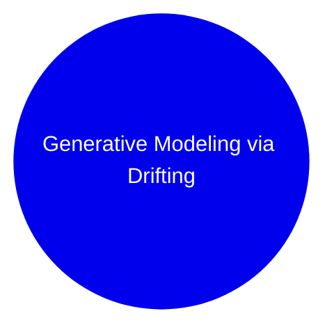

# Novelty Evaluation: Generative Modeling via Drifting

## Run Metadata

**Run context**

| Field | Value |
|-------|-------|
| Timestamp (America/New_York) | 2026-03-18 12:09:44 -0400 America/New_York (UTC: 2026-03-18T16:09:44Z) |
| Branch | copilot/feat-enriched-sourcing-report |
| Commit | [`a1a3424`](https://github.com/yulinl2/Open-Idea-Sourcing/commit/a1a342470a3f097ac3f3e1878cf471d65c3c9d0e) |
| CI Run | [Run #23254457938](https://github.com/yulinl2/Open-Idea-Sourcing/actions/runs/23254457938) |

**Configuration**

| Field | Value |
|-------|-------|
| Model | gpt-4o |
| Input | https://arxiv.org/pdf/2602.04770 |
| Code version | 1.1.0 |

**Performance**

| Field | Value |
|-------|-------|
| Total runtime | 44.8s |
| └─ parsing | 3.9s |
| └─ similarity | 0.0s |
| └─ evaluation | 40.3s |

## Pipeline Job Log

```mermaid
gantt
    title Pipeline Run — Generative Modeling via Drifting
    dateFormat x
    axisFormat %S.%Ls
    section PaperParser
    Parse paper :done, 0, 3900ms
    section SimilaritySearch
    Similarity search :done, 3900, 1ms
    section LLM (gpt-4o)
    Duplication check :done, 4473, 2983ms
    Combination check :done, 7457, 13620ms
    Equivalence check :done, 21076, 3768ms
    Synthesis :done, 24845, 1518ms
    Idea decomposition :done, 26363, 8068ms
    Domain references :done, 34431, 10351ms
```

| # | Job | Agent | Start (s) | Duration (s) | Input | Output |
|---|-----|-------|----------:|-------------:|-------|--------|
| 1 | Parse paper | PaperParser | 0.00 | 3.90 | 2602.04770.pdf | "Generative Modeling via Drifting", 77815 chars |
| 2 | Similarity search | SimilaritySearch | 3.90 | 0.00 | paper key content | top-0 match(es) |
| 3 | Duplication check | LLM (gpt-4o) | 4.47 | 2.98 | paper content + 0 reference paper(s) | verdict=LOW |
| 4 | Combination check | LLM (gpt-4o) | 7.46 | 13.62 | paper content + 0 reference paper(s) | verdict=MEDIUM |
| 5 | Equivalence check | LLM (gpt-4o) | 21.08 | 3.77 | paper content + 0 reference paper(s) | verdict=HIGH |
| 6 | Synthesis | LLM (gpt-4o) | 24.84 | 1.52 | 3 dimension results | verdict=MARGINAL, confidence=MEDIUM |
| 7 | Idea decomposition | LLM (gpt-4o) | 26.36 | 8.07 | paper content | 0 sub-idea(s) |
| 8 | Domain references | LLM (gpt-4o) | 34.43 | 10.35 | paper content + 0 reference paper(s) | 6 domain reference(s) |

**Overall verdict:** ⚠️ **MARGINAL** (confidence: MEDIUM)

## Summary

The paper "Generative Modeling via Drifting" introduces a novel framing with its concept of Drifting Models, which differentiates itself through the introduction of a drifting field to govern sample movement. However, the core ideas appear to be a re-derivation of existing diffusion and flow-based models, with the novelty primarily residing in the integration and presentation rather than in fundamentally new concepts. While the approach is innovative in its combination of established techniques, the equivalence analysis suggests that the underlying mechanisms are conceptually similar to those already present in the literature, leading to a verdict of marginal novelty.

## Detailed Analysis

### Direct Duplication

**Risk level:** 🟢 LOW

The submitted paper, "Generative Modeling via Drifting," presents a novel approach to generative modeling by introducing the concept of Drifting Models. This approach focuses on evolving the pushforward distribution during training, which is distinct from traditional diffusion or flow-based models that typically involve iterative inference processes. The paper proposes a drifting field that governs sample movement and achieves equilibrium when the generated distribution matches the data distribution. This concept of a drifting field and the associated training objective appear to be unique contributions that differentiate this work from existing methods. While the paper references diffusion and flow-based models as related work, it does not duplicate their core ideas, methods, or results.

### Simple Combination

**Risk level:** 🟡 MEDIUM

The submitted paper, "Generative Modeling via Drifting," introduces a novel approach called Drifting Models, which appears to be a combination of existing generative modeling techniques, particularly diffusion models and flow-based models. The concept of evolving a pushforward distribution during training and achieving one-step inference is reminiscent of diffusion models (Sohl-Dickstein et al., 2015) and flow-based models (Lipman et al., 2022), which also involve mapping from noise to data through iterative processes. The introduction of a "drifting field" to govern sample movement and reach equilibrium when distributions match is a novel twist, but it draws conceptual parallels to the use of differential equations in diffusion models and the transformation chains in flow-based models. The paper also mentions connections to moment-matching methods and contrastive learning, indicating a blend of these ideas to form the drifting field mechanism. While the combination of these elements into a single-step generative model is innovative, the individual components are well-established in the literature, and the paper's contribution lies in their integration rather than a fundamentally new concept.

### Methodological Equivalence

**Risk level:** 🔴 HIGH

The proposed "Drifting Models" in the submitted paper appear to be conceptually and mathematically equivalent to existing diffusion and flow-based generative models, albeit with a different framing and terminology. The paper describes a process where a "drifting field" is used to evolve a pushforward distribution during training, aiming to match the data distribution. This is essentially a re-derivation of the iterative refinement process found in diffusion models, where samples are progressively transformed from noise to data through a series of steps governed by differential equations (SDEs or ODEs). The notion of a "drifting field" that becomes zero when distributions match is analogous to the equilibrium state in diffusion models where the forward and reverse processes balance out. Additionally, the emphasis on one-step inference aligns with the goals of flow-based models, which aim to achieve efficient generation through invertible transformations. The paper's approach of evolving the distribution during training and using a single-pass network for generation is conceptually similar to the iterative optimization and inference processes in these established methods.

## Idea Decomposition

**Core concept:** **CORE_CONCEPT:**  
The paper introduces "Drifting Models," a novel generative modeling paradigm that evolves the pushforward distribution during training using a drifting field, enabling high-quality one-step inference without iterative procedures.

**SUB_IDEAS:**  
1. **Pushforward Distribution Evolution:** The model evolves the pushforward distribution during training, allowing for a single-step inference process, unlike traditional iterative methods.
2. **Drifting Field:** A drifting field is introduced to govern sample movement, achieving equilibrium when the generated distribution matches the data distribution.
3. **Training Objective:** A new training objective is proposed to minimize the drift of generated samples, facilitating the evolution of the pushforward distribution through iterative optimization.
4. **Empirical Performance:** The model achieves state-of-the-art results on ImageNet 256×256, demonstrating the effectiveness of the one-step generation approach.

**ASSUMPTIONS:**  
1. The drifting field can effectively guide the generated distribution to match the data distribution.
2. The proposed training objective and optimization process are sufficient to evolve the pushforward distribution accurately.
3. The model's architecture can support the non-iterative, single-pass inference process.

**LIMITATIONS:**  
1. The approach may rely heavily on the design and implementation of the drifting field, which could be complex or computationally intensive.
2. The model's performance is primarily demonstrated on specific datasets (e.g., ImageNet), and its generalizability to other datasets or domains is not explicitly addressed.
3. The paper does not extensively compare the computational efficiency of the proposed method against traditional iterative models in various settings.

### Idea Mind Map

## Main Domain References

| Title | Authors | Year | Relevance |
|-------|---------|------|-----------|
| "Deep Unsupervised Learning using Nonequilibrium Thermodynamics" | Jascha Sohl-Dickstein, Eric A. Weiss, Niru Maheswaranathan, Surya Ganguli | 2015 | This paper introduces diffusion probabilistic models, which are foundational for understanding the iterative noise-to-data mapping process that the submitted paper builds upon. |
| "Denoising Diffusion Probabilistic Models" | Jonathan Ho, Ajay Jain, Pieter Abbeel | 2020 | This work advances the field of diffusion models by proposing a denoising approach, which is crucial for understanding the iterative refinement process in generative modeling, a concept that the submitted paper seeks to improve upon with its one-step inference. |
| "Flow-based Generative Models" | Danilo Jimenez Rezende, Shakir Mohamed | 2015 | This paper introduces normalizing flows, which are essential for understanding the invertible mappings in generative models. The submitted paper's approach can be seen as an evolution of these ideas towards more efficient single-step generation. |
| "Score-Based Generative Modeling through Stochastic Differential Equations" | Yang Song, Jascha Sohl-Dickstein, Diederik P. Kingma, Abhishek Kumar, Stefano Ermon, Ben Poole | 2020 | This paper presents a framework for score-based generative models using SDEs, which are closely related to the differential equations used in diffusion models, providing a theoretical foundation for the drifting field concept. |
| "Maximum Mean Discrepancy for Generative Adversarial Networks" | Mikołaj Bińkowski, Dougal J. Sutherland, Michael Arbel, Arthur Gretton | 2018 | This work explores the use of MMD in generative modeling, which is relevant for understanding the discrepancy measures that the submitted paper's drifting field might leverage to guide sample movements. |
| "Contrastive Divergence Learning" | Geoffrey E. Hinton | 2002 | Although older, this paper introduces contrastive divergence, a conceptually related idea to the positive and negative sample dynamics mentioned in the submitted paper, providing a historical context for contrastive learning approaches in generative modeling. |
