# Novelty Evaluation: Generative Modeling via Drifting

## Run Metadata

**Run context**

| Field | Value |
|-------|-------|
| Timestamp (America/New_York) | 2026-03-18 12:11:55 -0400 America/New_York (UTC: 2026-03-18T16:11:55Z) |
| Branch | copilot/algo-top-down-search-decomposition |
| Commit | [`afa8b5d`](https://github.com/yulinl2/Open-Idea-Sourcing/commit/afa8b5d4885014c3c1e94d49a36d32f6781e5a9f) |
| CI Run | [Run #23254586581](https://github.com/yulinl2/Open-Idea-Sourcing/actions/runs/23254586581) |

**Configuration**

| Field | Value |
|-------|-------|
| Model | gpt-4o |
| Input | https://arxiv.org/pdf/2602.04770 |
| Code version | 1.1.0 |

**Performance**

| Field | Value |
|-------|-------|
| Total runtime | 27.1s |
| └─ parsing | 3.7s |
| └─ similarity | 0.0s |
| └─ evaluation | 22.8s |

## Pipeline Job Log

```mermaid
gantt
    title Pipeline Run — Generative Modeling via Drifting
    dateFormat x
    axisFormat %S.%Ls
    section PaperParser
    Parse paper :done, 0, 3700ms
    section SimilaritySearch
    Similarity search :done, 3700, 1ms
    section LLM (gpt-4o)
    Duplication check :done, 4330, 6128ms
    Combination check :done, 10458, 9068ms
    Equivalence check :done, 19526, 3708ms
    Synthesis :done, 23234, 3842ms
```

| # | Job | Agent | Start (s) | Duration (s) | Input | Output |
|---|-----|-------|----------:|-------------:|-------|--------|
| 1 | Parse paper | PaperParser | 0.00 | 3.70 | 2602.04770.pdf | "Generative Modeling via Drifting", 77815 chars |
| 2 | Similarity search | SimilaritySearch | 3.70 | 0.00 | paper key content | top-0 match(es) |
| 3 | Duplication check | LLM (gpt-4o) | 4.33 | 6.13 | paper content + 0 reference paper(s) | verdict=UNCLEAR |
| 4 | Combination check | LLM (gpt-4o) | 10.46 | 9.07 | paper content + 0 reference paper(s) | verdict=MEDIUM |
| 5 | Equivalence check | LLM (gpt-4o) | 19.53 | 3.71 | paper content + 0 reference paper(s) | verdict=HIGH |
| 6 | Synthesis | LLM (gpt-4o) | 23.23 | 3.84 | 3 dimension results | verdict=MARGINAL, confidence=MEDIUM |

**Overall verdict:** ⚠️ **MARGINAL** (confidence: MEDIUM)

## Summary

The paper "Generative Modeling via Drifting" presents a novel approach by introducing the concept of a drifting field to evolve the pushforward distribution during training, which differentiates it from traditional diffusion and flow-based models. However, the core ideas appear to be closely related to existing methodologies, such as diffusion models and normalizing flows, with the drifting field conceptually similar to known techniques involving differential equations. While the paper offers a unique combination of elements from various models and introduces a unifying contribution, the novelty is somewhat limited due to its conceptual overlap with established methods.

## Detailed Analysis

### Direct Duplication

**Risk level:** ❓ UNCLEAR

**VERDICT: LOW**

**EXPLANATION:** The submitted paper, "Generative Modeling via Drifting," introduces a novel approach to generative modeling by proposing the concept of Drifting Models. This approach focuses on evolving the pushforward distribution during training, which is distinct from traditional diffusion or flow-based models that typically rely on iterative inference-time computations. The paper introduces a drifting field that governs sample movement and achieves equilibrium when the generated distribution matches the data distribution. This concept of a drifting field and the focus on training-time evolution of the distribution appear to be novel contributions that differentiate the work from existing methods. While the paper references related work in diffusion models, flow-based models, and other generative modeling techniques, the core idea of evolving the pushforward distribution during training and the introduction of a drifting field are not direct duplicates of any known or referenced work.

**REFERENCES:** none.

### Simple Combination

**Risk level:** 🟡 MEDIUM

The submitted paper, "Generative Modeling via Drifting," introduces a novel approach called Drifting Models, which focuses on evolving the pushforward distribution during training to achieve one-step inference in generative modeling. The concept of pushforward distributions and their iterative evolution is not new and has been explored in diffusion models (Sohl-Dickstein et al., 2015) and flow-based models (Lipman et al., 2022). These models typically involve mapping from noise to data through differential equations and iterative inference processes. The paper's novelty lies in the introduction of a "drifting field" that governs sample movement during training, aiming to achieve equilibrium when the generated distribution matches the data distribution. This drifting field is conceptually related to contrastive learning, where positive and negative samples are used to guide learning. While the paper combines elements from diffusion models, flow-based models, and contrastive learning, the introduction of the drifting field and its application to achieve one-step generation provides a unifying contribution that adds value beyond a mere combination of existing works.

### Methodological Equivalence

**Risk level:** 🔴 HIGH

The proposed "Drifting Models" in the submitted paper appear to be a re-derivation of existing diffusion and flow-based generative models, with a focus on the evolution of the pushforward distribution during training. The concept of a "drifting field" that governs sample movement and achieves equilibrium when the generated distribution matches the data distribution is conceptually similar to the use of stochastic differential equations (SDEs) or ordinary differential equations (ODEs) in diffusion models. These models iteratively refine samples from noise to data, which is analogous to the described evolution of the pushforward distribution.

Moreover, the paper's emphasis on achieving a one-step inference process aligns with the goals of normalizing flows (NFs), which also aim for efficient mappings from data to noise and vice versa, often using invertible architectures. The mention of minimizing the drift of generated samples through iterative optimization is reminiscent of the optimization procedures in both diffusion models and NFs.

The paper also draws parallels to moment-matching methods, particularly in its use of kernel functions and the concept of positive and negative samples, which are related to contrastive learning techniques. This suggests that the "drifting field" may be a conceptual renaming of existing methodologies that leverage similar principles.
