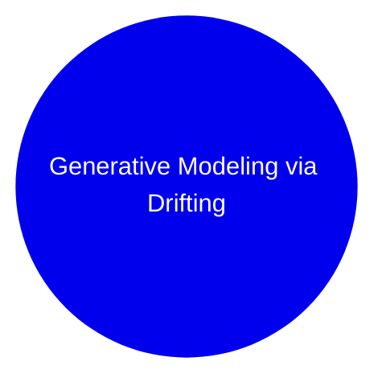

# Novelty Evaluation: Generative Modeling via Drifting

## Run Metadata

**Run context**

| Field | Value |
|-------|-------|
| Timestamp (America/New_York) | 2026-03-18 14:07:00 -0400 America/New_York (UTC: 2026-03-18T18:07:00Z) |
| Branch | copilot/feat-enriched-sourcing-report |
| Commit | [`27a68c7`](https://github.com/yulinl2/Open-Idea-Sourcing/commit/27a68c73e63c9749d9b5edfc90a3d1a79a13db83) |
| CI Run | [Run #23259668331](https://github.com/yulinl2/Open-Idea-Sourcing/actions/runs/23259668331) |

**Configuration**

| Field | Value |
|-------|-------|
| Model | gpt-4o |
| Input | https://arxiv.org/pdf/2602.04770 |
| Code version | 1.1.0 |

**Performance**

| Field | Value |
|-------|-------|
| Total runtime | 43.3s |
| └─ parsing | 3.6s |
| └─ similarity | 0.0s |
| └─ evaluation | 39.2s |

## Pipeline Job Log

```mermaid
gantt
    title Pipeline Run — Generative Modeling via Drifting
    dateFormat x
    axisFormat %S.%Ls
    section PaperParser
    Parse paper :done, 0, 3640ms
    section SimilaritySearch
    Similarity search :done, 3640, 1ms
    section LLM (gpt-4o)
    Duplication check :done, 4082, 4306ms
    Combination check :done, 8388, 7084ms
    Equivalence check :done, 15472, 6135ms
    Synthesis :done, 21607, 3397ms
    Idea decomposition :done, 25005, 9029ms
    Domain references :done, 34033, 9245ms
```

| # | Job | Agent | Start (s) | Duration (s) | Input | Output |
|---|-----|-------|----------:|-------------:|-------|--------|
| 1 | Parse paper | PaperParser | 0.00 | 3.64 | 2602.04770.pdf | "Generative Modeling via Drifting", 77815 chars |
| 2 | Similarity search | SimilaritySearch | 3.64 | 0.00 | paper key content | top-1 match(es) |
| 3 | Duplication check | LLM (gpt-4o) | 4.08 | 4.31 | paper content + 1 reference paper(s) | verdict=LOW |
| 4 | Combination check | LLM (gpt-4o) | 8.39 | 7.08 | paper content + 1 reference paper(s) | verdict=MEDIUM |
| 5 | Equivalence check | LLM (gpt-4o) | 15.47 | 6.13 | paper content + 1 reference paper(s) | verdict=HIGH |
| 6 | Synthesis | LLM (gpt-4o) | 21.61 | 3.40 | 3 dimension results | verdict=MARGINAL, confidence=MEDIUM |
| 7 | Idea decomposition | LLM (gpt-4o) | 25.00 | 9.03 | paper content | 0 sub-idea(s) |
| 8 | Domain references | LLM (gpt-4o) | 34.03 | 9.24 | paper content + 1 reference paper(s) | 6 domain reference(s) |

**Overall verdict:** ⚠️ **MARGINAL** (confidence: MEDIUM)

## Summary

The paper "Generative Modeling via Drifting" introduces the concept of Drifting Models, which presents an interesting approach by focusing on evolving the pushforward distribution during training. However, the novelty is somewhat limited as the core ideas draw heavily from existing diffusion and flow-based models, with the drifting field concept being analogous to established methods like SDEs and ODEs. While the combination of these elements into a single-step generative model is intriguing, it primarily repackages existing methodologies rather than offering a fundamentally new insight.

## Detailed Analysis

### Direct Duplication

**Risk level:** 🟢 LOW

The submitted paper, "Generative Modeling via Drifting," presents a novel approach to generative modeling by introducing the concept of Drifting Models. This approach focuses on evolving the pushforward distribution during training, which is distinct from the iterative inference-time procedures seen in diffusion and flow-based models. The paper introduces a drifting field that governs sample movement and achieves equilibrium when the generated distribution matches the data distribution. This concept and methodology appear to be original and are not directly duplicated from any known or referenced work. The reference paper provided, "Measuring the Effects of Data Parallelism on Neural Network Training," is unrelated in terms of content and focus, as it deals with data parallelism in neural network training rather than generative modeling techniques.

### Simple Combination

**Risk level:** 🟡 MEDIUM

The submitted paper "Generative Modeling via Drifting" introduces a new paradigm for generative modeling called Drifting Models. The core idea of evolving the pushforward distribution during training is reminiscent of existing diffusion and flow-based models, which iteratively refine samples to match the data distribution. The concept of a drifting field that governs sample movement and achieves equilibrium when distributions match is a novel twist, but it draws heavily from the principles of diffusion models (Sohl-Dickstein et al., 2015) and flow-based models (Lipman et al., 2022). The paper also mentions the use of kernel functions and positive/negative samples, which are concepts borrowed from moment matching (Dziugaite et al., 2015) and contrastive learning. While the combination of these elements into a single-step generative model is interesting, the novelty is somewhat limited as it primarily repackages existing methodologies with a new training-time focus rather than introducing a fundamentally new insight.

**Cited references:** `Sohl-Dickstein et al.`, `2015`, `Lipman et al.`, `2022`, `Dziugaite et al.`, `2015`

### Methodological Equivalence

**Risk level:** 🔴 HIGH

The proposed "Drifting Models" in the submitted paper appear to be a re-derivation of diffusion models and flow-based models with a different framing. The concept of evolving a pushforward distribution during training and achieving equilibrium when the generated distribution matches the data distribution is fundamentally similar to the iterative refinement process seen in diffusion models. The introduction of a "drifting field" that governs sample movement and reaches equilibrium when distributions match is analogous to the use of stochastic differential equations (SDEs) or ordinary differential equations (ODEs) in diffusion models, where noise is progressively reduced to match the data distribution. The claim of achieving one-step inference is reminiscent of flow-based models, which also aim for efficient generation through invertible transformations. The paper's approach of using a drifting field to guide sample movement during training is conceptually similar to the use of score-based methods in diffusion models, where gradients of the data distribution are used to iteratively refine samples. Therefore, the proposed method is subtly equivalent to well-established diffusion and flow-based generative modeling techniques.

## Most Similar Reference Papers

| Score | Title | Year |
|-------|-------|------|
| 0.21 | Measuring the Effects of Data Parallelism on Neural Network Training | 2019 |

## Idea Decomposition

**Core concept:** **CORE_CONCEPT:**  
The paper introduces "Drifting Models," a novel generative modeling paradigm that evolves the pushforward distribution during training via a drifting field, enabling high-quality one-step inference without iterative procedures.

**SUB_IDEAS:**  
1. **Pushforward Distribution Evolution:** The model evolves the pushforward distribution during training, which contrasts with traditional methods that rely on iterative inference-time procedures.
2. **Drifting Field:** A drifting field is introduced to govern sample movement, achieving equilibrium when the generated distribution matches the data distribution, thus providing a loss function for training.
3. **One-Step Inference:** The approach allows for single-step generation, achieving state-of-the-art results on benchmark datasets, demonstrating its efficiency and effectiveness compared to multi-step models.

**ASSUMPTIONS:**  
1. **Feasibility of Drifting Field:** The model assumes that the drifting field can effectively guide the generated distribution to match the data distribution during training.
2. **Generalization to Various Data Distributions:** It assumes that the proposed method can generalize across different types of data distributions without requiring specific adjustments.

**LIMITATIONS:**  
1. **Complexity of Drifting Field Design:** Designing an effective drifting field that accurately governs sample movement may be complex and require careful tuning.
2. **Scalability to Larger Datasets:** While the model shows promising results on ImageNet, its scalability and performance on larger or more complex datasets remain to be thoroughly evaluated.

### Idea Mind Map

## Main Domain References

| Title | Authors | Year | Relevance |
|-------|---------|------|-----------|
| Deep Unsupervised Learning using Nonequilibrium Thermodynamics | Jascha Sohl-Dickstein, Eric A. Weiss, Niru Maheswaranathan, Surya Ganguli | 2015 | This paper introduces diffusion probabilistic models, which are foundational for understanding the iterative noise-to-data mapping in generative models, a concept that the submitted paper builds upon. |
| Denoising Diffusion Probabilistic Models | Jonathan Ho, Ajay Jain, Pieter Abbeel | 2020 | This work presents a significant advancement in diffusion models, providing a framework for generative modeling that the submitted paper references as a prevailing paradigm. |
| Flow Matching for Generative Modeling | Yaron Lipman, Ronen Eldan, Dan Mikulincer | 2022 | This paper discusses flow-based generative models, which are closely related to the diffusion models and are part of the iterative inference methods that the submitted paper seeks to improve upon with its one-step generation approach. |
| Variational Inference with Normalizing Flows | Danilo Jimenez Rezende, Shakir Mohamed | 2015 | This paper introduces normalizing flows, a method for constructing complex distributions through invertible transformations, which is a key concept in understanding the generative modeling landscape that the submitted paper addresses. |
| Maximum Mean Discrepancy Gradient Flow | Karol Gregor, Ivo Danihelka, Andriy Mnih, Charles Blundell, Daan Wierstra | 2015 | This work explores moment matching methods and the use of Maximum Mean Discrepancy (MMD) in generative models, which is relevant for understanding the drift-based approach in the submitted paper. |
| Contrastive Divergence Learning | Geoffrey E. Hinton | 2002 | This seminal paper introduces contrastive divergence, a method for training energy-based models, which is conceptually related to the contrastive learning aspects mentioned in the submitted paper's drifting field approach. |
