# Novelty Evaluation: Generative Modeling via Drifting

## Run Metadata

**Run context**

| Field | Value |
|-------|-------|
| Timestamp (America/New_York) | 2026-03-19 00:01:49 -0400 America/New_York (UTC: 2026-03-19T04:01:49Z) |
| Branch | copilot/add-online-reference-search |
| Commit | [`34665c5`](https://github.com/yulinl2/Open-Idea-Sourcing/commit/34665c566df9dc1367c5b4a3ba755dd7383beb8d) |
| CI Run | [Run #23279168247](https://github.com/yulinl2/Open-Idea-Sourcing/actions/runs/23279168247) |

**Configuration**

| Field | Value |
|-------|-------|
| Model | gpt-4o |
| Input | https://arxiv.org/pdf/2602.04770 |
| Code version | 1.2.0 |

**Performance**

| Field | Value |
|-------|-------|
| Total runtime | 25.7s |
| └─ parsing | 3.7s |
| └─ online_search | 0.2s |
| └─ similarity | 0.0s |
| └─ evaluation | 21.2s |

## Pipeline Job Log

```mermaid
gantt
    title Pipeline Run — Generative Modeling via Drifting
    dateFormat x
    axisFormat %S.%Ls
    section PaperParser
    Parse paper :done, 0, 3690ms
    section SemanticScholar API
    Online reference search :done, 3690, 180ms
    section SimilaritySearch
    Similarity search :done, 3870, 1ms
    section LLM (gpt-4o)
    Duplication check :done, 4528, 3346ms
    Combination check :done, 7873, 6077ms
    Equivalence check :done, 13951, 6663ms
    Synthesis :done, 20614, 5115ms
```

| # | Job | Agent | Start (s) | Duration (s) | Input | Output |
|---|-----|-------|----------:|-------------:|-------|--------|
| 1 | Parse paper | PaperParser | 0.00 | 3.69 | 2602.04770.pdf | "Generative Modeling via Drifting", 77815 chars |
| 2 | Online reference search | SemanticScholar API | 3.69 | 0.18 | title="Generative Modeling via Drifting" | 0 paper(s) fetched |
| 3 | Similarity search | SimilaritySearch | 3.87 | 0.00 | paper key content | top-0 match(es) |
| 4 | Duplication check | LLM (gpt-4o) | 4.53 | 3.35 | paper content + 0 reference paper(s) | verdict=UNCLEAR |
| 5 | Combination check | LLM (gpt-4o) | 7.87 | 6.08 | paper content + 0 reference paper(s) | verdict=MEDIUM |
| 6 | Equivalence check | LLM (gpt-4o) | 13.95 | 6.66 | paper content + 0 reference paper(s) | verdict=HIGH |
| 7 | Synthesis | LLM (gpt-4o) | 20.61 | 5.12 | 3 dimension results | verdict=MARGINAL, confidence=MEDIUM |

**Overall verdict:** ⚠️ **MARGINAL** (confidence: MEDIUM)

## Summary

The paper "Generative Modeling via Drifting" introduces a novel framing of generative modeling by proposing the concept of Drifting Models, which offers a unique approach to evolving the pushforward distribution during training. While the paper claims to achieve one-step inference, distinguishing it from traditional multi-step diffusion and flow-based models, the core concepts appear to be mathematically and conceptually equivalent to existing methods. The novelty lies primarily in the framing and terminology rather than in the fundamental principles, suggesting that the contribution is marginal rather than groundbreaking. The lack of direct duplication and the introduction of a drifting field as a training mechanism provide some degree of innovation, but the overall contribution is more of a reinterpretation of established techniques.

## Detailed Analysis

### Direct Duplication

**Risk level:** ❓ UNCLEAR

**VERDICT: LOW**

**EXPLANATION:** The submitted paper, "Generative Modeling via Drifting," presents a novel approach to generative modeling by introducing the concept of Drifting Models. This approach focuses on evolving the pushforward distribution during training, which is distinct from traditional diffusion or flow-based models that typically involve iterative inference processes. The paper introduces a "drifting field" that governs sample movement and achieves equilibrium when the generated distribution matches the data distribution. This concept of evolving the distribution during training and achieving one-step inference is not a direct duplication of existing methods, as it offers a new paradigm for generative modeling. The paper also claims state-of-the-art results on ImageNet, which suggests that the method has been empirically validated to some extent. Without any reference papers provided for direct comparison, there is no evidence to suggest that the core ideas, methods, or results are essentially identical to prior art.

**REFERENCES:** none.

### Simple Combination

**Risk level:** 🟡 MEDIUM

The submitted paper, "Generative Modeling via Drifting," presents a novel approach to generative modeling by introducing the concept of Drifting Models. This approach builds on existing paradigms such as diffusion models and flow-based models, which are well-established in the field of generative modeling. The paper's core idea of evolving the pushforward distribution during training and using a drifting field to guide sample movements draws parallels to the iterative refinement seen in diffusion models (Sohl-Dickstein et al., 2015) and flow-based models (Lipman et al., 2022). However, the paper claims to offer a unifying contribution by achieving one-step inference, which is a departure from the multi-step processes typical of these models. The introduction of a drifting field as a training mechanism is a novel element that distinguishes this work from prior methods, suggesting that the combination of these components does provide a genuine insight into improving generative modeling efficiency.

### Methodological Equivalence

**Risk level:** 🔴 HIGH

The proposed "Drifting Models" in the submitted paper appear to be conceptually and mathematically equivalent to existing diffusion and flow-based generative models, albeit with different terminology and framing. The core idea of evolving a pushforward distribution during training and achieving equilibrium when the generated distribution matches the data distribution is a re-derivation of the principles underlying diffusion models and normalizing flows. In diffusion models, the process involves iteratively refining samples from noise to data through differential equations, which is analogous to the "drifting field" described in the paper. The notion of a "drifting field" that governs sample movement and reaches equilibrium when distributions match is conceptually similar to the use of score functions or gradients in diffusion models that guide the transformation of noise into data. Furthermore, the paper's emphasis on one-step generation aligns with the goals of normalizing flows, which aim to achieve efficient, non-iterative mappings between distributions. The description of the "drifting field" as a mechanism to minimize discrepancies between generated and data distributions is reminiscent of the optimization objectives in moment-matching methods, such as minimizing Maximum Mean Discrepancy (MMD). Overall, the proposed method seems to be a re-framing of these well-established generative modeling techniques.
