# Novelty Evaluation: Generative Modeling via Drifting

## Run Metadata

**Run context**

| Field | Value |
|-------|-------|
| Timestamp (America/New_York) | 2026-03-19 04:50:47 -0400 America/New_York (UTC: 2026-03-19T08:50:47Z) |
| Branch | copilot/add-online-reference-search |
| Commit | [`c9d2a7d`](https://github.com/yulinl2/Open-Idea-Sourcing/commit/c9d2a7d82f406ce67c1cfd5dd93aa0f240e3abe2) |
| CI Run | [Run #23286953289](https://github.com/yulinl2/Open-Idea-Sourcing/actions/runs/23286953289) |

**Configuration**

| Field | Value |
|-------|-------|
| Model | gpt-4o |
| Input | https://arxiv.org/pdf/2602.04770 |
| Code version | 1.2.0 |

**Performance**

| Field | Value |
|-------|-------|
| Total runtime | 20.2s |
| └─ parsing | 3.7s |
| └─ online_search | 0.6s |
| └─ similarity | 0.0s |
| └─ evaluation | 15.3s |

## Pipeline Job Log

```mermaid
gantt
    title Pipeline Run — Generative Modeling via Drifting
    dateFormat x
    axisFormat %S.%Ls
    section PaperParser
    Parse paper :done, 0, 3690ms
    section SemanticScholar API
    Online reference search :done, 3690, 560ms
    section SimilaritySearch
    Similarity search :done, 4250, 10ms
    section LLM (gpt-4o)
    Duplication check :done, 4912, 4103ms
    Combination check :done, 9014, 4613ms
    Equivalence check :done, 13627, 3352ms
    Synthesis :done, 16979, 3226ms
```

| # | Job | Agent | Start (s) | Duration (s) | Input | Output |
|---|-----|-------|----------:|-------------:|-------|--------|
| 1 | Parse paper | PaperParser | 0.00 | 3.69 | 2602.04770.pdf | "Generative Modeling via Drifting", 77815 chars |
| 2 | Online reference search | SemanticScholar API | 3.69 | 0.56 | arXiv:2602.04770 | 10 paper(s) fetched |
| 3 | Similarity search | SimilaritySearch | 4.25 | 0.01 | paper key content | top-5 match(es) |
| 4 | Duplication check | LLM (gpt-4o) | 4.91 | 4.10 | paper content + 5 reference paper(s) | verdict=LOW |
| 5 | Combination check | LLM (gpt-4o) | 9.01 | 4.61 | paper content + 5 reference paper(s) | verdict=UNCLEAR |
| 6 | Equivalence check | LLM (gpt-4o) | 13.63 | 3.35 | paper content + 5 reference paper(s) | verdict=HIGH |
| 7 | Synthesis | LLM (gpt-4o) | 16.98 | 3.23 | 3 dimension results | verdict=MARGINAL, confidence=MEDIUM |

**Overall verdict:** ⚠️ **MARGINAL** (confidence: MEDIUM)

## Summary

The paper "Generative Modeling via Drifting" introduces a novel conceptual framework with its "drifting field" approach, which is distinct in its training-time evolution of the pushforward distribution. However, the equivalence analysis highlights significant similarities with existing diffusion and flow-based models, suggesting that while the terminology and framing are new, the underlying methodology closely aligns with established techniques. The novelty is therefore marginal, as the paper synthesizes existing ideas into a new framework rather than presenting a fundamentally new approach.

## Detailed Analysis

### Direct Duplication

**Risk level:** 🟢 LOW

The submitted paper, "Generative Modeling via Drifting," introduces a novel approach to generative modeling by focusing on the evolution of the pushforward distribution during training, which they term "Drifting Models." This approach is distinct from existing methods such as diffusion models, normalizing flows, and moment matching, which typically involve iterative inference-time procedures. The concept of a drifting field that governs sample movement and achieves equilibrium when distributions match is a unique contribution that differentiates it from the referenced works. The related works mentioned in the submission, such as diffusion models and normalizing flows, do not incorporate this drifting field concept or the specific training-time evolution of the pushforward distribution. Therefore, the core ideas and methods of the submitted paper are not direct duplicates of the referenced works.

### Simple Combination

**Risk level:** ❓ UNCLEAR

**VERDICT: LOW**

**EXPLANATION:** The submitted paper, "Generative Modeling via Drifting," presents a novel approach to generative modeling by introducing the concept of a "drifting field" that evolves the pushforward distribution during training, allowing for one-step inference. While it draws on existing paradigms such as diffusion models, flow-based models, and normalizing flows, the paper's primary contribution lies in its unique integration of these concepts into a new framework. The drifting field concept is not directly derived from any single prior work but rather represents a synthesis of ideas from various generative modeling approaches, such as the iterative refinement seen in diffusion models and the mapping techniques of normalizing flows. This synthesis results in a new paradigm that offers practical advantages, such as improved efficiency and state-of-the-art performance in one-step generation, which suggests a genuine insight beyond a simple combination of existing methods.

**REFERENCES:** none

### Methodological Equivalence

**Risk level:** 🔴 HIGH

The proposed "Drifting Models" in the submitted paper bear a strong resemblance to existing diffusion and flow-based generative models, particularly in their iterative nature of evolving a distribution towards a target data distribution. The concept of a "drifting field" that governs sample movement and achieves equilibrium when the generated distribution matches the data distribution is conceptually similar to the use of stochastic differential equations (SDEs) or ordinary differential equations (ODEs) in diffusion models, which also iteratively refine samples from noise to data. The notion of evolving the pushforward distribution during training and achieving a one-step inference aligns with recent advancements in fast-forward generative models, such as Mean Flows, which aim to achieve efficient one-step generation by leveraging flow fields. Furthermore, the use of a "drifting field" that becomes zero at equilibrium is analogous to the use of score functions in diffusion models that guide the sample refinement process. Overall, the paper's framing and terminology differ, but the underlying methodology is equivalent to well-established diffusion and flow-based generative modeling techniques.

**Cited references:** `1`, `2`, `3`, `4`, `5`

## Most Similar Reference Papers

| Score | Title | Year |
|-------|-------|------|
| 0.20 | There is No VAE: End-to-End Pixel-Space Generative Modeling via Self-Supervised Pre-training | 2025 |
| 0.19 | Normalizing Flows are Capable Generative Models | 2024 |
| 0.16 | Inductive Moment Matching | 2025 |
| 0.15 | Mean Flows for One-step Generative Modeling | 2025 |
| 0.15 | Improved Mean Flows: On the Challenges of Fastforward Generative Models | 2025 |
