# Novelty Evaluation: Generative Modeling via Drifting

## Run Metadata

**Run context**

| Field | Value |
|-------|-------|
| Timestamp (America/New_York) | 2026-03-20 00:33:14 -0400 America/New_York (UTC: 2026-03-20T04:33:14Z) |
| Branch | copilot/add-online-reference-search |
| Commit | [`3b3f3ef`](https://github.com/yulinl2/Open-Idea-Sourcing/commit/3b3f3effea78de91fd079b1ceb5a9021ee1a9178) |
| CI Run | [Run #23329143484](https://github.com/yulinl2/Open-Idea-Sourcing/actions/runs/23329143484) |

**Configuration**

| Field | Value |
|-------|-------|
| Model | gpt-4o |
| Input | https://arxiv.org/pdf/2602.04770 |
| Code version | 1.2.0 |

**Performance**

| Field | Value |
|-------|-------|
| Total runtime | 31.2s |
| └─ parsing | 3.8s |
| └─ online_search | 5.4s |
| └─ similarity | 0.0s |
| └─ evaluation | 18.1s |

## Pipeline Job Log

```mermaid
gantt
    title Pipeline Run — Generative Modeling via Drifting
    dateFormat x
    axisFormat %S.%Ls
    section PaperParser
    Parse paper :done, 0, 3780ms
    section SemanticScholar API
    Online reference search :done, 3780, 5420ms
    section SimilaritySearch
    Similarity search :done, 9200, 10ms
    section LLM (gpt-4o)
    Duplication check :done, 13107, 2653ms
    Combination check :done, 15760, 6521ms
    Equivalence check :done, 22280, 5637ms
    Synthesis :done, 27917, 3262ms
```

| # | Job | Agent | Start (s) | Duration (s) | Input | Output |
|---|-----|-------|----------:|-------------:|-------|--------|
| 1 | Parse paper | PaperParser | 0.00 | 3.78 | 2602.04770.pdf | "Generative Modeling via Drifting", 77815 chars |
| 2 | Online reference search | SemanticScholar API | 3.78 | 5.42 | arXiv:2602.04770 + 4 LLM queries | 10 paper(s) fetched |
| 3 | Similarity search | SimilaritySearch | 9.20 | 0.01 | paper key content | top-5 match(es) |
| 4 | Duplication check | LLM (gpt-4o) | 13.11 | 2.65 | paper content + 5 reference paper(s) | verdict=LOW |
| 5 | Combination check | LLM (gpt-4o) | 15.76 | 6.52 | paper content + 5 reference paper(s) | verdict=UNCLEAR |
| 6 | Equivalence check | LLM (gpt-4o) | 22.28 | 5.64 | paper content + 5 reference paper(s) | verdict=UNCLEAR |
| 7 | Synthesis | LLM (gpt-4o) | 27.92 | 3.26 | 3 dimension results | verdict=MARGINAL, confidence=MEDIUM |

**Overall verdict:** ⚠️ **MARGINAL** (confidence: MEDIUM)

## Summary

The paper "Generative Modeling via Drifting" presents a novel approach by introducing a "drifting field" to evolve the pushforward distribution during training, which is distinct from existing methods. However, it heavily builds upon established paradigms such as diffusion models and normalizing flows, making its novelty somewhat incremental. While the specific implementation of a drifting field for one-step inference is innovative, the reliance on existing methodologies suggests that the contribution is more of an extension rather than a groundbreaking advancement.

## Detailed Analysis

### Direct Duplication

**Risk level:** 🟢 LOW

The submitted paper, "Generative Modeling via Drifting," introduces a novel approach to generative modeling by evolving the pushforward distribution during training, which allows for one-step inference. This concept of a "drifting field" that governs sample movement and achieves equilibrium when distributions match is not directly duplicated in any of the reference papers. While the paper shares some thematic similarities with existing works on diffusion models, normalizing flows, and moment matching, the specific mechanism of using a drifting field to achieve one-step generation is distinct. The reference papers discuss related concepts such as pixel-space generative modeling, normalizing flows, and moment matching, but none of them describe a method that evolves the pushforward distribution during training in the same manner as the submitted paper.

### Simple Combination

**Risk level:** ❓ UNCLEAR

**VERDICT: MEDIUM**

**EXPLANATION:** The submitted paper, "Generative Modeling via Drifting," introduces a novel approach to generative modeling by evolving the pushforward distribution during training, which they term as "Drifting Models." This concept builds upon existing paradigms such as diffusion models and flow-based models, which iteratively map noise to data through differential equations. The paper's core innovation lies in the introduction of a "drifting field" that governs sample movement, aiming to achieve equilibrium when the generated distribution matches the data distribution. This approach is conceptually related to moment matching and contrastive learning, where positive and negative samples are used to guide the model. While the idea of evolving distributions during training is not entirely new, the specific implementation of a drifting field and its application to achieve one-step inference is a novel contribution. However, the paper heavily relies on existing methodologies like diffusion models and normalizing flows, making it a combination of these established techniques with an added layer of innovation.

**REFERENCES:** f06c6995371d5490ee40b1d4226657e0834e34e6, b50e850a58b6fc41bbbbf05d199aa43dc581c163, 19df654b0d0f634a451564346a09af8bd348dac0

### Methodological Equivalence

**Risk level:** ❓ UNCLEAR

**VERDICT: MEDIUM**

**EXPLANATION:** The submitted paper, "Generative Modeling via Drifting," introduces a concept of evolving a pushforward distribution during training using a "drifting field." This approach is conceptually similar to existing generative modeling frameworks, particularly diffusion models and flow-based models. The idea of iteratively evolving a distribution to match a target distribution is a core principle in diffusion models, where samples are progressively refined through a series of transformations governed by differential equations. The "drifting field" in the submitted paper appears to function similarly to the noise schedules or score functions used in diffusion models, which guide the transformation of samples from noise to data distribution. Additionally, the mention of a one-step inference process aligns with recent efforts in the field to distill iterative models into single-step or few-step models, as seen in works on normalizing flows and moment matching. The paper's approach of using a single-pass network for generation is reminiscent of normalizing flows, which also aim for efficient, non-iterative inference by learning invertible mappings.

**REFERENCES:** f06c6995371d5490ee40b1d4226657e0834e34e6, b50e850a58b6fc41bbbbf05d199aa43dc581c163, 19df654b0d0f634a451564346a09af8bd348dac0

## Most Similar Reference Papers

| Score | Title | Year |
|-------|-------|------|
| 0.20 | There is No VAE: End-to-End Pixel-Space Generative Modeling via Self-Supervised Pre-training | 2025 |
| 0.19 | Normalizing Flows are Capable Generative Models | 2024 |
| 0.16 | Inductive Moment Matching | 2025 |
| 0.15 | Mean Flows for One-step Generative Modeling | 2025 |
| 0.15 | Improved Mean Flows: On the Challenges of Fastforward Generative Models | 2025 |
