# Novelty Evaluation: Generative Modeling via Drifting

## Run Metadata

**Run context**

| Field | Value |
|-------|-------|
| Timestamp (America/New_York) | 2026-03-20 01:14:03 -0400 America/New_York (UTC: 2026-03-20T05:14:03Z) |
| Branch | copilot/add-online-reference-search |
| Commit | [`3b3f3ef`](https://github.com/yulinl2/Open-Idea-Sourcing/commit/3b3f3effea78de91fd079b1ceb5a9021ee1a9178) |
| CI Run | [Run #23330038867](https://github.com/yulinl2/Open-Idea-Sourcing/actions/runs/23330038867) |

**Configuration**

| Field | Value |
|-------|-------|
| Model | gpt-4o |
| Input | https://arxiv.org/pdf/2602.04770 |
| Code version | 1.2.0 |

**Performance**

| Field | Value |
|-------|-------|
| Total runtime | 21.3s |
| └─ parsing | 3.7s |
| └─ online_search | 0.8s |
| └─ similarity | 0.0s |
| └─ evaluation | 14.7s |

## Pipeline Job Log

```mermaid
gantt
    title Pipeline Run — Generative Modeling via Drifting
    dateFormat x
    axisFormat %S.%Ls
    section PaperParser
    Parse paper :done, 0, 3690ms
    section SemanticScholar API
    Online reference search :done, 3690, 770ms
    section SimilaritySearch
    Similarity search :done, 4460, 1ms
    section LLM (gpt-4o)
    Duplication check :done, 6638, 3811ms
    Combination check :done, 10449, 4606ms
    Equivalence check :done, 15055, 4064ms
    Synthesis :done, 19119, 2187ms
```

| # | Job | Agent | Start (s) | Duration (s) | Input | Output |
|---|-----|-------|----------:|-------------:|-------|--------|
| 1 | Parse paper | PaperParser | 0.00 | 3.69 | 2602.04770.pdf | "Generative Modeling via Drifting", 77815 chars |
| 2 | Online reference search | SemanticScholar API | 3.69 | 0.77 | arXiv:2602.04770 + 5 LLM queries | 0 paper(s) fetched |
| 3 | Similarity search | SimilaritySearch | 4.46 | 0.00 | paper key content | top-0 match(es) |
| 4 | Duplication check | LLM (gpt-4o) | 6.64 | 3.81 | paper content + 0 reference paper(s) | verdict=UNCLEAR |
| 5 | Combination check | LLM (gpt-4o) | 10.45 | 4.61 | paper content + 0 reference paper(s) | verdict=UNCLEAR |
| 6 | Equivalence check | LLM (gpt-4o) | 15.05 | 4.06 | paper content + 0 reference paper(s) | verdict=HIGH |
| 7 | Synthesis | LLM (gpt-4o) | 19.12 | 2.19 | 3 dimension results | verdict=MARGINAL, confidence=MEDIUM |

**Overall verdict:** ⚠️ **MARGINAL** (confidence: MEDIUM)

## Summary

The paper "Generative Modeling via Drifting" introduces a new approach to generative modeling by proposing Drifting Models, which focus on evolving the pushforward distribution during training. While the concept of a drifting field is a novel contribution, the paper largely repurposes existing ideas from diffusion and flow-based models, as well as other generative modeling techniques. The combination of these ideas in a training-time context offers some new insights, but the overall novelty is not groundbreaking. The paper's contributions are more incremental than revolutionary, leading to a verdict of marginal novelty.

## Detailed Analysis

### Direct Duplication

**Risk level:** ❓ UNCLEAR

**VERDICT: LOW**

**EXPLANATION:** The submitted paper titled "Generative Modeling via Drifting" introduces a novel approach to generative modeling by proposing a new paradigm called Drifting Models. This approach focuses on evolving the pushforward distribution during training, which is distinct from the iterative inference procedures commonly used in diffusion and flow-based models. The concept of a drifting field that governs sample movement and achieves equilibrium when distributions match is a unique contribution that differentiates this work from existing methods. While the paper references diffusion and flow-based models, as well as other generative modeling techniques like VAEs and normalizing flows, it does not appear to directly duplicate any known or referenced work. The core idea of evolving the pushforward distribution during training and the introduction of a drifting field are novel contributions that set this paper apart from prior art.

**REFERENCES:** none.

### Simple Combination

**Risk level:** ❓ UNCLEAR

**VERDICT: MEDIUM**

**EXPLANATION:** The submitted paper, "Generative Modeling via Drifting," presents a novel approach to generative modeling by introducing the concept of Drifting Models. This approach builds upon existing paradigms such as diffusion models and flow-based models, which are well-established in the field of generative modeling. The paper's primary contribution is the introduction of a "drifting field" that governs the evolution of the pushforward distribution during training, aiming to achieve a one-step inference process. This concept is somewhat related to the iterative refinement seen in diffusion models (Sohl-Dickstein et al., 2015) and flow-based models (Lipman et al., 2022), but it distinguishes itself by focusing on training-time evolution rather than inference-time iteration. Additionally, the paper draws conceptual parallels to moment-matching methods (Dziugaite et al., 2015) and contrastive learning, as it involves positive and negative samples to guide the distribution matching. While the components of the drifting field and the pushforward mapping are not entirely novel, their combination in the context of a training-time evolving distribution offers a potentially valuable insight into efficient generative modeling. However, the novelty is not groundbreaking, as it primarily repurposes existing ideas with a new training objective.

**REFERENCES:** none

### Methodological Equivalence

**Risk level:** 🔴 HIGH

The proposed "Drifting Models" in the submitted paper appear to be conceptually and mathematically equivalent to existing diffusion and flow-based generative models. The core idea of evolving a pushforward distribution during training and achieving a match with the data distribution is a well-established concept in diffusion models, where the transformation from noise to data is iteratively refined through stochastic differential equations (SDEs) or ordinary differential equations (ODEs). The "drifting field" introduced in the paper serves a similar purpose to the score function or drift term in diffusion models, which guides the sample transformation process. Additionally, the notion of achieving equilibrium when the generated distribution matches the data distribution is a fundamental principle in generative adversarial networks (GANs) and other generative models that aim to minimize a divergence or discrepancy between distributions. The paper's emphasis on one-step inference aligns with the goals of normalizing flows, which also aim to perform efficient, non-iterative transformations from latent to data space. The use of a "drifting field" to govern sample movement during training is conceptually akin to the gradient flow in these models, which is used to optimize the transformation map.
