# Novelty Evaluation: Generative Modeling via Drifting

> **Source:** [https://arxiv.org/pdf/2602.04770](https://arxiv.org/pdf/2602.04770)

## Run Metadata

**Run context**

| Field | Value |
|-------|-------|
| Timestamp (America/New_York) | 2026-03-20 01:15:11 -0400 America/New_York (UTC: 2026-03-20T05:15:11Z) |
| Branch | copilot/feat-enriched-sourcing-report |
| Commit | [`7f68b94`](https://github.com/yulinl2/Open-Idea-Sourcing/commit/7f68b94e1c9a3bca1a442e2529d38211ce90589a) |
| CI Run | [Run #23330062931](https://github.com/yulinl2/Open-Idea-Sourcing/actions/runs/23330062931) |

**Configuration**

| Field | Value |
|-------|-------|
| Model | gpt-4o |
| Input | https://arxiv.org/pdf/2602.04770 |
| Code version | 1.1.0 |

**Performance**

| Field | Value |
|-------|-------|
| Total runtime | 32.7s |
| └─ parsing | 3.7s |
| └─ similarity | 0.0s |
| └─ evaluation | 28.5s |

## Pipeline Job Log

```mermaid
gantt
    title Pipeline Run — Generative Modeling via Drifting
    dateFormat x
    axisFormat %S.%Ls
    section PaperParser
    Parse paper :done, 0, 3710ms
    section SimilaritySearch
    Similarity search :done, 3710, 1ms
    section LLM (gpt-4o)
    Duplication check :done, 4135, 2892ms
    Combination check :done, 7027, 4715ms
    Equivalence check :done, 11742, 5134ms
    Synthesis :done, 16876, 2052ms
    Idea decomposition :done, 18928, 4183ms
    Domain references :done, 23111, 6647ms
    Reference annotation :done, 29757, 2900ms
```

**PaperParser**

| # | Job | Start (s) | Duration (s) | Input | Output |
|---|-----|----------:|-------------:|-------|--------|
| 1 | Parse paper | 0.00 | 3.71 | 2602.04770.pdf | "Generative Modeling via Drifting", 77815 chars |

**SimilaritySearch**

| # | Job | Start (s) | Duration (s) | Input | Output |
|---|-----|----------:|-------------:|-------|--------|
| 2 | Similarity search | 3.71 | 0.00 | TF-IDF cosine on 2 ref(s); query: «Title: Generative Modeling via Drifting Generative Modeling via Drifting MingyangDeng1 HeLi1 TianhongLi1 YilunDu2 KaimingHe1 Figure1.DriftingModel.Anetworkfperformsapushforwardoperation:q=f…» | top-2: 0.20×Measuring the Effects of Data Paral…; 0.09×A custom reference paper |

**LLM (gpt-4o)**

| # | Job | Start (s) | Duration (s) | Input | Output |
|---|-----|----------:|-------------:|-------|--------|
| 3 | Duplication check | 4.13 | 2.89 | paper content + 2 reference paper(s) | verdict=LOW |
| 4 | Combination check | 7.03 | 4.71 | paper content + 2 reference paper(s) | verdict=LOW |
| 5 | Equivalence check | 11.74 | 5.13 | paper content + 2 reference paper(s) | verdict=HIGH |
| 6 | Synthesis | 16.88 | 2.05 | 3 dimension results | verdict=MARGINAL, confidence=MEDIUM |
| 7 | Idea decomposition | 18.93 | 4.18 | paper content | 0 sub-idea(s) |
| 8 | Domain references | 23.11 | 6.65 | paper content + 2 reference paper(s) | 5 domain reference(s) |
| 9 | Reference annotation | 29.76 | 2.90 | paper + 2 similar paper(s) | 2 annotation(s) |

**Overall verdict:** ⚠️ **MARGINAL** (confidence: MEDIUM)

## Summary

The paper "Generative Modeling via Drifting" presents a novel framing of generative modeling through the introduction of "Drifting Models," which distinguishes itself by focusing on evolving the pushforward distribution during training. While the Duplication and Combination Analyses suggest a low level of overlap with existing works, the Equivalence Analysis highlights significant conceptual and mathematical similarities to diffusion and flow-based models. The unique contribution of the "drifting field" offers a fresh perspective, but the core methodology appears to align closely with established generative modeling techniques, leading to a verdict of marginal novelty.

## Detailed Analysis

### Direct Duplication

<strong>Risk level:</strong> 🟢 LOW

The submitted paper, "Generative Modeling via Drifting," introduces a novel approach to generative modeling by proposing a new paradigm called Drifting Models. This approach focuses on evolving the pushforward distribution during training, which is distinct from the iterative inference procedures commonly used in diffusion and flow-based models. The concept of a drifting field that governs sample movement and achieves equilibrium when distributions match is a unique contribution that differentiates it from existing methods. The paper's emphasis on a single-step generation process and the introduction of a drifting field as a loss function are not directly duplicated in the reference papers provided. The reference papers do not cover the same core ideas, methods, or results, indicating that the submitted paper is not a direct duplicate.

### Simple Combination

<strong>Risk level:</strong> 🟢 LOW

The submitted paper, "Generative Modeling via Drifting," introduces a novel approach to generative modeling by proposing Drifting Models, which evolve the pushforward distribution during training and allow for one-step inference. While the paper builds on existing concepts from diffusion models and flow-based models, such as the iterative mapping of distributions and the use of differential equations, it introduces a unique "drifting field" that governs sample movement during training. This drifting field is a new contribution that provides a loss function to achieve equilibrium when the generated distribution matches the data distribution. The paper's approach is distinct from prior works as it focuses on evolving the distribution during training rather than relying on iterative inference procedures. This novel perspective and the resulting state-of-the-art performance on ImageNet suggest that the paper is not merely a simple combination of existing works but offers a genuine insight into efficient generative modeling.

### Methodological Equivalence

<strong>Risk level:</strong> 🔴 HIGH

The proposed "Drifting Models" in the submitted paper appear to be conceptually and mathematically equivalent to existing diffusion and flow-based generative models, albeit with a different framing. The paper describes a process where a "drifting field" is used to evolve a pushforward distribution during training, which is conceptually similar to the iterative refinement of samples in diffusion models. The notion of a "drifting field" that approaches zero when the generated distribution matches the data distribution is analogous to the use of score functions or gradients in diffusion models to guide the transformation of noise into data. Furthermore, the emphasis on single-step generation aligns with the objectives of normalizing flows, which also aim for efficient, one-step mappings from noise to data. The paper's description of evolving the distribution through iterative optimization is reminiscent of the training dynamics in flow-based models, where the transformation is learned through gradient-based optimization. The use of a "drifting field" to govern sample movement is conceptually similar to the differential equations used in diffusion models to guide the sample transformation process.

**Cited references:** `none (The paper does not directly cite specific papers that establish the equivalence`, `but the concepts are well-known in the diffusion and flow-based generative modeling literature.)`

## Most Similar Reference Papers

> **Scoring method:** TF-IDF cosine similarity (0–1). Higher scores indicate greater textual overlap between the paper's key content and the reference.

| Score | Title | Year |
|-------|-------|------|
| 0.20 | [Measuring the Effects of Data Parallelism on Neural Network Training](https://arxiv.org/abs/1904.06019) | 2019 |
| 0.09 | [A custom reference paper](https://example.com/user-paper-001) | 2022 |

### Reference Annotations

**[0.20] [Measuring the Effects of Data Parallelism on Neural Network Training](https://arxiv.org/abs/1904.06019) (2019)**

Comparative annotation

**Overlap:** Both the submitted paper and this reference explore aspects of neural network training, particularly focusing on optimization processes and the efficiency of training methodologies.

**Differences:** The submitted paper introduces a novel generative modeling approach called Drifting Models, which focuses on evolving the pushforward distribution during training, whereas the reference paper primarily investigates the impact of data parallelism on training speed and efficiency.

**Derivation:** None identified.

**[0.09] [A custom reference paper](https://example.com/user-paper-001) (2022)**

Comparative annotation

**Overlap:** The submitted paper and this custom reference may share a general interest in advancing neural network methodologies, though specific overlaps in methods or concepts are not detailed due to the lack of abstract content.

**Differences:** Without specific content from the custom reference, it is unclear how it directly contrasts with the submitted paper's focus on Drifting Models for generative modeling.

**Derivation:** None identified.

## Idea Decomposition

**Core concept:** **CORE_CONCEPT:**  
The paper introduces "Drifting Models," a novel generative modeling paradigm that evolves the pushforward distribution during training, allowing for high-quality one-step inference without the need for iterative procedures.

**SUB_IDEAS:**  
1. **Drifting Field:** The introduction of a drifting field that governs sample movement and achieves equilibrium when the generated distribution matches the data distribution, providing a loss function for training.  
2. **One-Step Inference:** The model naturally supports single-step generation, achieving state-of-the-art results on benchmarks like ImageNet, thus eliminating the need for iterative inference procedures common in diffusion and flow-based models.  
3. **Iterative Optimization:** The training process involves iterative optimization that evolves the pushforward distribution through updates to the mapping function, aligning it progressively with the data distribution.

**ASSUMPTIONS:**  
1. The model assumes that the drifting field can effectively guide the generated distribution to match the data distribution during training.  
2. It assumes that the single-pass, non-iterative network can achieve comparable or superior performance to existing multi-step generative models.

**LIMITATIONS:**  
1. The approach may rely heavily on the design and effectiveness of the drifting field, which could be complex to implement or tune.  
2. The model's performance and applicability might be limited to specific types of data or distributions, as indicated by its evaluation primarily on image data like ImageNet.

## Main Domain References

| Title | Authors | Year | Relevance |
|-------|---------|------|-----------|
| Deep Unsupervised Learning using Nonequilibrium Thermodynamics | Jascha Sohl-Dickstein, Eric A. Weiss, Niru Maheswaranathan, Surya Ganguli | 2015 | This paper introduces diffusion probabilistic models, a foundational concept for generative modeling that involves mapping noise to data through iterative processes, which is a key paradigm that the submitted paper builds upon and seeks to improve with its Drifting Models approach. |
| Denoising Diffusion Probabilistic Models | Jonathan Ho, Ajay Jain, Pieter Abbeel | 2020 | This work significantly advanced the field of diffusion models by proposing a denoising approach that improves sample quality. The submitted paper references diffusion models as a prevailing paradigm and aims to offer a more efficient alternative with one-step generation. |
| Flow Matching for Generative Modeling | Yaron Lipman, Ronen Eldan, Dan Mikulincer | 2022 | Flow-based models are another key approach in generative modeling, focusing on invertible transformations. The submitted paper mentions flow-based models as part of the iterative inference-time computation that Drifting Models aim to simplify. |
| Variational Autoencoders | Diederik P. Kingma, Max Welling | 2013 | Variational Autoencoders (VAEs) are a seminal work in generative modeling, introducing the concept of learning latent variable models. The submitted paper discusses VAEs in the context of one-step generation, which is a feature of the proposed Drifting Models. |
| Normalizing Flows for Probabilistic Modeling and Inference | Danilo Jimenez Rezende, Shakir Mohamed | 2015 | This paper introduces normalizing flows, which are crucial for understanding the transformation of data distributions in generative models. The submitted paper references normalizing flows as a related method that Drifting Models aim to improve upon by removing the need for invertible architectures. |
