# Novelty Evaluation: Generative Modeling via Drifting

> **Source:** [https://arxiv.org/pdf/2602.04770](https://arxiv.org/pdf/2602.04770)

## Run Metadata

**Run context**

| Field | Value |
|-------|-------|
| Timestamp (America/New_York) | 2026-03-20 02:07:39 -0400 America/New_York (UTC: 2026-03-20T06:07:39Z) |
| Branch | copilot/feat-enriched-sourcing-report |
| Commit | [`d723afd`](https://github.com/yulinl2/Open-Idea-Sourcing/commit/d723afd2e14a7eea2505023380390acd64aa0c60) |
| CI Run | [Run #23331228530](https://github.com/yulinl2/Open-Idea-Sourcing/actions/runs/23331228530) |

**Configuration**

| Field | Value |
|-------|-------|
| Model | gpt-4o |
| Input | https://arxiv.org/pdf/2602.04770 |
| Code version | 1.1.0 |

**Performance**

| Field | Value |
|-------|-------|
| Total runtime | 32.9s |
| └─ parsing | 3.6s |
| └─ similarity | 0.0s |
| └─ evaluation | 28.4s |

## Pipeline Job Log

```mermaid
gantt
    title Pipeline Run — Generative Modeling via Drifting
    dateFormat x
    axisFormat %S.%Ls
    section PaperParser
    Parse paper :done, 0, 3630ms
    section SimilaritySearch
    Similarity search :done, 3630, 1ms
    section LLM (gpt-4o)
    Idea decomposition :done, 4506, 6163ms
    Duplication check :done, 10669, 2950ms
    Combination check :done, 13619, 2840ms
    Equivalence check :done, 16459, 3969ms
    Synthesis :done, 20428, 1894ms
    Domain references :done, 22323, 6972ms
    Reference annotation :done, 29295, 3575ms
```

**PaperParser**

| # | Job | Start (s) | Duration (s) | Input | Output |
|---|-----|----------:|-------------:|-------|--------|
| 1 | Parse paper | 0.00 | 3.63 | 2602.04770.pdf | "Generative Modeling via Drifting", 77815 chars |

**SimilaritySearch**

| # | Job | Start (s) | Duration (s) | Input | Output |
|---|-----|----------:|-------------:|-------|--------|
| 2 | Similarity search | 3.63 | 0.00 | TF-IDF cosine on 2 ref(s); query: «Title: Generative Modeling via Drifting Generative Modeling via Drifting MingyangDeng1 HeLi1 TianhongLi1 YilunDu2 KaimingHe1 Figure1.DriftingModel.Anetworkfperformsapushforwardoperation:q=f…» | top-2: 0.20×Measuring the Effects of Data Paral…; 0.09×A custom reference paper |

**LLM (gpt-4o)**

| # | Job | Start (s) | Duration (s) | Input | Output |
|---|-----|----------:|-------------:|-------|--------|
| 3 | Idea decomposition | 4.51 | 6.16 | paper content | 0 sub-idea(s) |
| 4 | Duplication check | 10.67 | 2.95 | paper content + 2 reference paper(s) | verdict=LOW |
| 5 | Combination check | 13.62 | 2.84 | paper content + 2 reference paper(s) | verdict=MEDIUM |
| 6 | Equivalence check | 16.46 | 3.97 | paper content + 2 reference paper(s) | verdict=HIGH |
| 7 | Synthesis | 20.43 | 1.89 | 3 dimension results | verdict=MARGINAL, confidence=MEDIUM |
| 8 | Domain references | 22.32 | 6.97 | paper content + 2 reference paper(s) | 5 domain reference(s) |
| 9 | Reference annotation | 29.30 | 3.58 | paper + 2 similar paper(s) | 2 annotation(s) |

## Idea Decomposition

**Core concept:** **CORE_CONCEPT:**  
The paper introduces "Drifting Models," a novel paradigm for generative modeling that evolves the pushforward distribution during training, allowing for high-quality one-step inference by using a drifting field to govern sample movement and achieve equilibrium when the generated distribution matches the data distribution.

**SUB_IDEAS:**  
1. **Pushforward Distribution Evolution:** The model evolves the pushforward distribution during training, removing the need for iterative inference procedures typical in diffusion or flow-based models.
2. **Drifting Field:** A drifting field is introduced to govern sample movement, which becomes zero when the generated distribution matches the data distribution, providing a natural equilibrium and a training objective.
3. **One-Step Inference:** The approach allows for single-step generation, achieving state-of-the-art results on benchmarks like ImageNet, demonstrating the efficiency and quality of the method.
4. **Training Objective:** The training objective minimizes the drift of generated samples, evolving the pushforward distribution through iterative optimization techniques like SGD.

**ASSUMPTIONS:**  
1. The model assumes that evolving the pushforward distribution during training can effectively approximate the data distribution without iterative inference.
2. It assumes that the drifting field can adequately guide the sample movement to achieve distribution matching.
3. The approach presumes that the neural network optimizer can effectively evolve the distribution through the proposed training objective.

**LIMITATIONS:**  
1. The paper may not address how the drifting field is specifically designed or tuned for different types of data distributions.
2. There might be limitations in scalability or performance when applied to more complex datasets or higher-dimensional data.
3. The approach's reliance on a single-step inference might not capture intricate data distribution details that multi-step methods could potentially model.

**Overall verdict:** ⚠️ **MARGINAL** (confidence: MEDIUM)

## Summary

The paper "Generative Modeling via Drifting" introduces a new approach with the concept of Drifting Models, which offers a novel perspective on generative modeling by focusing on evolving the pushforward distribution. While the approach presents some unique aspects, such as the drifting field and claims of state-of-the-art results in one-step generation, it largely builds upon and modifies existing diffusion and flow-based models. The core ideas and mathematical equivalences to established methods suggest that the paper's contributions, while interesting, do not sufficiently differentiate themselves to be considered entirely novel.

## Detailed Analysis

### Direct Duplication

<strong>Risk level:</strong> 🟢 LOW

The submitted paper "Generative Modeling via Drifting" presents a novel approach to generative modeling by introducing the concept of Drifting Models. This approach focuses on evolving the pushforward distribution during training, which is distinct from traditional diffusion or flow-based models that typically involve iterative inference-time computations. The introduction of a drifting field that governs sample movement and achieves equilibrium when distributions match is a unique contribution that differentiates it from existing methods. The paper also claims state-of-the-art results in one-step generation, which further suggests novelty in its methodology and results. The reference papers provided do not share significant similarities in core ideas, methods, or results, indicating that the submitted paper is not a direct duplicate.

### Simple Combination

<strong>Risk level:</strong> 🟡 MEDIUM

The submitted paper, "Generative Modeling via Drifting," presents a novel approach to generative modeling by introducing the concept of Drifting Models. This approach builds upon existing paradigms such as diffusion models and flow-based models, which are well-established in the field of generative modeling. The paper's primary contribution is the introduction of a "drifting field" that governs sample movement during training, aiming to achieve equilibrium when the generated distribution matches the data distribution. While the idea of evolving a pushforward distribution during training is intriguing, it appears to be an extension or modification of existing diffusion and flow-based methods, which also focus on transforming distributions iteratively. The paper's novelty lies in its attempt to simplify the generative process to a single-step inference, which could potentially offer computational advantages. However, the core idea of mapping distributions and the iterative nature of training are not entirely new, and the paper does not provide a sufficiently distinct unifying contribution that sets it apart from the foundational works it builds upon.

### Methodological Equivalence

<strong>Risk level:</strong> 🔴 HIGH

The proposed "Drifting Models" in the submitted paper appear to be conceptually and mathematically equivalent to existing diffusion and flow-based generative models. The core idea of evolving a pushforward distribution during training and achieving a match with the data distribution is reminiscent of the iterative refinement process found in diffusion models, where noise is progressively removed to match the data distribution. The introduction of a "drifting field" that governs sample movement and reaches equilibrium when distributions match is analogous to the use of differential equations (SDEs or ODEs) in diffusion models to guide the transformation of noise into data. Furthermore, the paper's emphasis on a single-step inference process aligns with the goals of normalizing flows, which also aim to achieve efficient one-step generation through invertible mappings. The paper's approach to minimizing drift during training can be seen as a re-derivation of the optimization processes used in these established methods, albeit framed with different terminology and notation.

**Cited references:** `Sohl-Dickstein et al. 2015`, `Ho et al. 2020`, `Song et al. 2020`, `Lipman et al. 2022`, `Liu et al. 2022`, `Albergo et al. 2023.`

## Most Similar Reference Papers

> **Scoring method:** TF-IDF cosine similarity (0–1). Higher scores indicate greater textual overlap between the paper's key content and the reference.

| Score | Title | Year |
|-------|-------|------|
| 0.20 | [Measuring the Effects of Data Parallelism on Neural Network Training](https://arxiv.org/abs/1904.06019) | 2019 |
| 0.09 | [A custom reference paper](https://example.com/user-paper-001) | 2022 |

### Reference Annotations

**[0.20] [Measuring the Effects of Data Parallelism on Neural Network Training](https://arxiv.org/abs/1904.06019) (2019)**

Comparative annotation

**Overlap:** Both the submitted paper and this reference paper discuss aspects of neural network training, particularly focusing on optimization processes and the efficiency of training methodologies.

**Differences:** The submitted paper introduces a novel generative modeling paradigm called Drifting Models, which focuses on evolving the pushforward distribution during training, whereas the reference paper primarily examines the effects of data parallelism on training speed and efficiency.

**Derivation:** None identified.

**[0.09] [A custom reference paper](https://example.com/user-paper-001) (2022)**

Comparative annotation

**Overlap:** Without specific content from the custom reference paper, it is challenging to identify direct overlaps. However, if the custom paper involves generative modeling or neural network training, there might be conceptual similarities.

**Differences:** The submitted paper specifically introduces the concept of Drifting Models for generative modeling, focusing on a drifting field to evolve distributions, which may not be covered in the custom reference paper.

**Derivation:** None identified.

## Main Domain References

| Title | Authors | Year | Relevance |
|-------|---------|------|-----------|
| Deep Unsupervised Learning using Nonequilibrium Thermodynamics | Jascha Sohl-Dickstein, Eric A. Weiss, Niru Maheswaranathan, Surya Ganguli | 2015 | This paper introduces diffusion probabilistic models, which are foundational for understanding the iterative noise-to-data mapping in generative models, a concept that the submitted paper builds upon. |
| Denoising Diffusion Probabilistic Models | Jonathan Ho, Ajay Jain, Pieter Abbeel | 2020 | This work advances the field of diffusion models by proposing a denoising approach, which is a key technique in generative modeling and directly relates to the iterative processes discussed in the submitted paper. |
| Flow Matching for Generative Modeling | Yaron Lipman, Ronen Eldan, Dan Mikulincer | 2022 | This paper presents flow-based generative models that use differential equations to map noise to data, closely related to the pushforward distribution evolution in the submitted paper. |
| Variational Inference with Normalizing Flows | Danilo Jimenez Rezende, Shakir Mohamed | 2015 | This foundational work on normalizing flows provides the basis for understanding invertible mappings in generative models, which are relevant to the one-step generation approach discussed in the submitted paper. |
| Maximum Mean Discrepancy Gradient Flow | Gintare Karolina Dziugaite, Daniel M. Roy, Zoubin Ghahramani | 2015 | This paper explores moment-matching methods, specifically MMD, which is conceptually related to the drifting field approach in the submitted paper, focusing on distribution matching. |
