# Novelty Evaluation: Generative Modeling via Drifting

## Run Metadata

**Run context**

| Field | Value |
|-------|-------|
| Timestamp (America/New_York) | 2026-03-20 02:22:55 -0400 America/New_York (UTC: 2026-03-20T06:22:55Z) |
| Branch | copilot/add-online-reference-search |
| Commit | [`5f98720`](https://github.com/yulinl2/Open-Idea-Sourcing/commit/5f9872075af2e2de0b0eb2b5853fdaffc009f9b6) |
| CI Run | [Run #23331588639](https://github.com/yulinl2/Open-Idea-Sourcing/actions/runs/23331588639) |

**Configuration**

| Field | Value |
|-------|-------|
| Model | gpt-4o |
| Input | https://arxiv.org/pdf/2602.04770 |
| Code version | 1.2.0 |

**Performance**

| Field | Value |
|-------|-------|
| Total runtime | 23.8s |
| └─ parsing | 3.9s |
| └─ online_search | 1.2s |
| └─ similarity | 0.0s |
| └─ evaluation | 12.4s |

## Pipeline Job Log

```mermaid
gantt
    title Pipeline Run — Generative Modeling via Drifting
    dateFormat x
    axisFormat %S.%Ls
    section PaperParser
    Parse paper :done, 0, 3930ms
    section SemanticScholar API
    Online reference search :done, 3930, 1230ms
    section SimilaritySearch
    Similarity search :done, 5160, 10ms
    section LLM (gpt-4o)
    Duplication check :done, 11312, 2592ms
    Combination check :done, 13904, 3277ms
    Equivalence check :done, 17180, 4231ms
    Synthesis :done, 21411, 2344ms
```

| # | Job | Agent | Start (s) | Duration (s) | Input | Output |
|---|-----|-------|----------:|-------------:|-------|--------|
| 1 | Parse paper | PaperParser | 0.00 | 3.93 | 2602.04770.pdf | "Generative Modeling via Drifting", 77815 chars |
| 2 | Online reference search | SemanticScholar API | 3.93 | 1.23 | arXiv:2602.04770 + 4 LLM queries: "efficient generative modeling"; "drifting models generative"; "diffusion models generative"; "normalizing flows generative" | 10 paper(s) fetched |
| 3 | Similarity search | SimilaritySearch | 5.16 | 0.01 | paper key content | top-5 match(es) |
| 4 | Duplication check | LLM (gpt-4o) | 11.31 | 2.59 | paper content + 5 reference paper(s) | verdict=LOW |
| 5 | Combination check | LLM (gpt-4o) | 13.90 | 3.28 | paper content + 5 reference paper(s) | verdict=UNCLEAR |
| 6 | Equivalence check | LLM (gpt-4o) | 17.18 | 4.23 | paper content + 5 reference paper(s) | verdict=HIGH |
| 7 | Synthesis | LLM (gpt-4o) | 21.41 | 2.34 | 3 dimension results | verdict=MARGINAL, confidence=MEDIUM |

**Overall verdict:** ⚠️ **MARGINAL** (confidence: MEDIUM)

## Summary

The paper "Generative Modeling via Drifting" presents a novel framing of generative modeling by introducing the concept of a "drifting field" to achieve distribution matching. While the approach offers a unique perspective, it closely parallels existing methodologies such as diffusion models and normalizing flows, suggesting that it may be more of an incremental advancement rather than a groundbreaking innovation. The paper's emphasis on one-step generation is noteworthy, but the underlying principles appear to be conceptually equivalent to established techniques, leading to a verdict of marginal novelty with medium confidence.

## Detailed Analysis

### Direct Duplication

**Risk level:** 🟢 LOW

The submitted paper "Generative Modeling via Drifting" introduces a novel approach to generative modeling by focusing on the evolution of the pushforward distribution during training, termed as "Drifting Models." This approach is distinct from existing methods such as diffusion models, normalizing flows, and moment matching, which typically involve iterative inference processes. The paper's emphasis on a drifting field that governs sample movement and achieves equilibrium when distributions match is a unique contribution that is not directly duplicated in the reference papers. While there are conceptual similarities with existing generative modeling techniques, such as the use of pushforward distributions and the goal of matching data distributions, the specific methodology and training paradigm proposed in this paper are novel.

### Simple Combination

**Risk level:** ❓ UNCLEAR

**VERDICT: MEDIUM**

**EXPLANATION:** The submitted paper, "Generative Modeling via Drifting," introduces a novel approach to generative modeling by evolving the pushforward distribution during training, termed as Drifting Models. The concept of mapping a prior distribution to a data distribution through a functional transformation is well-established in generative modeling, particularly in diffusion models and normalizing flows. The paper's primary novelty lies in the introduction of a "drifting field" that governs sample movement during training, aiming to achieve equilibrium when the generated and data distributions match. This drifting field conceptually resembles the iterative refinement seen in diffusion models and the invertible transformations in normalizing flows. However, the paper claims to achieve one-step generation, which is a significant departure from the typically iterative nature of these models. While the idea of evolving the pushforward distribution during training is intriguing, it appears to be an incremental advancement rather than a groundbreaking innovation, as it builds upon existing paradigms like diffusion models and normalizing flows, with the added twist of a drifting field.

**REFERENCES:** f06c6995371d5490ee40b1d4226657e0834e34e6, 19df654b0d0f634a451564346a09af8bd348dac0

### Methodological Equivalence

**Risk level:** 🔴 HIGH

The submitted paper, "Generative Modeling via Drifting," proposes a method that is conceptually and mathematically equivalent to existing generative modeling techniques, particularly diffusion models and flow-based models. The core idea of evolving a pushforward distribution during training and achieving a one-step inference is reminiscent of diffusion models, where a noise-to-data mapping is iteratively refined. The concept of a "drifting field" that governs sample movement and reaches equilibrium when distributions match is analogous to the use of differential equations (SDEs or ODEs) in diffusion models to progressively transform noise into data. Furthermore, the paper's emphasis on a single-step generation aligns with the goals of normalizing flows, which aim to achieve efficient one-step mappings through invertible transformations. The notion of minimizing the drift of generated samples is also conceptually similar to moment matching techniques, which aim to align generated and data distributions. Overall, the proposed "Drifting Models" appear to be a re-derivation or renaming of these well-established methodologies, albeit with a different framing and terminology.

**Cited references:** `f06c6995371d5490ee40b1d4226657e0834e34e6`, `b50e850a58b6fc41bbbbf05d199aa43dc581c163`, `19df654b0d0f634a451564346a09af8bd348dac0`

## Most Similar Reference Papers

| Score | Title | Year |
|-------|-------|------|
| 0.20 | There is No VAE: End-to-End Pixel-Space Generative Modeling via Self-Supervised Pre-training | 2025 |
| 0.19 | Normalizing Flows are Capable Generative Models | 2024 |
| 0.16 | Inductive Moment Matching | 2025 |
| 0.15 | Mean Flows for One-step Generative Modeling | 2025 |
| 0.15 | Improved Mean Flows: On the Challenges of Fastforward Generative Models | 2025 |
