# Novelty Evaluation: Generative Modeling via Drifting

> **Source:** [https://arxiv.org/pdf/2602.04770](https://arxiv.org/pdf/2602.04770)

## Run Metadata

**Run context**

| Field | Value |
|-------|-------|
| Timestamp (America/New_York) | 2026-03-23 21:16:19 -0400 America/New_York (UTC: 2026-03-24T01:16:19Z) |
| Branch | copilot/port-online-search-feature-v1-2-0 |
| Commit | [`49fb085`](https://github.com/yulinl2/Open-Idea-Sourcing/commit/49fb085626f305bfcf909c03fd11ea8c6e261d67) |
| CI Run | [Run #23468285796](https://github.com/yulinl2/Open-Idea-Sourcing/actions/runs/23468285796) |

**Configuration**

| Field | Value |
|-------|-------|
| Model | gpt-4o |
| Input | https://arxiv.org/pdf/2602.04770 |
| Code version | 1.3.0 |

**Performance**

| Field | Value |
|-------|-------|
| Total runtime | 51.9s |
| └─ parsing | 3.8s |
| └─ online_search | 4.9s |
| └─ similarity | 0.0s |
| └─ domain_references | 7.4s |
| └─ evaluation | 32.9s |

## Pipeline Job Log

```mermaid
gantt
    title Pipeline Run — Generative Modeling via Drifting
    dateFormat x
    axisFormat %S.%Ls
    section PaperParser
    Parse paper :done, 0, 3770ms
    section SemanticScholar API
    Online reference search :done, 3770, 4940ms
    section SimilaritySearch
    Similarity search :done, 8710, 10ms
    section LLM (gpt-4o)
    Domain references :done, 8720, 7400ms
    Idea decomposition :done, 19030, 11826ms
    Duplication check :done, 30857, 3595ms
    Combination check :done, 34451, 5060ms
    Equivalence check :done, 39511, 3492ms
    Synthesis :done, 43003, 2565ms
    Reference annotation :done, 45568, 6375ms
```

**PaperParser**

| # | Job | Start (s) | Duration (s) | Input | Output |
|---|-----|----------:|-------------:|-------|--------|
| 1 | Parse paper | 0.00 | 3.77 | 2602.04770.pdf | "Generative Modeling via Drifting", 77815 chars |

**SemanticScholar API**

| # | Job | Start (s) | Duration (s) | Input | Output |
|---|-----|----------:|-------------:|-------|--------|
| 2 | Online reference search | 3.77 | 4.94 | arXiv:2602.04770 + 4 LLM queries: "efficient generative modeling"; "drifting models generative"; "diffusion models generative"; "normalizing flows generative" | 10 paper(s) fetched |

**SimilaritySearch**

| # | Job | Start (s) | Duration (s) | Input | Output |
|---|-----|----------:|-------------:|-------|--------|
| 3 | Similarity search | 8.71 | 0.01 | TF-IDF cosine on 12 ref(s); query: «Title: Generative Modeling via Drifting Generative Modeling via Drifting MingyangDeng1 HeLi1 TianhongLi1 YilunDu2 KaimingHe1 Figure1.DriftingModel.Anetworkfperformsapushforwardoperation:q=f…» | top-5: 0.21×There is No VAE: End-to-End Pixel-S…; 0.20×Normalizing Flows are Capable Gener…; 0.17×Inductive Moment Matching; +2 more |

**LLM (gpt-4o)**

| # | Job | Start (s) | Duration (s) | Input | Output |
|---|-----|----------:|-------------:|-------|--------|
| 4 | Domain references | 8.72 | 7.40 | paper content + 5 similar paper(s) | 6 domain reference(s) |
| 5 | Idea decomposition | 19.03 | 11.83 | paper content | 0 sub-idea(s) |
| 6 | Duplication check | 30.86 | 3.60 | paper content + 5 reference paper(s) | verdict=LOW |
| 7 | Combination check | 34.45 | 5.06 | paper content + 5 reference paper(s) | verdict=UNCLEAR |
| 8 | Equivalence check | 39.51 | 3.49 | paper content + 5 reference paper(s) | verdict=UNCLEAR |
| 9 | Synthesis | 43.00 | 2.56 | 3 dimension results | verdict=MARGINAL, confidence=MEDIUM |
| 10 | Reference annotation | 45.57 | 6.38 | paper + 5 similar paper(s) | 5 annotation(s) |

## Idea Decomposition

**Core concept:** **CORE_CONCEPT:**  
The paper introduces "Drifting Models," a novel generative modeling paradigm that evolves the pushforward distribution during training using a drifting field, enabling high-quality one-step inference without iterative procedures.

**SUB_IDEAS:**  
1. **Pushforward Distribution Evolution:** The model evolves the pushforward distribution during training, allowing for a non-iterative, single-step inference process.
2. **Drifting Field:** A drifting field is introduced to govern sample movement, achieving equilibrium when the generated distribution matches the data distribution.
3. **Training Objective:** A training objective is proposed that minimizes the drift of generated samples, facilitating the evolution of the pushforward distribution through iterative optimization.
4. **Empirical Performance:** The model demonstrates state-of-the-art results on ImageNet 256×256, achieving competitive FID scores in both latent and pixel spaces.

**ASSUMPTIONS:**  
1. The drifting field can effectively guide the sample distribution towards the data distribution during training.
2. The proposed training objective and optimization process are sufficient to evolve the pushforward distribution to match the data distribution.
3. The model architecture and design choices are suitable for achieving high-quality generative performance in a single step.

**LIMITATIONS:**  
1. The effectiveness of the drifting field and training objective may depend on specific data distributions or model architectures.
2. The approach may face challenges when scaling to more complex datasets or higher-dimensional data spaces.
3. The paper may not fully explore the computational trade-offs or resource requirements compared to traditional iterative generative models.

**Overall verdict:** ⚠️ **MARGINAL** (confidence: MEDIUM)

## Summary

The paper "Generative Modeling via Drifting" introduces a novel concept of a "drifting field" for generative modeling, which offers a distinct approach by focusing on the evolution of the pushforward distribution during training. While the duplication analysis suggests a low level of overlap with existing works, the equivalence analysis raises concerns about the conceptual similarities with diffusion models and normalizing flows, indicating potential re-derivation of existing techniques. The combination analysis remains unclear, further complicating the assessment. Overall, the paper presents some innovative elements, but the degree of novelty is marginal due to the perceived overlap with established methods.

## Detailed Analysis

### Direct Duplication

<strong>Risk level:</strong> 🟢 LOW

The submitted paper "Generative Modeling via Drifting" introduces a novel approach to generative modeling by focusing on the evolution of the pushforward distribution during training, which they term as "Drifting Models." This approach is distinct from existing paradigms like diffusion models, flow-based models, and normalizing flows, which typically involve iterative inference processes. The concept of a drifting field that governs sample movement and achieves equilibrium when distributions match is a unique contribution not found in the referenced papers. While there are similarities in the broader context of generative modeling and the use of pushforward distributions, the core idea of evolving the distribution during training and achieving one-step inference is not directly duplicated in the referenced works.

### Simple Combination

<strong>Risk level:</strong> ❓ UNCLEAR

**VERDICT: LOW**

**EXPLANATION:** The submitted paper, "Generative Modeling via Drifting," presents a novel approach to generative modeling by introducing the concept of a "drifting field" that evolves the pushforward distribution during training, allowing for one-step inference. This approach is distinct from existing methods such as diffusion models, normalizing flows, and moment matching, which typically rely on iterative inference processes. While the paper draws on the foundational ideas of pushforward distributions and generative modeling from diffusion models (Sohl-Dickstein et al., 2015) and flow-based models (Lipman et al., 2022), it introduces a unique mechanism for training-time evolution of the distribution, which is not present in the referenced works. The drifting field concept, which governs sample movement and achieves equilibrium when distributions match, is a novel contribution that differentiates this work from prior methods. The paper's emphasis on a single-step generation process and its empirical success on ImageNet further underscore its innovative approach, suggesting that it is not merely a simple combination of existing works.

**REFERENCES:** none

### Methodological Equivalence

<strong>Risk level:</strong> ❓ UNCLEAR

**VERDICT: HIGH**

**EXPLANATION:** The proposed "Drifting Models" in the submitted paper appear to be a re-derivation of existing generative modeling techniques, particularly those involving diffusion models and normalizing flows. The concept of evolving a pushforward distribution during training and achieving a one-step inference aligns closely with the principles of diffusion models and flow-based models. Specifically, the idea of a "drifting field" that governs sample movement and achieves equilibrium when distributions match is conceptually similar to the stochastic differential equations (SDEs) or ordinary differential equations (ODEs) used in diffusion models, which iteratively refine samples to match the data distribution. Furthermore, the notion of a single-pass, non-iterative network for one-step generation echoes the objectives of normalizing flows, which aim to map data to noise and vice versa in a single step through invertible transformations. The paper's approach to minimizing drift and evolving the pushforward distribution through iterative optimization is reminiscent of the training dynamics in these established methods. The references to moment matching and the use of kernel functions also suggest a conceptual overlap with moment-matching techniques, which aim to align generated and data distributions.

**REFERENCES:** f06c6995371d5490ee40b1d4226657e0834e34e6, b50e850a58b6fc41bbbbf05d199aa43dc581c163, 19df654b0d0f634a451564346a09af8bd348dac0

## Most Similar Reference Papers

> **Scoring method:** TF-IDF cosine similarity (0–1). Higher scores indicate greater textual overlap between the paper's key content and the reference.

| Score | Title | Year |
|-------|-------|------|
| 0.21 | [There is No VAE: End-to-End Pixel-Space Generative Modeling via Self-Supervised Pre-training](https://www.semanticscholar.org/paper/c3e4ff6e7fb7e65cec814c454cc42412a356f101) | 2025 |
| 0.20 | [Normalizing Flows are Capable Generative Models](https://www.semanticscholar.org/paper/f06c6995371d5490ee40b1d4226657e0834e34e6) | 2024 |
| 0.17 | [Inductive Moment Matching](https://www.semanticscholar.org/paper/b50e850a58b6fc41bbbbf05d199aa43dc581c163) | 2025 |
| 0.16 | [Mean Flows for One-step Generative Modeling](https://www.semanticscholar.org/paper/19df654b0d0f634a451564346a09af8bd348dac0) | 2025 |
| 0.15 | [Improved Mean Flows: On the Challenges of Fastforward Generative Models](https://www.semanticscholar.org/paper/2cc9d6d644ef0169a767c5cc76a7eeec77333ff1) | 2025 |

### Reference Annotations

**[0.21] [There is No VAE: End-to-End Pixel-Space Generative Modeling via Self-Supervised Pre-training](https://www.semanticscholar.org/paper/c3e4ff6e7fb7e65cec814c454cc42412a356f101) (2025)**

Comparative annotation

**Overlap:** Both the submitted paper and this reference focus on generative modeling in pixel space, aiming to improve performance and efficiency compared to traditional methods.

**Differences:** The submitted paper introduces a novel Drifting Model paradigm that evolves the pushforward distribution during training, whereas the reference paper employs a two-stage training framework for pixel-space diffusion.

**Derivation:** None identified.

**[0.20] [Normalizing Flows are Capable Generative Models](https://www.semanticscholar.org/paper/f06c6995371d5490ee40b1d4226657e0834e34e6) (2024)**

Comparative annotation

**Overlap:** Both papers discuss generative models that involve mapping distributions, with the submitted paper focusing on pushforward distributions and the reference paper on Normalizing Flows.

**Differences:** The submitted paper introduces a drifting field to govern sample movement, while the reference paper emphasizes the capabilities of Normalizing Flows for density estimation and generative tasks.

**Derivation:** None identified.

**[0.17] [Inductive Moment Matching](https://www.semanticscholar.org/paper/b50e850a58b6fc41bbbbf05d199aa43dc581c163) (2025)**

Comparative annotation

**Overlap:** Both papers address the challenge of slow inference in generative models and propose methods to achieve one-step or few-step generation.

**Differences:** The submitted paper uses a drifting field to evolve the pushforward distribution, whereas the reference paper proposes Inductive Moment Matching to resolve trade-offs in diffusion models.

**Derivation:** None identified.

**[0.16] [Mean Flows for One-step Generative Modeling](https://www.semanticscholar.org/paper/19df654b0d0f634a451564346a09af8bd348dac0) (2025)**

Comparative annotation

**Overlap:** Both papers propose frameworks for one-step generative modeling and involve the concept of flow fields in their methodologies.

**Differences:** The submitted paper introduces a drifting field to achieve equilibrium between generated and data distributions, while the reference paper focuses on average velocity in flow fields.

**Derivation:** None identified.

**[0.15] [Improved Mean Flows: On the Challenges of Fastforward Generative Models](https://www.semanticscholar.org/paper/2cc9d6d644ef0169a767c5cc76a7eeec77333ff1) (2025)**

Comparative annotation

**Overlap:** Both papers explore one-step generative modeling and discuss challenges related to training objectives and guidance mechanisms.

**Differences:** The submitted paper presents a Drifting Model with a drifting field for distribution evolution, whereas the reference paper addresses challenges in the MeanFlow framework's fastforward nature.

**Derivation:** None identified.

## Main Domain References

| Title | Authors | Year | Relevance |
|-------|---------|------|-----------|
| Deep Unsupervised Learning using Nonequilibrium Thermodynamics | Jascha Sohl-Dickstein, Eric A. Weiss, Niru Maheswaranathan, Surya Ganguli | 2015 | This paper introduces diffusion models, which are foundational to the generative modeling approaches discussed in the submitted paper. The concept of iteratively refining samples through a diffusion process is a key precursor to the Drifting Models paradigm. |
| Denoising Diffusion Probabilistic Models | Jonathan Ho, Ajay Jain, Pieter Abbeel | 2020 | This work builds on diffusion models and presents a framework that has become a standard in generative modeling, influencing subsequent developments in the field, including the Drifting Models approach. |
| Flow Matching for Generative Modeling | Yaron Lipman, Yilun Du, Igor Mordatch | 2022 | Flow Matching is a related approach that deals with transforming distributions through learned mappings, similar to the pushforward operations in Drifting Models. It provides context for understanding the evolution of generative modeling techniques. |
| Variational Inference with Normalizing Flows | Danilo Jimenez Rezende, Shakir Mohamed | 2015 | This paper introduces Normalizing Flows, which are a class of generative models that learn invertible mappings. The concept of mapping distributions is central to the Drifting Models' methodology. |
| Maximum Mean Discrepancy for Generative Models | Krzysztof Dziugaite, Daniel M. Roy, Zoubin Ghahramani | 2015 | Moment Matching methods, such as those using Maximum Mean Discrepancy, provide a statistical foundation for comparing distributions, which is relevant to the loss functions and objectives used in Drifting Models. |
| Contrastive Divergence: A Method for Learning Energy-Based Models | Geoffrey E. Hinton | 2002 | The concept of contrastive learning, which involves positive and negative samples, is related to the drifting field mechanism in Drifting Models. This foundational work provides insights into energy-based learning approaches. |
