# Novelty Evaluation: Generative Modeling via Drifting

> **Source:** [https://arxiv.org/pdf/2602.04770](https://arxiv.org/pdf/2602.04770)

## Run Metadata

**Run context**

| Field | Value |
|-------|-------|
| Timestamp (America/New_York) | 2026-03-23 22:39:12 -0400 America/New_York (UTC: 2026-03-24T02:39:12Z) |
| Branch | copilot/port-online-search-feature-v1-2-0 |
| Commit | [`e207f92`](https://github.com/yulinl2/Open-Idea-Sourcing/commit/e207f92e9943cde8f17d0d16a0ee3b413bd10fb1) |
| CI Run | [Run #23470415519](https://github.com/yulinl2/Open-Idea-Sourcing/actions/runs/23470415519) |

**Configuration**

| Field | Value |
|-------|-------|
| Model | gpt-4o |
| Input | https://arxiv.org/pdf/2602.04770 |
| Code version | 1.3.0 |

**Performance**

| Field | Value |
|-------|-------|
| Total runtime | 39.1s |
| └─ parsing | 3.7s |
| └─ online_search | 4.5s |
| └─ similarity | 0.0s |
| └─ domain_references | 6.7s |
| └─ evaluation | 23.6s |

## Pipeline Job Log

```mermaid
gantt
    title Pipeline Run — Generative Modeling via Drifting
    dateFormat x
    axisFormat %S.%Ls
    section PaperParser
    Parse paper :done, 0, 3720ms
    section SemanticScholar API
    Online reference search :done, 3720, 4470ms
    section SimilaritySearch
    Similarity search :done, 8189, 10ms
    section LLM (gpt-4o)
    Domain references :done, 8200, 6680ms
    Idea decomposition :done, 15512, 3651ms
    Duplication check :done, 19162, 2945ms
    Combination check :done, 22107, 3024ms
    Equivalence check :done, 25131, 6319ms
    Synthesis :done, 31450, 1694ms
    Reference annotation :done, 33144, 6006ms
```

**PaperParser**

| # | Job | Start (s) | Duration (s) | Input | Output |
|---|-----|----------:|-------------:|-------|--------|
| 1 | Parse paper | 0.00 | 3.72 | 2602.04770.pdf | "Generative Modeling via Drifting", 77815 chars |

**SemanticScholar API**

| # | Job | Start (s) | Duration (s) | Input | Output |
|---|-----|----------:|-------------:|-------|--------|
| 2 | Online reference search | 3.72 | 4.47 | arXiv:2602.04770 + 5 LLM queries: "efficient generative modeling"; "drifting models generative"; "diffusion models generative"; "normalizing flows generative"; "moment matching generative" | 10 paper(s) fetched |

**SimilaritySearch**

| # | Job | Start (s) | Duration (s) | Input | Output |
|---|-----|----------:|-------------:|-------|--------|
| 3 | Similarity search | 8.19 | 0.01 | TF-IDF cosine on 12 ref(s); query: «Title: Generative Modeling via Drifting Generative Modeling via Drifting MingyangDeng1 HeLi1 TianhongLi1 YilunDu2 KaimingHe1 Figure1.DriftingModel.Anetworkfperformsapushforwardoperation:q=f…» | top-5: 0.21×There is No VAE: End-to-End Pixel-S…; 0.20×Normalizing Flows are Capable Gener…; 0.17×Inductive Moment Matching; +2 more |

**LLM (gpt-4o)**

| # | Job | Start (s) | Duration (s) | Input | Output |
|---|-----|----------:|-------------:|-------|--------|
| 4 | Domain references | 8.20 | 6.68 | paper content + 5 similar paper(s) | 5 domain reference(s) |
| 5 | Idea decomposition | 15.51 | 3.65 | paper content | 0 sub-idea(s) |
| 6 | Duplication check | 19.16 | 2.94 | paper content + 5 reference paper(s) | verdict=LOW |
| 7 | Combination check | 22.11 | 3.02 | paper content + 5 reference paper(s) | verdict=UNCLEAR |
| 8 | Equivalence check | 25.13 | 6.32 | paper content + 5 reference paper(s) | verdict=UNCLEAR |
| 9 | Synthesis | 31.45 | 1.69 | 3 dimension results | verdict=MARGINAL, confidence=MEDIUM |
| 10 | Reference annotation | 33.14 | 6.01 | paper + 5 similar paper(s) | 5 annotation(s) |

## Idea Decomposition

**Core concept:** **CORE_CONCEPT:**  
The paper introduces "Drifting Models," a novel paradigm for generative modeling that evolves the pushforward distribution during training, enabling high-quality one-step inference without the need for iterative procedures.

**SUB_IDEAS:**  
1. **Pushforward Mapping Evolution:** The model learns a pushforward map that evolves during training, allowing the distribution to naturally progress towards the data distribution.
2. **Drifting Field:** A drifting field is introduced to govern sample movement, achieving equilibrium when the generated distribution matches the data distribution, thus providing a training objective.
3. **One-Step Inference:** The approach facilitates single-step generation, achieving state-of-the-art results on complex datasets like ImageNet, without iterative inference procedures.

**ASSUMPTIONS:**  
1. The drifting field can effectively guide the generated distribution to match the data distribution during training.
2. The neural network optimizer can adequately evolve the distribution through iterative optimization processes like SGD.

**LIMITATIONS:**  
1. The approach may rely on specific conditions or configurations of the drifting field to achieve optimal results, which might not generalize across all types of data or distributions.
2. The paper primarily demonstrates results on image data, and the applicability to other data types or domains is not explicitly addressed.

**Overall verdict:** ⚠️ **MARGINAL** (confidence: MEDIUM)

## Summary

The paper "Generative Modeling via Drifting" introduces a novel approach by focusing on the evolution of the pushforward distribution during training, termed as "Drifting Models." While the duplication analysis suggests a low level of duplication with existing works, the equivalence analysis indicates that the proposed method shares significant conceptual similarities with established techniques like diffusion models and normalizing flows. The combination analysis remains unclear, reflecting some uncertainty in how distinct the approach truly is. Overall, the paper presents an interesting perspective but may not offer a sufficiently distinct contribution to be considered fully novel.

## Detailed Analysis

### Direct Duplication

<strong>Risk level:</strong> 🟢 LOW

The submitted paper "Generative Modeling via Drifting" introduces a novel approach to generative modeling by focusing on the evolution of the pushforward distribution during training, which they term as "Drifting Models." This concept is distinct from the referenced works, which primarily focus on different paradigms such as diffusion models, normalizing flows, and moment matching. While there are thematic overlaps in terms of generative modeling and the use of pushforward distributions, the core idea of evolving the distribution during training and introducing a drifting field as a governing mechanism is not directly duplicated in the referenced works. The paper presents a unique approach to achieving one-step inference, which is not covered in the same manner by the similar papers listed.

### Simple Combination

<strong>Risk level:</strong> ❓ UNCLEAR

**VERDICT: LOW**

**EXPLANATION:** The submitted paper "Generative Modeling via Drifting" presents a novel approach to generative modeling by introducing the concept of a "drifting field" that evolves the pushforward distribution during training, allowing for one-step inference. This approach is distinct from existing methods like diffusion models, normalizing flows, and moment matching, which typically rely on iterative inference procedures. While the paper builds on the foundational ideas of pushforward mappings and distribution matching, it introduces a unique training-time dynamic that is not present in the referenced works. The concept of a drifting field that governs sample movement and achieves equilibrium when distributions match is a new contribution that offers a promising alternative to existing paradigms, particularly in achieving high-quality, efficient generative modeling with single-step generation.

**REFERENCES:** none

### Methodological Equivalence

<strong>Risk level:</strong> ❓ UNCLEAR

**VERDICT: HIGH**

**EXPLANATION:** The submitted paper "Generative Modeling via Drifting" proposes a method that is conceptually and mathematically equivalent to existing generative modeling techniques, particularly diffusion models and normalizing flows. The paper describes a "drifting field" that evolves the pushforward distribution during training, aiming to match the data distribution. This is akin to the iterative refinement process seen in diffusion models, where samples are progressively denoised to match the data distribution. The notion of evolving a distribution through a sequence of transformations is a hallmark of diffusion models, as noted in the reference to Sohl-Dickstein et al. (2015) and others.

Furthermore, the concept of a "pushforward map" that evolves during training is similar to the approach taken by normalizing flows, which learn a mapping from data to noise and vice versa. The reference to a single-pass, non-iterative network for inference aligns with the goals of normalizing flows to achieve efficient, one-step generation, as discussed in Rezende & Mohamed (2015) and related works.

The paper's emphasis on a "drifting field" that governs sample movement and achieves equilibrium when distributions match is conceptually similar to the use of differential equations in diffusion models to guide the transformation of noise into data. This suggests that the proposed method is a re-derivation or renaming of these established techniques, with the "drifting field" serving a similar role to the stochastic differential equations used in diffusion models.

**REFERENCES:** f06c6995371d5490ee40b1d4226657e0834e34e6, 19df654b0d0f634a451564346a09af8bd348dac0

## Most Similar Reference Papers

> **Scoring method:** TF-IDF cosine similarity (0–1). Higher scores indicate greater textual overlap between the paper's key content and the reference.

| Score | Title | Year |
|-------|-------|------|
| 0.21 | [There is No VAE: End-to-End Pixel-Space Generative Modeling via Self-Supervised Pre-training](https://www.semanticscholar.org/paper/c3e4ff6e7fb7e65cec814c454cc42412a356f101) | 2025 |
| 0.20 | [Normalizing Flows are Capable Generative Models](https://www.semanticscholar.org/paper/f06c6995371d5490ee40b1d4226657e0834e34e6) | 2024 |
| 0.17 | [Inductive Moment Matching](https://www.semanticscholar.org/paper/b50e850a58b6fc41bbbbf05d199aa43dc581c163) | 2025 |
| 0.16 | [Mean Flows for One-step Generative Modeling](https://www.semanticscholar.org/paper/19df654b0d0f634a451564346a09af8bd348dac0) | 2025 |
| 0.15 | [Improved Mean Flows: On the Challenges of Fastforward Generative Models](https://www.semanticscholar.org/paper/2cc9d6d644ef0169a767c5cc76a7eeec77333ff1) | 2025 |

### Reference Annotations

**[0.21] [There is No VAE: End-to-End Pixel-Space Generative Modeling via Self-Supervised Pre-training](https://www.semanticscholar.org/paper/c3e4ff6e7fb7e65cec814c454cc42412a356f101) (2025)**

Comparative annotation

**Overlap:** Both the submitted paper and this reference focus on generative modeling in pixel space, addressing the challenges associated with it, and aim to improve performance and efficiency in this domain.

**Differences:** The submitted paper introduces a novel Drifting Model paradigm that evolves the pushforward distribution during training, whereas the reference paper employs a two-stage training framework leveraging self-supervised pre-training to enhance pixel-space diffusion models.

**Derivation:** None identified.

**[0.20] [Normalizing Flows are Capable Generative Models](https://www.semanticscholar.org/paper/f06c6995371d5490ee40b1d4226657e0834e34e6) (2024)**

Comparative annotation

**Overlap:** Both papers discuss generative modeling techniques that involve mapping from one distribution to another, with a focus on achieving high-quality sample generation.

**Differences:** The submitted paper proposes a Drifting Model that evolves the pushforward distribution during training for one-step inference, while the reference paper focuses on Normalizing Flows, which are likelihood-based models requiring invertible architectures and are primarily used for density estimation.

**Derivation:** None identified.

**[0.17] [Inductive Moment Matching](https://www.semanticscholar.org/paper/b50e850a58b6fc41bbbbf05d199aa43dc581c163) (2025)**

Comparative annotation

**Overlap:** Both papers address the challenge of slow inference in generative models and propose methods to achieve efficient one- or few-step generation.

**Differences:** The submitted paper introduces a Drifting Model with a drifting field to govern sample movement, whereas the reference paper proposes Inductive Moment Matching, which focuses on resolving trade-offs in diffusion and flow matching models.

**Derivation:** None identified.

**[0.16] [Mean Flows for One-step Generative Modeling](https://www.semanticscholar.org/paper/19df654b0d0f634a451564346a09af8bd348dac0) (2025)**

Comparative annotation

**Overlap:** Both papers propose frameworks for one-step generative modeling, aiming to simplify the generative process and improve efficiency.

**Differences:** The submitted paper introduces a drifting field to achieve equilibrium between distributions, while the reference paper introduces the concept of average velocity in flow fields to characterize generative processes.

**Derivation:** None identified.

**[0.15] [Improved Mean Flows: On the Challenges of Fastforward Generative Models](https://www.semanticscholar.org/paper/2cc9d6d644ef0169a767c5cc76a7eeec77333ff1) (2025)**

Comparative annotation

**Overlap:** Both papers are concerned with one-step generative modeling and address challenges related to training objectives and guidance mechanisms.

**Differences:** The submitted paper focuses on evolving the pushforward distribution with a drifting field, whereas the reference paper discusses the challenges of the "fastforward" nature of MeanFlow and its impact on training and guidance.

**Derivation:** None identified.

## Main Domain References

| Title | Authors | Year | Relevance |
|-------|---------|------|-----------|
| Diffusion Probabilistic Models | Jascha Sohl-Dickstein, Eric Weiss, Niru Maheswaranathan, Surya Ganguli | 2015 | This paper introduces diffusion models, a foundational approach in generative modeling that uses stochastic differential equations to map noise to data, which is a key concept related to the proposed Drifting Models. |
| Denoising Diffusion Probabilistic Models | Jonathan Ho, Ajay Jain, Pieter Abbeel | 2020 | This work builds on diffusion models and presents a denoising approach that has become a standard in the field, providing a basis for understanding iterative generative processes. |
| Flow Matching for Generative Modeling | Yaron Lipman, Ronen Eldan, Dan Mikulincer | 2022 | Flow Matching is a method that aligns with the pushforward distribution concept, offering insights into non-iterative generative modeling, which is relevant to the Drifting Models' approach. |
| Variational Inference with Normalizing Flows | Danilo Jimenez Rezende, Shakir Mohamed | 2015 | This paper introduces normalizing flows, a method for constructing complex distributions through invertible transformations, which is pertinent to understanding the mapping of distributions in generative models. |
| Maximum Mean Discrepancy for Generative Models | Krzysztof Dziugaite, Daniel Roy, Zoubin Ghahramani | 2015 | This work discusses moment matching and the use of Maximum Mean Discrepancy (MMD) in generative models, which relates to the Drifting Models' approach of evolving distributions through sample movements. |
