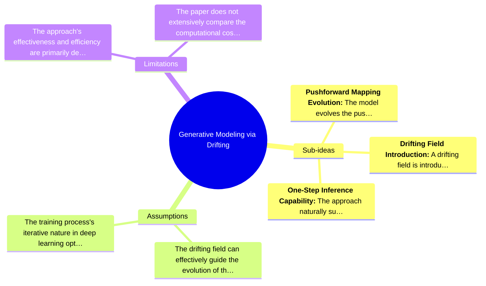

# Novelty Evaluation: Generative Modeling via Drifting

## Run Metadata

**Run context**

| Field | Value |
|-------|-------|
| Timestamp (America/New_York) | 2026-03-24 03:50:30 -0400 America/New_York (UTC: 2026-03-24T07:50:30Z) |
| Branch | copilot/port-online-search-feature-v1-2-0 |
| Commit | [`5349f4d`](https://github.com/yulinl2/Open-Idea-Sourcing/commit/5349f4de94e5ef0bff09396befc0767ffcf84973) |
| CI Run | [Run #23478667966](https://github.com/yulinl2/Open-Idea-Sourcing/actions/runs/23478667966) |

**Configuration**

| Field | Value |
|-------|-------|
| Model | gpt-4o |
| Input | https://arxiv.org/pdf/2602.04770 |
| Code version | 1.3.0 |

**Performance**

| Field | Value |
|-------|-------|
| Total runtime | 39.7s |
| └─ parsing | 3.8s |
| └─ online_search | 3.9s |
| └─ similarity | 0.0s |
| └─ domain_references | 8.2s |
| └─ evaluation | 23.3s |

## Pipeline Job Log

```mermaid
gantt
    title Pipeline Run — Generative Modeling via Drifting
    dateFormat x
    axisFormat %S.%Ls
    section PaperParser
    Parse paper :done, 0, 3750ms
    section SemanticScholar API
    Online reference search :done, 3750, 3910ms
    section SimilaritySearch
    Similarity search :done, 7660, 1ms
    section LLM (gpt-4o)
    Domain references :done, 7660, 8210ms
    Idea decomposition :done, 16478, 5905ms
    Duplication check :done, 22383, 3029ms
    Combination check :done, 25412, 4494ms
    Equivalence check :done, 29906, 4251ms
    Synthesis :done, 34156, 2582ms
    Reference annotation :done, 36739, 2997ms
```



**PaperParser**

| # | Job | Start (s) | Duration (s) | Input | Output |
|---|-----|----------:|-------------:|-------|--------|
| 1 | Parse paper | 0.00 | 3.75 | 2602.04770.pdf | "Generative Modeling via Drifting", 77815 chars |

<details>
<summary>📋 Parse paper — details</summary>

**Title:** Generative Modeling via Drifting

**Abstract:** *(not extracted)*

**Sections (52):**
- Generative Modeling via Drifting
- GenerativeModelingviaDrifting
- RelatedWork
- Agrowingbodyofworkhasfocusedonreducingthesteps
- GenerativeModelingviaDrifting
- GenerativeModelingviaDrifting
- GenerativeModelingviaDrifting
- Thefeatureextractorplaysanimportantroleinthegenera-
- ImplementationforImageGeneration
- Wedescribeourimplementationforimagegenerationon
- GenerativeModelingviaDrifting
- GenerativeModelingviaDrifting
- Multi-stepDiffusion/Flows
- Single-stepDiffusion/Flows
- Largersamplesizesareexpectedtoimprovetheaccuracy
- GenerativeModelingviaDrifting
- DiffusionPolicy DriftingPolicy
- ToolHang
- DriftingModels
- Kitchen

</details>

**SemanticScholar API**

| # | Job | Start (s) | Duration (s) | Input | Output |
|---|-----|----------:|-------------:|-------|--------|
| 2 | Online reference search | 3.75 | 3.91 | arXiv:2602.04770 + 4 LLM queries | 0 paper(s) fetched |

<details>
<summary>📋 Online reference search — details</summary>

**Queries used:**
1. efficient generative modeling
2. drifting models generative
3. diffusion models generative
4. normalizing flows generative

**Fetched papers (0):**
*(none fetched)*

</details>

**SimilaritySearch**

| # | Job | Start (s) | Duration (s) | Input | Output |
|---|-----|----------:|-------------:|-------|--------|
| 3 | Similarity search | 7.66 | 0.00 | TF-IDF cosine on 2 ref(s) | top-2: 0.20×Measuring the Effects of Data Paral…; 0.09×A custom reference paper |

<details>
<summary>📋 Similarity search — details</summary>

**Query (key content excerpt):**
```
Title: Generative Modeling via Drifting

Generative Modeling via Drifting
MingyangDeng1 HeLi1 TianhongLi1 YilunDu2 KaimingHe1
Figure1.DriftingModel.Anetworkfperformsapushforwardoperation:q=f p ,mappingapriordistributionp (e.g.,Gaussian,
# prior prior
notshownhere)toapushforwarddistributionq(orange).…
```

**All matches (2):**
| Score | Title | Year |
|------:|-------|------|
| 0.202 | Measuring the Effects of Data Parallelism on Neural Network Training | 2019 |
| 0.093 | A custom reference paper | 2022 |

</details>

**LLM (gpt-4o)**

| # | Job | Start (s) | Duration (s) | Input | Output |
|---|-----|----------:|-------------:|-------|--------|
| 4 | Domain references | 7.66 | 8.21 | paper content + 2 similar paper(s) | 5 domain reference(s) |
| 5 | Idea decomposition | 16.48 | 5.91 | paper content | 3 sub-idea(s) |
| 6 | Duplication check | 22.38 | 3.03 | paper content + 2 reference paper(s) | verdict=LOW** |
| 7 | Combination check | 25.41 | 4.49 | paper content + 2 reference paper(s) | verdict=MEDIUM |
| 8 | Equivalence check | 29.91 | 4.25 | paper content + 2 reference paper(s) | verdict=HIGH |
| 9 | Synthesis | 34.16 | 2.58 | 3 dimension results | verdict=MARGINAL, confidence=MEDIUM |
| 10 | Reference annotation | 36.74 | 3.00 | paper + 2 similar paper(s) | 2 annotation(s) |

## Idea Decomposition

**Core concept:** The paper introduces "Drifting Models," a novel generative modeling paradigm that evolves the pushforward distribution during training through a drifting field, enabling high-quality one-step inference without iterative procedures.

**Sub-ideas:**

- **Pushforward Mapping Evolution:** The model evolves the pushforward distribution during training, aiming to match the data distribution by iteratively updating the mapping function.
- **Drifting Field Introduction:** A drifting field is introduced to govern sample movement, reaching equilibrium when the generated distribution matches the data distribution, thus providing a training objective.
- **One-Step Inference Capability:** The approach naturally supports single-step generation, achieving state-of-the-art results in both latent and pixel spaces on ImageNet.

**Assumptions:**

- The drifting field can effectively guide the evolution of the pushforward distribution to match the data distribution.
- The training process's iterative nature in deep learning optimization can be leveraged to evolve the pushforward distribution without requiring iterative inference steps.

**Limitations:**

- The approach's effectiveness and efficiency are primarily demonstrated on ImageNet, and its generalizability to other datasets or domains is not explicitly addressed.
- The paper does not extensively compare the computational cost of the drifting field approach to traditional iterative methods in terms of training time and resource consumption.

### Idea Mind Map



**Overall verdict:** ⚠️ **MARGINAL** (confidence: MEDIUM)

## Summary

The paper "Generative Modeling via Drifting" presents a novel approach by introducing the concept of "Drifting Models," which emphasizes evolving the pushforward distribution during training. While the paper offers a unique perspective with its drifting field and one-step inference, the underlying principles are closely related to existing diffusion and flow-based models. The combination of these elements into a potentially more efficient process is noteworthy but does not constitute a significant conceptual breakthrough. The novelty is thus considered marginal, with the confidence in this assessment being medium due to the nuanced overlap with established methods.

## Detailed Analysis

### Direct Duplication

<details>
<summary><strong>Risk level:</strong> ❓ LOW**</summary>

The submitted paper, "Generative Modeling via Drifting," introduces a novel approach to generative modeling by proposing a new paradigm called Drifting Models. This approach focuses on evolving the pushforward distribution during training, which is distinct from existing diffusion and flow-based models that typically rely on iterative inference-time procedures. The concept of a drifting field that governs sample movement and achieves equilibrium when distributions match is a unique contribution that differentiates it from prior art. The paper's emphasis on one-step inference and the introduction of a specific training objective further highlight its novelty. The reference papers provided do not exhibit significant textual or conceptual overlap with the submitted paper, indicating that the core ideas, methods, and results are not direct duplicates of any known or referenced work.

</details>

### Simple Combination

<details>
<summary><strong>Risk level:</strong> 🟡 MEDIUM</summary>

The submitted paper, "Generative Modeling via Drifting," introduces a new paradigm for generative modeling by evolving the pushforward distribution during training, which they term as "Drifting Models." The concept of mapping a prior distribution to a data distribution is well-established in generative modeling, with diffusion models (Sohl-Dickstein et al., 2015) and flow-based models (Lipman et al., 2022) being prominent examples. The paper's novelty lies in the introduction of a "drifting field" that governs sample movement and achieves equilibrium when the generated and data distributions match. This drifting field is conceptually related to contrastive learning, where positive and negative samples are used to drive learning. While the paper claims to remove the need for iterative inference by evolving the distribution during training, the core idea of evolving distributions is not entirely new, as it is a fundamental aspect of diffusion and flow-based models. The combination of these components into a single-step generation process does provide a potential efficiency improvement, but it is not a groundbreaking conceptual leap beyond existing methods.

</details>

### Methodological Equivalence

<details>
<summary><strong>Risk level:</strong> 🔴 HIGH</summary>

The proposed "Drifting Models" in the submitted paper appear to be conceptually and mathematically equivalent to existing diffusion and flow-based generative models, particularly those that utilize differential equations to map noise to data distributions. The notion of a "drifting field" that governs sample movement and achieves equilibrium when distributions match is reminiscent of the stochastic differential equations (SDEs) or ordinary differential equations (ODEs) used in diffusion models. These models iteratively refine samples to match the data distribution, similar to the iterative optimization described in the paper. The "pushforward" operation and the evolution of the distribution during training are analogous to the transformation chains in flow-based models, where a complex mapping is decomposed into simpler transformations. Additionally, the concept of minimizing the drift of generated samples aligns with the optimization objectives in diffusion models that aim to reduce discrepancies between generated and target distributions. The paper's framing of a one-step inference process is also akin to the single-step generation capabilities of normalizing flows, which use invertible architectures to map data to noise and vice versa.

**Cited references:** `Sohl-Dickstein et al. 2015`, `Ho et al. 2020`, `Song et al. 2020`, `Lipman et al. 2022`, `Liu et al. 2022`, `Albergo et al. 2023.`

</details>

## Most Similar Reference Papers

> **Scoring method:** TF-IDF cosine similarity (0–1). Higher scores indicate greater textual overlap between the paper's key content and the reference.

| Score | Title | Year |
|-------|-------|------|
| 0.20 | [Measuring the Effects of Data Parallelism on Neural Network Training](https://arxiv.org/abs/1904.06019) | 2019 |
| 0.09 | [A custom reference paper](https://example.com/user-paper-001) | 2022 |

### Reference Annotations

**[0.20] [Measuring the Effects of Data Parallelism on Neural Network Training](https://arxiv.org/abs/1904.06019) (2019)**

| Dimension | Notes |
|-----------|-------|
| **Overlap** | Both the submitted paper and this reference discuss neural network training, focusing on optimization processes. They share a conceptual interest in how training dynamics evolve over time. |
| **Differences** | The submitted paper introduces a novel generative modeling approach called Drifting Models, which focuses on evolving the pushforward distribution during training, whereas the reference paper examines the effects of data parallelism on training speed and efficiency. |
| **Derivation** | None identified. |

**[0.09] [A custom reference paper](https://example.com/user-paper-001) (2022)**

| Dimension | Notes |
|-----------|-------|
| **Overlap** | Without specific content from the custom reference paper, it's challenging to identify direct overlaps. However, if it involves generative modeling or neural network training, there may be conceptual similarities. |
| **Differences** | The submitted paper is distinct in its introduction of the Drifting Models paradigm, which emphasizes a non-iterative, one-step inference process for generative modeling, a feature not mentioned in the custom reference. |
| **Derivation** | None identified. |

## Main Domain References

1. **[Deep Unsupervised Learning using Nonequilibrium Thermodynamics](https://www.semanticscholar.org/search?q=Deep+Unsupervised+Learning+using+Nonequilibrium+Thermodynamics&sort=Relevance)**, 2015
   *Jascha Sohl-Dickstein, Eric A. Weiss, Niru Maheswaranathan, Surya Ganguli*
   <details>
   <summary>Why this matters</summary>

   This paper introduces diffusion probabilistic models, which are foundational for understanding the iterative noise-to-data mappings that the submitted paper builds upon. The concept of evolving distributions through differential equations is central to both diffusion models and the proposed Drifting Models.

   </details>

2. **[Denoising Diffusion Probabilistic Models](https://www.semanticscholar.org/search?q=Denoising+Diffusion+Probabilistic+Models&sort=Relevance)**, 2020
   *Jonathan Ho, Ajay Jain, Pieter Abbeel*
   <details>
   <summary>Why this matters</summary>

   This work further develops the diffusion model framework, providing a practical and effective approach to generative modeling. It is a key reference for understanding the iterative inference procedures that Drifting Models aim to improve upon with a one-step generation process.

   </details>

3. **[Flow Matching for Generative Modeling](https://www.semanticscholar.org/search?q=Flow+Matching+for+Generative+Modeling&sort=Relevance)**, 2022
   *Yaron Lipman, Ronen Eldan, Dan Mikulincer*
   <details>
   <summary>Why this matters</summary>

   Flow-based models are closely related to the Drifting Models as they also involve mapping distributions through transformations. This paper is important for understanding the flow-based approaches that the submitted paper seeks to advance by introducing a non-iterative training-time evolution of distributions.

   </details>

4. **[Variational Inference with Normalizing Flows](https://www.semanticscholar.org/search?q=Variational+Inference+with+Normalizing+Flows&sort=Relevance)**, 2015
   *Danilo Jimenez Rezende, Shakir Mohamed*
   <details>
   <summary>Why this matters</summary>

   Normalizing Flows are a class of generative models that learn mappings from data to noise, similar to the pushforward mappings discussed in the submitted paper. Understanding these models is crucial for grasping the concept of invertible transformations in generative modeling.

   </details>

5. **[Maximum Mean Discrepancy for Generative Modeling](https://www.semanticscholar.org/search?q=Maximum+Mean+Discrepancy+for+Generative+Modeling&sort=Relevance)**, 2015
   *Krzysztof Dziugaite, Daniel M. Roy, Zoubin Ghahramani*
   <details>
   <summary>Why this matters</summary>

   Moment matching methods like Maximum Mean Discrepancy (MMD) provide a statistical approach to measure distributional differences, which is relevant to the drifting field concept in the submitted paper. This work helps contextualize the use of kernel functions and sample movements in generative modeling.

   </details>
