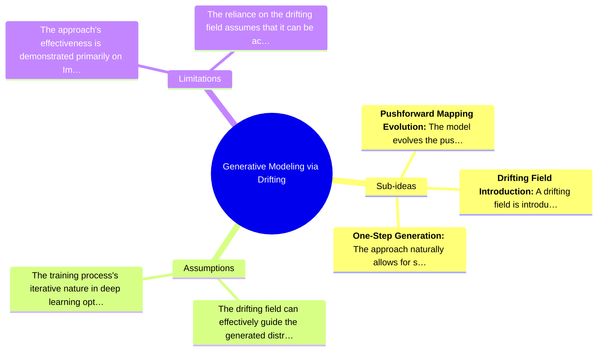

# Novelty Evaluation: Generative Modeling via Drifting

## Run Metadata

**Run context**

| Field | Value |
|-------|-------|
| Timestamp (America/New_York) | 2026-03-24 05:03:01 -0400 America/New_York (UTC: 2026-03-24T09:03:01Z) |
| Branch | copilot/port-online-search-feature-v1-2-0 |
| Commit | [`6e7bb82`](https://github.com/yulinl2/Open-Idea-Sourcing/commit/6e7bb82824fdf007313cbcc42c4f9a6fade0ebf7) |
| CI Run | [Run #23481263223](https://github.com/yulinl2/Open-Idea-Sourcing/actions/runs/23481263223) |

**Configuration**

| Field | Value |
|-------|-------|
| Model | gpt-4o |
| Input | https://arxiv.org/pdf/2602.04770 |
| Code version | 1.3.0 |

**Performance**

| Field | Value |
|-------|-------|
| Total runtime | 40.7s |
| └─ parsing | 3.8s |
| └─ online_search | 2.6s |
| └─ similarity | 0.0s |
| └─ domain_references | 5.7s |
| └─ evaluation | 27.9s |

## Pipeline Job Log

```mermaid
gantt
    title Pipeline Run — Generative Modeling via Drifting
    dateFormat x
    axisFormat %S.%Ls
    section PaperParser
    Parse paper :done, 0, 3770ms
    section SemanticScholar API
    Online reference search :done, 3770, 2590ms
    section SimilaritySearch
    Similarity search :done, 6360, 10ms
    section LLM (gpt-4o)
    Domain references :done, 6370, 5740ms
    Idea decomposition :done, 12757, 4730ms
    Duplication check :done, 17486, 2486ms
    Combination check :done, 19972, 6362ms
    Equivalence check :done, 26335, 4187ms
    Synthesis :done, 30521, 2878ms
    Reference annotation :done, 33399, 7257ms
```



**PaperParser**

| # | Job | Start (s) | Duration (s) | Input | Output |
|---|-----|----------:|-------------:|-------|--------|
| 1 | Parse paper | 0.00 | 3.77 | 2602.04770.pdf | "Generative Modeling via Drifting", 77815 chars |

<details>
<summary>📋 Parse paper — details</summary>

**Title:** Generative Modeling via Drifting

**Authors:** *(not extracted)*

**Abstract:** *(not extracted)*

**Sections (52):**
- Generative Modeling via Drifting
- GenerativeModelingviaDrifting
- RelatedWork
- Agrowingbodyofworkhasfocusedonreducingthesteps
- GenerativeModelingviaDrifting
- GenerativeModelingviaDrifting
- GenerativeModelingviaDrifting
- Thefeatureextractorplaysanimportantroleinthegenera-
- ImplementationforImageGeneration
- Wedescribeourimplementationforimagegenerationon
- GenerativeModelingviaDrifting
- GenerativeModelingviaDrifting
- Multi-stepDiffusion/Flows
- Single-stepDiffusion/Flows
- Largersamplesizesareexpectedtoimprovetheaccuracy
- GenerativeModelingviaDrifting
- DiffusionPolicy DriftingPolicy
- ToolHang
- DriftingModels
- Kitchen

</details>

**SemanticScholar API**

| # | Job | Start (s) | Duration (s) | Input | Output |
|---|-----|----------:|-------------:|-------|--------|
| 2 | Online reference search | 3.77 | 2.59 | arXiv:2602.04770 + 5 LLM queries | 10 paper(s) fetched |

<details>
<summary>📋 Online reference search — details</summary>

**Queries used:**
1. generative model mapping
2. drifting models generative
3. diffusion model generative
4. normalizing flows generative
5. moment matching generative

**Fetched papers (10):**
1. **Improved Mean Flows: On the Challenges of Fastforward Generative Models** (2025)
2. **Adversarial Flow Models** (2025)
3. **PixelDiT: Pixel Diffusion Transformers for Image Generation** (2025)
4. **There is No VAE: End-to-End Pixel-Space Generative Modeling via Self-Supervised Pre-training** (2025)
5. **Contrastive Flow Matching** (2025)
6. **Mean Flows for One-step Generative Modeling** (2025)
7. **Inductive Moment Matching** (2025)
8. **Reconstruction vs. Generation: Taming Optimization Dilemma in Latent Diffusion Models** (2025)
9. **Normalizing Flows are Capable Generative Models** (2024)
10. **Simpler Diffusion (SiD2): 1.5 FID on ImageNet512 with pixel-space diffusion** (2024)

**Errors encountered:**
- ⚠️ query 'generative model mapping': HTTP Error 429: 
- ⚠️ query 'drifting models generative': HTTP Error 429: 
- ⚠️ query 'diffusion model generative': HTTP Error 429: 
- ⚠️ query 'normalizing flows generative': HTTP Error 429: 
- ⚠️ query 'moment matching generative': HTTP Error 429: 

</details>

**SimilaritySearch**

| # | Job | Start (s) | Duration (s) | Input | Output |
|---|-----|----------:|-------------:|-------|--------|
| 3 | Similarity search | 6.36 | 0.01 | TF-IDF cosine on 11 ref(s) | top-5: 0.20×There is No VAE: End-to-End Pixel-S…; 0.20×Normalizing Flows are Capable Gener…; 0.17×Inductive Moment Matching; +2 more |

<details>
<summary>📋 Similarity search — details</summary>

**Query (key content excerpt):**
```
Title: Generative Modeling via Drifting

Generative Modeling via Drifting
MingyangDeng1 HeLi1 TianhongLi1 YilunDu2 KaimingHe1
Figure1.DriftingModel.Anetworkfperformsapushforwardoperation:q=f p ,mappingapriordistributionp (e.g.,Gaussian,
# prior prior
notshownhere)toapushforwarddistributionq(orange).…
```

**All matches (5):**
| Score | Title | Year |
|------:|-------|------|
| 0.204 | There is No VAE: End-to-End Pixel-Space Generative Modeling via Self-Supervised Pre-training | 2025 |
| 0.195 | Normalizing Flows are Capable Generative Models | 2024 |
| 0.167 | Inductive Moment Matching | 2025 |
| 0.153 | Mean Flows for One-step Generative Modeling | 2025 |
| 0.151 | Improved Mean Flows: On the Challenges of Fastforward Generative Models | 2025 |

</details>

**LLM (gpt-4o)**

| # | Job | Start (s) | Duration (s) | Input | Output |
|---|-----|----------:|-------------:|-------|--------|
| 4 | Domain references | 6.37 | 5.74 | paper content + 5 similar paper(s) | 5 domain reference(s) |
| 5 | Idea decomposition | 12.76 | 4.73 | paper content | 3 sub-idea(s) |
| 6 | Duplication check | 17.49 | 2.49 | paper content + 5 reference paper(s) | verdict=LOW** |
| 7 | Combination check | 19.97 | 6.36 | paper content + 5 reference paper(s) | verdict=MEDIUM** |
| 8 | Equivalence check | 26.34 | 4.19 | paper content + 5 reference paper(s) | verdict=HIGH |
| 9 | Synthesis | 30.52 | 2.88 | 3 dimension results | verdict=MARGINAL, confidence=MEDIUM |
| 10 | Reference annotation | 33.40 | 7.26 | paper + 5 similar paper(s) | 5 annotation(s) |

## Idea Decomposition

**Core concept:** The paper introduces "Drifting Models," a novel generative modeling paradigm that evolves the pushforward distribution during training, enabling high-quality one-step generation by utilizing a drifting field to guide sample movements towards equilibrium with the data distribution.

**Sub-ideas:**

- **Pushforward Mapping Evolution:** The model evolves the pushforward distribution during training, removing the need for iterative inference procedures typical in diffusion and flow-based models.
- **Drifting Field Introduction:** A drifting field is introduced to govern sample movements, achieving equilibrium when the generated distribution matches the data distribution.
- **One-Step Generation:** The approach naturally allows for single-step generation, achieving state-of-the-art results in both latent and pixel spaces on ImageNet 256×256.

**Assumptions:**

- The drifting field can effectively guide the generated distribution to match the data distribution.
- The training process's iterative nature in deep learning optimization can be leveraged to evolve the pushforward distribution effectively.

**Limitations:**

- The approach's effectiveness is demonstrated primarily on ImageNet 256×256, and its generalizability to other datasets or tasks is not explicitly addressed.
- The reliance on the drifting field assumes that it can be accurately designed and implemented to achieve the desired equilibrium state.

### Idea Mind Map



**Overall verdict:** ⚠️ **MARGINAL** (confidence: MEDIUM)

## Summary

The paper "Generative Modeling via Drifting" introduces a novel concept of a "drifting field" for generative modeling, which offers a distinct approach compared to traditional diffusion and flow-based models. However, while the paper presents an innovative combination of existing methodologies, the core ideas are not entirely groundbreaking, as they share conceptual and mathematical similarities with existing models. The approach provides potential improvements in efficiency and performance, particularly in achieving one-step generation, but it does not represent a wholly original insight. The overall contribution is incremental, warranting a marginal novelty verdict.

## Detailed Analysis

### Direct Duplication

<details>
<summary><strong>Risk level:</strong> ❓ LOW**</summary>

The submitted paper "Generative Modeling via Drifting" introduces a novel approach to generative modeling by evolving the pushforward distribution during training, which is distinct from the iterative inference procedures commonly used in diffusion and flow-based models. The concept of a "drifting field" that governs sample movement and achieves equilibrium when distributions match is a unique contribution that differentiates it from existing methods. The paper's focus on a single-step inference process and the introduction of a training-time drifting field are not directly duplicated in the reference papers. While there are thematic overlaps with existing generative modeling techniques, such as diffusion models and normalizing flows, the core ideas and methods presented in this paper are sufficiently distinct to warrant a low duplication verdict.

**Cited references:** `none.`

</details>

### Simple Combination

<details>
<summary><strong>Risk level:</strong> ❓ MEDIUM**</summary>

The submitted paper, "Generative Modeling via Drifting," presents a novel approach to generative modeling by introducing the concept of a "drifting field" that evolves the pushforward distribution during training. This approach is positioned as an alternative to existing diffusion and flow-based models, which typically rely on iterative inference processes. The paper draws on several existing methodologies: the concept of pushforward distributions is a fundamental aspect of normalizing flows (as seen in reference [f06c6995371d5490ee40b1d4226657e0834e34e6]), and the iterative evolution of distributions during training is reminiscent of diffusion models (referenced in [19df654b0d0f634a451564346a09af8bd348dac0]). The drifting field concept, which governs sample movement and aims for equilibrium when distributions match, is a novel addition that differentiates this work from prior models. However, the paper's reliance on existing paradigms like diffusion and flow models, combined with the introduction of a drifting field, suggests an incremental rather than a groundbreaking advancement. The combination of these components does offer a potential improvement in efficiency and performance, particularly in achieving one-step generation, but it does not constitute a wholly original insight.

**Cited references:** `f06c6995371d5490ee40b1d4226657e0834e34e6`, `19df654b0d0f634a451564346a09af8bd348dac0`

</details>

### Methodological Equivalence

<details>
<summary><strong>Risk level:</strong> 🔴 HIGH</summary>

The proposed "Drifting Models" in the submitted paper appear to be conceptually and mathematically equivalent to existing diffusion and flow-based generative models, particularly those that involve iteratively evolving a distribution towards a target distribution. The notion of a "drifting field" that governs sample movement and achieves equilibrium when the generated distribution matches the data distribution is reminiscent of the stochastic differential equations (SDEs) or ordinary differential equations (ODEs) used in diffusion models. These models also iteratively refine samples from a noise distribution to match the data distribution, which is a core concept in diffusion models like those by Sohl-Dickstein et al. (2015) and Ho et al. (2020). Furthermore, the idea of evolving the pushforward distribution during training aligns with the iterative nature of training in flow-based models, where a complex transformation is decomposed into a sequence of simpler transformations. The paper's emphasis on a single-step generation process also parallels the objectives of normalizing flows (NFs) and other one-step generative models, which aim to achieve efficient generation without iterative refinement at inference time.

**Cited references:** `f06c6995371d5490ee40b1d4226657e0834e34e6`, `19df654b0d0f634a451564346a09af8bd348dac0`

</details>

## Most Similar Reference Papers

> **Scoring method:** TF-IDF cosine similarity (0–1). Higher scores indicate greater textual overlap between the paper's key content and the reference.

| Score | Title | Year |
|-------|-------|------|
| 0.20 | [There is No VAE: End-to-End Pixel-Space Generative Modeling via Self-Supervised Pre-training](https://www.semanticscholar.org/paper/c3e4ff6e7fb7e65cec814c454cc42412a356f101) | 2025 |
| 0.20 | [Normalizing Flows are Capable Generative Models](https://www.semanticscholar.org/paper/f06c6995371d5490ee40b1d4226657e0834e34e6) | 2024 |
| 0.17 | [Inductive Moment Matching](https://www.semanticscholar.org/paper/b50e850a58b6fc41bbbbf05d199aa43dc581c163) | 2025 |
| 0.15 | [Mean Flows for One-step Generative Modeling](https://www.semanticscholar.org/paper/19df654b0d0f634a451564346a09af8bd348dac0) | 2025 |
| 0.15 | [Improved Mean Flows: On the Challenges of Fastforward Generative Models](https://www.semanticscholar.org/paper/2cc9d6d644ef0169a767c5cc76a7eeec77333ff1) | 2025 |

### Reference Annotations

**[0.20] [There is No VAE: End-to-End Pixel-Space Generative Modeling via Self-Supervised Pre-training](https://www.semanticscholar.org/paper/c3e4ff6e7fb7e65cec814c454cc42412a356f101) (2025)**

| Dimension | Notes |
|-----------|-------|
| **Overlap** | Both the submitted paper and this reference focus on generative modeling in pixel space, addressing the challenges associated with training and performance in this domain. |
| **Differences** | The submitted paper introduces a novel "Drifting Models" paradigm that evolves the pushforward distribution during training, while the reference paper employs a two-stage training framework to enhance pixel-space diffusion models. |
| **Derivation** | None identified. |

**[0.20] [Normalizing Flows are Capable Generative Models](https://www.semanticscholar.org/paper/f06c6995371d5490ee40b1d4226657e0834e34e6) (2024)**

| Dimension | Notes |
|-----------|-------|
| **Overlap** | Both papers discuss generative modeling techniques and explore the concept of mapping distributions, with the submitted paper focusing on pushforward distributions and the reference on Normalizing Flows. |
| **Differences** | The submitted paper proposes a one-step generative model using a drifting field, whereas the reference paper emphasizes the capabilities of Normalizing Flows for density estimation and generative tasks. |
| **Derivation** | None identified. |

**[0.17] [Inductive Moment Matching](https://www.semanticscholar.org/paper/b50e850a58b6fc41bbbbf05d199aa43dc581c163) (2025)**

| Dimension | Notes |
|-----------|-------|
| **Overlap** | Both papers address the challenge of reducing inference time in generative models, with the submitted paper achieving one-step generation and the reference proposing Inductive Moment Matching for few-step models. |
| **Differences** | The submitted paper introduces a drifting field to evolve the pushforward distribution, while the reference focuses on moment matching to stabilize and distill diffusion models. |
| **Derivation** | None identified. |

**[0.15] [Mean Flows for One-step Generative Modeling](https://www.semanticscholar.org/paper/19df654b0d0f634a451564346a09af8bd348dac0) (2025)**

| Dimension | Notes |
|-----------|-------|
| **Overlap** | Both papers propose frameworks for one-step generative modeling, with the submitted paper using a drifting field and the reference introducing average velocity in flow fields. |
| **Differences** | The submitted paper's drifting field governs sample movement during training, whereas the reference paper contrasts average and instantaneous velocities to characterize flow fields. |
| **Derivation** | None identified. |

**[0.15] [Improved Mean Flows: On the Challenges of Fastforward Generative Models](https://www.semanticscholar.org/paper/2cc9d6d644ef0169a767c5cc76a7eeec77333ff1) (2025)**

| Dimension | Notes |
|-----------|-------|
| **Overlap** | Both papers explore one-step generative modeling frameworks, with the submitted paper focusing on Drifting Models and the reference on MeanFlow. |
| **Differences** | The submitted paper emphasizes the evolution of the pushforward distribution via a drifting field, while the reference discusses challenges in the fastforward nature of MeanFlow and its training objectives. |
| **Derivation** | None identified. |

## Main Domain References

1. **[Deep Unsupervised Learning using Nonequilibrium Thermodynamics](https://www.semanticscholar.org/search?q=Deep+Unsupervised+Learning+using+Nonequilibrium+Thermodynamics&sort=Relevance)**, 2015
   *Jascha Sohl-Dickstein, Eric A. Weiss, Niru Maheswaranathan, Surya Ganguli*
   <details>
   <summary>Why this matters</summary>

   This paper introduces diffusion probabilistic models, which are foundational for understanding the iterative noise-to-data mapping in generative models, a concept that is extended in the Drifting Models approach.

   </details>

2. **[Denoising Diffusion Probabilistic Models](https://www.semanticscholar.org/search?q=Denoising+Diffusion+Probabilistic+Models&sort=Relevance)**, 2020
   *Jonathan Ho, Ajay Jain, Pieter Abbeel*
   <details>
   <summary>Why this matters</summary>

   This work advances the field of diffusion models, providing a framework that is crucial for understanding the iterative processes in generative modeling, which the Drifting Models aim to simplify.

   </details>

3. **[Flow Matching for Generative Modeling](https://www.semanticscholar.org/search?q=Flow+Matching+for+Generative+Modeling&sort=Relevance)**, 2022
   *Yaron Lipman, Ronen Eldan, Dan Mikulincer*
   <details>
   <summary>Why this matters</summary>

   Flow Matching is a related approach that deals with mapping distributions through differential equations, similar to the pushforward distribution evolution in Drifting Models.

   </details>

4. **[Variational Inference with Normalizing Flows](https://www.semanticscholar.org/search?q=Variational+Inference+with+Normalizing+Flows&sort=Relevance)**, 2015
   *Danilo Jimenez Rezende, Shakir Mohamed*
   <details>
   <summary>Why this matters</summary>

   This paper introduces Normalizing Flows, a method for transforming distributions that is relevant for understanding the pushforward mapping in generative models like Drifting Models.

   </details>

5. **[Maximum Mean Discrepancy for Generative Models](https://www.semanticscholar.org/search?q=Maximum+Mean+Discrepancy+for+Generative+Models&sort=Relevance)**, 2015
   *Krzysztof Dziugaite, Daniel Roy, Zoubin Ghahramani*
   <details>
   <summary>Why this matters</summary>

   Moment Matching and MMD are techniques for aligning distributions, which are conceptually related to the loss functions used in Drifting Models to achieve distribution matching.

   </details>
