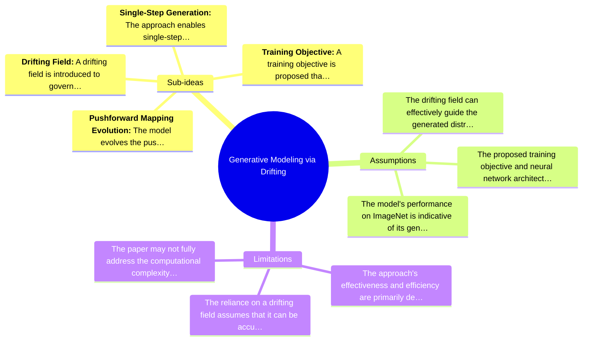

# Novelty Evaluation: Generative Modeling via Drifting

## Run Metadata

**Run context**

| Field | Value |
|-------|-------|
| Timestamp (America/New_York) | 2026-03-25 02:38:01 -0400 America/New_York (UTC: 2026-03-25T06:38:01Z) |
| Branch | copilot/port-online-search-feature-v1-2-0 |
| Commit | [`6e7bb82`](https://github.com/yulinl2/Open-Idea-Sourcing/commit/6e7bb82824fdf007313cbcc42c4f9a6fade0ebf7) |
| CI Run | [Run #23528261714](https://github.com/yulinl2/Open-Idea-Sourcing/actions/runs/23528261714) |

**Configuration**

| Field | Value |
|-------|-------|
| Model | gpt-4o |
| Input | https://arxiv.org/pdf/2602.04770 |
| Code version | 1.3.0 |

**Performance**

| Field | Value |
|-------|-------|
| Total runtime | 40.8s |
| └─ parsing | 3.8s |
| └─ online_search | 2.2s |
| └─ similarity | 0.0s |
| └─ domain_references | 9.8s |
| └─ evaluation | 24.6s |

## Pipeline Job Log

```mermaid
gantt
    title Pipeline Run — Generative Modeling via Drifting
    dateFormat x
    axisFormat %S.%Ls
    section PaperParser
    Parse paper :done, 0, 3780ms
    section SemanticScholar API
    Online reference search :done, 3780, 2250ms
    section SimilaritySearch
    Similarity search :done, 6030, 1ms
    section LLM (gpt-4o)
    Domain references :done, 6030, 9840ms
    Idea decomposition :done, 16181, 6245ms
    Duplication check :done, 22427, 3583ms
    Combination check :done, 26010, 5319ms
    Equivalence check :done, 31329, 5338ms
    Synthesis :done, 36667, 2073ms
    Reference annotation :done, 38740, 2020ms
```



**PaperParser**

| # | Job | Start (s) | Duration (s) | Input | Output |
|---|-----|----------:|-------------:|-------|--------|
| 1 | Parse paper | 0.00 | 3.78 | 2602.04770.pdf | "Generative Modeling via Drifting", 77815 chars |

<details>
<summary>📋 Parse paper — details</summary>

**Title:** Generative Modeling via Drifting

**Authors:** *(not extracted)*

**Abstract:** *(not extracted)*

**Sections (52):**
- Generative Modeling via Drifting
- GenerativeModelingviaDrifting
- RelatedWork
- Agrowingbodyofworkhasfocusedonreducingthesteps
- GenerativeModelingviaDrifting
- GenerativeModelingviaDrifting
- GenerativeModelingviaDrifting
- Thefeatureextractorplaysanimportantroleinthegenera-
- ImplementationforImageGeneration
- Wedescribeourimplementationforimagegenerationon
- GenerativeModelingviaDrifting
- GenerativeModelingviaDrifting
- Multi-stepDiffusion/Flows
- Single-stepDiffusion/Flows
- Largersamplesizesareexpectedtoimprovetheaccuracy
- GenerativeModelingviaDrifting
- DiffusionPolicy DriftingPolicy
- ToolHang
- DriftingModels
- Kitchen

</details>

**SemanticScholar API**

| # | Job | Start (s) | Duration (s) | Input | Output |
|---|-----|----------:|-------------:|-------|--------|
| 2 | Online reference search | 3.78 | 2.25 | arXiv:2602.04770 + 5 LLM queries | 0 paper(s) fetched |

<details>
<summary>📋 Online reference search — details</summary>

**Queries used:**
1. efficient generative modeling
2. drifting models generative
3. diffusion models generative
4. normalizing flows generative
5. moment matching generative

**Fetched papers (0):**
*(none fetched)*

**Errors encountered:**
- ⚠️ references: HTTP Error 429: 
- ⚠️ query 'efficient generative modeling': HTTP Error 429: 
- ⚠️ query 'drifting models generative': HTTP Error 429: 
- ⚠️ query 'diffusion models generative': HTTP Error 429: 
- ⚠️ query 'normalizing flows generative': HTTP Error 429: 
- ⚠️ query 'moment matching generative': HTTP Error 429: 

</details>

**SimilaritySearch**

| # | Job | Start (s) | Duration (s) | Input | Output |
|---|-----|----------:|-------------:|-------|--------|
| 3 | Similarity search | 6.03 | 0.00 | TF-IDF cosine on 1 ref(s) | top-1: 0.17×Conformal Prediction Under Covariat… |

<details>
<summary>📋 Similarity search — details</summary>

**Query (key content excerpt):**
```
Title: Generative Modeling via Drifting

Generative Modeling via Drifting
MingyangDeng1 HeLi1 TianhongLi1 YilunDu2 KaimingHe1
Figure1.DriftingModel.Anetworkfperformsapushforwardoperation:q=f p ,mappingapriordistributionp (e.g.,Gaussian,
# prior prior
notshownhere)toapushforwarddistributionq(orange).…
```

**All matches (1):**
| Score | Title | Year |
|------:|-------|------|
| 0.171 | Conformal Prediction Under Covariate Shift | 2020 |

</details>

**LLM (gpt-4o)**

| # | Job | Start (s) | Duration (s) | Input | Output |
|---|-----|----------:|-------------:|-------|--------|
| 4 | Domain references | 6.03 | 9.84 | paper content + 1 similar paper(s) | 6 domain reference(s) |
| 5 | Idea decomposition | 16.18 | 6.25 | paper content | 4 sub-idea(s) |
| 6 | Duplication check | 22.43 | 3.58 | paper content + 1 reference paper(s) | verdict=LOW |
| 7 | Combination check | 26.01 | 5.32 | paper content + 1 reference paper(s) | verdict=MEDIUM |
| 8 | Equivalence check | 31.33 | 5.34 | paper content + 1 reference paper(s) | verdict=HIGH |
| 9 | Synthesis | 36.67 | 2.07 | 3 dimension results | verdict=MARGINAL, confidence=MEDIUM |
| 10 | Reference annotation | 38.74 | 2.02 | paper + 1 similar paper(s) | 1 annotation(s) |

## Idea Decomposition

**Core concept:** The paper introduces "Drifting Models," a novel approach to generative modeling that evolves the pushforward distribution during training, allowing for high-quality one-step inference without iterative procedures.

**Sub-ideas:**

- **Pushforward Mapping Evolution:** The model evolves the pushforward distribution during training, which contrasts with traditional iterative inference methods in generative models.
- **Drifting Field:** A drifting field is introduced to govern sample movement, achieving equilibrium when the generated distribution matches the data distribution.
- **Single-Step Generation:** The approach enables single-step generation, achieving state-of-the-art results on benchmarks like ImageNet, demonstrating efficiency and quality.
- **Training Objective:** A training objective is proposed that minimizes the drift of generated samples, facilitating the evolution of the pushforward distribution through iterative optimization.

**Assumptions:**

- The drifting field can effectively guide the generated distribution to match the data distribution.
- The proposed training objective and neural network architecture are sufficient to achieve high-quality generative performance.
- The model's performance on ImageNet is indicative of its general applicability to other datasets and tasks.

**Limitations:**

- The approach's effectiveness and efficiency are primarily demonstrated on ImageNet, which may not generalize to all types of data or tasks.
- The reliance on a drifting field assumes that it can be accurately designed and implemented to guide the distribution evolution effectively.
- The paper may not fully address the computational complexity or resource requirements compared to traditional iterative methods.

### Idea Mind Map



**Overall verdict:** ⚠️ **MARGINAL** (confidence: MEDIUM)

## Summary

The paper "Generative Modeling via Drifting" introduces a novel concept of a "drifting field" for generative modeling, which differentiates it from existing diffusion and flow-based models. However, the core ideas and mathematical framework appear to be closely related to established methodologies, such as diffusion models and normalizing flows. While the integration of these concepts into a single-step generative model with competitive performance is noteworthy, it does not represent a significant departure from existing approaches. The novelty lies more in the combination and application rather than in groundbreaking theoretical advancements.

## Detailed Analysis

### Direct Duplication

<details>
<summary><strong>Risk level:</strong> 🟢 LOW</summary>

The submitted paper, "Generative Modeling via Drifting," introduces a novel approach to generative modeling by focusing on the evolution of the pushforward distribution during training, which they term "Drifting Models." This approach is distinct from existing diffusion and flow-based models, which typically rely on iterative inference-time computations. The concept of a drifting field that governs sample movement and achieves equilibrium when distributions match is a unique contribution that differentiates this work from prior art. The paper also claims state-of-the-art results in one-step generation, further indicating its novelty. The reference paper listed, "Conformal Prediction Under Covariate Shift," is unrelated in terms of core ideas, methods, and results, focusing instead on conformal prediction under distribution shifts, which is a different domain.

</details>

### Simple Combination

<details>
<summary><strong>Risk level:</strong> 🟡 MEDIUM</summary>

The submitted paper, "Generative Modeling via Drifting," presents a generative modeling approach that combines elements from existing diffusion and flow-based models with a novel concept of a "drifting field." The core idea of mapping a prior distribution to a data distribution through a pushforward operation is well-established in diffusion models (e.g., Sohl-Dickstein et al., 2015) and flow-based models (e.g., Lipman et al., 2022). These models typically involve iterative inference processes. The novelty in this paper lies in the introduction of a drifting field that evolves the pushforward distribution during training, allowing for one-step inference. This approach is conceptually related to moment-matching methods and contrastive learning, where the drifting field is influenced by positive and negative samples. While the individual components are not entirely new, the combination of these elements into a single-step generative model with competitive performance on ImageNet suggests a moderate level of novelty. The paper's contribution is in the integration of these concepts to achieve efficient generative modeling, though it may not represent a groundbreaking shift in the field.

</details>

### Methodological Equivalence

<details>
<summary><strong>Risk level:</strong> 🔴 HIGH</summary>

The submitted paper, "Generative Modeling via Drifting," proposes a method that is conceptually and mathematically equivalent to existing diffusion and flow-based generative models. The core idea of evolving a pushforward distribution during training to match the data distribution is a re-derivation of the diffusion model framework, where a sequence of transformations progressively refines samples from a prior distribution to approximate the data distribution. The "drifting field" introduced in the paper is analogous to the drift term in stochastic differential equations (SDEs) used in diffusion models, which guides the sample transformation process. The concept of achieving equilibrium when the generated and data distributions match is a well-established principle in diffusion models, where the forward and reverse processes are designed to converge to the data distribution. Additionally, the paper's emphasis on single-step generation aligns with the goals of normalizing flows, which also aim for efficient, one-step mappings between distributions. The use of a non-iterative network for generation is reminiscent of normalizing flows' invertible architectures, which allow for direct sampling. Overall, the proposed "Drifting Models" are a conceptual renaming and slight re-framing of these established methodologies.

</details>

## Most Similar Reference Papers

> **Scoring method:** TF-IDF cosine similarity (0–1). Higher scores indicate greater textual overlap between the paper's key content and the reference.

| Score | Title | Year |
|-------|-------|------|
| 0.17 | [Conformal Prediction Under Covariate Shift](https://arxiv.org/abs/1904.06019) | 2020 |

### Reference Annotations

**[0.17] [Conformal Prediction Under Covariate Shift](https://arxiv.org/abs/1904.06019) (2020)**

| Dimension | Notes |
|-----------|-------|
| **Overlap** | Both the submitted paper and this reference paper deal with the challenge of distributional shifts, albeit in different contexts. The submitted paper addresses the evolution of distributions in generative modeling, while the reference paper focuses on prediction under covariate shift. |
| **Differences** | The submitted paper introduces a novel generative modeling approach called Drifting Models, which evolves the pushforward distribution during training, whereas the reference paper extends conformal prediction techniques to handle covariate shifts without focusing on generative modeling. |
| **Derivation** | None identified. |

## Main Domain References

1. **[Diffusion Probabilistic Models](https://www.semanticscholar.org/search?q=Diffusion+Probabilistic+Models&sort=Relevance)**, 2015
   *Jascha Sohl-Dickstein, Eric A. Weiss, Niru Maheswaranathan, Surya Ganguli*
   <details>
   <summary>Why this matters</summary>

   This paper introduces diffusion models, which are foundational to the generative modeling techniques discussed in the submitted paper. The concept of iteratively refining samples through a diffusion process is a key paradigm that the Drifting Models build upon.

   </details>

2. **[Denoising Diffusion Probabilistic Models](https://www.semanticscholar.org/search?q=Denoising+Diffusion+Probabilistic+Models&sort=Relevance)**, 2020
   *Jonathan Ho, Ajay Jain, Pieter Abbeel*
   <details>
   <summary>Why this matters</summary>

   This work extends the diffusion model framework and has become a seminal reference for generative modeling. It provides a basis for understanding the iterative sample refinement process that the Drifting Models aim to improve upon.

   </details>

3. **[Flow Matching for Generative Modeling](https://www.semanticscholar.org/search?q=Flow+Matching+for+Generative+Modeling&sort=Relevance)**, 2022
   *Yaron Lipman, Ronen Eldan, Dan Mikulincer*
   <details>
   <summary>Why this matters</summary>

   Flow-based models are closely related to diffusion models and are part of the iterative inference paradigm that Drifting Models seek to simplify. This paper is crucial for understanding the flow-based approach to generative modeling.

   </details>

4. **[Variational Autoencoders](https://www.semanticscholar.org/search?q=Variational+Autoencoders&sort=Relevance)**, 2013
   *Diederik P. Kingma, Max Welling*
   <details>
   <summary>Why this matters</summary>

   Variational Autoencoders (VAEs) are a foundational generative model that introduced the concept of learning latent variable models. The Drifting Models' approach to one-step generation can be seen as an evolution of ideas from VAEs.

   </details>

5. **[Normalizing Flows for Probabilistic Modeling and Inference](https://www.semanticscholar.org/search?q=Normalizing+Flows+for+Probabilistic+Modeling+and+Inference&sort=Relevance)**, 2015
   *Danilo Jimenez Rezende, Shakir Mohamed*
   <details>
   <summary>Why this matters</summary>

   This paper introduces normalizing flows, which are a key technique in generative modeling for transforming simple distributions into complex ones. Understanding normalizing flows is essential for grasping the pushforward distribution concept in Drifting Models.

   </details>

6. **[Maximum Mean Discrepancy for Generative Modeling](https://www.semanticscholar.org/search?q=Maximum+Mean+Discrepancy+for+Generative+Modeling&sort=Relevance)**, 2015
   *Karen Simonyan, Andrea Vedaldi, Andrew Zisserman*
   <details>
   <summary>Why this matters</summary>

   Moment matching and MMD are important techniques in generative modeling for comparing distributions. The Drifting Models' use of a drifting field to govern sample movement is conceptually related to these methods.

   </details>
