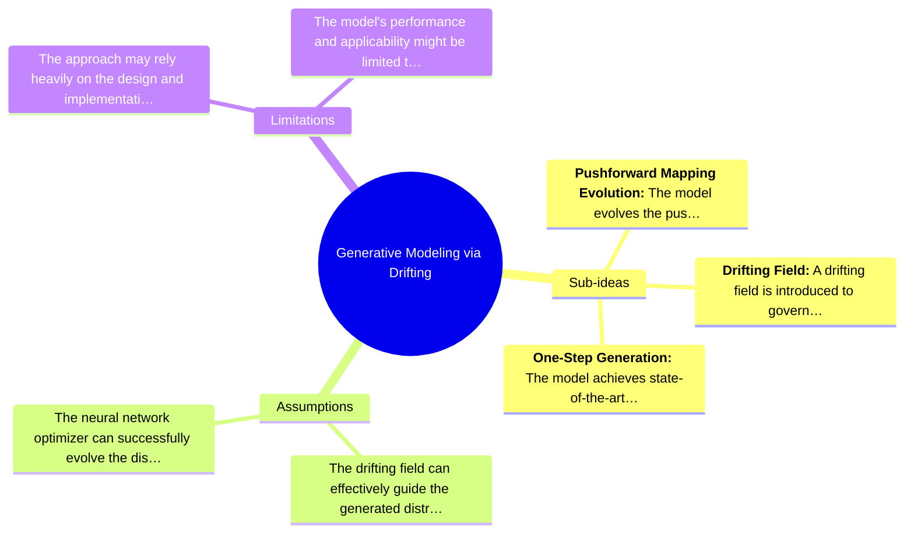

# Novelty Evaluation: Generative Modeling via Drifting

## Run Metadata

**Run context**

| Field | Value |
|-------|-------|
| Timestamp (America/New_York) | 2026-03-25 04:23:49 -0400 America/New_York (UTC: 2026-03-25T08:23:49Z) |
| Branch | main |
| Commit | [`9e95043`](https://github.com/yulinl2/Open-Idea-Sourcing/commit/9e950433de3fde602559ad15d1e934ce9f89d2a7) |
| CI Run | [Run #23531554865](https://github.com/yulinl2/Open-Idea-Sourcing/actions/runs/23531554865) |

**Configuration**

| Field | Value |
|-------|-------|
| Model | gpt-4o |
| Input | https://arxiv.org/pdf/2602.04770 |
| Code version | 1.3.0 |

**Performance**

| Field | Value |
|-------|-------|
| Total runtime | 53.2s |
| └─ parsing | 3.6s |
| └─ online_search | 2.5s |
| └─ similarity | 0.0s |
| └─ domain_references | 6.5s |
| └─ evaluation | 40.3s |

## Pipeline Job Log

```mermaid
gantt
    title Pipeline Run — Generative Modeling via Drifting
    dateFormat x
    axisFormat %S.%Ls
    section PaperParser
    Parse paper :done, 0, 3560ms
    section SemanticScholar API
    Online reference search :done, 3560, 2550ms
    section SimilaritySearch
    Similarity search :done, 6110, 10ms
    section LLM (gpt-4o)
    Domain references :done, 6120, 6480ms
    Idea decomposition :done, 12988, 7691ms
    Duplication check :done, 20679, 5034ms
    Combination check :done, 25713, 7653ms
    Equivalence check :done, 33366, 8089ms
    Synthesis :done, 41454, 3773ms
    Reference annotation :done, 45227, 8019ms
```



**PaperParser**

| # | Job | Start (s) | Duration (s) | Input | Output |
|---|-----|----------:|-------------:|-------|--------|
| 1 | Parse paper | 0.00 | 3.56 | 2602.04770.pdf | "Generative Modeling via Drifting", 77815 chars |

<details>
<summary>📋 Parse paper — details</summary>

**Title:** Generative Modeling via Drifting

**Authors:** *(not extracted)*

**Abstract:** *(not extracted)*

**Sections (52):**
- Generative Modeling via Drifting
- GenerativeModelingviaDrifting
- RelatedWork
- Agrowingbodyofworkhasfocusedonreducingthesteps
- GenerativeModelingviaDrifting
- GenerativeModelingviaDrifting
- GenerativeModelingviaDrifting
- Thefeatureextractorplaysanimportantroleinthegenera-
- ImplementationforImageGeneration
- Wedescribeourimplementationforimagegenerationon
- GenerativeModelingviaDrifting
- GenerativeModelingviaDrifting
- Multi-stepDiffusion/Flows
- Single-stepDiffusion/Flows
- Largersamplesizesareexpectedtoimprovetheaccuracy
- GenerativeModelingviaDrifting
- DiffusionPolicy DriftingPolicy
- ToolHang
- DriftingModels
- Kitchen

</details>

**SemanticScholar API**

| # | Job | Start (s) | Duration (s) | Input | Output |
|---|-----|----------:|-------------:|-------|--------|
| 2 | Online reference search | 3.56 | 2.55 | arXiv:2602.04770 + 4 LLM queries | 10 paper(s) fetched |

<details>
<summary>📋 Online reference search — details</summary>

**Queries used:**
1. generative modeling efficiency
2. drifting models generative
3. diffusion models generative
4. normalizing flows generative

**Fetched papers (10):**
1. **Improved Mean Flows: On the Challenges of Fastforward Generative Models** (2025)
2. **Adversarial Flow Models** (2025)
3. **PixelDiT: Pixel Diffusion Transformers for Image Generation** (2025)
4. **There is No VAE: End-to-End Pixel-Space Generative Modeling via Self-Supervised Pre-training** (2025)
5. **Contrastive Flow Matching** (2025)
6. **Mean Flows for One-step Generative Modeling** (2025)
7. **Inductive Moment Matching** (2025)
8. **Reconstruction vs. Generation: Taming Optimization Dilemma in Latent Diffusion Models** (2025)
9. **Normalizing Flows are Capable Generative Models** (2024)
10. **Simpler Diffusion (SiD2): 1.5 FID on ImageNet512 with pixel-space diffusion** (2024)

**Errors encountered:**
- ⚠️ query 'generative modeling efficiency': HTTP Error 429: 
- ⚠️ query 'drifting models generative': HTTP Error 429: 
- ⚠️ query 'diffusion models generative': HTTP Error 429: 
- ⚠️ query 'normalizing flows generative': HTTP Error 429: 

</details>

**SimilaritySearch**

| # | Job | Start (s) | Duration (s) | Input | Output |
|---|-----|----------:|-------------:|-------|--------|
| 3 | Similarity search | 6.11 | 0.01 | TF-IDF cosine on 11 ref(s) | top-5: 0.20×There is No VAE: End-to-End Pixel-S…; 0.20×Normalizing Flows are Capable Gener…; 0.17×Inductive Moment Matching; +2 more |

<details>
<summary>📋 Similarity search — details</summary>

**Query (key content excerpt):**
```
Title: Generative Modeling via Drifting

Generative Modeling via Drifting
MingyangDeng1 HeLi1 TianhongLi1 YilunDu2 KaimingHe1
Figure1.DriftingModel.Anetworkfperformsapushforwardoperation:q=f p ,mappingapriordistributionp (e.g.,Gaussian,
# prior prior
notshownhere)toapushforwarddistributionq(orange).…
```

**All matches (5):**
| Score | Title | Year |
|------:|-------|------|
| 0.204 | There is No VAE: End-to-End Pixel-Space Generative Modeling via Self-Supervised Pre-training | 2025 |
| 0.195 | Normalizing Flows are Capable Generative Models | 2024 |
| 0.167 | Inductive Moment Matching | 2025 |
| 0.153 | Mean Flows for One-step Generative Modeling | 2025 |
| 0.151 | Improved Mean Flows: On the Challenges of Fastforward Generative Models | 2025 |

</details>

**LLM (gpt-4o)**

| # | Job | Start (s) | Duration (s) | Input | Output |
|---|-----|----------:|-------------:|-------|--------|
| 4 | Domain references | 6.12 | 6.48 | paper content + 5 similar paper(s) | 5 domain reference(s) |
| 5 | Idea decomposition | 12.99 | 7.69 | paper content | 3 sub-idea(s) |
| 6 | Duplication check | 20.68 | 5.03 | paper content + 5 reference paper(s) | verdict=LOW** |
| 7 | Combination check | 25.71 | 7.65 | paper content + 5 reference paper(s) | verdict=MEDIUM** |
| 8 | Equivalence check | 33.37 | 8.09 | paper content + 5 reference paper(s) | verdict=HIGH |
| 9 | Synthesis | 41.45 | 3.77 | 3 dimension results | verdict=MARGINAL, confidence=MEDIUM |
| 10 | Reference annotation | 45.23 | 8.02 | paper + 5 similar paper(s) | 5 annotation(s) |

## Idea Decomposition

**Core concept:** The paper introduces "Drifting Models," a novel generative modeling paradigm that evolves the pushforward distribution during training, enabling high-quality one-step generation without iterative inference.

**Sub-ideas:**

- **Pushforward Mapping Evolution:** The model evolves the pushforward distribution during training, removing the need for iterative inference steps commonly seen in diffusion and flow-based models.
- **Drifting Field:** A drifting field is introduced to govern sample movement, achieving equilibrium when the generated distribution matches the data distribution, thus providing a loss function for training.
- **One-Step Generation:** The model achieves state-of-the-art results in one-step generation, demonstrating its effectiveness on complex datasets like ImageNet.

**Assumptions:**

- The drifting field can effectively guide the generated distribution to match the data distribution.
- The neural network optimizer can successfully evolve the distribution through iterative optimization during training.

**Limitations:**

- The approach may rely heavily on the design and implementation of the drifting field, which could be complex.
- The model's performance and applicability might be limited to specific types of data or distributions, as evidenced by the focus on ImageNet.

### Idea Mind Map



**Overall verdict:** ⚠️ **MARGINAL** (confidence: MEDIUM)

## Summary

The paper "Generative Modeling via Drifting" presents an interesting integration of existing generative modeling techniques, introducing the concept of "Drifting Models." While the approach is distinct in its framing and combines elements from diffusion models, normalizing flows, and moment matching, the core ideas are not significantly novel. The methodology appears to be a re-interpretation of established concepts, offering a new perspective rather than groundbreaking advancements. The novelty lies in the synthesis of these components, but the lack of a unifying insight that clearly advances the state of the art limits its overall impact.

## Detailed Analysis

### Direct Duplication

<details>
<summary><strong>Risk level:</strong> ❓ LOW**</summary>

The submitted paper, "Generative Modeling via Drifting," introduces a novel approach to generative modeling by focusing on the evolution of the pushforward distribution during training, which they term as "Drifting Models." This approach is distinct from existing methods like diffusion models and normalizing flows, which typically rely on iterative inference processes. The concept of a drifting field that governs sample movement and achieves equilibrium when distributions match is not directly duplicated in the reference papers. While there are similarities in the broader context of generative modeling, such as the use of pushforward distributions and the goal of one-step generation, the specific methodology and theoretical framework presented in the submitted paper appear to be original. The reference papers discuss related but distinct approaches, such as normalizing flows, moment matching, and pixel-space generative modeling, none of which directly replicate the core ideas of the submitted work.

</details>

### Simple Combination

<details>
<summary><strong>Risk level:</strong> ❓ MEDIUM**</summary>

The submitted paper "Generative Modeling via Drifting" introduces a concept called Drifting Models, which appears to be a synthesis of existing generative modeling techniques, particularly diffusion models and normalizing flows. The paper's core idea of evolving a pushforward distribution during training and achieving one-step inference is reminiscent of diffusion models, which iteratively refine samples, and normalizing flows, which perform transformations in a single step. The notion of a "drifting field" that governs sample movement is a novel element, but it is conceptually similar to the differential equations used in diffusion models to guide sample evolution. The paper also draws on ideas from moment matching, particularly in its use of kernel functions and sample discrepancies, which are common in Maximum Mean Discrepancy (MMD) approaches. While the combination of these elements into a single framework is interesting, the paper does not clearly demonstrate a unifying insight that significantly advances the state of the art beyond existing methods. The novelty primarily lies in the integration of these components rather than in a groundbreaking new concept.

**Cited references:** `f06c6995371d5490ee40b1d4226657e0834e34e6`, `b50e850a58b6fc41bbbbf05d199aa43dc581c163`, `19df654b0d0f634a451564346a09af8bd348dac0`

</details>

### Methodological Equivalence

<details>
<summary><strong>Risk level:</strong> 🔴 HIGH</summary>

The proposed "Drifting Models" in the submitted paper appear to be conceptually and mathematically equivalent to existing diffusion and flow-based generative models. The notion of evolving a pushforward distribution during training and achieving a match with the data distribution through a "drifting field" is reminiscent of the iterative refinement process in diffusion models, where samples are progressively denoised to match the data distribution. The "drifting field" that governs sample movement and achieves equilibrium when distributions match is analogous to the differential equations (SDEs/ODEs) used in diffusion models to guide the transformation of noise into data. Furthermore, the paper's emphasis on a one-step inference process aligns with recent advancements in normalizing flows and moment matching methods, which also aim to achieve efficient generative modeling with fewer steps. The conceptual framework of decomposing a complex transformation into a sequence of simpler ones is a well-established principle in flow-based models. Therefore, the novelty of the "Drifting Models" is limited, as it re-derives existing methodologies under a different framing and terminology.

**Cited references:** `f06c6995371d5490ee40b1d4226657e0834e34e6`, `b50e850a58b6fc41bbbbf05d199aa43dc581c163`, `19df654b0d0f634a451564346a09af8bd348dac0`

</details>

## Most Similar Reference Papers

> **Scoring method:** TF-IDF cosine similarity (0–1). Higher scores indicate greater textual overlap between the paper's key content and the reference.

| Score | Title | Year |
|-------|-------|------|
| 0.20 | [There is No VAE: End-to-End Pixel-Space Generative Modeling via Self-Supervised Pre-training](https://www.semanticscholar.org/paper/c3e4ff6e7fb7e65cec814c454cc42412a356f101) | 2025 |
| 0.20 | [Normalizing Flows are Capable Generative Models](https://www.semanticscholar.org/paper/f06c6995371d5490ee40b1d4226657e0834e34e6) | 2024 |
| 0.17 | [Inductive Moment Matching](https://www.semanticscholar.org/paper/b50e850a58b6fc41bbbbf05d199aa43dc581c163) | 2025 |
| 0.15 | [Mean Flows for One-step Generative Modeling](https://www.semanticscholar.org/paper/19df654b0d0f634a451564346a09af8bd348dac0) | 2025 |
| 0.15 | [Improved Mean Flows: On the Challenges of Fastforward Generative Models](https://www.semanticscholar.org/paper/2cc9d6d644ef0169a767c5cc76a7eeec77333ff1) | 2025 |

### Reference Annotations

**[0.20] [There is No VAE: End-to-End Pixel-Space Generative Modeling via Self-Supervised Pre-training](https://www.semanticscholar.org/paper/c3e4ff6e7fb7e65cec814c454cc42412a356f101) (2025)**

| Dimension | Notes |
|-----------|-------|
| **Overlap** | Both the submitted paper and this reference focus on generative modeling in pixel space, addressing the challenges associated with training such models. |
| **Differences** | The submitted paper introduces a novel Drifting Model paradigm that evolves the pushforward distribution during training, whereas the reference paper proposes a two-stage training framework for pixel-space diffusion. |
| **Derivation** | None identified. |

**[0.20] [Normalizing Flows are Capable Generative Models](https://www.semanticscholar.org/paper/f06c6995371d5490ee40b1d4226657e0834e34e6) (2024)**

| Dimension | Notes |
|-----------|-------|
| **Overlap** | Both papers discuss generative modeling techniques that involve mapping distributions, with the submitted paper focusing on Drifting Models and the reference on Normalizing Flows. |
| **Differences** | The submitted paper emphasizes a one-step generation process through a drifting field, while the reference highlights the capabilities of Normalizing Flows for density estimation and generative tasks. |
| **Derivation** | None identified. |

**[0.17] [Inductive Moment Matching](https://www.semanticscholar.org/paper/b50e850a58b6fc41bbbbf05d199aa43dc581c163) (2025)**

| Dimension | Notes |
|-----------|-------|
| **Overlap** | Both papers address the challenge of achieving efficient generative modeling with fewer inference steps, aiming for high-quality sample generation. |
| **Differences** | The submitted paper introduces a drifting field to govern sample movement during training, while the reference proposes Inductive Moment Matching as a new class of generative models for one- or few-step generation. |
| **Derivation** | None identified. |

**[0.15] [Mean Flows for One-step Generative Modeling](https://www.semanticscholar.org/paper/19df654b0d0f634a451564346a09af8bd348dac0) (2025)**

| Dimension | Notes |
|-----------|-------|
| **Overlap** | Both papers propose frameworks for one-step generative modeling, focusing on the efficiency of sample generation. |
| **Differences** | The submitted paper uses a drifting field to evolve the pushforward distribution, whereas the reference introduces the concept of average velocity to characterize flow fields in generative modeling. |
| **Derivation** | None identified. |

**[0.15] [Improved Mean Flows: On the Challenges of Fastforward Generative Models](https://www.semanticscholar.org/paper/2cc9d6d644ef0169a767c5cc76a7eeec77333ff1) (2025)**

| Dimension | Notes |
|-----------|-------|
| **Overlap** | Both papers explore one-step generative modeling frameworks, aiming to improve the efficiency and quality of generated samples. |
| **Differences** | The submitted paper presents a Drifting Model with a training objective that minimizes sample drift, while the reference discusses the challenges of the "fastforward" nature of MeanFlow and its impact on training objectives and guidance mechanisms. |
| **Derivation** | None identified. |

## Main Domain References

1. **[Deep Unsupervised Learning using Nonequilibrium Thermodynamics](https://www.semanticscholar.org/search?q=Deep+Unsupervised+Learning+using+Nonequilibrium+Thermodynamics&sort=Relevance)**, 2015
   *Jascha Sohl-Dickstein, Eric A. Weiss, Niru Maheswaranathan, Surya Ganguli*
   <details>
   <summary>Why this matters</summary>

   This paper introduces diffusion models, which are foundational to the generative modeling techniques discussed in "Generative Modeling via Drifting." The concept of iteratively refining samples is central to both diffusion models and the proposed drifting models.

   </details>

2. **[Denoising Diffusion Probabilistic Models](https://www.semanticscholar.org/search?q=Denoising+Diffusion+Probabilistic+Models&sort=Relevance)**, 2020
   *Jonathan Ho, Ajay Jain, Pieter Abbeel*
   <details>
   <summary>Why this matters</summary>

   This work advances diffusion models by introducing denoising diffusion probabilistic models, which are a key comparison point for the drifting models' approach to generative modeling.

   </details>

3. **[Flow Matching for Generative Modeling](https://www.semanticscholar.org/search?q=Flow+Matching+for+Generative+Modeling&sort=Relevance)**, 2022
   *Yaron Lipman, Yilun Du, Igor Mordatch*
   <details>
   <summary>Why this matters</summary>

   Flow-based models are closely related to the drifting models as both involve mapping distributions through transformations. This paper provides a basis for understanding the flow-based methods that the drifting models aim to improve upon.

   </details>

4. **[Variational Inference with Normalizing Flows](https://www.semanticscholar.org/search?q=Variational+Inference+with+Normalizing+Flows&sort=Relevance)**, 2015
   *Danilo Jimenez Rezende, Shakir Mohamed*
   <details>
   <summary>Why this matters</summary>

   Normalizing flows are a type of generative model that the drifting models aim to outperform in terms of efficiency and quality. Understanding normalizing flows is crucial for grasping the improvements proposed by drifting models.

   </details>

5. **[Maximum Mean Discrepancy for Generative Modeling](https://www.semanticscholar.org/search?q=Maximum+Mean+Discrepancy+for+Generative+Modeling&sort=Relevance)**, 2015
   *Krzysztof Dziugaite, Daniel Roy, Zoubin Ghahramani*
   <details>
   <summary>Why this matters</summary>

   Moment matching methods like Maximum Mean Discrepancy (MMD) are related to the drifting models' approach of evolving distributions. This paper provides foundational knowledge on MMD, which is conceptually linked to the drifting field introduced in the submitted paper.

   </details>
