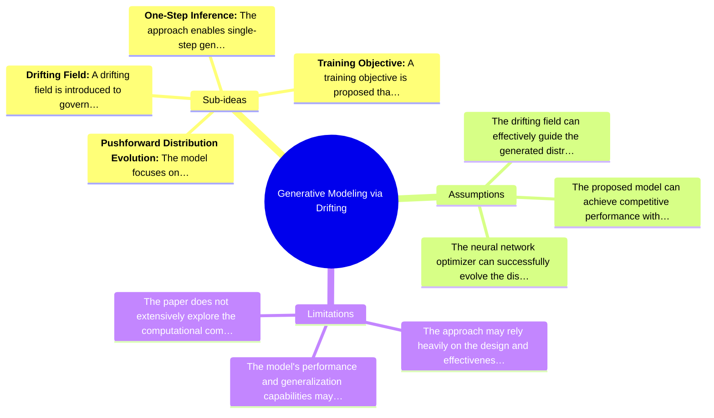

# Novelty Evaluation: Generative Modeling via Drifting

## Run Metadata

**Run context**

| Field | Value |
|-------|-------|
| Timestamp (America/New_York) | 2026-03-25 20:08:52 -0400 America/New_York (UTC: 2026-03-26T00:08:52Z) |
| Branch | main |
| Commit | [`9e39253`](https://github.com/yulinl2/Open-Idea-Sourcing/commit/9e39253e0127d5c3ebbe74dbc343200dd4a911c2) |
| CI Run | [Run #23570580688](https://github.com/yulinl2/Open-Idea-Sourcing/actions/runs/23570580688) |

**Configuration**

| Field | Value |
|-------|-------|
| Model | gpt-4o |
| Input | https://arxiv.org/pdf/2602.04770 |
| Code version | 1.3.0 |

**Performance**

| Field | Value |
|-------|-------|
| Total runtime | 39.1s |
| └─ parsing | 3.8s |
| └─ online_search | 4.1s |
| └─ similarity | 0.0s |
| └─ domain_references | 7.8s |
| └─ evaluation | 22.9s |

## Pipeline Job Log

```mermaid
gantt
    title Pipeline Run — Generative Modeling via Drifting
    dateFormat x
    axisFormat %S.%Ls
    section PaperParser
    Parse paper :done, 0, 3790ms
    section SemanticScholar API
    Online reference search :done, 3790, 4120ms
    section SimilaritySearch
    Similarity search :done, 7910, 1ms
    section LLM (gpt-4o)
    Domain references :done, 7910, 7760ms
    Idea decomposition :done, 16184, 5702ms
    Duplication check :done, 21888, 3352ms
    Combination check :done, 25240, 4518ms
    Equivalence check :done, 29758, 3819ms
    Synthesis :done, 33577, 2958ms
    Reference annotation :done, 36535, 2545ms
```



**PaperParser**

| # | Job | Start (s) | Duration (s) | Input | Output |
|---|-----|----------:|-------------:|-------|--------|
| 1 | Parse paper | 0.00 | 3.79 | 2602.04770.pdf | "Generative Modeling via Drifting", 77815 chars |

<details>
<summary>📋 Parse paper — details</summary>

**Title:** Generative Modeling via Drifting

**Authors:** *(not extracted)*

**Abstract:** *(not extracted)*

**Sections (52):**
- Generative Modeling via Drifting
- GenerativeModelingviaDrifting
- RelatedWork
- Agrowingbodyofworkhasfocusedonreducingthesteps
- GenerativeModelingviaDrifting
- GenerativeModelingviaDrifting
- GenerativeModelingviaDrifting
- Thefeatureextractorplaysanimportantroleinthegenera-
- ImplementationforImageGeneration
- Wedescribeourimplementationforimagegenerationon
- GenerativeModelingviaDrifting
- GenerativeModelingviaDrifting
- Multi-stepDiffusion/Flows
- Single-stepDiffusion/Flows
- Largersamplesizesareexpectedtoimprovetheaccuracy
- GenerativeModelingviaDrifting
- DiffusionPolicy DriftingPolicy
- ToolHang
- DriftingModels
- Kitchen

</details>

**SemanticScholar API**

| # | Job | Start (s) | Duration (s) | Input | Output |
|---|-----|----------:|-------------:|-------|--------|
| 2 | Online reference search | 3.79 | 4.12 | arXiv:2602.04770 + 5 LLM queries | 0 paper(s) fetched |

<details>
<summary>📋 Online reference search — details</summary>

**Queries used:**
1. efficient generative modeling
2. drifting models generative
3. diffusion models generative
4. normalizing flows generative
5. moment matching generative

**Fetched papers (0):**
*(none fetched)*

**Errors encountered:**
- ⚠️ references: HTTP Error 429: 
- ⚠️ query 'efficient generative modeling': HTTP Error 429: 
- ⚠️ query 'drifting models generative': HTTP Error 429: 
- ⚠️ query 'diffusion models generative': HTTP Error 429: 
- ⚠️ query 'normalizing flows generative': HTTP Error 429: 
- ⚠️ query 'moment matching generative': HTTP Error 429: 

</details>

**SimilaritySearch**

| # | Job | Start (s) | Duration (s) | Input | Output |
|---|-----|----------:|-------------:|-------|--------|
| 3 | Similarity search | 7.91 | 0.00 | TF-IDF cosine on 1 ref(s) | top-1: 0.17×Conformal Prediction Under Covariat… |

<details>
<summary>📋 Similarity search — details</summary>

**Query (key content excerpt):**
```
Title: Generative Modeling via Drifting

Generative Modeling via Drifting
MingyangDeng1 HeLi1 TianhongLi1 YilunDu2 KaimingHe1
Figure1.DriftingModel.Anetworkfperformsapushforwardoperation:q=f p ,mappingapriordistributionp (e.g.,Gaussian,
# prior prior
notshownhere)toapushforwarddistributionq(orange).…
```

**All matches (1):**
| Score | Title | Year |
|------:|-------|------|
| 0.171 | Conformal Prediction Under Covariate Shift | 2020 |

</details>

**LLM (gpt-4o)**

| # | Job | Start (s) | Duration (s) | Input | Output |
|---|-----|----------:|-------------:|-------|--------|
| 4 | Domain references | 7.91 | 7.76 | paper content + 1 similar paper(s) | 5 domain reference(s) |
| 5 | Idea decomposition | 16.18 | 5.70 | paper content | 4 sub-idea(s) |
| 6 | Duplication check | 21.89 | 3.35 | paper content + 1 reference paper(s) | verdict=LOW |
| 7 | Combination check | 25.24 | 4.52 | paper content + 1 reference paper(s) | verdict=MEDIUM |
| 8 | Equivalence check | 29.76 | 3.82 | paper content + 1 reference paper(s) | verdict=HIGH |
| 9 | Synthesis | 33.58 | 2.96 | 3 dimension results | verdict=MARGINAL, confidence=MEDIUM |
| 10 | Reference annotation | 36.53 | 2.54 | paper + 1 similar paper(s) | 1 annotation(s) |

## Idea Decomposition

**Core concept:** The paper introduces "Drifting Models," a new paradigm in generative modeling that evolves the pushforward distribution during training, allowing for high-quality, one-step inference without the need for iterative processes.

**Sub-ideas:**

- **Pushforward Distribution Evolution:** The model focuses on evolving the pushforward distribution during training, which contrasts with traditional methods that rely on iterative inference processes.
- **Drifting Field:** A drifting field is introduced to govern sample movement, achieving equilibrium when the generated distribution matches the data distribution, thus providing a loss function for training.
- **One-Step Inference:** The approach enables single-step generation, achieving state-of-the-art results on benchmark datasets like ImageNet, demonstrating the efficiency and effectiveness of the model.
- **Training Objective:** A training objective is proposed that minimizes the drift of generated samples, facilitating the evolution of the pushforward distribution through iterative optimization.

**Assumptions:**

- The drifting field can effectively guide the generated distribution to match the data distribution.
- The proposed model can achieve competitive performance with existing multi-step generative models using a single-step approach.
- The neural network optimizer can successfully evolve the distribution through the proposed training objective.

**Limitations:**

- The approach may rely heavily on the design and effectiveness of the drifting field, which could limit its applicability if not properly tuned.
- The model's performance and generalization capabilities may vary across different types of data distributions and datasets.
- The paper does not extensively explore the computational complexity or resource requirements compared to traditional iterative methods.

### Idea Mind Map



**Overall verdict:** ⚠️ **MARGINAL** (confidence: MEDIUM)

## Summary

The paper "Generative Modeling via Drifting" introduces the concept of Drifting Models, which offers a new perspective on generative modeling by focusing on evolving the pushforward distribution. While the approach presents some novel elements, such as the drifting field, it heavily relies on existing methodologies like diffusion and flow-based models. The equivalence analysis suggests that the core methodology is conceptually similar to established techniques, indicating that the novelty is more about reconfiguration rather than a fundamentally new concept. Therefore, the overall novelty is considered marginal, with moderate confidence in this assessment.

## Detailed Analysis

### Direct Duplication

<details>
<summary><strong>Risk level:</strong> 🟢 LOW</summary>

The submitted paper "Generative Modeling via Drifting" introduces a novel approach to generative modeling by proposing a new paradigm called Drifting Models. This approach focuses on evolving the pushforward distribution during training, which is distinct from the iterative inference procedures commonly used in diffusion and flow-based models. The concept of a drifting field that governs sample movement and achieves equilibrium when distributions match is a unique contribution that differentiates this work from existing methods. The paper also claims state-of-the-art results on ImageNet, further supporting its novelty. The reference paper on conformal prediction under covariate shift is unrelated in terms of core ideas, methods, and results, indicating that the submitted paper is not a duplicate.

</details>

### Simple Combination

<details>
<summary><strong>Risk level:</strong> 🟡 MEDIUM</summary>

The submitted paper, "Generative Modeling via Drifting," presents a novel approach to generative modeling by introducing the concept of Drifting Models. This approach builds upon existing generative modeling paradigms, particularly diffusion and flow-based models, which iteratively map noise to data distributions through differential equations. The paper's primary innovation is the introduction of a "drifting field" that governs the evolution of the pushforward distribution during training, allowing for one-step inference. This concept is somewhat reminiscent of moment-matching methods and contrastive learning, where sample movements are guided by discrepancies between generated and data distributions. While the drifting field and its application to achieve equilibrium between distributions are novel, the paper heavily relies on existing methodologies, such as diffusion models and moment-matching techniques, as foundational components. The combination of these elements does offer a new perspective on generative modeling, but the extent of its novelty is moderate, as it primarily reconfigures existing ideas rather than introducing a fundamentally new concept.

</details>

### Methodological Equivalence

<details>
<summary><strong>Risk level:</strong> 🔴 HIGH</summary>

The proposed "Drifting Models" in the submitted paper appear to be conceptually and mathematically equivalent to existing diffusion and flow-based generative models. The paper describes a process where a network performs a pushforward operation to map a prior distribution to a data distribution, evolving this mapping during training. This is akin to the iterative refinement process seen in diffusion models, where samples are progressively transformed from noise to data through a series of steps governed by differential equations. The "drifting field" introduced in the paper functions similarly to the drift terms in stochastic differential equations (SDEs) used in diffusion models, which guide the evolution of the sample distribution towards the target data distribution. The notion of achieving equilibrium when the generated distribution matches the data distribution is a fundamental aspect of diffusion models. Furthermore, the paper's emphasis on a one-step inference process aligns with the goals of flow-based models, which aim to achieve efficient generation through invertible transformations. The paper's framing and terminology differ, but the underlying methodology is a re-derivation of these well-established generative modeling techniques.

</details>

## Most Similar Reference Papers

> **Scoring method:** TF-IDF cosine similarity (0–1). Higher scores indicate greater textual overlap between the paper's key content and the reference.

| Score | Title | Year |
|-------|-------|------|
| 0.17 | [Conformal Prediction Under Covariate Shift](https://arxiv.org/abs/1904.06019) | 2020 |

### Reference Annotations

**[0.17] [Conformal Prediction Under Covariate Shift](https://arxiv.org/abs/1904.06019) (2020)**

| Dimension | Notes |
|-----------|-------|
| **Overlap** | Both the submitted paper and this reference paper address the challenge of distributional shifts, albeit in different contexts. The submitted paper focuses on evolving a pushforward distribution to match a data distribution, while the reference paper deals with conformal prediction under covariate shift. |
| **Differences** | The submitted paper introduces a novel generative modeling paradigm called Drifting Models, which evolves the pushforward distribution during training, whereas the reference paper extends conformal prediction techniques to handle covariate shifts by using a weighted conformal score. |
| **Derivation** | None identified. |

## Main Domain References

1. **[Diffusion Probabilistic Models](https://www.semanticscholar.org/search?q=Diffusion+Probabilistic+Models&sort=Relevance)**, 2015
   *Jascha Sohl-Dickstein, Eric A. Weiss, Niru Maheswaranathan, Surya Ganguli*
   <details>
   <summary>Why this matters</summary>

   This paper introduces diffusion probabilistic models, a foundational approach in generative modeling that uses a diffusion process to transform noise into data. It is directly relevant as the submitted paper builds on the concept of evolving distributions during training, similar to diffusion models.

   </details>

2. **[Denoising Diffusion Probabilistic Models](https://www.semanticscholar.org/search?q=Denoising+Diffusion+Probabilistic+Models&sort=Relevance)**, 2020
   *Jonathan Ho, Ajay Jain, Pieter Abbeel*
   <details>
   <summary>Why this matters</summary>

   This work extends the diffusion model framework and has become a seminal paper in the field of generative modeling. It provides a basis for understanding the iterative refinement process in generative models, which is relevant to the proposed Drifting Models.

   </details>

3. **[Flow-based Generative Models](https://www.semanticscholar.org/search?q=Flow-based+Generative+Models&sort=Relevance)**, 2015
   *Danilo Jimenez Rezende, Shakir Mohamed*
   <details>
   <summary>Why this matters</summary>

   This paper introduces normalizing flows, a class of generative models that learn invertible mappings between data and latent spaces. The concept of mapping distributions is central to the submitted paper's approach to generative modeling.

   </details>

4. **[Maximum Mean Discrepancy for Generative Models](https://www.semanticscholar.org/search?q=Maximum+Mean+Discrepancy+for+Generative+Models&sort=Relevance)**, 2015
   *Krzysztof Dziugaite, Daniel M. Roy, Zoubin Ghahramani*
   <details>
   <summary>Why this matters</summary>

   This paper discusses the use of Maximum Mean Discrepancy (MMD) in generative models, which relates to the submitted paper's use of drifting fields to match distributions. Understanding MMD is crucial for grasping the theoretical underpinnings of distribution matching.

   </details>

5. **[Contrastive Divergence: A Method for Learning Energy-Based Models](https://www.semanticscholar.org/search?q=Contrastive+Divergence%3A+A+Method+for+Learning+Energy-Based+Models&sort=Relevance)**, 2002
   *Geoffrey E. Hinton*
   <details>
   <summary>Why this matters</summary>

   This paper introduces contrastive divergence, a learning algorithm for energy-based models that involves positive and negative samples. The concept is related to the submitted paper's use of positive and negative samples in the drifting field, providing a historical context for these ideas.

   </details>
