# Novelty Evaluation: Generative Modeling via Drifting

## Run Metadata

**Run context**

| Field | Value |
|-------|-------|
| Timestamp (America/New_York) | 2026-03-25 05:25:59 -0400 America/New_York (UTC: 2026-03-25T09:25:59Z) |
| Branch | copilot/refactor-architecture-to-linear-pipeline |
| Commit | [`d64e9ef`](https://github.com/yulinl2/Open-Idea-Sourcing/commit/d64e9efa93deb74dd90b060d07f29692fa761c2b) |
| CI Run | [Run #23533840640](https://github.com/yulinl2/Open-Idea-Sourcing/actions/runs/23533840640) |

**Configuration**

| Field | Value |
|-------|-------|
| Model | gpt-4o |
| Input | https://arxiv.org/pdf/2602.04770 |
| Code version | 2.0.0 |

**Performance**

| Field | Value |
|-------|-------|
| Total runtime | 46.0s |
| └─ parsing | 3.7s |
| └─ online_search | 4.5s |
| └─ similarity | 0.0s |
| └─ domain_references | 5.6s |
| └─ evaluation | 31.6s |

## Pipeline Job Log

```mermaid
gantt
    title Pipeline Run — Generative Modeling via Drifting
    dateFormat x
    axisFormat %S.%Ls
    section PaperParser
    Parse paper :done, 0, 3700ms
    section SemanticScholar API
    Online reference search :done, 3700, 4450ms
    section SimilaritySearch
    Similarity search :done, 8150, 10ms
    section LLM (gpt-4o)
    Domain references :done, 8160, 5560ms
    Idea decomposition :done, 14419, 7478ms
    Duplication check :done, 21896, 2850ms
    Combination check :done, 24747, 6668ms
    Equivalence check :done, 31414, 3629ms
    Synthesis :done, 35044, 2589ms
    Reference annotation :done, 37632, 8407ms
```



**PaperParser**

| # | Job | Start (s) | Duration (s) | Input | Output |
|---|-----|----------:|-------------:|-------|--------|
| 1 | Parse paper | 0.00 | 3.70 | 2602.04770.pdf | "Generative Modeling via Drifting", 77815 chars |

<details>
<summary>📋 Parse paper — details</summary>

**Title:** Generative Modeling via Drifting

**Authors:** *(not extracted)*

**Abstract:** *(not extracted)*

**Sections (52):**
- Generative Modeling via Drifting
- GenerativeModelingviaDrifting
- RelatedWork
- Agrowingbodyofworkhasfocusedonreducingthesteps
- GenerativeModelingviaDrifting
- GenerativeModelingviaDrifting
- GenerativeModelingviaDrifting
- Thefeatureextractorplaysanimportantroleinthegenera-
- ImplementationforImageGeneration
- Wedescribeourimplementationforimagegenerationon
- GenerativeModelingviaDrifting
- GenerativeModelingviaDrifting
- Multi-stepDiffusion/Flows
- Single-stepDiffusion/Flows
- Largersamplesizesareexpectedtoimprovetheaccuracy
- GenerativeModelingviaDrifting
- DiffusionPolicy DriftingPolicy
- ToolHang
- DriftingModels
- Kitchen

</details>

**SemanticScholar API**

| # | Job | Start (s) | Duration (s) | Input | Output |
|---|-----|----------:|-------------:|-------|--------|
| 2 | Online reference search | 3.70 | 4.45 | arXiv:2602.04770 + 5 LLM queries | 10 paper(s) fetched |

<details>
<summary>📋 Online reference search — details</summary>

**Queries used:**
1. generative modeling efficiency
2. drifting models generative
3. diffusion models generative
4. normalizing flows generative
5. moment matching generative

**Fetched papers (10):**
1. **Improved Mean Flows: On the Challenges of Fastforward Generative Models** (2025)
2. **Adversarial Flow Models** (2025)
3. **PixelDiT: Pixel Diffusion Transformers for Image Generation** (2025)
4. **There is No VAE: End-to-End Pixel-Space Generative Modeling via Self-Supervised Pre-training** (2025)
5. **Contrastive Flow Matching** (2025)
6. **Mean Flows for One-step Generative Modeling** (2025)
7. **Inductive Moment Matching** (2025)
8. **Reconstruction vs. Generation: Taming Optimization Dilemma in Latent Diffusion Models** (2025)
9. **Normalizing Flows are Capable Generative Models** (2024)
10. **Simpler Diffusion (SiD2): 1.5 FID on ImageNet512 with pixel-space diffusion** (2024)

**Errors encountered:**
- ⚠️ query 'generative modeling efficiency': HTTP Error 429: 
- ⚠️ query 'drifting models generative': HTTP Error 429: 
- ⚠️ query 'diffusion models generative': HTTP Error 429: 
- ⚠️ query 'normalizing flows generative': HTTP Error 429: 

</details>

**SimilaritySearch**

| # | Job | Start (s) | Duration (s) | Input | Output |
|---|-----|----------:|-------------:|-------|--------|
| 3 | Similarity search | 8.15 | 0.01 | TF-IDF cosine on 11 ref(s) | top-5: 0.20×There is No VAE: End-to-End Pixel-S…; 0.20×Normalizing Flows are Capable Gener…; 0.17×Inductive Moment Matching; +2 more |

<details>
<summary>📋 Similarity search — details</summary>

**Query (key content excerpt):**
```
Title: Generative Modeling via Drifting

Generative Modeling via Drifting
MingyangDeng1 HeLi1 TianhongLi1 YilunDu2 KaimingHe1
Figure1.DriftingModel.Anetworkfperformsapushforwardoperation:q=f p ,mappingapriordistributionp (e.g.,Gaussian,
# prior prior
notshownhere)toapushforwarddistributionq(orange).…
```

**All matches (5):**
| Score | Title | Year |
|------:|-------|------|
| 0.204 | There is No VAE: End-to-End Pixel-Space Generative Modeling via Self-Supervised Pre-training | 2025 |
| 0.195 | Normalizing Flows are Capable Generative Models | 2024 |
| 0.167 | Inductive Moment Matching | 2025 |
| 0.153 | Mean Flows for One-step Generative Modeling | 2025 |
| 0.151 | Improved Mean Flows: On the Challenges of Fastforward Generative Models | 2025 |

</details>

**LLM (gpt-4o)**

| # | Job | Start (s) | Duration (s) | Input | Output |
|---|-----|----------:|-------------:|-------|--------|
| 4 | Domain references | 8.16 | 5.56 | paper content + 5 similar paper(s) | 5 domain reference(s) |
| 5 | Idea decomposition | 14.42 | 7.48 | paper content | 3 sub-idea(s) |
| 6 | Duplication check | 21.90 | 2.85 | paper content + 5 reference paper(s) | verdict=LOW** |
| 7 | Combination check | 24.75 | 6.67 | paper content + 5 reference paper(s) | verdict=MEDIUM** |
| 8 | Equivalence check | 31.41 | 3.63 | paper content + 5 reference paper(s) | verdict=HIGH |
| 9 | Synthesis | 35.04 | 2.59 | 3 dimension results | verdict=MARGINAL, confidence=MEDIUM |
| 10 | Reference annotation | 37.63 | 8.41 | paper + 5 similar paper(s) | 5 annotation(s) |

## Idea Decomposition

**Core concept:** The paper introduces "Drifting Models," a new paradigm for generative modeling that evolves the pushforward distribution during training, enabling high-quality one-step inference.

### Concept Tree

```
Generative Modeling via Drifting
├── Problem: Matching generated distribution to data distribution
│   ├── Gap: Existing models require iterative inference procedures
│   └── Metric: FID score on ImageNet 256×256
├── Method: Drifting Models
│   ├── Drifting Field
│   │   ├── Governs sample movement
│   │   └── Achieves equilibrium when distributions match
│   ├── Training Objective
│   │   ├── Minimizes drift of generated samples
│   │   └── Evolves pushforward distribution through optimization
│   └── Single-Pass Network
│       ├── Non-iterative inference
│       └── Removes need for iterative procedures
└── Evidence
    ├── Empirical: State-of-the-art FID scores on ImageNet 256×256
    └── Theoretical: Conceptual framework for evolving pushforward distributions
```

**Sub-ideas:**

- Introduction of a drifting field that governs sample movement and achieves equilibrium when the generated distribution matches the data distribution.
- A training objective that minimizes the drift of generated samples, evolving the pushforward distribution through iterative optimization.
- Implementation of a single-pass, non-iterative network that removes the need for iterative inference procedures.

**Assumptions:**

- The drifting field can effectively guide the generated distribution to match the data distribution.
- The proposed method can achieve competitive performance with existing multi-step generative models.
- The neural network optimizer can effectively evolve the distribution through the proposed training objective.

**Limitations:**

- The effectiveness of the drifting field and the training objective may depend on specific data distributions and network architectures.
- The approach may not generalize well to all types of generative tasks or datasets.
- The paper primarily focuses on image generation, which may limit its applicability to other domains.

**Overall verdict:** ⚠️ **MARGINAL** (confidence: MEDIUM)

## Summary

The paper "Generative Modeling via Drifting" presents a novel synthesis of existing generative modeling techniques, introducing a unique approach termed Drifting Models. While the concept of evolving the pushforward distribution and achieving one-step inference is distinct, it heavily draws from established methodologies like diffusion models and normalizing flows. The combination of these elements into a single framework offers a potentially valuable contribution, particularly in simplifying the generative process, but does not represent a significant departure from current paradigms. The paper's novelty lies more in its integration of existing ideas rather than in introducing fundamentally new concepts.

## Detailed Analysis

### Direct Duplication

<details>
<summary><strong>Risk level:</strong> ❓ LOW**</summary>

The submitted paper "Generative Modeling via Drifting" introduces a novel approach to generative modeling by focusing on the evolution of the pushforward distribution during training, termed as Drifting Models. This method is distinct from existing paradigms such as diffusion models, flow-based models, and normalizing flows, which typically rely on iterative inference processes. The concept of a drifting field that governs sample movement and achieves equilibrium when distributions match is a unique contribution that differentiates it from prior works. The paper emphasizes a one-step inference process, which is not a common feature in the referenced papers. The most similar works, such as those on normalizing flows and moment matching, do not employ the same training-time evolution of the pushforward distribution or the specific drifting field mechanism described in this paper.

</details>

### Simple Combination

<details>
<summary><strong>Risk level:</strong> ❓ MEDIUM**</summary>

The submitted paper, "Generative Modeling via Drifting," introduces a novel approach to generative modeling by evolving the pushforward distribution during training, termed as Drifting Models. This concept appears to be a synthesis of existing methodologies, particularly diffusion models and normalizing flows, which are well-established in the field of generative modeling. The paper's core idea of a drifting field that governs sample movement and achieves equilibrium when the generated distribution matches the data distribution is reminiscent of the iterative refinement processes found in diffusion models (Sohl-Dickstein et al., 2015) and flow-based models (Lipman et al., 2022). The notion of one-step generation aligns with recent advancements in normalizing flows (Rezende & Mohamed, 2015) and moment matching methods (Dziugaite et al., 2015), which aim to reduce the complexity and computational cost of generative models. While the paper claims to offer a new paradigm by removing the need for iterative inference, the underlying principles and techniques are largely derived from existing works. The combination of these components into a single framework does provide a potentially valuable contribution, particularly in achieving state-of-the-art results in one-step generation, but it does not represent a groundbreaking departure from the current state of the art.

**Cited references:** `f06c6995371d5490ee40b1d4226657e0834e34e6`, `b50e850a58b6fc41bbbbf05d199aa43dc581c163`, `19df654b0d0f634a451564346a09af8bd348dac0`

</details>

### Methodological Equivalence

<details>
<summary><strong>Risk level:</strong> 🔴 HIGH</summary>

The proposed "Drifting Models" in the submitted paper appear to be conceptually and mathematically equivalent to existing diffusion and flow-based generative models. The notion of evolving a pushforward distribution during training and achieving a one-step inference is reminiscent of the methodologies employed in diffusion models and flow-based models. Specifically, the "drifting field" introduced in the paper functions similarly to the differential equations (SDEs or ODEs) used in diffusion models to guide the transformation of noise to data. The iterative nature of the training process, which the authors describe as evolving the pushforward distribution, aligns with the iterative optimization processes used in these established models. Furthermore, the concept of minimizing the drift of generated samples to evolve the distribution is akin to the optimization objectives in moment-matching methods, which aim to minimize discrepancies between generated and data distributions. The paper's approach of using a single-pass, non-iterative network for inference is also conceptually similar to the objectives of normalizing flows, which aim for efficient one-step generation.

**Cited references:** `f06c6995371d5490ee40b1d4226657e0834e34e6`, `b50e850a58b6fc41bbbbf05d199aa43dc581c163`, `19df654b0d0f634a451564346a09af8bd348dac0`

</details>

## Most Similar Reference Papers

> **Scoring method:** TF-IDF cosine similarity (0–1). Higher scores indicate greater textual overlap between the paper's key content and the reference.

| Score | Title | Year |
|-------|-------|------|
| 0.20 | [There is No VAE: End-to-End Pixel-Space Generative Modeling via Self-Supervised Pre-training](https://www.semanticscholar.org/paper/c3e4ff6e7fb7e65cec814c454cc42412a356f101) | 2025 |
| 0.20 | [Normalizing Flows are Capable Generative Models](https://www.semanticscholar.org/paper/f06c6995371d5490ee40b1d4226657e0834e34e6) | 2024 |
| 0.17 | [Inductive Moment Matching](https://www.semanticscholar.org/paper/b50e850a58b6fc41bbbbf05d199aa43dc581c163) | 2025 |
| 0.15 | [Mean Flows for One-step Generative Modeling](https://www.semanticscholar.org/paper/19df654b0d0f634a451564346a09af8bd348dac0) | 2025 |
| 0.15 | [Improved Mean Flows: On the Challenges of Fastforward Generative Models](https://www.semanticscholar.org/paper/2cc9d6d644ef0169a767c5cc76a7eeec77333ff1) | 2025 |

### Reference Annotations

**[0.20] [There is No VAE: End-to-End Pixel-Space Generative Modeling via Self-Supervised Pre-training](https://www.semanticscholar.org/paper/c3e4ff6e7fb7e65cec814c454cc42412a356f101) (2025)**

| Dimension | Notes |
|-----------|-------|
| **Overlap** | Both the submitted paper and this reference focus on improving generative modeling in pixel space, addressing the challenges associated with training and performance in this domain. |
| **Differences** | The submitted paper introduces a novel concept of Drifting Models with a drifting field for one-step inference, whereas the reference paper proposes a two-stage training framework for pixel-space diffusion models. |
| **Derivation** | None identified. |

**[0.20] [Normalizing Flows are Capable Generative Models](https://www.semanticscholar.org/paper/f06c6995371d5490ee40b1d4226657e0834e34e6) (2024)**

| Dimension | Notes |
|-----------|-------|
| **Overlap** | Both papers explore generative modeling techniques, with the submitted paper discussing flow-based models as part of its related work and the reference focusing on Normalizing Flows. |
| **Differences** | The submitted paper proposes a new paradigm with Drifting Models for one-step generation, while the reference paper emphasizes the capabilities of Normalizing Flows in density estimation and generative tasks. |
| **Derivation** | None identified. |

**[0.17] [Inductive Moment Matching](https://www.semanticscholar.org/paper/b50e850a58b6fc41bbbbf05d199aa43dc581c163) (2025)**

| Dimension | Notes |
|-----------|-------|
| **Overlap** | Both papers aim to improve the efficiency of generative models by reducing the number of inference steps, with the submitted paper focusing on one-step generation and the reference proposing Inductive Moment Matching for few-step models. |
| **Differences** | The submitted paper introduces a drifting field to govern sample movement, whereas the reference paper focuses on moment matching to address the trade-offs in diffusion and flow models. |
| **Derivation** | None identified. |

**[0.15] [Mean Flows for One-step Generative Modeling](https://www.semanticscholar.org/paper/19df654b0d0f634a451564346a09af8bd348dac0) (2025)**

| Dimension | Notes |
|-----------|-------|
| **Overlap** | Both papers propose frameworks for one-step generative modeling, with the submitted paper introducing Drifting Models and the reference discussing Mean Flows. |
| **Differences** | The submitted paper uses a drifting field to achieve equilibrium between distributions, while the reference paper introduces average velocity to characterize flow fields. |
| **Derivation** | None identified. |

**[0.15] [Improved Mean Flows: On the Challenges of Fastforward Generative Models](https://www.semanticscholar.org/paper/2cc9d6d644ef0169a767c5cc76a7eeec77333ff1) (2025)**

| Dimension | Notes |
|-----------|-------|
| **Overlap** | Both papers address challenges in one-step generative modeling, with the submitted paper proposing Drifting Models and the reference discussing improvements to Mean Flows. |
| **Differences** | The submitted paper focuses on the evolution of the pushforward distribution during training, whereas the reference paper highlights challenges in the training objective and guidance mechanism of Mean Flows. |
| **Derivation** | None identified. |

## Main Domain References

1. **[Diffusion Probabilistic Models](https://www.semanticscholar.org/search?q=Diffusion+Probabilistic+Models&sort=Relevance)**, 2015
   *Jascha Sohl-Dickstein, Eric A. Weiss, Niru Maheswaranathan, Surya Ganguli*
   <details>
   <summary>Why this matters</summary>

   This paper introduces diffusion probabilistic models, which are foundational to the understanding of generative models that use iterative noise-to-data mappings, a concept that is central to the proposed Drifting Models.

   </details>

2. **[Denoising Diffusion Probabilistic Models](https://www.semanticscholar.org/search?q=Denoising+Diffusion+Probabilistic+Models&sort=Relevance)**, 2020
   *Jonathan Ho, Ajay Jain, Pieter Abbeel*
   <details>
   <summary>Why this matters</summary>

   This work builds on the concept of diffusion models and provides a framework for generating high-quality samples, which is a key aspect of the generative modeling approach discussed in the submitted paper.

   </details>

3. **[Flow Matching for Generative Modeling](https://www.semanticscholar.org/search?q=Flow+Matching+for+Generative+Modeling&sort=Relevance)**, 2022
   *Yaron Lipman, Yilun Du, Igor Mordatch*
   <details>
   <summary>Why this matters</summary>

   The paper presents flow matching methods, which are closely related to the pushforward distribution evolution discussed in the Drifting Models. It provides insights into the transformation of distributions, a core concept in the submitted work.

   </details>

4. **[Variational Inference with Normalizing Flows](https://www.semanticscholar.org/search?q=Variational+Inference+with+Normalizing+Flows&sort=Relevance)**, 2015
   *Danilo Jimenez Rezende, Shakir Mohamed*
   <details>
   <summary>Why this matters</summary>

   This seminal work on normalizing flows introduces a method for learning complex distributions, which is relevant for understanding the pushforward mapping and distribution transformation in generative models.

   </details>

5. **[Maximum Mean Discrepancy for Generative Models](https://www.semanticscholar.org/search?q=Maximum+Mean+Discrepancy+for+Generative+Models&sort=Relevance)**, 2015
   *Krzysztof Dziugaite, Daniel M. Roy, Zoubin Ghahramani*
   <details>
   <summary>Why this matters</summary>

   This paper discusses moment matching methods, which are related to the concept of minimizing discrepancies between generated and data distributions, a principle that underlies the drifting field approach in the submitted paper.

   </details>
