# Novelty Evaluation: Generative Modeling via Drifting

## Run Metadata

**Run context**

| Field | Value |
|-------|-------|
| Timestamp (America/New_York) | 2026-03-25 17:46:38 -0400 America/New_York (UTC: 2026-03-25T21:46:38Z) |
| Branch | copilot/rebuild-project-from-scratch |
| Commit | [`8ac509c`](https://github.com/yulinl2/Open-Idea-Sourcing/commit/8ac509cdf6e8f5e1e17ed636e7c811671bdb0afe) |
| CI Run | [Run #23565674020](https://github.com/yulinl2/Open-Idea-Sourcing/actions/runs/23565674020) |

**Configuration**

| Field | Value |
|-------|-------|
| Model | gpt-4o |
| Input | https://arxiv.org/pdf/2602.04770 |
| Code version | 2.0.0 |

**Performance**

| Field | Value |
|-------|-------|
| Total runtime | 45.8s |
| └─ parsing | 3.8s |
| └─ decomposition | 5.4s |
| └─ online_search | 3.6s |
| └─ similarity | 0.0s |
| └─ domain_references | 7.0s |
| └─ evaluation | 25.4s |

## Pipeline Job Log

```mermaid
gantt
    title Pipeline Run — Generative Modeling via Drifting
    dateFormat x
    axisFormat %S.%Ls
    section PaperParser
    Parse paper :done, 0, 3780ms
    section LLM (gpt-4o)
    Idea decomposition :done, 3780, 5440ms
    section SemanticScholar API
    Online reference search :done, 9220, 3590ms
    section SimilaritySearch
    Similarity search :done, 12810, 10ms
    section LLM (gpt-4o)
    Domain references :done, 12820, 6960ms
    Duplication check :done, 20401, 3864ms
    Combination check :done, 24265, 6276ms
    Equivalence check :done, 30540, 5124ms
    Synthesis :done, 35664, 2110ms
    Reference annotation :done, 37775, 8013ms
```



**PaperParser**

| # | Job | Start (s) | Duration (s) | Input | Output |
|---|-----|----------:|-------------:|-------|--------|
| 1 | Parse paper | 0.00 | 3.78 | 2602.04770.pdf | "Generative Modeling via Drifting", 77815 chars |

<details>
<summary>📋 Parse paper — details</summary>

**Title:** Generative Modeling via Drifting

**Authors:** *(not extracted)*

**Abstract:** *(not extracted)*

**Sections (52):**
- Generative Modeling via Drifting
- GenerativeModelingviaDrifting
- RelatedWork
- Agrowingbodyofworkhasfocusedonreducingthesteps
- GenerativeModelingviaDrifting
- GenerativeModelingviaDrifting
- GenerativeModelingviaDrifting
- Thefeatureextractorplaysanimportantroleinthegenera-
- ImplementationforImageGeneration
- Wedescribeourimplementationforimagegenerationon
- GenerativeModelingviaDrifting
- GenerativeModelingviaDrifting
- Multi-stepDiffusion/Flows
- Single-stepDiffusion/Flows
- Largersamplesizesareexpectedtoimprovetheaccuracy
- GenerativeModelingviaDrifting
- DiffusionPolicy DriftingPolicy
- ToolHang
- DriftingModels
- Kitchen

</details>

**LLM (gpt-4o)**

| # | Job | Start (s) | Duration (s) | Input | Output |
|---|-----|----------:|-------------:|-------|--------|
| 2 | Idea decomposition | 3.78 | 5.44 | paper content | concept tree, 8 step(s) |

**SemanticScholar API**

| # | Job | Start (s) | Duration (s) | Input | Output |
|---|-----|----------:|-------------:|-------|--------|
| 3 | Online reference search | 9.22 | 3.59 | arXiv:2602.04770 + 4 LLM queries | 10 paper(s) fetched |

<details>
<summary>📋 Online reference search — details</summary>

**Queries used:**
1. generative model distribution mapping
2. drifting models generative approach
3. diffusion models generative modeling
4. normalizing flows generative models

**Fetched papers (10):**
1. **Improved Mean Flows: On the Challenges of Fastforward Generative Models** (2025)
2. **Adversarial Flow Models** (2025)
3. **PixelDiT: Pixel Diffusion Transformers for Image Generation** (2025)
4. **There is No VAE: End-to-End Pixel-Space Generative Modeling via Self-Supervised Pre-training** (2025)
5. **Contrastive Flow Matching** (2025)
6. **Mean Flows for One-step Generative Modeling** (2025)
7. **Inductive Moment Matching** (2025)
8. **Reconstruction vs. Generation: Taming Optimization Dilemma in Latent Diffusion Models** (2025)
9. **Normalizing Flows are Capable Generative Models** (2024)
10. **Simpler Diffusion (SiD2): 1.5 FID on ImageNet512 with pixel-space diffusion** (2024)

**Errors encountered:**
- ⚠️ query 'generative model distribution mapping': HTTP Error 429: 
- ⚠️ query 'drifting models generative approach': HTTP Error 429: 
- ⚠️ query 'diffusion models generative modeling': HTTP Error 429: 
- ⚠️ query 'normalizing flows generative models': HTTP Error 429: 

</details>

**SimilaritySearch**

| # | Job | Start (s) | Duration (s) | Input | Output |
|---|-----|----------:|-------------:|-------|--------|
| 4 | Similarity search | 12.81 | 0.01 | TF-IDF cosine on 11 ref(s) | top-5: 0.20×There is No VAE: End-to-End Pixel-S…; 0.20×Normalizing Flows are Capable Gener…; 0.17×Inductive Moment Matching; +2 more |

<details>
<summary>📋 Similarity search — details</summary>

**Query (key content excerpt):**
```
Title: Generative Modeling via Drifting

Generative Modeling via Drifting
MingyangDeng1 HeLi1 TianhongLi1 YilunDu2 KaimingHe1
Figure1.DriftingModel.Anetworkfperformsapushforwardoperation:q=f p ,mappingapriordistributionp (e.g.,Gaussian,
# prior prior
notshownhere)toapushforwarddistributionq(orange).…
```

**All matches (5):**
| Score | Title | Year |
|------:|-------|------|
| 0.204 | There is No VAE: End-to-End Pixel-Space Generative Modeling via Self-Supervised Pre-training | 2025 |
| 0.195 | Normalizing Flows are Capable Generative Models | 2024 |
| 0.167 | Inductive Moment Matching | 2025 |
| 0.153 | Mean Flows for One-step Generative Modeling | 2025 |
| 0.151 | Improved Mean Flows: On the Challenges of Fastforward Generative Models | 2025 |

</details>

**LLM (gpt-4o)**

| # | Job | Start (s) | Duration (s) | Input | Output |
|---|-----|----------:|-------------:|-------|--------|
| 5 | Domain references | 12.82 | 6.96 | paper content + 5 similar paper(s) | 5 domain reference(s) |
| 6 | Duplication check | 20.40 | 3.86 | paper content + 5 reference paper(s) | verdict=LOW** |
| 7 | Combination check | 24.27 | 6.28 | paper content + 5 reference paper(s) | verdict=MEDIUM |
| 8 | Equivalence check | 30.54 | 5.12 | paper content + 5 reference paper(s) | verdict=HIGH |
| 9 | Synthesis | 35.66 | 2.11 | 3 dimension results | verdict=MARGINAL, confidence=MEDIUM |
| 10 | Reference annotation | 37.77 | 8.01 | paper + 5 similar paper(s) | 5 annotation(s) |

## Idea Decomposition

**Core concept:** The paper introduces "Drifting Models," a novel generative modeling approach that evolves the pushforward distribution during training, allowing for high-quality one-step inference without iterative procedures.

### Concept Tree

```
├── Generative modeling challenge  
│   ├── Distribution mapping  
│   │   ├── Mapping from prior to data distribution  
│   │   └── Pushforward distribution  
│   └── Iterative inference  
│       ├── Diffusion models  
│       └── Flow-based models  
├── Method or approach  
│   └── Drifting Models  
│       ├── Pushforward evolution  
│       └── Drifting field  
│           ├── Governs sample movement  
│           └── Achieves equilibrium when distributions match  
└── Evidence  
    └── Experimental results  
        └── ImageNet 256×256  
            ├── FID 1.54 in latent space  
            └── FID 1.61 in pixel space
```

**Implementation roadmap:**

1. Define a prior distribution (e.g., Gaussian) to serve as the starting point for the generative process.
2. Design a neural network to represent the mapping function \( f \) that evolves the pushforward distribution.
3. Introduce a drifting field that governs the movement of samples during training, aiming to minimize the drift between generated and data distributions.
4. Develop a training objective that leverages the drifting field to iteratively optimize the neural network parameters.
5. Train the neural network using iterative optimization techniques (e.g., SGD) to evolve the pushforward distribution towards the data distribution.
6. Validate the model's performance on benchmark datasets, such as ImageNet, to assess the quality of one-step generation.
7. Compare the results with existing generative models to establish the state-of-the-art performance.
8. Fine-tune the model and drifting field parameters to further enhance generation quality and efficiency.

**Assumptions:**

- The drifting field can effectively guide the sample movement to achieve distribution matching.
- The neural network can learn a complex mapping function \( f \) that evolves the pushforward distribution during training.
- One-step inference is sufficient to achieve high-quality generative results comparable to iterative methods.

**Limitations:**

- The approach may rely heavily on the design and tuning of the drifting field, which could be complex.
- The method's performance might be dataset-dependent, requiring adjustments for different data distributions.
- The theoretical understanding of the drifting field's behavior and its convergence properties may need further exploration.

**Overall verdict:** ⚠️ **MARGINAL** (confidence: MEDIUM)

## Summary

The paper "Generative Modeling via Drifting" introduces a novel mechanism, the "drifting field," which offers a unique approach to generative modeling by enabling one-step inference through the evolution of the pushforward distribution. While this concept is distinct and potentially valuable, it shares significant conceptual and mathematical similarities with existing diffusion and flow-based models, as highlighted in the equivalence analysis. The combination of ideas, although innovative, does not sufficiently differentiate itself from established methodologies to warrant a verdict of high novelty. Nonetheless, the paper's approach and experimental results suggest a meaningful contribution to the field, justifying a marginal novelty verdict.

## Detailed Analysis

### Direct Duplication

<details>
<summary><strong>Risk level:</strong> ❓ LOW**</summary>

The submitted paper, "Generative Modeling via Drifting," presents a novel approach to generative modeling by introducing "Drifting Models." This method focuses on evolving the pushforward distribution during training, which allows for high-quality one-step inference without iterative procedures. The core idea of using a drifting field to govern sample movement and achieve equilibrium when distributions match is distinct from the referenced works. While the paper shares some conceptual similarities with existing methods like diffusion models, flow-based models, and normalizing flows, it introduces a unique mechanism for training-time evolution of the pushforward distribution, which is not directly duplicated in the referenced works. The novelty lies in the specific implementation of the drifting field and the training objective that minimizes sample drift, which is not found in the related literature.

</details>

### Simple Combination

<details>
<summary><strong>Risk level:</strong> 🟡 MEDIUM</summary>

The submitted paper introduces "Drifting Models," which appears to be a novel approach to generative modeling by evolving the pushforward distribution during training. This concept is somewhat reminiscent of existing diffusion and flow-based models, which also involve mapping from a prior distribution to a data distribution through iterative processes. However, the key innovation here is the introduction of a "drifting field" that governs sample movement and achieves equilibrium when the generated distribution matches the data distribution. This approach allows for one-step inference, which is a significant departure from the iterative inference required by traditional diffusion and flow-based models. While the paper draws on concepts from existing works, such as diffusion models (Sohl-Dickstein et al., 2015) and normalizing flows (Rezende & Mohamed, 2015), the combination of these ideas with the drifting field mechanism presents a potentially valuable contribution to the field of generative modeling. The experimental results, showing state-of-the-art performance on ImageNet, further suggest that this combination is not merely a simple aggregation of existing methods but offers a genuine insight into efficient generative modeling.

**Cited references:** `c3e4ff6e7fb7e65cec814c454cc42412a356f101`, `f06c6995371d5490ee40b1d4226657e0834e34e6`, `b50e850a58b6fc41bbbbf05d199aa43dc581c163`, `19df654b0d0f634a451564346a09af8bd348dac0`, `2cc9d6d644ef0169a767c5cc76a7eeec77333ff1`

</details>

### Methodological Equivalence

<details>
<summary><strong>Risk level:</strong> 🔴 HIGH</summary>

The proposed "Drifting Models" in the submitted paper appear to be conceptually and mathematically equivalent to well-established methodologies in generative modeling, particularly diffusion models and flow-based models. The core idea of evolving a pushforward distribution during training to achieve a one-step inference is reminiscent of the iterative refinement process seen in diffusion models, where samples are progressively denoised. The introduction of a "drifting field" that governs sample movement and achieves equilibrium when distributions match is conceptually similar to the use of differential equations in diffusion models to guide the transformation of noise into data. Furthermore, the paper's emphasis on a single-step ("1-NFE") generation aligns with recent advancements in reducing the number of steps required for inference in diffusion and flow models, as seen in methods like Inductive Moment Matching and Mean Flows. The iterative optimization process described in the paper also mirrors the training procedures used in these established models, where the mapping function is refined over time to better match the data distribution.

**Cited references:** `c3e4ff6e7fb7e65cec814c454cc42412a356f101`, `f06c6995371d5490ee40b1d4226657e0834e34e6`, `b50e850a58b6fc41bbbbf05d199aa43dc581c163`, `19df654b0d0f634a451564346a09af8bd348dac0`, `2cc9d6d644ef0169a767c5cc76a7eeec77333ff1`

</details>

## Most Similar Reference Papers

> **Scoring method:** TF-IDF cosine similarity (0–1). Higher scores indicate greater textual overlap between the paper's key content and the reference.

| Score | Title | Year |
|-------|-------|------|
| 0.20 | [There is No VAE: End-to-End Pixel-Space Generative Modeling via Self-Supervised Pre-training](https://www.semanticscholar.org/paper/c3e4ff6e7fb7e65cec814c454cc42412a356f101) | 2025 |
| 0.20 | [Normalizing Flows are Capable Generative Models](https://www.semanticscholar.org/paper/f06c6995371d5490ee40b1d4226657e0834e34e6) | 2024 |
| 0.17 | [Inductive Moment Matching](https://www.semanticscholar.org/paper/b50e850a58b6fc41bbbbf05d199aa43dc581c163) | 2025 |
| 0.15 | [Mean Flows for One-step Generative Modeling](https://www.semanticscholar.org/paper/19df654b0d0f634a451564346a09af8bd348dac0) | 2025 |
| 0.15 | [Improved Mean Flows: On the Challenges of Fastforward Generative Models](https://www.semanticscholar.org/paper/2cc9d6d644ef0169a767c5cc76a7eeec77333ff1) | 2025 |

### Reference Annotations

**[0.20] [There is No VAE: End-to-End Pixel-Space Generative Modeling via Self-Supervised Pre-training](https://www.semanticscholar.org/paper/c3e4ff6e7fb7e65cec814c454cc42412a356f101) (2025)**

| Dimension | Notes |
|-----------|-------|
| **Overlap** | Both papers address the challenge of generative modeling in pixel space and aim to improve the efficiency and performance of pixel-space generative models. |
| **Differences** | The submitted paper introduces Drifting Models with a focus on evolving the pushforward distribution during training for one-step inference, whereas the reference paper proposes a two-stage training framework for pixel-space diffusion models. |
| **Derivation** | None identified. |

**[0.20] [Normalizing Flows are Capable Generative Models](https://www.semanticscholar.org/paper/f06c6995371d5490ee40b1d4226657e0834e34e6) (2024)**

| Dimension | Notes |
|-----------|-------|
| **Overlap** | Both papers explore generative modeling techniques that involve mapping from a prior distribution to a data distribution, with the submitted paper focusing on pushforward distributions and the reference paper on Normalizing Flows. |
| **Differences** | The submitted paper introduces a novel Drifting Model approach for one-step generation, while the reference paper emphasizes the capabilities of Normalizing Flows for density estimation and generative tasks. |
| **Derivation** | None identified. |

**[0.17] [Inductive Moment Matching](https://www.semanticscholar.org/paper/b50e850a58b6fc41bbbbf05d199aa43dc581c163) (2025)**

| Dimension | Notes |
|-----------|-------|
| **Overlap** | Both papers aim to improve the efficiency of generative models by reducing the number of inference steps required, with the submitted paper focusing on one-step generation via Drifting Models. |
| **Differences** | The submitted paper introduces a drifting field to govern sample movement during training, whereas the reference paper proposes Inductive Moment Matching for one- or few-step generative modeling. |
| **Derivation** | None identified. |

**[0.15] [Mean Flows for One-step Generative Modeling](https://www.semanticscholar.org/paper/19df654b0d0f634a451564346a09af8bd348dac0) (2025)**

| Dimension | Notes |
|-----------|-------|
| **Overlap** | Both papers propose frameworks for one-step generative modeling, with the submitted paper introducing Drifting Models and the reference paper focusing on Mean Flows. |
| **Differences** | The submitted paper uses a drifting field to achieve equilibrium between distributions, while the reference paper introduces the concept of average velocity to characterize flow fields. |
| **Derivation** | None identified. |

**[0.15] [Improved Mean Flows: On the Challenges of Fastforward Generative Models](https://www.semanticscholar.org/paper/2cc9d6d644ef0169a767c5cc76a7eeec77333ff1) (2025)**

| Dimension | Notes |
|-----------|-------|
| **Overlap** | Both papers address challenges in one-step generative modeling, with the submitted paper proposing Drifting Models and the reference paper discussing the MeanFlow framework. |
| **Differences** | The submitted paper focuses on evolving the pushforward distribution with a drifting field, while the reference paper highlights challenges related to the "fastforward" nature of MeanFlow and its training objectives. |
| **Derivation** | None identified. |

## Main Domain References

1. **[Diffusion Probabilistic Models](https://www.semanticscholar.org/search?q=Diffusion+Probabilistic+Models&sort=Relevance)**, 2015
   *Jascha Sohl-Dickstein, Eric A. Weiss, Niru Maheswaranathan, Surya Ganguli*
   <details>
   <summary>Why this matters</summary>

   This paper introduces diffusion models, which are foundational for understanding the iterative noise-to-data mapping process that is central to the generative modeling techniques discussed in the submitted paper.

   </details>

2. **[Denoising Diffusion Probabilistic Models](https://www.semanticscholar.org/search?q=Denoising+Diffusion+Probabilistic+Models&sort=Relevance)**, 2020
   *Jonathan Ho, Ajay Jain, Pieter Abbeel*
   <details>
   <summary>Why this matters</summary>

   This work builds on the concept of diffusion models and presents a denoising approach, which is crucial for understanding the iterative refinement process in generative models, a concept that the submitted paper seeks to improve upon with its one-step generation approach.

   </details>

3. **[Flow Matching for Generative Modeling](https://www.semanticscholar.org/search?q=Flow+Matching+for+Generative+Modeling&sort=Relevance)**, 2022
   *Yaron Lipman, Ronen Eldan, Dan Mikulincer*
   <details>
   <summary>Why this matters</summary>

   Flow Matching is a related approach that involves mapping distributions through differential equations, similar to the diffusion models. The submitted paper references this as a prevailing paradigm that it aims to enhance with its Drifting Models.

   </details>

4. **[Variational Inference with Normalizing Flows](https://www.semanticscholar.org/search?q=Variational+Inference+with+Normalizing+Flows&sort=Relevance)**, 2015
   *Danilo Jimenez Rezende, Shakir Mohamed*
   <details>
   <summary>Why this matters</summary>

   This paper introduces Normalizing Flows, a method for transforming distributions that is relevant for understanding the pushforward mapping concept in generative models, which is a key aspect of the submitted paper's methodology.

   </details>

5. **[Maximum Mean Discrepancy for Generative Modeling](https://www.semanticscholar.org/search?q=Maximum+Mean+Discrepancy+for+Generative+Modeling&sort=Relevance)**, 2015
   *Krzysztof Dziugaite, Daniel M. Roy, Zoubin Ghahramani*
   <details>
   <summary>Why this matters</summary>

   This work on moment matching and Maximum Mean Discrepancy (MMD) provides a basis for understanding the statistical measures used to evaluate the similarity between generated and data distributions, which is relevant to the evaluation of the Drifting Models proposed in the submitted paper.

   </details>
